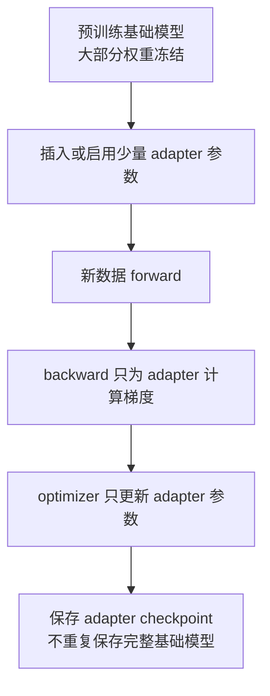
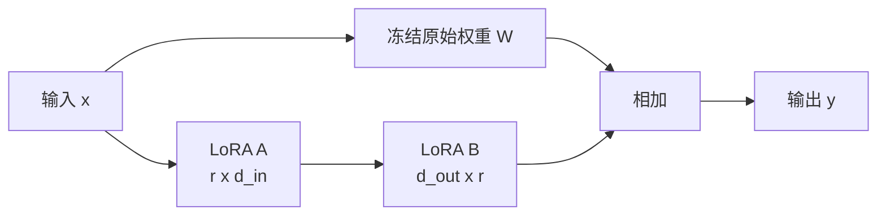
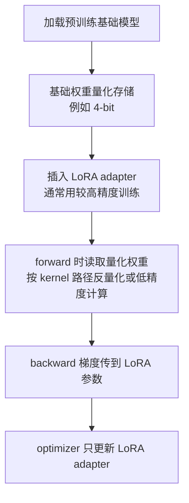

# 参数高效微调：LoRA、QLoRA 与 Adapter 系统优化

参数高效微调，英文常叫 Parameter-Efficient Fine-Tuning，简称 PEFT。它解决的问题不是“怎么从零训练一个更强模型”，而是：

> 已经有一个很大的预训练模型时，如何用更少显存、更短时间、更小 checkpoint 和更低平台成本，让它适配一个新任务或新数据域。

从训练系统角度看，PEFT 的核心价值在于改变训练状态的规模。全量微调会让几乎所有参数都需要 gradient、optimizer state 和 checkpoint；LoRA / QLoRA 这类方法则冻结大部分基础权重，只训练很小的一组 adapter 参数。

这篇不重点比较模型效果，也不深入讲各种 PEFT 论文变体。重点回答系统问题：

- 全量微调为什么贵。
- LoRA 为什么能大幅减少 trainable parameters。
- QLoRA 为什么能进一步降低基础权重显存。
- Adapter checkpoint 应该怎样管理。
- LoRA / QLoRA 与 activation、optimizer、FSDP/ZeRO、推理服务和 benchmark 有什么关系。

## 先理解全量微调为什么贵

全量微调的流程很直观：

```text
加载预训练模型
-> 用新数据做 forward
-> 计算 loss
-> backward 得到所有可训练参数的 gradient
-> optimizer 更新所有可训练参数
-> 保存新的完整模型权重和训练状态
```

如果模型有 `N` 个参数，并且所有参数都参与训练，那么系统要承担这些成本：

| 对象 | 是否接近 `N` 规模 | 说明 |
| --- | --- | --- |
| Parameters | 是 | 模型权重本身。 |
| Gradients | 是 | 每个可训练参数都要有梯度。 |
| Optimizer states | 是 | AdamW 通常有一阶矩和二阶矩。 |
| Master weights | 可能是 | 混合精度训练里可能保留 FP32 副本。 |
| Checkpoint | 是 | 常常保存完整模型和 optimizer state。 |

以 AdamW 混合精度训练粗略估算，如果每个参数有 BF16 parameter、BF16 gradient、FP32 master weight、FP32 `m`、FP32 `v`：

```text
2 + 2 + 4 + 4 + 4 = 16 bytes / parameter
```

7B 参数模型就是：

```text
7B * 16 bytes = 112GB
```

这还没有算 activation、temporary buffer、通信 buffer、allocator 碎片和 checkpoint 峰值。

所以全量微调贵，不只是因为模型权重大，而是因为“每个可训练参数”都会拖出 gradient、optimizer state、通信和保存成本。

## PEFT 的基本思想

PEFT 的思路是：不要动大部分基础权重，只训练少量新增参数或少量被选中的参数。



这会带来几个直接变化：

- trainable parameters 下降。
- gradients 下降。
- optimizer states 下降。
- checkpoint 变小。
- 单个微调任务更容易放进较少 GPU。
- 同一个基础模型可以挂很多个任务 adapter。

但也要立刻补一句：PEFT 不是把训练成本全部消掉。Forward/backward 仍然要穿过基础模型，activation 仍然会随 batch size、sequence length 和模型深度增长。

一句话：

> PEFT 主要减少参数相关状态，不自动减少所有 activation 成本。

## LoRA 在做什么

LoRA 是 Low-Rank Adaptation。它的直觉是：微调时对一个大权重矩阵的改动，不一定需要重新学习一个完整的大矩阵，可以用两个小矩阵表示这次改动。

假设原始线性层权重是：

```text
W: d_out x d_in
```

全量微调会直接更新 `W`。LoRA 冻结 `W`，只学习一个低秩增量：

```text
W' = W + ΔW
ΔW = B @ A
```

其中：

```text
A: r x d_in
B: d_out x r
```

`r` 是 rank，通常远小于 `d_in` 和 `d_out`。

用图表示：



原始大矩阵参数量是：

```text
d_out * d_in
```

LoRA 新增参数量是：

```text
r * d_in + d_out * r
= r * (d_in + d_out)
```

如果 `d_in = d_out = 4096`，原始矩阵参数量是：

```text
4096 * 4096 = 16,777,216
```

如果 LoRA rank `r = 16`，新增参数量是：

```text
16 * (4096 + 4096) = 131,072
```

这一层只训练原来的约 0.78% 参数。

## LoRA 为什么成立

LoRA 的理论直觉可以浅显理解成两点。

第一，预训练模型已经学到了大量通用能力。微调不是从零学语言、世界知识或代码模式，而是在已有能力上做偏移。这个偏移往往比完整模型小得多。

第二，很多任务适配可能不需要在所有方向上自由改变权重。用低秩矩阵表示 `ΔW`，相当于限制“本次微调能改变的方向”。如果 rank 足够覆盖任务需要的主要变化，就能用少量参数完成适配。

这不是说所有任务都适合低秩更新，也不是说 rank 越低越好。它只是说明：对很多微调场景，完整更新空间过大，低秩更新是一个有效的系统折中。

## LoRA 常见插入位置

Transformer 里 LoRA 通常挂在线性层上。

常见目标模块包括：

| 模块 | 常见名字 | 系统影响 |
| --- | --- | --- |
| Attention Q projection | `q_proj`、`query` | 影响查询向量生成。 |
| Attention K projection | `k_proj`、`key` | 影响 key 表示。 |
| Attention V projection | `v_proj`、`value` | 常见 LoRA 目标。 |
| Attention output projection | `o_proj`、`out_proj` | 影响 attention 输出回写。 |
| MLP up / gate | `up_proj`、`gate_proj` | 参数量大，训练成本也会增加。 |
| MLP down | `down_proj` | 常见扩展目标。 |
| Embedding / LM head | `embed_tokens`、`lm_head` | 是否训练要谨慎，checkpoint 和推理兼容性更复杂。 |

只挂 attention 的 LoRA 参数少、速度快、显存低；同时挂 attention 和 MLP，表达能力更强，但训练参数、optimizer state、通信和 checkpoint 都会增加。

从系统角度看，`target_modules` 不是一个纯算法配置，而是资源配置：

- 目标模块越多，trainable parameters 越多。
- LoRA rank 越高，adapter 权重越大。
- 可训练模块越多，optimizer step 和 gradient sync 越重。
- checkpoint 越大，adapter 加载和多租户管理越复杂。

## LoRA 的关键配置

常见 LoRA 配置包括：

| 配置 | 含义 | 系统视角 |
| --- | --- | --- |
| `r` | 低秩矩阵 rank | 直接决定新增参数量和 adapter 大小。 |
| `lora_alpha` | LoRA 缩放系数 | 影响更新尺度，通常和 rank 一起调。 |
| `lora_dropout` | LoRA 分支 dropout | 训练正则化，可能略影响训练吞吐。 |
| `target_modules` | 插入 LoRA 的模块 | 决定哪些矩阵增加可训练分支。 |
| `bias` | 是否训练 bias | 会影响 checkpoint 和参数分组。 |
| `modules_to_save` | 额外保存的模块 | 常用于分类头、特殊 head、embedding 等。 |

最容易犯的错误是只记住 `r`，忽略 `target_modules`。两个实验都叫 LoRA rank 16，但一个只训练 `q_proj/v_proj`，另一个训练 attention + MLP，系统成本和效果都可能完全不同。

## QLoRA 在 LoRA 上又做了什么

LoRA 冻结基础模型，但基础模型权重仍然要放进显存。对于更大模型，单是加载 BF16/FP16 基础权重就可能很贵。

QLoRA 的思路是：

> 把冻结的基础模型权重量化到低 bit，常见是 4-bit；训练时梯度通过量化基础模型回传到 LoRA adapter，只更新 LoRA 参数。

简化流程是：



QLoRA 减少的是冻结基础权重的显存占用，同时保留 LoRA 的小训练状态。原始 QLoRA 工作还引入了 NF4、double quantization 和 paged optimizer 等技术，用来进一步减少显存占用和管理显存峰值。

但是 QLoRA 不应该被理解成“4-bit 训练全模型”。它更准确地说是：

- 冻结基础权重量化保存。
- LoRA adapter 作为可训练参数。
- 梯度主要用于更新 adapter。
- activation、临时 buffer 和部分反量化计算仍然存在。

## LoRA、QLoRA、全量微调对比

| 方式 | 基础权重 | 可训练参数 | Optimizer state | Checkpoint | 典型适用场景 |
| --- | --- | --- | --- | --- | --- |
| 全量微调 | 通常 BF16/FP16/FP32 | 大部分或全部参数 | 大 | 完整模型和 optimizer | 高价值任务、需要深度改写模型能力。 |
| LoRA | 冻结，常用 BF16/FP16 | 少量 adapter | 小 | adapter 为主 | 指令微调、领域适配、多任务 adapter。 |
| QLoRA | 冻结并低 bit 量化 | 少量 adapter | 小 | adapter + quant 配置 | 显存紧张、较大模型微调、实验探索。 |

注意这张表只比较参数状态。Activation 成本仍然由模型结构、sequence length、batch、checkpointing 和 attention 实现决定。

## 显存组成如何变化

PEFT 以后，训练显存大致变成：

```text
frozen base model weights
+ adapter weights
+ adapter gradients
+ adapter optimizer states
+ activations
+ temporary buffers
+ communication buffers
+ quantization metadata / dequant buffers
```

相比全量微调，明显下降的是：

- gradients：只为 trainable adapter 保存。
- optimizer states：只为 adapter 保存。
- trainable checkpoint：只保存 adapter 和少量额外模块。

不一定明显下降的是：

- activation：forward/backward 仍然经过基础模型。
- temporary buffers：attention、MLP、量化反量化 kernel 仍然需要 workspace。
- 数据 pipeline：tokenization、packing、H2D copy 不会因为 LoRA 自动变少。
- eval：完整模型推理评估仍然要跑。

所以当一个 LoRA 任务 OOM 时，不要直接把 rank 降到很低。要先看 OOM 出现在什么阶段：

| OOM 阶段 | 更可能的原因 | 常见处理 |
| --- | --- | --- |
| load model | 基础权重太大 | QLoRA、FSDP、CPU offload、换更小模型。 |
| forward | activation 或 attention buffer | 降 sequence length、micro-batch、开 activation checkpointing。 |
| backward | activation + gradient 峰值 | activation checkpointing、减少 target modules、检查是否错误解冻参数。 |
| optimizer step | adapter optimizer state 或临时 buffer | fused optimizer、低精度 optimizer、减少 trainable modules。 |
| checkpoint | 保存完整模型或聚合状态 | 只保存 adapter、异步保存、manifest 化。 |

## Activation 仍然重要

很多人第一次用 LoRA 会有一个误解：

> 我只训练 1% 参数，训练显存是不是也只剩 1%？

不是。

因为 backward 计算 adapter 梯度时，仍然需要经过基础模型的 forward 计算图。即使基础权重被冻结，系统仍然要保存或重算一部分 activation。

长上下文场景尤其明显。假设 sequence length 从 2K 增加到 16K：

- LoRA 参数量不变。
- Adapter optimizer state 基本不变。
- 但 activation、attention 中间结果、mask、position 相关状态会明显增长。

因此 LoRA / QLoRA 常常仍然需要：

- gradient accumulation。
- activation checkpointing。
- FlashAttention 等 IO-aware attention。
- sequence packing。
- 合理的 max sequence length 过滤。
- 分 bucket 的 batch 组织。

PEFT 降低的是“可训练参数相关显存”，不是“训练一切显存”。

## Optimizer 成本如何变化

全量 AdamW 微调时，optimizer state 通常是显存大头。LoRA 后，AdamW 只需要维护 adapter 参数的状态：

```text
LoRA adapter params -> gradients -> AdamW m/v
Frozen base params  -> no gradients -> no optimizer states
```

这会明显降低：

- optimizer state 显存。
- optimizer step 时间。
- optimizer checkpoint 体积。
- 分布式 optimizer state sharding 的必要性。

但仍要注意几个工程细节。

### 参数分组要干净

训练脚本应该明确检查哪些参数 `requires_grad=True`。

如果基础模型某些大参数误解冻，系统成本会突然变大，甚至 silently 变成半全量微调。

建议日志里打印：

```text
total parameters
trainable parameters
trainable ratio
trainable module name samples
optimizer parameter group summary
```

### Adapter 和基础参数可能需要不同规则

LoRA 参数是否做 weight decay、是否训练 bias、是否保存额外 head，都要明确。不要把全量微调的 optimizer group 原样套到 LoRA 上。

### Paged optimizer 解决的是峰值问题

QLoRA 常提到 paged optimizer。它的重点不是让 optimizer 数学完全不同，而是缓解显存峰值和分页压力。是否有收益取决于实现、GPU、batch shape 和内存压力。

## 分布式训练如何选择

LoRA / QLoRA 让很多微调任务可以在单机甚至单卡上完成，但这不代表分布式训练没用了。选择分布式策略时，要看瓶颈来自哪里。

| 场景 | 常见选择 | 原因 |
| --- | --- | --- |
| 模型能单卡放下，adapter 很小 | 单卡或小规模 Data Parallel | 简单、稳定、调试成本低。 |
| 基础模型单卡放不下 | QLoRA、FSDP、ZeRO-3、Tensor Parallel | 先解决权重装载问题。 |
| batch 或数据吞吐要求高 | Data Parallel | 扩大吞吐，梯度同步只针对 adapter，通信较轻。 |
| 长上下文 activation OOM | Activation checkpointing、Sequence/Context Parallel | LoRA 不解决长序列 activation 压力。 |
| 多机多任务平台 | 调度隔离 + adapter artifact 管理 | 重点变成作业周转和资源碎片。 |

对于小 LoRA 任务，过早引入复杂 FSDP/ZeRO 可能不划算。复杂分布式栈会增加：

- 启动失败概率。
- checkpoint/resume 复杂度。
- frozen 参数和 trainable 参数混合管理复杂度。
- debug 成本。
- 小任务排队和资源碎片。

一个实用原则是：

> 先用最简单的配置跑出稳定、可复现的单机 baseline，再因为明确瓶颈引入分布式。

## FSDP / ZeRO 与 LoRA 的关系

FSDP / ZeRO 的主要价值是切分大模型训练状态。LoRA 的主要价值是减少可训练状态。两者可以组合，但组合目标要清楚。

可能需要组合的情况：

- 基础模型太大，单卡无法加载。
- 长上下文导致 activation 和参数峰值都高。
- 需要多 GPU 提升吞吐。
- 多机环境必须复用统一训练框架。

组合时要检查：

- frozen base weights 是否被不必要地加入 optimizer。
- LoRA adapter 是否被正确 shard、保存和恢复。
- `state_dict` 保存的是 full model 还是 adapter-only。
- FSDP wrap 粒度是否让 tiny adapter 产生过多管理开销。
- QLoRA 的量化模块是否和 FSDP/ZeRO 支持路径兼容。
- resume 后 adapter dtype、rank、target modules 是否一致。

FSDP/ZeRO 对全量训练很有价值，但在 PEFT 任务中，系统复杂度未必总能换来收益。

## Checkpoint 应该怎么保存

PEFT 的 checkpoint 管理是系统收益的关键。如果每个 LoRA 任务都保存一份完整基础模型，就会浪费掉 PEFT 的大部分存储优势。

更合理的 artifact 应该包含：

| Artifact | 内容 |
| --- | --- |
| Base model reference | 基础模型名称、版本、commit、权重 hash。 |
| Adapter weights | LoRA A/B 或其他 adapter 参数。 |
| Adapter config | rank、alpha、target_modules、dropout、bias、modules_to_save。 |
| Tokenizer reference | tokenizer 版本、special tokens、chat template。 |
| Quantization config | QLoRA 的 bit width、quant type、compute dtype 等。 |
| Training manifest | 数据版本、代码版本、超参、硬件、依赖、随机种子。 |
| Eval report | 关键指标、评估集版本、失败样例。 |

推荐保存逻辑：

```text
base_model_id: meta-llama/...
base_model_revision: ...
adapter_id: domain_x_lora_r16_v003
adapter_weights: adapter_model.safetensors
adapter_config: adapter_config.json
tokenizer_revision: ...
training_manifest: run.yaml
eval_report: eval.md
```

这样 AI 或人以后查看时，能回答：

- 这个 adapter 基于哪个模型。
- 它训练了哪些模块。
- 它是否依赖特定 tokenizer 或 chat template。
- 它能否和当前推理 engine 兼容。
- 它是否可以复现或继续训练。

## Merge 与 Unmerge

LoRA 训练后有两种常见部署方式。

第一种是合并：

```text
merged_weight = base_weight + lora_delta
```

合并后可以把模型当作普通权重部署。优点是推理路径更简单，某些场景没有额外 adapter 分支。缺点是每个 adapter 都可能变成一份完整模型权重，存储和分发成本上升。

第二种是不合并：

```text
base model + adapter weights
```

服务运行时动态加载 adapter。优点是存储省，多个任务可以共享同一个基础模型。缺点是 serving 系统要支持 adapter 选择、加载、缓存、batching 和隔离。

二者取舍：

| 方式 | 优点 | 代价 |
| --- | --- | --- |
| Merge | 推理路径简单，兼容普通 engine | 重复保存完整权重，多 adapter 切换重。 |
| Unmerge / dynamic adapter | 共享基础模型，adapter 小，适合多租户 | runtime 复杂，cache key 和 batching 更复杂。 |

如果一个 adapter 会长期稳定在线、高 QPS、几乎不切换，merge 可能合适。如果有大量用户、领域或任务 adapter，动态 adapter 更有平台价值。

## 对推理服务的影响

训练 LoRA 不是终点。很多 adapter 最终要进入推理服务。

推理系统必须把 adapter 纳入兼容性和缓存语义。

### Cache key 必须包含 adapter

Prefix Cache、KV Cache 复用、response cache 都不能只看 prompt 文本。至少要区分：

- base model id / revision。
- tokenizer / chat template。
- adapter id / revision。
- quantization / engine config。
- position encoding 和 rope scaling 配置。
- tenant 或权限边界。

同一个 prompt，在不同 adapter 下输出可能不同。如果 cache key 漏掉 adapter，可能返回错误内容。

### Batching 要考虑 adapter 混合

如果一个 batch 里混入很多不同 adapter，请求可能会出现：

- adapter 权重频繁切换。
- kernel 路径复杂。
- batch 内计算不均。
- 显存里 adapter cache 膨胀。

服务系统需要策略：

- 按 adapter 聚合请求。
- 热门 adapter 常驻显存。
- 冷门 adapter 按需加载。
- 给 adapter cache 设置容量和淘汰策略。
- 对 adapter load time 做指标监控。

### Adapter registry 很重要

生产系统需要 adapter registry，而不是靠文件名猜含义。

registry 至少记录：

- adapter id。
- base model compatibility。
- adapter config。
- artifact location。
- owner / task / data lineage。
- eval status。
- serving status。
- rollback version。

这也是“给 AI 查阅”的知识库应该记录的内容。AI 不能只看到一个 `adapter_model.safetensors`，还要看到它的来源、用途、限制和兼容边界。

## 数据与作业形态

PEFT 改变的不只是单个训练脚本，也会改变平台 workload。

全量预训练通常是少数长任务：

```text
少量任务
每个任务 GPU 数很多
运行时间长
排队和容错重点在大作业
```

LoRA / QLoRA 微调更像大量中短任务：

```text
任务数量多
每个任务 GPU 数少
运行时间短到中等
环境和数据版本多
评估频繁
artifact 多
```

这会带来新的系统问题：

- 小任务启动开销占比变大。
- 数据预处理和 eval 可能超过训练本身。
- GPU 碎片和队列策略更重要。
- checkpoint 很多但单个较小。
- 实验可追踪性比单次极限吞吐更重要。
- 多用户共享基础模型和 adapter registry 更重要。

所以 PEFT 平台优化不能只盯 GPU kernel。还要看任务周转时间、排队时间、数据缓存、镜像启动、评估流水线和 artifact 治理。

## Benchmark 应该怎么做

评估 LoRA / QLoRA 不能只报告“能跑起来”或“显存占用低”。建议至少固定这些变量：

- base model。
- tokenizer 和 chat template。
- dataset、样本数、sequence length 分布。
- packing 策略。
- LoRA rank、alpha、target_modules。
- quantization config。
- batch、micro-batch、gradient accumulation。
- precision。
- optimizer。
- activation checkpointing。
- GPU 型号、数量、互连。
- software version。

推荐指标：

| 指标 | 说明 |
| --- | --- |
| tokens/s | 训练吞吐，最好区分有效 token 和 padding token。 |
| samples/s | 数据侧吞吐。 |
| step time breakdown | data、forward、backward、optimizer、eval、checkpoint。 |
| peak GPU memory | 判断瓶颈是否真的下降。 |
| trainable parameters | 检查配置是否符合预期。 |
| checkpoint size | 验证是否 adapter-only。 |
| time to target metric | 到达目标 eval 分数所需时间。 |
| adapter load time | 推理服务上线成本。 |
| cost per fine-tune | 包含训练、eval、失败重试和排队。 |

对比实验建议至少有三组：

```text
full fine-tune baseline
LoRA baseline
QLoRA baseline
```

如果全量微调放不下，也要明确写清楚“无法在该硬件配置下运行”，不要把缺失 baseline 伪装成性能优势。

## 常见故障与排查

### 训练参数异常多

症状：

- trainable ratio 明显高于预期。
- optimizer state 显存很大。
- checkpoint 变成完整模型大小。

排查：

- 打印 `requires_grad=True` 的参数名。
- 检查 `target_modules` 是否匹配过宽。
- 检查 embedding、lm_head、bias 是否被额外训练。
- 检查 FSDP/DeepSpeed 配置是否把 frozen 参数加入 optimizer。

### LoRA 任务仍然 OOM

症状：

- adapter 很小，但 forward/backward OOM。

排查：

- 看 sequence length 和 micro-batch。
- 开 activation checkpointing。
- 检查 attention kernel 是否高效。
- 看是否保存了 logits 或 hidden states。
- 检查 eval 是否用了更大的 batch。

### QLoRA 不一定更快

QLoRA 降低基础权重显存，但可能引入量化/反量化开销，具体速度取决于 kernel、GPU、batch shape 和实现。显存更省不等于 wall-clock 一定更快。

如果目标是吞吐而不是能放下模型，要实际 benchmark：

- LoRA BF16。
- QLoRA 4-bit。
- 不同 batch / sequence length。
- 不同 optimizer。
- 是否打开 compile / fused kernel。

### Adapter 推理结果混乱

症状：

- 同一个请求偶尔返回不属于该 adapter 的风格或知识。
- cache 命中后结果不符合当前任务。

排查：

- cache key 是否包含 adapter id。
- adapter hot swap 是否线程安全。
- batch 内不同 adapter 是否正确路由。
- prefix cache 是否区分 base model 和 tokenizer。
- adapter registry 是否指向错误版本。

### Resume 后结果不可复现

PEFT checkpoint 也要保存完整训练语义。只保存 adapter 权重不一定能 resume。

要检查：

- optimizer state。
- scheduler state。
- random state。
- dataloader position。
- global step / consumed tokens。
- LoRA config。
- quantization config。
- base model revision。

如果只是为了部署，可以只保存 adapter weights；如果为了继续训练，必须保存训练状态。

## 设计一个 PEFT 微调平台时看什么

如果把 LoRA / QLoRA 作为平台能力，而不是单个脚本，需要关注这些模块：

| 模块 | 关键问题 |
| --- | --- |
| 作业提交 | 用户如何选择 base model、adapter 配置、数据和 eval。 |
| 资源调度 | 单卡、小多卡、长上下文、大 batch 如何排队。 |
| 数据流水线 | 数据版本、清洗、packing、缓存、隐私边界。 |
| 训练 runtime | LoRA/QLoRA/FSDP/ZeRO/activation checkpointing 配置组合。 |
| 指标采集 | tokens/s、peak memory、trainable ratio、eval、checkpoint 时间。 |
| Artifact registry | base model、adapter、tokenizer、manifest、eval report。 |
| Serving 集成 | adapter load、cache key、multi-adapter batching、rollback。 |
| 复现治理 | run manifest、环境版本、随机性、代码 commit。 |

PEFT 平台的核心不是把一个 notebook 跑通，而是让大量微调任务低成本、可复现、可比较、可部署。

## 学习顺序建议

建议按这个顺序理解：

1. 先掌握全量微调的显存组成：parameters、gradients、optimizer states、activations。
2. 再理解 LoRA 的低秩更新：冻结 `W`，训练 `A/B`，用 `ΔW` 适配任务。
3. 然后理解 QLoRA：基础权重量化，adapter 仍然训练。
4. 接着看 checkpoint：不要重复保存完整基础模型。
5. 最后看 serving：adapter 必须进入 cache key、batching 和 registry。

最重要的判断句：

> LoRA / QLoRA 降低的是可训练参数相关的系统成本；它们不会自动消除 activation、数据、评估、推理服务和 artifact 管理成本。

## 实验记录模板

每次 PEFT 实验至少记录：

```yaml
base_model:
  id: ""
  revision: ""
  dtype: "bf16"
adapter:
  method: "lora"
  rank: 16
  alpha: 32
  dropout: 0.05
  target_modules: ["q_proj", "v_proj"]
quantization:
  enabled: false
  bits: null
training:
  dataset_revision: ""
  max_sequence_length: 2048
  micro_batch_size: 1
  gradient_accumulation_steps: 16
  optimizer: "adamw"
  learning_rate: 0.0002
  activation_checkpointing: true
runtime:
  gpus: 1
  gpu_type: ""
  framework_versions: {}
metrics:
  trainable_parameters: null
  trainable_ratio: null
  peak_gpu_memory_gb: null
  tokens_per_second: null
  checkpoint_size_mb: null
  eval_score: null
```

这个模板不只是给人看，也方便 AI 之后检索和比较不同微调实验。

## 参考资料

- [LoRA: Low-Rank Adaptation of Large Language Models](https://arxiv.org/abs/2106.09685)
- [QLoRA: Efficient Finetuning of Quantized LLMs](https://arxiv.org/abs/2305.14314)
- [Hugging Face PEFT documentation](https://huggingface.co/docs/peft/index)
- [Hugging Face PEFT LoRA conceptual guide](https://huggingface.co/docs/peft/main/en/conceptual_guides/lora)
- [Hugging Face bitsandbytes documentation](https://huggingface.co/docs/bitsandbytes/index)
