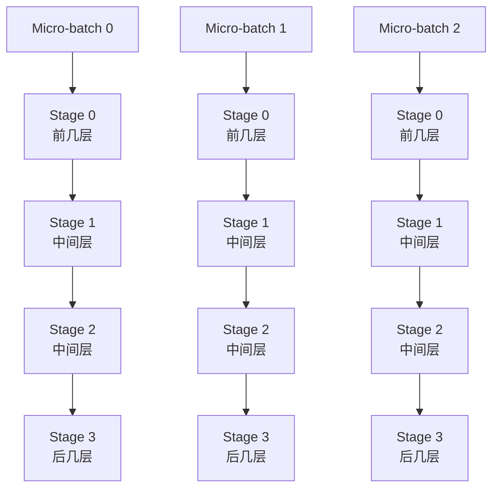
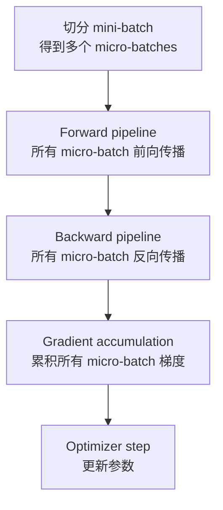
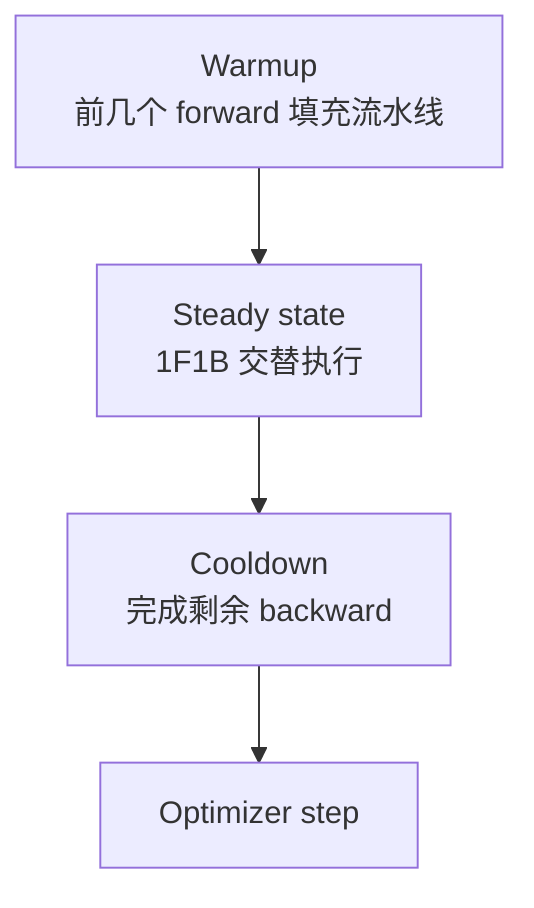
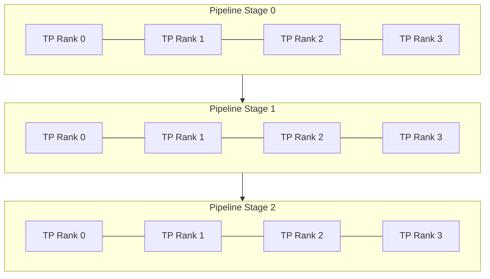

# Pipeline Parallel

Tensor Parallel 把一个层内部的大矩阵切到多张 GPU。Pipeline Parallel 则把模型的不同层切到不同 GPU 或不同节点上。

一句话理解：

> Pipeline Parallel 的核心目标，是把一个很深的模型按层切成多个 stage，让每个 stage 只保存和计算自己负责的层，再用 micro-batch 让这些 stage 像流水线一样同时工作。

它解决的是“模型层数太多、整模型放不进单卡或单个 TP group”的问题。代价是会出现 pipeline bubble、stage 负载不均、跨 stage activation 传输和调度复杂度。

## 为什么需要 Pipeline Parallel

一个 Transformer 模型可以粗略看成很多层顺序堆叠：

```text
Embedding -> Block 1 -> Block 2 -> ... -> Block N -> LM Head
```

如果模型很大，单张 GPU 或一个 TP group 可能放不下全部层的：

- parameters。
- gradients。
- optimizer states。
- activations。
- temporary buffers。

这时可以把连续层切到不同 stage：

```text
Stage 0: Embedding + Block 1-10
Stage 1: Block 11-20
Stage 2: Block 21-30
Stage 3: Block 31-40 + LM Head
```

每个 stage 只保存自己负责的层。forward 时数据从 Stage 0 一路传到最后一个 stage；backward 时梯度再从最后一个 stage 反向传回 Stage 0。

## 直接按层切开为什么还不够

如果只把一个 batch 直接送进流水线，执行会像这样：

```text
Stage 0 forward
Stage 1 forward
Stage 2 forward
Stage 3 forward
Stage 3 backward
Stage 2 backward
Stage 1 backward
Stage 0 backward
```

这并没有让所有 stage 同时忙起来。Stage 0 工作时，Stage 1/2/3 在等；Stage 3 工作时，Stage 0/1/2 在等。

Pipeline Parallel 真正有效的关键，是把一个 batch 再切成多个 micro-batch：

```text
Batch = micro-batch 0 + micro-batch 1 + ... + micro-batch M-1
```

当 Stage 0 处理 micro-batch 1 时，Stage 1 可以同时处理 micro-batch 0。这样多个 stage 才能并行工作。

## 基本数据流

一个 4 stage、多个 micro-batch 的 pipeline 可以这样理解：



从系统视角看，stage 之间传的不是完整模型参数，而是 activation：

- forward：前一个 stage 把输出 activation 发给下一个 stage。
- backward：后一个 stage 把 activation gradient 发回前一个 stage。

所以 Pipeline Parallel 的通信量主要与 activation 大小有关，受这些因素影响：

- micro-batch size。
- sequence length。
- hidden size。
- tensor layout。
- dtype。
- 是否使用 tensor parallel、sequence parallel 或 activation checkpointing。

## Pipeline stage 是什么

Pipeline stage 是一组连续层的集合。它通常由一个或多个 GPU 负责。

简单情况：

```text
1 stage = 1 GPU
```

大模型常见情况：

```text
1 stage = 一个 TP group
```

例如：

```text
TP size = 4
PP size = 8

每个 stage 内有 4 张 GPU 做 Tensor Parallel
一共有 8 个 pipeline stages
总 GPU 数 = 4 * 8 = 32
```

如果还有 Data Parallel：

```text
TP size = 4
PP size = 8
DP size = 2

总 GPU 数 = 4 * 8 * 2 = 64
```

## Pipeline bubble

Pipeline bubble 是 Pipeline Parallel 最核心的问题。

流水线启动时，后面的 stage 还没有收到 micro-batch，所以在等。流水线结束时，前面的 stage 已经没有新 micro-batch 可做，也在等。

这些等待时间就是 bubble。

一个简化的 4 stage、4 micro-batch forward-only 时间线：

```text
time ->  0   1   2   3   4   5   6
S0      F0  F1  F2  F3  .   .   .
S1      .   F0  F1  F2  F3  .   .
S2      .   .   F0  F1  F2  F3  .
S3      .   .   .   F0  F1  F2  F3
```

其中 `.` 就是空闲。micro-batch 越少，bubble 占比越高。

对简单的 pipeline 来说，bubble 的粗略直觉是：

```text
stage 数越多，填满和排空流水线越慢
micro-batch 数越多，bubble 占比越低
```

所以 Pipeline Parallel 常常需要足够多的 micro-batch 来提高利用率。

## GPipe 调度

GPipe 是经典的 pipeline parallel 方法。它的基本思路是：

1. 把 mini-batch 切成多个 micro-batch。
2. 对所有 micro-batch 执行 forward pipeline。
3. 等所有 forward 完成后，再执行 backward pipeline。
4. 所有 micro-batch 梯度累积完成后，再做 optimizer step。

这类调度也常被称为 flush 式调度，因为一个 batch 的 forward/backward 边界比较清楚，中间不会混入下一批参数更新。

简化流程：



GPipe 的优点：

- 权重一致性容易理解。
- 一个 batch 内所有 micro-batch 使用同一版本参数。
- 实现和调试相对直观。
- 适合建立 Pipeline Parallel 的入门模型。

GPipe 的缺点：

- forward 全部完成后才开始 backward，activation 保留时间长。
- bubble 仍然明显。
- stage 数较多、micro-batch 数不足时利用率不高。

## 1F1B 调度

1F1B 是 one forward one backward。它的基本思想是：流水线 warmup 后，每个 stage 尽量交替执行一个 forward 和一个 backward，让 backward 更早开始，从而减少 activation 占用和部分等待。

一个简化直觉：

```text
先 warmup：填充流水线
进入 steady state：每个 stage 交替做 forward/backward
最后 cooldown：排空剩余 backward
```



1F1B 的收益：

- backward 更早发生。
- activation 不需要等所有 forward 完成后才释放。
- 显存压力通常低于 GPipe flush 调度。
- stage 利用率通常更好。

它的代价：

- 调度更复杂。
- 不同 stage 同时处理不同 micro-batch 的 forward/backward。
- 通信、依赖、gradient accumulation 和 optimizer step 边界更容易出错。

大模型训练系统里，1F1B 是非常常见的 pipeline 调度基础。

## 权重一致性和 stale weight

训练里必须小心一个问题：forward 用的参数版本，backward 也应该对应同一版本的参数。

如果一个 micro-batch 的 forward 用的是参数 `W_t`，但它 backward 时模型已经更新成 `W_{t+1}`，梯度就不再严格对应原来的 forward 计算。

不同 pipeline 系统对这个问题有不同处理：

- GPipe flush 调度通常在完整 mini-batch forward/backward 后再更新参数，权重一致性简单。
- 一些 PipeDream 风格系统会使用权重版本管理，确保 backward 用到对应 forward 的参数版本。
- 大模型训练里的同步 1F1B 通常仍然以 global batch 为 optimizer step 边界，避免在同一个 batch 内频繁更新权重。

新手可以先记住一句话：

> Pipeline Parallel 不只是把层放到不同 GPU，还必须保证每个 micro-batch 的 forward、backward、梯度累积和参数更新边界是清楚的。

## Micro-batch 数量如何影响效率

Pipeline Parallel 里有两个容易混淆的概念：

```text
global batch size
micro-batch size
micro-batch 数量
```

粗略关系：

```text
global batch size
  = micro-batch size
  * gradient accumulation steps
  * data parallel size
```

Pipeline 中的 micro-batch 数量通常和 gradient accumulation 相关。micro-batch 数量越多，流水线越容易被填满，bubble 占比越低。

但 micro-batch 也不能无限切小：

- micro-batch 太小，GEMM 变小，Tensor Core 利用率下降。
- kernel launch 和调度开销占比上升。
- stage 间通信消息更碎。
- normalization、attention、MoE routing 等算子的形状可能不理想。
- gradient accumulation steps 过多会拉长一次 optimizer step 的时间。

所以调参不是简单地“micro-batch 越多越好”，而是在 bubble、显存、GEMM 效率和通信效率之间取平衡。

## Stage 切分为什么很难

理论上可以把模型均匀按层数切分。实际不一定好。

原因是不同层的成本不一样：

- Embedding 层和 LM head 可能有大词表权重。
- 首尾 stage 可能负责额外输入输出处理。
- MoE 层和 Dense 层计算量不同。
- Attention 在长上下文下比 MLP 更重。
- 不同层 activation 大小可能不同。
- TP/EP/CP 等组合会改变某些层的通信成本。

如果某个 stage 比其他 stage 慢，整个 pipeline 都会被它拖住。这个最慢 stage 就是 pipeline 的瓶颈。

一个简单例子：

```text
Stage 0: 80 ms
Stage 1: 85 ms
Stage 2: 160 ms
Stage 3: 82 ms
```

即使其他 stage 很快，整体 steady state 也会接近被 Stage 2 限制。其他 stage 会等 Stage 2，产生额外 idle。

## Stage 边界的通信成本

Pipeline stage 之间需要传 activation 和 activation gradient。

假设 stage 边界 activation 形状是：

```text
[micro_batch, sequence_length, hidden_size]
```

通信大小粗略是：

```text
micro_batch * sequence_length * hidden_size * bytes_per_element
```

forward 要传一次 activation，backward 要传一次 activation gradient。长上下文、大 hidden size、大 micro-batch 都会放大 pipeline 通信。

设计 stage 边界时要考虑：

- 边界 tensor 是否很大。
- stage 是否跨节点。
- 是否能把高频通信留在节点内。
- 是否和 TP group / DP group 的 rank mapping 冲突。
- 是否有通信计算重叠空间。

## Virtual Pipeline Stage 和 Interleaving

如果每个物理 stage 只负责一个连续大段层，stage 负载可能不均，bubble 也可能比较大。

Virtual Pipeline Stage 的思路是：一个物理设备或 TP group 上可以放多个较小的 layer chunk，让 pipeline 调度在更细粒度上交错。

例如原来：

```text
GPU 0: layers 0-7
GPU 1: layers 8-15
GPU 2: layers 16-23
GPU 3: layers 24-31
```

可以变成更细的虚拟切分：

```text
GPU 0: chunk A0 + chunk A4
GPU 1: chunk A1 + chunk A5
GPU 2: chunk A2 + chunk A6
GPU 3: chunk A3 + chunk A7
```

这样调度器可以把 micro-batch 在更多虚拟 stage 间穿插，减少部分 bubble，并改善负载平衡。

代价是：

- 调度更复杂。
- stage 间依赖更多。
- 激活保存和释放更难分析。
- 通信事件更碎。

所以 interleaving 适合已经理解基本 PP 后再引入。

## Pipeline Parallel 和 Tensor Parallel 的组合

在大模型训练里，PP 经常和 TP 一起使用。

典型结构：



在这个图里：

- 每个 stage 内部用 TP 切层内矩阵。
- stage 与 stage 之间传 activation。
- 多个完整 pipeline 副本之间再做 DP 或 FSDP。

经验上：

- TP 通信频繁，尽量放在节点内高速互连。
- PP stage 边界通信频率相对低，但 activation 可能很大。
- DP/FSDP 通信发生在梯度或参数 shard 层面。

这些通信叠在一起，最终要看 profiler timeline 才能判断谁是瓶颈。

## Pipeline Parallel 和 FSDP / ZeRO 的组合

Pipeline Parallel 切的是层。FSDP/ZeRO 切的是数据并行维度上的模型状态。

组合时要回答几个问题：

- 每个 pipeline stage 内的层是否再用 FSDP 包起来？
- FSDP group 是跨哪些 rank？
- optimizer state 是按 DP group shard，还是每个 PP stage 单独管理？
- checkpoint 如何保存 stage-local 参数和 sharded optimizer state？
- forward/backward 时的 FSDP all-gather 是否会和 PP send/recv 互相阻塞？

简单理解：

```text
PP:
  不同 stage 保存不同层

FSDP / ZeRO:
  同一个 stage 的多个 DP 副本之间切分模型状态
```

组合可以很强，但也更难调。很多性能问题不是某一种并行本身的问题，而是多个通信域互相挤占网络和 GPU stream。

## Pipeline Parallel 的显存影响

PP 能降低每个 stage 保存的参数量，因为每个 stage 只放一部分层。

但它不自动解决所有显存问题：

| 显存项 | PP 的影响 |
| --- | --- |
| Parameters | 按 stage 切分后每 stage 只保存部分层 |
| Gradients | 每 stage 只保存本 stage 参数梯度 |
| Optimizer states | 每 stage 只保存本 stage 参数的 optimizer state |
| Activations | 取决于调度和 micro-batch，可能仍然很高 |
| Communication buffers | stage 间 send/recv 会引入 buffer |
| Temporary buffers | stage 内算子仍然需要临时空间 |

GPipe flush 调度因为 backward 来得晚，activation 保留时间较长。1F1B 能更早释放部分 activation，通常显存更友好。

如果 activation 仍然太高，可以再配合：

- activation checkpointing。
- sequence parallel。
- 更小 micro-batch。
- selective recomputation。
- 更合理的 layer chunk。

## 常见优化方向

### 平衡每个 stage 的计算时间

不要只按层数平均切。应该根据 profiler 或估算模型，把每个 stage 的 forward/backward 时间尽量拉平。对 MoE、长上下文 attention、embedding/LM head 要额外关注。

### 增加 micro-batch 数量降低 bubble

micro-batch 数量越多，流水线 steady state 越长，bubble 占比越低。但要同时观察 GEMM 效率和通信碎片化，不能让 micro-batch 小到 GPU 算不满。

### 使用 1F1B 降低 activation 压力

相比先全 forward 再全 backward，1F1B 让 backward 更早发生，有助于减少 activation 存活时间。大模型训练中通常更常见。

### 考虑 interleaved pipeline

当 stage 负载不均或 bubble 明显时，可以考虑 virtual pipeline stage / interleaving。它能改善利用率，但会增加调度和排查复杂度。

### 优化 rank mapping

stage 内 TP 通信、stage 间 PP 通信、跨副本 DP/FSDP 通信都要考虑拓扑。错误的 rank mapping 会让本该走高速链路的通信绕远路。

### 重叠 stage 间通信和计算

send/recv activation 不一定必须完全暴露在关键路径上。合理的调度、异步通信和分块传输可能让部分通信与计算重叠。但要用 timeline 验证，不能只看 API 是否异步。

## Benchmark 时看什么

评估 Pipeline Parallel 至少看：

| 指标 | 作用 |
| --- | --- |
| Step time | 最终训练速度 |
| Bubble ratio | stage 空闲占比 |
| Stage time breakdown | 找最慢 stage |
| Activation memory | 判断调度是否造成显存压力 |
| PP send/recv time | 判断 stage 间通信是否瓶颈 |
| MFU | 看整体计算利用率 |
| Micro-batch GEMM efficiency | 看 micro-batch 是否切得太小 |
| Scaling efficiency | PP size 增大是否有效 |
| Timeline idle gap | 看 stage 是否在等前后 stage |

实验记录要固定：

- global batch size。
- micro-batch size。
- gradient accumulation steps。
- sequence length。
- TP/PP/DP/FSDP 配置。
- activation checkpointing 策略。
- stage 切分。
- rank mapping。

否则很容易把 batch 或 TP 的变化误判成 PP 调度收益。

## 常见误区

### 误区一：层数平均就是负载平均

不一定。不同层的计算、通信、activation、参数大小可能不同。Embedding、LM head、MoE、长上下文 attention 都会破坏简单平均。

### 误区二：micro-batch 越多越好

micro-batch 多能降低 bubble，但太小会降低 GEMM 效率、增加通信碎片和调度开销。

### 误区三：PP 解决了显存就一定更快

PP 可以让模型放下，但不保证吞吐更高。如果 bubble 大、stage 不均、通信暴露严重，step time 可能很差。

### 误区四：只看最后一个 stage

Pipeline 是整体系统。任意一个 stage 慢，都会让其他 stage 等待。排查时要看所有 stage 的 timeline。

### 误区五：忘记 optimizer step 边界

Pipeline 调度里多个 micro-batch 同时在不同 stage 流动。必须清楚哪些 micro-batch 属于同一个 global batch，什么时候梯度累积完成，什么时候才能更新参数。

## 设计检查表

设计 Pipeline Parallel 时，可以逐项检查：

- 模型是否真的需要按层切分，还是 FSDP/TP 已经够用？
- PP size 由模型大小决定，还是只是为了用满 GPU？
- 每个 stage 的参数量、计算量、activation 是否接近平衡？
- micro-batch 数量是否足够降低 bubble？
- micro-batch 是否小到影响 Tensor Core 利用率？
- 使用 GPipe flush、1F1B，还是 interleaved 1F1B？
- stage 间通信是否跨节点？activation 是否过大？
- TP group、PP stage、DP/FSDP group 的 rank mapping 是否合理？
- profiler 中最慢 stage 是谁？它为什么慢？
- optimizer step 是否在正确的 global batch 边界发生？
- checkpoint 是否能恢复每个 stage 的参数、优化器状态和调度状态？

## 小结

Pipeline Parallel 把模型按层切到多个 stage，让单个 GPU 或 TP group 不必保存完整模型。它的关键不只是切层，而是用 micro-batch 形成流水线，让多个 stage 同时工作。

要真正理解 PP，需要抓住几个核心点：

- stage 之间传 activation 和 activation gradient。
- micro-batch 用来填满流水线。
- bubble 是 PP 的天然成本。
- 1F1B 能提高利用率并降低 activation 压力。
- stage 负载平衡比“层数平均”更重要。
- PP 常常和 TP、DP、FSDP 一起使用。

实际调优时，判断 Pipeline Parallel 好坏的标准不是 stage 数多不多，而是 step time、MFU、bubble ratio、stage balance、显存峰值和通信暴露时间是否真的改善。

## 参考资料

- [GPipe: Efficient Training of Giant Neural Networks using Pipeline Parallelism](https://arxiv.org/abs/1811.06965)
- [PipeDream: Fast and Efficient Pipeline Parallel DNN Training](https://arxiv.org/abs/1806.03377)
- [Efficient Large-Scale Language Model Training on GPU Clusters Using Megatron-LM](https://arxiv.org/abs/2104.04473)
- [Megatron Core: pipeline_parallel package](https://docs.nvidia.com/megatron-core/developer-guide/latest/api-guide/pipeline_parallel.html)
