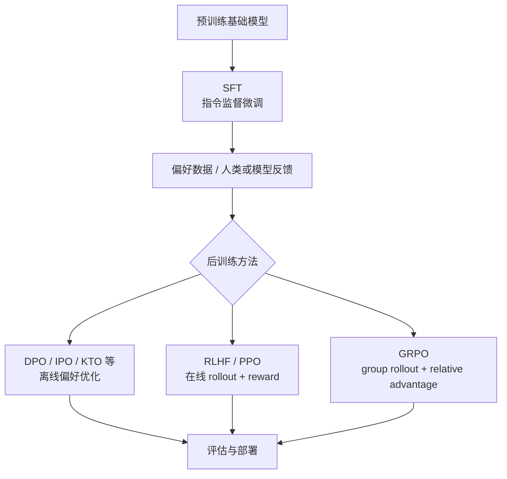
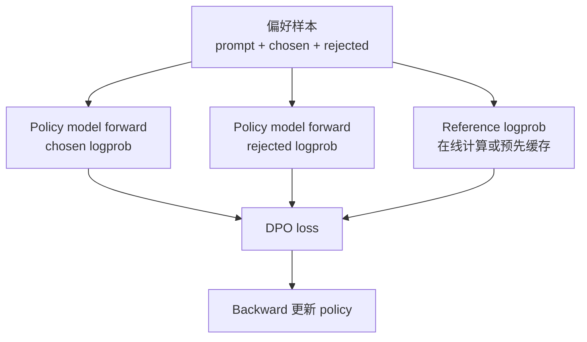
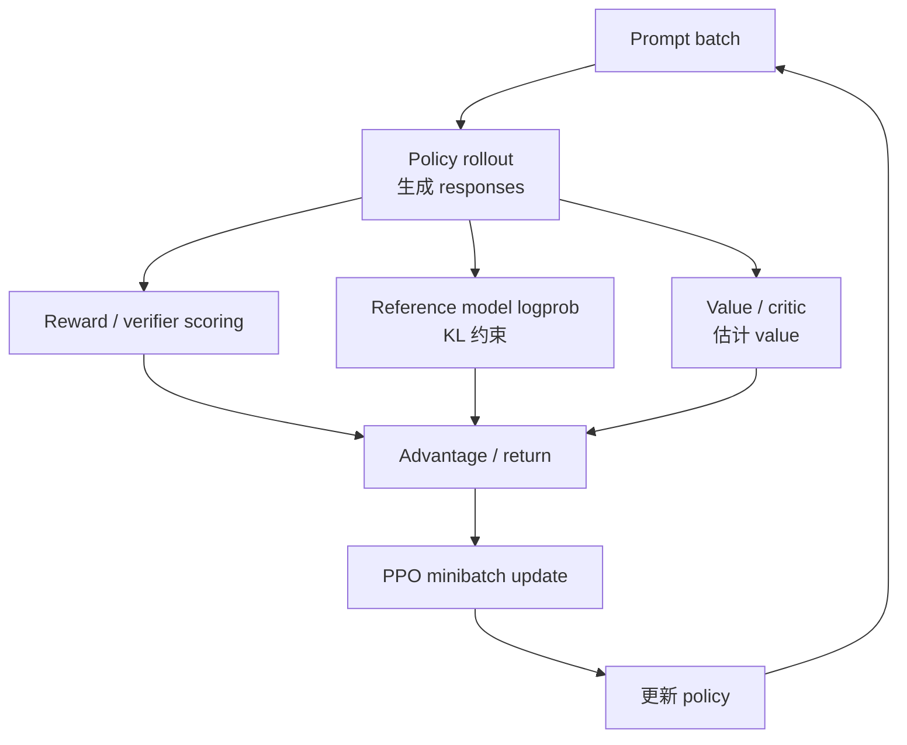
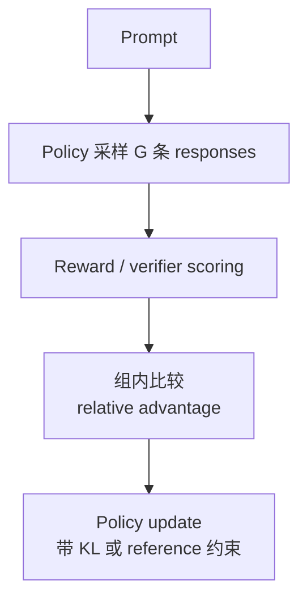

# 后训练工作负载：SFT、DPO、RLHF 与 GRPO 系统视角

后训练，英文常叫 post-training，指基础模型预训练完成之后，用指令数据、偏好数据、奖励模型或在线采样继续调整模型行为的一组训练流程。

这篇不讨论“怎样让模型更聪明”或“哪种对齐算法效果最好”。这里关心的是系统问题：

> SFT、DPO、RLHF、GRPO 会把普通语言模型训练变成不同的数据流和计算流；它们改变 GPU 显存、推理-训练耦合、batch 形态、checkpoint、调度和 benchmark 方法。

如果只把后训练理解成“再训练几轮”，很容易低估系统复杂度。SFT 比较接近普通监督训练；DPO 会引入 chosen/rejected 成对样本和 reference logprob；RLHF/PPO 会把在线推理 rollout、reward model、reference model、value model 和 policy update 串起来；GRPO 又用同一 prompt 的多组回答构造相对优势，减少某些 value/critic 相关成本，但增加 group generation 和样本组织压力。

## 先把后训练放到训练生命周期里

大模型训练可以粗略分成：

```text
pretraining
-> post-training
-> evaluation
-> serving
-> feedback / data collection
```

预训练更像大规模 next-token prediction：数据量极大，训练时间长，step 结构稳定，系统重点是长期吞吐、并行扩展、checkpoint 和稳定性。

后训练更像一组短到中等长度的实验流水线：数据规模相对小，版本多，评估频繁，训练方法变化快，可能还会把推理服务式的 rollout 放进训练循环。



从系统视角看，后训练不是单一算法，而是一组 workload family。它们对硬件和平台的要求不同。

## 几种后训练方式的系统差异

| 方法 | 数据形态 | 是否在线生成 | 额外模型 | 主要系统压力 |
| --- | --- | --- | --- | --- |
| SFT | prompt + target response | 通常否 | 无或少量 reference | 普通 forward/backward、数据 packing、loss mask。 |
| Reward Model 训练 | prompt + 多个回答 + 偏好排序 | 通常否 | reward model | pairwise/ranking loss、长回答编码、数据质量。 |
| DPO | prompt + chosen/rejected | 否 | reference model 或缓存的 reference logprob | 成对样本、双 response forward、reference logprob、显存和吞吐。 |
| RLHF/PPO | prompt + policy rollout + reward | 是 | policy、reference、reward、value/critic | rollout 推理、KV Cache、reward scoring、PPO update、推理训练切换。 |
| GRPO | prompt + group responses | 是 | policy、reference、reward/verifier | 同 prompt 多回答采样、group advantage、rollout 吞吐、样本分组。 |

这张表的重点不是算法优劣，而是系统成本来源不同：

- SFT 最像普通训练。
- DPO 把一个样本扩展成 chosen/rejected 两条 response。
- PPO/RLHF 把推理服务的生成阶段塞进训练循环。
- GRPO 减少或避免某些 value model 训练路径，但会增加同 prompt 多样本生成和分组管理。

## SFT：最接近普通监督训练

SFT 是 Supervised Fine-Tuning。它用人工或模型生成的高质量指令回答，让模型学习“给定 prompt 后应该输出什么”。

典型样本是：

```text
prompt: 用户问题 / 系统指令 / 上下文
response: 目标回答
```

训练时通常把 prompt 和 response 拼成一段 token 序列，但 loss 只打在 response 部分：

```text
[prompt tokens][response tokens]
 loss mask: 0 0 0 ... 1 1 1
```

SFT 的系统形态接近普通 causal language modeling：

1. 读入样本。
2. tokenize。
3. 按长度 packing 或 padding。
4. forward。
5. 只在 response token 上算 loss。
6. backward。
7. optimizer step。

它的瓶颈通常来自：

- sequence length 分布不均。
- prompt 很长但 loss token 很少。
- padding 浪费。
- 多轮对话模板导致 token 数膨胀。
- 小数据集频繁 eval 和 checkpoint。
- LoRA/QLoRA 配置与全量微调的取舍。

### SFT 的有效 token

SFT benchmark 不能只看总 tokens/s。因为 prompt token 也参与 forward，但通常不参与 loss。

建议区分：

```text
input tokens: prompt + response + padding
loss tokens: 真正参与 loss 的 response tokens
effective tokens: 去掉 padding 后的真实 tokens
```

如果一个 batch 里 prompt 很长、response 很短，GPU 计算了大量 prompt token，但训练信号只来自少量 response token。系统吞吐看起来不低，训练效率可能并不高。

## Reward Model 训练

RLHF 流程里常有 reward model。它学习判断哪个回答更好。

常见数据形态是：

```text
prompt
chosen response
rejected response
```

reward model 对 chosen 和 rejected 分别打分，再用 pairwise loss 让 chosen 分数高于 rejected。

系统上，它和普通 SFT 不同：

- 一个样本包含两条或多条 response。
- chosen/rejected 长度可能不同。
- 可以把 prompt 共享，但实现上常常还是分别编码两条完整序列。
- 如果 response 很长，batch padding 浪费明显。
- reward model 本身也可能是大模型，需要独立训练和 checkpoint。

Reward model 训练不是所有后训练方法都必须有。例如 DPO 直接用偏好对优化 policy，不需要显式训练一个 reward model；但 RLHF/PPO 类流程通常会用 reward model 或 verifier 给 rollout 打分。

## DPO：离线偏好优化

DPO 是 Direct Preference Optimization。它的工程直觉是：

> 不再先训练 reward model、再用 PPO 做在线强化学习，而是直接用 chosen/rejected 偏好对优化 policy。

典型输入是：

```text
prompt
chosen response
rejected response
```

训练时要比较当前 policy 对 chosen/rejected 的 log probability，同时通常还需要 reference model 对 chosen/rejected 的 log probability 作为基准。

简化数据流：



DPO 的系统特点：

- 一个样本至少有 chosen 和 rejected 两条 response。
- policy 需要对两条 response 计算 logprob。
- reference logprob 可以在线算，也可以离线缓存。
- 如果在线跑 reference model，计算和显存成本会明显增加。
- 如果缓存 reference logprob，数据管线和版本一致性更重要。

### Reference logprob 的两种做法

第一种是在线计算 reference logprob：

```text
每个 batch:
  policy forward chosen/rejected
  reference forward chosen/rejected
  compute DPO loss
  backward policy
```

优点：

- 实现语义清楚。
- 不需要提前生成缓存。
- reference model 和 tokenizer 直接来自当前环境。

代价：

- 额外 forward 成本。
- 显存可能同时容纳 policy 和 reference。
- 多机分布式时 reference 的并行策略也要管理。

第二种是预先缓存 reference logprob：

```text
离线:
  reference model -> logprob cache

训练:
  读取 prompt/chosen/rejected + cached reference logprob
  policy forward
  compute DPO loss
```

优点：

- 训练时少跑 reference。
- 可以降低训练 step time 和显存。

代价：

- cache 必须和 base model、tokenizer、chat template、sequence truncation 完全一致。
- 数据版本管理更复杂。
- 一旦模板或 tokenizer 改了，cache 可能全部失效。

从系统角度看，DPO 的关键问题是：reference 成本放在线上训练循环里，还是提前转成数据 artifact。

## RLHF / PPO：把推理放进训练循环

RLHF 的经典流程通常包括三段：

1. SFT 训练初始 policy。
2. 用人类偏好数据训练 reward model。
3. 用 PPO 之类的强化学习方法，让 policy 生成回答，再根据 reward 更新 policy。

PPO 训练循环和普通 supervised training 很不一样。它需要先用当前 policy 生成 rollout：

```text
prompt -> policy.generate() -> response
```

然后对 response 打分：

```text
reward model(prompt, response) -> reward
reference model(prompt, response) -> KL / reference logprob
value model(prompt, response) -> value estimate
```

再用这些结果构造 PPO loss 更新 policy。



这会带来一个重要变化：

> RLHF/PPO 的训练循环里有大量推理生成，而不只是 forward/backward。

### PPO 系统成本来自哪里

PPO 类后训练通常同时涉及：

- policy model：被训练的模型。
- reference model：用于 KL 约束，通常冻结。
- reward model：给生成结果打分。
- value model / critic：估计 value 或 advantage，某些实现和 policy 共享 backbone。
- rollout engine：负责生成 response。
- training engine：负责 PPO update。

系统成本包括：

| 成本 | 说明 |
| --- | --- |
| Rollout 推理 | Prefill/Decode、KV Cache、采样、变长输出。 |
| 多模型显存 | policy、reference、reward、value 可能同时占资源。 |
| 数据回流 | rollout 结果要进入训练 batch。 |
| 旧策略 logprob | PPO 需要记录 rollout 时 policy 的 logprob。 |
| KL 计算 | 需要 reference logprob。 |
| 多 epoch update | 同一批 rollout 可能被切成多个 minibatch 更新。 |
| 同步与版本 | rollout policy 和 training policy 版本不能混乱。 |

这就是为什么 RLHF/PPO 工程上常比 SFT/DPO 难很多。它不是一个普通 `DataLoader -> forward -> backward` 循环，而是一个“推理系统 + 训练系统 + 数据流水线”的组合。

## Rollout 是 RLHF 的系统核心

Rollout 看起来像推理服务：

- 输入 prompt。
- 运行 prefill。
- 逐 token decode。
- 做 sampling。
- 保存生成 token、logprob、attention mask 等。

但它又不是普通在线推理服务：

- 它的目标不是低用户延迟，而是高训练吞吐。
- 输出要回流到训练。
- 需要记录训练所需的 logprob、mask、reward、value。
- prompt 通常来自训练数据队列，不是随机用户请求。
- policy 会持续更新，engine 权重版本要跟上。

因此 rollout engine 要关注：

- 每秒生成 token 数。
- prompt 和 response 长度分布。
- KV Cache 显存。
- batch/continuous batching。
- 采样参数。
- policy 权重更新频率。
- rollout 与训练之间的队列积压。

如果 rollout 慢，训练 GPU 会等数据。如果训练慢，rollout 结果会堆积，甚至因为 policy 版本过旧而不能使用。

## GRPO：Group Relative Policy Optimization

GRPO 常见于近年的 reasoning / math 后训练工作。它的核心直觉是：对同一个 prompt 生成多条回答，用同组回答之间的相对得分估计优势，而不是依赖一个单独 value model 给每个 token 学 value。

简化流程：

```text
同一个 prompt
-> 生成 G 条 responses
-> 对每条 response 打 reward / verifier score
-> 在同组内归一化或比较 reward
-> 得到 relative advantage
-> 更新 policy
```

用图表示：



从系统角度看，GRPO 的收益和代价都很清楚。

收益：

- 可以减少或避免单独 value model / critic 的训练成本。
- advantage 来自同组 response 的相对质量，适合有明确 verifier/reward 的任务。
- 训练链路可能比 PPO 少一个复杂模型组件。

代价：

- 每个 prompt 要生成多条 response。
- rollout token 数按 group size 放大。
- batch 组织要保留 prompt group 边界。
- reward/verifier scoring 可能成为瓶颈。
- 长 reasoning response 会让 rollout KV Cache 和存储压力增加。

如果 group size 是 `G`，每个 prompt 平均生成 `L` 个 token，那么 rollout 生成 token 数大致是：

```text
num_prompts * G * L
```

因此 GRPO 减少 value model 训练成本，不等于整体一定更便宜。它把成本更多放到了多样本生成、reward/verifier 和样本分组上。

## 为什么后训练会影响集群调度

普通大规模预训练通常是稳定长作业。后训练平台则更像混合 workload：

- SFT：中短训练作业。
- DPO：偏好数据训练，可能需要 reference cache。
- RLHF/PPO：rollout + training 双系统。
- GRPO：高 rollout token 生成量 + reward/verifier。
- Eval：频繁、短、指标多。
- 数据处理：去重、过滤、模板化、采样。

调度系统要面对：

- 训练 GPU 和 rollout GPU 是否共池。
- 推理引擎是否常驻。
- reward model / verifier 是否独立部署。
- rollout 任务和 policy update 是否需要 gang scheduling。
- 短任务是否被大训练任务挤压。
- adapter 微调和 RL 后训练是否共享基础模型缓存。
- eval 是否独占资源或低优先级运行。

在后训练平台里，只看 GPU utilization 很容易误判。一个 PPO 任务可能训练 GPU 利用率不高，但瓶颈在 rollout；一个 GRPO 任务可能 rollout GPU 很忙，但训练 update 很短。

## 后训练的数据版本更重要

后训练数据通常比预训练数据更“结构化”，也更容易因为细节变化影响结果。

需要记录：

| 数据对象 | 为什么重要 |
| --- | --- |
| Prompt | 生成和训练的输入。 |
| Chosen/rejected response | DPO、reward model 的核心偏好数据。 |
| Reward / verifier score | RLHF/GRPO 的训练信号。 |
| Chat template | 改变 token 序列和 loss mask。 |
| Tokenizer revision | 改变 token boundary 和 logprob。 |
| Truncation 规则 | 决定哪些 token 参与训练。 |
| Reference logprob cache | 必须和 reference model、模板、tokenizer 对齐。 |
| Policy version | rollout 时使用的模型版本。 |

尤其要警惕：看起来一样的文本，在不同 chat template 下可能变成不同 token 序列。DPO/RLHF 里的 logprob 对 token 序列非常敏感，不能只记录原始文本。

## 显存与吞吐怎么估算

后训练的显存不能只按一个模型估算。

SFT 的显存类似普通训练：

```text
policy weights
+ gradients
+ optimizer states
+ activations
+ temporary buffers
```

DPO 可能增加：

```text
chosen/rejected activations
+ reference model weights or reference cache
+ longer batch sequence packing
```

RLHF/PPO 可能涉及：

```text
policy training memory
+ rollout policy serving memory
+ reference model memory
+ reward model memory
+ value model memory
+ KV Cache
+ rollout storage buffers
```

GRPO 可能把 rollout token 数放大：

```text
prompt_count * group_size * response_length
```

所以容量评估要分开看：

- training step time。
- rollout tokens/s。
- reward scoring tokens/s。
- update tokens/s。
- end-to-end samples/s。
- 每轮迭代 wall-clock time。

单独报告 policy update 的 tokens/s 对 RLHF/GRPO 不够，因为真正瓶颈常常在生成和打分。

## 分离部署还是共置部署

后训练系统常见两种架构。

第一种是共置：

```text
同一批 GPU 同时承担 rollout 和 training
```

优点：

- 部署简单。
- 数据传输路径短。
- 小规模实验容易跑。

代价：

- rollout 和 training 资源互相干扰。
- 显存要同时考虑推理 KV Cache 和训练 activation。
- 权重更新和推理 engine reload 容易影响效率。

第二种是分离：

```text
rollout GPU pool -> 生成样本队列 -> training GPU pool
reward/verifier pool -> 打分
```

优点：

- 每类 workload 可以独立扩缩。
- rollout 可以使用 serving engine 优化。
- training GPU 更专注于 backward/update。

代价：

- 队列和数据传输复杂。
- policy 版本一致性要管理。
- rollout 过期样本要处理。
- 监控和调度更复杂。

选型原则：

| 场景 | 更适合 |
| --- | --- |
| 小模型、小实验、低并发 | 共置。 |
| 大规模 RLHF/GRPO、rollout 很重 | 分离。 |
| reward/verifier 很慢 | 独立 scoring pool。 |
| policy 更新频繁、样本易过期 | 更紧耦合或短队列。 |
| 需要复用高性能 serving engine | 分离 rollout pool。 |

## LoRA/QLoRA 与后训练

后训练经常和 LoRA/QLoRA 组合。

原因很直接：

- SFT/DPO 实验多，adapter checkpoint 小，便于快速迭代。
- RLHF/GRPO 的 policy update 可能只训练 adapter，降低 optimizer state。
- 多任务、多数据版本可以共享基础模型。

但组合后也有额外问题：

- reference model 是否包含同一个 base、不包含 adapter，还是某个固定 adapter。
- rollout engine 是否支持动态 LoRA。
- cache key 是否包含 adapter id。
- reward/verifier 是否基于同一 tokenizer/template。
- merge/unmerge 是否影响 policy update。
- adapter checkpoint 是否能和 rollout engine 快速同步。

如果后训练系统把 adapter 当作普通小文件，而不是模型版本的一部分，就容易出现 policy rollout、reference logprob、reward scoring 和训练 update 版本不一致。

## Benchmark 方法

后训练 benchmark 要按方法分层。

SFT/DPO 可以报告：

- step time。
- tokens/s。
- effective loss tokens/s。
- peak memory。
- trainable parameters。
- eval time。
- checkpoint size。

RLHF/PPO/GRPO 还要报告：

- rollout prompts/s。
- rollout output tokens/s。
- reward scoring samples/s。
- policy update tokens/s。
- 每轮 rollout/update 的 wall-clock time。
- rollout queue wait。
- stale rollout ratio。
- 每个 prompt 的 responses 数。
- average response length。
- KL、reward、advantage 分布。
- end-to-end time to target eval score。

一个可复现的后训练 benchmark 至少固定：

```yaml
method: "dpo"  # sft / reward_model / dpo / ppo / grpo
base_model: ""
policy_model: ""
reference_model: ""
reward_model: ""
tokenizer_revision: ""
chat_template_revision: ""
dataset_revision: ""
prompt_length_distribution: ""
response_length_distribution: ""
max_prompt_length: null
max_response_length: null
packing: true
precision: "bf16"
parallelism:
  dp: null
  fsdp: null
  tp: null
  pp: null
peft:
  enabled: false
  method: null
rollout:
  enabled: false
  num_responses_per_prompt: null
  sampling_config: {}
  rollout_engine: ""
metrics:
  step_time: null
  rollout_tokens_per_second: null
  update_tokens_per_second: null
  end_to_end_iteration_time: null
  peak_gpu_memory_gb: null
```

## 常见优化方向

### 优化 SFT/DPO 数据组织

重点是减少 padding 和无效 token：

- 按长度分桶。
- packing 多个短样本。
- 明确 loss mask。
- 区分 input tokens 和 loss tokens。
- 预先 tokenization。
- 对超长 prompt/response 做规则化截断。

### 缓存 reference logprob

对 DPO 类训练，如果 reference model 不变，可以考虑预先计算 reference logprob。

收益：

- 减少训练时 reference forward。
- 降低显存和 step time。

风险：

- tokenizer/template/truncation 一变，cache 失效。
- cache 体积可能很大。
- 需要记录 reference model revision。

### 分离 rollout 和 update

对 RLHF/GRPO，如果 rollout 占大头，可以把 rollout engine 独立出来，使用推理系统优化方法：

- continuous batching。
- KV Cache 管理。
- prefix cache。
- speculative decoding，视任务语义谨慎使用。
- 多副本 rollout pool。
- reward/verifier 批量打分。

但 rollout 与 update 分离后，要处理样本过期和版本一致性。

### 减少多模型同时驻留

RLHF/PPO 里 policy、reference、reward、value 都可能吃显存。

常见做法：

- reference 使用 frozen 低精度权重。
- reward model 独立服务化。
- value head 与 policy 共享 backbone。
- LoRA 只训练 adapter。
- 分阶段运行 rollout/scoring/update。
- 用 CPU/offload 或模型并行放下大模型。

### 让 reward/verifier 成为可观测组件

很多后训练瓶颈不是 policy update，而是 reward/verifier scoring。

需要监控：

- scoring latency。
- scoring throughput。
- reward 分布。
- failed / invalid sample ratio。
- verifier timeout。
- prompt/response 长度对 scoring 的影响。

如果 reward/verifier 不稳定，训练曲线可能看起来像优化问题，本质却是数据和打分系统问题。

## 常见坑

### 把 RLHF 当成普通训练

普通训练只有 dataset batch。RLHF 有 rollout、reward、reference、value、policy update。只测 backward step time 不能代表端到端效率。

### 忘记 reference 版本

DPO/RLHF 的 reference model 是训练语义的一部分。更换 reference 或 chat template 后，旧 logprob cache 可能不能用。

### 只看总 tokens/s

SFT 要区分 loss tokens。RLHF/GRPO 要区分 rollout tokens 和 update tokens。把所有 token 混成一个吞吐指标，会掩盖瓶颈。

### 让 rollout 样本过期

如果 policy 已经更新很多步，旧 policy 生成的 rollout 可能不再适合继续训练。分离架构必须记录 rollout policy version，并设置过期规则。

### 忽略 response 长度分布

后训练 response 长度波动很大。少数超长回答可能拖慢整个 batch，增加 KV Cache 和 activation 压力。

### 没有记录 sampling 配置

temperature、top-p、max tokens、stop words 都会影响 rollout 数据分布。RLHF/GRPO 实验必须记录这些配置。

## 学习顺序建议

建议按这个顺序学：

1. 先理解 SFT，因为它最接近普通监督训练。
2. 再理解 reward model 训练，知道偏好数据如何变成打分模型。
3. 然后理解 DPO，重点看 chosen/rejected 和 reference logprob。
4. 再看 RLHF/PPO，重点看 rollout、reward、reference、value 和 policy update 的闭环。
5. 最后看 GRPO，理解 group responses 如何改变 rollout 数量和 advantage 计算。

从系统角度记住一句话：

> 后训练不是一种训练 step，而是一组数据、推理、打分和优化循环；不同方法的瓶颈可能完全不在同一个地方。

## 参考资料

- [Training language models to follow instructions with human feedback](https://arxiv.org/abs/2203.02155)
- [Proximal Policy Optimization Algorithms](https://arxiv.org/abs/1707.06347)
- [Direct Preference Optimization: Your Language Model is Secretly a Reward Model](https://arxiv.org/abs/2305.18290)
- [DeepSeekMath: Pushing the Limits of Mathematical Reasoning in Open Language Models](https://arxiv.org/abs/2402.03300)
- [Hugging Face TRL documentation](https://huggingface.co/docs/trl/index)
