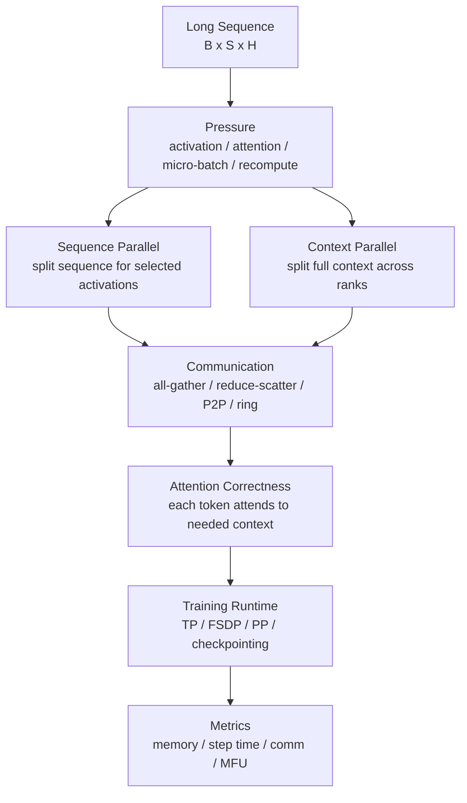

# Sequence Parallel 与 Context Parallel

大模型训练里，参数量不是唯一会变大的东西。

当 sequence length 从 2K、4K 增加到 32K、128K，甚至更长时，即使模型参数量不变，训练系统压力也会明显变化：

- activation 显存增加。
- attention 计算和通信更重。
- micro-batch 被迫变小。
- activation checkpointing 重计算成本变高。
- data packing、position id、attention mask 更复杂。
- 单条样本可能跨多个 GPU 才能放下。

这时只靠 Data Parallel、Tensor Parallel、Pipeline Parallel 可能不够。

Sequence Parallel 和 Context Parallel 解决的就是：

```text
当序列太长时，能不能把 token 序列维度也切到多张 GPU 上？
```

本篇关注系统直觉，不追求某个框架的所有实现细节。

## 一张总图



这张图的重点是：

```text
Sequence / Context Parallel 不是为了切模型参数，
而是为了切 token 序列带来的 activation 和 attention 压力。
```

## 为什么长序列会变难

Transformer 训练中的张量经常可以粗略写成：

```text
batch x sequence x hidden
```

其中：

- batch 是样本数量。
- sequence 是 token 数。
- hidden 是每个 token 的向量维度。

当 sequence length 变大，很多对象都会变大：

- hidden states。
- residual。
- layer norm 输入输出。
- dropout mask。
- attention Q/K/V。
- attention output。
- MLP 中间 activation。
- backward 需要的中间状态。

即使使用 FlashAttention 这类 IO-efficient attention，训练仍然要面对很大的 activation、重计算和通信压力。

更直观地说：

```text
参数量决定模型有多大；
序列长度决定一次训练样本在时间维度上有多长。
```

参数不变，序列变长，训练照样可能跑不动。

## 它和 Data Parallel 的区别

Data Parallel 切的是样本。

例如 4 张 GPU：

```text
GPU0: sample 0
GPU1: sample 1
GPU2: sample 2
GPU3: sample 3
```

每张 GPU 看到的是不同样本，但每个样本本身还是完整 sequence。

Sequence / Context Parallel 切的是一个样本内部的 token 序列。

例如 4 张 GPU：

```text
GPU0: token 0..2047
GPU1: token 2048..4095
GPU2: token 4096..6143
GPU3: token 6144..8191
```

这意味着一个样本会跨多张 GPU。

这也意味着 attention、position、mask、loss 和 backward 都必须保证跨分片正确。

## 它和 Tensor Parallel 的区别

Tensor Parallel 通常切 hidden / head / matrix 维度。

粗略看：

```text
[B, S, H]  ->  H 被切开
```

Sequence / Context Parallel 切 sequence 维度。

粗略看：

```text
[B, S, H]  ->  S 被切开
```

这两个维度可以组合，但不能混淆。

Tensor Parallel 解决的是：

```text
一层里的矩阵太大，或者单卡算力/显存不够。
```

Sequence / Context Parallel 解决的是：

```text
单条序列太长，activation 或 attention context 太大。
```

## Sequence Parallel 是什么

Sequence Parallel 的核心直觉是：

```text
在某些不需要每张 GPU 持有完整 sequence activation 的地方，
把 sequence 维度切开，让每张 GPU 只保存一部分 token 的 activation。
```

在 Megatron-LM / Megatron Core 语境里，Sequence Parallel 经常和 Tensor Parallel 一起出现。

原因是 Tensor Parallel 会让很多层内计算在 hidden 维度上切分，但有些操作本身不适合按 hidden 维度切，或者会产生重复 activation。

Sequence Parallel 把这些 activation 沿 sequence 维度分片，可以降低每张 GPU 的 activation 显存。

一个简化理解：

```text
没有 SP：
  每个 TP rank 保存较完整的 sequence activation

有 SP：
  每个 TP rank 保存一部分 sequence activation
```

注意：这不是说所有算子都天然按 sequence 切。实际 runtime 会在需要完整数据的地方插入通信。

## Sequence Parallel 的简化流程

假设 TP size = 4。

某些阶段可以让每个 rank 持有 sequence 的 1/4：

```text
Rank 0: tokens 0..1023
Rank 1: tokens 1024..2047
Rank 2: tokens 2048..3071
Rank 3: tokens 3072..4095
```

当后续计算需要按 hidden 维度切分或需要完整 sequence 信息时，系统会通过 collective 恢复需要的数据形态。

典型通信包括：

- all-gather。
- reduce-scatter。
- all-to-all 或其他重排，取决于实现。

Sequence Parallel 的收益主要来自：

- 减少 activation 重复。
- 降低长序列下每卡显存。
- 让更大的 sequence length 或 micro-batch 可行。

它的代价是：

- 增加通信。
- 增加张量 layout 转换。
- 对实现和框架支持有要求。

## Context Parallel 是什么

Context Parallel 更直接地面向长上下文。

它把完整 context 分到多个 rank。

例如一个 64K token 的序列，CP size = 4：

```text
Rank 0: token 0K..16K
Rank 1: token 16K..32K
Rank 2: token 32K..48K
Rank 3: token 48K..64K
```

每个 rank 本地只保存一段 context。

但注意力计算有一个关键要求：

```text
每个 token 的 attention 结果，必须考虑它应该看到的上下文。
```

对于 causal language model，后面的 token 可以看前面的 token，不能看未来 token。

所以如果 Rank 3 负责最后 16K token，它通常需要前面 rank 的 K/V 信息，才能计算正确 attention。

这就是 Context Parallel 的核心难点：

```text
sequence 被切开了，但 attention 的依赖没有消失。
```

## Context Parallel 的通信方式

不同实现会有不同策略。

常见思路包括：

### AllGather K/V

每个 rank 先算本地 Q/K/V，然后把 K/V 收集起来，让每个 rank 能看到完整 context。

优点：

- 逻辑简单。
- 容易理解。

缺点：

- K/V 通信和显存压力大。
- context 很长时成本高。

### Ring / P2P Attention

每个 rank 不一次性收集所有 K/V，而是按环形或分块方式传递 K/V。

每个 rank 逐块计算自己负责 query 对远端 K/V 的 attention contribution。

优点：

- 峰值显存更低。
- 更适合极长上下文。

缺点：

- 实现复杂。
- 通信和计算调度要求高。
- 更依赖高带宽、低延迟互联。

### Hierarchical Context Parallel

在更大集群里，可能先在节点内做一层 context parallel，再跨节点做另一层通信。

这是为了让高频通信尽量留在更近的拓扑层级。

## SP 和 CP 的核心差异

可以这样区分：

| 项目 | Sequence Parallel | Context Parallel |
| --- | --- | --- |
| 主要目标 | 降低部分 activation 重复 | 支持更长上下文 attention |
| 常见绑定 | Tensor Parallel | Long-context attention |
| 切分对象 | selected sequence activations | full context / sequence chunks |
| 通信形态 | all-gather / reduce-scatter 等 | K/V exchange、P2P、ring、all-gather |
| 主要收益 | activation memory 降低 | long context 可训练 |
| 主要风险 | layout 和通信开销 | attention 通信和正确性复杂 |

一句话：

```text
SP 更像 TP 体系里的 activation memory 优化；
CP 更像长上下文 attention 的分布式执行方式。
```

## 为什么不能只靠 Activation Checkpointing

Activation Checkpointing 用重计算换显存。

它很有用，但长序列下有几个问题：

- sequence 越长，重算的 forward 越贵。
- micro-batch 可能已经很小，再降会伤吞吐。
- attention 相关内存和通信仍然很重。
- pipeline bubble 可能因为 micro-batch 受限而变大。

如果 checkpointing 后 step time 增加太多，就要考虑：

- SP 降低 activation 保存压力。
- CP 把超长 context 分摊到多 GPU。
- TP/PP/FSDP 重新组合。
- 更高效的 attention kernel。

Checkpointing 是重要工具，但不是长上下文训练的唯一答案。

## 为什么不能只加 Tensor Parallel

TP 切 hidden 或 head 相关维度。

当 hidden 很大时，TP 很有效。

但如果瓶颈来自 sequence length，单纯增大 TP 可能解决不彻底。

例如：

- 每张 GPU 的 hidden 分片变小。
- GEMM 变小。
- TP collective 增加。
- sequence 维度上的 activation 仍然很大。
- attention context 依赖仍然存在。

所以要判断瓶颈来自哪里：

```text
hidden/model 太大 -> TP/PP/FSDP 更直接
sequence/context 太长 -> SP/CP 更直接
```

## Attention 正确性

切 sequence 后，最不能破坏的是 attention 语义。

以 causal attention 为例，第 t 个 token 可以看：

```text
token 0..t
```

不能看：

```text
token t+1..end
```

当 sequence 被分片后，系统必须保证：

- 每个 rank 知道自己 token 的全局位置。
- causal mask 按全局 token index 计算。
- RoPE 或其他 position encoding 使用全局 position。
- attention 不能漏掉应该看到的远端 K/V。
- attention 不能看到未来 token。
- loss 只在正确 token 上计算。

这就是为什么 CP 不是简单把 sequence 切成几段就结束。

## Position ID 和 RoPE

长上下文模型常用 RoPE 或其他位置编码。

切 sequence 后，每个 rank 只看到局部 token，但 position 必须是全局的。

例如：

```text
Rank 2 local token 0
```

可能对应全局：

```text
global position 32768
```

如果 position id 错了，模型看到的上下文位置就错了。

需要检查：

- packed sequence 的 position id。
- document boundary。
- reset position id 规则。
- causal mask。
- loss mask。
- CP rank 的 global offset。

这类 bug 不一定马上报错，但会损害训练质量。

## 和 Packing 的关系

数据 pipeline 里常会把多个短样本 pack 到一个长 sequence 中，提高有效 token 比例。

长序列并行下，packing 更复杂：

- 一个 packed sequence 可能跨多个 CP rank。
- document boundary 不能丢。
- attention mask 需要阻止不同文档互相看见。
- position id 可能要按文档重置，也可能保持全局递增。
- loss mask 要和分片对齐。

如果数据 packing 和 CP/SP 没配好，可能出现：

- token 看到了不该看的文档。
- loss 统计错。
- padding 浪费变大。
- sequence shard 负载不均。

因此长上下文训练不仅是模型并行问题，也是数据 pipeline 问题。

## 和 Pipeline Parallel 的关系

Pipeline Parallel 切层。

SP/CP 切序列。

它们可以组合，但会引入更多边界：

- 每个 PP stage 内部可能有 TP/SP/CP group。
- stage 边界要传 activation。
- 如果 activation 本身按 sequence 分片，stage 间传输也要理解分片 layout。
- micro-batch 数量影响 pipeline bubble。
- 长序列会压缩可用 micro-batch，进而影响 PP 效率。

常见问题：

```text
为了长上下文把 micro-batch 降得太小，导致 PP bubble 变大。
```

这时需要在：

- CP/SP size。
- checkpointing。
- PP stage 数。
- micro-batch。
- gradient accumulation。

之间一起调整。

## 和 FSDP / ZeRO 的关系

FSDP/ZeRO 切模型状态。

SP/CP 切 sequence/context。

它们解决的显存对象不同：

| 技术 | 主要减少 |
| --- | --- |
| FSDP / ZeRO | 参数、梯度、optimizer state 重复 |
| SP / CP | sequence 相关 activation / attention 压力 |

组合时要注意：

- FSDP all-gather 和 CP attention 通信是否抢网络。
- FSDP wrap 粒度是否影响 activation checkpointing。
- sequence shard 下的 checkpoint 是否记录 parallelism config。
- profiler 中要分清 state sharding 通信和 context communication。

长上下文训练里，显存问题可能同时来自模型状态和 activation。只用一种技术往往不够。

## 和 Expert Parallel 的关系

MoE 长上下文训练会更复杂。

同时存在：

- CP/SP 的 sequence 维度切分。
- EP 的 expert 维度切分。
- TP 的矩阵切分。
- DP/FSDP 的数据和状态切分。

MoE 的 token routing 会根据 token 分配专家。

如果 sequence 本身被切开，要注意：

- 每个 CP rank 上 token 数是否均衡。
- router load balance 是否按全局 token 统计。
- EP AllToAll 和 CP communication 是否同时挤占网络。
- expert batch size 是否过小。
- token dropping 是否和 sequence shard 相关。

这类组合必须依赖 profiler 和分组指标，不能只看总 step time。

## Rank Mapping 原则

SP 通常和 TP group 关系紧密。

CP 通信也很频繁。

因此 rank mapping 原则是：

```text
把 TP/SP/CP 这类高频通信尽量放在高速 GPU 互联范围内。
```

如果 CP 必须跨节点，要确认：

- 网络带宽是否足够。
- 通信是否能和 attention 计算重叠。
- 是否存在跨 rack 拥塞。
- NCCL/RCCL 算法是否适合。
- rank 顺序是否匹配物理拓扑。

一个常见错误是：

```text
CP size 配对了，但 rank 映射让相邻 context chunk 跨慢链路。
```

结果就是显存降了，但 step time 急剧变差。

## 性能指标

评估 SP/CP 不应该只看能不能跑。

至少看：

- peak memory。
- activation memory。
- step time。
- tokens/s。
- MFU/HFU。
- attention time。
- attention communication time。
- exposed communication time。
- recompute time。
- micro-batch size。
- data wait。
- network utilization。

长上下文场景还要看：

- 不同 sequence length 的 scaling curve。
- padding ratio。
- packed token ratio。
- document boundary 正确性。
- loss mask token count。

如果 CP 让显存下降 40%，但 step time 增加 80%，不一定是好方案。

## Benchmark 方法

建议按 sequence length 扫描：

```text
8K, 16K, 32K, 64K, 128K
```

每个长度记录：

- 是否 OOM。
- peak memory。
- step time。
- attention time。
- communication time。
- recompute time。
- tokens/s。
- loss 是否正常。

再按 CP/SP size 扫描：

```text
CP=1,2,4,8
SP=off/on
```

对比时必须固定：

- model。
- global batch tokens。
- micro-batch。
- precision。
- checkpointing。
- TP/PP/DP/FSDP。
- data packing。
- sequence length distribution。

否则很难判断收益来自哪里。

## 常见优化方向

### 优化一：先降低 padding 浪费

长上下文训练中，padding 很贵。

如果 64K sequence 里只有 20K 有效 token，剩余 44K 是 padding，那么 SP/CP 也只是让多个 GPU 一起浪费。

先优化：

- packing。
- bucketing。
- sequence length sampling。
- loss mask。
- effective token ratio。

### 优化二：把 CP group 放在高速拓扑内

CP 的 attention 通信频繁，rank mapping 很关键。

优先让同一个 CP group 在：

- 同节点。
- 同 NVSwitch island。
- 同 rack 高带宽域。

### 优化三：控制 micro-batch 和 checkpointing

长上下文会压缩 micro-batch。

如果 micro-batch 太小：

- GEMM 变小。
- PP bubble 变大。
- kernel launch overhead 更明显。
- batch norm 虽少见，但其他统计或 loss 归一也可能受影响。

需要和 gradient accumulation、checkpointing、PP stage 一起调。

### 优化四：使用合适 attention kernel

SP/CP 的收益依赖 attention kernel 和通信调度。

需要确认：

- 当前 FlashAttention 或 fused attention 是否支持目标 parallel mode。
- mask 和 position id 是否正确。
- kernel 是否因为 shape 变差而变慢。
- backward 是否同样优化。

### 优化五：用 profiler 看通信暴露时间

通信量大不等于一定慢。

真正影响 step time 的是暴露在关键路径上的通信。

Profiler 中要看：

- attention compute 和 communication 是否重叠。
- NCCL/RCCL collective 是否阻塞。
- P2P 是否等待。
- 是否出现 straggler rank。
- 是否有 data pipeline wait 掩盖了真实通信问题。

## 常见误区

### 误区一：SP 和 CP 是同一个东西

不是。

SP 更常用于减少 selected activation 的 sequence 维度重复，CP 更直接面向长上下文 attention 的分布式计算。

### 误区二：只要切 sequence 就能线性扩展

不对。

attention 需要跨 token 依赖，切 sequence 后通信不会消失。

### 误区三：长上下文只影响显存

不对。

它也影响 attention compute、communication、packing、position id、mask、micro-batch 和 checkpointing。

### 误区四：position id 局部正确就够了

不够。

切片内 position 看起来连续，不代表全局 position 正确。RoPE、mask 和 loss 都要按全局语义处理。

### 误区五：CP size 越大越好

不一定。

CP size 变大后每卡 sequence 更短，显存下降，但通信范围和调度复杂度会上升，kernel shape 也可能变差。

### 误区六：只看 OOM 是否解决

不够。

训练系统目标不是“能跑”，而是高效、稳定、可恢复地跑。

## 设计检查清单

使用 SP/CP 前：

- sequence length 是否真的是瓶颈？
- activation memory 占比是否明确？
- attention time 是否显著？
- padding ratio 是否过高？
- checkpointing 是否已经评估？

配置时：

- SP/CP size 是多少？
- 是否和 TP group 绑定？
- CP group 是否放在高速拓扑内？
- position id 是否是全局正确？
- causal mask / document mask 是否正确？
- data packing 是否兼容？

验证时：

- 小模型或短序列下是否和无 SP/CP 输出一致？
- loss mask token count 是否一致？
- backward gradient 是否正常？
- dropout/RNG 是否可复现？
- profiler 是否显示通信暴露时间可接受？

上线前：

- checkpoint 是否记录 SP/CP 配置？
- resume 是否能恢复相同 rank mapping？
- 更改 CP/SP size 是否支持 reshard？
- 监控是否能按 CP/SP group 聚合？
- benchmark 是否覆盖目标 sequence length 分布？

## 小结

Sequence Parallel 和 Context Parallel 解决的是长序列训练中的 sequence/context 维度压力。

它们和 DP、TP、PP、FSDP、EP 的区别可以一句话概括：

```text
DP 切样本，TP 切层内矩阵，PP 切层，FSDP/ZeRO 切状态，
EP 切专家，SP/CP 切 token 序列或上下文。
```

SP 更像 Tensor Parallel 体系里的 activation memory 优化。

CP 更像长上下文 attention 的分布式执行方式。

两者都不是免费午餐：它们降低显存压力，同时引入通信、layout、mask、position、packing 和 checkpoint 复杂度。

判断是否值得使用，最终要回到训练系统的核心指标：

- 能否支持目标 sequence length。
- 是否降低 peak memory。
- 是否保持足够 tokens/s。
- 是否避免通信暴露在关键路径上。
- 是否保持 attention、position、mask 和 loss 正确。

## 参考资料

- [Megatron Bridge Parallelisms Guide](https://docs.nvidia.com/nemo/megatron-bridge/latest/parallelisms.html)
- [Megatron Core Tensor Parallel API](https://docs.nvidia.com/megatron-core/developer-guide/latest/api-guide/tensor_parallel.html)
- [Ring Attention with Blockwise Transformers for Near-Infinite Context](https://arxiv.org/abs/2310.01889)
- [FlashAttention: Fast and Memory-Efficient Exact Attention with IO-Awareness](https://arxiv.org/abs/2205.14135)
