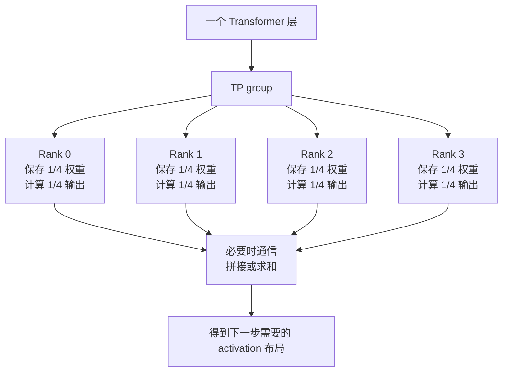
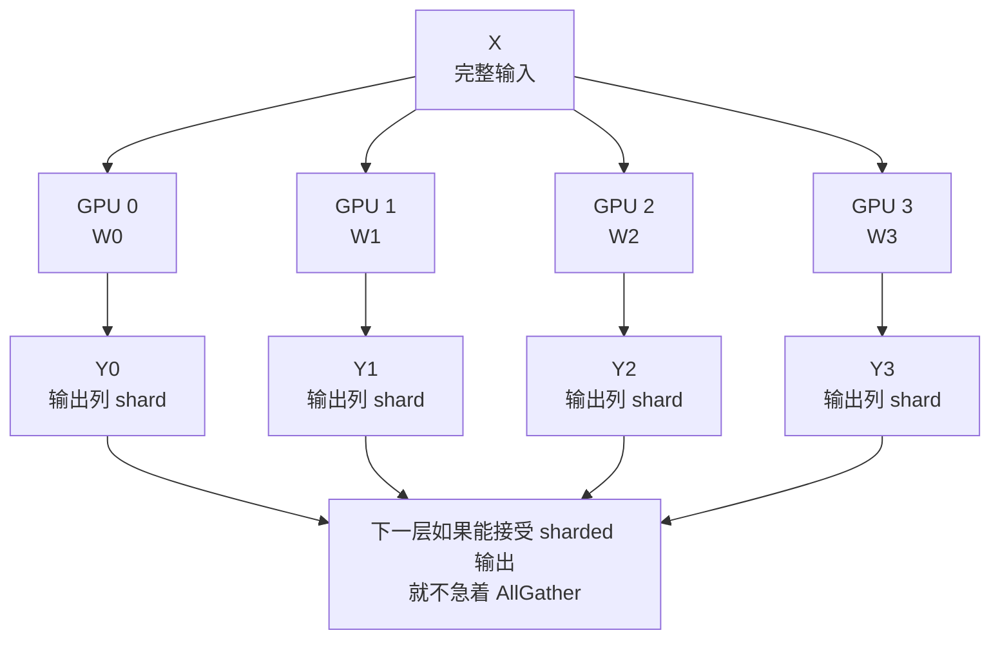
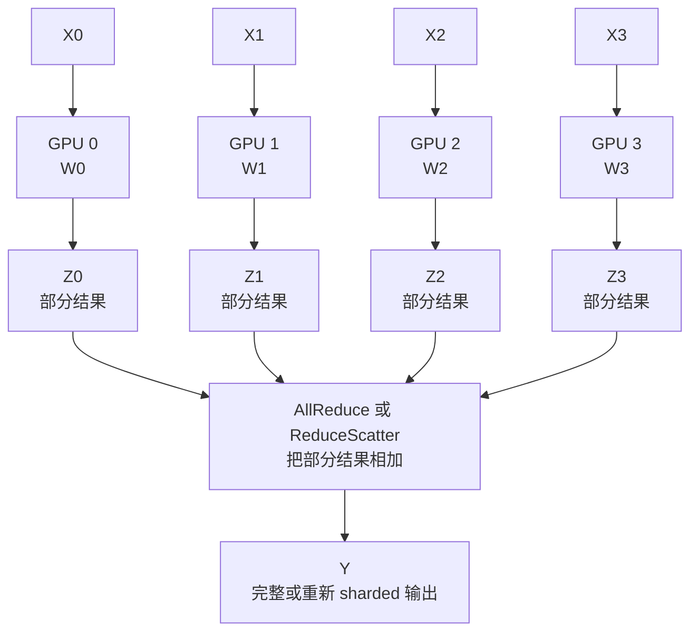
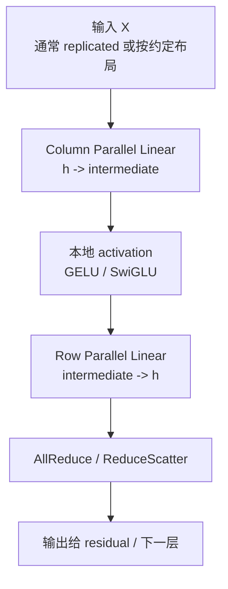
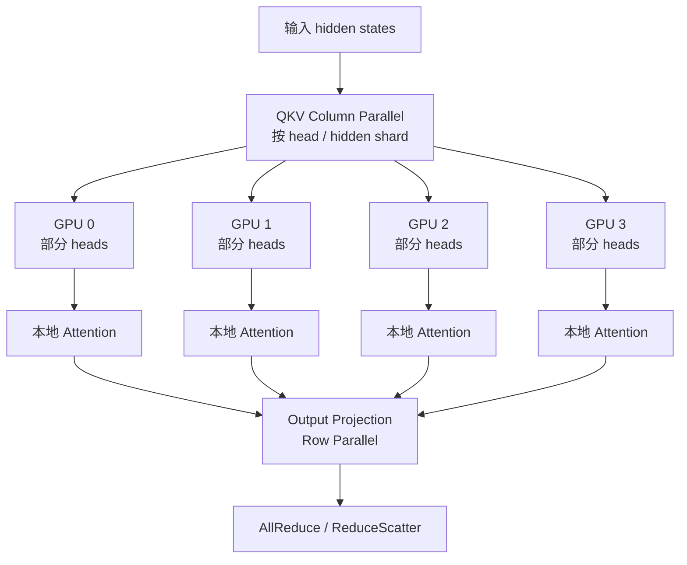

# Tensor Parallel

Data Parallel 是把不同数据分给不同 GPU。ZeRO/FSDP 是把参数、梯度、优化器状态切开，计算时再临时聚合。Tensor Parallel 则更进一步：它把一个 Transformer 层内部的大矩阵计算切到多张 GPU 上。

一句话理解：

> Tensor Parallel 的核心目标，是把单层里的大 Linear、Attention head、MLP 中间维度和词表输出切分到多个 GPU，让单卡不用独自保存和计算整层的大矩阵。

它解决的是“单层太大、单卡放不下或算不过来”的问题。代价也很明显：同一层内部的多个 GPU 必须频繁通信。

## 为什么需要 Tensor Parallel

假设一个 Transformer block 里有这些大矩阵：

- Attention 的 QKV projection。
- Attention output projection。
- MLP 的 up/gate projection。
- MLP 的 down projection。
- 最后的 LM head 或 vocab projection。

这些矩阵的维度可能非常大。例如 hidden size 是 `h`，MLP intermediate size 可能是 `4h` 或更大。一个 Linear 可以写成：

```text
Y = X W
```

其中：

- `X` 是输入 activation，形状大致是 `[tokens, h]`。
- `W` 是权重矩阵。
- `Y` 是输出 activation。

如果模型变大，`W` 会变得很大，单卡显存压力会上升；同时每一步矩阵乘的 FLOPs 也很大，单卡计算时间会变长。

Tensor Parallel 的想法是：不要让一张 GPU 保存完整 `W`，而是把 `W` 按某个维度切给多张 GPU。每张 GPU 只算自己负责的一部分，然后在必要时通过通信把结果拼起来或加起来。

## 它和其他并行方式的关系

先把几个并行方式放在一起看：

| 并行方式 | 切分对象 | 主要解决什么 | 典型通信 |
| --- | --- | --- | --- |
| Data Parallel | 数据 batch | 提高吞吐 | 梯度 AllReduce |
| ZeRO / FSDP | 参数、梯度、优化器状态 | 降低重复显存 | 参数 AllGather、梯度 ReduceScatter |
| Tensor Parallel | 层内矩阵和 activation 维度 | 单层太大或单层计算太重 | 层内 AllReduce、AllGather、ReduceScatter |
| Pipeline Parallel | 不同层 | 模型层数太多、整模型放不下 | stage 间 send/recv |
| Expert Parallel | MoE 专家 | 专家数量和专家权重太大 | token dispatch/combine、AllToAll |

Tensor Parallel 不是替代 DP、FSDP 或 PP，而是经常和它们组合：

```text
world size = DP size * PP size * TP size * EP size * ...
```

例如 64 张 GPU，可以做：

```text
TP = 8, PP = 4, DP = 2
8 * 4 * 2 = 64
```

这种组合里，每个 pipeline stage 内部可能有一个 TP group；多个相同模型副本之间再做 data parallel 或 sharded data parallel。

## TP group 和 TP size

Tensor Parallel 通常在一个通信组里发生。这个组叫 `TP group`，组内 GPU 数量叫 `TP size`。

例如 `TP size = 4`：



TP group 最好放在高速互连范围内。例如同一台服务器内的 NVLink/NVSwitch。原因很简单：Tensor Parallel 的通信发生在每个 Transformer 层内部，频率比 Data Parallel 的梯度同步更高。跨节点 TP 可以做，但会非常依赖网络带宽和延迟，通常应该谨慎使用。

## 矩阵怎么切：Column Parallel

先看最常见的矩阵乘：

```text
Y = X W
```

假设：

```text
X: [tokens, h]
W: [h, 4h]
Y: [tokens, 4h]
```

Column Parallel 是按 `W` 的输出列切分，也就是把输出维度切开：

```text
W = [W0, W1, W2, W3]
```

每张 GPU 做：

```text
Y0 = X W0
Y1 = X W1
Y2 = X W2
Y3 = X W3
```

每个 `Yi` 都只是完整 `Y` 的一部分。



Column Parallel 的关键点：

- 每张 GPU 只保存一部分输出列对应的权重。
- 每张 GPU 只计算一部分输出 feature。
- 输出天然是 sharded 的。
- 如果下一步计算也能接受 sharded 输出，就不需要马上 AllGather。
- 如果后续算子必须看到完整 `Y`，才需要把 `Y0..Y3` AllGather 起来。

直觉上，Column Parallel 像是“每张 GPU 负责生成一部分输出通道”。

## 矩阵怎么切：Row Parallel

Row Parallel 是按 `W` 的输入行切分。还是：

```text
Y = X W
```

如果：

```text
W: [4h, h]
X: [tokens, 4h]
Y: [tokens, h]
```

可以把 `W` 按输入维度切开：

```text
W = [W0; W1; W2; W3]
```

同时 `X` 也要按对应输入维度切开：

```text
X = [X0, X1, X2, X3]
```

每张 GPU 做一部分乘法：

```text
Z0 = X0 W0
Z1 = X1 W1
Z2 = X2 W2
Z3 = X3 W3
```

但最终输出是这些部分结果相加：

```text
Y = Z0 + Z1 + Z2 + Z3
```

所以 Row Parallel 后面通常需要一次求和通信，常见是 AllReduce；如果系统想让输出继续保持 sharded，也可能用 ReduceScatter。



直觉上，Row Parallel 像是“每张 GPU 负责算一部分输入贡献，最后大家把贡献加起来”。

## Column 和 Row 为什么经常成对出现

Transformer 的 MLP 通常有两层大 Linear：

```text
hidden -> intermediate -> hidden
```

例如：

```text
X: [tokens, h]
up projection:   h -> 4h
down projection: 4h -> h
```

常见切法是：

1. `up projection` 用 Column Parallel。
2. 激活函数如 GELU/SwiGLU 在本地 shard 上直接做。
3. `down projection` 用 Row Parallel。
4. 在 down projection 之后做一次求和通信。

流程如下：



这样安排的好处是：`up projection` 的输出本来就是 intermediate 维度的 shard，而 `down projection` 正好可以消费这个 sharded intermediate。中间不需要把完整 intermediate 聚合出来。

这就是 Tensor Parallel 很重要的系统思想：不要只看单个矩阵怎么切，还要看连续算子之间的 layout 能不能自然衔接。

## Attention 里怎么用 Tensor Parallel

Attention 也很适合 Tensor Parallel，因为 multi-head attention 本来就有多个 head。

一个简化的 Attention 可以分成：

1. 输入 hidden states。
2. QKV projection。
3. 按 head 做 attention。
4. output projection。

常见切法是：

- QKV projection 做 Column Parallel，把不同 head 或 head 的一部分分到不同 GPU。
- 每张 GPU 在本地计算自己负责的 head attention。
- output projection 做 Row Parallel。
- output projection 后再做一次求和通信。



如果每个 rank 持有一部分 attention heads，那么 attention score、softmax、value 加权等操作大部分可以在本地完成。通信主要发生在 projection 边界。

需要注意的是 GQA/MQA。GQA/MQA 的 KV heads 数量少于 query heads，甚至多个 query heads 共享一组 KV heads。这时不能简单假设“head 数量平均分给 TP ranks”总是成立。实际系统需要处理：

- `num_attention_heads` 是否能被 `TP size` 整除。
- `num_key_value_heads` 是否能被 `TP size` 整除。
- KV head 是否需要复制、特殊切分或限制 TP size。
- 训练和推理时 KV layout 是否一致。

## 通信发生在哪里

Tensor Parallel 的通信主要来自 layout 转换和部分结果聚合。

常见通信包括：

| 通信 | 什么时候用 | 直觉 |
| --- | --- | --- |
| AllReduce | 多个 rank 算出部分贡献，需要把它们相加并让每个 rank 得到相同结果 | Row Parallel 后常见 |
| AllGather | 每个 rank 只有输出 shard，但后续需要完整 tensor | 把切开的输出拼回来 |
| ReduceScatter | 先把部分结果相加，再把结果切给不同 rank | 常用于更省显存的 sharded layout |
| AllToAll | 一些更复杂的 token/head/sequence 重新分布 | MoE、context/sequence 相关场景更常见 |

它们和 Data Parallel 的通信有一个重要区别：

- Data Parallel 的梯度同步通常每个 backward step 发生若干次，粒度是梯度 bucket。
- Tensor Parallel 的通信发生在 Transformer 层内部，forward 和 backward 都会涉及，频率更高。

所以 TP 对互连更敏感。一个模型有 80 层，每层 MLP 和 Attention 都有 TP 通信，通信次数会很快累积。

## Backward 中也有通信

前面主要讲 forward。训练还需要 backward。

如果 forward 里某个 Linear 做了 Column Parallel 或 Row Parallel，backward 时梯度也必须按照同样的切分关系传播：

- 对输入 activation 的梯度可能需要跨 rank 求和。
- 对权重 shard 的梯度通常留在本 rank。
- 对 sharded activation 的梯度需要保持正确 layout。
- 如果 forward 做过 AllGather，backward 可能对应 ReduceScatter。
- 如果 forward 做过 ReduceScatter，backward 可能对应 AllGather。

因此评估 Tensor Parallel 时不能只看 forward time。训练 step 里 forward、backward、通信等待、optimizer step 都要一起看。

## Sequence Parallel 是什么

Tensor Parallel 主要切 hidden/intermediate/head 维度。但 Transformer 里还有一些操作不一定天然按 hidden 维度切，比如：

- LayerNorm / RMSNorm。
- Dropout。
- Residual 相关操作。
- 一些逐 token 的 elementwise 操作。

如果这些 activation 在 TP ranks 上重复保存，长序列训练时 activation 显存会很高。

Sequence Parallel 的思路是：在适合的地方按 sequence 维度切 activation，让每个 rank 只保存一部分 token 的 activation。它经常和 Tensor Parallel 配合，用来降低 activation 显存，而不是主要降低参数显存。

简化理解：

```text
Tensor Parallel:
  主要切 hidden / intermediate / head 维度

Sequence Parallel:
  主要切 sequence / token 维度
```

Sequence Parallel 会引入额外 layout 转换和通信，所以不是免费优化。它的收益通常在长上下文、大 batch、activation 显存压力大的训练中更明显。

## Vocab Parallel 和输出层

语言模型最后通常要把 hidden state 映射到词表：

```text
logits = hidden * embedding_weight^T
```

如果 vocab size 很大，LM head 和 logits 都可能很大。Vocab Parallel 是把词表维度切到多个 GPU：

```text
Rank 0: vocab shard 0
Rank 1: vocab shard 1
Rank 2: vocab shard 2
Rank 3: vocab shard 3
```

每个 rank 只计算自己那部分词的 logits。训练时如果直接 AllGather 完整 logits，显存和带宽都会很高。因此高效实现通常会配合 distributed cross entropy，让 loss 计算尽量在 sharded vocab 上完成，只通信必要的最大值、归一化项和目标 token 对应信息。

这部分很容易被忽略，但在大词表、多语言模型或超大 batch 训练中，输出层可能成为显存和通信瓶颈。

## Tensor Parallel 节省了什么

对被 TP 切分的 Linear 来说，粗略可以这样看：

| 项 | TP 后变化 |
| --- | --- |
| 权重显存 | 每 rank 大约除以 `TP size` |
| 权重梯度显存 | 每 rank 大约除以 `TP size` |
| 单 rank GEMM FLOPs | 对被切分矩阵大约除以 `TP size` |
| activation 显存 | 取决于 layout，可能部分 sharded，也可能仍 replicated |
| 通信 buffer | 会增加 |
| 同步等待 | 可能增加 |

所以 TP 不是“无脑省显存”。它省的是被切分矩阵和部分 activation 的成本，但引入了通信 buffer、layout 转换和等待时间。

如果 TP size 太大，单张 GPU 上的 GEMM 可能变小，计算效率下降；同时通信次数和通信占比上升。最后可能出现：显存是省了，但 step time 变差。

## 为什么跨节点 TP 敏感

Tensor Parallel 的通信在每层内部发生，且常常在计算依赖路径上。也就是说，某个 AllReduce 不完成，后面的 residual、LayerNorm 或下一层计算就不能继续。

跨节点 TP 的问题在于：

- 网络延迟比单机 NVLink/NVSwitch 高。
- 跨节点带宽通常低于单机 GPU 互连。
- 每层多次小到中等规模 collective 会放大延迟影响。
- 训练中 forward 和 backward 都会触发 TP 通信。

因此常见经验是：

- 优先把 TP group 放在单机高速互连域内。
- 如果单机 8 GPU，就常见 `TP size <= 8`。
- 跨节点扩展优先考虑 DP、FSDP、PP、EP，而不是先把 TP 拉跨节点。
- 只有当单层确实太大，或者模型结构要求更大 TP size 时，再考虑跨节点 TP。

这不是绝对规则，但它是很重要的默认判断。

## 如何选择 TP size

选择 TP size 时，可以按下面顺序判断。

第一，看模型维度是否能整除：

- hidden size 能否被 TP size 整除。
- attention heads 能否被 TP size 整除。
- GQA/MQA 的 KV heads 是否匹配。
- MLP intermediate size 是否能被 TP size 整除。
- vocab size 是否需要 padding 后再切分。

第二，看单卡是否放得下：

- 参数 shard 是否能放下。
- activation 是否能放下。
- optimizer states 是否由 FSDP/ZeRO 处理。
- 通信 buffer 和临时 tensor 是否会把峰值显存顶满。

第三，看通信拓扑：

- TP group 是否在同一节点内。
- 组内是否有 NVLink/NVSwitch 或等价高速互连。
- 多节点时是否能把更慢的网络留给 DP/PP/EP 通信。

第四，看计算效率：

- 每个 shard 的 GEMM 是否仍然足够大。
- kernel 是否还能跑出较高 Tensor Core 利用率。
- TP 增大后 MFU 是否下降。
- 通信时间是否开始成为 step time 主因。

一个实用原则是：

> TP size 只开到“解决单层显存和计算瓶颈所需的程度”，不要为了并行而盲目增大。

## 和 FSDP / ZeRO 的组合

Tensor Parallel 和 FSDP/ZeRO 解决的问题不同。

TP 切的是层内矩阵：

```text
一个 Linear 的权重被切到 TP group 内多个 rank
```

FSDP/ZeRO 切的是 data parallel 维度上的模型状态：

```text
不同 DP rank 之间切 parameters、gradients、optimizer states
```

组合时常见布局是：

```text
TP group:
  共同组成一个模型分片，负责一份模型副本里的层内计算

DP / FSDP group:
  多个 TP group 之间做数据并行或 sharded data parallel
```

例如 16 张 GPU：

```text
TP = 4
DP = 4

共有 4 个 TP group
每个 TP group 有 4 张 GPU
这 4 个 TP group 之间做 DP 或 FSDP
```

这样每个模型副本本身就是 tensor-parallel 的；多个副本再处理不同数据。

## 和 Pipeline Parallel 的组合

Pipeline Parallel 把不同层放到不同 stage。Tensor Parallel 则在每个 stage 内把单层切开。

可以理解为：

```text
Pipeline Parallel:
  第 1-10 层在 stage 0
  第 11-20 层在 stage 1
  第 21-30 层在 stage 2

Tensor Parallel:
  每个 stage 内，每一层的 Linear/Attention 又被切到多个 GPU
```

这种组合在超大模型训练中很常见：

- TP 解决单层太大或单层计算太重。
- PP 解决层数太多、整模型太大。
- DP/FSDP 解决吞吐和状态切分。

但组合越多，调试越难。每种并行都有自己的通信和等待，最终性能要看整体 timeline，而不是单独看某一种并行。

## 常见优化方向

### 拓扑感知的 TP group

把同一个 TP group 放在高速互连范围内。不要让 TP group 随机跨节点、跨交换机、跨 NUMA 域。训练系统启动时的 rank mapping 会直接影响 TP 通信时间。

### 避免不必要的 AllGather

Column Parallel 输出是 sharded 的。如果下一个算子可以直接消费 sharded 输出，就不要急着 AllGather。很多 TP 性能问题来自 layout 设计不好，导致每个小阶段都把 tensor 拼回完整形态。

### 使用成对的 Column/Row Parallel

MLP 中 `up projection -> activation -> down projection` 可以自然形成 Column + Row 的组合，中间保持 sharded intermediate。Attention 中 QKV projection 和 output projection 也可以形成类似结构。

### 用 ReduceScatter 替代 AllReduce 的部分场景

如果后续 layout 本来就希望是 sharded，那么 AllReduce 得到每 rank 完整输出可能是浪费。ReduceScatter 可以把“求和”和“切分结果”合在一起，降低后续显存和通信量。

### 配合 Sequence Parallel

当 activation 显存成为瓶颈时，可以考虑 Sequence Parallel，把部分逐 token activation 按 sequence 维度切开。它经常和 TP 一起使用，尤其是在长上下文训练中。

### 通信计算重叠

部分 TP 通信可以尝试和计算重叠，例如把通信切成更细粒度，或让某些 shard 先到先算。但这依赖 kernel、通信库、框架实现和计算图结构。不能只看代码里用了 async collective，就认为通信真的被隐藏了，要看 profiler timeline。

### 调整 TP size

TP size 太小，单卡可能放不下或单卡计算太慢。TP size 太大，GEMM 变小、通信变多、效率下降。调优时应该比较多个 TP size 的：

- step time。
- MFU。
- 单层 GEMM 时间。
- TP collective 时间。
- 峰值显存。
- scaling efficiency。

## Benchmark 时看什么

评估 Tensor Parallel 不能只看能否跑通。至少要看：

| 指标 | 为什么重要 |
| --- | --- |
| Step time | 最终训练速度 |
| MFU | 模型 FLOPs 利用率，反映整体计算效率 |
| TP collective time | 判断 TP 通信是否过重 |
| GEMM efficiency | TP shard 后 GEMM 是否变得太小 |
| Peak memory | TP 是否真正解决显存瓶颈 |
| Scaling efficiency | TP size 变大是否带来有效加速 |
| Network bandwidth | 跨节点或多组 TP 时尤其重要 |
| Timeline idle gap | 看 GPU 是否在等通信或等其他 rank |

做实验时要固定：

- 模型结构。
- sequence length。
- global batch size。
- micro-batch size。
- gradient accumulation。
- 精度配置。
- ZeRO/FSDP/PP/DP 设置。
- rank mapping。

否则很容易把 batch 变化、activation 变化或并行组合变化误判成 TP 本身的收益。

## 常见误区

### 误区一：TP size 越大越快

不一定。TP 增大后单卡计算减少，但通信增加，GEMM 也可能变小。超过某个点后，通信和 kernel 效率损失会抵消收益。

### 误区二：Tensor Parallel 可以随便跨节点

跨节点 TP 往往很贵。除非模型层内确实需要更大 TP size，否则优先把 TP 限制在节点内，把跨节点扩展交给 DP、FSDP、PP 或 EP。

### 误区三：Column Parallel 后必须立刻 AllGather

如果下一步是 Row Parallel 或能消费 sharded layout，就不应该马上 AllGather。保留 sharded layout 是 TP 高效的关键。

### 误区四：Attention head 平均切开就一定正确

普通 MHA 通常比较容易按 head 切。但 GQA/MQA 的 KV heads 更少，TP size、query heads、KV heads 的整除关系需要单独检查。

### 误区五：只看参数显存

训练显存还包括 activation、gradients、optimizer states、temporary buffers、通信 buffer 和 allocator overhead。TP 只解决其中一部分。

## 设计检查表

设计 Tensor Parallel 配置时，可以逐项检查：

- 当前瓶颈是单层参数、单层计算，还是 optimizer state / activation？
- hidden size、attention heads、KV heads、MLP intermediate size 是否能被 TP size 合理切分？
- TP group 是否尽量在单机高速互连内？
- MLP 是否使用 Column + Row 的配对布局？
- Attention 是否按 head 或 projection 维度合理切分？
- 是否避免了不必要的 AllGather？
- 是否需要 Sequence Parallel 来降低 activation 显存？
- TP 是否和 FSDP/ZeRO、PP、DP 的进程组划分一致？
- profiler 中 TP collective 是否成为 exposed communication time？
- 增大 TP size 后 MFU 和 step time 是否真的改善？

## 小结

Tensor Parallel 是大模型训练中最重要的层内并行方式。它把 Transformer 层里的大矩阵、Attention head、MLP intermediate 和输出词表切到多个 GPU，降低单卡显存和计算压力。

它的核心不是“把 tensor 切开”这么简单，而是要设计连续算子的 layout：

- Column Parallel 负责切输出维度。
- Row Parallel 负责切输入维度并聚合部分结果。
- MLP 和 Attention 通过 Column + Row 的组合减少中间 AllGather。
- Sequence Parallel 可以进一步降低 activation 显存。
- TP group 必须关注拓扑，因为通信频繁发生在层内部。

实际系统里，Tensor Parallel 通常和 FSDP/ZeRO、Pipeline Parallel、Data Parallel 一起使用。判断配置好坏的标准不是并行度看起来多复杂，而是 step time、MFU、显存峰值、通信暴露时间和长期稳定性是否真正变好。

## 参考资料

- [Megatron-LM: Training Multi-Billion Parameter Language Models Using Model Parallelism](https://arxiv.org/abs/1909.08053)
- [Efficient Large-Scale Language Model Training on GPU Clusters Using Megatron-LM](https://arxiv.org/abs/2104.04473)
- [Megatron Core: tensor_parallel package](https://docs.nvidia.com/megatron-core/developer-guide/latest/api-guide/tensor_parallel.html)
- [PyTorch: Tensor Parallelism](https://docs.pytorch.org/docs/2.12/distributed.tensor.parallel.html)
- [Reducing Activation Recomputation in Large Transformer Models](https://arxiv.org/abs/2205.05198)
