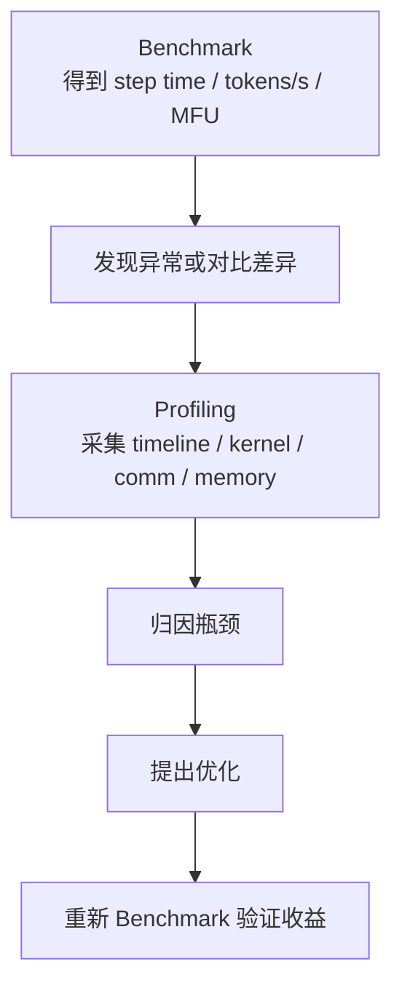

# 训练性能剖析与 Benchmark

训练性能指标告诉我们“快不快”。性能剖析和 Benchmark 要回答更具体的问题：

> 为什么快，为什么慢，改动是否真的有效，瓶颈证据在哪里？

这篇关注训练系统的实验方法：如何设计可复现 benchmark，如何采样 profiler，如何读 trace，如何定位计算、通信、数据、optimizer、checkpoint 和 straggler 问题。

## Benchmark 和 Profiling 的区别

Benchmark 是测量：

```text
在固定条件下，这个系统表现如何？
```

Profiling 是诊断：

```text
时间花在哪里？瓶颈为什么出现？
```

两者关系：



没有 benchmark，profiling 不知道要解释什么。没有 profiling，benchmark 只能得到数字，无法指导优化。

## 三类 Benchmark

训练系统里常见三类 benchmark。

### Microbenchmark

测单个算子、通信原语或小模块。

例如：

- GEMM。
- attention kernel。
- AllReduce。
- AllToAll。
- tokenizer。
- dataloader。
- optimizer step。
- checkpoint save。

优点：

- 控制变量清楚。
- 容易复现。
- 适合比较 kernel 或通信实现。

缺点：

- 不能代表端到端训练。
- 可能忽略调度、overlap、内存碎片和真实 shape 分布。

### Component Benchmark

测训练系统里的一个组件。

例如：

- 单层 Transformer forward/backward。
- 一个 pipeline stage。
- 一个 MoE layer。
- 一个 data pipeline。
- FSDP all-gather/reduce-scatter。
- checkpoint save/load。

优点：

- 比 microbenchmark 更接近真实系统。
- 仍然相对容易归因。

缺点：

- 需要构造真实输入、shape、并行组和配置。

### End-to-End Benchmark

测完整训练 loop。

例如：

```text
load data -> forward -> loss -> backward -> sync -> optimizer -> logging -> checkpoint
```

优点：

- 最接近真实训练。
- 能测真实 tokens/s、MFU、step time、稳定性。

缺点：

- 归因难。
- 噪声多。
- 改动之间容易互相影响。

成熟做法是三者结合：

```text
end-to-end 发现问题
component 定位范围
microbenchmark 验证局部优化
```

## Benchmark 的基本原则

### 固定 workload

训练 benchmark 必须明确：

- 模型结构。
- 参数量。
- sequence length。
- micro batch size。
- gradient accumulation。
- global batch tokens。
- precision。
- activation checkpointing。
- optimizer。
- scheduler。
- dataset / synthetic data。
- tokenizer / packing。
- parallelism layout。
- hardware。

只说“7B 模型在 64 卡上跑”不够。

### 固定测量窗口

训练前几个 step 常常不稳定：

- CUDA context 初始化。
- lazy kernel compile。
- memory allocator 预热。
- dataloader 预取。
- torch.compile / CUDA graph warmup。
- NCCL communicator 初始化。

所以要区分：

```text
warmup steps
measured steps
cooldown / checkpoint steps
```

例如：

```text
warmup: 20 steps
measure: 100 steps
repeat: 3 runs
report: median / p90 / p99
```

### 固定随机性

为了可比，尽量固定：

- seed。
- data order。
- dropout。
- synthetic data shape。
- sequence length 分布。
- MoE routing 输入分布。

如果不能固定，也要记录随机性范围，用多次重复测量降低误判。

### 记录环境

训练性能高度依赖环境。

建议记录：

- GPU 型号。
- GPU 数量。
- GPU clock / power limit。
- driver。
- CUDA。
- NCCL。
- cuDNN / cuBLAS。
- PyTorch。
- Transformer Engine / Triton。
- 网络拓扑。
- 存储路径。
- 容器镜像。
- git commit。
- 编译 flag。

没有环境记录，benchmark 很难复现。

## Synthetic Data 和 Real Data

训练 benchmark 常用 synthetic data，因为它能排除数据管线影响。

但 synthetic data 也有风险：

- sequence length 分布过于理想。
- padding ratio 不真实。
- MoE routing 不真实。
- tokenizer 和 packing 被跳过。
- data wait time 被隐藏。

建议分两类报告：

| 数据类型 | 用途 |
| --- | --- |
| synthetic data | 测 GPU 计算、通信、并行策略上限 |
| real data | 测端到端训练真实吞吐 |

如果 synthetic 很快、real 很慢，瓶颈大概率在 data pipeline。

如果 synthetic 和 real 都慢，优先看计算、通信、optimizer、并行策略。

## PyTorch Profiler

PyTorch Profiler 适合从训练代码内部看：

- PyTorch op。
- CPU time。
- CUDA kernel。
- memory allocation。
- operator shape。
- stack trace。
- TensorBoard trace。

典型用法：

```python
with torch.profiler.profile(
    activities=[
        torch.profiler.ProfilerActivity.CPU,
        torch.profiler.ProfilerActivity.CUDA,
    ],
    schedule=torch.profiler.schedule(wait=2, warmup=2, active=4, repeat=1),
    on_trace_ready=torch.profiler.tensorboard_trace_handler("./profiler_log"),
    record_shapes=True,
    profile_memory=True,
) as prof:
    for step, batch in enumerate(loader):
        train_step(batch)
        prof.step()
```

PyTorch 文档提醒，`schedule` 适合长训练中分段采样；`record_shapes`、`with_stack`、memory tracing 会增加额外开销。不要把 profiler 打开后得到的 step time 当成真实吞吐。

### PyTorch Profiler 看什么

常看：

- `self_cuda_time_total` 排名前几的 op。
- op input shapes。
- CPU launch overhead。
- dataloader 和 H2D copy。
- memory allocation peaks。
- CUDA kernel timeline。
- operator 与 Python stack 的对应关系。

适合回答：

- 哪些 PyTorch op 最耗时？
- shape 是否符合预期？
- 是否产生了意外 reshape/copy/contiguous？
- allocator 是否频繁分配？
- CPU 是否在 launch 或 dataloader 上卡住？

不适合单独回答：

- 多节点网络拓扑问题。
- NCCL 内部算法。
- 单个 CUDA kernel 的 SM / memory pipeline 细节。

## Nsight Systems

Nsight Systems 适合看端到端 timeline。

它能回答：

- CPU 线程在做什么。
- CUDA API 什么时候调用。
- kernel 在哪些 CUDA stream 上运行。
- memcpy 是否和计算重叠。
- NCCL 通信何时发生。
- 不同 rank 是否有 straggler。
- 是否有同步导致 GPU 空洞。

Nsight Systems 文档中，CUDA trace 会展示 CUDA API、kernel launch、memory operations 和 CUDA streams。高级 NCCL tracing 可以展示 NCCL API、runtime、GPU operations 等事件。

典型命令：

```bash
nsys profile \
  -t cuda,nvtx,nccl,osrt \
  --nccl-trace=default \
  --capture-range=cudaProfilerApi \
  --output train_trace \
  python train.py
```

实际参数要按环境调整。

### Nsight Systems 看什么

重点看：

- GPU 是否有大段 idle。
- forward/backward 是否连续。
- NCCL kernel 是否暴露在关键路径。
- communication 是否和 compute overlap。
- CPU 是否迟迟不 launch kernel。
- dataloader worker 是否阻塞。
- memcpy 是否阻塞 compute。
- pipeline stage 是否等待。
- 多 rank timeline 是否不齐。

Nsight Systems 是“系统级时间线”，不是单 kernel 优化工具。

## Nsight Compute

Nsight Compute 适合看单个 CUDA kernel 或少量 kernel 的细节。

它能回答：

- Tensor Core 是否用上。
- occupancy 是否低。
- register pressure 是否高。
- shared memory 是否限制 occupancy。
- memory bandwidth 是否打满。
- L2 hit rate。
- warp stall 原因。
- source/SASS 和性能指标的对应关系。

Nsight Compute 文档说明它可以把 SASS、PTX、CUDA/Python source 与 metric 关联，并能查看 register、stall、instruction mix 等信息。

典型使用方式：

```bash
ncu \
  --set full \
  --target-processes all \
  --kernel-name regex:flash_attn.* \
  -o flash_attn_profile \
  python train.py
```

不要一上来就用 Nsight Compute profile 完整训练。它可能 replay kernel，开销很高，并且会改变运行行为。

### Nsight Compute 看什么

适合分析：

- Triton kernel。
- 自定义 CUDA kernel。
- attention kernel。
- fused optimizer。
- grouped GEMM。
- MoE dispatch/combine kernel。

不适合分析：

- 端到端 pipeline bubble。
- 多 rank straggler。
- data pipeline。
- checkpoint stall。

## NVTX 标注

Profiler 能看到 kernel，但未必知道业务阶段。建议在训练代码里加 NVTX range：

```python
import torch.cuda.nvtx as nvtx

nvtx.range_push("forward")
loss = model(batch)
nvtx.range_pop()

nvtx.range_push("backward")
loss.backward()
nvtx.range_pop()

nvtx.range_push("optimizer")
optimizer.step()
nvtx.range_pop()
```

更实用的阶段：

- data。
- h2d。
- forward。
- loss。
- backward。
- grad_sync。
- optimizer。
- checkpoint。
- eval。

分布式训练还可以标注：

- TP all-reduce。
- FSDP all-gather。
- FSDP reduce-scatter。
- MoE all-to-all。
- pipeline send/recv。

没有 NVTX，trace 会变成一堆 kernel 名字，很难建立业务语义。

## Step Time Breakdown 怎么做

一个实用方法是在训练循环里加显式计时。

GPU 计时要注意 CUDA 异步执行。CPU 端 `time.time()` 包住 CUDA kernel launch，不等于 kernel 执行时间。

更稳妥的做法：

- 端到端 step time 用 wall-clock，并在 step 边界同步。
- 局部 GPU kernel 时间用 CUDA event 或 profiler。
- 通信 overlap 用 timeline 判断 exposed time。

示例：

```python
torch.cuda.synchronize()
t0 = time.perf_counter()

batch = next_batch()

torch.cuda.synchronize()
t1 = time.perf_counter()

loss = model(batch)
loss.backward()
optimizer.step()

torch.cuda.synchronize()
t2 = time.perf_counter()

data_time = t1 - t0
step_time = t2 - t0
```

不要在每个小阶段都频繁 synchronize；这会破坏 overlap。测量代码本身可能改变性能。

## 通信剖析

通信问题要看两个维度：

1. 总通信量大不大。
2. 通信是否暴露在关键路径。

常见通信：

- DDP AllReduce。
- FSDP / ZeRO ReduceScatter。
- FSDP / ZeRO AllGather。
- Tensor Parallel AllReduce / AllGather / ReduceScatter。
- Pipeline Parallel send/recv。
- MoE AllToAll。
- Context Parallel collectives。

Profiler 里要看：

- NCCL kernel 的开始和结束。
- NCCL kernel 是否和 compute kernel overlap。
- NCCL 前后是否有 CPU 等待。
- 不同 rank 的 NCCL 是否对齐。
- 某些 rank 是否晚到 collective。
- collective size 是否过小过碎。
- 跨节点通信是否变成瓶颈。

### 判断 exposed communication

如果一段 NCCL 完全在 backward compute 期间执行，并且没有延长 step，它是 hidden communication。

如果 backward 结束后还有 NCCL 在跑，GPU 等待通信结束，它是 exposed communication。

优化目标是减少 exposed communication：

- 调整 bucket。
- 提前发起通信。
- 增大计算通信 overlap。
- 改变 TP/PP/DP/EP 映射。
- 避免跨节点高频小通信。

## Data Pipeline 剖析

Data pipeline 问题通常表现为：

- GPU timeline 有周期性空洞。
- CPU dataloader worker 很忙。
- H2D copy 和 compute 没重叠。
- step time 抖动大。
- real data 比 synthetic data 慢很多。

要看：

- dataset read time。
- decompression time。
- tokenization time。
- packing time。
- collate time。
- dataloader queue depth。
- pinned memory。
- H2D copy stream。
- storage bandwidth。
- cache hit rate。

定位方法：

1. 用 synthetic data 跑一次。
2. 用 pre-tokenized data 跑一次。
3. 用 real data 跑一次。
4. 对比三者 step time。

如果 synthetic 快、pre-tokenized 快、real 慢，瓶颈在 tokenization 或数据读取。

如果 synthetic 快、pre-tokenized 也慢，可能是 packing、collate、H2D 或 batch shape。

## Memory Profiling

显存问题不只是 OOM。

要看：

- peak allocated。
- peak reserved。
- allocator fragmentation。
- activation 峰值。
- temporary buffer。
- communication buffer。
- optimizer state。
- checkpoint staging。

PyTorch profiler 可以打开 `profile_memory=True`。但 memory profiling 有开销，适合采样，不适合长期一直开。

常见问题：

- 某个 op 意外产生大临时 tensor。
- `.contiguous()` 造成额外副本。
- attention mask 广播成巨大 tensor。
- loss 计算保留过多中间结果。
- activation checkpoint 分段不合理。
- FSDP all-gather peak 与 activation peak 叠加。
- checkpoint staging 占 CPU/GPU 内存。

## Optimizer Profiling

Optimizer step 需要单独看。

拆分：

- gradient clipping。
- overflow check。
- unscale gradients。
- optimizer math。
- parameter update。
- scheduler step。
- zero grad。
- optimizer state offload。

AdamW 关注：

- foreach/fused 是否启用。
- `m/v` state dtype。
- master weight。
- parameter groups 是否太碎。

Muon 关注：

- Newton-Schulz GEMM 时间。
- small matrix 数量。
- temporary buffer。
- distributed gather。

ZeRO/FSDP 关注：

- optimizer state shard。
- reduce-scatter。
- all-gather。
- CPU/NVMe offload。

如果 optimizer step 在整个 step 末尾形成长尾，可能直接降低 tokens/s。

## Checkpoint Profiling

Checkpoint 经常被 benchmark 忽略，但长期训练里影响很大。

要测：

- save wall time。
- load wall time。
- blocking time。
- async staging time。
- per-rank write bandwidth。
- storage p50/p99。
- manifest 写入时间。
- cleanup time。

如果使用异步保存，要确认：

- 后台保存是否真的和训练重叠。
- staging 是否占用大量 CPU 内存。
- 下一次 checkpoint 是否等待上一次完成。
- 训练退出前是否等待保存完成。
- 失败是否上报。

## Straggler 分析

分布式训练最常见尾部问题是 straggler。

表现：

- 某些 rank 晚进入 collective。
- 所有 rank 等一个慢 rank。
- step time p99 高。
- 同一节点上的 rank 都慢。
- 某个 pipeline stage 长期慢。

原因可能是：

- GPU 性能差异。
- 热降频。
- 网络拥塞。
- 数据 shard 不均。
- MoE expert 负载不均。
- CPU dataloader 慢。
- 存储抖动。
- checkpoint 写入慢。

分析方法：

```text
collect per-rank step time
collect per-stage time
collect per-rank data time
collect per-rank communication wait
align timelines across ranks
find late rank before collective
```

只看 rank0 日志不够。

## A/B 实验怎么做

优化改动必须做 A/B。

基本原则：

- 一次只改一个主要变量。
- 固定 workload。
- 固定测量窗口。
- 重复多次。
- 报告 median 和 tail。
- 记录环境。
- 保存 trace。
- 明确统计噪声。

示例：

```text
A: baseline
B: enable fused optimizer

same:
  model
  data
  seed
  batch
  precision
  parallelism
  hardware
  warmup/measured steps

compare:
  step time
  tokens/s
  optimizer time
  peak memory
  loss continuity
```

如果只看到 2% 提升，但 run-to-run 抖动是 5%，不能声称有效。

## Profiling 的采样策略

不要长期全量 profiling。开销大，trace 巨大，也可能改变行为。

建议分层采样：

| 目标 | 工具 | 采样方式 |
| --- | --- | --- |
| 长期吞吐 | 训练日志 | 每 step 或每 N step |
| 阶段耗时 | 手工 timer / NVTX | 低开销长期记录 |
| PyTorch op | PyTorch profiler | 短窗口采样 |
| GPU timeline | Nsight Systems | 少量 step |
| 单 kernel | Nsight Compute | 指定 kernel |
| 通信 | Nsight Systems NCCL trace | 短窗口多 rank |

一个常见流程：

1. 长期日志发现 p99 step time 异常。
2. 手工 timer 判断是 data、comm、optimizer 还是 checkpoint。
3. Nsight Systems 采集异常窗口。
4. 如果是某个 kernel，再用 Nsight Compute 深入。
5. 修改后重新跑 benchmark。

## Trace 该怎么读

读 trace 不要一上来盯单个 kernel。先从宏观结构看：

1. Step 边界是否清楚。
2. 每个 step 是否稳定。
3. GPU 是否有 idle。
4. data/H2D 是否在 step 前阻塞。
5. forward/backward 是否符合模型层数。
6. communication 是否和 backward 重叠。
7. optimizer 是否在尾部形成长尾。
8. checkpoint 是否阻塞训练。
9. 多 rank 是否对齐。
10. 慢 rank 出现在 collective 前还是 collective 内。

然后再进入局部：

- 哪些 op / kernel 占时间。
- shape 是否合理。
- 是否有意外 copy。
- 是否有小 kernel 过多。
- 是否有同步点。
- 是否有 CPU launch gap。

## 常见性能现象与原因

| 现象 | 常见原因 |
| --- | --- |
| GPU timeline 周期性空洞 | data pipeline 或 CPU launch 慢 |
| backward 后还有长 NCCL | gradient sync 暴露 |
| TP 通信频繁 | TP size 太大或跨节点 |
| PP stage 有等待 | stage imbalance 或 bubble |
| MoE all-to-all 尾部很长 | expert 负载不均或网络瓶颈 |
| optimizer 尾巴长 | AdamW/Muon state 更新慢或未 fused |
| step time p99 高 | straggler、存储抖动、网络拥塞 |
| synthetic 快 real 慢 | 数据读取/tokenization/packing |
| MFU 低但 GPU 忙 | memory-bound、通信 kernel、无效重算 |
| peak memory 异常 | temporary buffer、contiguous copy、checkpoint staging |

## Benchmark 报告模板

建议每个训练 benchmark 输出一个报告目录：

```text
benchmark-2026-06-11-7b-tp4-pp2/
  config.yaml
  environment.txt
  git.txt
  metrics.csv
  summary.md
  traces/
    pytorch-profiler/
    nsys/
    ncu/
  logs/
    rank0.log
    per-rank-step-time.csv
  plots/
    step-time.png
    tokens-per-sec.png
    memory.png
```

`summary.md` 至少包含：

```markdown
# Benchmark Summary

## Workload
- model:
- sequence length:
- global batch tokens:
- precision:
- parallelism:

## Result
- step time p50/p90/p99:
- tokens/s:
- MFU:
- peak memory:

## Breakdown
- data:
- forward:
- backward:
- exposed communication:
- optimizer:
- checkpoint:

## Findings
- bottleneck:
- evidence:
- proposed next step:
```

长期积累后，这些报告会变成容量模型和架构决策的依据。

## 从 Profiling 到优化决策

Profiling 的输出不是最终目的。最终要做决策。

示例：

### 发现 backward 后 NCCL 暴露

证据：

- Nsight Systems 显示 backward compute 结束后 NCCL AllReduce 继续运行。
- step breakdown 中 exposed communication 占 20%。

可能优化：

- 调整 bucket size。
- 开启/改进 overlap。
- 使用 ReduceScatter / ZeRO。
- 改变 DP/TP/PP 配置。
- 优化 rank mapping。

### 发现 small GEMM 太多

证据：

- trace 中大量短 GEMM。
- Nsight Compute 显示 Tensor Core 利用不足。

可能优化：

- 增大 batch 或 sequence。
- 减小 TP size。
- grouped GEMM。
- kernel fusion。
- 改变 MoE expert 分组。

### 发现 data wait

证据：

- GPU step 前空洞。
- synthetic data 快很多。
- dataloader queue 经常为空。

可能优化：

- pre-tokenize。
- 增加 worker。
- 使用 mmap / streaming cache。
- 优化 packing。
- H2D overlap。

## 常见误区

### 误区一：Profiler 打开后的 step time 就是真实 step time

不一定。Profiler 有开销，尤其是 shape、stack、memory、NCCL、CUDA API 全量 tracing。真实吞吐要用低开销 benchmark 测。

### 误区二：只看 rank0 trace

分布式训练里，rank0 可能不是慢 rank。Straggler 问题必须看多 rank。

### 误区三：看到某个 kernel 最慢，就一定优化它

不一定。它可能已经接近硬件上限，也可能不在关键路径。要看它是否影响 step time。

### 误区四：microbenchmark 提升可以直接外推端到端

不一定。端到端里还有调度、overlap、内存、通信和数据。Microbenchmark 只能说明局部潜力。

### 误区五：平均 step time 足够

长期训练必须看 p90/p99 和抖动来源。尾部慢会影响大规模同步训练。

## 检查清单

做训练 benchmark/profiling 前，确认：

- workload 是否完整记录？
- warmup 和 measured steps 是否区分？
- 是否记录环境和 git commit？
- 是否固定 seed 或记录随机性？
- 是否区分 synthetic data 和 real data？
- 是否记录 p50/p90/p99？
- 是否有 step time breakdown？
- 是否采集多 rank 数据？
- 是否用 NVTX 标注阶段？
- profiler 开销是否被单独说明？
- trace 是否覆盖异常窗口？
- Nsight Systems 和 Nsight Compute 的使用目标是否区分？
- A/B 是否只改一个主要变量？
- 提升是否超过测量噪声？
- 是否保存原始日志和 trace？

## 小结

训练性能剖析的基本路径是：

1. 用 benchmark 得到稳定、可复现的端到端指标。
2. 用 breakdown 判断瓶颈大类。
3. 用 profiler timeline 定位关键路径。
4. 用 kernel profiler 深入局部。
5. 用 A/B benchmark 验证优化收益。

真正有价值的性能结论，必须同时包含数字、trace 证据、归因和复现实验条件。

## 参考资料

- [PyTorch: torch.profiler](https://docs.pytorch.org/docs/2.12/profiler.html)
- [PyTorch: torch.utils.benchmark](https://docs.pytorch.org/docs/2.12/benchmark_utils.html)
- [NVIDIA Nsight Systems User Guide](https://docs.nvidia.com/nsight-systems/UserGuide/index.html)
- [NVIDIA Nsight Compute Documentation](https://docs.nvidia.com/nsight-compute/NsightCompute/index.html)
