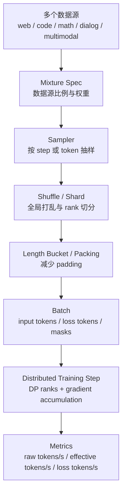

# 训练数据混合、采样与有效 Token

Data Pipeline 解决的是“数据如何被准备好并送到 GPU”。但训练系统还要回答另一个问题：

> 每一步训练到底看到了哪些数据、按什么比例看、有没有重复或跳过、这些 token 有多少真正参与 loss？

这就是训练数据混合、采样与有效 token 的问题。

它看起来像数据工程细节，但会直接影响训练效率：

- 数据比例错了，很多 GPU hour 会花在错误分布上。
- 分布式采样错了，多张 GPU 可能重复训练同一批样本。
- packing 做得差，raw tokens/s 很高但有效训练 token 很低。
- resume 后 sampler 状态错了，可能重复或跳过大量数据。
- benchmark 不记录数据混合，就无法解释 step time 和训练进展。

这篇不讨论“什么数据质量更好”，而是从系统角度讲清楚数据进入训练循环时的比例、顺序、切分、可复现和吞吐指标。

## 数据输入和数据采样不是一回事

Data Pipeline 关心链路：

```text
read -> decode -> tokenize -> transform -> pack -> H2D -> forward
```

数据采样关心语义：

```text
which dataset?
which shard?
which sample?
which rank?
which step?
which loss tokens?
```

一个数据系统可能读得很快，但采样逻辑是错的。例如：

- 8 个 rank 都读到同一批样本。
- 数据源 A 目标比例是 20%，实际训练中占了 60%。
- 短样本被过度采样，长样本几乎进不来。
- 每次 resume 都从 epoch 开头重新读，重复数据很多。
- benchmark 只统计 padded tokens，忽略 loss mask。

这些问题不一定让程序报错，但会让训练效率变差，而且很难从 GPU utilization 直接看出来。

## 一张总图

训练数据进入一个 optimizer step，可以抽象成下面这条路径：



这张图里有三个核心问题：

1. 数据混合：从哪个数据源取，比例是多少。
2. 分布式采样：每个 rank 拿到什么，是否重复，是否可恢复。
3. 有效 token：训练真正用来计算 loss 的 token 有多少。

## 为什么要做数据混合

训练数据通常不是一个单一数据集，而是多个来源混合。

例如语言模型训练可能包含：

| 数据源 | 例子 | 系统特征 |
| --- | --- | --- |
| 通用网页文本 | web corpus | 数据量大、质量波动、sequence length 分布宽。 |
| 代码 | GitHub/code corpus | token 分布特殊、长文件多、去重重要。 |
| 数学 | math solution / proof | 样本较少、结构化强、可能过采样。 |
| 对话 | instruction / chat | prompt/response 模板明显，loss mask 重要。 |
| 多模态 | image-text / video-text | 解码和对齐成本高。 |
| 合成数据 | model-generated data | 版本、过滤、去重和污染风险更高。 |

数据混合的目的不是只把它们拼成一个大文件。更常见的是给每个数据源一个比例或权重：

```yaml
mixture:
  web: 0.50
  code: 0.20
  math: 0.15
  dialog: 0.10
  multimodal: 0.05
```

训练系统要保证实际训练过程中接近这个比例。

## 数据比例按什么计

最容易出错的是“比例”的单位。

数据混合比例可以按多种口径定义：

| 口径 | 含义 | 风险 |
| --- | --- | --- |
| sample ratio | 每类样本数比例 | 短样本和长样本训练量不等。 |
| token ratio | 每类 token 数比例 | 需要提前知道或估计 token 数。 |
| loss-token ratio | 真正参与 loss 的 token 比例 | SFT/DPO 等场景更合理，但更复杂。 |
| byte ratio | 原始数据字节比例 | 和训练 token 不一定对应。 |
| step ratio | 每多少 step 取某类数据 | 简单，但变长 batch 下 token 比例可能漂移。 |

对 LLM 训练，通常更关心 token 级比例，特别是 loss token 比例。原因很简单：模型真正从 loss token 上得到训练信号。

例如两个数据源：

```text
A: 1000 samples, each 128 loss tokens
B: 1000 samples, each 2048 loss tokens
```

如果按 sample 1:1 混合，loss token 实际比例是：

```text
A tokens = 1000 * 128  = 128K
B tokens = 1000 * 2048 = 2048K
```

B 实际占了 94% 以上的 loss token。样本比例看似均衡，训练信号并不均衡。

## 有限数据集与无限采样

数据源有两种常见形态。

第一种是有限 dataset：

```text
dataset has N samples
train for E epochs
```

这种场景里，epoch 语义清楚：看完一遍数据算一个 epoch。

第二种是大规模 streaming / mixture：

```text
train for T tokens or S steps
sample from many streams
```

这种场景里，epoch 可能没有明确意义。训练更像“持续从多个数据流采样，直到达到目标 token 数”。

很多大模型训练更接近第二种。此时要记录：

- consumed tokens。
- consumed loss tokens。
- consumed samples。
- 每个数据源 consumed tokens。
- 每个数据源 sampling weight。
- 当前 shard/cursor。

否则 resume 和复现实验都会变得模糊。

## 常见混合策略

### Round-robin

按固定顺序轮流取数据：

```text
web -> code -> math -> web -> code -> math
```

优点：

- 简单。
- 比例容易控制。
- 容易 debug。

缺点：

- 周期性明显。
- 不适合比例很不均衡的多数据源。
- 数据源长度差异大时需要处理耗尽问题。

### Weighted random sampling

按权重随机选择数据源：

```text
P(web) = 0.5
P(code) = 0.2
P(math) = 0.3
```

优点：

- 简单灵活。
- 支持很多数据源。
- 长期比例接近期望值。

缺点：

- 短窗口内比例会波动。
- resume 时要保存 RNG 状态。
- 分布式 rank 之间要避免重复和偏差。

### Token-budget sampling

按 token budget 控制每个数据源进入训练的 token 数。

例如：

```text
target total = 1T tokens
web target   = 500B tokens
code target  = 200B tokens
math target  = 150B tokens
dialog target= 150B tokens
```

优点：

- 更贴近 LLM 训练量。
- 容易和容量模型、成本模型对齐。
- 适合长期训练计划。

缺点：

- 需要准确统计 token。
- 变长样本和 packing 会让实时控制更复杂。
- 多数据源耗尽时需要重新归一化比例。

### Curriculum / staged mixture

训练过程中改变数据比例：

```text
phase 1: web-heavy
phase 2: code/math upweight
phase 3: instruction/dialog upweight
```

系统上这意味着 mixture spec 是时间相关的：

```yaml
phases:
  - until_tokens: 100B
    mixture: {web: 0.70, code: 0.20, math: 0.10}
  - until_tokens: 200B
    mixture: {web: 0.45, code: 0.35, math: 0.20}
```

这种策略更难复现。checkpoint 不仅要保存模型状态，还要保存当前 phase、consumed tokens 和 sampler 状态。

## 分布式采样的基本要求

Data Parallel 中，每个 rank 都跑一份模型副本。每个 step，各 rank 应该处理不同数据，然后同步梯度。

如果有 8 个 rank，一个 global step 应该类似：

```text
rank 0: samples 0..15
rank 1: samples 16..31
rank 2: samples 32..47
...
rank 7: samples 112..127
```

而不是：

```text
rank 0: samples 0..15
rank 1: samples 0..15
rank 2: samples 0..15
...
```

后者会让 8 张 GPU 重复训练同一批数据。梯度同步仍然能运行，loss 也可能下降，但有效数据吞吐只有预期的 1/8。

分布式采样要满足：

- 不同 rank 尽量不重复。
- 每个 rank 的 batch 数相同或接近。
- shuffle 顺序可复现。
- 训练恢复后不会大规模重复或跳过。
- 数据源比例在全局而不是单 rank 层面接近期望值。

PyTorch 的 `DistributedSampler` 这类工具解决的是基本 rank 切分和 shuffle 问题，但复杂 mixture、streaming dataset、packing buffer 和 token-budget sampling 通常还需要更上层的状态管理。

## `set_epoch` 为什么重要

很多分布式 sampler 会用 `epoch` 和随机种子共同决定 shuffle 顺序。

如果每个 epoch 不更新 sampler 的 epoch，shuffle 顺序可能每轮都一样。

典型训练循环里会看到：

```python
for epoch in range(num_epochs):
    sampler.set_epoch(epoch)
    for batch in dataloader:
        train_step(batch)
```

这件事系统上很重要：

- 每个 rank 必须使用一致的 epoch。
- resume 后 epoch 必须恢复正确。
- gradient accumulation 不应该让 sampler step 语义混乱。
- 如果没有明确 epoch，streaming sampler 也需要等价的 global step / token counter。

对大规模 streaming 训练，`epoch` 不一定是核心概念，但“shuffle seed + consumed position”仍然必须明确。

## 数据源耗尽怎么办

多个数据源混合时，有些数据源可能先耗尽。

例如：

```text
web: 500B tokens
math: 20B tokens
target mixture: web 50%, math 50%
```

如果训练目标是 200B tokens，math 数据很快就会被重复采样。

常见策略：

| 策略 | 含义 | 风险 |
| --- | --- | --- |
| repeat | 数据源耗尽后从头重复 | 小数据集可能被过度重复。 |
| stop | 某源耗尽后停止训练或报错 | 不适合长期 streaming。 |
| reweight | 耗尽后重新归一化其他数据源 | 实际 mixture 会变化。 |
| cap upsampling | 限制小数据源最多重复次数 | 需要记录重复比例。 |
| phase switch | 到达条件后切到下一阶段 mixture | curriculum 更复杂。 |

无论哪种策略，都应该写入 run manifest。否则训练结果和性能数据都无法解释。

## Shuffle buffer 与局部随机性

大规模数据不一定能全量 shuffle。常见做法是 shuffle shard 顺序，再在 shard 内或跨 shard 用 buffer 做局部打乱。

例如：

```text
shuffle shards globally
read samples into buffer of size B
randomly draw from buffer
refill buffer
```

buffer 越大，随机性越好，但内存和启动成本越高。buffer 太小，数据顺序相关性强，连续 batch 可能高度相似。

系统上要记录：

- shard shuffle seed。
- sample shuffle seed。
- shuffle buffer size。
- worker 数。
- rank 切分方式。
- resume cursor。

否则同一个代码版本在不同 worker 数或不同 world size 下，可能读到完全不同的数据顺序。

## Packing 与 loss mask

有效 token 是训练数据系统的核心指标之一。

一个 batch 里的 token 可以分成：

```text
token slots: padding 后模型实际计算的位置
input tokens: 非 padding token
loss tokens: 真正参与 loss 的 token
```

SFT 里，prompt token 通常参与 forward，但不参与 loss：

```text
[system][user prompt][assistant answer]
 loss: 0      0           1 1 1
```

Packing 会把多个短样本拼进一个长 sequence，减少 padding：

```text
sequence = sample A + sample B + sample C
```

但 packing 必须正确处理：

- attention mask，避免样本之间错误互相看见。
- loss mask，避免 prompt 或 padding 参与 loss。
- position id，不同样本边界是否重置。
- EOS / separator。
- labels shift。
- 长度截断。

Packing 做错，模型可能训练在错误上下文上；packing 做慢，则 GPU 等数据。

## 有效 token 指标

建议至少记录三类吞吐：

| 指标 | 含义 | 用途 |
| --- | --- | --- |
| raw tokens/s | `batch_size * padded_seq_len` | 反映模型实际计算 token slots。 |
| input tokens/s | 非 padding token | 反映数据有效输入量。 |
| loss tokens/s | 参与 loss 的 token | 反映真正训练信号吞吐。 |

例如：

```text
batch token slots = 8 * 4096 = 32768
input tokens = 24000
loss tokens = 12000
step time = 1.0s
```

那么：

```text
raw tokens/s  = 32768
input tokens/s = 24000
loss tokens/s  = 12000
```

如果只看 raw tokens/s，会以为系统吞吐很好；但如果 loss tokens/s 很低，说明大量计算没有产生直接训练信号。

对 SFT、DPO、后训练和多模态训练，loss tokens/s 往往比 raw tokens/s 更能解释训练效率。

## 数据混合与 loss 归一化

多数据源、变长序列、多 rank 训练时，loss 归一化要非常明确。

常见错误是每个 micro-batch 直接取平均：

```text
loss = mean(loss_per_token_in_micro_batch)
```

如果不同 micro-batch 的 loss token 数差异很大，再简单平均 micro-batch loss，就会让短 batch 权重过高。

更稳妥的语义是按全局 loss token 数归一化：

```text
global_loss =
  sum(loss over all loss tokens across all ranks and accumulation steps)
  / total_loss_tokens
```

这会牵涉：

- 每个 rank 统计本地 loss tokens。
- gradient accumulation 期间累计 loss token 数。
- 必要时跨 rank all-reduce token count。
- logging 使用同一套分母。

如果 loss 归一化语义不清，改变 packing、batching、DP size 或 sequence length 都可能改变训练行为。

## Resume 时要保存什么

长期训练中断很常见。恢复训练时，数据系统状态也要恢复。

至少要记录：

| 状态 | 为什么重要 |
| --- | --- |
| global step | 知道训练进行到哪里。 |
| consumed samples | 样本级进度。 |
| consumed input tokens | 输入 token 进度。 |
| consumed loss tokens | 训练信号进度。 |
| dataset mixture phase | 当前数据比例阶段。 |
| per-source consumed tokens | 每个数据源用掉多少。 |
| shard cursor | 当前读到哪个 shard。 |
| sample cursor | shard 内位置。 |
| RNG state | shuffle 和 weighted sampling 可复现。 |
| packing buffer | 未完成 packing 的短样本缓存。 |
| worker seed | 多 worker 随机性。 |

如果只保存模型 checkpoint，不保存 sampler 状态，恢复后可能：

- 重复读大量数据。
- 跳过数据。
- 数据源比例漂移。
- curriculum phase 错位。
- benchmark 的 consumed tokens 对不上。

对超大规模训练，完全 bitwise 恢复数据顺序可能很难，但至少要能解释和控制重复/跳过范围。

## World size 变化的影响

训练恢复时，world size 可能变化。例如从 256 张 GPU 恢复到 128 张 GPU。

这会影响：

- 每个 rank 的数据分片。
- global batch。
- gradient accumulation。
- shard 分配。
- sampler cursor。
- checkpoint 中的数据位置语义。

如果数据按 rank 固定切 shard，world size 变化后很难无缝恢复原顺序。

常见处理方式：

- 不允许 world size 变化恢复。
- 允许变化，但按 consumed global tokens 对齐。
- 使用全局样本 id / token offset 做采样，而不是 rank-local cursor。
- 记录允许的重复/跳过范围。

这属于训练系统设计问题，不是 DataLoader 小细节。

## 多模态训练中的采样复杂性

多模态训练更复杂，因为不同模态的“训练量”不容易统一。

例如：

- 一张图片等价多少 text tokens？
- 一个 8 秒视频等价多少训练 token？
- 图文样本和纯文本样本如何混合？
- 缺失图像或坏视频样本过滤后，比例是否改变？
- 图像 decode 慢导致某类数据实际吞吐低，是否会拖慢所有 rank？

系统上要分开记录：

- text tokens。
- image count / image patches。
- video frames。
- audio duration。
- loss tokens。
- modality ratio。
- filtered sample count。

如果只用 sample ratio，多模态训练的资源消耗和训练信号都会被掩盖。

## Benchmark 应该记录什么

训练数据相关 benchmark 至少要记录：

```yaml
data:
  sources:
    - name: web
      weight: 0.5
      unit: loss_tokens
      shards: ""
      tokenizer_revision: ""
    - name: code
      weight: 0.2
      unit: loss_tokens
      shards: ""
      tokenizer_revision: ""
  mixture_strategy: weighted_random
  shuffle:
    shard_seed: 1234
    sample_seed: 5678
    buffer_size: 100000
  distributed:
    world_size: 256
    data_parallel_size: 128
    rank_sharding: global_sample_id
  packing:
    enabled: true
    max_sequence_length: 4096
    pack_across_documents: false
  resume:
    consumed_samples: null
    consumed_input_tokens: null
    consumed_loss_tokens: null
metrics:
  raw_tokens_per_second: null
  input_tokens_per_second: null
  loss_tokens_per_second: null
  padding_ratio: null
  packing_efficiency: null
  per_source_loss_tokens: {}
```

这个 manifest 让人和 AI 都能回答：

- 数据比例按什么单位定义。
- 每个数据源实际进入训练多少 token。
- benchmark 的 tokens/s 是 raw、input 还是 loss。
- 分布式采样是否改变了数据顺序。
- resume 后数据位置是否可信。

## 常见故障

### 多 rank 重复数据

症状：

- GPU utilization 正常。
- loss 正常下降。
- 但有效训练数据吞吐远低于预期。

排查：

- 每个 rank 打印样本 id 范围。
- 检查是否使用 distributed sampler。
- 检查 rank、world size、worker id 是否进入 shard 逻辑。
- 检查 iterable dataset 是否在每个 worker 重复读全量数据。

### 数据比例漂移

症状：

- 目标 mixture 和实际训练 token 统计不一致。
- 某些数据源过度出现或很少出现。

排查：

- 按数据源记录 samples/input tokens/loss tokens。
- 检查比例单位是 sample 还是 token。
- 检查数据源耗尽后的策略。
- 检查过滤、截断、packing 后比例是否变化。

### 有效 token 很低

症状：

- raw tokens/s 高。
- loss tokens/s 低。
- GPU 算了很多 padding 或 prompt。

排查：

- 按长度 bucketing。
- 开启或优化 packing。
- 检查 loss mask。
- 检查 max sequence length 是否过大。
- 分开统计 prompt tokens 和 response loss tokens。

### Resume 后训练曲线异常

症状：

- 恢复后 loss 突然变化。
- 数据比例统计重置。
- 重复看到同一批数据。

排查：

- checkpoint 是否保存 sampler 状态。
- consumed tokens 是否恢复。
- RNG state 是否恢复。
- mixture phase 是否恢复。
- world size 是否变化。

### DataLoader worker 造成重复

Iterable dataset 如果没有按 worker 切分，多个 worker 可能读到同一段数据。

需要检查：

- worker id。
- num workers。
- rank id。
- shard assignment。
- global sample id。

很多重复数据问题不是 GPU rank 造成的，而是 rank 内部多个 worker 重复读。

## 常见优化方向

### 预先统计 token 分布

在大规模训练前，先统计每个数据源：

- samples。
- input tokens。
- loss tokens。
- sequence length histogram。
- bad sample ratio。
- shard size。

这能帮助制定 mixture、packing、batch 和容量模型。

### 分桶与 packing 结合

按长度分桶减少 padding，再对短样本做 packing，通常比简单 padding 高效。

但不要只追求 packing 效率，也要保持：

- attention mask 正确。
- loss mask 正确。
- 文档边界语义明确。
- packing 算法不成为 CPU 瓶颈。

### 训练时实时监控数据比例

每隔一段 step 输出：

```text
source=web  loss_tokens=...
source=code loss_tokens=...
source=math loss_tokens=...
padding_ratio=...
packing_efficiency=...
```

这比训练结束后才发现比例错误更可靠。

### 用全局 id 简化排查

给每个样本或 token span 一个可追踪 id：

```text
source_id / shard_id / sample_id / token_offset
```

它能帮助定位：

- 是否重复。
- 哪个 shard 慢。
- 哪类样本导致异常。
- resume 后从哪里继续。

### 把数据状态纳入 checkpoint

如果训练目标是可复现和可恢复，数据状态必须和模型状态一样认真。

Checkpoint 至少要能回答：

- 当前读到哪里。
- 各数据源用了多少。
- shuffle/RNG 状态是什么。
- packing buffer 是否有未消费样本。
- world size 变化时怎么恢复。

## 学习顺序建议

建议按这个顺序理解：

1. 先区分 Data Pipeline 和 Sampler：一个关心供给速度，一个关心数据语义。
2. 再明确 mixture ratio 的单位：sample、token、loss token 不是一回事。
3. 然后理解 distributed sampling：多 rank 必须读不同数据，并能可复现 shuffle。
4. 接着理解 packing、loss mask 和有效 token。
5. 最后把 sampler 状态、数据源 consumed tokens 和 mixture phase 放进 checkpoint 与 benchmark manifest。

记住一句话：

> 训练吞吐不是 raw tokens/s 越高越好，而是正确数据分布下的有效 loss tokens/s 越高越好。

## 参考资料

- [PyTorch Data Loading and Processing Tutorial](https://docs.pytorch.org/tutorials/beginner/data_loading_tutorial.html)
- [PyTorch `torch.utils.data` documentation](https://docs.pytorch.org/docs/stable/data.html)
- [Hugging Face Datasets streaming documentation](https://huggingface.co/docs/datasets/stream)
- [MosaicML StreamingDataset documentation](https://docs.mosaicml.com/projects/streaming/en/stable/)
