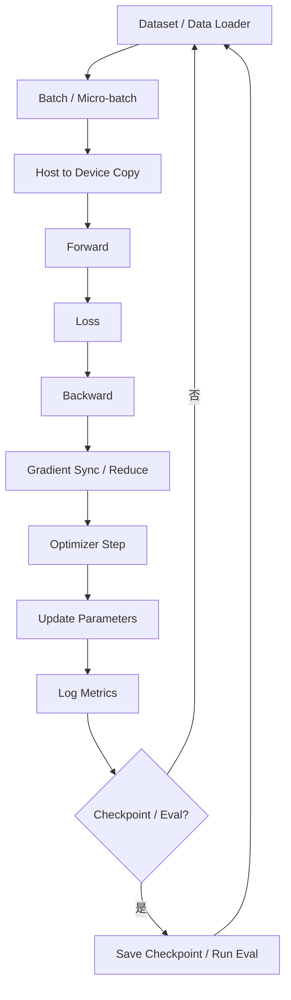

# 训练任务生命周期

训练任务生命周期描述一次训练作业从读取数据到更新参数、记录指标、保存 checkpoint 的完整过程。它是理解训练系统优化的入口。

一句话理解：

> 训练系统优化不是只让一次 forward 更快，而是让数据、计算、反向传播、通信、显存、优化器和 checkpoint 这一整条链路高效稳定地循环起来。

推理系统的核心是“服务请求并生成 token”。训练系统的核心是“反复执行 step，并让模型参数朝着损失更低的方向更新”。这两个系统都关心 GPU 利用率、显存、通信和吞吐，但训练比推理多了反向传播、梯度同步、优化器状态、checkpoint 和长时间稳定性。

## 一个训练任务在做什么

训练任务通常包含很多个 step。每个 step 处理一个 batch，计算 loss，再根据梯度更新模型参数。

简化地说：

1. 读取一批训练数据。
2. 把数据送入模型做 forward。
3. 计算模型预测和目标之间的 loss。
4. 做 backward，计算每个参数的梯度。
5. 在多 GPU / 多节点之间同步或规约梯度。
6. optimizer 根据梯度更新参数。
7. 记录 loss、吞吐、显存、学习率等指标。
8. 定期保存 checkpoint。

这个过程会重复成千上万甚至数百万次。训练系统的效率，取决于每个 step 的耗时、资源利用率、稳定性和恢复能力。

## 总体流程

一个典型训练 step 可以画成下面这样：



这张图有两个重点。

第一，训练是一个循环。优化目标不是只优化某个单次算子，而是降低稳定运行时的 step time。

第二，训练链路里有很多非模型计算：数据读取、CPU 预处理、通信、checkpoint、日志和评估都可能成为瓶颈。

## 训练和推理的关键差异

训练和推理都运行模型，但系统压力不同。

| 维度 | 推理 | 训练 |
| --- | --- | --- |
| 主要目标 | 低延迟、高吞吐、服务稳定 | 低 step time、高扩展效率、长期稳定 |
| 参数是否更新 | 不更新 | 每个 step 更新 |
| 是否需要 backward | 通常不需要 | 必须需要 |
| 主要缓存 | KV Cache | activation、gradient、optimizer state |
| 显存压力 | 权重 + KV Cache | 权重 + activation + gradient + optimizer state |
| 通信重点 | tensor parallel、KV 传输、请求路由 | gradient sync、parameter shard、optimizer state shard |
| 稳定性重点 | 请求失败、超时、OOM | 长时间训练、checkpoint、恢复、数值稳定 |

训练系统里，显存占用通常比推理复杂。一个参数不只占一份权重，还可能对应梯度、优化器状态和 master weight。大模型训练之所以难，很大一部分原因就是这些状态太多。

## Data Pipeline：数据先要喂得上

训练 step 的第一环是数据。

数据 pipeline 通常包括：

- 读取样本。
- 解压或反序列化。
- 文本 tokenization。
- 图像解码和增强。
- 样本过滤。
- batch 拼接。
- padding / packing。
- host memory 到 GPU memory 拷贝。

如果数据 pipeline 慢，GPU 会等数据。表现上可能是 GPU utilization 不高，但模型 forward/backward 本身并不慢。

常见数据瓶颈包括：

- 小文件太多，文件系统随机读取慢。
- tokenizer 在 CPU 上成为瓶颈。
- 数据增强太重。
- DataLoader worker 数不足。
- 网络存储带宽不够。
- batch packing 效率低，padding 太多。
- host-to-device copy 没有和计算重叠。

所以训练优化第一步不是盯 GPU kernel，而是确认 GPU 是否真的持续有数据可算。

## Batch、Micro-batch 和 Global Batch

训练里经常会看到多个 batch 概念。

| 概念 | 含义 |
| --- | --- |
| micro-batch | 单次 forward/backward 处理的小 batch |
| per-device batch | 每张 GPU 一次处理的样本数 |
| gradient accumulation steps | 累积多少个 micro-batch 后再更新参数 |
| data parallel size | 数据并行副本数 |
| global batch | 一次 optimizer step 等价处理的总样本数 |

常见关系是：

```text
global batch =
  micro-batch size
* gradient accumulation steps
* data parallel size
```

为什么要区分这些概念？

因为显存、吞吐和训练动态都受它们影响。

- micro-batch 越大，单步计算更饱满，但 activation 显存更高。
- gradient accumulation 可以提高 global batch，但会增加多个 micro-step。
- data parallel size 增加后，global batch 也会增加，除非调整 accumulation 或 per-device batch。
- global batch 太大可能影响优化过程，需要调整学习率和 warmup。

系统优化里，batch 设置不是单纯“越大越好”，而是要同时满足显存、吞吐、通信和训练稳定性。

## Forward：计算预测和保存 Activation

Forward 是模型读取输入并计算预测的过程。

在 Transformer 训练中，forward 通常包括：

- embedding。
- attention。
- MLP。
- normalization。
- residual connection。
- loss 相关输出。

和推理不同，训练的 forward 不能只算完就丢。为了 backward 计算梯度，系统需要保存一部分中间结果，也就是 activation。

Activation 会占大量显存，尤其在以下场景：

- batch size 大。
- sequence length 长。
- hidden size 大。
- layer 数多。
- micro-batch 多。

这也是为什么训练长上下文模型非常吃显存。输入 token 数增加，不仅计算更多，activation 也更多。

## Loss：把预测变成优化目标

Loss 是训练信号。模型 forward 后会得到预测，loss 用来衡量预测和目标之间的差距。

以语言模型为例，常见训练目标是预测下一个 token。模型对每个位置给出词表概率，loss 衡量正确 token 的概率是否足够高。

从系统角度看，loss 本身通常不是最大开销，但它连接 forward 和 backward：

- loss 标量是 backward 的起点。
- loss 计算可能涉及 logits、label、mask。
- 大词表 logits 会占显存和带宽。
- sequence packing 和 loss mask 会影响有效 token 数。

训练吞吐最好按有效 token 统计，而不是只看 batch 里填充后的 token。padding 太多会让系统看起来 tokens/s 不低，但真正有效训练 token 少。

## Backward：计算梯度

Backward 是训练和推理最大的区别之一。

Forward 计算预测，backward 计算 loss 对每个参数的梯度。优化器再根据梯度更新参数。

Backward 通常比 forward 更重，因为它要沿着计算图反向传播，并为大量参数计算梯度。

它带来的系统压力包括：

- 需要读取 forward 保存的 activation。
- 需要生成 gradient。
- 需要执行大量矩阵乘和 attention 反向计算。
- 多 GPU 训练时需要同步梯度。
- activation 和 gradient 会同时占用显存。

Backward 的另一个特点是有天然的层次顺序：从最后一层往前计算梯度。这为通信重叠创造了机会。例如某些层的梯度算出来后，可以一边继续算前面层的 backward，一边启动梯度 AllReduce。

## Gradient Accumulation：用时间换显存

Gradient Accumulation 是训练里常见技巧。它的做法是：连续处理多个 micro-batch，把梯度累积起来，等累积到指定次数后再执行 optimizer step。

它解决的问题是：显存放不下很大的 batch，但又希望 global batch 足够大。

流程可以理解为：

```text
for each optimizer step:
  zero gradients
  for i in accumulation steps:
    forward micro-batch i
    backward micro-batch i
    accumulate gradients
  gradient sync
  optimizer step
```

收益：

- 可以在有限显存下实现更大的 global batch。
- micro-batch 更小，activation 显存更低。

代价：

- 一个 optimizer step 需要多次 forward/backward。
- step time 增加。
- 如果通信只在 accumulation 最后同步，需要正确控制同步时机。

所以 gradient accumulation 是显存和时间之间的权衡。

## Gradient Sync：多 GPU 训练的同步点

单 GPU 训练中，梯度只在本 GPU 上计算。多 GPU data parallel 训练中，每张 GPU 处理不同数据，但模型副本需要保持一致，因此梯度要同步。

最常见做法是 AllReduce：

1. 每张 GPU 计算本地 gradient。
2. 所有 GPU 对 gradient 求和或平均。
3. 每张 GPU 得到相同的全局 gradient。
4. 每张 GPU 执行相同的 optimizer step。

Gradient sync 是训练系统的重要瓶颈之一。模型越大，梯度越多；GPU 越多，通信拓扑越重要。

常见优化方向包括：

- gradient bucketing。
- backward 与 AllReduce 重叠。
- 使用更高带宽互联。
- 减少同步频率。
- gradient compression。
- optimizer state sharding。

同步失败或通信慢，会直接拉长 step time。多节点训练里，网络往往比单机更容易成为扩展效率瓶颈。

## Optimizer Step：真正更新参数

Optimizer step 用梯度更新参数。

最简单的 SGD 更新可以理解为：

```text
new_weight = old_weight - learning_rate * gradient
```

实际大模型训练更常用 Adam 或 AdamW。它们不只保存参数和梯度，还保存一阶、二阶动量等 optimizer state。

这带来显存问题：

- 参数本身占一份。
- 梯度占一份。
- Adam 一阶动量占一份。
- Adam 二阶动量占一份。
- 混合精度训练还可能有 FP32 master weight。

因此训练大模型时，optimizer state 可能比模型权重本身还占显存。ZeRO、FSDP 等技术很大程度上就是为了解决这些状态在数据并行副本之间重复存储的问题。

## Mixed Precision：降低计算和显存成本

Mixed Precision 是训练系统常用优化。它用较低精度做大部分计算，例如 FP16、BF16、FP8，同时在必要位置保留更高精度以维持数值稳定。

收益包括：

- 降低显存占用。
- 提高矩阵计算吞吐。
- 降低内存带宽压力。

风险包括：

- 梯度 underflow / overflow。
- loss 变成 NaN。
- 某些算子对低精度敏感。
- 不同硬件支持不同精度。

FP16 通常需要 loss scaling 来避免梯度过小。BF16 动态范围更接近 FP32，使用上常更稳定。FP8 可以进一步降低成本，但更依赖硬件和框架支持。

混合精度不是只看速度，还要看 loss 曲线、收敛稳定性和最终模型质量。

## Checkpoint：训练系统的保险

大模型训练可能运行数天、数周甚至更久。任何节点故障、网络问题、存储问题、NaN 或作业抢占，都可能中断训练。

Checkpoint 的作用是保存训练状态，便于恢复。

一个完整 checkpoint 通常包括：

- model parameters。
- optimizer state。
- learning rate scheduler state。
- random seed / RNG state。
- dataloader state。
- step number。
- mixed precision scaler state。
- parallelism / sharding metadata。

Checkpoint 的挑战在于它很大，而且保存会占用 I/O 和存储带宽。

常见问题包括：

- checkpoint 太慢，周期性拖慢训练。
- 存储带宽不足。
- 多节点同时写造成拥塞。
- 只保存模型权重，恢复后 optimizer 状态丢失。
- 数据顺序无法恢复，影响复现。
- sharded checkpoint 和并行配置绑定，迁移困难。

训练系统必须在恢复能力和 I/O 开销之间取舍。

## Evaluation 与 Logging

训练过程中通常会定期评估模型并记录指标。

常见指标包括：

- training loss。
- validation loss。
- learning rate。
- gradient norm。
- tokens/s。
- samples/s。
- step time。
- GPU memory。
- MFU。
- communication time。
- data loading time。

Evaluation 也会消耗资源。如果评估太频繁，训练会被打断；如果评估太少，问题发现太晚。

Logging 也不是免费。过于频繁的日志、过大的指标、同步写入远端服务，都可能拖慢训练。系统上要区分高频轻量指标和低频详细日志。

## Step Time Breakdown

训练系统优化最重要的指标之一是 step time。

可以把 step time 拆成：

| 阶段 | 说明 |
| --- | --- |
| data time | 等待数据和 CPU 预处理 |
| H2D copy | host 到 GPU 的数据拷贝 |
| forward time | 前向计算 |
| loss time | loss 和 mask 计算 |
| backward time | 反向传播 |
| communication time | 梯度同步或参数通信 |
| optimizer time | 参数更新和 optimizer state 更新 |
| checkpoint / eval time | 周期性保存和评估 |

优化时要先知道哪一段占比最高。

如果 data time 高，应该优化数据管线。如果 communication time 高，应该看并行策略、bucket、overlap 和网络。如果 optimizer time 高，应该看 optimizer state、sharding 或 fused optimizer。

不要在没有 breakdown 的情况下调参数。

## 显存组成

训练显存通常由几部分组成：

| 显存项 | 说明 |
| --- | --- |
| parameters | 模型权重 |
| gradients | 每个参数对应的梯度 |
| optimizer states | Adam/AdamW 等优化器状态 |
| activations | forward 保存给 backward 用的中间结果 |
| temporary buffers | 算子临时 workspace、通信 buffer |
| fragmentation | 分配器碎片和未完全利用空间 |

大模型训练里，显存优化通常从这些方向入手：

- mixed precision。
- activation checkpointing。
- gradient accumulation。
- ZeRO / FSDP。
- tensor parallel / pipeline parallel。
- fused optimizer。
- memory-efficient attention。

每种方法减少的显存项不同。比如 activation checkpointing 主要减少 activation；ZeRO/FSDP 主要减少参数、梯度和 optimizer state 的重复存储。

## 并行策略在生命周期中的位置

不同并行策略作用在训练生命周期的不同位置。

| 并行策略 | 主要作用 |
| --- | --- |
| Data Parallel | 多张 GPU 处理不同数据，梯度同步 |
| Tensor Parallel | 把单层矩阵计算切到多张 GPU |
| Pipeline Parallel | 把不同层放到不同 GPU，micro-batch 流水执行 |
| Expert Parallel | MoE 中把不同专家放到不同 GPU |
| ZeRO / FSDP | 切分参数、梯度和 optimizer state |

这些策略不是互斥的。大模型训练常常组合使用多种并行方式。

组合并行带来的问题是复杂度上升：

- 通信模式更多。
- checkpoint 更复杂。
- 调试更困难。
- 负载均衡更难。
- profiler 证据更难解释。

因此新手学习时应先理解单个训练 step，再学习每种并行策略改了哪一部分。

## 常见瓶颈

训练系统常见瓶颈可以按类别归纳。

### 1. 数据瓶颈

表现：

- GPU 利用率低。
- step time 抖动。
- data loader waiting time 高。

可能原因：

- 数据读取慢。
- tokenizer 慢。
- CPU worker 不足。
- 网络存储带宽不足。

### 2. 计算瓶颈

表现：

- forward/backward 占 step time 大头。
- GPU kernel timeline 很满。
- MFU 不高但 GPU 很忙。

可能原因：

- 算子不够优化。
- batch 太小。
- shape 不友好。
- 编译或 fused kernel 不充分。

### 3. 显存瓶颈

表现：

- OOM。
- batch 无法增大。
- 长上下文无法训练。
- activation 占用高。

可能原因：

- activation 太大。
- optimizer state 太多。
- gradient 和参数重复存储。
- 临时 buffer 或碎片过大。

### 4. 通信瓶颈

表现：

- GPU 等待通信。
- 多机扩展效率差。
- AllReduce / ReduceScatter 占比高。
- step time 随 GPU 数增加不降反升。

可能原因：

- 网络带宽不足。
- 通信不能与计算重叠。
- bucket 设置不合理。
- tensor parallel 跨节点。
- MoE 负载不均。

### 5. 稳定性瓶颈

表现：

- NaN / Inf。
- 训练中断。
- checkpoint 恢复失败。
- 不同 run 结果差异异常。

可能原因：

- 混合精度数值不稳定。
- learning rate 过大。
- 数据损坏。
- checkpoint 不完整。
- 随机种子和数据顺序不可复现。

## 应该观察哪些指标

训练系统建议至少观察这些指标：

| 指标 | 说明 |
| --- | --- |
| step time | 每个训练 step 的耗时 |
| samples/s | 每秒处理样本数 |
| tokens/s | 每秒处理 token 数 |
| MFU | 模型 FLOPs 利用率 |
| GPU utilization | GPU 是否持续有计算 |
| GPU memory | 显存占用和峰值 |
| data loading time | 数据管线是否拖慢训练 |
| forward/backward time | 计算阶段耗时 |
| communication time | 梯度同步和并行通信耗时 |
| optimizer time | 参数更新耗时 |
| checkpoint time | 保存 checkpoint 的开销 |
| loss / grad norm | 训练是否稳定 |
| NaN / overflow count | 混合精度和数值风险 |
| scaling efficiency | 多 GPU 扩展效率 |

其中 MFU、step time 和 scaling efficiency 对大模型训练特别重要。它们比单纯 GPU utilization 更能说明系统是否真的高效。

## 一个最小理解例子

假设用 8 张 GPU 训练一个 Transformer 模型。

每张 GPU 处理一个 micro-batch。它们各自做 forward，计算 loss，再做 backward。Backward 过程中，每张 GPU 得到自己那份数据产生的梯度。为了让 8 张 GPU 上的模型保持一致，它们需要通过 AllReduce 把梯度平均。然后每张 GPU 使用相同梯度执行 optimizer step，得到相同的新参数。

如果 batch 太大，activation 占满显存，会 OOM。

如果 batch 太小，GPU 计算不饱满，吞吐低。

如果网络慢，gradient sync 会拖慢 step time。

如果数据读取慢，GPU 会等数据。

如果 checkpoint 太慢，训练会周期性卡住。

这就是训练系统优化的本质：每个 step 是一条流水线，瓶颈可能出现在任何环节。

## 学习路径建议

刚开始学习训练系统，可以按这个顺序：

1. 先理解一个训练 step 的完整生命周期。
2. 再理解显存由 parameters、gradients、optimizer states、activations 组成。
3. 学习 data parallel 和 gradient synchronization。
4. 学习 gradient accumulation 和 activation checkpointing。
5. 学习 ZeRO / FSDP 如何切分训练状态。
6. 学习 tensor parallel、pipeline parallel 和 expert parallel。
7. 最后学习 step time breakdown、MFU、scaling efficiency 和故障恢复。

这样能避免一开始就陷入框架参数，而是先知道每种优化在生命周期中解决哪个问题。

## 小结

训练任务生命周期是训练系统优化的基础。一个训练 step 包含数据读取、forward、loss、backward、gradient sync、optimizer step、logging、checkpoint 等多个环节。

它的关键系统问题包括：

- 数据是否能持续喂给 GPU。
- activation、gradient、optimizer state 如何占用显存。
- backward 和通信是否能高效执行。
- optimizer step 是否成为瓶颈。
- checkpoint 是否能在不拖垮训练的情况下支持恢复。
- 多 GPU 扩展时 step time 是否下降，scaling efficiency 是否合理。

对关注高效计算的人来说，训练系统的核心不是“把模型训得更聪明”，而是理解每个 step 的时间、显存、通信和稳定性成本，并用系统方法持续降低这些成本。

## 参考资料

- [PyTorch DistributedDataParallel documentation](https://docs.pytorch.org/docs/stable/generated/torch.nn.parallel.DistributedDataParallel.html)
- [PyTorch FullyShardedDataParallel documentation](https://docs.pytorch.org/docs/stable/fsdp.html)
- [ZeRO: Memory Optimizations Toward Training Trillion Parameter Models](https://arxiv.org/abs/1910.02054)
- [Megatron-LM: Training Multi-Billion Parameter Language Models Using Model Parallelism](https://arxiv.org/abs/1909.08053)
