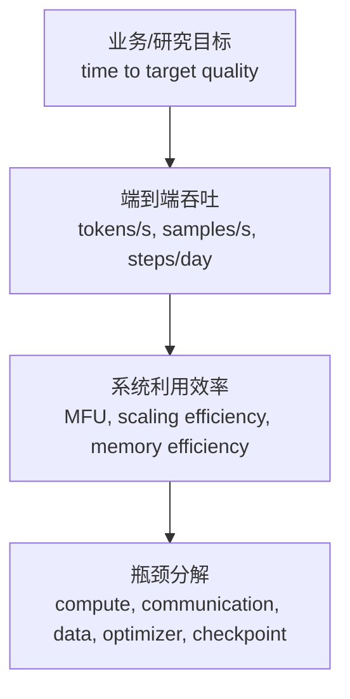

# 训练性能指标与扩展效率

训练系统优化不能只说“GPU 利用率高”或“吞吐不错”。这些说法太粗，无法指导工程决策。

训练性能指标要回答的是：

> 给定模型、数据、并行策略和硬件，我们到底用了多少有效算力，瓶颈在哪里，扩到更多 GPU 后效率为什么变化？

这篇重点讲训练系统常用指标：step time、tokens/s、samples/s、MFU、HFU、scaling efficiency、显存效率、通信效率、数据效率和成本效率。

## 先固定 Workload，再谈指标

训练性能指标最常见的问题，不是公式算错，而是比较对象不一致。

例如两个实验都说自己是“7B 模型训练”，但可能存在这些差异：

- sequence length 不同。
- global batch tokens 不同。
- padding 比例不同。
- activation checkpointing 粒度不同。
- precision 不同。
- 是否启用 FlashAttention 不同。
- TP/PP/DP/FSDP 组合不同。
- 数据 pipeline 是否真实读取不同。
- checkpoint、eval、logging 是否计入 wall-clock 不同。

这些差异都会改变 step time、tokens/s、MFU 和 scaling efficiency。

所以性能报告必须先定义 workload：

```yaml
workload_identity:
  model_arch: dense_decoder
  params: 7B
  non_embedding_params: 6.7B
  sequence_length: 4096
  global_batch_tokens: 4_194_304
  loss_tokens_policy: exclude_padding
  precision: bf16
  activation_checkpointing: selective
  attention_impl: flash_attention
  optimizer: adamw
  dataset_mode: synthetic_or_real
```

只有 workload 固定后，指标才有比较意义。

如果 workload 没固定，性能数字只能说明“某个脚本在某次配置下跑出来的速度”，不能说明系统真的更强。

## 指标的分层

训练指标可以按四层理解：



最上层关心“多久达到目标 loss 或目标 eval”。最底层关心“某个 kernel、某次通信、某段数据读取为什么慢”。

不要用单个指标评价训练系统。一个高质量训练报告至少要包含：

- 端到端吞吐。
- 质量进展速度。
- step time breakdown。
- MFU / FLOPs utilization。
- scaling efficiency。
- memory usage。
- communication time。
- data pipeline time。
- checkpoint overhead。
- 稳定性指标。

## 测量窗口：Warmup、Steady State 与 End-to-end

训练性能不能只取某一个 step。不同阶段的速度不同。

常见测量窗口有三种：

| 窗口 | 含义 | 适合回答 |
| --- | --- | --- |
| warmup | 编译、缓存、数据队列、通信连接尚未稳定的阶段 | 启动成本和首轮抖动 |
| steady state | 跳过 warmup 后的一段稳定训练窗口 | 纯训练内核和并行策略效率 |
| end-to-end | 从作业启动到达到目标或结束，包含 checkpoint/eval/故障 | 真实 wall-clock 成本 |

报告性能时要明确：

```text
warmup_steps = 20
measure_steps = 200
include_checkpoint = false
include_eval = false
include_dataloader = true
```

否则可能出现两种误导：

- 只取 steady state，忽略编译、checkpoint、eval 和故障，数字很好看。
- 只取端到端，混入一次偶发存储抖动，却不知道训练热路径本身是否变慢。

高质量报告通常同时给两类指标：

```text
steady_state_tokens_per_second
effective_tokens_per_second_end_to_end
```

前者用于定位系统瓶颈，后者用于评估真实训练成本。

## Step Time

Step time 是最基础指标：

```text
step_time = one training iteration wall-clock time
```

但要先说清楚“一个 step”是什么。

在 gradient accumulation 下：

```text
micro-step:
  one forward + backward for one micro-batch

optimizer step:
  after multiple micro-steps, sync gradients and update weights
```

如果 `gradient_accumulation_steps = 8`，那么 8 个 micro-step 才对应一次 optimizer step。

训练报告里建议明确：

```text
micro_batch_size_per_gpu
gradient_accumulation_steps
global_batch_size
sequence_length
tokens_per_optimizer_step
optimizer_step_time
micro_step_time
```

否则两个实验的 `step time` 可能完全不可比。

## Step Time Breakdown

单看 step time 不知道瓶颈。要拆成：

| 阶段 | 含义 |
| --- | --- |
| data time | 数据读取、解码、tokenization、packing、H2D copy |
| forward time | 前向计算 |
| loss time | loss、mask、cross entropy |
| backward time | 反向计算 |
| communication time | AllReduce、ReduceScatter、AllGather、AllToAll、P2P |
| optimizer time | gradient clipping、optimizer step、scheduler step、zero grad |
| checkpoint time | 保存 checkpoint 的阻塞时间 |
| idle / bubble | pipeline bubble、等待慢 rank、CPU 调度、同步空洞 |

一个简化的 breakdown：

```text
step_time
  = data
  + forward
  + backward
  + exposed_communication
  + optimizer
  + checkpoint_stall
  + idle
```

注意是 exposed communication，不是总通信量。通信如果被计算完全隐藏，就不会直接增加 step time；但它仍然会占网络资源，影响扩展。

## Samples/s 与 Tokens/s

训练吞吐常用：

```text
samples_per_second = global_batch_samples / step_time
tokens_per_second  = global_batch_tokens / step_time
```

对 LLM 训练，tokens/s 更有意义：

```text
global_batch_tokens
  = micro_batch_size_per_gpu
    * sequence_length
    * gradient_accumulation_steps
    * data_parallel_size
```

如果使用 packing、变长序列或 curriculum learning，还要区分：

- raw tokens。
- non-padding tokens。
- loss tokens。
- packed effective tokens。

建议训练报告里同时给：

```text
tokens/s including padding
tokens/s excluding padding
loss_tokens/s
```

否则短序列、高 padding 的 workload 会虚高。

## 吞吐口径：Instantaneous、Sustained、Effective 与 Goodput

`tokens/s` 也不是单一口径。

至少要区分四种吞吐：

| 口径 | 计算方式 | 含义 |
| --- | --- | --- |
| instantaneous throughput | 某几个稳定 step 的 tokens/s | 热路径峰值 |
| sustained throughput | 较长窗口内的平均 tokens/s | 稳态训练能力 |
| effective throughput | 总训练 token / 总 wall-clock | 扣除 checkpoint、eval、故障后的真实效率 |
| goodput | 有效推进质量目标的 token 或 step / wall-clock | 把坏 batch、回滚、无效重跑扣掉 |

例如：

```text
instantaneous_tokens/s = 500K
sustained_tokens/s     = 470K
effective_tokens/s     = 410K
goodput_tokens/s       = 385K
```

这四个数差距越大，说明训练系统的非热路径损耗越高。

Goodput 很适合长期训练。它会把下面这些损失扣掉：

- NaN 后回滚的 step。
- 数据异常导致丢弃的 batch。
- checkpoint 损坏后重跑的 token。
- eval 或调度错误导致的无效训练窗口。
- 配置错误启动后废弃的 run。

所以一个平台不应该只追求“最高 tokens/s”，还要追求 sustained throughput 和 goodput 接近 instantaneous throughput。

## Steps/day 与 Tokens/day

长期训练更常关心每天推进多少：

```text
steps_per_day  = 86400 / step_time
tokens_per_day = tokens_per_second * 86400
```

但要扣除非训练时间：

```text
effective_tokens_per_day
  = tokens_per_second
    * (86400 - checkpoint_stall - eval_time - downtime)
```

如果一个作业吞吐很高，但每天因为 checkpoint、故障和 eval 停掉很多小时，真实效率并不高。

## Time to Target Quality

最终有意义的训练速度是：

```text
time_to_target = wall-clock time to reach target validation loss / eval score
```

MLPerf Training 也采用“训练到指定质量目标的 wall-clock time”作为核心思路。

为什么这个指标重要？

因为 tokens/s 高不一定代表训练更快达到目标质量。

例如：

| 方案 | tokens/s | 达到目标 loss 所需 tokens | time to target |
| --- | ---: | ---: | ---: |
| A | 高 | 多 | 未必快 |
| B | 中 | 少 | 可能更快 |

Muon、batch size、learning rate schedule、data mixture、precision 等变化，都可能影响样本效率。系统优化不能把质量维度丢掉。

### Quality-normalized Throughput

如果两个系统配置会改变收敛速度，只比较 tokens/s 是不够的。

可以把吞吐修正成质量口径：

```text
quality_normalized_throughput
  = target_quality_progress / wall_clock_time
```

实际工程里可以用近似指标：

- validation loss 降低速度。
- 每天通过多少固定 eval benchmark。
- 达到同一 validation loss 所需 GPU hours。
- 达到同一 score 所需 tokens。
- 达到同一 score 的成本。

这类指标更难测，但能避免一种常见错误：

> 系统把 tokens/s 提高了 20%，但达到同一质量需要多 40% token。

这种情况下，单步系统变快了，训练目标反而变慢了。

## MFU：Model FLOPs Utilization

MFU 是大模型训练里常用指标，全称 Model FLOPs Utilization。

直觉：

> 模型理论上每秒需要完成多少有效模型 FLOPs，占硬件峰值 FLOPs 的比例。

简化写法：

```text
MFU = model_FLOPs_per_second / hardware_peak_FLOPs_per_second
```

其中：

```text
model_FLOPs_per_second
  = model_FLOPs_per_token * tokens_per_second
```

对于 dense decoder-only Transformer，常见粗略估计：

```text
training_FLOPs_per_token ~= 6 * num_parameters
```

这个 `6N` 来自：

- forward 大约 `2N` FLOPs。
- backward 对 activation 和 weight 求梯度，大约再 `4N` FLOPs。

这是粗略估算，不包括所有细节。长上下文 attention、MoE、embedding、recompute、FlashAttention、FP8、sequence parallel、activation checkpointing 都会改变实际 FLOPs。

MFU 的价值是：它把吞吐和模型计算规模联系起来。

### MFU 的分子和分母纪律

MFU 看起来是一个简单比例，实际很容易算乱。

分子要说明：

- FLOPs 公式。
- 参数量口径。
- 是否包含 embedding。
- 是否包含 attention quadratic term。
- 是否按 activated parameters 计算 MoE。
- tokens/s 使用 raw tokens、non-padding tokens 还是 loss tokens。

分母要说明：

- 使用哪种 dtype 的硬件峰值。
- 峰值来自厂商规格、实测 GEMM 还是集群标定。
- 是否按 GPU 数直接相乘。
- 是否考虑降频、功耗限制或 MIG/MPS 分区。
- 是否使用 sparsity 或 FP8 tensor core 峰值。

例如同一套训练，如果分母用 H100 BF16 峰值和 FP8 峰值，MFU 会完全不同。报告里必须写明：

```text
peak_flops_per_gpu = 989e12 BF16 dense tensor core FLOPs/s
cluster_peak = num_gpus * peak_flops_per_gpu
```

MFU 不是论文里的装饰数字，它是工程决策依据。分子分母不透明，MFU 就没有审计价值。

## MFU 和 GPU Utilization 的区别

GPU utilization 常见来自 `nvidia-smi`：

```text
GPU-Util: 95%
```

这只表示 GPU 上有 kernel 在跑，不表示 kernel 跑得高效。

一个 GPU 可能：

- GPU-Util 很高，但 kernel 很小，实际 FLOPs 低。
- GPU-Util 很高，但在 memory-bound kernel 上等 HBM。
- GPU-Util 很高，但大量时间在通信 kernel。
- GPU-Util 很高，但模型有效 FLOPs 低。

MFU 更接近“模型训练算力效率”。GPU utilization 更像“设备忙不忙”。

所以不要用 GPU utilization 替代 MFU。

## HFU：Hardware FLOPs Utilization

有时还会看到 HFU，Hardware FLOPs Utilization。

大致含义：

```text
HFU = actual_hardware_FLOPs_executed_per_second / hardware_peak_FLOPs_per_second
```

HFU 会把 activation recomputation、extra matmul、optimizer 计算等实际执行的 FLOPs 算进去。MFU 只关注模型理论有效 FLOPs。

这会导致：

- Activation checkpointing 可能提高 HFU，但不一定提高 MFU。
- 额外重计算会让 GPU 更忙，但有效训练吞吐未必更高。
- 某些优化让 HFU 降低但 MFU 提高，因为减少了无效 FLOPs。

训练系统更常用 MFU 判断有效效率，用 profiler 判断额外 FLOPs 是否值得。

## Dense 模型的 FLOPs 估算

粗略估算时：

```text
params = 模型非 embedding 参数量，或完整参数量，需注明
tokens_per_step = global_batch_tokens
step_time = 秒

model_flops_per_token = 6 * params
model_flops_per_second = model_flops_per_token * tokens_per_step / step_time
MFU = model_flops_per_second / (num_gpus * peak_flops_per_gpu)
```

示例：

```text
params = 7B
tokens_per_step = 4M
step_time = 10s
num_gpus = 64
peak_flops_per_gpu = 989 TFLOP/s BF16

model_flops_per_token = 6 * 7B = 42B FLOPs/token
tokens_per_second = 4M / 10 = 400K tokens/s
model_flops_per_second = 42B * 400K = 16.8 PFLOP/s
cluster_peak = 64 * 989T = 63.3 PFLOP/s
MFU = 16.8 / 63.3 = 26.5%
```

这里的数字只是演示。真实报告必须注明：

- peak FLOPs 用的是 BF16、FP16、FP8 还是 TF32。
- 是否启用 sparsity。
- 参数量是否包含 embedding。
- FLOPs 估算公式。
- sequence length。
- 是否使用 activation checkpointing。

### FLOPs 估算要和模型结构匹配

`6 * params` 是快速估算，不是通用真理。

它在 dense decoder-only Transformer 上常用于粗略比较，但下面这些情况会让误差变大：

- sequence length 很长，attention 的 `O(S^2)` 部分不可忽略。
- vocab 很大，LM head 和 cross entropy 占比明显。
- 使用 GQA/MQA，attention head 结构改变。
- 使用 MoE，total params 远大于 activated params。
- 使用 activation checkpointing，实际执行 FLOPs 增加。
- 使用 sequence/context parallel，通信和重组成本增加。
- 使用 fused loss 或 vocab parallel CE，中间 logits 物化方式变化。

所以报告可以同时给两种口径：

```text
simple_mfu:
  formula: 6 * non_embedding_params * tokens/s

model_specific_mfu:
  formula: layerwise FLOPs estimate including attention, MLP, LM head
```

前者便于横向粗比，后者更适合严肃 benchmark 和性能回归。

## MoE 模型的 MFU 更难

MoE 模型不是所有参数每个 token 都激活。

需要区分：

- total parameters。
- active parameters per token。
- experts per token。
- routed token 数量。
- dropped token。
- expert capacity padding。
- dispatch/combine 开销。

MoE 训练 FLOPs 更适合按 activated FLOPs 估算：

```text
model_FLOPs_per_token ~= dense_part_FLOPs + active_expert_FLOPs
```

如果用 total parameters 计算，MFU 会失真。因为大部分 expert 参数并不在每个 token 上计算。

MoE 报告应同时给：

- total params。
- activated params。
- top-k。
- expert parallel size。
- tokens per expert。
- dropped tokens。
- all-to-all time。
- load balance。

## Scaling Efficiency

Scaling efficiency 衡量加 GPU 后效率保留多少。

### Strong Scaling

Strong scaling 固定总 workload，增加 GPU 数。

例如固定：

```text
global_batch_tokens = 4M
model = same
sequence_length = same
```

从 64 GPU 扩到 128 GPU，理想情况下 step time 减半。

公式：

```text
strong_scaling_efficiency
  = speedup / gpu_multiplier
  = (time_baseline / time_new) / (gpus_new / gpus_baseline)
```

如果：

```text
64 GPU step time  = 20s
128 GPU step time = 12s
```

那么：

```text
speedup = 20 / 12 = 1.67
gpu_multiplier = 128 / 64 = 2
efficiency = 1.67 / 2 = 83.5%
```

Strong scaling 容易下降，因为每张 GPU 分到的计算变少，通信和同步占比上升。

### Weak Scaling

Weak scaling 固定每 GPU workload，增加 GPU 数，总 workload 增加。

例如：

```text
per_gpu_tokens = same
gpus double
global_batch_tokens double
```

理想情况下 step time 不变。

公式：

```text
weak_scaling_efficiency
  = time_baseline / time_new
```

如果 64 GPU 和 128 GPU 每 GPU batch 相同，但 step time 从 10s 变成 11s：

```text
weak_scaling_efficiency = 10 / 11 = 90.9%
```

Weak scaling 更容易保持高效率，但会改变 global batch。Global batch 改变会影响优化和收敛，不能只看系统吞吐。

## Scaling 实验矩阵

扩展效率最好不要只测一个点。

建议至少构造一个实验矩阵：

| 实验 | 固定项 | 变化项 | 回答的问题 |
| --- | --- | --- | --- |
| 单机 baseline | model、batch、seq、precision | GPU 数从 1 到单机满配 | 单机 NVLink/PCIe 内扩展效率 |
| 跨节点 strong scaling | global batch tokens 固定 | GPU 数增加 | 同一 workload 能否更快完成 |
| 跨节点 weak scaling | per-GPU tokens 固定 | GPU 数和 global batch 增加 | 集群能否线性扩大吞吐 |
| topology A/B | GPU 数和 workload 固定 | rank mapping / network path | 拓扑映射是否影响通信 |
| parallelism A/B | GPU 数和 workload 固定 | DP/TP/PP/FSDP 组合 | 哪种并行策略效率更高 |

每个实验点都要记录：

```text
num_nodes
num_gpus
dp/tp/pp/ep/cp
global_batch_tokens
per_gpu_tokens
step_time_p50/p90/p99
tokens/s
MFU
exposed_comm_time
memory_peak
```

只给“128 GPU 比 64 GPU 快”是不够的。要说明是 strong scaling 快，还是 weak scaling 吞吐高；是系统更高效，还是只是 global batch 变大。

## 并行策略对扩展效率的影响

不同并行策略会影响 scaling efficiency。

| 并行方式 | 主要收益 | 主要效率损失 |
| --- | --- | --- |
| Data Parallel | 增加 batch 吞吐 | gradient sync |
| ZeRO/FSDP | 降低重复显存 | all-gather/reduce-scatter |
| Tensor Parallel | 切层内大矩阵 | 层内 AllReduce/AllGather |
| Pipeline Parallel | 切层和权重 | pipeline bubble、P2P |
| Expert Parallel | 扩展 MoE expert | AllToAll、负载不均 |
| Context Parallel | 切长上下文 | attention 通信 |

扩展效率下降时，要先判断是计算变少、通信变多、还是等待变多。

## Memory Efficiency

显存指标不只是 peak memory。

要记录：

- allocated memory。
- reserved memory。
- peak allocated。
- peak reserved。
- fragmentation。
- activation memory。
- parameter memory。
- gradient memory。
- optimizer state memory。
- temporary buffer。

显存效率可以用：

```text
useful_model_state_bytes / peak_memory_bytes
```

但更实用的是看显存预算表：

| 项 | 占用 |
| --- | ---: |
| parameters | x GB |
| gradients | x GB |
| optimizer states | x GB |
| activations | x GB |
| KV / attention temp | x GB |
| communication buffers | x GB |
| fragmentation/reserved | x GB |

显存优化的目标不是让显存占用越低越好，而是在不 OOM 的前提下提高 batch、sequence length 或并发 pipeline。

### Memory Headroom

训练系统不应该把显存永远打到 99%。

需要保留 headroom：

```text
memory_headroom = total_memory - peak_reserved_memory
```

headroom 太小会带来：

- 输入长度轻微波动就 OOM。
- allocator fragmentation 后 OOM。
- checkpoint/eval 临时 buffer 触发 OOM。
- 新版本 kernel 临时 workspace 变大后 OOM。
- straggler rank 因显存不同步失败。

因此报告中可以同时写：

```text
peak_reserved_gb
peak_allocated_gb
memory_headroom_gb
oom_margin_percent
```

追求吞吐时，显存越满越可能高效；追求长期稳定时，必须为波动留余量。

## Communication Efficiency

通信指标要区分：

- 通信量。
- 通信带宽。
- 通信延迟。
- exposed communication time。
- overlap ratio。

常用指标：

```text
allreduce_time
reducescatter_time
allgather_time
alltoall_time
p2p_time
network_bandwidth_effective
communication_overlap_ratio
```

Overlap ratio 可以粗略写成：

```text
overlap_ratio
  = hidden_communication_time / total_communication_time
```

实际更容易从 profiler 里看：

```text
total comm kernels duration
exposed comm on critical path
```

通信优化的目标不是让通信总时长为 0，而是减少关键路径上的暴露通信。

### 有效通信带宽

通信时间要和通信量结合看。

可以记录：

```text
effective_bandwidth = bytes_transferred / communication_time
```

但这里也要小心。AllReduce、ReduceScatter、AllGather、AllToAll 的通信量模型不同，不能把所有 collective 用同一个公式粗暴比较。

更实用的做法是按 collective 类型报告：

```yaml
communication:
  allreduce:
    total_time_sec: 1.2
    exposed_time_sec: 0.4
    effective_bandwidth_gbps: 180
  reducescatter:
    total_time_sec: 0.8
    exposed_time_sec: 0.2
    effective_bandwidth_gbps: 210
  alltoall:
    total_time_sec: 1.5
    exposed_time_sec: 1.1
    p99_time_sec: 0.09
```

MoE 场景尤其要看 AllToAll 的尾部。平均 AllToAll 时间正常，不代表每个 expert 的 token dispatch 都均衡。

## Data Pipeline Efficiency

GPU 训练快不快，数据输入经常是隐藏瓶颈。

指标包括：

- dataloader time。
- CPU preprocessing time。
- tokenization throughput。
- packing efficiency。
- H2D copy time。
- dataloader queue depth。
- cache hit rate。
- storage bandwidth。
- effective tokens / raw tokens。

如果 profiler 显示 GPU 间歇性空闲，要先排除数据：

```text
GPU waits for batch
-> DataLoader too slow
-> tokenization/packing slow
-> storage slow
-> H2D copy not overlapped
```

数据效率也影响 tokens/s 的真实性。Padding 太多会让 raw tokens/s 好看，但 loss tokens/s 很低。

### Synthetic Data 与 Real Data

Benchmark 经常用 synthetic data 排除数据瓶颈，这有价值，但必须标明。

| 数据模式 | 优点 | 风险 |
| --- | --- | --- |
| synthetic data | 能专注测模型计算和通信 | 掩盖真实 I/O、tokenization、packing、坏样本问题 |
| cached token ids | 接近训练热路径，减少在线 tokenization | 掩盖存储和预处理成本 |
| real streaming data | 最接近真实训练 | 抖动大，定位模型瓶颈更难 |

建议报告同时保留两类结果：

```text
synthetic_data_tokens/s
real_data_tokens/s
data_pipeline_overhead = 1 - real/synthetic
```

如果 synthetic 很快、real 很慢，优化 kernel 没有意义，瓶颈在数据系统。

## Optimizer Efficiency

Optimizer step 在大模型训练里可能很重，尤其是 AdamW、Muon、ZeRO/FSDP、offload 场景。

记录：

- optimizer step time。
- gradient clipping time。
- scheduler time。
- zero_grad time。
- optimizer state memory。
- offload read/write time。
- fused optimizer 是否启用。
- foreach/fused/capturable 配置。

如果 optimizer time 随参数量线性增长，可能需要：

- fused optimizer。
- optimizer state sharding。
- CPU/NVMe offload。
- 低精度 optimizer state。
- 参数分组优化。

## Checkpoint Overhead

长期训练里，checkpoint 是有效吞吐的一部分。

指标：

- checkpoint size。
- save time。
- load time。
- save stall time。
- async staging time。
- checkpoint interval。
- failed checkpoint count。
- recovery time。

有效吞吐要扣除 checkpoint：

```text
effective_tokens_per_second
  = total_trained_tokens / total_wall_clock_time
```

这个指标会把 checkpoint、eval、故障恢复都算进去，比只看稳定训练窗口 tokens/s 更接近真实成本。

## Stability Metrics

训练性能不稳定，平均值就会骗人。

需要记录：

- step time p50 / p90 / p99。
- tokens/s p50 / p90 / p99。
- slow rank 次数。
- NCCL timeout / retry。
- dataloader stall 次数。
- GPU Xid。
- ECC error。
- loss spike。
- NaN/Inf。
- OOM。
- checkpoint failure。
- node restart。

MegaScale 这类大规模训练系统论文也强调，长期训练中稳定维持高效率和可观测性非常重要；很多问题只有在大规模和长时间运行中才出现。

## Straggler 与 Tail Metrics

多 GPU 训练里，慢的是整个 step 的最后一个 rank。

即使平均 rank 很快，只要少数 rank 经常慢，所有 rank 都要等。

需要记录：

- rank step time 分布。
- slowest rank id。
- 每个 collective 的 p50/p90/p99。
- dataloader queue depth per rank。
- GPU clock / power / temperature per rank。
- network retransmit / congestion per node。
- storage read latency per worker。

可以定义：

```text
rank_skew_ratio = max_rank_step_time / median_rank_step_time
```

例如：

```text
median_rank_step_time = 10.0s
max_rank_step_time = 12.5s
rank_skew_ratio = 1.25
```

这说明慢 rank 让所有人多等了 25%。

Straggler 常见来源：

- 某节点 GPU 降频。
- 某 rank 数据读取慢。
- 某个 expert 接收 token 过多。
- rank mapping 跨了慢链路。
- 某台机器 NIC 或 PCIe 异常。
- checkpoint 或日志写入集中在少数 rank。

大规模训练越往上扩，平均值越不够，尾部指标越重要。

## Cost Efficiency

工程上还要把性能换算成成本。

常见指标：

```text
tokens_per_gpu_hour
cost_per_billion_tokens
cost_to_target_loss
energy_per_billion_tokens
```

计算例子：

```text
tokens_per_gpu_hour
  = tokens_per_second * 3600 / num_gpus

cost_per_billion_tokens
  = num_gpus * gpu_hour_price / tokens_per_hour * 1e9
```

如果使用自建集群，还要考虑：

- GPU 折旧。
- 网络设备。
- 存储。
- 电力。
- 冷却。
- 运维。
- 失败重跑成本。

单纯 tokens/s 高，但故障多、checkpoint 慢、资源碎片严重，成本可能不低。

## 性能回归与准入门槛

训练系统优化最终要能防止回归。

每次改动后，可以设置性能准入门槛：

```yaml
performance_gate:
  workload: 7B_dense_4k_bf16_64gpu
  min_tokens_per_sec_ratio: 0.98
  max_step_time_regression: 0.02
  max_memory_regression_gb: 2
  max_p99_step_time_regression: 0.05
  max_exposed_comm_regression: 0.05
```

意思是：

- tokens/s 不能低于 baseline 的 98%。
- step time 不能变慢超过 2%。
- 显存峰值不能多 2GB 以上。
- p99 step time 不能明显恶化。
- 暴露通信时间不能明显增加。

性能门槛要和统计波动一起看。小规模 benchmark 抖动大，不应该因为 0.5% 差异就判定优化有效；但 5% 以上的稳定回归必须解释。

建议保存历史 baseline：

```text
baseline id
code commit
container image
driver/CUDA/NCCL version
hardware pool
run manifest
raw metrics
profiler trace link
```

没有 baseline 管理，性能优化会退化成“每次看起来都差不多”。

## 指标之间的常见冲突

训练系统优化经常遇到指标冲突。

### 提高 batch 让 tokens/s 增加

可能的问题：

- 收敛变差。
- 需要调 learning rate。
- 需要更长 warmup。
- generalization 变化。
- memory 增加。

### 开 activation checkpointing 降低显存

可能的问题：

- 重计算增加 step time。
- HFU 可能上升，MFU 未必上升。
- 可以换来更大 batch 或更长 context。

### 增大 TP 降低单卡显存

可能的问题：

- 层内通信增加。
- 小 GEMM 增多。
- MFU 下降。
- 跨节点 TP 代价很高。

### 增大 DP 提高吞吐

可能的问题：

- global batch 增大。
- gradient sync 开销增加。
- 收敛规律变化。

### 用更激进 fused kernel

可能的问题：

- 单步更快。
- 调试更难。
- 数值行为略变。
- profiler 可解释性下降。

指标不能孤立看，要结合训练目标判断。

## 一个训练性能报告模板

建议每次 benchmark 至少记录：

```yaml
workload:
  model: 7B dense decoder
  sequence_length: 4096
  global_batch_tokens: 4_194_304
  precision: bf16
  activation_checkpointing: selective

parallelism:
  dp: 8
  tp: 4
  pp: 2
  ep: 1
  fsdp_or_zero: zero-1

hardware:
  gpu: H100 SXM
  num_gpus: 64
  interconnect: NVLink + IB
  peak_flops_per_gpu: 989e12

throughput:
  step_time_sec: 10.0
  tokens_per_sec: 419_430
  tokens_per_gpu_sec: 6_553
  steps_per_day: 8_640

efficiency:
  mfu: 0.265
  strong_scaling_efficiency: 0.84
  weak_scaling_efficiency: null

breakdown:
  data_sec: 0.2
  forward_sec: 2.1
  backward_sec: 4.7
  exposed_comm_sec: 1.4
  optimizer_sec: 0.9
  checkpoint_stall_sec: 0.0
  idle_sec: 0.7

tail:
  rank_skew_ratio: 1.06
  step_time_p90_sec: 10.6
  step_time_p99_sec: 11.4
  slowest_rank: 37

memory:
  peak_allocated_gb: 74
  peak_reserved_gb: 78
  memory_headroom_gb: 2
  activation_gb: 24
  optimizer_state_gb: 18

stability:
  step_time_p50_sec: 10.0
  step_time_p99_sec: 11.4
  oom_count: 0
  nan_count: 0
  restart_count: 0
```

这样的报告比一句“MFU 多少”有用得多。

## 如何解释 MFU 低

MFU 低不一定说明代码差。可能原因包括：

- 模型太小，GEMM 不够大。
- batch 太小。
- sequence length 太短。
- TP 过大导致小 GEMM。
- PP bubble 太大。
- DP 通信暴露。
- FSDP all-gather 暴露。
- MoE AllToAll 暴露。
- data pipeline 慢。
- activation checkpointing 重计算多。
- optimizer step 重。
- checkpoint 阻塞。
- GPU peak FLOPs 选取不合理。
- FLOPs 估算公式不适合当前模型。

排查顺序建议：

1. 看 step time breakdown。
2. 看 profiler timeline。
3. 看 GEMM shape 和 Tensor Core 使用。
4. 看通信是否暴露。
5. 看 data 和 optimizer 是否占比异常。
6. 看 MFU 公式是否正确。

## 如何解释扩展效率下降

扩展效率下降常见原因：

- 每 GPU batch 太小。
- 通信量相对计算量增加。
- 跨节点通信比例增加。
- pipeline stage 不均衡。
- straggler rank 增多。
- 网络拓扑映射不好。
- checkpoint 同步点更慢。
- 数据读取无法随 GPU 数扩展。
- 全局 batch 变大导致训练配置改变。

需要区分：

```text
system scaling problem:
  same workload, step time 没按预期下降

optimization scaling problem:
  global batch 改变后，达到目标 loss 需要更多 token
```

前者是系统问题，后者是训练算法/超参问题。两者都重要，但不能混在一起。

## 常见误区

### 误区一：GPU utilization 高就是效率高

不对。GPU 忙不等于有效模型 FLOPs 高。要看 MFU、tokens/s 和 step breakdown。

### 误区二：tokens/s 越高越好

不一定。要看 time to target quality。如果更高 tokens/s 伴随更差收敛，最终可能更慢。

### 误区三：MFU 可以跨任意模型直接比较

不稳妥。不同模型结构、sequence length、MoE active FLOPs、activation recompute 和 FLOPs 估算方式都会影响 MFU。

### 误区四：strong scaling 低就说明系统不好

不一定。Strong scaling 本来就会因为单 GPU 计算变少而更难。要结合目标 batch、通信拓扑和成本看。

### 误区五：benchmark 只要平均值

长期训练必须看 p99、straggler、故障和恢复。平均 tokens/s 掩盖不了尾部问题。

## 设计检查清单

做训练性能评估时，可以逐项确认：

- step 的定义是 micro-step 还是 optimizer step？
- global batch tokens 是否明确？
- tokens/s 是否排除了 padding？
- 是否记录 time to target quality？
- MFU 公式是否写明？
- peak FLOPs 选取是否匹配 dtype？
- dense / MoE FLOPs 估算是否区分？
- 是否有 step time breakdown？
- 是否记录通信 exposed time？
- 是否记录 data pipeline time？
- 是否记录 optimizer time？
- 是否记录 checkpoint overhead？
- 是否记录 p50/p90/p99？
- 是否记录 rank skew 和 slowest rank？
- 是否记录 scaling efficiency？
- 是否区分 strong scaling 和 weak scaling？
- 是否说明 synthetic data 还是 real data？
- 是否有 baseline 和性能回归门槛？
- 是否记录故障、重启和 OOM？

## 小结

训练性能指标的核心不是追求单个漂亮数字，而是建立可解释的效率模型。

关键结论：

- Step time 是入口，但必须拆解。
- LLM 训练优先看 tokens/s、tokens/day 和 time to target quality。
- 吞吐要区分 instantaneous、sustained、effective 和 goodput。
- MFU 比 GPU utilization 更接近有效模型算力效率。
- MFU 必须写清楚 FLOPs 公式、token 口径和硬件峰值分母。
- Scaling efficiency 要区分 strong scaling 和 weak scaling。
- 通信、数据、optimizer、checkpoint 和稳定性都会影响真实吞吐。
- 大规模训练必须看尾延迟、straggler 和故障恢复。
- 性能优化要有 baseline 和回归门槛，否则数字很难长期可信。

一个成熟训练系统的性能报告，应该能回答：为什么快，为什么慢，扩展到更多 GPU 会发生什么，以及达到目标质量要花多少真实时间和成本。

## 参考资料

- [PaLM: Scaling Language Modeling with Pathways](https://arxiv.org/abs/2204.02311)
- [Efficient Large-Scale Language Model Training on GPU Clusters Using Megatron-LM](https://arxiv.org/abs/2104.04473)
- [MegaScale: Scaling Large Language Model Training to More Than 10,000 GPUs](https://arxiv.org/abs/2402.15627)
- [MLCommons: MLPerf Training](https://mlcommons.org/benchmarks/training/)
