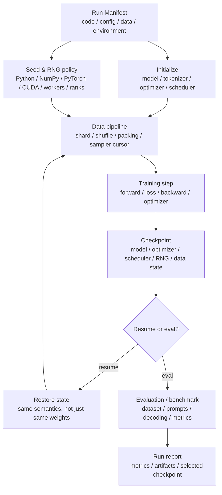
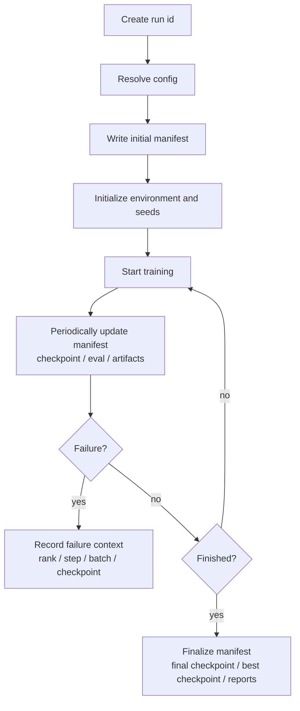

# 训练可复现性、随机性与 Run Manifest

训练可复现性经常被简化成一句话：

```text
set random seed
```

但真实训练系统里，这远远不够。

一次训练结果会受到很多东西影响：

- 代码版本。
- 模型配置。
- tokenizer。
- 数据版本。
- 数据顺序。
- batch 组成。
- dropout 随机性。
- MoE router 随机性。
- mixed precision 配置。
- fused kernel。
- collective 通信算法。
- rank mapping。
- checkpoint resume 位置。
- eval 数据和 prompt 模板。
- benchmark workload。

如果这些信息没有记录清楚，同一个实验很难重跑，两个实验很难比较，训练中断后也很难判断恢复是否正确。

本篇关注训练系统里的可复现性：随机性来自哪里，为什么同一个 seed 仍然可能跑出不同结果，以及如何用 Run Manifest 把一次训练运行完整记录下来。

## 先给结论

训练可复现性不是一个开关，而是一套工程治理。

它至少分成四层：

| 层级 | 目标 | 典型要求 |
| --- | --- | --- |
| bitwise reproducibility | 每个数值尽量逐 bit 一样 | 固定 seed、固定算法、固定硬件/软件版本、禁用非确定性 kernel。 |
| step-level reproducibility | 关键曲线在每个 step 上基本对齐 | 固定数据顺序、RNG state、resume state 和分布式拓扑。 |
| statistical reproducibility | 最终趋势和指标在合理波动内一致 | 多 seed 实验、均值/方差、固定 eval 流程。 |
| auditable reproducibility | 即使不能完全重跑，也能解释一次运行 | 完整 Run Manifest、artifact、checkpoint、日志和指标留档。 |

大模型训练里，很多场景并不追求绝对逐 bit 一致。因为逐 bit 一致可能需要牺牲性能，也可能被硬件、库版本和通信算法限制。

但训练系统必须做到：

1. **知道一次训练到底用了什么。**
2. **知道两个实验是否真的可比。**
3. **知道中断恢复后训练状态是否连续。**
4. **知道评估和 benchmark 结果能不能追溯。**

最小可用方案是：

```text
fixed code + fixed config + fixed data manifest + fixed tokenizer
+ fixed seed/RNG policy + recorded checkpoint state
+ recorded distributed topology + recorded eval/benchmark setup
= auditable run
```

## 为什么只设 Seed 不够

seed 只是随机数生成器的起点。

训练里常见的随机来源包括：

| 随机来源 | 影响 |
| --- | --- |
| dataset shuffle | 改变样本进入训练的顺序。 |
| distributed sampler | 改变不同 rank 看到的数据切片。 |
| DataLoader worker | 多进程读取时每个 worker 有自己的随机状态。 |
| sequence packing | 改变多个样本如何拼成固定长度序列。 |
| dropout | forward 中随机丢弃 activation。 |
| activation checkpointing | backward 重算 forward 时需要正确恢复 RNG。 |
| MoE routing | router 抖动、tie-breaking 或 token dropping 可能带来随机性。 |
| data augmentation | 图像、音频、多模态数据增强会改变输入。 |
| generation eval | sampling、temperature、top-p 会影响生成结果。 |
| kernel / collective | 某些 GPU kernel 或通信规约顺序可能不是确定的。 |

即使所有地方都用同一个初始 seed，也可能因为下面这些变化导致结果不同：

- world size 变了，数据切分和梯度规约顺序变了。
- DataLoader worker 数量变了，样本预取顺序变了。
- checkpoint resume 时没有恢复 RNG state。
- activation checkpointing 重算时没有 preserve RNG。
- 开启了不同 fused kernel。
- PyTorch、CUDA、cuDNN、NCCL 版本变了。
- TF32、FP8 或 mixed precision 策略变了。
- tokenizer 或 chat template 变了。

因此，训练可复现性要记录的是一组状态，而不是一个数字。

## 在训练生命周期中的位置

训练可复现性贯穿整个生命周期：



如果只记录训练脚本和超参数，缺失了数据顺序、RNG、checkpoint state、eval 配置，就很难解释一次运行。

## 三种常见目标

不同任务对可复现性的要求不同。

### 1. Debug Reproduction

目标是复现一个 bug。

例如：

- 某个 step 出现 NaN。
- resume 后 loss 突然跳变。
- 某个 rank hang 住。
- 某个 batch 触发 OOM。

这时需要尽量接近 step-level reproducibility。

至少要保存：

- 代码 commit。
- 完整 config。
- 数据 shard 和 sampler position。
- 触发异常的 batch 标识。
- 所有 rank 的 RNG state。
- rank mapping。
- mixed precision / loss scale / FP8 amax state。
- checkpoint 路径。
- 环境版本。

### 2. Experiment Comparison

目标是比较两个训练配置。

例如：

- batch size A 和 B 哪个更快。
- FSDP 和 ZeRO 哪个扩展效率更好。
- FP8 是否损伤 eval 指标。
- Muon 和 AdamW 在某个训练预算下是否可比。

这时最重要的是固定变量。

至少要保证：

- 数据版本一致。
- tokenizer 一致。
- global batch、sequence length、训练 token budget 可比。
- eval 数据和 prompt 一致。
- benchmark workload 一致。
- 代码差异可解释。
- 运行环境有记录。

如果目标是模型质量比较，还要多 seed 或多次运行，避免把随机波动误认为优化收益。

### 3. Production Training Audit

目标是让长期训练可以被审计。

例如：

- 哪个 checkpoint 进入了后训练。
- 这个 checkpoint 来自哪次训练。
- 它用过哪些数据版本。
- 中途是否 resume 过。
- eval 分数来自哪个评估脚本。
- benchmark 是否可重跑。

这时不一定要求逐 bit 复现，但必须要求链路可追溯。

Run Manifest 就是为这个目标服务的。

## 可复现性边界

需要先承认一个现实：深度学习训练不总是能跨环境逐 bit 复现。

PyTorch 官方文档也提醒，完全可复现并不保证跨 PyTorch 版本、不同 commit、不同平台，甚至 CPU/GPU 之间都一致；同时，确定性算法可能比非确定性算法慢。

这意味着工程上要明确目标：

| 目标 | 是否现实 | 代价 |
| --- | --- | --- |
| 同一机器、同一环境、同一配置逐 bit 对齐 | 有机会做到 | 可能要禁用高性能非确定性路径。 |
| 同一集群、同一镜像、同一拓扑 loss 曲线对齐 | 比较现实 | 需要保存完整状态和数据 cursor。 |
| 不同 GPU 代际、不同库版本逐 bit 对齐 | 通常不现实 | 成本高，也不一定值得。 |
| 指标趋势可解释、实验可比较 | 必须做到 | 依赖 manifest、数据治理和评估治理。 |

训练系统不要把“无法逐 bit 复现”当成不记录的理由。

越是不能逐 bit 复现，越需要把影响因素记录清楚。

## 复现目标协议

每次训练开始前，最好先声明这次 run 追求哪种复现目标。不同目标需要的成本不同。

| 目标 | 适用场景 | 必须记录 |
| --- | --- | --- |
| debug-exact | 排查 NaN、loss spike、resume 跳变 | RNG state、data cursor、rank mapping、deterministic mode、异常 batch。 |
| experiment-comparable | 比较两个训练配置 | 数据版本、tokenizer、global batch tokens、eval/benchmark manifest。 |
| audit-ready | 长期训练、重要 baseline、上线候选 | 完整 Run Manifest、checkpoint lineage、eval report、环境和 artifact。 |
| statistical | 多 seed 质量比较 | seed 列表、均值/方差、置信区间、固定 eval 流程。 |

一个 run 可以这样记录：

```yaml
reproducibility:
  target: "audit-ready"
  expected_level: "L3"
  bitwise_required: false
  comparable_to:
    - run_id: "baseline-7b-bf16-001"
      comparison_goal: "optimizer_ablation"
```

这个字段的意义是提前约束期望。大规模预训练不一定追求逐 bit 一致，但至少应该 audit-ready；bug 复现任务则应临时提高到 debug-exact。

## 实验比较协议

很多“优化有效”的结论其实来自不可比实验。比较两个 run 前，要明确哪些变量必须固定，哪些变量允许变化。

例如比较 AdamW 和 Muon：

```yaml
comparison:
  changed:
    - optimizer
  fixed:
    - model_architecture
    - tokenizer
    - data_manifest
    - train_token_budget
    - global_batch_tokens
    - precision_policy
    - eval_manifest
    - hardware_pool
```

如果比较 FP8 和 BF16，precision 是允许变化项，但其他项要尽量固定。如果比较 FSDP 和 ZeRO，parallelism/runtime 是允许变化项，但数据、模型、token budget、eval 应保持一致。

推荐给每个对比实验生成 comparison manifest：

```yaml
comparison_manifest:
  baseline_run: ""
  candidate_run: ""
  hypothesis: "Muon reaches target validation loss with lower wall-clock cost"
  controlled_variables: []
  changed_variables: []
  primary_metrics:
    - "wall_clock_to_target_loss"
    - "tokens_to_target_loss"
  secondary_metrics:
    - "peak_memory"
    - "optimizer_step_time"
```

这能避免事后只看一张 loss 曲线就下结论。

## Run Manifest 是什么

Run Manifest 是一次训练运行的身份证。

它不是训练日志，也不是 TensorBoard 曲线，而是一份结构化记录，说明：

```text
这次训练是谁
从哪里来
用了什么代码
用了什么数据
用了什么环境
用了什么并行配置
随机性如何初始化和保存
产生了哪些 checkpoint
做过哪些 eval / benchmark
结果在哪里
```

Run Manifest 最好是机器可读的，例如 YAML、JSON 或数据库记录。

Markdown 文档可以解释原则，真正落地时应有结构化字段。

## Run Manifest 的核心字段

一个训练运行至少应该记录下面这些字段：

| 类别 | 字段 |
| --- | --- |
| run identity | run id、experiment name、owner、start/end time、description。 |
| code | git repo、commit、branch、dirty diff、训练入口脚本。 |
| config | 原始 config、展开后的 resolved config、config hash。 |
| model | architecture、hidden size、layers、heads、MoE 配置、RoPE/context 配置。 |
| tokenizer | tokenizer 名称、版本、hash、special tokens、chat template。 |
| data | dataset manifest、shard list、采样比例、filter 规则、packing 策略。 |
| optimization | optimizer、scheduler、learning rate、global batch、grad accumulation。 |
| precision | FP32/TF32/BF16/FP16/FP8、loss scaling、amax/scale 策略。 |
| parallelism | DP/FSDP/ZeRO/TP/PP/EP/SP/CP size、rank mapping、process group。 |
| randomness | global seed、rank seed policy、worker seed policy、RNG state checkpoint。 |
| environment | container image、Python、PyTorch、CUDA、cuDNN、NCCL、driver、硬件。 |
| checkpoint | checkpoint cadence、format、latest/best 路径、resume lineage。 |
| evaluation | eval dataset、prompt、decoding、metric、judge model、report path。 |
| benchmark | workload、seq length、batch、warmup、metrics、profiler trace。 |
| artifacts | logs、metrics、trace、checkpoint、config、manifest 路径。 |

关键原则是：只记录“人看得懂的摘要”不够，必须保留可以重跑的结构化配置。

## Manifest 生命周期

Run Manifest 不应该只在训练结束后生成。它应当伴随 run 生命周期不断更新。

| 阶段 | Manifest 内容 |
| --- | --- |
| create | run id、owner、目标、初始 config。 |
| resolved | 展开后的 config、代码 commit、数据 manifest、环境。 |
| launched | rank mapping、资源分配、seed policy、启动时间。 |
| running | checkpoint 事件、eval 事件、resume 事件、failure 事件。 |
| finalized | final checkpoint、best checkpoint、完整 eval report、结束状态。 |

可以把 manifest 看成两部分：

```text
run_manifest.yaml       # 当前状态快照
run_events.jsonl        # 追加式事件日志
```

`run_manifest.yaml` 方便人和 AI 快速查看当前 run 状态；`run_events.jsonl` 方便追踪历史变化。

事件示例：

```json
{"type":"checkpoint_saved","step":120000,"train_tokens":245760000000,"path":"s3://...","status":"complete"}
{"type":"eval_completed","checkpoint":"step-120000","suite":"validation-lite","report":"s3://..."}
{"type":"resume","from_checkpoint":"step-120000","restored_rng":true,"restored_data_state":true}
```

这比在日志里搜索字符串可靠得多。

## Manifest Schema Version

Manifest 自身也要有版本。

```yaml
manifest:
  schema_version: "training-run-manifest/v1"
  created_by: "train-platform"
  created_by_version: "2026.06.12"
```

原因很简单：训练平台会演进。今天没有 FP8 字段，明天可能有；今天没有 Muon 参数分组，后天可能需要。

有 schema version 后，系统可以：

- 知道旧 run 缺少哪些字段。
- 做 manifest migration。
- 在 dashboard 中区分字段语义。
- 避免把不同版本 manifest 混在一起比较。

重要 baseline 的 manifest schema 不应随意修改；如果修改，应保留迁移规则。

## Run Manifest 示例

下面是一个简化示例。

真实系统可以更细，但不应该比这个少太多。

```yaml
run:
  id: pretrain-llm-2026-06-12-001
  name: llm-7b-baseline-bf16
  created_at: "2026-06-12T09:00:00+08:00"
  description: "7B baseline pretraining run"

code:
  repo: git@github.com:example/train-stack.git
  commit: 8f3a9c2
  branch: main
  dirty: false
  entrypoint: train.py

config:
  file: configs/llm_7b.yaml
  resolved_file: artifacts/config.resolved.yaml
  hash: sha256:...

model:
  architecture: decoder-only-transformer
  hidden_size: 4096
  num_layers: 32
  num_attention_heads: 32
  context_length: 8192
  rope_scaling: none

tokenizer:
  name: example-tokenizer
  version: v3
  hash: sha256:...
  special_tokens:
    bos: "<s>"
    eos: "</s>"
  chat_template: null

data:
  manifest: data/manifests/pretrain_mix_v12.yaml
  tokenizer_version: v3
  mixture:
    web: 0.70
    code: 0.20
    math: 0.10
  shuffle_seed: 1234
  packing: sequence_packing_v2

optimization:
  optimizer: AdamW
  lr_schedule: cosine
  global_batch_tokens: 4194304
  micro_batch_size: 1
  gradient_accumulation_steps: 8
  max_train_tokens: 1000000000000

precision:
  compute_dtype: bf16
  enable_tf32: true
  fp8: false
  loss_scaling: none

parallelism:
  world_size: 512
  nodes: 64
  gpus_per_node: 8
  data_parallel: 64
  tensor_parallel: 4
  pipeline_parallel: 2
  expert_parallel: 1
  sequence_parallel: true
  rank_mapping: topology-aware-v1

randomness:
  base_seed: 1234
  rank_seed_policy: "base_seed + global_rank"
  dataloader_worker_seed_policy: "base_seed + global_rank * 1000 + worker_id"
  save_rng_state_in_checkpoint: true
  deterministic_algorithms: false

environment:
  container: registry.example.com/train:2026-06-01
  python: "3.11"
  pytorch: "2.x"
  cuda: "12.x"
  nccl: "2.x"
  gpu: "NVIDIA H100"
  driver: "..."

checkpoint:
  format: sharded
  cadence_train_tokens: 10000000000
  latest: s3://bucket/runs/pretrain-llm-001/checkpoints/latest
  resume_from: null

evaluation:
  validation_manifest: eval/validation_v4.yaml
  eval_cadence_train_tokens: 10000000000
  generation_decoding:
    temperature: 0.0
    top_p: 1.0
  reports: s3://bucket/runs/pretrain-llm-001/eval/

artifacts:
  logs: s3://bucket/runs/pretrain-llm-001/logs/
  metrics: s3://bucket/runs/pretrain-llm-001/metrics.jsonl
  traces: s3://bucket/runs/pretrain-llm-001/traces/
```

这个例子里，最重要的不是字段名字，而是思想：

```text
一次 run 的所有关键输入和关键产物都要有名字、有版本、有路径、有 hash。
```

## Code 与 Config

代码和配置是最基本的可复现来源。

至少要记录：

- git commit。
- branch。
- 是否有 dirty diff。
- 训练入口脚本。
- config 文件路径。
- resolved config。
- config hash。
- 依赖版本。

为什么需要 resolved config？

因为训练配置经常不是一个静态 YAML。

真实配置可能来自：

- 默认参数。
- 命令行参数。
- 环境变量。
- launcher 注入。
- 集群调度参数。
- 自动调参系统。
- 框架内部默认值。

如果只保存原始 config，后续可能不知道某个参数最终到底是多少。

因此建议在训练启动时输出一份完整展开后的配置：

```text
config.yaml          # 人写的配置
config.resolved.yaml # 程序真正使用的配置
config.hash          # 用于比较两个 run 是否配置一致
```

## Tokenizer 与模型配置

很多训练差异不是来自模型权重，而是来自 tokenizer 和模型配置。

Tokenizer 要记录：

- tokenizer 文件或仓库版本。
- vocab hash。
- merge 文件 hash，如果使用 BPE。
- special tokens。
- padding / truncation 策略。
- chat template。
- normalization 规则。

模型配置要记录：

- architecture。
- hidden size。
- num layers。
- num heads。
- GQA/MQA 配置。
- MoE expert 数量。
- top-k routing。
- context length。
- RoPE base / scaling。
- vocab size。
- tie embeddings 设置。

两个实验即使代码和数据相同，只要 tokenizer 变了，token 数、sequence packing、loss mask、validation loss 都可能不可比。

chat template 也非常关键。

同一条指令数据，用不同模板包起来，模型看到的 token 序列就不同。

## 数据版本与数据顺序

数据可复现性包括两件事：

1. 数据内容是否一样。
2. 数据进入训练的顺序是否一样。

数据内容要记录：

- dataset name。
- dataset version。
- shard list。
- shard hash。
- filtering rules。
- dedup rules。
- language/domain 标签。
- train/validation split。
- mixture ratio。

数据顺序要记录：

- shuffle seed。
- sampler epoch。
- sampler position。
- consumed samples。
- consumed tokens。
- DataLoader worker 数量。
- drop_last 策略。
- sequence packing buffer 状态。
- streaming dataset cursor。

很多训练系统会记录 `global_step`，但不记录 `consumed_tokens`。

这在大模型训练里不够。

因为改变下面任意一项，都可能让同样的 `global_step` 对应不同 token 数：

- sequence length。
- global batch tokens。
- gradient accumulation。
- padding 比例。
- loss mask。
- multi-modal sample 组成。

建议同时记录：

```text
global_step
optimizer_step
micro_step
consumed_samples
consumed_input_tokens
consumed_loss_tokens
```

其中 `consumed_loss_tokens` 对语言模型尤其重要，因为不是所有 input token 都参与 loss。

## Streaming Dataset 与 Data Cursor

很多大模型训练使用 streaming dataset。数据并不是一个固定本地文件列表，而是从对象存储、远端数据服务或 shard 流中读取。

这时要记录的不只是 `dataset_version`，还要记录 cursor。

常见字段：

```yaml
data_state:
  dataset_manifest: "pretrain_mix_v12.yaml"
  shard_epoch: 3
  current_shard: "s3://bucket/shard-00123.jsonl.zst"
  offset_in_shard: 91827364
  shuffle_buffer_seed: 1234
  shuffle_buffer_position: 5521
  consumed_samples: 987654321
  consumed_input_tokens: 123456789012
  consumed_loss_tokens: 120000000000
```

如果使用 sequence packing，还要记录 packing buffer 状态：

```yaml
packing_state:
  algorithm: "sequence_packing_v2"
  buffer_size: 4096
  pending_sample_ids: []
  pending_token_count: 0
```

否则 resume 后即使从同一个 shard 开始，也可能因为 packing buffer 不同，batch 组成发生变化。

## 数据 Manifest 的 Hash 语义

数据 hash 也要说明 hash 的对象是什么。

| Hash | 含义 |
| --- | --- |
| raw shard hash | 原始数据文件内容。 |
| normalized text hash | 清洗和规范化后的文本。 |
| tokenized shard hash | tokenization 后的 token 序列。 |
| packed sample hash | packing 后的训练样本序列。 |
| manifest hash | shard 列表、比例和规则的整体配置。 |

如果只写 `data_hash`，后面可能不知道它指的是 raw text 还是 tokenized data。

对训练可复现最有用的是 tokenized/packed 层级的 hash，因为模型真正看到的是 token 序列和 loss mask。

## DataLoader Worker Seed

训练数据读取经常用多 worker。

这会带来一个容易忽略的问题：每个 worker 都有自己的随机状态。

如果 worker seed 没有固定，可能出现：

- augmentation 不同。
- packing 不同。
- shuffle buffer 抽样不同。
- 多模态 crop / resize / mask 不同。

常见做法是定义明确的 worker seed policy：

```text
worker_seed = base_seed + global_rank * 1000 + worker_id
```

这只是示意，真实系统要避免不同 rank、不同 worker、不同 epoch 的 seed 冲突。

更稳的做法是把 seed policy 写进 Run Manifest。

例如：

```yaml
randomness:
  base_seed: 1234
  rank_seed_policy: "base_seed + global_rank"
  dataloader_worker_seed_policy: "base_seed + global_rank * 1000 + worker_id"
  epoch_seed_policy: "base_seed + epoch"
```

不要只在日志里打印：

```text
seed = 1234
```

这不足以说明每个 rank 和 worker 实际用了什么随机流。

## Rank Seed Policy

分布式训练里，每个 rank 是否使用相同 seed，要看随机行为的含义。

有些随机行为希望各 rank 一致。

例如：

- 某些 tensor parallel 层里需要一致的 dropout mask。
- 某些模型并行 RNG tracker 需要保证切分前后语义一致。

有些随机行为希望各 rank 不同。

例如：

- data parallel 各 rank 读取不同样本。
- data augmentation 不应每张卡完全一样。
- MoE token routing 不能因 seed 设计导致 rank 间异常同步。

因此不要简单说：

```text
all ranks use the same seed
```

也不要简单说：

```text
seed = base_seed + rank
```

更好的方式是按随机流分类：

| 随机流 | 是否 rank-specific | 说明 |
| --- | --- | --- |
| data shuffle | 通常和 rank/world size 相关 | 要保证不同 rank 覆盖不同数据。 |
| dropout | 依赖并行策略 | DP、TP、activation checkpointing 下语义不同。 |
| augmentation | 通常 rank-specific | 避免各 rank 产生完全相同增强。 |
| model initialization | 依赖并行策略 | TP/FSDP 初始化要保证切分后等价。 |
| generation eval | 通常固定或关闭采样 | temperature=0 时更可比。 |

大型训练框架通常会维护不同 RNG tracker。

Run Manifest 至少要记录 seed policy，而不是只记录一个全局 seed。

## RNG State 与 Checkpoint

如果训练从头开始，seed 决定初始随机状态。

如果训练从 checkpoint 恢复，seed 已经不够了。

恢复时需要的是中断那一刻的 RNG state。

常见 RNG state 包括：

- Python `random`。
- NumPy RNG。
- PyTorch CPU RNG。
- PyTorch CUDA RNG。
- 每个 GPU / rank 的 CUDA RNG。
- DataLoader / sampler state。
- 模型并行 RNG tracker。

如果 checkpoint 只保存 model weights 和 optimizer state，没有保存 RNG state，resume 后可能出现：

- dropout mask 不连续。
- data augmentation 不连续。
- sequence packing 不连续。
- MoE routing 行为变化。
- loss 曲线在 resume 点轻微或明显跳变。

这不一定会毁掉训练，但会让“恢复是否正确”难以判断。

因此 checkpoint 至少要标明：

```yaml
checkpoint:
  includes_rng_state: true
  includes_data_state: true
  includes_scheduler_state: true
  includes_precision_state: true
```

如果没有保存，也要如实记录。

## RNG State Inventory

建议把随机状态列成 inventory，而不是只写 `rng_saved: true`。

```yaml
rng_state:
  python_random: true
  numpy_global: true
  numpy_generators: []
  torch_cpu: true
  torch_cuda_all_devices: true
  model_parallel_rng_tracker: true
  dataloader_workers: true
  sampler: true
  augmentation: false
```

如果某些状态没有保存，要写明原因：

```yaml
rng_state_warnings:
  - "augmentation RNG is owned by external data service and not checkpointed"
```

这样 resume 后如果出现轻微差异，至少知道差异可能来自哪里。

## 随机流命名

大型训练系统最好不要只有一个全局随机流。可以给不同用途命名：

| 随机流 | 用途 |
| --- | --- |
| `init_rng` | 参数初始化。 |
| `data_rng` | shuffle、sampling、packing。 |
| `model_rng` | dropout、stochastic depth。 |
| `mp_rng` | tensor/model parallel 相关随机性。 |
| `eval_rng` | generation eval sampling。 |
| `aug_rng` | 多模态增强。 |

Run Manifest 可以记录：

```yaml
random_streams:
  init_rng: "base_seed"
  data_rng: "base_seed + 100000"
  model_rng: "base_seed + rank"
  eval_rng: "fixed_eval_seed"
```

这样比“所有地方 seed=1234”更清晰，也更容易发现 seed 冲突。

## Deterministic Algorithms

许多深度学习框架提供确定性算法开关。

在 PyTorch 中，可以使用 `torch.use_deterministic_algorithms(True)` 要求某些操作使用确定性算法。如果某个操作没有确定性实现，可能会报错或回退到受限行为。

但确定性算法不是免费午餐。

常见代价包括：

- kernel 选择变少。
- 不能使用某些最快实现。
- benchmark 数字下降。
- 某些操作直接不可用。
- 跨硬件和跨版本仍然不能保证完全一致。

因此建议分场景使用：

| 场景 | 建议 |
| --- | --- |
| 调试 NaN / loss spike | 可以开启确定性模式缩小变量。 |
| 小规模 ablation | 可以追求更强确定性。 |
| 大规模预训练 | 通常优先 auditable reproducibility 和统计可复现。 |
| 性能 benchmark | 必须记录是否开启确定性模式。 |

如果开启 deterministic mode，要写进 manifest：

```yaml
randomness:
  deterministic_algorithms: true
  cudnn_benchmark: false
  cublas_workspace_config: ":4096:8"
```

具体开关应以所用框架和版本文档为准。

## Determinism Budget

确定性会消耗性能预算。可以把它当成一个可配置的 budget：

| 模式 | 用途 | 代价 |
| --- | --- | --- |
| performance | 默认大规模训练 | 速度优先，记录完整上下文。 |
| audit | 重要 baseline | 尽量固定环境、数据和 eval，允许非 bitwise。 |
| debug | 排查问题 | 尽量启用确定性，减少变量。 |
| strict | 小规模精确复现 | 禁用非确定性路径，接受性能下降。 |

示例：

```yaml
determinism:
  mode: "audit"
  deterministic_algorithms: false
  cudnn_benchmark: false
  fixed_rank_mapping: true
  fixed_eval_seeds: true
```

这比单个布尔值更贴近工程现实。

## Floating Point 非结合性

浮点加法不是严格结合的。

也就是说：

```text
(a + b) + c
```

和：

```text
a + (b + c)
```

在浮点数里可能得到不同低位结果。

分布式训练里，这个问题很常见。

例如：

- AllReduce 用 ring、tree 或 hierarchical 算法，规约顺序不同。
- bucket 划分不同，梯度聚合顺序不同。
- TP/PP/FSDP 切分不同，矩阵运算和通信顺序不同。
- kernel fusion 改变中间结果舍入位置。
- TF32/BF16/FP16/FP8 改变有效精度。

低位差异通常会在长训练中逐渐放大。

这不一定代表训练错了。

但如果你要求两个实验逐 step 对齐，就必须尽量固定：

- parallelism size。
- rank mapping。
- NCCL algorithm / protocol，如果有必要。
- precision policy。
- fused kernel 开关。
- bucket size。
- gradient accumulation。

否则同一个 seed 也可能跑出不同曲线。

## Mixed Precision 与 TF32

混合精度会明显影响可复现性。

需要记录：

- compute dtype。
- parameter dtype。
- optimizer state dtype。
- master weight dtype。
- gradient communication dtype。
- loss scaling 策略。
- FP8 scale / amax history。
- TF32 是否开启。
- stochastic rounding 是否开启。

TF32 是一个典型例子。

在支持的 NVIDIA GPU 上，TF32 可以让 FP32 矩阵乘更快，但数值精度不同于完整 FP32。

如果一个实验开启 TF32，另一个关闭 TF32，性能和数值都可能不同。

这不一定是错误，但必须记录。

## 环境锁定

环境可复现不仅是 Python 包版本。训练系统至少要记录：

| 层次 | 字段 |
| --- | --- |
| OS / image | container image digest、base OS、glibc。 |
| Python | Python 版本、pip/conda lock、关键包版本。 |
| Framework | PyTorch、Triton、DeepSpeed/Megatron/FSDP 版本。 |
| CUDA stack | CUDA runtime、driver、cuDNN、NCCL、cutlass/flash-attn。 |
| Hardware | GPU 型号、HBM 容量、CPU、内存、NVMe。 |
| Network | IB/RoCE、NIC、NCCL topo、交换机/拓扑信息。 |
| Kernel/runtime flags | TF32、deterministic、allocator、NCCL env。 |

示例：

```yaml
environment:
  container_digest: "sha256:..."
  pytorch: "2.12.0"
  cuda_runtime: "12.x"
  driver: "..."
  nccl: "..."
  flash_attention: "..."
  gpu_type: "H100-SXM"
  nccl_env:
    NCCL_ALGO: ""
    NCCL_PROTO: ""
```

如果只记录 `image: latest`，这个 run 的长期可复现性很弱。

## Activation Checkpointing 与 RNG

Activation checkpointing 会在 forward 时少存 activation，在 backward 时重算部分 forward。

如果被重算的 forward 中包含随机操作，例如 dropout，就必须处理 RNG。

否则：

```text
original forward dropout mask != recomputed forward dropout mask
```

这会让 backward 对应的计算不是原始 forward 的梯度。

很多框架有 preserve RNG state 的机制，但它可能带来额外开销，也可能在复杂并行策略下需要特别处理。

因此 activation checkpointing 配置里要记录：

- checkpoint 粒度。
- 是否 preserve RNG state。
- 是否使用 selective recomputation。
- 与 TP/FSDP/PP 的组合方式。

相关内容见：[Activation Checkpointing](activation-checkpointing.md)

## MoE 训练中的随机性

MoE 模型还有额外的可复现性问题。

需要关注：

- router logits 是否确定。
- top-k tie-breaking 是否稳定。
- jitter noise 是否开启。
- token dropping 是否确定。
- capacity overflow 如何处理。
- load balance loss 统计是否跨 rank 一致。
- AllToAll token dispatch 顺序是否稳定。

MoE 的训练曲线对路由和负载均衡非常敏感。

如果一个 run 的 expert load 和另一个 run 差异很大，不能只看总 loss。

建议额外记录：

- per-expert token count。
- dropped token count。
- router entropy。
- load balance loss。
- AllToAll latency。
- EP size。
- 大 EP / 小 EP 配置。

相关内容见：[Expert Parallel 与 MoE 训练](expert-parallel-moe-training.md)

## 分布式拓扑与 Rank Mapping

分布式训练的可复现性离不开 rank mapping。

同样是 64 张 GPU，下面两种布局可能完全不同：

```text
TP 在节点内，DP 跨节点
TP 跨节点，DP 在节点内
```

它们会改变：

- 通信路径。
- collective 算法。
- 网络拥塞。
- step time。
- bucket ready 顺序。
- MoE expert 放置。
- pipeline stage 通信。

Run Manifest 要记录：

- world size。
- node 数。
- 每节点 GPU 数。
- global rank 到 hostname / local rank 的映射。
- DP/TP/PP/EP/SP/CP group 划分。
- rank mapping 策略。
- NCCL 相关关键环境变量。
- 网络和拓扑信息。

例如：

```yaml
parallelism:
  world_size: 512
  node_count: 64
  gpus_per_node: 8
  tensor_parallel: 4
  pipeline_parallel: 2
  data_parallel: 64
  rank_mapping: topology-aware-v1
  mapping_file: artifacts/rank_mapping.json
```

如果不记录 rank mapping，就很难解释某次训练为什么比另一次慢，或者为什么某个通信 hang 只在某种部署方式下出现。

## 通信与拓扑 Manifest

对于大规模训练，rank mapping 还不够。通信环境也要记录。

建议记录：

```yaml
communication:
  backend: "nccl"
  process_groups:
    dp: []
    tp: []
    pp: []
    ep: []
  nccl:
    version: ""
    algo: ""
    proto: ""
    env: {}
  topology:
    mapping_file: "artifacts/rank_mapping.json"
    nccl_topo_file: ""
    intra_node_link: "nvlink"
    inter_node_link: "infiniband"
```

这些字段对性能复现尤其重要。两个 run loss 曲线相近，但 step time 差很多时，往往要查：

- rank mapping 是否变了。
- NCCL 算法是否变了。
- 网络拓扑是否变了。
- TP/EP 是否跨节点。
- 同节点是否有其他作业干扰。

训练系统里“质量可复现”和“性能可复现”是两件事，后者更依赖拓扑和运行时环境。

## Checkpoint Resume 的语义

Resume 有两种语义：

1. **继续训练**：从中断位置继续，目标是像没有中断一样。
2. **热启动 / 微调**：加载某个权重作为初始化，允许 optimizer、scheduler、数据顺序重新开始。

这两者必须区分。

继续训练需要恢复：

- model weights。
- optimizer state。
- scheduler state。
- gradient scaler state。
- FP8 scale / amax state。
- RNG state。
- data sampler state。
- consumed tokens。
- parallelism metadata。

热启动可能只需要：

- model weights。
- tokenizer。
- model config。

如果把热启动伪装成 resume，loss 曲线不连续是正常的，但系统可能误判为训练故障。

Run Manifest 里要明确：

```yaml
resume:
  mode: exact_resume
  from_run: pretrain-llm-2026-06-10-001
  checkpoint: s3://bucket/...
  restored:
    model: true
    optimizer: true
    scheduler: true
    rng: true
    data_state: true
    precision_state: true
```

相关内容见：[Checkpoint、Resume 与容错](checkpoint-resume-fault-tolerance.md)

## Eval 可复现性

训练结果是否可比，很大程度取决于 eval 是否可复现。

Eval 要记录：

- eval dataset name/version/hash。
- split。
- sample count。
- prompt template。
- chat template。
- tokenizer。
- max input length。
- max output length。
- decoding 参数。
- metric 实现版本。
- judge model 版本，如果使用 LLM judge。
- scoring script commit。
- raw predictions。
- per-sample result。

生成式 eval 特别容易出问题。

如果 temperature 不为 0，或者 top-p/top-k 没固定，生成结果可能有随机波动。

如果使用 LLM-as-a-judge，judge model 版本、prompt、解码参数也必须记录。

否则分数变化可能来自评估系统，而不是训练系统。

相关内容见：[Evaluation、Validation 与 Checkpoint Selection](evaluation-validation-checkpoint-selection.md)

## Benchmark 可复现性

Benchmark 的可复现性和训练质量可复现性类似，但更关注 workload 和测量口径。

训练 benchmark 要记录：

- model size。
- sequence length。
- global batch tokens。
- micro-batch。
- gradient accumulation。
- parallelism 配置。
- precision。
- optimizer。
- data pipeline 是否真实启用。
- checkpoint 是否启用。
- eval 是否并行运行。
- warmup step 数。
- measurement window。
- profiler 工具和版本。
- 是否包含编译预热。
- 是否包含 dataloader warmup。

常见问题是只报告：

```text
tokens/s = 123456
```

但不说明这个数字是否包含：

- 数据读取。
- tokenizer。
- checkpoint 保存。
- eval 干扰。
- 第一次编译。
- loss spike 回滚。
- 通信 hang 重试。

这样的 benchmark 不可比较。

相关内容见：[训练性能剖析与 Benchmark](training-benchmark-profiling.md)

## Run Manifest 与日志的区别

日志记录发生了什么。

Manifest 记录这次运行是什么。

两者都需要，但作用不同。

| 对象 | 典型内容 | 用途 |
| --- | --- | --- |
| log | step loss、tokens/s、warning、error、rank 输出 | 观察过程和排障。 |
| metric store | loss 曲线、grad norm、eval score、吞吐 | 趋势分析和 dashboard。 |
| trace | GPU kernel、CPU timeline、通信 timeline | 性能剖析。 |
| checkpoint | 训练状态快照 | 恢复和模型产物。 |
| run manifest | 输入、配置、环境、artifact 关系 | 审计、复现、比较、知识库索引。 |

不要试图从海量日志里反推 manifest。

训练启动时就应该生成 manifest。

训练结束时再补充产物路径和最终状态。

## 推荐落地流程

一个实用流程如下：



关键是 manifest 不是训练结束后靠人手写。

它应该由训练系统自动生成。

建议分三次写：

1. **启动前**：记录 code/config/data/environment/seed policy。
2. **运行中**：追加 checkpoint、eval、failure、resume 事件。
3. **结束后**：记录 final status、best checkpoint、report、artifact。

## Manifest Quality Gate

训练平台可以给 manifest 加质量门禁。不是所有缺失字段都要阻止训练，但重要 run 应该有最低要求。

示例：

| 字段 | 普通实验 | 重要 baseline |
| --- | --- | --- |
| git commit | 必填 | 必填 |
| dirty diff | 允许但标记 | 禁止或保存 patch |
| data manifest | 必填 | 必填且有 hash |
| tokenizer hash | 必填 | 必填 |
| seed policy | 必填 | 必填 |
| RNG checkpoint | 可选 | 必填 |
| rank mapping | 推荐 | 必填 |
| eval manifest | 推荐 | 必填 |
| environment digest | 推荐 | 必填 |

可以在启动前输出：

```yaml
manifest_quality:
  level: "L3"
  blocking_errors: []
  warnings:
    - "dirty diff saved as artifacts/dirty.patch"
```

这样系统可以允许探索性实验快速运行，同时保证关键 baseline 不会缺少复现信息。

## 启动前检查

训练启动前可以做一个 reproducibility preflight。

检查项包括：

- git commit 是否存在。
- 是否有 dirty diff。
- config 是否已 resolved。
- tokenizer hash 是否记录。
- data manifest 是否存在。
- data shard hash 是否可读。
- base seed 是否设置。
- rank seed policy 是否明确。
- worker seed policy 是否明确。
- deterministic mode 是否明确。
- precision policy 是否明确。
- parallelism group 是否可导出。
- container image digest 是否记录。
- checkpoint 输出路径是否唯一。
- eval manifest 是否固定。

如果这些检查失败，不一定要阻止训练，但应该在 manifest 中标记：

```yaml
reproducibility:
  level: partial
  warnings:
    - dirty_git_tree
    - missing_dataset_hash
    - rng_state_not_saved
```

这样后续比较实验时不会误以为所有 run 都同等可信。

## Resume 后检查

Resume 后需要验证训练状态是否连续。

建议检查：

- loaded checkpoint id 是否和 manifest 匹配。
- global step 是否连续。
- consumed tokens 是否连续。
- scheduler lr 是否连续。
- optimizer state 是否恢复。
- loss scale / FP8 state 是否恢复。
- RNG state 是否恢复。
- data cursor 是否恢复。
- 前几个 step 的 loss 是否在合理范围。
- tokens/s 是否恢复到正常水平。

最简单的 resume sanity check 是：

```text
恢复后跑 N 个 step
比较 resume 前后的 loss、lr、grad norm、tokens/s、data cursor
确认没有突变
```

如果 loss 有小幅波动，不一定是错误。

但如果同时出现：

- lr 跳变。
- grad norm 跳变。
- data cursor 回退。
- loss scale 重置。
- eval score 明显下降。

就需要排查 checkpoint 是否完整。

## 常见失败案例

### 1. 同一个 Seed，不同数据顺序

现象：

- 两次 run 都显示 seed=1234。
- loss 曲线早期就不一致。

可能原因：

- DataLoader worker 数量不同。
- world size 不同。
- sampler epoch/position 不同。
- shuffle buffer 状态没有保存。
- sequence packing buffer 不同。

解决方向：

- 记录 data manifest 和 sampler state。
- 固定 worker seed policy。
- resume 时恢复 data cursor。
- 用 consumed tokens 对齐，而不是只看 global step。

### 2. Resume 后 Loss 跳变

现象：

- 从 checkpoint 恢复后，loss 突然升高或下降。

可能原因：

- optimizer state 没恢复。
- scheduler state 没恢复。
- loss scale 或 FP8 scale 没恢复。
- RNG state 没恢复。
- 数据位置变了。
- 模型处于 train/eval mode 错误状态。

解决方向：

- 检查 checkpoint manifest。
- 检查 restore 字段。
- 对比 resume 前后 lr、grad norm、loss scale、data cursor。

### 3. Eval 分数不可比

现象：

- checkpoint A 分数比 B 高，但无法解释。

可能原因：

- eval dataset 版本不同。
- prompt template 不同。
- decoding 参数不同。
- judge model 版本不同。
- tokenizer 不同。
- metric 脚本变了。

解决方向：

- 固定 eval manifest。
- 保存 raw predictions。
- 保存 per-sample score。
- eval report 里引用 run manifest 和 checkpoint id。

### 4. Benchmark 数字漂移

现象：

- 同样模型、同样 GPU，tokens/s 波动很大。

可能原因：

- checkpoint 保存和 eval 干扰。
- 数据 pipeline 不同。
- 编译预热没有排除。
- GPU 频率、功耗、温度不同。
- NCCL 算法或 rank mapping 变了。
- 同节点有其他任务。

解决方向：

- 记录 benchmark manifest。
- 记录 warmup 和测量窗口。
- 固定 workload。
- 采集 GPU power/clock/network 指标。

### 5. 只保存 Rank 0 日志

现象：

- 训练失败后，rank 0 看起来正常，但其他 rank 已经异常。

可能原因：

- 非 rank 0 的 NaN、OOM、通信错误没有记录。
- DataLoader worker error 被吞掉。
- 某个 expert 或 pipeline stage 局部异常。

解决方向：

- 关键 health metric 按 rank 汇总。
- 每个 rank 保存必要错误上下文。
- manifest 记录 failure rank 和 local rank。
- checkpoint 记录是否所有 rank 完整写入。

## 可复现性等级

可以给每次 run 打一个可复现性等级，方便后续筛选。

| 等级 | 含义 |
| --- | --- |
| L0 | 只有日志和少量参数，不能可靠复现。 |
| L1 | 有代码 commit 和 config，但数据、环境、随机性不完整。 |
| L2 | 有数据 manifest、环境、seed policy，可做基本实验比较。 |
| L3 | checkpoint 包含 optimizer/scheduler/RNG/data state，可较好 resume。 |
| L4 | 固定确定性策略、完整 rank mapping、完整 eval/benchmark artifact，可用于严格 debug。 |

不是所有训练都要达到 L4。

但重要 baseline、长期训练、性能 benchmark 和论文/报告使用的结果至少应该达到 L2 或 L3。

### 自动评级

可复现性等级最好由系统自动计算，而不是靠人主观填写。

示例规则：

```yaml
reproducibility_level_rules:
  L1:
    requires:
      - code.commit
      - config.resolved_file
  L2:
    requires:
      - data.manifest
      - tokenizer.hash
      - environment.container_digest
      - randomness.base_seed
  L3:
    requires:
      - checkpoint.includes_optimizer_state
      - checkpoint.includes_rng_state
      - checkpoint.includes_data_state
      - parallelism.rank_mapping
  L4:
    requires:
      - deterministic.mode
      - eval.raw_predictions
      - benchmark.trace
      - communication.topology
```

自动评级的好处是 dashboard 可以筛选：

- 哪些 run 可以作为 baseline。
- 哪些 run 只适合临时探索。
- 哪些 benchmark 可以用于正式报告。
- 哪些 checkpoint 可以安全 resume。

## 推荐 Checklist

训练启动前：

- [ ] 固定 git commit。
- [ ] 保存 dirty diff 或禁止 dirty run。
- [ ] 保存 resolved config。
- [ ] 保存 tokenizer hash。
- [ ] 保存 data manifest 和 shard hash。
- [ ] 保存 seed policy。
- [ ] 保存 precision policy。
- [ ] 保存 parallelism 和 rank mapping。
- [ ] 保存 environment/container digest。

训练运行中：

- [ ] 记录 global step、optimizer step、consumed tokens。
- [ ] 记录 checkpoint id 和保存状态。
- [ ] 记录 eval job 和 eval report。
- [ ] 记录异常 rank、batch、step。
- [ ] 记录 resume lineage。

checkpoint：

- [ ] model weights。
- [ ] optimizer state。
- [ ] scheduler state。
- [ ] precision state。
- [ ] RNG state。
- [ ] data cursor。
- [ ] parallelism metadata。
- [ ] manifest snapshot。

eval / benchmark：

- [ ] eval dataset version。
- [ ] prompt/chat template。
- [ ] decoding 参数。
- [ ] metric 脚本版本。
- [ ] raw predictions。
- [ ] benchmark workload。
- [ ] warmup/measurement window。
- [ ] profiler/trace 路径。

## 与其他训练主题的关系

训练可复现性不是独立模块，它连接很多系统主题：

- [训练数据混合、采样与有效 Token](training-data-mixing-sampling-effective-tokens.md)：决定数据版本、采样比例、shuffle、packing 和 consumed tokens 如何记录。
- [Activation Checkpointing](activation-checkpointing.md)：涉及 backward 重算时的 RNG 正确性。
- [混合精度训练](mixed-precision-training.md)：涉及 dtype、loss scaling、FP8 scale 和 TF32 配置。
- [训练稳定性与数值异常](training-stability-numerical-debugging.md)：需要可复现上下文来排查 NaN、Inf 和 loss spike。
- [Evaluation、Validation 与 Checkpoint Selection](evaluation-validation-checkpoint-selection.md)：决定 eval 数据、prompt、metric 和 checkpoint selection 是否可追溯。
- [Checkpoint、Resume 与容错](checkpoint-resume-fault-tolerance.md)：决定训练状态能否完整恢复。
- [训练性能剖析与 Benchmark](training-benchmark-profiling.md)：决定性能数字是否可比较。
- [环境可复现性、容器与依赖治理](../07-cluster-infra/environment-reproducibility-containers.md)：提供 container、driver、runtime 和依赖层面的复现基础。
- [Benchmark 数据治理与 Run Records](../08-benchmark-capacity/benchmark-data-governance-run-records.md)：提供 benchmark 记录和结果治理方法。

## 一个实用判断标准

判断一次训练是否可复现，可以问下面几个问题：

1. 换一个人，能否找到这次 run 的代码、配置、数据和 checkpoint？
2. 三个月后，能否知道 tokenizer 和 data manifest 是否变过？
3. 训练中断后，能否恢复到同一个 consumed token 位置？
4. 两个实验的 eval 分数，能否确认来自同一套 eval 流程？
5. 性能 benchmark，能否知道是否包含 checkpoint、eval、data pipeline 和 warmup？
6. 出现 NaN 时，能否定位到 step、rank、batch、precision state 和 checkpoint？
7. 模型进入下一阶段时，能否追溯它来自哪个 run、哪个 checkpoint、哪个 eval report？

如果这些问题答不上来，说明可复现性治理还不够。

## 参考资料

- [PyTorch: Reproducibility](https://docs.pytorch.org/docs/stable/notes/randomness.html)
- [PyTorch: torch.use_deterministic_algorithms](https://docs.pytorch.org/docs/stable/generated/torch.use_deterministic_algorithms.html)
- [PyTorch: CUDA semantics](https://docs.pytorch.org/docs/stable/notes/cuda.html)
