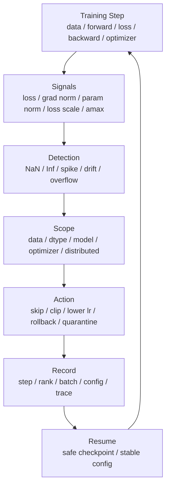

# 训练稳定性与数值异常：NaN、Inf、Loss Spike 与梯度健康

训练系统优化不能只看速度。

如果一个配置让 step time 降低 10%，但每隔几千 step 就出现 NaN、loss spike、梯度爆炸或需要回滚，那么它可能并没有降低真实成本。

长期训练中，数值异常会带来非常实际的系统损失：

- 浪费 GPU 时间。
- 需要回滚 checkpoint。
- 破坏 optimizer state。
- 让 benchmark 结果不可比。
- 让自动调参和性能优化误判。
- 让分布式训练卡在 collective 或 timeout。

本篇重点不是讨论“怎么把模型训练得更聪明”，而是讨论：

```text
训练系统如何发现、定位、隔离和恢复数值异常，
让长时间训练高效、稳定、可复现地运行。
```

## 一张总图



这张图强调：

```text
稳定性不是出错后重启一下，
而是一套从观测、定位、处理到恢复的闭环。
```

## 什么算训练不稳定

训练不稳定不只有 loss 变成 NaN。

常见现象包括：

- loss 直接变成 NaN。
- loss 变成 Inf。
- loss 突然 spike，然后恢复或继续发散。
- gradient norm 突然暴涨。
- parameter norm 或 activation norm 异常增长。
- AMP loss scale 频繁下降。
- FP8 amax / scale 异常。
- 某一层输出出现 NaN/Inf。
- 某个 rank 先异常，其他 rank 在 collective 里 timeout。
- eval 指标突然掉很多，但训练 loss 看起来正常。
- 训练可以跑完，但最终质量明显差于 baseline。

工程上要把这些现象分成两类：

```text
hard failure：NaN / Inf / OOM / crash
soft failure：loss spike / quality regression / unstable scale / abnormal norm
```

hard failure 会直接停训练。

soft failure 更危险，因为它可能继续消耗算力，直到很晚才暴露。

## 为什么这是系统问题

数值稳定性看起来像算法问题，但在 AI Infra 里它也是系统问题。

原因是：

- dtype 由 runtime 和 kernel 决定。
- gradient sync 会传播 NaN。
- optimizer state 可能被污染。
- checkpoint 决定能否回滚。
- data pipeline 决定坏样本是否可追溯。
- distributed sampler 决定异常是否只出现在某个 rank。
- kernel fusion 可能改变计算顺序。
- communication dtype 可能影响误差。
- 自动重启策略可能掩盖根因。

例如某个 rank 的一个 batch 产生 NaN，随后梯度 AllReduce 把 NaN 扩散到所有 rank。

最后看到的是：

```text
所有 GPU 的梯度都是 NaN。
```

但根因可能只是：

```text
rank 17 的某条样本触发了异常 loss。
```

这就是为什么稳定性要和日志、rank、batch、checkpoint、data lineage 一起设计。

## 常见根因总览

| 类别 | 典型根因 | 常见表现 |
| --- | --- | --- |
| 数据 | 坏样本、异常 label、空文本、超长样本、mask 错 | 单个 step spike、特定 rank 异常 |
| Batch/LR | global batch 变化、学习率过高、warmup 太短 | loss spike、grad norm 暴涨 |
| 精度 | FP16 overflow、loss scale 不合适、敏感算子低精度 | NaN/Inf、loss scale 下降 |
| Optimizer | beta、eps、weight decay、clip 配置不当 | 更新过大、norm 漂移 |
| 分布式 | 某 rank 数据不同、skip step 不一致、all-reduce 扩散 NaN | timeout、rank 间状态不一致 |
| Kernel/Compiler | fusion 改变顺序、低精度 accumulation、bug | 只在特定 shape 或配置出现 |
| MoE | router collapse、token dropping、expert imbalance | router loss spike、expert 负载异常 |
| 长上下文 | mask/position 错、attention 数值范围变大 | 长序列下才出现不稳定 |

排查时不要一开始就假设是模型本身。

系统配置、数据路径和并行方式同样可能是根因。

## 需要持续观测的信号

至少记录：

### Loss

- train loss。
- smoothed loss。
- per-loss-component。
- loss before reduction。
- loss after reduction。

如果有多项 loss，不要只记录总和。

例如：

```text
total_loss = lm_loss + aux_loss + router_loss + regularization
```

总 loss spike 时，要知道是哪一项变了。

### Gradient

- global grad norm。
- per-layer grad norm。
- grad max / min。
- grad NaN/Inf count。
- clipped ratio。
- zero grad ratio。

只记录一个 global grad norm 有时不够，因为某一层可能先异常。

### Parameter

- parameter norm。
- update norm。
- update-to-weight ratio。
- per-layer weight RMS。
- embedding / output head norm。

更新幅度比权重本身还大时，要警惕。

### Activation

- activation max / min。
- activation RMS。
- NaN/Inf count。
- selected layer output statistics。

全量记录 activation 代价很高，可以只采样关键层或异常窗口。

### Precision State

混合精度下还要记录：

- loss scale。
- overflow count。
- skipped optimizer steps。
- FP8 amax。
- FP8 scale / scale inverse。
- communication dtype。

这些信号能说明低精度是否稳定。

## NaN / Inf 的传播路径

NaN 一旦出现，传播速度很快。

典型路径：

```text
bad input / unstable op
  -> activation NaN
  -> loss NaN
  -> gradient NaN
  -> all-reduce spreads NaN
  -> optimizer state NaN
  -> parameter NaN
  -> checkpoint polluted
```

最重要的是在污染 optimizer state 和 checkpoint 之前发现。

如果 optimizer state 已经 NaN，单纯跳过一个 batch 往往不够。

需要回滚到干净 checkpoint。

## Loss Spike 不一定都是坏事

loss spike 要分情况。

可能是正常现象：

- 数据 batch 难度较高。
- curriculum 或数据分布切换。
- 学习率 schedule 切换。
- MoE routing 早期波动。
- eval batch 和 train batch 分布不同。

也可能是风险信号：

- 学习率过高。
- gradient accumulation 缩放错。
- bad sample。
- loss mask 错。
- FP16 overflow。
- router collapse。
- position id 错。
- checkpoint resume 后 optimizer state 错。

判断 loss spike 是否危险，要看：

- spike 是否可复现。
- spike 是否和特定数据相关。
- spike 后 grad norm 是否暴涨。
- spike 后参数/update norm 是否异常。
- eval 指标是否受影响。
- 是否同时出现 overflow 或 loss scale 下降。

## Gradient Norm 是早期预警

很多不稳定会先体现在 gradient norm。

例如：

```text
loss 还没 NaN，
但 grad norm 已经突然从 2.3 变成 5000。
```

这时如果继续 optimizer step，参数可能被一次大更新破坏。

建议记录：

- global grad norm。
- grad norm moving average。
- grad norm percentile。
- clipped grad norm。
- unclipped grad norm。

如果用了 gradient clipping，要同时记录 clipping 发生频率。

高频 clipping 说明配置可能有问题，而不是“clipping 成功解决一切”。

## Gradient Clipping

Gradient clipping 常用于防止梯度爆炸。

常见形式：

```text
clip global norm to threshold
```

例如：

```python
torch.nn.utils.clip_grad_norm_(model.parameters(), max_norm=1.0)
```

它的直觉是：

```text
如果梯度整体太大，就按比例缩小，限制一次 optimizer step 的更新幅度。
```

注意点：

- clipping 要在 optimizer step 前。
- AMP 下通常要先 unscale gradients，再 clip。
- 分布式训练中要确认 clip 的是全局梯度语义。
- 记录 clipping ratio，否则不知道是否频繁触发。
- clipping 不能修复数据或 loss mask 错误。

如果每一步都在 clipping，通常说明学习率、batch、loss scale 或模型配置需要重新检查。

## AMP、Loss Scaling 和 Skipped Step

FP16 训练中，梯度可能太小而 underflow，也可能太大而 overflow。

Loss scaling 的作用是：

```text
先把 loss 放大，让梯度落到 FP16 可表示范围；
optimizer step 前再把梯度缩回来。
```

如果检测到 overflow，AMP 通常会跳过这次 optimizer step，并降低 loss scale。

这是一种保护机制。

但如果频繁发生：

- 训练有效 step 变少。
- wall-clock to target 变差。
- optimizer state 更新节奏不稳定。
- loss 曲线可能出现异常。

所以要记录：

- current loss scale。
- overflow step。
- skipped step count。
- overflow rank。
- overflow layer 或 op，如果能定位。

BF16 动态范围更大，通常比 FP16 少依赖 loss scaling，但不代表绝对稳定。

FP8 更依赖 scale/amax 统计和框架实现，必须记录 FP8 metadata。

## 低精度敏感区域

一些操作更容易需要高精度或特殊处理：

- loss 计算。
- softmax。
- layer norm / RMSNorm。
- reduction。
- small variance statistics。
- logits。
- router。
- gradient norm。
- optimizer state update。

混合精度不是“所有东西都半精度”。

稳定配置通常是：

```text
大矩阵乘用低精度加速；
敏感 reduction、norm、loss、optimizer state 用更稳的精度。
```

如果手动 `.half()` 把敏感路径也变成 FP16，NaN 风险会明显增加。

## Optimizer State 被污染

AdamW 等 optimizer 会维护状态：

```text
momentum
variance
```

一旦梯度 NaN 进入 optimizer step，状态也可能变 NaN。

之后即使后续 batch 正常，optimizer state 仍然可能继续污染参数。

所以发生 NaN 时要区分：

- NaN 出现在 forward。
- NaN 出现在 loss。
- NaN 出现在 backward。
- NaN 进入 gradient。
- NaN 进入 optimizer state。
- NaN 进入 parameter。

如果已经进入 optimizer state，最稳妥的恢复方式通常是回滚 checkpoint。

## Checkpoint 回滚策略

长期训练必须设计数值异常后的回滚策略。

建议：

- 保留最近多个 checkpoint。
- 保存 checkpoint manifest。
- 标记 checkpoint 是否通过 health check。
- 不要把异常后的 checkpoint 标成 latest good。
- 支持回滚到上一个 clean checkpoint。
- 记录异常 step、batch、rank、配置。

可以维护两个指针：

```text
latest_checkpoint
latest_good_checkpoint
```

`latest_checkpoint` 表示最近保存。

`latest_good_checkpoint` 表示通过稳定性检查，可以安全恢复。

如果 NaN 发生后自动保存了 checkpoint，但没有区分 good/bad，就可能把污染状态保存下来。

## Bad Batch 和数据隔离

有些异常来自特定数据。

例如：

- 空样本。
- 全 padding。
- 超长样本截断错误。
- label 越界。
- loss mask 全 0。
- 多模态样本缺失图片或音频。
- 数值特征范围异常。
- packed sequence 文档边界错。

需要记录：

- dataset shard。
- sample id。
- document id。
- token length。
- loss mask token count。
- rank。
- dataloader worker。
- preprocessing version。

如果坏样本可复现，要能隔离它，而不是只重启训练。

有些团队会建立 bad batch quarantine：

```text
异常 batch -> 保存 metadata -> 跳过或隔离 -> 离线复现 -> 修数据或规则
```

## 分布式训练中的特殊问题

### 一个 rank 出错，全局都受影响

分布式训练中，一个 rank 的 NaN 会通过 collective 扩散。

例如 DDP AllReduce：

```text
rank 3 grad = NaN
all-reduce
all ranks grad = NaN
```

因此要尽量在 all-reduce 前发现异常 rank。

可以在 debug 模式下检查：

- local loss finite。
- local grad finite。
- per-rank grad norm。
- per-rank data sample id。

生产中全量检查会有开销，可以采用周期性或异常触发检查。

### 所有 rank 必须一致处理 skipped step

如果某个 rank 检测到 overflow，其他 rank 没检测到，不能让一部分 rank 做 optimizer step，另一部分 rank 不做。

否则模型副本会不一致。

需要保证：

- overflow 状态在 rank 间同步。
- skipped step 行为一致。
- scheduler step 行为一致。
- gradient accumulation counter 一致。
- checkpoint step 编号一致。

这类错误很隐蔽，可能不会马上 crash，但会破坏训练。

### Rank 间数据不同导致排查困难

每个 rank 看到不同数据。

如果只有 rank 17 的样本触发异常，只看 rank 0 日志可能完全看不到。

所以日志必须包含：

- rank。
- sample id。
- sequence length。
- loss component。
- local grad norm。
- overflow flag。

## MoE 稳定性

MoE 训练有额外风险。

常见问题：

- router logits 过大。
- expert load imbalance。
- token dropping 增多。
- router loss spike。
- 某些 expert 几乎收不到 token。
- top-k routing 在早期不稳定。
- expert batch 太小导致 kernel 和统计不稳定。

需要记录：

- tokens per expert。
- drop rate。
- router entropy。
- router loss。
- expert grad norm。
- expert load balance。
- all-to-all imbalance。

MoE 的 loss spike 可能不是主 LM loss 引起，而是 router 或专家负载引起。

## 长上下文稳定性

长上下文训练也容易引入数值和语义问题。

常见根因：

- position id 错。
- RoPE scaling 配置错。
- causal mask 错。
- document boundary 错。
- packed sequence 的 loss mask 错。
- attention logits 数值范围变大。
- micro-batch 太小导致统计波动。

排查长上下文时要按 sequence length 分桶观察：

```text
8K / 16K / 32K / 64K / 128K
```

如果只在长序列上出现 loss spike，不要只看平均 loss。

## Kernel Fusion 和 Compiler 风险

Kernel fusion、Triton kernel、TorchInductor、通信计算融合都可能改变：

- 计算顺序。
- accumulation dtype。
- reduction 顺序。
- rounding 行为。
- mask 处理。
- 边界条件。

这些变化可能让数值略有差异。

大多数差异是可接受的，但必须做 guardrail：

- 和 baseline 对比 loss curve。
- 检查 NaN/Inf。
- 检查 per-layer max error。
- 在多个 shape 上测试。
- 记录 kernel/fusion 配置。

性能优化不能只看 step time。

如果 kernel 优化让训练更快但更容易 loss spike，要谨慎采用。

## 稳定性 Runbook

遇到 NaN/Inf 或严重 loss spike，可以按下面顺序排查。

### 第一步：保护现场

- 停止继续污染 checkpoint。
- 保存当前 run manifest。
- 保存异常 step 日志。
- 保存异常 rank 日志。
- 保存 batch metadata。
- 保存最近 profiler 或 trace。

### 第二步：确认异常范围

判断：

- 是单 rank 先异常，还是所有 rank 同时异常？
- 是 forward NaN，还是 backward NaN？
- 是 loss NaN，还是 grad NaN？
- optimizer state 是否被污染？
- checkpoint 是否已污染？

### 第三步：回到最小复现

按顺序缩小：

1. 单机单卡。
2. 单机多卡。
3. 多机小规模。
4. 原始规模。

同时固定：

- 数据 batch。
- seed。
- dtype。
- parallelism config。
- optimizer config。
- checkpoint。

### 第四步：做二分

二分方向：

- 数据版本。
- 代码 commit。
- precision 配置。
- learning rate。
- optimizer。
- kernel fusion。
- sequence length。
- MoE routing。
- parallelism size。

不要同时改很多变量。

### 第五步：决定恢复动作

可选动作：

- 跳过坏 batch。
- 降低 learning rate。
- 增加 warmup。
- 调整 loss scale。
- 开启或加强 gradient clipping。
- 保留敏感 op 高精度。
- 回滚到 latest good checkpoint。
- 禁用可疑 fused kernel。
- 隔离异常数据 shard。

恢复动作也要记录进实验报告。

## 自动化 Guardrail

长期训练应有自动 guardrail。

例如：

- loss finite check。
- grad finite check。
- grad norm threshold。
- loss spike threshold。
- loss scale lower bound。
- overflow frequency threshold。
- update-to-weight ratio threshold。
- per-rank timeout。
- checkpoint health check。

但阈值不能太粗。

例如 loss spike threshold 要考虑：

- 当前训练阶段。
- 数据分布。
- loss moving average。
- batch size。
- MoE router loss。
- curriculum 切换。

建议将 guardrail 结果写入 benchmark/run registry，方便后续对比不同配置。

## 监控和开销取舍

全量数值检查会影响性能。

例如每一步检查所有 activation 是否 finite，代价可能很高。

可以分层：

| 层级 | 做法 |
| --- | --- |
| 常态 | loss、grad norm、loss scale、overflow、关键指标 |
| 周期采样 | per-layer norm、activation summary、selected rank |
| 异常触发 | 保存 batch metadata、打开更细日志、短窗口 profiler |
| Debug run | 全量 finite check、anomaly detection、逐层 hook |

生产长期训练要低开销。

复现异常时可以提高检查强度。

## Benchmark 时怎么比较稳定性

训练系统 benchmark 不应该只报告：

```text
tokens/s
```

还应该报告：

- NaN/Inf 次数。
- loss spike 次数。
- overflow 次数。
- skipped step 数。
- clipping ratio。
- grad norm distribution。
- run 是否完成。
- 是否需要回滚。
- checkpoint 是否可恢复。
- time to target loss。
- wall-clock lost to failures。

如果配置 A 更快 5%，但每 10 小时回滚一次，它可能比配置 B 更贵。

## 常见误区

### 误区一：NaN 后自动重启就行

不够。

如果 optimizer state 或 checkpoint 已污染，重启可能只是从坏状态继续。

### 误区二：loss spike 一定是数据问题

不一定。

学习率、loss scaling、gradient accumulation、mask、position id、kernel fusion、optimizer 都可能导致 spike。

### 误区三：BF16 就不会有数值问题

不对。

BF16 动态范围较大，但精度仍有限，softmax、loss、optimizer、长上下文和异常数据仍可能出问题。

### 误区四：gradient clipping 能解决梯度爆炸

只能限制一次更新的幅度。

如果根因是数据、loss mask、学习率或模型结构，clipping 只是减轻症状。

### 误区五：只看 rank 0 日志

不够。

异常可能先出现在任意 rank。rank 0 可能只是最后看到 all-reduce 后的 NaN。

### 误区六：性能优化不影响数值

不一定。

低精度、fusion、编译、通信 dtype、reduction 顺序都会改变数值路径。

### 误区七：能跑完就代表稳定

不够。

还要看 loss curve、eval、grad norm、overflow、clipping、回滚次数和最终质量。

## 设计检查清单

训练前：

- 是否记录 precision config？
- 是否记录 optimizer 和 scheduler config？
- 是否记录 gradient clipping 配置？
- 是否定义 loss spike 和 NaN guardrail？
- 是否有 latest good checkpoint？

训练中：

- 是否记录 loss component？
- 是否记录 grad norm？
- 是否记录 NaN/Inf count？
- 是否记录 loss scale / overflow / skipped step？
- 是否记录 rank-aware sample metadata？

异常发生时：

- 是否知道哪个 rank 先异常？
- 是否知道异常 batch？
- 是否知道 forward/backward/optimizer 哪一步出问题？
- 是否阻止坏 checkpoint 覆盖 good checkpoint？
- 是否保存足够复现信息？

恢复时：

- 是否回滚到 clean checkpoint？
- 是否隔离坏数据？
- 是否记录恢复动作？
- 是否重新验证 loss curve？
- 是否避免所有 rank 状态不一致？

Benchmark 时：

- 是否同时报告性能和稳定性？
- 是否记录失败重试成本？
- 是否把 stability guardrail 作为通过条件？
- 是否比较 time to target loss，而不只是 step time？

## 小结

训练稳定性与数值异常治理，是训练系统工程的一部分。

核心原则是：

```text
先观测，早发现；
先定位，别污染；
能回滚，可复现；
性能优化必须通过稳定性 guardrail。
```

一个高效训练系统不只是每一步快。

它还应该做到：

- 长时间不发散。
- 异常能定位到 rank、batch、step、layer。
- checkpoint 能安全恢复。
- optimizer state 不被静默污染。
- 性能优化不会破坏 loss curve。
- benchmark 同时报告速度、成本和稳定性。

这也是为什么训练系统章节要把混合精度、optimizer、checkpoint、benchmark 和可观测性连在一起看：它们共同决定一次训练到底是“跑得快”，还是“稳定地跑到目标”。

## 参考资料

- [PyTorch AMP](https://docs.pytorch.org/docs/stable/amp.html)
- [PyTorch clip_grad_norm_](https://docs.pytorch.org/docs/stable/generated/torch.nn.utils.clip_grad_norm_.html)
- [PyTorch DistributedDataParallel](https://docs.pytorch.org/docs/stable/generated/torch.nn.parallel.DistributedDataParallel.html)
- [NVIDIA Transformer Engine FP8 Primer](https://docs.nvidia.com/deeplearning/transformer-engine/user-guide/examples/fp8_primer.html)
