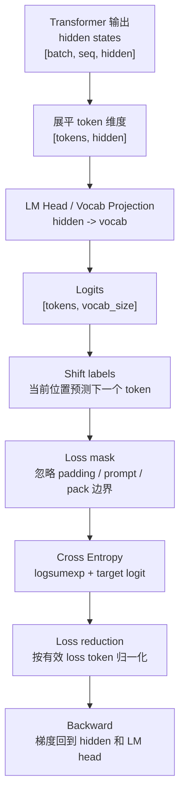
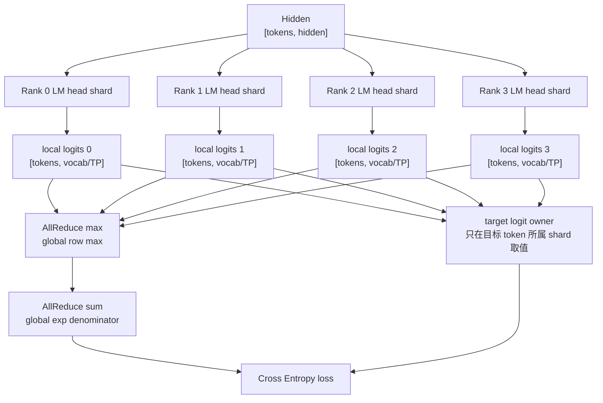

# 大词表输出层、Logits 与 Cross Entropy 系统优化

大语言模型训练的 forward 并不是 Transformer block 算完就结束。每个位置的 hidden state 还要经过输出层，变成“对整个词表里每个 token 的打分”，再和正确答案计算 Cross Entropy loss。

这一步看起来只是一个 loss function，但在系统上非常重要：

- 词表可能有几万、十几万甚至更多 token。
- 每个训练 token 都可能要产生一整行 vocab logits。
- logits 矩阵形状通常是 `[tokens, vocab_size]`，很容易成为显存峰值和访存瓶颈。
- Tensor Parallel 下，如果处理不好，可能把 sharded logits 又 AllGather 回完整 logits，直接抵消并行收益。
- loss mask、shift label、packed sequence 和分布式归一化如果做错，训练 loss 可能“看起来正常”，但实际训练目标已经错了。

所以本篇把输出层、logits、Cross Entropy、loss mask、vocab parallel 和 benchmark 放到一个系统视角里理解。

## 先给结论

训练系统里，大词表输出层可以理解为：

```text
Transformer hidden states
-> LM head / output projection
-> logits over vocabulary
-> stable cross entropy
-> loss
-> backward gradients
```

真正昂贵的地方不是“Cross Entropy 公式复杂”，而是：

1. `tokens * vocab_size` 可能非常大。
2. naive 实现会物化完整 logits，甚至还会产生 softmax / log_softmax 中间结果。
3. backward 也需要从 loss 反传到 hidden state 和 LM head 权重。
4. 分布式训练中，词表维度、序列维度、batch 维度可能已经被不同并行策略切分，loss 归一化必须仍然正确。

优化方向通常包括：

- fused cross entropy，减少中间 tensor 和 HBM 读写。
- chunked loss，把 token 或 vocab 分块，降低峰值显存。
- vocab parallel cross entropy，在 sharded vocab 上直接算 loss，避免 AllGather 完整 logits。
- 正确的 loss mask 和全局 loss token count，避免分布式归一化错误。
- 对敏感计算使用更高精度，降低 overflow、NaN 和 loss spike 风险。

## 从 Hidden State 到 Loss

以 causal language model 为例。Transformer 输出每个位置的 hidden state，然后最后一层 LM head 把 hidden state 映射到词表维度。

常见形状如下：

| 对象 | 典型形状 | 含义 |
| --- | --- | --- |
| hidden states | `[batch, seq_len, hidden_size]` | Transformer 对每个 token 位置的表示。 |
| flatten hidden | `[tokens, hidden_size]` | 把 batch 和 sequence 展平成训练 token 维度。 |
| LM head weight | `[vocab_size, hidden_size]` | 每个词表 token 对应一个输出向量。 |
| logits | `[tokens, vocab_size]` | 每个位置对每个候选 token 的打分。 |
| labels | `[tokens]` | 每个位置应该预测的目标 token id。 |
| loss mask | `[tokens]` | 哪些位置参与 loss，哪些位置忽略。 |

其中：

```text
tokens = batch_size * sequence_length
```

如果用了 sequence packing、prompt mask 或 padding mask，真正参与 loss 的 token 数可能小于 input tokens。

整体数据流如下：



这张图里最容易被低估的是 `Logits [tokens, vocab_size]`。它不是一个小的中间结果，而可能是训练 step 中最大的临时 tensor 之一。

## LM Head 到底在做什么

LM head 也可以叫 output projection。它把模型内部的 hidden vector 转成词表上的分数。

假设某个 token 位置的 hidden vector 是：

```text
h: [hidden_size]
```

LM head 里每个词表 token 都有一个向量：

```text
w_token: [hidden_size]
```

模型会计算：

```text
logit_token = dot(h, w_token)
```

这个分数不是概率，只是未经归一化的打分。分数越高，表示模型越倾向于预测这个 token。

对整个词表都算一遍，就得到一行 logits：

```text
logits_for_position: [vocab_size]
```

对所有训练位置都算，就得到：

```text
logits: [tokens, vocab_size]
```

从系统角度看，LM head 本质上是一次大矩阵乘：

```text
logits = hidden @ lm_head_weight.T
```

其中：

```text
hidden:         [tokens, hidden_size]
lm_head_weight: [vocab_size, hidden_size]
logits:         [tokens, vocab_size]
```

如果 embedding 和 LM head 权重共享，也就是 tied embedding，那么输入 embedding 和输出 LM head 会引用同一组词向量。这可以减少参数量，但在 checkpoint、Tensor Parallel 分片、tokenizer 扩词和加载权重时要保持一致。

## Cross Entropy 在算什么

语言模型训练通常是 next token prediction。模型在位置 `t` 看到前面的上下文，然后预测位置 `t + 1` 的 token。

Cross Entropy 的直觉是：

1. 模型给整个词表里的每个 token 一个分数。
2. 把这些分数变成概率分布。
3. 找到正确 token 的概率。
4. 正确 token 概率越高，loss 越低。
5. 正确 token 概率越低，loss 越高。

用稳定实现看，Cross Entropy 通常不是先显式算完整 softmax 概率再取 log，而是用 logsumexp：

```text
loss = log(sum(exp(logits))) - target_logit
```

为了数值稳定，会先减去当前行的最大值：

```text
m = max(logits)
loss = log(sum(exp(logits - m))) + m - target_logit
```

这样可以避免 `exp(很大的数)` 溢出。

## Shift Labels：当前位置预测下一个 Token

Causal LM 的 labels 需要 shift。直觉上：

```text
input tokens:  [BOS,  我,  喜,  欢,  AI]
预测目标:       [我,    喜,  欢,  AI,  EOS]
```

模型在位置 0 的 hidden state 用来预测位置 1 的 token，位置 1 用来预测位置 2，以此类推。

实际实现里常见两种写法：

```text
shift_logits = logits[:, :-1, :]
shift_labels = labels[:, 1:]
```

或者数据管线直接构造好 `input_ids` 和 `labels`，其中不参与 loss 的位置填成 `ignore_index`。

这里最容易出错的是 off-by-one：

- logits 和 labels 没有对齐。
- prompt 的 token 被错误纳入 loss。
- packed sequence 的两个样本边界之间也被当成连续文本预测。
- EOS / BOS 处理不一致。
- 多模态 token、image placeholder 或 special token 被错误纳入语言 loss。

这类错误不一定立刻导致程序崩溃，但会改变训练目标。

## Loss Mask 与 Ignore Index

不是所有输入 token 都应该参与 loss。

常见需要忽略的位置包括：

- padding token。
- prompt 部分，只训练 assistant response。
- packed sequence 的边界位置。
- 多模态占位 token。
- 某些特殊控制 token。
- 被数据规则过滤掉的异常位置。

在 PyTorch 里，CrossEntropyLoss / cross_entropy 常用 `ignore_index` 表示某个 label 不参与 loss。很多训练框架也会维护显式的 `loss_mask`。

概念上可以理解为：

```text
per_token_loss: [tokens]
loss_mask:      [tokens]

loss = sum(per_token_loss * loss_mask) / sum(loss_mask)
```

重点是分母应该是有效 loss token 数，而不是 input token 数、padded token 数或某个 rank 本地 token 数。

分布式训练里尤其要小心：

```text
global_loss_sum = all_reduce(sum(local_loss))
global_loss_tokens = all_reduce(sum(local_loss_mask))
loss = global_loss_sum / global_loss_tokens
```

如果每个 rank 的有效 token 数不同，只按 rank 平均 loss，会让短样本或 padding 多的 rank 权重过高。

## 为什么大词表 Logits 贵

假设：

```text
tokens = 8192
vocab_size = 128000
dtype = bf16
```

那么 logits 元素数是：

```text
8192 * 128000 = 1,048,576,000
```

仅 logits 一个 tensor，BF16 大约需要：

```text
1,048,576,000 * 2 bytes = 2.0 GiB 左右
```

如果某些中间步骤转成 FP32，或者保存了 log_softmax、softmax、temporary buffer，峰值显存还会更高。

这解释了一个常见现象：

模型主体 forward 能跑过，但到了 loss 才 OOM。

原因可能不是 Transformer layer 本身，而是最后的 `[tokens, vocab]` logits 太大。

## Naive Cross Entropy Pipeline

一个直观但不够高效的实现可能是：

```text
1. 计算完整 logits: [tokens, vocab]
2. 对 logits 做 log_softmax: [tokens, vocab]
3. gather 每个 token 的 target log probability: [tokens]
4. 乘 loss_mask
5. reduce 成 scalar loss
6. backward
```

这个流程好理解，但系统代价很高：

- 完整 logits 要写入 HBM。
- log_softmax 可能产生另一个大 tensor。
- backward 需要读回 logits 或 softmax 相关中间结果。
- 如果 vocab parallel 后又 AllGather 完整 logits，通信和显存都会放大。
- 对只需要 target token logprob 的训练目标，保存全 vocab logprob 很浪费。

高性能训练系统通常会尽量减少这些中间结果的物化。

## Fused Cross Entropy

Fused Cross Entropy 的基本思想是：不要把 softmax、log、gather、mask、reduce 拆成很多独立 kernel 和中间 tensor，而是在更少的 kernel 内完成。

收益主要来自：

- 减少 HBM 读写。
- 减少中间 tensor。
- 减少 kernel launch。
- 可以把数值稳定处理集中在一个实现里。

概念上，fused CE 会在同一段计算里完成：

```text
row max
-> exp / sum
-> logsumexp
-> target logit gather
-> per token loss
-> mask / reduction
```

这并不改变 Cross Entropy 的数学定义，只是改变执行方式。

要注意，fused 并不自动解决所有问题：

- 如果 fused kernel 的输入仍然是完整 `[tokens, vocab]` logits，logits 本身的峰值仍然存在。
- 如果 dtype 处理不当，仍可能出现 overflow 或精度问题。
- 如果 loss mask 或 denominator 错，fused kernel 也会算出错误目标。

## Chunked Loss

Chunked Loss 的目标是降低峰值显存。

最简单的思路是按 token 维度分块：

```text
tokens: 8192
chunk size: 1024

for each token chunk:
    hidden_chunk -> logits_chunk
    logits_chunk -> cross entropy
    accumulate loss_sum and loss_count
```

这样每次只物化：

```text
[chunk_tokens, vocab_size]
```

而不是：

```text
[all_tokens, vocab_size]
```

代价是：

- 可能增加 kernel launch 次数。
- 可能降低大矩阵乘效率。
- backward 实现更复杂，可能需要重算或保存额外信息。
- chunk size 需要根据显存、vocab size、hidden size 和 kernel 效率调参。

更激进的做法是把 linear projection 和 CE 进一步融合，在不完整物化 logits 的情况下直接得到 loss 和梯度。这类实现更依赖框架、kernel 和自动微分支持，但方向很明确：减少 `[tokens, vocab]` 大 tensor 的生命周期。

## Vocab Parallel Cross Entropy

Tensor Parallel 训练里，输出词表也可以切分。假设 TP size = 4：

```text
Rank 0: vocab [0, 32000)
Rank 1: vocab [32000, 64000)
Rank 2: vocab [64000, 96000)
Rank 3: vocab [96000, 128000)
```

每个 rank 只保存一部分 LM head 权重，只计算本地词表 shard 的 logits：

```text
local_logits: [tokens, vocab_size / tp_size]
```

naive 做法是把所有 rank 的 local logits AllGather 成完整 logits：

```text
all_gather(local_logits) -> [tokens, vocab_size]
```

这会重新引入巨大的显存和通信压力。

更高效的做法是在 sharded logits 上直接计算 Cross Entropy。核心步骤是：

```text
1. 每个 rank 计算 local logits。
2. 每个 rank 计算 local max。
3. 对 local max 做 all_reduce(max)，得到 global max。
4. 每个 rank 计算 exp(local_logits - global_max) 的 local sum。
5. 对 local sum 做 all_reduce(sum)，得到 global denominator。
6. 每个 rank 判断 target token 是否落在自己的 vocab shard。
7. 只有拥有 target token 的 rank 取出 target logit。
8. 对 target logit 做 all_reduce(sum)，得到每个 token 的 global target logit。
9. loss = log(global_denominator) + global_max - target_logit。
```

这个流程只通信必要的统计量，而不是通信完整 vocab logits。

用图表示：



这种实现的关键不是“少算了 Cross Entropy”，而是避免了完整 logits 的 AllGather。

## Vocab Parallel 的实现细节

Vocab Parallel 容易踩坑的地方很多。

### 词表 Padding

为了让词表能平均切到多个 rank，实际训练里常把 vocab size padding 到某个倍数。

例如真实词表是：

```text
vocab_size = 127997
```

TP size 是 8，可能 padding 到：

```text
padded_vocab_size = 128000
```

这时必须确保：

- padding token 不会作为真实 label。
- target id 映射只针对真实 token。
- 计算 loss 时不会把 padding vocab 当成有效类别。
- 保存和加载 checkpoint 时清楚真实 vocab 与 padded vocab 的区别。

### Target Token 属于哪个 Rank

每个 rank 只知道自己负责的 vocab 范围：

```text
vocab_start <= target_id < vocab_end
```

如果 target 不在本 rank，就不能直接用 target_id 去索引 local logits。

常见做法是构造 mask：

```text
target_in_local_shard = (target >= vocab_start) and (target < vocab_end)
local_target = target - vocab_start
```

不属于本 shard 的 token，把 local target logit 设为 0，然后通过 all_reduce(sum) 聚合。由于每个 target 只属于一个 shard，sum 后就得到正确的 target logit。

### Tied Embedding

如果 input embedding 和 LM head 共享权重，词表分片必须保持一致。

要特别检查：

- embedding shard 和 lm_head shard 是否同一个切分方式。
- checkpoint 保存时是否只保存 shard，还是保存 full weight。
- 从非 TP checkpoint 加载到 TP 训练时是否正确切分。
- tokenizer 扩词后 embedding 和 lm_head 是否一起 resize。

### Gradient 回传

输出层 loss backward 会产生两类梯度：

- 对 hidden state 的梯度，继续传回 Transformer blocks。
- 对 LM head weight 的梯度，用来更新输出层权重。

在 vocab parallel 下，每个 rank 只负责自己 vocab shard 的权重梯度。对 hidden 的梯度则需要汇总各 shard 的贡献，这通常涉及 TP 通信。

因此 vocab parallel CE 不只是 forward loss 优化，也影响 backward 通信路径。

## 与 Sequence / Context Parallel 的关系

长序列训练里，token 维度也可能被切分。此时要区分：

- vocab dimension 是否被 TP 切分。
- sequence dimension 是否被 SP / CP 切分。
- batch dimension 是否被 DP / FSDP 切分。

如果每个 rank 只持有部分 token，那么 loss 归一化必须跨相关 group 聚合有效 token 数。

例子：

```text
Rank 0 local loss tokens = 900
Rank 1 local loss tokens = 700
Rank 2 local loss tokens = 1024
Rank 3 local loss tokens = 512
```

正确的全局 loss 分母应该是：

```text
900 + 700 + 1024 + 512
```

而不是：

```text
4 * local_average
```

如果同时存在 TP 和 DP，还要明确在哪些 group 上做：

- vocab parallel CE 的 max/sum all-reduce。
- data parallel 的 loss sum / token count all-reduce。
- gradient 的 reduce-scatter 或 all-reduce。

这些通信 group 混淆后，loss 可能数值异常，也可能只是训练质量变差。

## 与 Pipeline Parallel 的关系

Pipeline Parallel 下，LM head 通常在最后一个 pipeline stage。于是最后一个 stage 可能承担额外压力：

- 保存最后几层 Transformer 权重。
- 保存 LM head 权重。
- 计算大 vocab logits。
- 计算 loss。
- 接收 labels 和 loss mask。

如果 stage balance 只看 Transformer layer 数，而忽略 LM head 和 loss，最后一个 stage 可能比其他 stage 慢，导致 pipeline bubble 或局部显存峰值。

优化时需要把输出层也纳入 stage balance：

- 最后一个 stage 是否显存更高。
- loss kernel 是否占据明显 step time。
- LM head 是否需要 TP / vocab parallel。
- labels 和 masks 是否随 micro-batch 正确流到最后 stage。

## 与 FSDP / ZeRO 的关系

FSDP / ZeRO 关注参数、梯度和 optimizer state sharding。LM head 权重很大，因此也会受到影响。

需要考虑：

- LM head 是否被 FSDP wrap。
- forward 前是否需要 all-gather LM head 参数。
- vocab parallel 和 FSDP 是否同时作用于 LM head。
- optimizer state 是否按 shard 保存。
- checkpoint 是否能在不同并行配置之间 reshard。

如果 LM head 参与 tied embedding，还要避免 input embedding 和 output head 在 sharding 策略上出现不一致。

## 与 Mixed Precision 的关系

Cross Entropy 里有 `max`、`exp`、`sum`、`log`。这些操作对数值范围比较敏感。

常见策略是：

- matmul 使用 BF16 / FP16 / FP8 等低精度路径。
- row max、sum、logsumexp 等 reduction 用更高精度累计。
- loss scalar 保持 FP32。
- 对 logits 做有限范围检查，避免 Inf / NaN 扩散。

FP16 的动态范围比 BF16 小，更容易遇到 overflow。BF16 动态范围更大，但精度仍有限。无论哪种低精度，都不能把 loss 数值稳定性当成理所当然。

排查时重点看：

- logits max / min 是否异常。
- loss 是否突然 NaN。
- `exp` 前是否做了 stable max subtraction。
- loss mask 是否全 0。
- label id 是否越界。
- vocab padding 区域是否被错误选中。

## 后训练中的 Logprob 计算

SFT、DPO、RLHF、GRPO 等后训练任务经常需要 token logprob。

以 DPO 为例，训练可能需要：

- policy model 对 chosen response 的 logprob。
- policy model 对 rejected response 的 logprob。
- reference model 对 chosen / rejected 的 logprob。

这时如果每次都保存完整 `[tokens, vocab]` logprob，显存和带宽会很浪费。很多目标实际上只需要 target token 对应的 logprob。

系统优化方向是：

- 只保留 target token logprob。
- 对 prompt 部分用 loss mask 忽略。
- 对 chosen / rejected 分别聚合 response token logprob。
- 避免在 reference model forward 里保存不必要 activation。
- 对多轮 rollout / verifier pipeline 明确 logprob 缓存格式。

后训练不是“普通 CE 多跑几次”那么简单。它经常把多个 forward、多个模型、reference logprob、reward / verifier 和 policy update 串起来，输出层和 logprob 路径会被重复调用。

## 训练与推理的差别

训练时通常需要对很多 loss token 计算目标 token 的 Cross Entropy。

推理时通常只关心每个请求当前最后一个 active token 的 next token logits，然后做 sampling、top-k、top-p、temperature 或 greedy decode。

所以两者的系统形态不同：

| 场景 | 主要需求 | 输出层压力 |
| --- | --- | --- |
| 预训练 / SFT | 对大量 token 计算 CE loss | `[tokens, vocab]` 很大，loss backward 也重。 |
| DPO / RLHF | 取 response token logprob | 多 forward、多 logprob 聚合，target token logprob 路径重要。 |
| 在线推理 | 每步生成下一个 token | 通常只处理 active sequence 的最后位置，采样和 latency 更关键。 |
| Beam search / rerank | 需要多个候选分数 | logits / logprob 管理更复杂，但通常无 backward。 |

不要把推理服务里的 logits 优化经验直接套到训练上。训练需要 backward，显存和通信结构不同。

## Benchmark 应该怎么测

评估输出层和 CE 优化时，不要只看 end-to-end tokens/s。要把 shape 和实现细节记录清楚。

建议记录：

| 项目 | 为什么重要 |
| --- | --- |
| `tokens` | 决定 logits 行数。 |
| `loss_tokens` | 决定真正参与 loss 的 token 数。 |
| `vocab_size` / `padded_vocab_size` | 决定 logits 列数和 vocab parallel 切分。 |
| `hidden_size` | 决定 LM head matmul 成本。 |
| dtype | BF16、FP16、FP32、FP8 路径不同。 |
| CE 实现 | naive、fused、chunked、vocab parallel。 |
| TP size | 决定 vocab shard 大小和通信 group。 |
| peak memory | loss 阶段是否形成峰值。 |
| loss time | loss 相关 kernel / communication 占 step time 比例。 |
| all-reduce time | vocab parallel CE 的统计量通信成本。 |
| correctness diff | 和 baseline loss / grad 对齐。 |

一个有用的 ablation 可以这样做：

| 实验 | 目的 |
| --- | --- |
| naive full logits CE | 作为正确性和性能 baseline。 |
| fused CE | 看减少中间 tensor 后收益。 |
| chunked CE | 看峰值显存下降与吞吐损失。 |
| vocab parallel CE | 看避免 full logits AllGather 的收益。 |
| 不同 vocab size | 观察大词表下瓶颈是否放大。 |
| 不同 loss mask ratio | 观察有效 token 比例对吞吐和 loss 归一化的影响。 |

正确性验证至少应包括：

- loss scalar 和 baseline 接近。
- hidden gradient 和 baseline 接近。
- LM head gradient 和 baseline 接近。
- ignore_index / loss mask 行为一致。
- 分布式 world size 改变时 loss 归一化不变。

## 常见故障

### Loss 阶段 OOM

现象：

- Transformer forward 能过。
- 到 logits、log_softmax 或 loss 才 OOM。

可能原因：

- `[tokens, vocab]` logits 太大。
- log_softmax 产生额外大 tensor。
- activation checkpointing 只优化了 Transformer block，没有优化输出层。
- vocab parallel 后又 AllGather 完整 logits。

排查：

- 记录 loss 前后的 peak memory。
- 打印 `tokens`、`vocab_size`、dtype。
- 看 profiler 里是否有大规模 logits / log_softmax tensor。
- 尝试 fused CE、chunked CE 或 vocab parallel CE。

### Loss 数值 NaN / Inf

可能原因：

- logits 极值过大。
- low precision 下 `exp` overflow。
- label id 越界。
- loss mask 全 0，除以 0。
- fused kernel 对极端输入处理不稳。

排查：

- 记录 logits max / min。
- 检查 labels 范围。
- 检查有效 loss token count。
- 用小 batch FP32 baseline 对比。
- 对问题 batch 做 deterministic replay。

### Loss 看起来正常但训练质量差

可能原因：

- shift label 错一位。
- prompt token 被纳入 loss。
- packed sequence 边界预测了下一个样本的 token。
- 分布式 loss 按 rank 平均，而不是按 token 数归一化。
- vocab padding token 被纳入训练目标。

排查：

- 抽样打印 input、label、loss mask 对齐。
- 对一个短样本手动检查每个位置的 target。
- 比较单卡、DDP、多 TP 下 loss 是否一致。
- 记录 global loss token count。

### Vocab Parallel 通信异常

可能原因：

- TP group 不一致。
- vocab shard 起止范围计算错误。
- target token owner 判断错误。
- padding vocab 处理错误。
- all-reduce max / sum 用错通信 group。

排查：

- 打印每个 rank 的 vocab range。
- 用很小 vocab 构造可手算 case。
- 验证每个 target 只属于一个 rank。
- 对比 full logits CE baseline。

## 实践建议

如果只是入门理解，可以按下面顺序掌握：

1. 先理解 LM head 是 `hidden -> vocab` 的大矩阵乘。
2. 再理解 CE 是用 logits 计算正确 token 的负 log probability。
3. 接着理解 shift labels 和 loss mask，知道哪些 token 参与训练。
4. 然后用 `[tokens, vocab]` 估算 logits 显存。
5. 最后再学习 fused CE、chunked CE 和 vocab parallel CE。

如果是在优化训练系统，可以优先检查：

1. loss 阶段是否是显存峰值。
2. 是否物化了完整 logits 和 log_softmax。
3. vocab parallel 后是否避免 full logits AllGather。
4. loss denominator 是否使用全局有效 loss token。
5. FP16 / BF16 下 CE 是否有稳定的高精度 reduction。
6. SFT / DPO / RLHF 是否只保存必要 target token logprob。

这部分的核心判断很简单：

> 输出层和 Cross Entropy 不是训练脚本的尾巴，而是大词表、大 batch、长序列训练里的关键系统瓶颈。

## 与本章其他主题的关系

建议把本篇和这些内容连起来读：

- [Batch、Micro-batch 与 Gradient Accumulation](batch-gradient-accumulation.md)：理解 tokens 和 loss token 数如何被 batch 放大。
- [显存组成与优化总览](memory-composition-optimization.md)：理解 logits 属于 temporary / loss 相关显存。
- [Tensor Parallel](tensor-parallel.md)：理解 vocab parallel 是 TP 的重要组成。
- [Sequence Parallel 与 Context Parallel](sequence-context-parallel.md)：理解 token 维度切分后 loss 如何归一化。
- [混合精度训练](mixed-precision-training.md)：理解 CE 中 softmax / exp / log 的数值风险。
- [后训练工作负载：SFT、DPO、RLHF 与 GRPO 系统视角](post-training-workloads-sft-dpo-rlhf-grpo.md)：理解 logprob 在后训练中的重复调用。

## 参考资料

- [PyTorch `torch.nn.functional.cross_entropy`](https://docs.pytorch.org/docs/stable/generated/torch.nn.functional.cross_entropy.html)
- [PyTorch `torch.nn.CrossEntropyLoss`](https://docs.pytorch.org/docs/stable/generated/torch.nn.CrossEntropyLoss.html)
- [Megatron-LM: Training Multi-Billion Parameter Language Models Using Model Parallelism](https://arxiv.org/abs/1909.08053)
