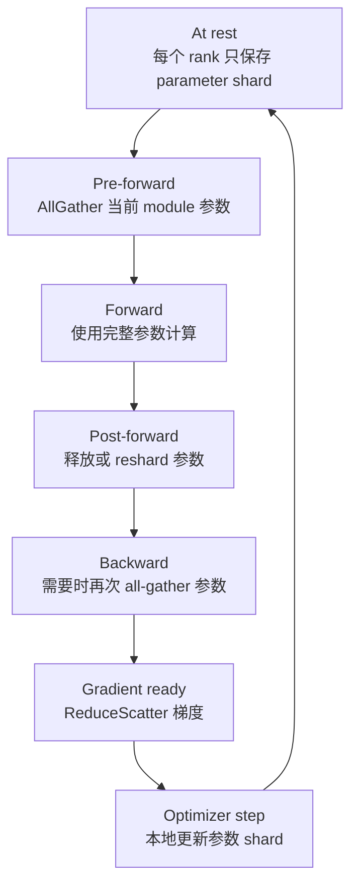

# ZeRO 与 FSDP

普通 Data Parallel 很好理解：每张 GPU 放一份完整模型，处理不同数据，再同步梯度。但是当模型变大后，普通 Data Parallel 最大的问题也很清楚：每张 GPU 都重复保存完整的参数、梯度和优化器状态。

一句话理解：

> ZeRO 和 FSDP 的核心目标，是在保留 Data Parallel 编程体验的同时，把 parameters、gradients、optimizer states 这些模型状态切分到多个 data parallel rank 上，减少单卡重复显存。

它们不是为了减少模型计算量，也不是专门解决 activation 显存。它们解决的是“模型状态在数据并行副本之间重复存储”的问题。

## 为什么普通 DDP 不够

在普通 Distributed Data Parallel 中，每个 data parallel rank 都有一份完整模型副本。

如果一个模型有 `N` 个参数，使用 AdamW 训练，单卡模型状态可能包括：

| 状态 | 粗略大小 |
| --- | --- |
| 低精度参数 | `N * 2 bytes` |
| 低精度梯度 | `N * 2 bytes` |
| FP32 master weight | `N * 4 bytes` |
| Adam first moment | `N * 4 bytes` |
| Adam second moment | `N * 4 bytes` |

合计大约：

```text
N * 16 bytes
```

7B 参数模型就是：

```text
7B * 16 bytes = 112GB
```

这还没算 activation、临时 buffer、通信 bucket 和碎片。

如果用 8 张 GPU 做普通 DDP，每张 GPU 仍然要放这 112GB 模型状态。普通 DDP 增加的是数据并行吞吐，不会自动降低单卡模型状态显存。

ZeRO 和 FSDP 的价值就在这里：把这些模型状态切成 shard，每个 rank 只保存一部分。

## 先分清三类模型状态

理解 ZeRO/FSDP 前，先记住训练中最核心的三类模型状态：

| 类型 | 作用 | 普通 DDP 中是否重复 |
| --- | --- | --- |
| Parameters | forward/backward 用的模型权重 | 每个 rank 完整复制 |
| Gradients | backward 得到的参数梯度 | 每个 rank 完整复制 |
| Optimizer states | Adam 动量、二阶矩、master weight 等 | 每个 rank 完整复制 |

ZeRO 的名字是 Zero Redundancy Optimizer。它的思想是：既然 Data Parallel 中这些状态在每个 rank 上重复，那么可以按 data parallel rank 切分，让每个 rank 只持有自己负责的一部分。

FSDP 的名字是 Fully Sharded Data Parallel。它的思想和 ZeRO-3 很接近：参数、梯度、优化器状态都可以 shard，计算时再临时 all-gather 需要的完整参数。

## 普通 DDP 和 Sharded Data Parallel

普通 DDP 的状态放置可以理解为：

```text
Rank 0: full parameters + full gradients + full optimizer states
Rank 1: full parameters + full gradients + full optimizer states
Rank 2: full parameters + full gradients + full optimizer states
Rank 3: full parameters + full gradients + full optimizer states
```

Sharded Data Parallel 的目标是：

```text
Rank 0: shard 0 of model states
Rank 1: shard 1 of model states
Rank 2: shard 2 of model states
Rank 3: shard 3 of model states
```

但模型计算时，某些层需要完整参数才能做矩阵乘。因此系统必须在“省显存”和“计算时拿到完整参数”之间来回切换。

这就是 ZeRO/FSDP 的核心机制：

- 平时只保存 shard。
- 计算某个模块前，把它需要的参数 all-gather 出来。
- 计算完成后释放或重新 shard。
- backward 得到梯度后，用 reduce-scatter 把梯度切回各 rank。
- optimizer 只更新本 rank 负责的参数 shard。

## ZeRO 三个阶段

ZeRO 通常分为三个阶段。每个阶段比前一个阶段切分更多模型状态。

| 阶段 | 切分对象 | 主要节省 |
| --- | --- | --- |
| ZeRO-1 | optimizer states | Adam 状态、master weight |
| ZeRO-2 | optimizer states + gradients | 优化器状态和梯度 |
| ZeRO-3 | optimizer states + gradients + parameters | 完整模型状态 |

可以把它理解成逐步减少 DDP 的冗余。

## ZeRO-1：切 optimizer states

ZeRO-1 只切 optimizer states。

普通 DDP 中，每个 rank 都保存完整 Adam 状态。ZeRO-1 把 optimizer states 按 data parallel rank 切分：

```text
Rank 0: optimizer state shard 0
Rank 1: optimizer state shard 1
Rank 2: optimizer state shard 2
Rank 3: optimizer state shard 3
```

但每个 rank 仍然持有完整 parameters 和完整 gradients。

粗略显存模型：

```text
DDP:
  P + G + O

ZeRO-1:
  P + G + O / DP
```

其中：

- `P` 是参数显存。
- `G` 是梯度显存。
- `O` 是 optimizer states 显存。
- `DP` 是 data parallel size。

ZeRO-1 很适合 optimizer state 是主要显存瓶颈的场景。例如 AdamW 的 `m`、`v` 和 master weight 很大，而参数和梯度暂时还能放下。

代价是 optimizer step 后需要让所有 rank 的参数保持一致。因为每个 rank 只负责更新一部分参数，所以更新结果需要在 rank 之间同步。

## ZeRO-2：再切 gradients

ZeRO-2 在 ZeRO-1 基础上继续切 gradients。

普通 DDP 中，每个 rank backward 后会有完整 gradients，再通过 AllReduce 让每个 rank 得到相同完整梯度。

ZeRO-2 不再要求每个 rank 长期保存完整梯度。它通过 reduce-scatter，把梯度规约后切分给不同 rank：

```text
Rank 0: reduced gradient shard 0
Rank 1: reduced gradient shard 1
Rank 2: reduced gradient shard 2
Rank 3: reduced gradient shard 3
```

粗略显存模型：

```text
ZeRO-2:
  P + G / DP + O / DP
```

参数仍然完整复制，但 gradients 和 optimizer states 都被切分。

ZeRO-2 适合这些情况：

- 参数本身还能单卡放下。
- optimizer states 和 gradients 显存压力大。
- 希望比 ZeRO-1 更省显存，但不想承受 ZeRO-3 的参数 all-gather 复杂度。

ZeRO-2 的通信模式比普通 DDP 更复杂。普通 DDP 常用 AllReduce，ZeRO-2 更依赖 ReduceScatter 和参数更新同步。

## ZeRO-3：再切 parameters

ZeRO-3 进一步切 parameters。

这意味着每个 rank 平时只保存参数 shard：

```text
Rank 0: parameter shard 0
Rank 1: parameter shard 1
Rank 2: parameter shard 2
Rank 3: parameter shard 3
```

但计算某一层时，当前 rank 需要这层完整参数。因此 ZeRO-3 会在 forward/backward 需要时 all-gather 参数，用完后再释放或重新 shard。

粗略显存模型：

```text
ZeRO-3:
  P / DP + G / DP + O / DP
  + live gathered parameters
  + communication buffers
```

注意最后两项。ZeRO-3 静态看很省显存，但运行时仍会有临时 all-gather 出来的参数和通信 buffer。实际峰值取决于：

- 模块粒度。
- prefetch 策略。
- 参数释放时机。
- bucket size。
- overlap 策略。
- activation 大小。
- 通信拓扑。

ZeRO-3 适合参数本身也无法完整复制的场景。它能训练更大的模型，但也更依赖通信效率和实现细节。

## ZeRO 三阶段对比

用一个表总结：

| 方案 | 参数 | 梯度 | 优化器状态 | 通信复杂度 | 适合场景 |
| --- | --- | --- | --- | --- | --- |
| DDP | 完整复制 | 完整复制 | 完整复制 | 较低 | 模型状态单卡能放下 |
| ZeRO-1 | 完整复制 | 完整复制 | shard | 中等 | Adam 状态是主要瓶颈 |
| ZeRO-2 | 完整复制 | shard | shard | 中高 | 梯度和优化器状态压力大 |
| ZeRO-3 | shard | shard | shard | 高 | 参数本身也需要切分 |

越往后越省显存，但通信和系统复杂度也越高。

所以不要默认“ZeRO-3 一定最好”。如果 ZeRO-2 已经能放下模型，且吞吐更好，那 ZeRO-2 可能更合适。

## FSDP 是什么

FSDP 是 PyTorch 原生的 Fully Sharded Data Parallel。

它把一个或多个 module 包起来，管理这些 module 的参数 shard、all-gather、reshard、gradient reduce-scatter、optimizer state sharding 和 checkpoint。

从系统视角看，FSDP 和 ZeRO-3 很接近：

- 参数在 data parallel rank 之间切分。
- forward 前 all-gather 当前模块需要的完整参数。
- forward 后根据策略释放或 reshard。
- backward 时再次需要完整参数或相关状态。
- backward 得到梯度后 reduce-scatter。
- optimizer 在本地 shard 上更新。

PyTorch 文档也明确说明 FSDP 受到 ZeRO Stage 3 启发。

## FSDP 的执行流程

一个 FSDP-wrapped module 的简化流程：



这张图体现了 FSDP 的核心取舍：

- 省显存：平时只保存 shard。
- 付通信：计算前要 all-gather，梯度后要 reduce-scatter。
- 控峰值：不能让太多 module 的完整参数同时 live。

## FSDP wrap 粒度为什么重要

FSDP 不是只能包整个模型。它通常会按模块粒度 wrap，例如按 Transformer block wrap。

Wrap 粒度会影响显存和通信：

| Wrap 粒度 | 优点 | 风险 |
| --- | --- | --- |
| 整个模型一个 FSDP | 简单，通信次数少 | all-gather 峰值巨大，容易 OOM |
| 每个 Transformer block 一个 FSDP | 峰值更可控，常用 | 通信次数更多，需要 prefetch/overlap |
| 更细粒度 wrap | 峰值更低 | collective 过多，开销高 |

好的 wrap 策略要让“当前 live 的完整参数”足够小，同时不要把通信切得过碎。

这和 DDP gradient bucket 类似：粒度太大，峰值和等待大；粒度太小，通信调用太多。

## AllGather、ReduceScatter 和 Prefetch

FSDP / ZeRO-3 的通信核心是：

- AllGather：计算前收集完整参数。
- ReduceScatter：backward 后规约并切分梯度。

为了减少通信暴露，系统会尝试 prefetch：

- forward prefetch：提前 all-gather 后续模块参数。
- backward prefetch：backward 时提前准备即将用到的参数。

Prefetch 能提升 overlap，但也会增加峰值显存。因为提前 gather 的参数会和当前模块参数、activation、通信 buffer 同时存在。

所以 prefetch 是典型的吞吐和显存取舍：

```text
更激进 prefetch:
  通信更容易隐藏
  峰值显存更高

更保守 prefetch:
  峰值显存更低
  通信更容易暴露
```

## FSDP 的 rate limiter

FSDP 中有一类配置用于限制过度 all-gather。例如 PyTorch FSDP 的 `limit_all_gathers`。

它的目的不是让训练更慢，而是避免 CPU 线程过快发起太多 all-gather，导致 GPU 上同时存在过多未来模块的完整参数，从而 OOM。

在 profiler 里你可能看到 pre-forward 前有 gap。这个 gap 可能是 rate limiter 有意控制内存峰值，不一定表示 GPU 计算被错误阻塞。

理解这一点很重要：FSDP 的优化目标不是无限提前通信，而是在显存上限内尽量 overlap。

## Sharded Optimizer State

FSDP/ZeRO 的 optimizer state 也要 shard。

普通 DDP 中，每个 rank 的 optimizer 都有完整状态。

FSDP/ZeRO 中，optimizer 通常只维护本 rank 参数 shard 对应的状态：

```text
Rank 0 optimizer: states for param shard 0
Rank 1 optimizer: states for param shard 1
Rank 2 optimizer: states for param shard 2
Rank 3 optimizer: states for param shard 3
```

这样 AdamW 的 `m`、`v`、master weight 等状态不再在每个 rank 上完整复制。

但这也带来 checkpoint 和调试复杂性。因为某个 rank 的 optimizer state 不再完整，想保存完整 checkpoint 或检查完整参数，需要聚合或使用 sharded checkpoint。

## Checkpoint 为什么更复杂

普通 DDP 保存 checkpoint 比较直观：每个 rank 都有完整模型，通常 rank 0 保存即可。

ZeRO-3/FSDP 下，每个 rank 只有模型 shard。保存 checkpoint 有几种选择：

| checkpoint 类型 | 思路 | 优点 | 风险 |
| --- | --- | --- | --- |
| full state dict | 聚合成完整权重保存 | 方便下游加载 | 聚合时显存/内存峰值高 |
| sharded state dict | 每个 rank 保存自己的 shard | 更适合大模型训练恢复 | 加载和转换更复杂 |
| local state dict | 保存本 rank 本地状态 | 快，适合原训练拓扑恢复 | 跨拓扑迁移难 |

大模型训练通常应优先考虑 sharded checkpoint。否则保存时为了聚合完整权重，可能在 rank 0 或 CPU 内存上 OOM。

这也是 ZeRO/FSDP 文档里经常强调 state_dict 类型和离线转换工具的原因。

## Offload：把状态放到 CPU 或 NVMe

ZeRO 和 FSDP 都可以和 offload 思路结合。

Offload 的目标是把一部分状态从 GPU 显存移到：

- CPU 内存。
- NVMe。

常见 offload 对象：

- optimizer states。
- parameters。
- gradients。

Offload 能显著降低 GPU 显存压力，但代价也明显：

- PCIe / NVMe 带宽可能成为瓶颈。
- 数据搬运需要和计算重叠，否则 step time 会变长。
- NUMA、CPU 内存、I/O 调度都会影响性能。
- checkpoint 和恢复更复杂。

所以 offload 更像“容量手段”，不是首选性能优化手段。能不用 offload 训练稳定跑通，通常会更快。

## ZeRO/FSDP 不能解决 activation 显存

ZeRO/FSDP 主要切的是模型状态：

- parameters。
- gradients。
- optimizer states。

它们不直接消除 activation。

如果 OOM 主要发生在 forward/backward 中，且显存随 micro-batch 或 sequence length 明显变化，那么瓶颈可能是 activation。此时应该考虑：

- 减小 micro-batch。
- activation checkpointing。
- FlashAttention。
- sequence parallel。
- 降低 sequence length。

ZeRO/FSDP 可以和 activation checkpointing 组合使用，但两者解决的问题不同。

## 通信成本怎么理解

ZeRO/FSDP 用通信换显存。

普通 DDP 的主要通信是梯度 AllReduce。

ZeRO-2 增加了 gradient sharding 相关通信，常见是 ReduceScatter。

ZeRO-3/FSDP 还需要参数 AllGather。也就是说，每个模块计算前，可能都要把参数 gather 出来。

粗略看：

| 方案 | 主要通信 |
| --- | --- |
| DDP | gradient AllReduce |
| ZeRO-1 | gradient sync + 参数更新同步 |
| ZeRO-2 | gradient ReduceScatter + 参数更新同步 |
| ZeRO-3/FSDP | parameter AllGather + gradient ReduceScatter |

这就是为什么 ZeRO-3/FSDP 对网络、bucket、prefetch 和 wrap 粒度更敏感。

如果通信不能和计算重叠，step time 会明显变长。

## 和 Tensor Parallel、Pipeline Parallel 的关系

ZeRO/FSDP 属于 data parallel 方向的 sharding。它们沿 data parallel rank 切模型状态。

Tensor Parallel 则是把一层内部的大矩阵计算切到多个 GPU。

Pipeline Parallel 是把不同层切到不同 GPU。

三者解决的问题不同：

| 技术 | 切分维度 | 主要解决 |
| --- | --- | --- |
| ZeRO/FSDP | data parallel rank 上的模型状态 | DDP 状态重复显存 |
| Tensor Parallel | 层内矩阵计算和参数 | 单层太大或算力不够 |
| Pipeline Parallel | 层之间 | 模型层数多、权重分布 |

实际大模型训练经常组合使用：

```text
Data Parallel / FSDP
+ Tensor Parallel
+ Pipeline Parallel
+ Activation Checkpointing
```

组合后要非常清楚每个 parallel group 的范围。否则通信路径、checkpoint、batch 公式和显存估算都会出错。

## 一个 7B 模型例子

假设 7B 模型训练状态粗略是：

```text
P + G + O = 112GB
```

用 8 张 GPU 做普通 DDP：

```text
per GPU model states ≈ 112GB
```

单卡放不下。

ZeRO-1 假设 optimizer states 是 84GB，parameters + gradients 是 28GB：

```text
per GPU ≈ 28GB + 84GB / 8
        ≈ 38.5GB
```

这可能已经能放下模型状态，但还要加 activation。

ZeRO-2：

```text
parameters: 14GB
gradients: 14GB / 8 = 1.75GB
optimizer states: 84GB / 8 = 10.5GB
per GPU model states ≈ 26.25GB
```

ZeRO-3/FSDP：

```text
parameters: 14GB / 8 = 1.75GB
gradients: 14GB / 8 = 1.75GB
optimizer states: 84GB / 8 = 10.5GB
at-rest model states ≈ 14GB
```

但 ZeRO-3/FSDP 运行时还要加：

- 当前 gathered module parameters。
- prefetch 的下一部分 parameters。
- activation。
- communication buffers。
- allocator overhead。

所以不能只看 at-rest 数字。真正决定 OOM 的仍然是峰值。

## 什么时候选 ZeRO-1

ZeRO-1 适合：

- 参数和梯度能放下。
- Adam optimizer states 是主要显存瓶颈。
- 希望尽量保留 DDP 的简单性。
- 不想引入过多 parameter all-gather。

它的优点是改动较小、通信复杂度相对低。

它的缺点是如果参数或梯度也放不下，ZeRO-1 不够。

## 什么时候选 ZeRO-2

ZeRO-2 适合：

- 参数本身还能完整放在单卡。
- gradients 和 optimizer states 显存压力大。
- 希望比 ZeRO-1 更省显存。
- 不希望每层 forward/backward 都做参数 all-gather。

它经常是容量和性能之间比较实用的折中点。

缺点是参数仍完整复制。如果参数本身已经太大，就要 ZeRO-3/FSDP/TP/PP。

## 什么时候选 ZeRO-3 / FSDP

ZeRO-3/FSDP 适合：

- 参数本身也需要切分。
- 普通 DDP / ZeRO-1 / ZeRO-2 放不下。
- 希望用 data parallel 风格训练更大模型。
- 能接受更复杂的通信、checkpoint 和调试。

它的主要风险：

- parameter all-gather 暴露，拖慢 step time。
- wrap 粒度不合理导致峰值显存高或通信碎片化。
- checkpoint 聚合导致 OOM。
- 和 activation checkpointing、compile、offload、LoRA、冻结参数组合时更复杂。
- 多机网络不好时性能波动大。

所以 ZeRO-3/FSDP 很强，但需要系统化调试。

## ZeRO 和 FSDP 怎么选

从概念上看，FSDP 接近 ZeRO-3。但工程选型不只看概念。

| 维度 | ZeRO / DeepSpeed | FSDP / PyTorch |
| --- | --- | --- |
| 生态 | DeepSpeed 训练栈 | PyTorch 原生分布式 |
| 典型能力 | ZeRO stage、offload、DeepSpeed runtime | FSDP wrapper、PyTorch state_dict、DTensor/FSDP2 生态 |
| 配置方式 | DeepSpeed config JSON | PyTorch API / torchrun / ecosystem |
| 适配成本 | 依赖 DeepSpeed engine | 更接近 PyTorch 原生训练循环 |
| checkpoint | DeepSpeed checkpoint 与转换工具 | PyTorch sharded/full/local state dict |
| 适用场景 | 已采用 DeepSpeed 或需要 ZeRO-Offload/Infinity | 希望走 PyTorch 原生栈、和 torch compile / DCP 等生态结合 |

实用判断：

- 已经在 DeepSpeed/Megatron-DeepSpeed 生态里，优先考虑 ZeRO。
- 已经在 PyTorch 原生训练栈里，优先考虑 FSDP。
- 需要和 PyTorch Distributed Checkpoint、DTensor、FSDP2 深度结合，优先看 FSDP。
- 需要 DeepSpeed offload、ZeRO-Infinity 或现有 DeepSpeed 配置资产，优先看 ZeRO。

不要把它们理解成绝对替代关系。它们是相似思想在不同训练栈里的实现。

## 关键配置和调参方向

### 1. Sharding 范围

需要明确 shard 的 data parallel group 有多大。

更大的 shard group：

- 单卡模型状态更少。
- 通信范围更大。
- 跨节点风险更高。

更小的 shard group：

- 通信更局部。
- 单卡状态更多。
- 可能需要更多 replica。

这和 MoE 的大 EP / 小 EP 有相似的系统取舍：容量和通信范围之间要平衡。

### 2. Wrap 粒度

FSDP 或 ZeRO-3 的模块粒度决定参数 all-gather 的峰值和频率。

常见做法是按 Transformer block wrap，而不是整个模型一个大 wrap。

评估指标：

- peak memory。
- all-gather 暴露时间。
- collective 调用次数。
- step time。

### 3. Bucket 和 Prefetch

Bucket 太小，通信调用多。

Bucket 太大，峰值显存和等待可能变高。

Prefetch 太激进，显存峰值高。

Prefetch 太保守，通信暴露多。

这些参数必须结合 profiler 看，不应该凭默认值直接判断性能。

### 4. Activation Checkpointing 组合

ZeRO/FSDP 省模型状态，activation checkpointing 省 activation。

大模型训练经常需要两者组合：

```text
ZeRO/FSDP: 解决模型状态
Activation checkpointing: 解决 activation
```

但组合后 backward 会有重算，也会改变 all-gather 和 reduce-scatter 的时间线。

### 5. Mixed Precision

Mixed precision 会影响：

- 参数 shard dtype。
- gradient dtype。
- optimizer state dtype。
- communication dtype。
- master weight 是否存在。

显存估算时必须写清楚 dtype。否则“省了多少显存”没有可比性。

### 6. Checkpoint 策略

训练前就应该设计 checkpoint：

- 是 full state dict 还是 sharded state dict。
- optimizer state 是否保存。
- 是否能跨 GPU 数恢复。
- 是否需要导出单文件权重。
- 保存时是否会聚合到 rank 0。
- CPU 内存和存储带宽是否足够。

很多训练不是跑不起来，而是保存或恢复时崩掉。

## 常见性能问题

### 1. AllGather 暴露太多

表现：

- forward 前等待 all-gather。
- GPU 计算不连续。
- 网络通信占 step time 比例高。

可能原因：

- wrap 粒度不合适。
- prefetch 没有覆盖通信。
- batch 太小，计算盖不住通信。
- 跨节点 shard group 太大。

### 2. ReduceScatter 暴露太多

表现：

- backward 后段通信等待明显。
- gradient sync 没有和计算重叠好。

可能原因：

- bucket 配置不合理。
- 参数 ready 顺序不利于 overlap。
- 网络带宽不足。
- 某些 rank 变慢。

### 3. 峰值显存仍然很高

可能原因：

- activation 才是主要瓶颈。
- wrap 粒度太粗。
- prefetch 太激进。
- all-gather 参数 live 太多。
- communication buffer 太大。
- checkpoint 保存时聚合完整 state。

### 4. Checkpoint 很慢或 OOM

可能原因：

- 保存 full state dict 需要聚合完整参数。
- optimizer state 太大。
- rank 0 或 CPU 内存不足。
- 存储带宽不足。
- 没有使用 sharded checkpoint。

## 常见误区

### 1. ZeRO/FSDP 会让训练计算变少

不会。它们主要减少重复显存，不减少模型 forward/backward 的数学计算。

### 2. ZeRO-3/FSDP 一定比 ZeRO-2 快

不一定。ZeRO-3/FSDP 更省显存，但参数 all-gather 更频繁，通信暴露可能更高。

### 3. At-rest 显存低就不会 OOM

不一定。运行时 all-gather、prefetch、activation 和 communication buffer 会形成峰值。

### 4. FSDP 只是自动版 DDP

不对。FSDP 改变了参数存放方式、forward/backward 参数 materialization、gradient reduce-scatter、optimizer state 和 checkpoint。

### 5. ZeRO/FSDP 可以替代 activation checkpointing

不对。它们主要省模型状态，activation checkpointing 主要省 activation。

### 6. Checkpoint 保存和普通 DDP 一样简单

不对。sharded state 下，保存、加载、导出完整权重都需要明确策略。

### 7. Offload 是免费扩显存

不对。Offload 用 CPU/NVMe 容量换数据搬运成本，可能显著拉长 step time。

## 排查清单

使用 ZeRO/FSDP 时，建议逐项确认：

1. 普通 DDP 的显存瓶颈到底是参数、梯度、optimizer state 还是 activation。
2. 选择 ZeRO-1、ZeRO-2、ZeRO-3/FSDP 的理由是否明确。
3. data parallel group / shard group 大小是否符合节点拓扑。
4. wrap 粒度是否让峰值显存和通信次数都可接受。
5. all-gather 是否在 forward 前暴露太多。
6. reduce-scatter 是否在 backward 后暴露太多。
7. prefetch 是否导致峰值显存过高。
8. activation checkpointing 是否需要配合使用。
9. mixed precision 下参数、梯度、optimizer state dtype 是否明确。
10. checkpoint 是 full、sharded 还是 local，恢复路径是否验证过。
11. 是否记录每个 rank 的 peak memory、step time 和通信 timeline。
12. 如果使用 offload，PCIe/NVMe 带宽和 CPU 内存是否足够。

## 小结

ZeRO/FSDP 的本质是 sharded data parallel。

普通 DDP 里，每个 rank 完整复制：

- parameters。
- gradients。
- optimizer states。

ZeRO/FSDP 逐步把这些状态切分：

- ZeRO-1 切 optimizer states。
- ZeRO-2 切 optimizer states 和 gradients。
- ZeRO-3/FSDP 切 parameters、gradients 和 optimizer states。

代价是通信和系统复杂度增加，尤其是 ZeRO-3/FSDP 的 parameter all-gather、gradient reduce-scatter、prefetch、wrap 粒度和 checkpoint 策略。

选择时不要只看“最省显存”。正确问题应该是：

```text
我的瓶颈是哪类显存？
我能接受多少通信开销？
我的网络拓扑能支撑多大的 shard group？
我的 checkpoint 和恢复路径是否可靠？
```

这些问题回答清楚，ZeRO/FSDP 才能真正变成可靠的训练系统能力，而不是一个只会把配置变复杂的开关。

## 参考资料

- [DeepSpeed ZeRO Tutorial](https://www.deepspeed.ai/tutorials/zero/)
- [DeepSpeed ZeRO Documentation](https://deepspeed.readthedocs.io/en/latest/zero3.html)
- [PyTorch FullyShardedDataParallel](https://docs.pytorch.org/docs/2.12/fsdp.html)
- [PyTorch FSDP Tutorial](https://docs.pytorch.org/tutorials/intermediate/FSDP_tutorial.html)
- [ZeRO: Memory Optimizations Toward Training Trillion Parameter Models](https://arxiv.org/abs/1910.02054)
- [PyTorch FSDP: Experiences on Scaling Fully Sharded Data Parallel](https://arxiv.org/abs/2304.11277)
