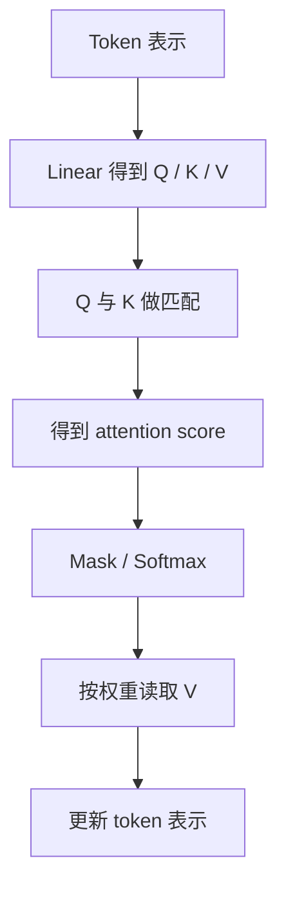
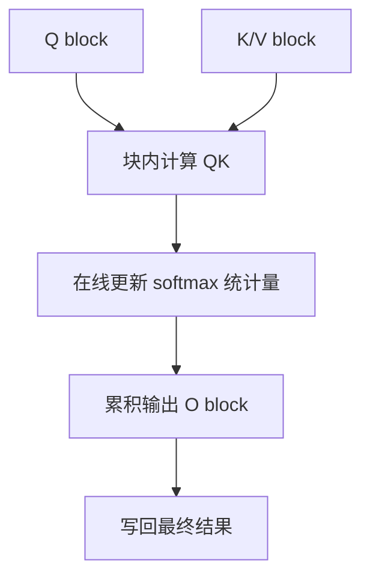

# Attention 机制与计算模式

Attention 的核心问题是：每个 token 在更新自己的表示时，应该读取哪些其他 token 的信息，以及这个读取过程如何高效执行。

一句话理解：

> Dense Attention、Sparse Attention 和 FlashAttention 讨论的是不同层面的问题：Dense/Sparse 主要决定“看哪些 token”，FlashAttention 主要决定“同样的 attention 计算如何更省显存、更快执行”。

这篇文章放在 Kernel、算子与编译优化章节里，因为 Dense、Sparse、FlashAttention 不只是模型结构名词，也直接决定 attention kernel 的计算量、访存模式、显存占用和硬件效率。

## 先回到 Attention 在算什么

在 Transformer 里，每个 token 会产生三类向量：

- Query，表示“我想找什么信息”。
- Key，表示“我这里有什么特征可被匹配”。
- Value，表示“如果别人关注我，我能提供什么内容”。

简化流程如下：



更具体一点，attention 会做三件事：

1. 用 Q 和 K 计算匹配分数。
2. 对分数做 mask 和 softmax，得到每个 token 应该关注谁。
3. 用这个权重加权求和 V，得到新的表示。

不同 attention 计算模式，主要差在第 1 步和第 2 步：哪些 Q/K 对会被计算，哪些位置会被 mask 掉，以及这些计算如何映射到 GPU。

## Attention Pattern 是什么

Attention pattern 描述“每个 token 能看哪些 token”。

在语言模型里，常见约束是 causal mask：第 `t` 个 token 只能看自己和它之前的 token，不能偷看未来。

例如生成第 5 个 token 时，可以看：

```text
token 1, token 2, token 3, token 4, token 5
```

不能看：

```text
token 6, token 7, ...
```

如果从矩阵角度看，attention score 是一个 `sequence_length x sequence_length` 的矩阵。矩阵里的一个格子表示“某个 query token 是否关注某个 key token”。

Dense Attention 和 Sparse Attention 的差别，就是这个矩阵里到底有多少格子需要计算。

## Dense Attention：全量注意力

Dense Attention 也可以叫 full attention、全量注意力或稠密注意力。它的意思是：在允许的 mask 范围内，每个 token 都可以关注所有相关 token。

对于双向编码器模型，例如 BERT 风格模型，一个 token 通常可以看整个输入序列。

对于因果语言模型，例如 GPT 风格模型，第 `t` 个 token 可以看前面所有 token 和自己。

可以用下图理解 causal dense attention：

```text
Query token 1: 看 1
Query token 2: 看 1, 2
Query token 3: 看 1, 2, 3
Query token 4: 看 1, 2, 3, 4
Query token 5: 看 1, 2, 3, 4, 5
```

它是“dense”的原因是：只要 causal mask 允许，位置之间都可以建立 attention 连接。

## Dense Attention 的成本

Dense Attention 的主要问题是序列长度越长，成本增长越快。

如果序列长度是 `n`，每个 token 都要和很多 token 做匹配，attention score 的规模大约是：

```text
n x n
```

也就是 `O(n^2)`。

这会带来两个问题。

第一是计算量。序列越长，QK 匹配和 attention weighted sum 的计算越多。

第二是显存和访存。如果直接把完整 attention score 或 softmax 矩阵写到显存，长序列时会产生大量 HBM 读写。

所以长上下文训练和推理里，Dense Attention 常常成为核心瓶颈。

## Dense Attention 的优点

Dense Attention 成本高，但它也有重要优点。

- 表达能力强，每个 token 都有机会读取任意上下文。
- 模型结构简单，训练和推理行为一致。
- kernel 和框架支持成熟。
- 对任务质量更稳，不需要提前假设哪些 token 重要。

很多主流 LLM 的基础 attention 仍然是 dense causal attention，只是在实现层面用 FlashAttention、KV Cache、PagedAttention、GQA/MQA 等方法优化系统成本。

因此不能简单说 Dense Attention 落后。它的缺点主要是成本高，而不是机制不合理。

## Sparse Attention：稀疏注意力

Sparse Attention 的思想是：不是每个 token 都看所有 token，而是只看一部分 token。

它改变的是 attention pattern。

例如，一个 token 只看附近窗口：

```text
token t 只看 t-2, t-1, t, t+1, t+2
```

或者只看某些全局 token、随机 token、固定间隔 token。

如果每个 token 只看 `w` 个 token，而不是看 `n` 个 token，那么 attention 成本可以从大约 `O(n^2)` 降到接近：

```text
O(n * w)
```

当 `w` 远小于 `n` 时，这对长序列很有吸引力。

## 常见 Sparse Attention Pattern

Sparse Attention 有很多形式。下面是常见几类。

| 模式 | 思想 | 适合直觉 |
| --- | --- | --- |
| Local / Sliding Window | 每个 token 只看附近窗口 | 语言和图像中局部信息很重要 |
| Global Tokens | 少数特殊 token 可以看全局，也被全局看到 | 分类 token、摘要 token、重要锚点 |
| Strided / Dilated | 按固定间隔看远处 token | 低成本获得长距离感受野 |
| Block Sparse | 把序列分块，只计算部分 block 之间的 attention | 更适合 GPU 上块状计算 |
| Random Sparse | 随机连接部分远距离 token | 增加全局连通性 |
| Learned / Dynamic Sparse | 根据内容动态决定看谁 | 更灵活，但系统实现更复杂 |

不同 sparse pattern 的质量和性能差异很大。不能只看复杂度公式，还要看模型是否适应这种模式，以及 kernel 是否真的高效。

## Sparse Attention 的收益和代价

Sparse Attention 的收益很直观：

- 降低 attention 计算量。
- 降低 attention score 显存需求。
- 支持更长上下文。
- 在某些任务中能把有限算力集中到更重要位置。

但代价也很明显：

- 模型看不到所有 token，可能损失质量。
- pattern 设计不当会漏掉关键远距离依赖。
- 训练和推理必须匹配，否则容易出现行为不一致。
- 动态稀疏会让 batching、kernel 和缓存管理更复杂。
- 理论复杂度降低，不代表 GPU wall-clock 一定更快。

最后一点很重要。GPU 擅长规则、密集、块状的大矩阵计算。如果 sparse pattern 很碎、很不规则，虽然计算次数少了，但硬件利用率也可能下降。

## Local / Sliding Window Attention

Sliding Window Attention 是最容易理解的一类 sparse attention。

每个 token 只看附近窗口，例如前后各 `w` 个 token。

```text
token 10 只看 token 6 ~ token 14
```

它适合处理局部依赖明显的序列。对于很长文档，邻近内容通常最相关，因此 local attention 可以显著减少成本。

但它的风险是远距离信息传递变慢。如果第 100 个 token 需要直接引用第 1 个 token，纯 sliding window 可能做不到，除非堆叠很多层，或者加入 global token、dilated pattern 等补充连接。

## Block Sparse Attention

Block Sparse Attention 把 attention 矩阵切成块，只计算某些块。

例如序列长度很长时，不再按单个元素决定是否计算，而是按 `block x block` 决定。

这样做的原因是 GPU 更喜欢块状计算。相比零散的 token 级稀疏，block sparse 更容易映射到高效 kernel。

可以把它理解为：

```text
不是问“这个 token 看不看那个 token”
而是问“这一块 token 看不看那一块 token”
```

Block sparse 常见于长上下文模型、稀疏 Transformer 变体和某些高性能 attention kernel 设计中。

## FlashAttention：不是 Sparse Attention

FlashAttention 经常和 sparse attention 混在一起讨论，因为它也能让 attention 更快、更省显存。但它们不是一类东西。

FlashAttention 的核心是：在不改变 dense attention 数学结果的前提下，用 IO-aware 的 tiling 方法减少 HBM 和片上 SRAM 之间的数据搬运，并避免把完整 attention 矩阵写回显存。

也就是说：

- Dense Attention / Sparse Attention 讨论“哪些位置参与 attention”。
- FlashAttention 讨论“同样的位置参与 attention 时，如何更高效地算”。

FlashAttention 默认是 exact attention。它不是通过少看 token 来省成本，而是通过更好的 kernel 算法和内存访问方式来省显存和提升速度。

## FlashAttention 为什么省显存

普通实现可能会显式生成 attention score 矩阵：

```text
QK^T -> attention scores -> softmax -> attention weights -> weights * V
```

当序列长度是 `n` 时，attention score 是 `n x n`。长序列下，这个矩阵很大。

FlashAttention 的做法是分块计算，并在块内维护 softmax 所需的中间统计量。它不需要把完整 attention 矩阵一次性存到 HBM。

简化理解：



这样做的收益是减少大规模中间矩阵的显存读写。对 GPU 来说，很多 attention 的瓶颈不是算术运算本身，而是数据在 HBM 和片上存储之间搬来搬去。

FlashAttention 的关键启发是：attention kernel 要关心 IO，不只是关心 FLOPs。

## FlashAttention、Dense、Sparse 的关系

三者关系可以这样看：

| 概念 | 改变 attention pattern 吗 | 是否近似 | 主要解决 |
| --- | --- | --- | --- |
| Dense Attention | 不改变，全量看允许位置 | 否 | 表达能力强，但成本高 |
| Sparse Attention | 改变，只看部分位置 | 通常是结构性近似 | 降低长序列计算和显存 |
| FlashAttention | 不改变默认 pattern | 否 | 降低 IO 和中间显存，提高 exact attention 执行效率 |

也可以这样记：

- Dense Attention 是“都看”。
- Sparse Attention 是“只看一部分”。
- FlashAttention 是“还是都看，但算得更聪明”。

## FlashAttention 与 PagedAttention 的区别

这两个名字都带 Attention，也都出现在推理系统里，但它们解决的问题不同。

| 概念 | 主要对象 | 解决问题 |
| --- | --- | --- |
| FlashAttention | attention kernel 计算过程 | 减少 attention 中间矩阵和 HBM IO |
| PagedAttention | KV Cache 显存管理 | 用 block/page 管理请求的 KV Cache，减少碎片和预留浪费 |

FlashAttention 关注“attention 这次怎么算更高效”。

PagedAttention 关注“历史 KV Cache 存在哪里、怎么分配、怎么共享、怎么释放”。

所以 PagedAttention 不是 sparse attention，也不是 FlashAttention。它们可以在同一个推理系统中配合出现。

## 训练和推理中的差异

Attention 在训练和推理中的系统压力不同。

### 训练

训练要做 forward 和 backward。Attention 不只要计算输出，还要为反向传播保存或重算中间状态。

训练中关注：

- attention forward 时间。
- attention backward 时间。
- activation 显存。
- sequence length 对显存的平方级压力。
- FlashAttention 是否支持 backward。
- sparse pattern 是否影响收敛和质量。

### 推理

推理尤其是自回归 Decode，会大量依赖 KV Cache。

推理中关注：

- Prefill 阶段长 prompt 的 attention 计算。
- Decode 阶段读取历史 KV Cache 的带宽压力。
- KV Cache 显存占用。
- PagedAttention / KV Cache block 管理。
- sliding window 是否能减少需要保留的 KV。
- FlashAttention 是否用于 Prefill 或批量 Decode。

因此，训练里的 attention 优化和推理里的 attention 优化不能完全混用。训练更关心 forward/backward 和 activation；推理更关心 Prefill、Decode、KV Cache 和在线调度。

## 对长上下文的影响

长上下文是 attention 优化最重要的场景之一。

序列长度从 4K 增加到 32K，不只是增加 8 倍 token。对于 dense attention 的某些计算和中间状态，压力可能接近平方级增长。

常见优化方向包括：

- 用 FlashAttention 降低 exact dense attention 的 IO 和中间显存。
- 用 sliding window 或 block sparse 降低 attention pattern 的规模。
- 用 GQA / MQA 降低 KV Cache 大小。
- 用 PagedAttention 降低 KV Cache 显存管理浪费。
- 用 sequence/context parallel 把长序列分到多 GPU。
- 用 activation checkpointing 降低训练 activation 显存。

这些方法解决的问题不同，通常可以组合使用。

## 什么时候用 Dense

Dense Attention 适合：

- 对质量要求高，不希望限制 token 间连接。
- 序列长度还在可承受范围内。
- 模型预训练就是 dense attention。
- 需要简单稳定的训练和推理行为。
- 有 FlashAttention 等高效 exact attention kernel 支持。

Dense Attention 的核心优势是稳。很多情况下，先把 dense exact attention 的实现优化好，比直接改成 sparse pattern 更可控。

## 什么时候考虑 Sparse

Sparse Attention 适合：

- 上下文很长，dense attention 成本不可接受。
- 任务天然有局部结构，例如长文档、视频、图像 patch 或时间序列。
- 可以接受或通过训练弥补 attention pattern 的限制。
- sparse pattern 能映射到高效 kernel。
- 模型架构从训练阶段就使用相同 sparse pattern。

不建议在没有验证的情况下，把 dense 模型推理时直接替换成 sparse attention。训练和推理不匹配，可能导致质量明显下降。

## 什么时候关注 FlashAttention

FlashAttention 适合：

- 仍然希望保持 exact attention。
- attention score 中间矩阵显存压力大。
- 长序列训练或 Prefill 成本高。
- GPU HBM IO 成为瓶颈。
- 框架和硬件已经支持对应 kernel。

如果系统瓶颈在 tokenizer、KV Cache 显存、网络、调度或工具调用，FlashAttention 不一定能解决问题。它主要优化 attention kernel 本身。

## 性能分析时看什么

分析 attention 相关性能时，不要只看理论复杂度。

建议同时看：

| 维度 | 要看什么 |
| --- | --- |
| 算法复杂度 | attention score 数量是否随 `n^2` 增长 |
| 显存 | 是否物化 `n x n` attention 矩阵，activation 占多少 |
| HBM IO | 是否频繁读写大中间矩阵 |
| Kernel 效率 | occupancy、tensor core 使用、warp divergence |
| Pattern 规则性 | sparse pattern 是否适合块状 GPU 计算 |
| 质量影响 | sparse pattern 是否影响任务效果 |
| 训练/推理一致性 | 训练 pattern 和推理 pattern 是否一致 |

对于长上下文模型，只看 FLOPs 往往不够。访存、缓存、通信和 kernel 实现会决定真实 wall-clock 性能。

## 常见误区

### 1. FlashAttention 是稀疏注意力

不是。FlashAttention 默认是 exact attention，它不靠少看 token 来近似，而是通过 IO-aware tiling 更高效地计算。

### 2. PagedAttention 是稀疏注意力

不是。PagedAttention 管理 KV Cache block。它改变 KV Cache 的存储和访问方式，不等于减少模型关注的历史 token。

### 3. Sparse Attention 一定更快

不一定。稀疏 pattern 如果不规则，GPU 利用率可能很差。理论计算量少，不代表实际运行更快。

### 4. Dense Attention 一定不能做长上下文

不准确。Dense Attention 成本高，但 FlashAttention、GQA/MQA、并行、显存优化和高端硬件可以把可用长度推高。只是成本仍然需要评估。

### 5. 只要 attention 快，模型就快

不一定。Transformer 还有 MLP、LayerNorm、embedding、sampling、通信、KV Cache、数据输入等环节。attention 只是重要瓶颈之一。

## 一个最小理解例子

假设序列长度是 8192。

Dense Attention 的直觉是：每个 token 都可以看前面所有 token。这样信息最完整，但 attention score 数量很大。

Sparse Attention 的直觉是：每个 token 只看附近 512 个 token，再加少量全局 token。这样成本低很多，但模型可能看不到某些远距离信息。

FlashAttention 的直觉是：仍然让每个 token 看所有允许的 token，但不要把完整 `8192 x 8192` 中间矩阵写到显存，而是分块算、边算边归一化、最后写回结果。

这三个方案解决的是不同问题：

- Dense：保证全量连接。
- Sparse：减少连接数量。
- FlashAttention：优化全量连接的执行方式。

## 学习路径建议

如果刚开始学习 attention 计算模式，可以按这个顺序：

1. 先理解普通 Q/K/V attention。
2. 再理解 causal mask 和 attention matrix。
3. 学习 Dense Attention 为什么是 `O(n^2)`。
4. 学习 Sparse Attention 如何改变 attention pattern。
5. 学习 FlashAttention 为什么是 IO-aware exact attention。
6. 最后区分 FlashAttention、PagedAttention、KV Cache、Prefix Cache 各自解决什么问题。

这样能避免把所有带 Attention 的名词混成一类。

## 小结

Dense Attention、Sparse Attention 和 FlashAttention 是理解高效 Transformer 的基础概念。

核心结论：

- Dense Attention 在允许范围内全量关注上下文，表达能力强，但长序列成本高。
- Sparse Attention 通过限制 attention pattern 降低成本，但可能影响质量，也不一定天然适合 GPU。
- FlashAttention 不改变 attention pattern，而是用 IO-aware kernel 更高效地计算 exact attention。
- PagedAttention 是 KV Cache 管理方法，不是稀疏注意力。
- 训练和推理中的 attention 瓶颈不同，优化方法要结合具体 workload。

对关注高效计算的人来说，真正重要的是分清楚：到底是在改模型能看的位置，还是在改同一计算的执行方式，还是在改 KV Cache 的存储管理。

## 参考资料

- [FlashAttention: Fast and Memory-Efficient Exact Attention with IO-Awareness](https://arxiv.org/abs/2205.14135)
- [Generating Long Sequences with Sparse Transformers](https://arxiv.org/abs/1904.10509)
- [Longformer: The Long-Document Transformer](https://arxiv.org/abs/2004.05150)
- [Big Bird: Transformers for Longer Sequences](https://arxiv.org/abs/2007.14062)
