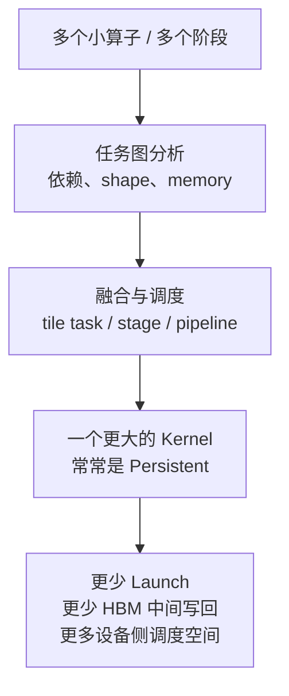
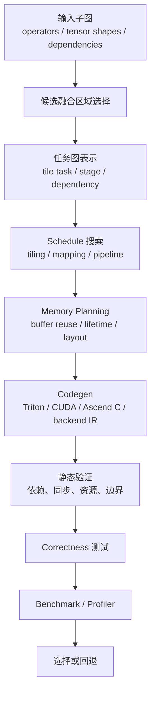

# MegaKernel、Persistent Kernel 与自动生成

MegaKernel 是把多个计算阶段、多个算子，甚至一段模型子图合并到一个更大的 kernel 中执行的思路。它常常和 persistent kernel 一起出现：kernel 启动后让一批 worker 长时间驻留在设备上，持续执行多个 tile task 或 operator stage。

如果只记一句话：

> MegaKernel 试图减少 kernel launch、减少中间结果反复写回 HBM，并暴露跨算子并行；persistent kernel 则让设备上的 worker 长驻，通过任务调度或静态 schedule 连续完成一段更大的计算。

这篇文章解释四件事：

- MegaKernel 和普通 fusion、CUDA Graph、persistent kernel 的区别。
- Persistent kernel 为什么对 LLM 推理、decode、小 batch、多小算子有吸引力。
- Triton MegaKernel 和 Ascend C MegaKernel-style 实现分别该怎么理解。
- MegaKernel 自动生成为什么是编译器问题，而不是简单代码拼接。

## 先分清几个概念

这些名词经常混在一起，需要先拆开。

| 概念 | 核心含义 | 解决的问题 | 不等于 |
| --- | --- | --- | --- |
| Operator fusion | 把相邻 op 合成一个 kernel | 减少中间 tensor 写回、减少 launch | 不一定跨很多算子，也不一定 persistent |
| CUDA Graph / Graph capture | 把一串 kernel launch 录制后复用 | 减少 CPU launch overhead | kernel 之间仍然通常是多个 kernel |
| Persistent kernel | kernel 启动后长驻执行多个任务 | 减少反复 launch，允许设备侧调度 | 不一定融合很多不同 op |
| MegaKernel | 把多个阶段或子图放进一个大 kernel | 减少 launch 和 HBM round trip，暴露跨 op 优化 | 不一定自动生成，也不一定总是更快 |
| Vendor fused op | 厂商库提供的融合实现 | 稳定高性能路径 | 不代表任意子图都可融合 |

一句话区别：

```text
fusion 关注“合并哪些计算”
persistent 关注“kernel 是否长驻执行”
MegaKernel 关注“把多大一段子图放进一个 kernel”
CUDA Graph 关注“多个 launch 如何被 runtime 更低成本地提交”
```

它们可以组合，但不是同一个东西。

## 为什么会出现 MegaKernel

传统深度学习执行里，一个模型层可能拆成多个 kernel：

```text
matmul
-> bias
-> activation
-> residual add
-> layer norm
-> attention pre/post processing
-> quant/dequant
```

每个 kernel 之间通常需要：

- 前一个 kernel 把结果写回 HBM。
- 后一个 kernel 再从 HBM 读回来。
- CPU 或 runtime 发起下一次 kernel launch。
- kernel 之间存在全局顺序边界。

当单个 kernel 计算很大时，launch overhead 可能不显眼；但在 LLM decode、小 batch、MoE routing、RAG/Agent 小请求、后处理、低延迟服务里，很多 kernel 可能都很短，launch overhead 和 HBM round trip 变得明显。

MegaKernel 的思路是：



目标不是追求“kernel 越大越好”，而是在合适场景减少调度和访存边界。

## Persistent Kernel 是什么

普通 kernel 通常是：

```text
启动 kernel
-> 所有 block 执行固定工作
-> kernel 结束
-> 启动下一个 kernel
```

Persistent kernel 更像：

```text
启动一批常驻 worker
-> worker 从任务队列或静态任务表取任务
-> 执行 tile / stage / operator fragment
-> 继续取下一个任务
-> 所有任务完成后 kernel 结束
```

这里的 worker 可以理解为 SM/CTA/warp 级别的执行单元，具体取决于实现。

Persistent kernel 的潜在收益：

- 减少多次 kernel launch。
- 让任务调度从 CPU/runtime 部分转移到 device。
- 对动态任务量或小任务更友好。
- 可以做跨 tile、跨 stage 的流水。
- 有机会减少中间结果落 HBM。

代价也很明确：

- kernel 更复杂。
- 资源长期占用，影响并发。
- 需要自己处理任务分配和同步。
- deadlock、race、memory ordering 风险更高。
- debug 和 profiler 归因更难。
- 不同硬件上的最佳策略差异大。

所以 persistent kernel 不是通用加速按钮，而是适合特定 workload 的系统设计。

## 为什么 LLM 推理会关注 Persistent Kernel

LLM 推理尤其 decode 阶段有几个特点：

- 每次只生成一个或少量 token。
- batch 可能动态变化。
- 单个请求的计算被很多层和很多小操作切开。
- KV Cache 访问、routing、sampling、logits 处理可能造成很多小 kernel。
- 在线服务关心 TTFT、TPOT、tail latency。

在这种情况下，多次 kernel launch、host/device 同步、global memory 中间读写，会对延迟产生明显影响。

Persistent kernel 或 MegaKernel 的吸引力在于：

- 把一段 decode 子图放到更少 kernel 中。
- 让设备侧持续执行 token/layer/tile 任务。
- 减少 CPU 参与频率。
- 对小 batch 和低延迟场景更可能有收益。

但训练阶段、大 batch prefill、标准大 GEMM 未必适合用 MegaKernel 替代成熟库。对于计算足够大的 kernel，cuBLAS、FlashAttention、CUTLASS、厂商库可能已经把硬件吃得很满，MegaKernel 反而可能因为资源压力更慢。

## MegaKernel 和普通 Fusion 的差异

普通 fusion 常见例子：

```text
add + relu
matmul + bias + gelu
layernorm 的多个 elementwise/reduction
```

这类 fusion 通常局部、边界清楚、容易验证。

MegaKernel 更激进：

- 可能跨多个算子类型。
- 可能跨多个 tile task。
- 可能包含 runtime 调度。
- 可能在一个 kernel 内管理多个阶段的依赖。
- 可能需要手动或自动做 memory planning。
- 可能需要处理动态 shape、动态路由或 sparse pattern。

可以把它看成更靠近“把一段子图编译成设备侧程序”，而不只是“把两个 elementwise 合并”。

## Triton MegaKernel 怎么理解

Triton 官方教程中有 persistent matmul 示例，展示了如何用 Triton 写 persistent kernel 形式的矩阵乘。这个例子说明：Triton 并不只能写一次性 block program，也可以表达更长驻、更调度化的执行方式。

Triton MegaKernel 可以按三层理解。

### 第一层：Persistent Matmul

Persistent matmul 的核心是让 program/CTA 以更持久的方式处理多个 tile，而不是每个 tile 都被简单静态分配后结束。

它适合讨论：

- tile task 怎么分配。
- worker 如何循环处理多个 tile。
- load/compute pipeline 如何设计。
- TMA、warp specialization 等硬件能力如何利用。

这还不一定是“完整模型子图 MegaKernel”，但它是理解 persistent kernel 的基础。

### 第二层：更大的 Fused Kernel

Triton 很适合把某些 epilogue 和前后处理融合进一个 kernel，例如：

- matmul + bias + activation。
- dequant + matmul。
- normalization + elementwise。
- attention 内部的 softmax、mask、scale、V 聚合。
- MoE dispatch/combine 附近的 packing 或 indexing。

这些 fused kernel 如果继续扩大，就会接近 MegaKernel 思路。

### 第三层：Triton 作为自动生成目标

TorchInductor 已经会生成 Triton kernel。更激进的编译器或研究系统，也可能把一段任务图 lowering 成 Triton 或 Triton-like IR，再自动生成 persistent / mega kernel。

这时 Triton 的角色不是手写语言，而是 codegen target 或中间 backend。

### Triton MegaKernel 的限制

Triton 的限制也要清楚：

- 跨 program 的全局同步能力有限。
- 一个 kernel 内的复杂控制流会增加编译和 debug 难度。
- register/shared memory 压力容易上升。
- shape 发散会带来大量 specialization。
- autotune 空间变大后成本很高。
- profiler 看到的是一个大 kernel，内部归因更难。

所以 Triton MegaKernel 更适合被严格 benchmark 驱动，而不是凭直觉扩大 fusion 范围。

## Ascend C MegaKernel-style 怎么理解

公开资料中，“Ascend C MegaKernel”并不像 Triton persistent matmul 那样有一个统一、标准、公开的教程名称。这里采用更谨慎的说法：Ascend C MegaKernel-style，是指在 Ascend C 编程模型上实现 MegaKernel 思路。

也就是：

```text
把多阶段算子或多算子链路
通过 Ascend C 的 tiling、数据搬运、片上存储和 kernel pipeline
合成更少 kernel 或更长的设备侧执行路径
```

Ascend C 相关资料里经常能看到两个重要部分：

- host-side tiling：在 host 侧根据 shape、硬件资源和算子参数生成 tiling 配置。
- device kernel：在设备侧按照 tiling 配置组织数据搬运、计算和 pipeline。

这和 MegaKernel 思路天然相关，因为 MegaKernel 需要解决：

- 多个阶段的 tile 如何划分。
- 每个阶段使用什么片上 buffer。
- 数据从 global memory 到片上再到计算单元如何流动。
- 哪些中间结果可以不写回全局内存。
- 多阶段之间如何同步和传递元数据。
- 不同 shape 下 tiling 参数如何选择。

但这里不能过度推断。更严谨的边界是：

- 可以讨论“在 Ascend C 上用 MegaKernel 思路做融合和长流水 kernel”。
- 不应该把它说成公开标准化的单一产品能力。
- 具体性能取决于 Ascend 硬件代际、CANN/编译器版本、算子形态、tiling 策略和 profiler 证据。

## Ascend C MegaKernel-style 的工程关注点

如果在 Ascend C 方向做 MegaKernel-style 实现，建议重点看这些问题。

### Host-side tiling

Host tiling 要决定：

- 每个阶段的 tile shape。
- 输入输出和中间 buffer 的大小。
- 哪些维度并行。
- reduction 如何拆分。
- 边界 tile 如何处理。
- shape/dtype/layout 变化如何生成不同配置。

MegaKernel 的 tiling 更难，因为多个算子共用同一套资源，不能只优化其中一个算子。

### Device-side pipeline

Device kernel 要组织：

- global memory 到片上内存的数据搬运。
- 计算单元执行。
- 多 buffer 轮转。
- 阶段之间的依赖。
- 写回策略。

如果 pipeline 设计不好，MegaKernel 可能只是把多个慢阶段塞进一个更难 debug 的 kernel。

### Memory planning

关键问题是中间结果是否真的省掉了 HBM round trip。

要记录：

- 哪些中间 tensor 不再写回 global memory。
- 哪些 buffer 被复用。
- 片上空间是否超限。
- 是否引入额外 copy 或 layout transform。
- 边界 shape 是否导致低效分支。

### Correctness

Ascend C 这类低层 kernel 需要非常严格的正确性测试：

- 多 shape。
- 多 dtype。
- 边界 tile。
- mask。
- reduction 误差。
- 对齐和 stride。
- 与 PyTorch 或参考算子对比。

MegaKernel 一旦出错，定位会比单算子更难。

## MegaKernel 自动生成为什么难

手写 MegaKernel 成本高，所以研究和工程上都会关注自动生成。

但自动生成不是简单把多个 kernel 源码拼接到一起。它至少要做这些事情：



每一步都可能失败。

候选融合区域太小，收益不明显。

融合区域太大，register/shared memory 超限。

schedule 太保守，性能不如多个成熟库 kernel。

memory planning 错，可能产生数据覆盖或 race。

动态 shape 和动态路由多，编译特化和验证成本上升。

profiler 只看到一个大 kernel，内部瓶颈归因困难。

## 自动生成系统常见方向

公开研究里，MegaKernel 自动生成大体有几类思路。

### 任务图编译

把模型子图拆成更细粒度的 task，例如 tile-level task 或 SM-level task，然后让编译器分析依赖并生成 persistent runtime。

代表思路是把一段推理计算变成设备侧任务图，kernel 内部调度这些任务。

这种方法的关键是：

- 任务粒度不能太粗，否则并行度不足。
- 任务粒度不能太细，否则调度开销过高。
- 依赖必须可验证。
- memory lifetime 必须清楚。

### Event / Dependency 表示

有些研究用 event tensor 或类似机制表达 tile task 之间的依赖。这样可以在一个 persistent kernel 里处理更动态的任务关系。

这类方法的价值是：比静态串行 fusion 更灵活，可以表达 producer/consumer、shape-dependent 或 data-dependent 的任务完成关系。

代价是：事件管理本身有开销，且正确性更难验证。

### MLIR / IR-based 自动生成

另一类方法把 MegaKernel 生成建模为 IR lowering 问题：

```text
高层子图
-> 细粒度 DAG
-> schedule IR
-> memory planning IR
-> backend codegen
```

这和 [MLIR 与 AI 编译 IR](mlir-ai-compiler-ir.md) 的关系很紧密。没有结构化 IR，自动生成很容易退化成脆弱的模板拼接。

### 面向 LLM 子图的自动生成

还有一些工作直接面向 Llama-family 或 Transformer block，把特定模型结构编译成一个或少数几个 persistent MegaKernel。

这种方法收益可能很高，但要注意适用边界：

- 模型结构是否固定。
- shape 是否固定。
- 是否支持不同 batch/sequence。
- 是否支持动态 KV Cache。
- 是否支持量化、MoE、多卡并行。
- 生成代码是否可验证、可回退。

## MegaKernel 的收益来源

收益通常来自四类。

### 减少 Launch

多个小 kernel 合成一个 kernel，减少 CPU/runtime launch 开销。

这对 decode、小 batch、在线服务尾延迟尤其有意义。

### 减少 HBM Round Trip

如果中间结果能留在 register/shared/local memory，而不是写回 HBM 再读回来，就可能显著降低 memory traffic。

这是 MegaKernel 最重要的收益之一。

### 暴露跨算子并行

普通 kernel 边界会强制阶段顺序。MegaKernel 内部可以更细粒度地调度 tile task，让不同阶段之间形成流水或交错执行。

### 设备侧调度

Persistent kernel 可以减少 CPU 参与，让 device worker 在 kernel 内继续取任务。这对动态任务、小任务、多请求混合有潜在价值。

## MegaKernel 的主要风险

### 资源压力

融合越大，寄存器、shared/local memory、code size、instruction cache 压力越高。资源压力上升可能导致 occupancy 下降，甚至比拆开的 kernel 更慢。

### 同步复杂

跨 tile、跨 stage 的依赖需要同步。如果同步不充分，会错；同步过多，会慢；同步顺序不当，可能 deadlock。

### 动态性

LLM 服务里 shape、batch、sequence、KV Cache 状态、MoE routing 都可能动态变化。MegaKernel 如果过度特化，会造成编译组合爆炸。

### Debug 困难

多个算子合在一个 kernel 里后：

- 错误定位更难。
- profiler 归因更难。
- 数值差异来源更难拆。
- 单独替换某个阶段更难。

### 可移植性

不同硬件后端的线程模型、片上内存、矩阵指令、同步能力、编译器能力都不同。MegaKernel 往往更依赖硬件细节，可移植性弱于高层图优化。

## 什么时候值得考虑 MegaKernel

适合优先评估：

- decode 小 batch 低延迟服务。
- 很多小 kernel 组成的后处理或路由链路。
- 中间 tensor 很大但生命周期很短。
- 端到端 profiler 显示 launch overhead 或 HBM round trip 明显。
- 标准库没有覆盖的 fused pattern。
- 某个固定 workload 反复执行，值得投入特化。

不适合优先评估：

- 标准大 GEMM 已经由 cuBLAS/CUTLASS/厂商库吃满。
- prefill 大 batch compute-bound，launch overhead 不明显。
- shape 非常发散，特化和 autotune 成本过高。
- 正确性风险不可接受。
- 没有稳定 benchmark 和 rollback 路径。

## Benchmark 方法

评估 MegaKernel 必须同时做 micro 和 end-to-end。

### Microbenchmark

记录：

- 单个 MegaKernel latency。
- 替代前多个 kernel 的总 latency。
- launch 数变化。
- HBM read/write bytes 变化。
- register/shared memory 使用。
- occupancy。
- Tensor Core 或矩阵单元利用率。
- compile/autotune 时间。

### End-to-end

推理场景至少看：

- TTFT。
- TPOT。
- tokens/s。
- request/s。
- p50/p95/p99。
- 显存峰值。
- 并发变化。
- 不同 prompt/output length。
- cache hit/miss 情况。

训练场景至少看：

- step time。
- tokens/s。
- MFU/HFU。
- 显存峰值。
- backward correctness。
- optimizer/checkpoint 交互。

### Ablation

要拆出收益来自哪里：

- 只减少 launch，不减少 HBM，收益多少。
- 只做 epilogue fusion，收益多少。
- 加 persistent 调度，收益多少。
- 改 tile/schedule，收益多少。
- 不同 batch/shape 下收益是否稳定。

如果不能解释收益来源，就很难维护。

## 设计决策表

| 问题 | 倾向选择 |
| --- | --- |
| 只是 Python 或 CPU launch overhead 高，但 kernel 本身已经很好 | 先看 CUDA Graph / runtime batching |
| elementwise/reduction 链路很多 | 先看 TorchInductor 或普通 fusion |
| 自定义 tile-heavy kernel | 先看 Triton、TileLang、CUTLASS |
| 多个小阶段反复读写 HBM | 评估 fused kernel 或 MegaKernel |
| decode 小 batch 多小任务 | 评估 persistent kernel |
| 固定模型子图长期高频运行 | 可研究自动 MegaKernel 生成 |
| 形状高度动态且缺少回退 | 谨慎使用 MegaKernel |

## 工程检查清单

做 MegaKernel 方案时，建议必须写清楚：

- 替代了哪些 kernel。
- 每个原始 kernel 的 latency 和 memory traffic。
- MegaKernel 内部阶段和依赖图。
- tile task 粒度。
- 调度方式：静态、队列、event、persistent worker。
- memory planning：哪些中间结果不再写回 HBM。
- 资源使用：register、shared/local memory、occupancy。
- 支持 shape/dtype/layout 范围。
- dynamic shape 和 fallback 策略。
- correctness 测试矩阵。
- profiler 证据。
- end-to-end 指标变化。
- 出问题时如何禁用或回滚。

## 与本章其他文章的关系

- [Attention 机制与计算模式](attention-computation-patterns.md)：MegaKernel 需要先理解 workload 形态，尤其 attention 的 Dense/Sparse/Flash/Paged 维度。
- [Triton Kernel 编程](triton.md)：Triton 是手写 persistent kernel 和自动生成 kernel 的重要路径之一。
- [TorchInductor 与 PyTorch 编译栈](torchinductor.md)：Inductor 代表 PyTorch 图编译与普通 fusion 路径，是 MegaKernel 的上游对照。
- [MLIR 与 AI 编译 IR](mlir-ai-compiler-ir.md)：解释自动生成 MegaKernel 所需的 IR 和 lowering 思想。
- [TileLang：面向 AI Kernel 的 Tile 编程模型](tilelang.md)：解释 tile、pipeline、tensorization 这些 MegaKernel 内部也必须处理的问题。

## 参考资料

- [Triton Persistent Matmul Tutorial](https://triton-lang.org/main/getting-started/tutorials/09-persistent-matmul.html)
- [MPK: A Compiler and Runtime for Mega-Kernelizing Tensor Programs](https://arxiv.org/abs/2512.22219)
- [Mirage Persistent Kernel GitHub](https://github.com/mirage-project/mirage)
- [Event Tensor: Efficient and Flexible Megakernel Compilation for Sparse and Dynamic Workloads](https://arxiv.org/abs/2604.13327)
- [Ada-MK: Adaptive LLM Inference Serving with Megakernels](https://arxiv.org/abs/2605.11581)
- [AutoMegaKernel: Automated Megakernel Generation for LLM Inference](https://arxiv.org/abs/2606.09682)
- [AscendOptimizer: Automated Program Optimization for Ascend Kernels](https://arxiv.org/abs/2603.23566)
- [AscendCraft: DSL-Guided LLM Generation of High-Performance CANN Kernels](https://arxiv.org/abs/2601.22760)
