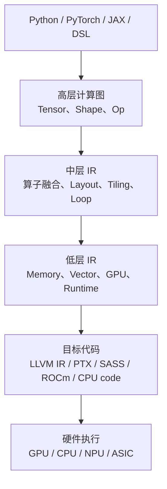

# MLIR 与 AI 编译 IR

MLIR 是 Multi-Level Intermediate Representation 的缩写。它不是某一个 AI 框架，也不是某一种硬件后端，而是一套用来构建编译器的中间表示和基础设施。

如果只记一句话：

> MLIR 的核心价值，是允许编译器在不同抽象层级上表达同一段计算：上层保留 tensor、shape、layout 等语义，下层逐步变成 loop、memory、vector、GPU、LLVM 或硬件相关指令。

这篇文章的目标不是教你写 MLIR pass，而是解释为什么 AI 编译器需要 IR，MLIR 的分层思想是什么，它和 TorchInductor、Triton、TileLang、MegaKernel 这些技术分别是什么关系。

## MLIR 在系统里的位置

AI 程序从模型代码到硬件执行，中间通常要经历多层表示：



MLIR 主要解决中间几层的问题：如何表示计算，如何逐步降低抽象，如何让优化 pass 在合适的层级工作。

例如，同一个 matmul 在不同层级可以被看成：

| 层级 | 看到的东西 | 适合做什么优化 |
| --- | --- | --- |
| 高层 tensor | `C = A @ B` | op fusion、shape 推导、layout 规划 |
| loop 层 | `for m/n/k` 循环 | loop tiling、loop interchange、parallel mapping |
| memory 层 | load/store 到 buffer | memory planning、buffer reuse、copy 消除 |
| vector/GPU 层 | vector op、thread/block、warp | 向量化、Tensor Core 映射、shared memory 规划 |
| 目标层 | LLVM/NVVM/ROCDL 等 | 指令选择、寄存器分配、目标后端 codegen |

如果只有一种 IR，要么太抽象，无法做硬件优化；要么太底层，早早丢掉 tensor 语义。MLIR 的名字里有 Multi-Level，就是为了解决这个问题。

## IR 是什么

IR 可以理解为编译器内部使用的“可分析、可变换、可生成代码”的程序表示。

普通模型代码像这样：

```python
y = torch.relu(x @ w + b)
```

人能看懂，但编译器如果要优化，需要知道更结构化的信息：

- 这里有哪些 op。
- 输入输出 tensor 的 shape、dtype、layout 是什么。
- 哪些 tensor 会被复用。
- 哪些 op 可以融合。
- 哪些循环可以并行。
- 哪些访存可以消除。
- 哪些部分必须保持原顺序。

IR 的作用就是把这些信息表达出来。

所以，IR 不是为了让人读起来更舒服，而是为了让编译器能够可靠回答问题：

```text
这段计算是否等价？
这个 op 能不能往前/往后移动？
这两个 op 能不能 fusion？
这个 tensor 是否必须真的写回 HBM？
这个 loop 能不能切 tile？
这个 tile 能不能映射到 thread block 或 Tensor Core？
```

## 为什么 AI 编译需要多层 IR

AI workload 的优化跨越很多层级。

高层优化关心：

- 模型图是否连续。
- 算子之间能否融合。
- shape 是否静态或可符号化。
- layout 是否需要转换。
- 哪些 op 可以换成高性能库调用。

中层优化关心：

- loop nest 如何组织。
- tile 大小如何选择。
- reduction 如何分块。
- memory buffer 如何复用。
- producer/consumer 是否可以合并。

低层优化关心：

- 线程、warp、CTA 如何分配。
- register 和 shared memory 是否超限。
- vector load/store 是否对齐。
- 是否能使用 Tensor Core。
- 是否产生 bank conflict、warp divergence 或 spill。

这些问题不能都放在同一个抽象层里解决。太早降到底层会丢失模型语义，太晚停在高层又无法控制硬件效率。

MLIR 的做法是允许编译器保留多个层级，并通过 lowering 逐步从高层走向低层。

## Dialect 是 MLIR 的核心概念

MLIR 里最重要的概念之一是 dialect。

可以把 dialect 理解成“某个领域的一组 IR 语义”。不同 dialect 可以定义自己的：

- operation。
- type。
- attribute。
- region。
- verification rule。
- lowering rule。

例如，一个编译器可以在高层使用 tensor / linalg 风格的表示，在中层使用 affine / scf / memref / vector，在低层使用 gpu / nvgpu / nvvm / rocdl / llvm 等表示。

这带来一个实际好处：

> 一个 AI 编译器不必从零开始定义所有 IR。它可以复用 MLIR 已有基础设施，同时为自己的 workload 或硬件增加专门 dialect。

这也是 MLIR 适合 AI 编译器、DSL、硬件后端的原因：AI 领域变化快，新的算子、新的 layout、新的数据类型、新的加速器都需要可扩展的表示方式。

## Lowering 是什么

Lowering 是把高层表示逐步转换成低层表示的过程。

一个简化例子：

```text
tensor matmul
-> linalg.matmul
-> tiled loop nest
-> bufferized memref load/store
-> vector / gpu operations
-> LLVM / target backend
```

每一步都应该尽量保持语义等价，但表达形式越来越接近硬件。

Lowering 不是简单翻译。它通常会伴随优化：

- fusion：把 producer 和 consumer 合并。
- tiling：把大矩阵切成适合 cache/shared memory/register 的块。
- vectorization：把标量循环改成向量操作。
- bufferization：把 tensor value 显式变成 memory buffer。
- layout conversion：改变内存排布以适配后端。
- canonicalization：简化 IR，消除冗余 op。
- specialization：根据 shape、dtype、target 生成专门路径。

所以看一个 MLIR pipeline，不只是看“从 A 变成 B”，更要看每个阶段保留了什么信息、丢弃了什么信息、引入了什么硬件约束。

## AI 编译器常见分层

不同项目的名字不一样，但 AI 编译器大体会遇到类似分层。

| 层级 | 典型内容 | 主要问题 |
| --- | --- | --- |
| Frontend graph | PyTorch FX、JAXPR、ONNX、StableHLO 等 | 程序能否被捕获，op 语义是否清楚 |
| Tensor / linalg IR | tensor op、linalg op、shape 信息 | fusion、shape 推导、layout 规划 |
| Loop / schedule IR | scf、affine、loop nest、tiling | 循环变换、并行策略、reduction 分解 |
| Memory IR | memref、buffer、copy、view | bufferization、memory planning、数据复用 |
| Vector / GPU IR | vector、gpu、nvgpu、amdgpu 等 | thread/block 映射、向量化、Tensor Core |
| Target IR | LLVM、NVVM、ROCDL、SPIR-V 等 | 目标代码生成和 runtime ABI |

对 AI Infra 工程师来说，最重要的不是背 dialect 名字，而是建立一个判断：

```text
当前优化问题应该在哪个层级解决？
```

如果问题是 graph break，就不该去调 GPU tile。

如果问题是 HBM 中间写回太多，就要看 fusion、layout 和 memory planning。

如果问题是 Tensor Core 利用率低，就要看低层 tiling、dtype、layout、指令映射和寄存器压力。

## MLIR 和 Triton 的关系

Triton 面向用户提供 Python DSL，但它内部也有编译 pipeline。Triton 程序通常会被转换到 Triton 自己的 IR，再逐步 lowering 到更接近 GPU 后端的表示。

学习 MLIR 对理解 Triton 有两个帮助。

第一，你能理解为什么 Triton 不是“直接把 Python 变 CUDA”。`tl.load`、`tl.dot`、block tensor、mask、program id 这些概念都会进入编译器 IR，然后经过优化和 lowering。

第二，你能理解为什么某些 Triton kernel 性能差异来自 codegen 层，而不只是 Python 代码层。例如：

- `BLOCK_M/N/K` 改变了 tile 形状。
- `num_warps` 改变了执行资源。
- `num_stages` 影响 pipeline 和 shared memory。
- dtype/layout 决定是否能走 Tensor Core。
- mask 和 pointer pattern 影响 vectorized load/store。

这些最终都会体现在 IR 和目标代码里。

## MLIR 和 TorchInductor 的关系

TorchInductor 的直接输入主要来自 PyTorch 编译栈捕获出的 FX/ATen 图。它会做 lowering、fusion、scheduler 和 codegen，GPU 路径常见输出是 Triton kernel。

因此，TorchInductor 不是“把 PyTorch 直接变成 MLIR 然后结束”的简单关系。更准确的理解是：

- TorchDynamo / FX / AOTAutograd 负责 PyTorch 前端捕获和图表示。
- TorchInductor 负责 PyTorch 图层面的 lowering、fusion、调度和代码生成。
- 生成的 Triton kernel 进入 Triton 自己的编译流程。
- Triton 编译流程内部会继续进入更低层 IR 和目标后端。

所以 MLIR 更像一类编译基础设施思想和底层工具链生态，而 TorchInductor 是 PyTorch 生态里的图编译后端。

排查 `torch.compile` 时，优先看 graph break、guards、generated code 和 Inductor scheduler；排查 Triton codegen 或目标指令质量时，才进一步进入 Triton/MLIR/LLVM 这类更低层视角。

## MLIR 和 TileLang 的关系

TileLang 这类 tile-oriented DSL 关注的是：如何用更贴近 AI kernel 的方式描述 tile、pipeline、layout、tensorization 和 schedule。

它和 MLIR 的关系可以这样理解：

```text
TileLang 更靠近“用户如何表达 tile kernel”
MLIR 更靠近“编译器如何承载和变换多层 IR”
```

一个 DSL 可以把自己的程序表示 lower 到 TVM、MLIR 或其他编译基础设施；也可以自己定义 IR 和 pass。关键不是名字，而是它是否有清晰的中间表示，能否表达 dataflow、schedule、memory 和 target constraints。

## MLIR 和 MegaKernel 的关系

MegaKernel 会把多个算子或多个阶段合成一个更大的 kernel，甚至用 persistent kernel 长时间驻留在设备上执行一段任务图。

这类优化需要比普通算子 fusion 更复杂的表示：

- 多个 operator 或 tile task 的依赖关系。
- 每个 tile 的 producer/consumer。
- buffer 生命周期和复用。
- 全局同步或事件依赖。
- 不同硬件资源上的任务分配。
- 形状、路由、动态分支带来的不确定性。

MLIR 或类似 IR 基础设施的价值，是提供一个比手写字符串拼接更可靠的承载方式：先把任务图、调度、memory planning 表示出来，再做验证、lowering 和 codegen。

所以 MegaKernel 自动生成不是“把很多 Python 代码粘成一个 kernel”。它更像编译器问题：需要 IR 表达、依赖分析、资源建模、正确性验证和代码生成。

## MLIR 能解决什么，不能解决什么

MLIR 能帮助解决：

- 多层抽象表示。
- 自定义 dialect。
- pass 管理和 pattern rewrite。
- verifier 和 canonicalization。
- lowering pipeline 组织。
- 不同编译项目之间复用基础设施。
- 给新硬件或新 DSL 提供可扩展路径。

但 MLIR 不能自动保证：

- 你的 schedule 一定快。
- 你的 fusion 一定减少端到端延迟。
- 你的 memory planning 一定不超显存。
- 你的动态 shape 一定不频繁 recompile。
- 你的后端 codegen 一定比库函数好。
- 你的数值行为一定与 eager baseline 完全一致。

IR 是优化的载体，不是性能的保证。真正的性能仍然要靠 workload 建模、benchmark、profiler、正确性测试和版本治理。

## 读 MLIR 或编译 IR 时看什么

刚开始读 IR 不要追求每个 op 都背下来。建议按问题读。

### 看语义是否还在

关注：

- tensor shape 是否清楚。
- dtype 是否正确。
- layout 是否显式。
- reduction 维度是否正确。
- mask、broadcast、reshape 是否保持语义。

如果高层语义已经错了，后面再优化也没有意义。

### 看 fusion boundary

关注：

- 哪些 producer/consumer 被合并。
- 哪些中间 tensor 仍然写回 memory。
- fusion 是否跨过 expensive op。
- 是否因为 shape、layout、alias、mutation 或 unsupported op 被迫断开。

### 看 memory

关注：

- 是否发生多余 copy。
- buffer 是否复用。
- layout transform 是否过多。
- intermediate tensor 是否过大。
- global memory 和 shared/local memory 边界在哪里。

### 看 loop 和 tile

关注：

- loop order 是否匹配 memory layout。
- tile size 是否适合 cache/shared memory/register。
- reduction 是否分块。
- parallel mapping 是否足够。
- 是否有很多 tail/mask 开销。

### 看 target lowering

关注：

- 是否生成目标后端支持的 op。
- 是否使用 Tensor Core 或矩阵指令。
- register/shared memory 是否超限。
- 是否出现 scalar fallback。
- 是否出现过多 synchronization。

## 常见误区

### 误区一：有 MLIR 就会自动高性能

MLIR 是基础设施，不是自动调优器。它提供表达和变换能力，但调度策略、代价模型、autotune、benchmark 仍然要做。

### 误区二：IR 越低层越有价值

低层 IR 能看硬件细节，但很多优化机会在高层才看得见。例如 op fusion、layout propagation、shape specialization。如果太早降到底层，反而可能丢失优化空间。

### 误区三：所有 AI 编译器都应该直接统一到一种 IR

现实里不同前端、后端、硬件和 workload 差异很大。统一 IR 的价值在于共享抽象和 pass，不是消灭所有项目自己的表示。

### 误区四：读 IR 就能替代 profiler

IR 可以解释“编译器打算怎么做”，profiler 才能证明“硬件实际怎么跑”。两者要结合。

## 工程检查清单

做 AI 编译或 IR 相关工作时，建议记录：

- 输入模型、shape、dtype、layout。
- frontend graph 是否完整捕获。
- 每个 lowering 阶段的 IR dump。
- fusion boundary 和 graph break 原因。
- bufferization 和 memory planning 结果。
- tile size、parallel mapping、vectorization 策略。
- 目标后端、driver、compiler 版本。
- 生成 kernel 数量和 launch 数量。
- correctness 对比方式和 tolerance。
- microbenchmark 与端到端 benchmark。
- profiler 证据：kernel time、memory bandwidth、occupancy、Tensor Core 使用率。

这些记录比单独保存一段 IR 更有用，因为性能问题通常跨越多层。

## 与本章其他文章的关系

- [Attention 机制与计算模式](attention-computation-patterns.md)：解释 attention workload 的计算模式，是编译和 kernel 优化的上游语义。
- [Triton Kernel 编程](triton.md)：解释如何手写或理解 block program 形式的 GPU kernel。
- [TorchInductor 与 PyTorch 编译栈](torchinductor.md)：解释 PyTorch 程序如何被捕获、融合、调度和生成 kernel。
- [TileLang：面向 AI Kernel 的 Tile 编程模型](tilelang.md)：解释 tile-oriented DSL 如何让 kernel schedule 更显式。
- [MegaKernel、Persistent Kernel 与自动生成](megakernel-persistent-automatic-generation.md)：解释更激进的跨算子、长驻 kernel 和自动生成路径。

## 参考资料

- [MLIR 官方网站](https://mlir.llvm.org/)
- [MLIR Dialects 官方文档](https://mlir.llvm.org/docs/Dialects/)
- [MLIR: A Compiler Infrastructure for the End of Moore's Law](https://arxiv.org/abs/2002.11054)
- [Triton 官方文档](https://triton-lang.org/main/index.html)
- [PyTorch torch.compile 文档](https://pytorch.org/docs/stable/torch.compiler.html)
