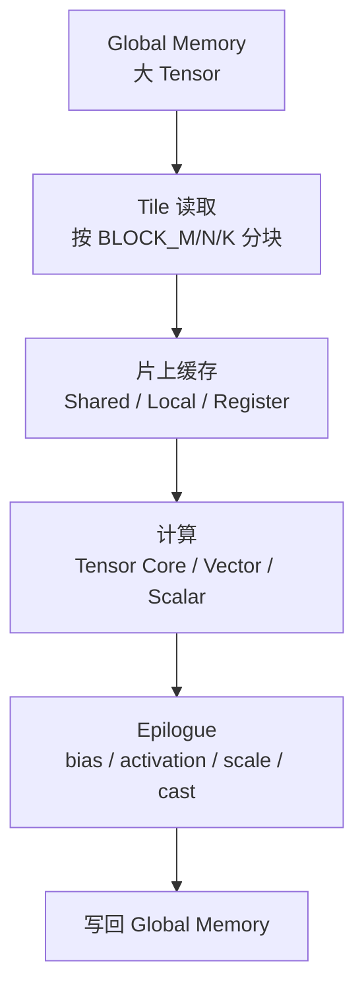

# TileLang：面向 AI Kernel 的 Tile 编程模型

TileLang 是面向高性能 AI kernel 的 tile-oriented 编程语言和编译工具。它试图让工程师用比 CUDA 更高层、比纯图编译更可控的方式描述 GEMM、Dequant GEMM、FlashAttention、LinearAttention、Sparse MM 等 kernel。

如果只记一句话：

> TileLang 把 AI kernel 的核心抽象放在 tile 上：程序员描述数据如何分块、搬运、流水和计算，编译器再把这些 tile 映射到线程、内存层次和目标硬件。

这篇文章关注 TileLang 的系统位置和思维模型，不追求覆盖全部语法。

## 为什么需要 Tile 编程模型

AI kernel 的性能很大程度上取决于数据块怎么搬、怎么复用、怎么落到硬件矩阵单元。

一个矩阵乘或 attention kernel 并不是简单做一次大矩阵运算。真实执行里会被切成很多 tile：



性能差异经常来自这些问题：

- tile 太小，计算单元吃不饱。
- tile 太大，register 或 shared memory 超限。
- 数据复用不足，反复访问 HBM。
- load/store 不连续，带宽打不满。
- pipeline 没有隐藏 memory latency。
- reduction 切分方式不适合 shape。
- epilogue 单独成 kernel，产生额外 launch 和 HBM round trip。

TileLang 这类 DSL 的目标，是让这些问题在程序层面更容易表达、组合和调优。

## Tile 是什么

Tile 可以理解为大 tensor 上的一小块计算区域。

例如 GEMM：

```text
C[M, N] = A[M, K] @ B[K, N]
```

不会一次让一个 kernel 实例处理完整 `M x N`。通常会把 `C` 切成很多 `BLOCK_M x BLOCK_N` 的输出 tile，每个输出 tile 再沿 `K` 维分块累加：

```text
for tile_m in M:
  for tile_n in N:
    acc = 0
    for tile_k in K:
      acc += A[tile_m, tile_k] @ B[tile_k, tile_n]
    C[tile_m, tile_n] = acc
```

这个伪代码看起来简单，但真正难点在于：

- `A` 和 `B` 的 tile 怎么从 HBM 搬到片上。
- 多个 tile 的 load 和 compute 怎么流水。
- 每个 tile 分给多少 warp/thread。
- 数据 layout 是否适合矩阵指令。
- 累加器放 register 是否够。
- 输出前是否融合 bias、activation、scale、quant/dequant。

TileLang 的价值就是让这些 tile 级决策成为一等概念，而不是藏在底层 CUDA 线程细节里。

## TileLang 在系统里的位置

可以把相关技术放在一条抽象轴上：

| 技术 | 更关注什么 | 典型使用者 |
| --- | --- | --- |
| PyTorch eager | 模型表达和灵活性 | 模型开发者 |
| TorchInductor | 自动图捕获、融合、代码生成 | PyTorch 系统工程师 |
| Triton | block program 形式的手写 GPU kernel | AI kernel 工程师 |
| TileLang | tile、schedule、pipeline、tensorization | kernel/compiler 工程师 |
| CUDA / HIP / Ascend C | 线程、内存、指令级控制 | 底层性能工程师 |
| CUTLASS / vendor library | 高度优化的库模板或黑盒实现 | 系统集成者 |

TileLang 不是替代所有路径，而是落在一个中间区域：

```text
想控制 tile 和 schedule，
但不想每次都手写完整低层 kernel。
```

## Dataflow 和 Schedule 要分开看

理解 TileLang 时，一个关键视角是区分 dataflow 和 schedule。

Dataflow 描述算什么：

```text
O = softmax(Q @ K^T) @ V
```

Schedule 描述怎么执行：

```text
把 Q/K/V 分成多大的 tile
每个 tile 由哪些线程处理
什么时候 load
什么时候 compute
是否 double buffering
是否 tensorize 到矩阵指令
是否 fused epilogue
```

很多 AI kernel 的数学公式很短，但 schedule 很复杂。FlashAttention 就是典型例子：数学上仍然是 exact attention，但为了减少 HBM IO，它把 Q/K/V 分块读入片上，边做 softmax 边维护统计量，避免完整 `S x S` attention matrix 写回显存。

TileLang 的意义，是让 dataflow 和 schedule 都能被表达，并且让 schedule 可以被编译器分析、变换和调优。

## TileLang 常见概念

不同版本和项目 API 会演进，但理解 TileLang 通常要抓住以下概念。

### Tile-based program

程序围绕 tile 展开，而不是围绕单个 scalar element 展开。

这接近 AI kernel 的真实优化单位。GEMM、attention、normalization、dequant、MoE grouped GEMM 都需要按 tile 组织计算和访存。

### Layout

Layout 决定 tensor 在内存中的排布，以及 tile 内元素如何对应到线程和指令。

不合适的 layout 会导致：

- load/store 不连续。
- bank conflict。
- 无法走矩阵指令。
- 多余 transpose 或 copy。
- 跨 tile 数据复用差。

TileLang 里 layout 不只是数据格式，它直接影响 schedule 和 codegen。

### Thread binding

Thread binding 决定 tile 内工作如何映射到 thread、warp、block 或硬件等价执行单元。

这类信息通常决定：

- 并行度。
- occupancy。
- 每个线程的寄存器压力。
- warp 内协作方式。
- 是否出现 divergence。

### Pipeline

Pipeline 关注 load、compute、store 的重叠。

简化地说，理想 kernel 不希望这样执行：

```text
load tile 0
compute tile 0
load tile 1
compute tile 1
```

而希望接近：

```text
load tile 1 的同时 compute tile 0
load tile 2 的同时 compute tile 1
```

这需要 double buffering、async copy、stage 管理和同步。TileLang 这类 DSL 会把 pipeline annotation 作为重要能力。

### Tensorization

Tensorization 是把一段小矩阵计算映射到硬件矩阵指令或专门 intrinsic。

例如 NVIDIA Tensor Core、AMD MFMA、某些 NPU Cube/Matrix 单元，本质上都要求程序以特定 tile、dtype、layout 进入硬件路径。

TileLang 关注 tensorization，是因为 AI kernel 的峰值性能通常来自这些矩阵单元，而不是普通 scalar ALU。

### Autotuning

TileLang 仍然需要 autotuning。

原因很直接：最佳 tile size、stage、warp 数、layout、unroll、split-k 策略会随 shape、dtype、硬件、driver、编译器版本变化。

所以一个严肃的 TileLang 工作流通常包括：

```text
正确性 baseline
-> 候选 schedule 空间
-> autotune
-> microbenchmark
-> profiler
-> 端到端验证
```

## 和 Triton 的差异

Triton 和 TileLang 都服务高性能 kernel，但思维重心不同。

| 维度 | Triton | TileLang |
| --- | --- | --- |
| 用户视角 | block program | tile dataflow + schedule |
| 常见表达 | `tl.load`、`tl.dot`、mask、program id | tile、layout、pipeline、tensorization、schedule annotation |
| 适合场景 | 自定义 GPU kernel、fused op、Inductor 后端代码 | GEMM/attention 等 tile-heavy kernel 的 schedule 探索 |
| 调优方式 | meta-parameter、autotune、手动重写 | schedule space、layout、pipeline、autotune |
| 抽象层级 | 比 CUDA 高，比图编译低 | 强调 tile 和 schedule 的中间层 |

两者不是非此即彼。可以这样选：

- 想快速写一个 fused elementwise/reduction/GEMM-like kernel，Triton 很自然。
- 想系统探索 tile、layout、pipeline、tensorization，TileLang 这类 DSL 更贴近问题。
- 已有 vendor library 明显更快，优先用库。
- 想从 PyTorch 自动生成，先看 TorchInductor。

## 和 TVM、MLIR 的关系

TileLang 官方资料中强调它构建在 TVM 编译基础设施之上，并提供 Pythonic 的 tile 编程方式。这里要分清三层：

| 层 | 作用 |
| --- | --- |
| DSL | 让工程师表达 kernel 和 schedule |
| IR / compiler infra | 承载、分析、变换和 lowering |
| Backend | 生成目标硬件代码并运行 |

TVM、MLIR 这类基础设施更偏编译器底座。TileLang 这类 DSL 更偏用户表达和 schedule 设计。

对研发人员来说，重要问题不是“名字属于哪一层”，而是：

- 能不能表达目标 kernel。
- 能不能控制关键 schedule。
- 能不能生成目标硬件可用代码。
- 能不能做正确性验证和性能回归。
- 能不能融入 PyTorch、serving 或 training runtime。

## 典型适用场景

TileLang 适合研究和实现这类 kernel：

- GEMM、batched GEMM、grouped GEMM。
- Dequant GEMM、weight-only quant matmul。
- FlashAttention、FlashMLA、LinearAttention。
- Sparse MM、block sparse attention。
- fused normalization、activation、epilogue。
- MoE dispatch/combine 附近的 tile 化计算。
- 需要探索新硬件后端或新 layout 的实验 kernel。

这些 workload 的共同点是：性能很依赖 tile 和数据复用。

## 不适合优先使用的场景

不建议一开始就用 TileLang 的情况：

- 标准算子已经由 cuBLAS、cuDNN、FlashAttention、CUTLASS 或厂商库很好覆盖。
- 端到端瓶颈不在该 kernel。
- shape 非常发散，schedule 特化收益不稳定。
- 团队还没有 correctness、benchmark、profiler、回归测试流程。
- 只是想减少 Python overhead，`torch.compile` 可能更合适。
- 需要复杂跨算子控制流和全局 runtime 调度，MegaKernel 或 runtime 层设计可能更相关。

TileLang 是性能研发工具，不是免 benchmark 的捷径。

## Benchmark 方法

评估 TileLang kernel 时，至少要同时看四层。

### 正确性

- 和 PyTorch eager 或 vendor library 对齐。
- 覆盖 dtype、shape、stride、mask、边界 tile。
- 明确 absolute/relative tolerance。
- 对 reduction、softmax、low-bit dequant 做数值误差分析。
- 对随机 shape 和极端 shape 做 stress test。

### Microbenchmark

- 预热和 steady-state 分开。
- 记录 compile/autotune 时间。
- 固定输入 shape、dtype、layout。
- 报告 latency、GB/s、TFLOPs、effective bandwidth。
- 和 vendor library、Triton、Inductor baseline 对比。

### Profiler

- 看 kernel launch 数量。
- 看 HBM 带宽。
- 看 Tensor Core 或矩阵单元使用率。
- 看 occupancy、register、shared memory、spill。
- 看 memory coalescing、bank conflict、warp stall。

### End-to-end

- 看训练 step time 或推理 TTFT/TPOT/吞吐。
- 看是否改变显存峰值。
- 看是否引入编译时延或缓存膨胀。
- 看不同 batch、sequence length、并发下是否稳定。

只看 microbenchmark 容易误判，因为一个 kernel 变快不一定让端到端变快。

## 学习路线

建议按这个顺序学习 TileLang 相关内容：

1. 先掌握 [Attention 机制与计算模式](attention-computation-patterns.md) 里的 Dense/Sparse/Flash Attention。
2. 再掌握 [Triton Kernel 编程](triton.md) 的 block program、tiling、mask 和 resource model。
3. 然后学习 tile、layout、pipeline、tensorization 的 schedule 思维。
4. 最后再看自动调优、IR lowering、跨硬件后端和 MegaKernel 生成。

这样不会一开始就陷入语法，而是知道每个抽象为什么存在。

## 工程检查清单

为一个 TileLang kernel 建档时，建议记录：

- kernel 语义：输入、输出、shape、dtype、stride、mask。
- baseline：PyTorch、vendor library、Triton 或 Inductor。
- tile 参数：block size、split-k、stage、warp/thread 映射。
- layout：输入、输出、中间 tile、shared/local memory layout。
- pipeline：stage 数、double buffering、async copy、同步点。
- tensorization：是否走矩阵指令，目标硬件是什么。
- autotune space：候选参数和筛选规则。
- correctness：测试 shape、tolerance、随机种子。
- microbenchmark：latency、throughput、带宽、重复次数。
- profiler：资源占用和 stall 原因。
- end-to-end：对训练或推理指标的影响。
- fallback：不支持 shape/dtype/hardware 时如何回退。

## 与本章其他文章的关系

- [MLIR 与 AI 编译 IR](mlir-ai-compiler-ir.md)：解释 IR 和 lowering 思想。
- [Triton Kernel 编程](triton.md)：解释更常用的 block program 手写 kernel 路径。
- [TorchInductor 与 PyTorch 编译栈](torchinductor.md)：解释 PyTorch 图编译如何自动生成 kernel。
- [MegaKernel、Persistent Kernel 与自动生成](megakernel-persistent-automatic-generation.md)：解释比单算子更激进的跨算子融合与长驻 kernel。

## 参考资料

- [TileLang 官方文档](https://tilelang.com/)
- [TileLang GitHub 仓库](https://github.com/tile-ai/tilelang)
- [TileLang: A Composable Tiled Programming Model for AI Systems](https://arxiv.org/abs/2504.17577)
- [TVM 官方文档](https://tvm.apache.org/docs/)
- [Triton 官方文档](https://triton-lang.org/main/index.html)
