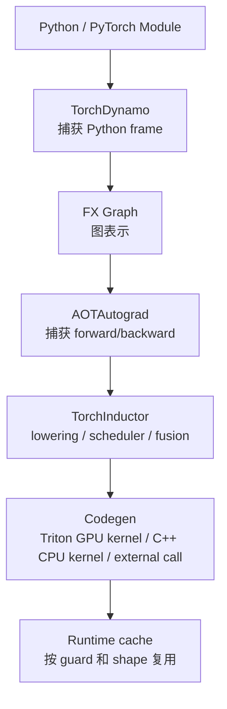

# TorchInductor 与 PyTorch 编译栈

PyTorch 2.x 的 `torch.compile` 把很多 eager execution 的 Python 调度、op 调用和中间 tensor 写回，交给编译栈尝试捕获、融合、调度和生成代码。TorchInductor 是这条编译路径里的默认后端之一。

如果只记一句话：

> `torch.compile` 不是一个单一优化开关，而是一条从 Python 程序到 FX Graph、AOTAutograd、TorchInductor、Triton/C++ kernel 的编译流水线；性能好坏取决于图能否被稳定捕获、是否 graph break、fusion 是否有效、动态 shape 是否可控、生成 kernel 是否适合真实 workload。

这篇关注系统理解，不追求覆盖所有 API。目标是让读者知道：PyTorch 编译栈到底在做什么，什么时候有效，什么时候失效，怎么诊断。

## 为什么需要编译栈

PyTorch eager 模式的优点是灵活：

```python
y = torch.relu(x @ w + b)
```

每一步都立即执行，Python 控制流自然可用，debug 直接。

但系统成本也明显：

- Python 调度开销。
- 多个小 op 触发多个 kernel launch。
- 中间 tensor 反复写入 HBM。
- op 之间缺少全局优化。
- layout transform 和 copy 可能不容易被消除。
- backward 图由 autograd 动态执行，优化空间有限。

编译栈试图把一段 Python/PyTorch 程序捕获成图，然后做：

- operator fusion。
- memory planning。
- layout planning。
- common subexpression / dead code 简化。
- Triton / C++ codegen。
- shape specialization。
- autotune。
- kernel launch 减少。

它的目标不是改变模型数学含义，而是让同样计算更少调度、更少访存、更适合硬件。

## 编译流水线总览

简化路径如下：



每一层都有自己的失败模式。

| 层 | 做什么 | 常见问题 |
| --- | --- | --- |
| TorchDynamo | 捕获 Python 执行为 FX Graph | graph break、guard 太多、Python 动态行为 |
| FX Graph | 表示被捕获的张量计算 | 图太碎、op 不支持、控制流不稳定 |
| AOTAutograd | ahead-of-time 捕获 forward/backward | backward graph 复杂、mutation、alias |
| TorchInductor | fusion、layout、调度、代码生成 | fusion 边界不理想、dynamic shape、layout copy |
| Triton/C++ codegen | 生成底层 kernel | block size 不佳、寄存器压力、compile time |
| runtime cache | 缓存编译结果 | recompile、guard miss、shape 多样 |

诊断 `torch.compile` 时，要先判断问题出在哪一层。

## TorchDynamo：捕获 Python 程序

TorchDynamo 是 `torch.compile` 的前端。它拦截 Python frame，分析 bytecode，把可捕获的 PyTorch tensor 计算提取成 FX Graph。

直觉：

```text
Python function
-> Dynamo observes execution
-> captures tensor ops into graph
-> inserts guards
-> graph sent to backend
```

Guards 用来保证下次运行仍然满足编译假设，例如：

- tensor dtype。
- tensor device。
- tensor rank。
- shape 关系。
- stride/layout。
- module attribute。
- Python 常量。
- control flow 分支条件。

如果 guard 不满足，就需要重新编译或回退。

## Graph Break

Graph break 是编译栈最常见问题。

它表示 Dynamo 无法把一段程序连续捕获成图，只能把图切开：

```text
graph 1 -> fallback/eager/Python -> graph 2
```

Graph break 的代价：

- fusion 被打断。
- kernel 数量增加。
- 中间 tensor 必须落地。
- Python 调度重新出现。
- 编译缓存变多。
- 性能不可预测。

常见 graph break 来源：

- Python side effect。
- 数据相关控制流。
- `.item()` 把 tensor 值拿回 Python。
- 不支持的 Python 内置或第三方库调用。
- 动态创建对象。
- mutation / alias 复杂。
- print/logging/debug 代码混在 forward 里。
- 不支持的 custom op。

例子：

```python
def f(x):
    s = x.sum()
    if s.item() > 0:
        return x * 2
    return x - 2
```

这里 `.item()` 和数据相关 `if` 会让捕获变难。因为分支依赖运行时 tensor 值。

## Fullgraph 模式

`torch.compile(..., fullgraph=True)` 要求整段函数捕获成单个完整图。如果出现 graph break，就报错。

它适合：

- 检查模型是否真的可编译。
- 在优化前暴露 graph break。
- 对关键模块做严格约束。

不适合：

- 一上来编译整个复杂训练脚本。
- 包含很多动态 Python 行为的代码。

实用做法：

1. 先对小模块使用 `fullgraph=True`。
2. 清理 graph break。
3. 再扩大到更大模型片段。
4. 最后做端到端 benchmark。

## Guard 与 Recompile

`torch.compile` 不是编译一次永久复用。它会根据 guard 判断当前输入是否匹配已有 compiled graph。

如果不匹配，就可能 recompile。

常见 recompile 原因：

- batch size 变化。
- sequence length 变化。
- stride/layout 变化。
- dtype 变化。
- module attribute 改变。
- Python 分支走向改变。
- list/dict 长度改变。
- tensor rank 变化。

训练中 recompile 会造成：

- warmup 时间变长。
- step time 抖动。
- cache 变大。
- 首次遇到新 shape 时延迟尖刺。

推理中 recompile 更危险，因为线上请求 shape 多样，可能造成尾延迟。

## Dynamic Shape

PyTorch 编译栈支持动态 shape，但动态不代表免费。

静态 shape 下，编译器可以针对具体大小做强优化：

- 更确定的 tile。
- 更少 guard。
- 更少边界逻辑。
- 更容易 fusion。

动态 shape 下，编译器需要生成能覆盖多个 shape 的代码：

- symbolic shape。
- 动态 guard。
- 更多 runtime 分支。
- 更保守的 layout 和 fusion。
- 更复杂的 codegen。

所以需要在“泛化”和“性能”之间取舍。

### 训练里的动态 shape

训练中常见动态来源：

- variable sequence length。
- packed sequence。
- variable batch。
- MoE 每个 expert token 数变化。
- 多模态输入尺寸变化。

处理策略：

- bucketing，把 shape 分到少数桶。
- padding 到固定或少数固定长度。
- 对核心模块做 shape specialization。
- 对动态模块局部保持 eager。
- 编译前统计真实 shape 分布。

## AOTAutograd：捕获 forward/backward

训练不只有 forward，还要 backward。

AOTAutograd 会 ahead-of-time 捕获 autograd 需要的 forward 和 backward 图，让后端可以一起优化训练计算。

它解决的问题：

- eager autograd 动态执行难以全局优化。
- forward/backward 之间可以做 partition。
- activation 保存和重计算策略可以被图层面处理。
- backward 也可以由 Inductor 生成 kernel。

常见难点：

- mutation。
- alias。
- view/in-place。
- custom autograd。
- dynamic control flow。
- activation checkpointing。

训练模式下 `torch.compile` 的收益和风险都比推理更复杂，因为 backward、optimizer、FSDP/ZeRO、AMP、checkpointing 都可能参与。

## TorchInductor：默认后端

TorchInductor 是 PyTorch 编译栈里的后端。它接收 FX/AOTAutograd 图，做 lowering、fusion、scheduler、memory planning，然后生成代码。

GPU 上常见生成 Triton kernel，CPU 上常见生成 C++/OpenMP code。它也会调用外部库，比如 matmul 走 cuBLAS 或其他 vendor library。

Inductor 的工作可以简化为：

```text
graph
-> decompose ops
-> choose fusion groups
-> plan layouts/buffers
-> schedule loops/kernels
-> generate Triton/C++/external calls
-> compile/cache
```

## Operator Decomposition

有些高层 op 会被拆成更底层 op。

例如一个复合 op 可能被 decomposed 成：

```text
aten.foo -> aten.add + aten.mul + aten.sum
```

好处：

- 低层 op 更容易 fusion。
- 后端只需要支持更少 primitive。
- backward 也更容易统一处理。

风险：

- decomposition 后图变大。
- 如果不能 fusion，可能生成更多 kernel。
- 数值行为或 dtype promotion 要小心。

分析性能时，要看最终 graph 和生成 kernel，而不是只看源码里写了几个 PyTorch op。

## Fusion

Fusion 是 Inductor 最重要的优化之一。

典型收益：

```text
eager:
  op1 writes intermediate
  op2 reads intermediate
  op2 writes another intermediate
  op3 reads another intermediate

fused:
  load once
  compute op1/op2/op3 in one kernel
  store final output
```

适合 fusion：

- elementwise chain。
- reduction + elementwise。
- bias + activation。
- dropout + residual。
- normalization 周边。
- optimizer update。

不一定适合 fusion：

- 大 GEMM 主体。
- 外部库调用。
- fusion 后寄存器压力太高。
- fusion 后 layout 变差。
- dynamic shape 过复杂。

Fusion 的目标不是 kernel 数量越少越好，而是减少关键路径上的访存和 launch，同时不破坏硬件利用率。

## Layout Planning

Inductor 不只是融合 op，也会考虑 layout。

Layout 包括：

- stride。
- contiguous。
- channels-last。
- transposed。
- view。
- reshape。
- memory format。

如果 layout planning 不好，可能出现：

- 多余 `contiguous()`。
- 隐式 copy。
- 转置后再转回。
- 生成 kernel 访问不连续。
- fusion 被 layout 边界切断。

很多 `torch.compile` 性能问题，表面看是 kernel 慢，实际是 layout transform 多。

## Memory Planning

Eager 模式里，中间 tensor 通常由 allocator 动态分配和释放。

编译后，Inductor 可以做 buffer reuse 和 memory planning：

- 不再需要的中间 buffer 可复用。
- 多个临时 tensor 生命周期不重叠时复用内存。
- fusion 后中间 tensor 不落地。
- 减少 allocator 开销。

这对训练很重要，因为 activation、temporary buffer 和 optimizer 临时状态都可能推高 peak memory。

但 memory planning 也受限于：

- graph break。
- alias。
- in-place mutation。
- view 关系。
- dynamic shape。

## Codegen：Triton、C++ 与外部库

Inductor 不会把所有东西都生成 Triton。

常见路径：

- GPU elementwise/reduction/fusion -> Triton kernel。
- 某些 matmul/conv -> 外部库，例如 cuBLAS/cuDNN。
- CPU path -> C++/OpenMP。
- 不支持或不值得编译的部分 -> fallback。

所以分析时要看生成代码：

- 有几个 Triton kernel？
- 哪些 op 被 fusion 到同一个 kernel？
- 哪些 op 走外部库？
- 是否有多余 copy kernel？
- Triton block size、num warps、num stages 如何？

理解 Triton 能帮助你判断 Inductor 生成的 kernel 是否合理。

## Compile Time、Warmup 与 Cache

`torch.compile` 常见现象是：

```text
first iteration slow
later iterations faster
```

原因：

- 捕获图。
- 编译 graph。
- 生成代码。
- 编译 Triton/C++。
- autotune。
- 写入/读取 cache。

训练 benchmark 必须区分：

```text
compile/warmup time
steady-state runtime
end-to-end wall-clock
```

如果训练只跑很少 step，编译成本可能吃掉收益。

如果是在线推理，冷启动和 recompile 会影响 tail latency。

## Modes 和 Options

`torch.compile` 有一些常用参数：

```python
compiled_model = torch.compile(
    model,
    backend="inductor",
    mode="default",
    fullgraph=False,
    dynamic=None,
)
```

常见 `mode` 包括：

- `default`：平衡编译时间和运行性能。
- `reduce-overhead`：尝试减少 Python overhead，常和 CUDA graph 等策略相关。
- `max-autotune`：更多 autotune，可能运行更快但编译更慢。

具体模式行为会随 PyTorch 版本演进。工程上要记录 PyTorch 版本和 compile 参数，不要只写“开了 compile”。

## 与训练系统的关系

### AMP / 混合精度

`torch.compile` 要和 autocast、BF16/FP16/FP8 配合。

注意：

- dtype promotion 是否符合预期。
- reduction 是否保留高精度。
- generated kernel 是否使用 Tensor Core。
- AMP 上下文是否包住 compiled region。
- GradScaler 是否影响 graph capture。

### FSDP / ZeRO

FSDP/ZeRO 会插入 all-gather、reduce-scatter、reshard、optimizer state sharding 等行为。

与 compile 组合时要关注：

- 编译区域是否跨过分布式通信边界。
- FSDP wrap 粒度是否导致图过碎。
- all-gather 前后的 tensor layout 是否稳定。
- dynamic shape 或 parameter materialization 是否触发 recompile。
- checkpoint/resume 后 compiled cache 是否仍有效。

### Activation Checkpointing

Activation checkpointing 会改变 forward/backward 图和 activation 保存策略。

与 compile 组合时：

- 重算区域是否能被捕获。
- RNG 是否正确。
- graph break 是否出现在 checkpoint boundary。
- 重算增加的 FLOPs 是否被 fused kernel 抵消。

### Optimizer

Optimizer step 也可能被编译或使用 fused implementation。

需要区分：

- model forward/backward compile。
- optimizer compile。
- fused optimizer。
- foreach optimizer。
- distributed optimizer。

对 AdamW、Muon 等 optimizer，编译收益和风险不同。Muon 这类矩阵级 optimizer 更可能涉及额外 matmul 和 shape 特化。

## 与推理系统的关系

推理中 `torch.compile` 常用于：

- 小模型服务。
- 固定 shape batch。
- fused post-processing。
- embedding / rerank / encoder workload。
- 某些自定义 decode 组件。

LLM decode 场景要谨慎：

- batch 动态变化。
- sequence length 逐 token 增长。
- KV Cache layout 复杂。
- continuous batching 改变 shape。
- graph break 和 recompile 会影响尾延迟。

有些 serving engine 会用更专门的 runtime、CUDA graph、Triton kernels 或 vendor library，而不是直接依赖普通 `torch.compile` 包住整个模型。

## Debug 工具

### TORCH_LOGS

PyTorch 官方建议用 `TORCH_LOGS` 查看 graph break、recompile、dynamic shape 等信息。

常见：

```bash
TORCH_LOGS=graph_breaks python train.py
TORCH_LOGS=recompiles python train.py
TORCH_LOGS=dynamic python train.py
```

这些日志适合回答：

- 哪一行触发 graph break？
- 为什么 recompile？
- 哪些 shape 被认为动态？
- guard 失败原因是什么？

### torch._dynamo.explain

可以用 `torch._dynamo.explain` 查看捕获情况、graph break 和 guard 信息。

适合本地调试小模块，不适合大规模长期训练一直开。

### tlparse

PyTorch 编译文档介绍了 `tlparse` 工具，可以解析 `TORCH_TRACE` 产生的编译 trace，并生成 HTML 报告。

概念流程：

```bash
TORCH_TRACE=/tmp/tracedir python train.py
tlparse /tmp/tracedir
```

它适合：

- 看哪些 frame 被编译。
- 看 graph break。
- 看编译错误。
- 看 guard/recompile。
- 排查大模型复杂编译行为。

注意 trace 里可能包含源码片段，不要随便上传包含敏感代码的 trace。

### Generated Code

调试性能时要看生成代码。

关注：

- 生成多少个 kernel。
- 是否出现意外 copy。
- fusion group 是否符合预期。
- Triton block size、num warps。
- 是否调用外部库。
- 是否有 fallback。

不同 PyTorch 版本调试生成代码的环境变量和缓存路径可能变化，要以当前官方文档为准。

## Profiling 方法

### 先做 eager baseline

不要直接开 compile 然后看快慢。

先记录：

- eager step time。
- eager memory。
- eager kernel count。
- eager profiler trace。
- eager loss correctness。

### 再做 compiled benchmark

记录：

- compile time。
- warmup steps。
- steady-state step time。
- recompile 次数。
- kernel count。
- memory peak。
- correctness。

### 再看 profiler

用 PyTorch profiler / Nsight Systems 看：

- graph break 位置是否对应 Python gap。
- kernel 数量是否减少。
- fused kernel 是否占主要时间。
- matmul 是否仍走高效库。
- layout copy 是否增加。
- compile 后是否出现同步点。

### 端到端验证

最后必须回到：

- tokens/s。
- step time。
- latency。
- peak memory。
- p99。
- time to target。
- 成本。

局部 op 快不等于系统快。

## 一个排查流程

遇到 `torch.compile` 没变快，可以按这个顺序：

1. 确认是否真的调用了 compiled model。
2. 用 `TORCH_LOGS=graph_breaks` 看 graph break。
3. 用 `TORCH_LOGS=recompiles` 看是否频繁 recompile。
4. 对小模块用 `fullgraph=True` 暴露问题。
5. 检查 input shape 是否过于动态。
6. 查看 generated code 或 tlparse 报告。
7. 用 profiler 看 kernel 数量、layout copy、CPU gap。
8. 对比 eager、compiled、手写 Triton、vendor library。
9. 只对收益明确的模块保留 compile。

这个流程比盲目切换 mode 更可靠。

## 常见优化方向

### 减少 Graph Break

做法：

- 把 debug/logging 移出 forward。
- 避免 `.item()` 参与 Python 分支。
- 减少数据相关控制流。
- 用 tensor operation 替代 Python loop。
- 给 custom op 添加可编译路径。
- 对不可编译部分明确局部 eager。

### 控制 Shape 多样性

做法：

- sequence bucketing。
- padding 到少数固定长度。
- 固定 batch。
- 对动态模块单独处理。
- 对常见 shape 预热编译。

### 改善 Fusion

做法：

- 消除不必要 view/copy。
- 避免中间 tensor 被 Python 使用。
- 合并小 op。
- 保持 layout 稳定。
- 检查 generated kernel。

### 降低 Compile 成本

做法：

- 缩小 compiled region。
- 预热常见 shape。
- 使用 cache。
- 避免频繁 recompile。
- 慎用 `max-autotune`。

### 保留强库路径

不要为了“全图编译”破坏成熟库。

例如：

- 大 GEMM 继续走 cuBLAS。
- attention 继续用 FlashAttention。
- conv 继续用 cuDNN。
- 特殊高性能 kernel 不要被低效 fusion 替代。

编译优化要尊重已有高性能库。

## 常见误区

### 误区一：`torch.compile` 是免费加速

不是。它有编译成本、recompile 风险、graph break 风险和调试成本。

### 误区二：编译整个训练脚本最好

通常不对。先编译稳定、计算密集、图结构清晰的模块。数据读取、日志、checkpoint、复杂 Python 控制流不适合放进 compiled region。

### 误区三：没有报错就说明编译有效

不一定。可能 graph break 很多，只编译了很小片段；也可能 recompile 频繁；也可能生成 kernel 不是瓶颈。

### 误区四：dynamic shape 一定比多次编译好

不一定。动态 shape 更泛化，但可能牺牲性能。少量 shape bucket + specialization 经常更实用。

### 误区五：kernel 数量越少越好

不一定。过度 fusion 可能增加寄存器压力、降低 occupancy，或者让原本高效库路径变差。

## 设计检查清单

引入 `torch.compile` 前，确认：

- 编译目标是训练、推理还是局部算子？
- eager baseline 是什么？
- 是否有正确性对比？
- 编译区域边界在哪里？
- 是否存在 graph break？
- 是否频繁 recompile？
- shape 分布是什么？
- dynamic shape 策略是什么？
- 是否和 AMP/FSDP/activation checkpointing/optimizer 组合？
- 编译成本是否可接受？
- 生成 kernel 是否减少了关键路径时间？
- 是否保留了 cuBLAS/cuDNN/FlashAttention 等强库路径？
- profiler 证据是否支持保留 compile？
- 是否记录 PyTorch/CUDA/Triton 版本和 compile 参数？

## 小结

TorchInductor 与 PyTorch 编译栈的价值，不是“打开一个开关”，而是把 Python/PyTorch 程序转成可优化图，再通过 fusion、layout、memory planning 和 codegen 降低系统成本。

关键结论：

- TorchDynamo 负责捕获 Python frame，graph break 是第一类问题。
- Guards 和 recompile 决定 compiled graph 能否稳定复用。
- AOTAutograd 让训练 forward/backward 也能进入 ahead-of-time 优化。
- TorchInductor 负责 lowering、fusion、scheduler、memory planning 和 Triton/C++ codegen。
- Dynamic shape、layout、mutation、distributed runtime 都会影响编译效果。
- Debug 要用 `TORCH_LOGS`、`torch._dynamo.explain`、tlparse、generated code 和 profiler 证据。
- 最终判断标准是端到端 step time、tokens/s、latency、显存和稳定性。

用好 `torch.compile` 的关键，是把它当成可观测、可验证、可局部使用的编译系统，而不是黑盒加速按钮。

## 参考资料

- [PyTorch: torch.compile](https://docs.pytorch.org/docs/2.12/generated/torch.compile.html)
- [PyTorch: torch.compiler User Guide](https://docs.pytorch.org/docs/2.12/user_guide/torch_compiler/torch.compiler.html)
- [PyTorch: Programming Model](https://docs.pytorch.org/docs/2.12/user_guide/torch_compiler/compile/programming_model.html)
- [PyTorch: Common Graph Breaks](https://docs.pytorch.org/docs/2.12/user_guide/torch_compiler/graph_breaks.html)
- [PyTorch: Dynamic Shapes](https://docs.pytorch.org/docs/2.12/user_guide/torch_compiler/dynamic_shapes.html)
- [PyTorch: TorchInductor and torch.compile GPU Profiling](https://docs.pytorch.org/docs/2.12/user_guide/torch_compiler/torch.compiler_inductor_profiling.html)
- [PyTorch: tlparse / TORCH_TRACE](https://docs.pytorch.org/docs/2.12/user_guide/torch_compiler/torch.compiler_troubleshooting.html)
