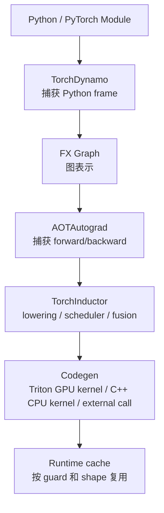

# TorchInductor 与 PyTorch 编译栈

PyTorch 2.x 的 `torch.compile` 把很多 eager execution 的 Python 调度、op 调用和中间 tensor 写回，交给编译栈尝试捕获、融合、调度和生成代码。TorchInductor 是这条编译路径里的默认后端之一。

如果只记一句话：

> `torch.compile` 不是一个单一优化开关，而是一条从 Python 程序到 FX Graph、AOTAutograd、TorchInductor、Triton/C++ kernel 的编译流水线；性能好坏取决于图能否被稳定捕获、是否 graph break、fusion 是否有效、动态 shape 是否可控、生成 kernel 是否适合真实 workload。

这篇关注系统理解，不追求覆盖所有 API。目标是让读者知道：PyTorch 编译栈到底在做什么，什么时候有效，什么时候失效，怎么诊断。

## 编译栈在系统里的位置

`torch.compile` 位于模型代码和底层执行后端之间。它不是替代 CUDA、Triton、cuBLAS、FlashAttention 或 serving engine，而是尝试把 PyTorch 程序中适合优化的区域捕获成图，再交给后端优化。

可以按三层理解：

| 层 | 关注点 | 典型问题 |
| --- | --- | --- |
| 模型代码层 | Python、Module、forward、控制流 | 代码能不能稳定被捕获 |
| 编译图层 | FX Graph、AOTAutograd、guards、dynamic shape | 图是否连续、是否频繁 recompile |
| 后端执行层 | Inductor、Triton、C++、外部库、CUDA Graph | 生成 kernel 是否真的更快 |

所以排查 `torch.compile` 时，不能只看“开了没有”，而要问：

- 哪段代码被编译了？
- 编译结果是否被复用？
- 哪些部分回退到了 eager？
- 生成了哪些 kernel 或外部库调用？
- 编译成本是否被 steady-state 收益覆盖？
- 端到端指标是否改善？

这篇文章的核心视角是：`torch.compile` 是一个可观测、可局部使用、需要版本和 shape 治理的编译系统。

## 为什么需要编译栈

PyTorch eager 模式的优点是灵活：

```python
y = torch.relu(x @ w + b)
```

每一步都立即执行，Python 控制流自然可用，debug 直接。

但系统成本也明显：

- Python 调度开销。
- 多个小 op 触发多个 kernel launch。
- 中间 tensor 反复写入 HBM。
- op 之间缺少全局优化。
- layout transform 和 copy 可能不容易被消除。
- backward 图由 autograd 动态执行，优化空间有限。

编译栈试图把一段 Python/PyTorch 程序捕获成图，然后做：

- operator fusion。
- memory planning。
- layout planning。
- common subexpression / dead code 简化。
- Triton / C++ codegen。
- shape specialization。
- autotune。
- kernel launch 减少。

它的目标不是改变模型数学含义，而是让同样计算更少调度、更少访存、更适合硬件。

## 什么时候值得用 torch.compile

`torch.compile` 适合先从“稳定、重复、计算密集”的区域开始。

值得尝试：

| 场景 | 原因 |
| --- | --- |
| elementwise/reduction 很多的小模块 | fusion 和减少 launch 可能收益明显 |
| 形状稳定的训练模块 | guard 命中率高，编译结果可复用 |
| encoder、reranker、vision backbone | batch/shape 通常比 LLM decode 更稳定 |
| optimizer 或后处理小算子 | 减少 Python overhead 和 kernel 数量 |
| 模型里存在大量 PyTorch eager 小 op | 编译器更容易把调度成本降下来 |

不建议一开始就全局套：

| 场景 | 风险 |
| --- | --- |
| 数据读取、日志、checkpoint 逻辑 | Python side effect 多，收益低 |
| shape 高度发散的在线请求 | recompile 和 tail latency 风险高 |
| 已经由高性能库主导的路径 | 可能没有额外收益 |
| 复杂分布式 runtime 边界 | all-gather、reshard、通信调度会改变图边界 |
| debug 频繁变化的实验代码 | 编译缓存和 graph break 会干扰迭代 |

推荐顺序：

```text
先确认 eager baseline
-> 选择局部稳定模块
-> 用 fullgraph 暴露 graph break
-> 清理或隔离不可编译代码
-> 做 correctness 对比
-> 测 steady-state 性能
-> 再决定是否扩大 compile 区域
```

这比“把整个训练脚本包进去”更可靠。

## 编译流水线总览

简化路径如下：



每一层都有自己的失败模式。

| 层 | 做什么 | 常见问题 |
| --- | --- | --- |
| TorchDynamo | 捕获 Python 执行为 FX Graph | graph break、guard 太多、Python 动态行为 |
| FX Graph | 表示被捕获的张量计算 | 图太碎、op 不支持、控制流不稳定 |
| AOTAutograd | ahead-of-time 捕获 forward/backward | backward graph 复杂、mutation、alias |
| TorchInductor | fusion、layout、调度、代码生成 | fusion 边界不理想、dynamic shape、layout copy |
| Triton/C++ codegen | 生成底层 kernel | block size 不佳、寄存器压力、compile time |
| runtime cache | 缓存编译结果 | recompile、guard miss、shape 多样 |

诊断 `torch.compile` 时，要先判断问题出在哪一层。

## 编译区域：局部优先

`torch.compile` 可以包住函数，也可以包住 `nn.Module`。重点不是 API 形式，而是 compiled region 的边界。

常见方式：

```python
compiled_model = torch.compile(model)
```

或者只编译局部模块：

```python
model.block = torch.compile(model.block)
```

局部编译的好处：

- graph 更小，更容易定位 graph break。
- shape 和 layout 更稳定。
- 编译时间更可控。
- 出问题时更容易回退。
- 可以保留外部高性能库或复杂 runtime 的边界。

不适合放进 compiled region 的内容：

- dataloader。
- tokenizer。
- logging / metrics。
- checkpoint save/load。
- 随机 Python side effect。
- 与 GPU 计算无关的控制流。
- 很复杂的分布式协调逻辑。

PyTorch 还提供 `torch.compiler.disable` 之类的逃生口，可以显式禁止某些函数被编译。较新的 API 也包括 `nested_compile_region`，用于标记可重复复用的嵌套编译区域。工程上要把这些工具当成“切分边界”的手段，而不是最后才用的补丁。

一个实用原则：

```text
先编译模型里最热、最稳定、最少 Python side effect 的区域。
```

## TorchDynamo：捕获 Python 程序

TorchDynamo 是 `torch.compile` 的前端。它拦截 Python frame，分析 bytecode，把可捕获的 PyTorch tensor 计算提取成 FX Graph。

直觉：

```text
Python function
-> Dynamo observes execution
-> captures tensor ops into graph
-> inserts guards
-> graph sent to backend
```

Guards 用来保证下次运行仍然满足编译假设，例如：

- tensor dtype。
- tensor device。
- tensor rank。
- shape 关系。
- stride/layout。
- module attribute。
- Python 常量。
- control flow 分支条件。

如果 guard 不满足，就需要重新编译或回退。

## FX Graph、ATen IR 与 Fake Tensor

Dynamo 捕获出来的不是 Python 源码，而是可分析的图。常见观察对象包括：

- FX Graph：描述张量计算节点和依赖关系。
- ATen op：更接近 PyTorch primitive 的操作集合。
- Fake Tensor / symbolic shape：在不真实分配大 tensor 的情况下推导 dtype、device、shape、stride。

为什么这很重要？

因为编译器优化的对象是图，不是你脑子里的模型结构。

源码里看起来相邻的两行，不一定在图里相邻；源码里看起来是一个高层 op，可能会被 decomposition 成多个 ATen op；源码里一个 view 或 reshape，可能在图里带来 layout 约束。

排查时要看：

- 图里到底有哪些 op。
- 输入输出 shape、dtype、stride 是什么。
- 哪些 op 被分到同一个 compiled graph。
- 哪些位置出现 graph break。
- graph break 前后的中间 tensor 是否落地。
- 是否存在本来没注意到的 copy/layout transform。

对于性能工程，FX/ATen 图是从“模型代码感觉”走向“编译器真实输入”的第一步。

## Graph Break

Graph break 是编译栈最常见问题。

它表示 Dynamo 无法把一段程序连续捕获成图，只能把图切开：

```text
graph 1 -> fallback/eager/Python -> graph 2
```

Graph break 的代价：

- fusion 被打断。
- kernel 数量增加。
- 中间 tensor 必须落地。
- Python 调度重新出现。
- 编译缓存变多。
- 性能不可预测。

常见 graph break 来源：

- Python side effect。
- 数据相关控制流。
- `.item()` 把 tensor 值拿回 Python。
- 不支持的 Python 内置或第三方库调用。
- 动态创建对象。
- mutation / alias 复杂。
- print/logging/debug 代码混在 forward 里。
- 不支持的 custom op。

例子：

```python
def f(x):
    s = x.sum()
    if s.item() > 0:
        return x * 2
    return x - 2
```

这里 `.item()` 和数据相关 `if` 会让捕获变难。因为分支依赖运行时 tensor 值。

## Fullgraph 模式

`torch.compile(..., fullgraph=True)` 要求整段函数捕获成单个完整图。如果出现 graph break，就报错。

它适合：

- 检查模型是否真的可编译。
- 在优化前暴露 graph break。
- 对关键模块做严格约束。

不适合：

- 一上来编译整个复杂训练脚本。
- 包含很多动态 Python 行为的代码。

实用做法：

1. 先对小模块使用 `fullgraph=True`。
2. 清理 graph break。
3. 再扩大到更大模型片段。
4. 最后做端到端 benchmark。

## Guard 与 Recompile

`torch.compile` 不是编译一次永久复用。它会根据 guard 判断当前输入是否匹配已有 compiled graph。

如果不匹配，就可能 recompile。

PyTorch 官方文档说明，编译结果会按 Python code object 和 guard 条件缓存；同一个 frame 可能因为 guard failure 被编译多次。达到 recompile limit 后，系统可能回退 eager。这个机制对线上推理和长时间训练都很关键：不是“编译成功一次”就万事大吉。

常见 recompile 原因：

- batch size 变化。
- sequence length 变化。
- stride/layout 变化。
- dtype 变化。
- module attribute 改变。
- Python 分支走向改变。
- list/dict 长度改变。
- tensor rank 变化。

训练中 recompile 会造成：

- warmup 时间变长。
- step time 抖动。
- cache 变大。
- 首次遇到新 shape 时延迟尖刺。

推理中 recompile 更危险，因为线上请求 shape 多样，可能造成尾延迟。

降低 recompile 的思路：

| 原因 | 处理方式 |
| --- | --- |
| shape 发散 | bucketing、padding、固定 batch、预热常见 shape |
| layout 发散 | 统一 contiguous/channels-last 策略，减少运行时转换 |
| Python 常量变化 | 把配置固定，或转成 tensor 输入 |
| module 属性变化 | 避免在 forward 中修改状态 |
| 分支路径变化 | 用 tensor op、局部 eager 或显式分桶 |
| 分布式 rank 行为不一致 | 确认各 rank 输入、guard 和 collective 行为一致 |

Guard 日志不要只看数量，要看它们是否对应真实需要的假设。为了追求缓存命中而盲目跳过 guard，可能换来错误复用。

## Dynamic Shape

PyTorch 编译栈支持动态 shape，但动态不代表免费。

静态 shape 下，编译器可以针对具体大小做强优化：

- 更确定的 tile。
- 更少 guard。
- 更少边界逻辑。
- 更容易 fusion。

动态 shape 下，编译器需要生成能覆盖多个 shape 的代码：

- symbolic shape。
- 动态 guard。
- 更多 runtime 分支。
- 更保守的 layout 和 fusion。
- 更复杂的 codegen。

所以需要在“泛化”和“性能”之间取舍。

### 训练里的动态 shape

训练中常见动态来源：

- variable sequence length。
- packed sequence。
- variable batch。
- MoE 每个 expert token 数变化。
- 多模态输入尺寸变化。

处理策略：

- bucketing，把 shape 分到少数桶。
- padding 到固定或少数固定长度。
- 对核心模块做 shape specialization。
- 对动态模块局部保持 eager。
- 编译前统计真实 shape 分布。

### 推理里的动态 shape

推理中更常见的是请求驱动的动态：

- batch size 随队列变化。
- sequence length 随用户输入变化。
- decode 阶段每步 token 数和 KV Cache 状态变化。
- RAG / Agent 请求长度和工具调用路径变化。
- 多模态输入尺寸和 patch 数变化。

处理策略不是简单设 `dynamic=True`，而是先决定系统希望承受哪种动态。

| 策略 | 适合场景 | 代价 |
| --- | --- | --- |
| 完全静态 | 固定 batch、固定 seq、离线批处理 | 灵活性差 |
| shape bucket | 在线推理、训练长短样本混合 | 需要调度和 padding |
| 动态 shape kernel | 形状范围可控、希望减少 recompile | 可能牺牲局部性能 |
| 局部 eager fallback | 少数复杂动态区域 | 编译收益被切断 |
| 专用 serving runtime | LLM decode、continuous batching | 系统复杂度更高 |

动态 shape 的本质是性能契约：你允许哪些维度变、变到什么范围、是否愿意为泛化付出额外分支和更保守优化。

## AOTAutograd：捕获 forward/backward

训练不只有 forward，还要 backward。

AOTAutograd 会 ahead-of-time 捕获 autograd 需要的 forward 和 backward 图，让后端可以一起优化训练计算。

它解决的问题：

- eager autograd 动态执行难以全局优化。
- forward/backward 之间可以做 partition。
- activation 保存和重计算策略可以被图层面处理。
- backward 也可以由 Inductor 生成 kernel。

常见难点：

- mutation。
- alias。
- view/in-place。
- custom autograd。
- dynamic control flow。
- activation checkpointing。

训练模式下 `torch.compile` 的收益和风险都比推理更复杂，因为 backward、optimizer、FSDP/ZeRO、AMP、checkpointing 都可能参与。

## Autograd 语义与正确性

编译训练代码时，正确性不只看 forward 输出。

至少要确认：

- loss 是否和 eager 对齐。
- gradient 是否和 eager 对齐。
- optimizer state 更新是否一致。
- AMP/autocast 下 dtype 是否符合预期。
- RNG、dropout、activation checkpointing 是否保持语义。
- in-place mutation、view、alias 是否没有被错误优化。

常见对比方法：

```text
同一 seed
同一输入 batch
跑 eager 一步
跑 compiled 一步
比较 loss / grad norm / 参数差异 / optimizer state
```

容差要结合 dtype。BF16/FP16/FP8 下不能要求 bitwise 相等，但也不能只看 loss “差不多”。对于训练系统，建议额外观察数十到数百 step 的 loss 曲线和梯度健康指标，避免单步误差在长训练中放大。

## TorchInductor：默认后端

TorchInductor 是 PyTorch 编译栈里的后端。它接收 FX/AOTAutograd 图，做 lowering、fusion、scheduler、memory planning，然后生成代码。

GPU 上常见生成 Triton kernel，CPU 上常见生成 C++/OpenMP code。它也会调用外部库，比如 matmul 走 cuBLAS 或其他 vendor library。

Inductor 的工作可以简化为：

```text
graph
-> decompose ops
-> choose fusion groups
-> plan layouts/buffers
-> schedule loops/kernels
-> generate Triton/C++/external calls
-> compile/cache
```

## Inductor 内部视角

从工程排查角度，可以把 Inductor 进一步拆成几类任务。

| 任务 | 做什么 | 可能出问题的地方 |
| --- | --- | --- |
| decomposition | 把高层 op 拆成更低层 primitive | 图变大、fusion 失败 |
| lowering | 把 ATen op 转成 Inductor 内部表示 | op 不支持、dtype/layout 限制 |
| fusion grouping | 决定哪些 op 放进同一 kernel | fusion 太少或太激进 |
| scheduling | 决定 loop、tile、parallel pattern | block size、访存模式不合适 |
| memory planning | 分配和复用临时 buffer | alias、mutation、dynamic shape 限制 |
| codegen | 生成 Triton、C++ 或外部库调用 | kernel 慢、compile 慢、fallback |
| runtime cache | 按 guard/shape 复用编译结果 | recompile、cache 膨胀、冷启动 |

这也是为什么 Inductor 性能问题经常不是单一原因。可能 graph 捕获得很好，但 fusion 不理想；也可能 fusion 很好，但 layout copy 吃掉收益；还可能生成 Triton 很快，但 recompile 让线上 p99 变差。

## Operator Decomposition

有些高层 op 会被拆成更底层 op。

例如一个复合 op 可能被 decomposed 成：

```text
aten.foo -> aten.add + aten.mul + aten.sum
```

好处：

- 低层 op 更容易 fusion。
- 后端只需要支持更少 primitive。
- backward 也更容易统一处理。

风险：

- decomposition 后图变大。
- 如果不能 fusion，可能生成更多 kernel。
- 数值行为或 dtype promotion 要小心。

分析性能时，要看最终 graph 和生成 kernel，而不是只看源码里写了几个 PyTorch op。

## Fusion

Fusion 是 Inductor 最重要的优化之一。

典型收益：

```text
eager:
  op1 writes intermediate
  op2 reads intermediate
  op2 writes another intermediate
  op3 reads another intermediate

fused:
  load once
  compute op1/op2/op3 in one kernel
  store final output
```

适合 fusion：

- elementwise chain。
- reduction + elementwise。
- bias + activation。
- dropout + residual。
- normalization 周边。
- optimizer update。

不一定适合 fusion：

- 大 GEMM 主体。
- 外部库调用。
- fusion 后寄存器压力太高。
- fusion 后 layout 变差。
- dynamic shape 过复杂。

Fusion 的目标不是 kernel 数量越少越好，而是减少关键路径上的访存和 launch，同时不破坏硬件利用率。

## Fusion 失败或反向收益

Fusion 常见失败原因：

- 中间结果被 Python 使用。
- graph break 把链路切断。
- op dtype/layout 不兼容。
- 某个 op 必须走外部库。
- view/alias/mutation 让边界复杂。
- dynamic shape 让 scheduler 更保守。
- reduction 和 elementwise 的组合超出当前后端能力。

Fusion 也可能带来反向收益：

```text
更多 op 融合
-> 中间变量更多
-> register pressure 上升
-> occupancy 下降
-> 单 kernel 变慢
```

所以评价 fusion 不要只数 kernel 数量。还要看：

- HBM traffic 是否下降。
- register spill 是否出现。
- Tensor Core 或 memory bandwidth 是否仍然有效利用。
- 是否破坏了 cuBLAS/cuDNN/FlashAttention 等强库路径。
- 端到端 step time 或 latency 是否改善。

## Layout Planning

Inductor 不只是融合 op，也会考虑 layout。

Layout 包括：

- stride。
- contiguous。
- channels-last。
- transposed。
- view。
- reshape。
- memory format。

如果 layout planning 不好，可能出现：

- 多余 `contiguous()`。
- 隐式 copy。
- 转置后再转回。
- 生成 kernel 访问不连续。
- fusion 被 layout 边界切断。

很多 `torch.compile` 性能问题，表面看是 kernel 慢，实际是 layout transform 多。

## Memory Planning

Eager 模式里，中间 tensor 通常由 allocator 动态分配和释放。

编译后，Inductor 可以做 buffer reuse 和 memory planning：

- 不再需要的中间 buffer 可复用。
- 多个临时 tensor 生命周期不重叠时复用内存。
- fusion 后中间 tensor 不落地。
- 减少 allocator 开销。

这对训练很重要，因为 activation、temporary buffer 和 optimizer 临时状态都可能推高 peak memory。

但 memory planning 也受限于：

- graph break。
- alias。
- in-place mutation。
- view 关系。
- dynamic shape。

## Codegen：Triton、C++ 与外部库

Inductor 不会把所有东西都生成 Triton。

常见路径：

- GPU elementwise/reduction/fusion -> Triton kernel。
- 某些 matmul/conv -> 外部库，例如 cuBLAS/cuDNN。
- CPU path -> C++/OpenMP。
- 不支持或不值得编译的部分 -> fallback。

所以分析时要看生成代码：

- 有几个 Triton kernel？
- 哪些 op 被 fusion 到同一个 kernel？
- 哪些 op 走外部库？
- 是否有多余 copy kernel？
- Triton block size、num warps、num stages 如何？

理解 Triton 能帮助你判断 Inductor 生成的 kernel 是否合理。

## Generated Code 该怎么看

生成代码是连接“编译器决策”和“硬件行为”的证据。

重点看四类东西：

| 观察对象 | 说明 |
| --- | --- |
| compiled module | forward/backward 各生成了多少个模块 |
| kernel 名称 | pointwise、reduction、persistent reduction、extern call 等类别 |
| Triton 配置 | block size、num_warps、num_stages、autotune config |
| 中间 copy | 是否出现多余 `copy`、`to_contiguous`、layout conversion |

PyTorch 的 TorchInductor profiling 文档提到，可以用 `TORCHINDUCTOR_UNIQUE_KERNEL_NAMES=1` 让 trace 里的 Triton kernel 名字更有信息量，也可以用 `TORCHINDUCTOR_BENCHMARK_KERNEL=1` 生成单 kernel benchmark harness。

这类工具适合回答：

- 最耗时的是哪个 fused kernel？
- 这个 kernel 是 pointwise、reduction 还是 external library？
- 它占总 GPU 时间多少？
- 单独优化它最多能带来多大端到端收益？
- `max-autotune` 是否真的改善这个 kernel？

不要在没有 generated code 和 profiler 证据时猜测 Inductor “应该融合了”。

## Compile Time、Warmup 与 Cache

`torch.compile` 常见现象是：

```text
first iteration slow
later iterations faster
```

原因：

- 捕获图。
- 编译 graph。
- 生成代码。
- 编译 Triton/C++。
- autotune。
- 写入/读取 cache。

训练 benchmark 必须区分：

```text
compile/warmup time
steady-state runtime
end-to-end wall-clock
```

如果训练只跑很少 step，编译成本可能吃掉收益。

如果是在线推理，冷启动和 recompile 会影响 tail latency。

生产系统要单独设计 cache 和 warmup：

- 启动时预热常见 shape。
- 区分 cold latency 和 warm latency。
- 记录编译次数、recompile 次数、cache hit。
- 控制编译缓存目录和清理策略。
- 版本升级后重新评估 cache 是否可用。
- 对长尾 shape 设置 eager 或通用 fallback。

如果服务的 p99 被首次编译拖垮，平均 latency 再好也不够。

## Modes 和 Options

`torch.compile` 有一些常用参数：

```python
compiled_model = torch.compile(
    model,
    backend="inductor",
    mode="default",
    fullgraph=False,
    dynamic=None,
)
```

常见 `mode` 包括：

- `default`：平衡编译时间和运行性能。
- `reduce-overhead`：尝试减少 Python overhead，常和 CUDA graph 等策略相关。
- `max-autotune`：更多 autotune，可能运行更快但编译更慢。
- `max-autotune-no-cudagraphs`：类似 `max-autotune`，但不启用 CUDA Graph。

具体模式行为会随 PyTorch 版本演进。工程上要记录 PyTorch 版本和 compile 参数，不要只写“开了 compile”。

### 选 mode 的思路

| mode | 常见适用 | 主要代价 |
| --- | --- | --- |
| `default` | 首次评估、训练常规模块 | 可能不是最快 |
| `reduce-overhead` | 小 batch、CPU launch overhead 明显 | 可能增加显存，占用 CUDA Graph 条件 |
| `max-autotune` | matmul/conv/template kernel 有优化空间 | 编译更慢，冷启动更重 |
| `max-autotune-no-cudagraphs` | 想要 autotune 但不想启用 CUDA Graph | launch overhead 可能仍在 |

官方文档说明，`reduce-overhead` 倾向用 CUDA Graph 减少 Python overhead，但不保证总能应用；`max-autotune` 会利用 Triton 或 template-based matmul/convolution 搜索更优配置。实际使用时必须把 mode 作为实验变量记录下来。

### 常见 options

一些 options 更偏工程调试：

- `trace.enabled`：打开更详细的 trace。
- `trace.graph_diagram`：查看 fusion 后的图。
- `max_autotune`：让后端 profile 更多候选配置。
- `epilogue_fusion`：在满足条件时融合 epilogue。
- `shape_padding`：对矩阵 shape 做 padding，提升某些 GPU tensor core 对齐。
- `triton.cudagraphs`：配合 CUDA Graph 减少 Python overhead。

这些选项不是越多越好。每加一个选项，都应该回答：

```text
它解决哪个瓶颈？
它改变 compile time 还是 runtime？
它是否影响显存？
它是否影响数值或 fallback？
它是否适合当前 PyTorch 版本？
```

## CUDA Graph 与 reduce-overhead

CUDA Graph 的核心价值是减少 CPU launch overhead，让一段稳定 GPU 执行图可以被重复 replay。

它适合：

- shape 固定。
- 地址和内存分配稳定。
- 小 batch 或小 kernel 多。
- CPU gap 明显。
- 推理或训练 step 结构稳定。

限制：

- shape 变化会破坏 replay 条件。
- 输入 mutation、动态 allocation、CPU/GPU 同步都可能影响捕获。
- workspace memory 可能被缓存，显存占用上升。
- 分布式和多 stream 场景要小心边界。

所以 `reduce-overhead` 对“小 batch、launch overhead 明显”的场景可能有效，但对大 GEMM 主导、GPU 已经吃满的场景收益有限。

## 与训练系统的关系

### AMP / 混合精度

`torch.compile` 要和 autocast、BF16/FP16/FP8 配合。

注意：

- dtype promotion 是否符合预期。
- reduction 是否保留高精度。
- generated kernel 是否使用 Tensor Core。
- AMP 上下文是否包住 compiled region。
- GradScaler 是否影响 graph capture。

### FSDP / ZeRO

FSDP/ZeRO 会插入 all-gather、reduce-scatter、reshard、optimizer state sharding 等行为。

与 compile 组合时要关注：

- 编译区域是否跨过分布式通信边界。
- FSDP wrap 粒度是否导致图过碎。
- all-gather 前后的 tensor layout 是否稳定。
- dynamic shape 或 parameter materialization 是否触发 recompile。
- checkpoint/resume 后 compiled cache 是否仍有效。

分布式训练里还要看 rank 一致性：

- 各 rank 是否触发相同 graph break。
- 各 rank 是否发生相同 recompile。
- guard 评估是否涉及 collective。
- 某些 rank 的 dynamic shape 是否不同。
- 通信 overlap 是否被 compiled region 改变。

如果一个 rank 回退 eager，另一个 rank 仍走 compiled path，可能造成性能抖动，甚至在复杂场景下放大同步等待。

### Activation Checkpointing

Activation checkpointing 会改变 forward/backward 图和 activation 保存策略。

与 compile 组合时：

- 重算区域是否能被捕获。
- RNG 是否正确。
- graph break 是否出现在 checkpoint boundary。
- 重算增加的 FLOPs 是否被 fused kernel 抵消。

### Optimizer

Optimizer step 也可能被编译或使用 fused implementation。

需要区分：

- model forward/backward compile。
- optimizer compile。
- fused optimizer。
- foreach optimizer。
- distributed optimizer。

对 AdamW、Muon 等 optimizer，编译收益和风险不同。Muon 这类矩阵级 optimizer 更可能涉及额外 matmul 和 shape 特化。

### Data Pipeline 不该混进去

Dataloader、CPU decode、tokenize、数据增强、日志、指标上报、checkpoint IO，通常不应该放进 compiled region。

原因很直接：

- Python side effect 多。
- CPU 逻辑多。
- shape 和对象结构变化多。
- 编译收益小。
- graph break 多。

数据 pipeline 要用 profiler 单独治理：prefetch、pin memory、异步拷贝、缓存、数据格式和 worker 配置，不要指望 `torch.compile` 解决。

## 与推理系统的关系

推理中 `torch.compile` 常用于：

- 小模型服务。
- 固定 shape batch。
- fused post-processing。
- embedding / rerank / encoder workload。
- 某些自定义 decode 组件。

LLM decode 场景要谨慎：

- batch 动态变化。
- sequence length 逐 token 增长。
- KV Cache layout 复杂。
- continuous batching 改变 shape。
- graph break 和 recompile 会影响尾延迟。

有些 serving engine 会用更专门的 runtime、CUDA graph、Triton kernels 或 vendor library，而不是直接依赖普通 `torch.compile` 包住整个模型。

### LLM Prefill 与 Decode 的差异

LLM 推理里，Prefill 和 Decode 对编译的友好程度不同。

Prefill：

- 输入序列较长，矩阵计算更大。
- batch/seq 如果分桶，shape 可以相对稳定。
- 更可能从 fusion、layout planning、CUDA Graph 中获益。

Decode：

- 每步 token 数小。
- batch 随 continuous batching 变化。
- KV Cache layout 和 block table 复杂。
- scheduler 会不断改变请求集合。
- launch overhead、cache 访问、runtime 调度常常比单图编译更关键。

因此 LLM serving 常见做法是：核心 attention/KV/cache 路径交给 vLLM、TensorRT-LLM、SGLang、FlashAttention、Triton kernel 或 vendor runtime，`torch.compile` 更适合局部稳定模块，而不是包住完整在线服务循环。

## AOTInductor 与部署

普通 `torch.compile` 主要服务 Python runtime 内的即时编译和缓存复用。AOTInductor 面向另一类问题：把 export 后的 PyTorch 模型 ahead-of-time 编译成部署 artifact，常见目标是非 Python 环境或服务端推理部署。

可以这样区分：

| 路径 | 输入 | 输出 | 典型场景 |
| --- | --- | --- | --- |
| `torch.compile` | Python function / Module | Python runtime 内 cached compiled graph | 训练、实验、Python 推理 |
| `torch.export` | 可导出的模型图 | ExportedProgram | 跨环境表示、进一步编译 |
| AOTInductor | exported model | shared library / artifacts | 非 Python 部署、服务端推理 |

AOT 路径要求更严格：

- graph 更静态。
- 输入输出 schema 更明确。
- Python side effect 更少。
- dynamic shape 要显式管理。
- artifact、版本、ABI、driver/runtime 兼容性要纳入发布流程。

对训练研发团队来说，可以先把 `torch.compile` 当成性能探索和 Python 内加速工具；等模型接口、shape、部署环境稳定，再评估 `torch.export` + AOTInductor 这类更工程化的部署路径。

## Debug 工具

### TORCH_LOGS

PyTorch 官方建议用 `TORCH_LOGS` 查看 graph break、recompile、dynamic shape 等信息。

常见：

```bash
TORCH_LOGS=graph_breaks python train.py
TORCH_LOGS=recompiles python train.py
TORCH_LOGS=dynamic python train.py
```

这些日志适合回答：

- 哪一行触发 graph break？
- 为什么 recompile？
- 哪些 shape 被认为动态？
- guard 失败原因是什么？

### torch._dynamo.explain

可以用 `torch._dynamo.explain` 查看捕获情况、graph break 和 guard 信息。

适合本地调试小模块，不适合大规模长期训练一直开。

### tlparse

PyTorch 编译文档介绍了 `tlparse` 工具，可以解析 `TORCH_TRACE` 产生的编译 trace，并生成 HTML 报告。

概念流程：

```bash
TORCH_TRACE=/tmp/tracedir python train.py
tlparse /tmp/tracedir
```

它适合：

- 看哪些 frame 被编译。
- 看 graph break。
- 看编译错误。
- 看 guard/recompile。
- 排查大模型复杂编译行为。

注意 trace 里可能包含源码片段，不要随便上传包含敏感代码的 trace。

### Generated Code

调试性能时要看生成代码。

关注：

- 生成多少个 kernel。
- 是否出现意外 copy。
- fusion group 是否符合预期。
- Triton block size、num warps。
- 是否调用外部库。
- 是否有 fallback。

不同 PyTorch 版本调试生成代码的环境变量和缓存路径可能变化，要以当前官方文档为准。

### torch.compiler API

`torch.compiler` 命名空间暴露了一些控制和调试工具。常见用途：

| API | 用途 |
| --- | --- |
| `torch.compiler.reset` | 清理编译缓存，恢复初始状态 |
| `torch.compiler.disable` | 禁止某段函数被编译 |
| `torch.compiler.allow_in_graph` | 让 Dynamo 跳过符号内省，把函数直接写入图 |
| `torch.compiler.assume_constant_result` | 标记函数结果可视为常量 |
| `torch.compiler.list_backends` | 查看可用 backend |
| `torch.compiler.cudagraph_mark_step_begin` | 标记新的训练/推理 iteration |
| `torch.compiler.nested_compile_region` | 标记可复用的嵌套编译区域 |

这些 API 能帮助切边界、定位问题、控制编译行为。但带有 `unsafe` 的 guard 相关工具要非常谨慎：它们可能提高缓存复用，但也可能让错误输入复用不该复用的编译结果。

## Profiling 方法

### 先做 eager baseline

不要直接开 compile 然后看快慢。

先记录：

- eager step time。
- eager memory。
- eager kernel count。
- eager profiler trace。
- eager loss correctness。

### 再做 compiled benchmark

记录：

- compile time。
- warmup steps。
- steady-state step time。
- recompile 次数。
- kernel count。
- memory peak。
- correctness。

### 再看 profiler

用 PyTorch profiler / Nsight Systems 看：

- graph break 位置是否对应 Python gap。
- kernel 数量是否减少。
- fused kernel 是否占主要时间。
- matmul 是否仍走高效库。
- layout copy 是否增加。
- compile 后是否出现同步点。

### 端到端验证

最后必须回到：

- tokens/s。
- step time。
- latency。
- peak memory。
- p99。
- time to target。
- 成本。

局部 op 快不等于系统快。

### 做 ablation

定位 `torch.compile` 收益时，建议做消融实验：

| 实验 | 回答的问题 |
| --- | --- |
| eager vs compiled | compile 是否整体有效 |
| full model vs submodule compile | 收益来自哪个区域 |
| dynamic=True/False/None | 动态 shape 策略是否影响 recompile 和性能 |
| default vs reduce-overhead | launch overhead 是否是瓶颈 |
| default vs max-autotune | autotune 是否值得编译成本 |
| with/without CUDA Graph | CPU overhead 是否明显 |
| with/without FSDP/checkpointing | 分布式或重算边界是否影响收益 |

消融要控制变量。不要同时改 batch、dtype、compile mode、数据 pipeline 和模型代码，否则无法判断收益来源。

## 生产上线策略

把 `torch.compile` 放进长期训练或推理服务前，至少要准备以下机制。

### 版本治理

记录：

- PyTorch 版本。
- CUDA/ROCm 版本。
- Triton 版本。
- driver 版本。
- GPU 型号。
- `torch.compile` 参数。
- 关键环境变量。

编译器版本升级可能改变 graph break、fusion、codegen、autotune 结果。版本升级应该当成性能变更处理，而不是普通依赖升级。

### Shape 治理

记录真实 shape 分布：

- batch size。
- sequence length。
- hidden size。
- MoE expert token count。
- image size / patch count。
- KV Cache block 数。

根据分布决定：

- 哪些 shape 预热。
- 哪些 shape 分桶。
- 哪些 shape 走 fallback。
- 哪些 shape 禁止在线编译。

### 回退策略

上线时要能快速回退：

- 环境变量关闭 compile。
- `torch.compiler.disable` 局部禁用。
- 保留 eager path。
- 保留 vendor library path。
- 对异常 recompile 或 compile error 自动降级。

### 观测指标

至少记录：

- compile 次数。
- recompile 次数。
- graph break 数量。
- compiled region 命中率。
- cold latency / warm latency。
- kernel count。
- peak memory。
- fallback 次数。
- 端到端 step time / latency / tokens/s。

没有这些指标，`torch.compile` 出问题时很难判断是编译器、shape、runtime、数据还是硬件导致。

## 一个排查流程

遇到 `torch.compile` 没变快，可以按这个顺序：

1. 确认是否真的调用了 compiled model。
2. 用 `TORCH_LOGS=graph_breaks` 看 graph break。
3. 用 `TORCH_LOGS=recompiles` 看是否频繁 recompile。
4. 对小模块用 `fullgraph=True` 暴露问题。
5. 检查 input shape 是否过于动态。
6. 查看 generated code 或 tlparse 报告。
7. 用 profiler 看 kernel 数量、layout copy、CPU gap。
8. 对比 eager、compiled、手写 Triton、vendor library。
9. 只对收益明确的模块保留 compile。

这个流程比盲目切换 mode 更可靠。

## 常见症状与定位

| 症状 | 优先检查 |
| --- | --- |
| 首轮极慢，后续正常 | compile/warmup/autotune 时间是否被算进指标 |
| 每隔几步慢一次 | recompile、shape/layout 变化、guard miss |
| 开 compile 反而慢 | graph break、layout copy、fusion 反向收益、强库路径被破坏 |
| 显存上涨 | CUDA Graph workspace、memory planning、fusion 中间变量、cache |
| p99 很差 | 在线 shape 长尾、冷启动编译、fallback、同步点 |
| 训练 loss 异常 | AMP dtype、RNG、mutation、custom autograd、optimizer 编译 |
| 多卡性能抖动 | rank 间 shape/guard 不一致、通信边界、FSDP wrap 粒度 |
| profiler 里 kernel 名字看不懂 | 打开 unique kernel names 或查看 generated code |

## 常见优化方向

### 减少 Graph Break

做法：

- 把 debug/logging 移出 forward。
- 避免 `.item()` 参与 Python 分支。
- 减少数据相关控制流。
- 用 tensor operation 替代 Python loop。
- 给 custom op 添加可编译路径。
- 对不可编译部分明确局部 eager。

### 控制 Shape 多样性

做法：

- sequence bucketing。
- padding 到少数固定长度。
- 固定 batch。
- 对动态模块单独处理。
- 对常见 shape 预热编译。

### 改善 Fusion

做法：

- 消除不必要 view/copy。
- 避免中间 tensor 被 Python 使用。
- 合并小 op。
- 保持 layout 稳定。
- 检查 generated kernel。

### 降低 Compile 成本

做法：

- 缩小 compiled region。
- 预热常见 shape。
- 使用 cache。
- 避免频繁 recompile。
- 慎用 `max-autotune`。

### 保留强库路径

不要为了“全图编译”破坏成熟库。

例如：

- 大 GEMM 继续走 cuBLAS。
- attention 继续用 FlashAttention。
- conv 继续用 cuDNN。
- 特殊高性能 kernel 不要被低效 fusion 替代。

编译优化要尊重已有高性能库。

## 常见误区

### 误区一：`torch.compile` 是免费加速

不是。它有编译成本、recompile 风险、graph break 风险和调试成本。

### 误区二：编译整个训练脚本最好

通常不对。先编译稳定、计算密集、图结构清晰的模块。数据读取、日志、checkpoint、复杂 Python 控制流不适合放进 compiled region。

### 误区三：没有报错就说明编译有效

不一定。可能 graph break 很多，只编译了很小片段；也可能 recompile 频繁；也可能生成 kernel 不是瓶颈。

### 误区四：dynamic shape 一定比多次编译好

不一定。动态 shape 更泛化，但可能牺牲性能。少量 shape bucket + specialization 经常更实用。

### 误区五：kernel 数量越少越好

不一定。过度 fusion 可能增加寄存器压力、降低 occupancy，或者让原本高效库路径变差。

## 设计检查清单

引入 `torch.compile` 前，确认：

- 编译目标是训练、推理还是局部算子？
- eager baseline 是什么？
- 是否有正确性对比？
- 编译区域边界在哪里？
- 是否存在 graph break？
- 是否频繁 recompile？
- shape 分布是什么？
- dynamic shape 策略是什么？
- 是否和 AMP/FSDP/activation checkpointing/optimizer 组合？
- 编译成本是否可接受？
- 生成 kernel 是否减少了关键路径时间？
- 是否保留了 cuBLAS/cuDNN/FlashAttention 等强库路径？
- profiler 证据是否支持保留 compile？
- 是否记录 PyTorch/CUDA/Triton 版本和 compile 参数？
- 是否有 warmup、cache、fallback 和关闭开关？
- 是否记录 recompile、graph break、compiled region 命中率？
- 是否做过局部 compile、mode、dynamic shape、CUDA Graph 的消融实验？
- 是否验证了 distributed rank 一致性和 checkpoint/resume 行为？

## 小结

TorchInductor 与 PyTorch 编译栈的价值，不是“打开一个开关”，而是把 Python/PyTorch 程序转成可优化图，再通过 fusion、layout、memory planning 和 codegen 降低系统成本。

关键结论：

- TorchDynamo 负责捕获 Python frame，graph break 是第一类问题。
- Guards 和 recompile 决定 compiled graph 能否稳定复用。
- AOTAutograd 让训练 forward/backward 也能进入 ahead-of-time 优化。
- TorchInductor 负责 lowering、fusion、scheduler、memory planning 和 Triton/C++ codegen。
- 编译区域要局部优先，先编译稳定、计算密集、少 side effect 的热路径。
- Dynamic shape、layout、mutation、distributed runtime 都会影响编译效果。
- Debug 要用 `TORCH_LOGS`、`torch._dynamo.explain`、tlparse、generated code、TorchInductor kernel benchmark 和 profiler 证据。
- CUDA Graph、`reduce-overhead`、`max-autotune`、AOTInductor 都要按场景选择，不能当通用开关。
- 生产使用要治理 shape、cache、版本、fallback、观测和回滚。
- 最终判断标准是端到端 step time、tokens/s、latency、显存和稳定性。

用好 `torch.compile` 的关键，是把它当成可观测、可验证、可局部使用的编译系统，而不是黑盒加速按钮。

## 参考资料

- [PyTorch: torch.compile](https://docs.pytorch.org/docs/2.12/generated/torch.compile.html)
- [PyTorch: torch.compiler User Guide](https://docs.pytorch.org/docs/2.12/user_guide/torch_compiler/torch.compiler.html)
- [PyTorch: torch.compiler API Reference](https://docs.pytorch.org/docs/2.12/torch.compiler_api.html)
- [PyTorch: Programming Model](https://docs.pytorch.org/docs/2.12/user_guide/torch_compiler/compile/programming_model.html)
- [PyTorch: Common Graph Breaks](https://docs.pytorch.org/docs/2.12/user_guide/torch_compiler/graph_breaks.html)
- [PyTorch: Dynamic Shapes](https://docs.pytorch.org/docs/2.12/user_guide/torch_compiler/dynamic_shapes.html)
- [PyTorch: TorchInductor and torch.compile GPU Profiling](https://docs.pytorch.org/docs/2.12/user_guide/torch_compiler/torch.compiler_inductor_profiling.html)
- [PyTorch: tlparse / TORCH_TRACE](https://docs.pytorch.org/docs/2.12/user_guide/torch_compiler/torch.compiler_troubleshooting.html)
- [PyTorch: AOTInductor](https://docs.pytorch.org/docs/2.12/user_guide/torch_compiler/torch.compiler_aot_inductor.html)
