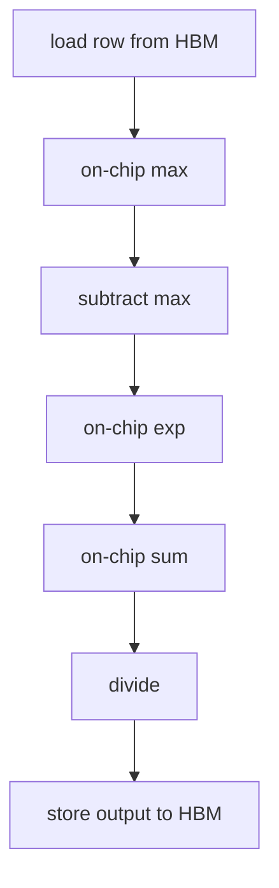

# Triton Kernel 编程

Triton 是一种面向 GPU 的 Python DSL，用来写高性能 AI kernel。它常用于 PyTorch 生态里的自定义算子、TorchInductor 生成代码、FlashAttention / fused operator / MoE dispatch 等场景。

如果只记一句话：

> Triton 让工程师用“block program”的方式描述 GPU kernel：每个 program instance 处理一块数据，编译器再把块内向量运算、访存、寄存器、shared memory、Tensor Core 指令和调度映射到底层硬件。

这篇不是 API 手册，而是建立 Triton 的系统理解：什么时候该写 Triton，Triton kernel 在算什么，性能瓶颈怎么判断，怎么 benchmark 和调优。

## Triton 在系统里的位置

Triton 不是一个孤立工具。它通常处在三类路径里：

| 路径 | 典型来源 | 目标 |
| --- | --- | --- |
| 手写 kernel | 工程师写 `@triton.jit` | 为特定算子、shape、layout 做高性能实现 |
| 编译器生成 | TorchInductor 生成 Triton | 自动融合 PyTorch graph 中的算子 |
| 库内部实现 | 某些 attention、MoE、optimizer 库 | 用 Triton 封装高性能 kernel |

这三类路径的 debug 方法不同。

手写 Triton 时，你能改 kernel 代码、meta-parameter 和 launch grid。

Inductor 生成 Triton 时，你先要看 graph capture、fusion boundary、generated code 和 scheduler 选择。

库内部 Triton kernel 则要看库暴露的参数、shape fallback 和 backend 选择。

所以学习 Triton 不只是为了“自己写 kernel”。它也是理解 PyTorch 编译栈和高性能 AI runtime 的基础语言之一。

## Triton 解决什么问题

AI 系统里很多算子已经有高性能库：

- GEMM 用 cuBLAS / rocBLAS / CUTLASS。
- convolution 用 cuDNN / MIOpen。
- attention 可用 FlashAttention 等成熟实现。
- 常见 PyTorch op 可由 eager、Inductor、XLA、TVM 等执行。

为什么还需要 Triton？

因为真实 AI workload 经常出现“库函数不刚好覆盖”的计算：

- 多个 elementwise / reduction 可以融合，避免中间 tensor 落到 HBM。
- 某个 shape 很特殊，通用 kernel 不够快。
- 算子需要自定义 mask、layout、indexing 或 sparse pattern。
- MoE dispatch/combine、top-k、routing、packing 等逻辑不适合单个库函数。
- optimizer、normalization、attention variant 需要实验性实现。
- TorchInductor 生成的 kernel 需要理解或手工替代。

Triton 的价值不是替代所有 CUDA/CUTLASS/cuBLAS，而是在“需要定制、但又不想直接手写 CUDA 线程级代码”的区域提供高生产力方案。

## 什么时候不该先写 Triton

写 Triton 前，先确认是不是已有路径已经足够好。

不建议一开始就手写 Triton 的情况：

- 标准大 GEMM，cuBLAS / CUTLASS 已经很强。
- 标准 attention，FlashAttention / SDPA backend 已经覆盖。
- PyTorch `torch.compile` 已经能自动融合出接近最优 kernel。
- 算子只占端到端 step time 很小一部分。
- shape 分布很散，特化 kernel 维护成本高。
- 团队还没有稳定的 correctness、benchmark 和 profiler 流程。

更稳妥的流程是：

```text
PyTorch eager baseline
-> torch.compile / vendor library baseline
-> profiler 确认瓶颈
-> 手写或改写 Triton
-> correctness + microbenchmark
-> end-to-end benchmark
```

Triton 是性能工具，不是替代 benchmark 的捷径。

## Triton 和 CUDA 的思维差异

Triton 官方文档把它和 CUDA 的差别概括为：CUDA 更像 scalar program + blocked threads，Triton 更像 blocked program + scalar threads。

可以这样理解：

### CUDA 常见视角

你经常要思考：

```text
threadIdx
blockIdx
warp
shared memory
__syncthreads
```

也就是：一个线程做什么，一组线程如何协作。

### Triton 常见视角

你更多思考：

```text
program_id
block offsets
tl.arange
tl.load / tl.store
mask
tl.dot / tl.sum / tl.max
BLOCK_SIZE
num_warps
num_stages
```

也就是：一个 program instance 处理哪一块数据，块内向量如何计算。

简化对比：

| 维度 | CUDA | Triton |
| --- | --- | --- |
| 编程粒度 | thread / block | block program / program instance |
| 并行表达 | 显式 thread index | `tl.arange` 向量块 |
| 数据块 | 手动组织 shared memory 和 thread cooperation | 用 block tensor 表达 |
| 编译器职责 | 较多低层细节由程序员控制 | 自动做 coalescing、vectorization、instruction selection 等 |
| 适合人群 | 深入 GPU 编程工程师 | AI kernel / compiler / infra 工程师 |

Triton 不会让硬件复杂性消失，但会把注意力从“每个线程怎么跑”提升到“每个 tile 怎么映射”。

## Triton Kernel 的生命周期

一个 Triton kernel 从 Python 调用到 GPU 执行，大致经历：

```text
Python function with @triton.jit
-> meta-parameters specialization
-> Triton IR / MLIR lowering
-> target backend codegen
-> compile cache
-> launch grid
-> GPU execution
```

这带来几个工程影响。

第一，首次运行可能包含编译时间。benchmark 时要区分：

```text
compile time
autotune time
kernel execution time
end-to-end latency
```

第二，不同 `tl.constexpr` 和不同 shape key 可能生成不同 kernel。线上如果 shape 很散，可能出现频繁编译或缓存膨胀。

第三，Triton kernel 的性能和硬件后端相关。NVIDIA、AMD、不同 GPU 架构、不同 driver/runtime，都可能影响最终 codegen 和性能。

生产环境要管理：

- kernel compile cache。
- autotune cache。
- fallback kernel。
- 支持的 dtype/shape 列表。
- Triton/PyTorch/CUDA/ROCm 版本。

## Triton Kernel 的基本结构

一个最小 Triton kernel 通常长这样：

```python
import triton
import triton.language as tl

@triton.jit
def add_kernel(x_ptr, y_ptr, out_ptr, n_elements, BLOCK_SIZE: tl.constexpr):
    pid = tl.program_id(axis=0)
    offsets = pid * BLOCK_SIZE + tl.arange(0, BLOCK_SIZE)
    mask = offsets < n_elements

    x = tl.load(x_ptr + offsets, mask=mask)
    y = tl.load(y_ptr + offsets, mask=mask)
    z = x + y

    tl.store(out_ptr + offsets, z, mask=mask)
```

调用时：

```python
grid = lambda meta: (triton.cdiv(n_elements, meta["BLOCK_SIZE"]),)
add_kernel[grid](x, y, out, n_elements, BLOCK_SIZE=1024)
```

这里的关键概念有五个。

## Program Instance

`tl.program_id(axis=0)` 返回当前 program instance 在 launch grid 里的编号。

如果有 1,000,000 个元素，`BLOCK_SIZE=1024`，那么需要：

```text
ceil(1,000,000 / 1024)
```

个 program instance。

每个 program instance 负责一段连续元素：

```text
program 0 -> elements 0 ~ 1023
program 1 -> elements 1024 ~ 2047
program 2 -> elements 2048 ~ 3071
...
```

Triton 的 SPMD launch grid 类似 CUDA launch grid，但你写的是“每个 program 处理一个 block”的逻辑。

## Launch Grid 与多维映射

`grid` 决定启动多少个 program instance。简单一维向量加法只需要一维 grid，但矩阵、attention、MoE 等 workload 通常需要二维或三维映射。

例如矩阵输出 `C[M, N]` 可以按二维 tile 切分：

```python
pid_m = tl.program_id(axis=0)
pid_n = tl.program_id(axis=1)
```

调用时：

```python
grid = (triton.cdiv(M, BLOCK_M), triton.cdiv(N, BLOCK_N))
kernel[grid](...)
```

直觉上：

```text
program(pid_m=0, pid_n=0) -> C[0:BLOCK_M, 0:BLOCK_N]
program(pid_m=0, pid_n=1) -> C[0:BLOCK_M, BLOCK_N:2*BLOCK_N]
program(pid_m=1, pid_n=0) -> C[BLOCK_M:2*BLOCK_M, 0:BLOCK_N]
```

有时也会把二维问题压平成一维 `pid`，再手工还原：

```python
pid = tl.program_id(axis=0)
pid_m = pid // num_blocks_n
pid_n = pid % num_blocks_n
```

这样做的原因通常是想控制 program 发射顺序，例如 matmul 里的 grouped ordering，或 MoE 里按 expert 分组处理 token。

grid 映射不是形式问题，它会影响：

- 每个 program 的工作量是否均衡。
- 相邻 program 是否复用同一批数据。
- L2 cache reuse 是否友好。
- 长尾 tile 的 mask 比例是否过高。
- 是否存在某些 block 太小导致 SM 吃不满。

写 Triton 时不要只问“一个 block 怎么算”，还要问“所有 block 怎么铺到全局 workload 上”。

## Block Tensor

`tl.arange(0, BLOCK_SIZE)` 生成一个块内向量：

```text
[0, 1, 2, ..., BLOCK_SIZE-1]
```

再加上 `pid * BLOCK_SIZE`，就得到这个 program 要处理的全局 offsets。

Triton 里的 `x`、`y`、`z` 不是 Python scalar，而是 block tensor。你写：

```python
z = x + y
```

表示对整块元素做向量化加法。

## Pointer Arithmetic

Triton kernel 接收的是 pointer。要读取二维矩阵，需要自己算地址。

对 row-major 矩阵 `A`：

```text
address(A[i, j]) = A_ptr + i * stride_m + j * stride_n
```

在 Triton 里常写成：

```python
offs_m = pid_m * BLOCK_M + tl.arange(0, BLOCK_M)
offs_n = pid_n * BLOCK_N + tl.arange(0, BLOCK_N)
ptrs = a_ptr + offs_m[:, None] * stride_m + offs_n[None, :] * stride_n
```

这会形成一个二维 block pointer。

Pointer arithmetic 是 Triton kernel 的核心能力，也是最容易写错的地方。只要 stride、layout、offset 错了，结果可能静默错误。

## tl.load / tl.store 的语义

Triton 的 `tl.load` / `tl.store` 看起来像普通数组访问，但工程上要记住它们表达的是一组地址的向量化访存。

一个典型 load 包含三件事：

```python
values = tl.load(ptrs, mask=mask, other=0.0)
```

| 部分 | 含义 |
| --- | --- |
| `ptrs` | 一组地址，可以是一维或二维 block pointer |
| `mask` | 哪些地址有效 |
| `other` | mask 为 false 的位置返回什么值 |

store 也一样：

```python
tl.store(out_ptrs, values, mask=mask)
```

`mask` 不是“可有可无的边界装饰”。只要 pointer 可能越界，load/store 都应该有对应 mask。load 的 mask 保护读，store 的 mask 保护写，两者不能互相替代。

还要注意：`other` 是参与后续计算的默认值。不同算子需要不同默认值：

| 算子 | 常见 `other` | 原因 |
| --- | --- | --- |
| 加法 / 乘法前的无效输入 | `0.0` | 无效位置不应影响结果 |
| max reduction | `-float("inf")` | 无效位置不应成为最大值 |
| min reduction | `float("inf")` | 无效位置不应成为最小值 |
| softmax logits | `-float("inf")` | 无效位置概率应为 0 |

如果默认值选错，代码可能不会报错，但数值会悄悄偏掉。

## Mask

真实输入 shape 往往不是 block size 的整数倍。

例如长度 1000，`BLOCK_SIZE=1024`。最后 24 个位置越界，不能真的读写。

所以需要 mask：

```python
mask = offsets < n_elements
x = tl.load(x_ptr + offsets, mask=mask, other=0.0)
tl.store(out_ptr + offsets, y, mask=mask)
```

`tl.load` 的 `mask` 控制哪些位置有效。`other` 给无效位置一个默认值。

常见错误：

- 忘记 store mask，写越界。
- load mask 的 `other` 不合适，例如 softmax 应该用 `-inf`。
- mask 太复杂，导致额外 predicate 和性能开销。
- 用 modulo 处理边界但没有确认重复读是否影响语义。

## constexpr 和 Meta-parameters

`BLOCK_SIZE: tl.constexpr` 表示编译期常量。

Triton 需要很多参数在编译期确定：

- block size。
- tile shape。
- num warps。
- num stages。
- 是否启用某个分支。
- dtype / layout 特化。

这些 meta-parameters 会影响编译出的 kernel。

同一个 Python 函数，不同 meta-parameters 可能生成不同 kernel。

这就是为什么 Triton 性能经常依赖 shape specialization。

## Shape Specialization 与动态形状

Triton kernel 往往不是“一个函数覆盖所有 shape 并且都很快”。更常见的是：针对一组常见 shape 编译出若干特化版本。

例如同一个 layernorm kernel，可能会为不同 hidden size 选择不同 `BLOCK_SIZE`：

```text
hidden=1024 -> BLOCK_SIZE=1024
hidden=4096 -> BLOCK_SIZE=4096
hidden=8192 -> BLOCK_SIZE=8192 或分块实现
```

特化的好处是：

- 编译器知道 block size，可以展开和优化。
- 可以为常见 shape 选择更好的 `num_warps`。
- 可以避免为了兼容所有 shape 而写过多分支。

代价是：

- shape 种类越多，编译和缓存成本越高。
- 长尾 shape 可能没有最优配置。
- 动态 shape 下可能需要 fallback。
- 线上首次遇到新 shape 时可能触发编译。

工程上常见策略：

| 策略 | 适合场景 |
| --- | --- |
| 固定白名单 shape | 推理服务、训练固定 batch/seq |
| 分桶 bucket | sequence length 有变化但分布可控 |
| 通用 fallback kernel | 低频 shape、兼容性兜底 |
| 离线预编译或 warmup | 避免线上冷启动编译 |
| 按 GPU 架构保存 tuning 结果 | 多机多卡部署 |

对 AI 系统来说，shape 管理本身就是性能工程的一部分。Triton 写得再好，如果线上 shape 分布不可控，收益也可能被编译、fallback 和缓存抖动吃掉。

## Triton 适合写哪些算子

适合：

| 算子类型 | 为什么适合 |
| --- | --- |
| elementwise fusion | 减少多个 kernel launch 和中间 tensor 写回 |
| reduction | softmax、layernorm、sum/max 等可在块内完成 |
| memory-bound 算子 | 用 fusion 减少 HBM 读写 |
| shape 特化算子 | 针对常见 batch/seq/head dim 做特化 |
| custom layout | 手动处理 stride、packing、swizzle |
| MoE dispatch/combine | routing、scatter/gather、重排逻辑定制强 |
| fused optimizer | 多个逐元素状态更新合并 |
| attention variant | 特殊 mask、block sparse、fused attention |

不一定适合：

| 场景 | 原因 |
| --- | --- |
| 标准大 GEMM | cuBLAS / CUTLASS 通常很强 |
| 标准 convolution | cuDNN 等库成熟 |
| 极复杂跨 block 同步 | Triton 抽象不一定合适 |
| 需要长期维护多架构极致优化 | CUDA/CUTLASS 可能更可控 |
| 小算子但 launch overhead 主导 | fusion 或 graph capture 可能比手写单 kernel 更重要 |

判断标准不是“能不能写”，而是“写完是否比现有路径更快、更稳、更可维护”。

## AI Workload 里的典型 Triton 模式

从系统角度看，Triton 常见模式可以归成几类。

### Row-wise reduction

典型算子：

- softmax。
- layernorm。
- RMSNorm。
- per-token max/sum。

模式是：每个 program 处理一行或一段 hidden dimension，在块内完成 reduction，再写回结果。

性能重点：

- 一行能否放进合理 block。
- reduction 是否使用 FP32 accumulator。
- mask 是否正确处理尾部。
- 是否减少了中间 tensor 写回。

### Fused epilogue

典型算子：

- matmul 后接 bias。
- activation。
- residual add。
- dropout。
- quant/dequant。

模式是：主计算完成后，把若干逐元素操作融合进同一个 kernel。

收益主要来自少 launch、少读写 HBM。但 fusion 过多会增加寄存器压力，导致原本很快的主 kernel 变慢。

### Block matmul / grouped GEMM

典型场景：

- 小 batch GEMM。
- MoE expert GEMM。
- attention 中的 QK / PV。
- 带特殊 layout 的 matmul。

模式是：一个 program 负责一个输出 tile，沿 K 维循环累积。

性能重点：

- Tensor Core 利用率。
- tile shape。
- program ordering。
- L2 reuse。
- accumulator 寄存器压力。

### Scatter / gather / routing

典型场景：

- MoE token dispatch/combine。
- top-k routing。
- paged KV cache 读写。
- packed sequence。

这类 kernel 的难点不是算术，而是索引和访存。

性能重点：

- 是否能把随机访问变成分组访问。
- 是否需要 atomic。
- load/store 是否 coalesced。
- 是否存在严重负载不均衡。

### Quantization path

典型场景：

- int8 / fp8 dequant。
- per-channel scale。
- block scale matmul。
- weight-only quantization。

这类 kernel 的重点是把 scale、zero point、layout 和主计算融合起来，避免单独 dequant 成大 tensor。

性能重点：

- scale 读取是否高效。
- accumulator dtype 是否合理。
- 数值误差是否可接受。
- 是否真的减少 HBM traffic。

## Fused Softmax：为什么 fusion 有用

Softmax 是理解 Triton 的好例子。

普通 PyTorch 表达可能分成多步：

```python
x_max = x.max(dim=1)
z = x - x_max
num = torch.exp(z)
den = num.sum(dim=1)
y = num / den
```

如果每一步都落到单独 kernel，中间结果会反复读写 HBM。

官方 fused softmax 教程指出，naive softmax 会读取和写回多倍于输入规模的元素；如果把一行放到片上存储中完成 max、exp、sum、divide，再只写回最终结果，理论上可显著减少 DRAM traffic。

系统直觉：



Fused softmax 的收益来自：

- 少读 HBM。
- 少写中间 tensor。
- 少 launch kernel。
- 块内 reduction 更可控。

但它有条件：一行数据要能合理放进块内资源。列数太大、寄存器压力太高、shared memory 不够时，性能可能下降，甚至需要分块或换算法。

## Matmul：Tiling 是核心

Triton 官方 matmul 教程从 blocked algorithm 出发：

```text
for m in range(0, M, BLOCK_M):
  for n in range(0, N, BLOCK_N):
    acc = zeros(BLOCK_M, BLOCK_N)
    for k in range(0, K, BLOCK_K):
      a = A[m:m+BLOCK_M, k:k+BLOCK_K]
      b = B[k:k+BLOCK_K, n:n+BLOCK_N]
      acc += dot(a, b)
    C[m:m+BLOCK_M, n:n+BLOCK_N] = acc
```

每个 output tile 由一个 Triton program instance 负责。

关键参数：

| 参数 | 含义 |
| --- | --- |
| `BLOCK_SIZE_M` | 输出 tile 的 M 维大小 |
| `BLOCK_SIZE_N` | 输出 tile 的 N 维大小 |
| `BLOCK_SIZE_K` | 每次沿 K 维累积的块大小 |
| `num_warps` | 每个 program 使用多少 warp |
| `num_stages` | software pipeline 阶段数 |
| `GROUP_SIZE_M` | program launch order 分组，影响 L2 reuse |

Matmul 性能取决于：

- tile 是否适合 Tensor Core。
- K 维块是否能高效复用 A/B。
- `acc` 是否造成寄存器压力。
- program ordering 是否提高 L2 hit。
- 边界 mask 是否过多。
- shape 是否足够大，让 GPU 吃满。

对于标准大矩阵，Triton matmul 可以很快，但不代表一定超过 cuBLAS。Triton 更适合需要融合 epilogue、特殊 layout、grouped GEMM、block scaled matmul、MoE expert GEMM 等可定制场景。

## Program Ordering 和 L2 Cache

Matmul 里，output tiles 的计算顺序会影响 L2 cache reuse。

如果简单 row-major：

```text
C[0,0], C[0,1], C[0,2], ...
```

某些 A/B tile 可能很快被换出。

Triton matmul 教程使用 grouped ordering：先在一组 M block 内遍历多个 N block，增加 A/B 在 L2 中被复用的机会。

直觉：

```text
不是只问“每个 tile 怎么算”
还要问“tile 按什么顺序发射”
```

这类优化说明：Triton kernel 调优不仅是 block size，也包括 launch order、cache 行为和数据重用。

## num_warps、num_stages、occupancy

Triton 常见配置：

```python
kernel[grid](..., BLOCK_M=128, BLOCK_N=128, BLOCK_K=32,
             num_warps=4, num_stages=4)
```

这些参数不是随便填。

### num_warps

`num_warps` 控制一个 program 用多少 warp。

太少：

- 并行度不足。
- 大 tile 算不快。

太多：

- 资源占用增加。
- occupancy 下降。
- 小 tile 浪费。

### num_stages

`num_stages` 和 software pipelining 相关，常用于隐藏 memory load latency。

太少：

- 数据加载等待暴露。

太多：

- shared memory / register 占用上升。
- occupancy 下降。

### Occupancy 不是越高越好

Occupancy 低可能说明 kernel 受寄存器或 shared memory 限制。但高 occupancy 也不一定代表快。

判断要结合：

- Tensor Core utilization。
- memory bandwidth。
- register spills。
- shared memory usage。
- achieved occupancy。
- kernel duration。
- 端到端 step time。

## 资源模型：寄存器、Shared Memory 与 Occupancy

Triton 让你少写很多底层代码，但硬件资源仍然真实存在。

一个 program instance 运行时会消耗：

| 资源 | 主要来自哪里 | 影响 |
| --- | --- | --- |
| registers | block tensor、中间变量、accumulator | 太多会降低 occupancy，甚至 spill 到 local memory |
| shared memory | pipelined load、某些 tiling 策略 | 太多会限制同一 SM 上的 resident programs |
| warps | `num_warps` | 决定并行度和调度开销 |
| Tensor Core | `tl.dot`、dtype、tile shape | 决定 compute-bound kernel 上限 |
| L2 / HBM bandwidth | load/store pattern | 决定 memory-bound kernel 上限 |

常见调优矛盾：

```text
更大的 tile
-> 更好的数据复用
-> 但更多 accumulator 和中间变量
-> register pressure 上升
-> occupancy 下降
```

所以不要只看单个参数。`BLOCK_M/N/K`、`num_warps`、`num_stages`、dtype、layout 会共同决定资源占用。

如果 profiler 里看到 register spill，通常说明：

- tile 太大。
- fusion 太激进。
- 中间 block tensor 太多。
- accumulator dtype 或 shape 造成压力。

如果 occupancy 很低但 Tensor Core 利用很高，可能仍然可以接受。反过来，如果 occupancy 很高但 memory throughput 很低，也不代表 kernel 好。

正确问题是：当前瓶颈是哪类资源，改哪个参数能缓解它？

## Memory Coalescing 和 Layout

GPU 访存喜欢连续、对齐、规则访问。

Triton 编译器会做 automatic coalescing 等优化，但前提是你的 pointer pattern 给了它机会。

常见原则：

- 尽量让相邻 lanes 访问相邻地址。
- 避免过于随机的 gather/scatter。
- 明确 stride 和 contiguous 维度。
- 对常见 layout 特化，例如 row-major、column-major、channels-last。
- 对 pointer alignment 使用 `tl.multiple_of`、`tl.max_contiguous` 等 hint 时要保证真实成立。

错误的 layout 会导致：

- memory transaction 不合并。
- L2 hit 低。
- HBM bandwidth 打不满。
- 多余 transpose / contiguous copy。

## 数值与 Dtype

AI kernel 优化不能只看快，还要看数值是否可靠。

常见原则：

- FP16/BF16 输入做 reduction 时，经常用 FP32 accumulator。
- softmax 要先减 max，避免 `exp` 溢出。
- layernorm/RMSNorm 的 variance 或平方和要注意精度。
- FP8 / int8 路径要明确 scale 粒度和 accumulator dtype。
- 对近似实现要设定合理 `rtol` / `atol`，不要只看样例输入。

例如 softmax 的稳定写法是：

```text
max_x = max(x)
exp_x = exp(x - max_x)
y = exp_x / sum(exp_x)
```

这里减 `max_x` 不改变数学结果，但会显著降低溢出风险。

dtype 也会影响性能路径：

| dtype | 常见关注点 |
| --- | --- |
| FP32 | 精度高，但带宽和计算成本更高 |
| FP16 | Tensor Core 友好，但 reduction 要注意累积精度 |
| BF16 | 动态范围更好，精度位更少 |
| FP8 | 依赖 scale 设计，误差和溢出更敏感 |
| INT8 | 常见于量化推理，dequant 和 scale 融合很关键 |

正确性测试不要只覆盖随机正态输入。还应该覆盖：

- 大正数 / 大负数。
- 全 0。
- 很小的 variance。
- 非 block size 整数倍。
- NaN / Inf 是否按预期传播。
- 不同 dtype 下的容差。

## Compute-bound 与 Memory-bound

写 Triton 前要先判断瓶颈。

### Memory-bound

典型：

- elementwise。
- layernorm。
- softmax。
- embedding。
- optimizer update。

优化方向：

- fusion。
- 减少 HBM read/write。
- 减少中间 tensor。
- 向量化和连续访问。
- 避免额外 layout transform。

### Compute-bound

典型：

- matmul。
- attention QK / PV。
- grouped GEMM。

优化方向：

- Tensor Core 利用。
- tile shape。
- data reuse。
- software pipeline。
- L2/shared memory。
- accumulator dtype。

### Launch-bound

典型：

- 很多小算子。
- 小 batch。
- 推理 decode 小 shape。

优化方向：

- fusion。
- CUDA graph。
- persistent kernel。
- batching。
- 减少 kernel 数量。

先判断边界，再决定写 Triton，否则容易优化错方向。

## Auto-tuning

Triton 的 `@triton.autotune` 可以为同一个 kernel 准备多个 `triton.Config`，按指定 `key` 在不同 shape 下测试并选择更快配置。

概念上：

```python
@triton.autotune(
    configs=[
        triton.Config({"BLOCK_M": 64, "BLOCK_N": 64}, num_warps=4),
        triton.Config({"BLOCK_M": 128, "BLOCK_N": 64}, num_warps=4),
        triton.Config({"BLOCK_M": 128, "BLOCK_N": 128}, num_warps=8),
    ],
    key=["M", "N", "K"],
)
@triton.jit
def kernel(...):
    ...
```

官方文档提醒：autotune 会多次运行 kernel 来评估配置，如果 kernel 会修改输入或累积输出，需要用 `reset_to_zero`、`restore_value` 或 hook 避免副作用。

Auto-tuning 的关键不是把搜索空间写得越大越好。

要控制：

- 搜索维度。
- shape key。
- warmup / repeat。
- 是否缓存结果。
- 是否包含真实 workload shape。
- 是否区分 GPU 架构。
- autotune 时间是否可接受。

生产系统里常见做法：

- 离线 tuning 常见 shape。
- 缓存 tuning 结果。
- 线上避免首次请求承担长时间 tuning。
- 对长尾 shape 回退通用配置。

## Autotune 的生产环境问题

`autotune` 在 notebook 里很好用，但线上系统还要回答更多问题。

第一，什么时候 tuning？

| 方式 | 优点 | 风险 |
| --- | --- | --- |
| 首次请求时 tuning | 实现简单，自动适配 shape | 冷启动慢，请求延迟抖动 |
| 服务启动时 warmup | 避免首个用户请求承担成本 | 启动慢，需要知道 shape 列表 |
| 离线 tuning | 可控、可复现 | shape 或硬件变化后要重新生成 |
| 固定经验配置 | 稳定、简单 | 可能不是最优 |

第二，tuning key 怎么选？

key 太粗，可能不同 shape 复用错误配置；key 太细，缓存条目过多，长尾 shape 持续触发 tuning。

第三，tuning 是否有副作用？

如果 kernel 会写输出、累加、修改状态，autotune 多次运行就可能污染输入输出。要使用官方提供的 reset/restore/hook 机制，或把 benchmark kernel 设计成无副作用。

第四，结果是否跨机器可靠？

不同 GPU 架构、driver、Triton 版本、CUDA/ROCm 版本都可能改变最优配置。生产环境应该把 tuning 结果和环境版本绑定，而不是简单认为“一次 tuning 永远有效”。

## Triton 和 TorchInductor 的关系

TorchInductor 是 PyTorch 2.x `torch.compile` 的主要后端之一。它可以把 PyTorch graph lowered 成更底层表示，再生成 Triton kernel 或 C++ kernel。

所以 Triton 有两种常见来源：

1. 人手写 Triton kernel。
2. TorchInductor 自动生成 Triton kernel。

理解 Triton 对分析 Inductor 很重要：

- 为什么 Inductor 生成多个 kernel？
- fusion 边界为什么停在这里？
- generated Triton 的 block size 是否合理？
- graph break 是否阻止 fusion？
- dynamic shape 是否让 kernel 过于保守？
- 手写 Triton 是否值得替代自动生成代码？

实际工程里，优先级通常是：

```text
先用库函数或 Inductor
-> profiler 证明瓶颈
-> 检查 generated code
-> 对关键路径手写 Triton
-> benchmark 验证端到端收益
```

不要因为“能手写”就绕过编译器。手写 kernel 有维护成本。

## PyTorch 集成方式

Triton 在 PyTorch 项目里通常有三种集成层级。

### 直接 Python wrapper

最常见：

```python
def my_op(x, y):
    out = torch.empty_like(x)
    grid = lambda meta: (triton.cdiv(x.numel(), meta["BLOCK_SIZE"]),)
    my_kernel[grid](x, y, out, x.numel(), BLOCK_SIZE=1024)
    return out
```

适合 forward-only、自定义实验、benchmark。

### Autograd Function

如果要参与训练，需要定义 forward 和 backward：

```python
class MyOp(torch.autograd.Function):
    @staticmethod
    def forward(ctx, x):
        ...

    @staticmethod
    def backward(ctx, grad_out):
        ...
```

这时要额外检查：

- backward 公式是否正确。
- saved tensors 是否占显存。
- forward/backward dtype 是否一致。
- 是否支持 `torch.compile`。
- 是否和 activation checkpointing、DDP/FSDP 等机制兼容。

### Custom op / library 封装

生产系统会进一步封装成稳定 API，处理：

- dtype/shape dispatch。
- CPU fallback 或错误信息。
- CUDA/ROCm backend 选择。
- 版本兼容。
- benchmark 和 correctness CI。

重要的是：Triton kernel 本身只是最底层。真正能在系统里长期使用，还需要 wrapper、dispatch、fallback、测试和文档。

## Triton 与 CUDA / CUTLASS / cuBLAS 的关系

| 技术 | 适合什么 |
| --- | --- |
| cuBLAS / rocBLAS | 标准 GEMM，成熟、稳定、极致优化 |
| cuDNN / MIOpen | 标准深度学习算子库 |
| CUTLASS | C++ 模板化 GEMM/conv/kernel 组件，适合深度定制 |
| CUDA | 最细粒度控制，工程成本最高 |
| Triton | 中高层 block kernel，适合 AI 自定义算子和 fusion |
| TorchInductor | 自动图编译和 Triton/C++ codegen |

Triton 的定位不是“比所有库都快”，而是“在库函数不刚好适配时，用较低成本写出高性能定制 kernel”。

## Debugging

Triton debugging 分三层。

### 编译期检查

Triton 提供：

- `static_print`
- `static_assert`

适合检查：

- constexpr 是否符合预期。
- block size 是否为合法值。
- shape 分支是否被选中。
- 编译期常量是否正确。

### 运行期检查

Triton 提供：

- `device_print`
- `device_assert`

`device_assert` 需要 `TRITON_DEBUG=1` 才执行。

适合检查：

- 指针是否越界。
- mask 是否正确。
- 中间值是否出现异常。

不要长期保留大量 runtime print/assert，它会严重影响性能。

### Interpreter

官方 debugging guide 提供 `TRITON_INTERPRET=1`，让 Triton kernel 通过解释器在 CPU 上模拟执行，方便逐步检查中间结果。

限制也要记住：

- 不支持 `bfloat16` 操作，需要 cast 到 `float32`。
- 不支持某些 indirect memory access pattern。
- 性能没有参考意义。

Interpreter 用来 debug 语义，不用来判断性能。

### 第三方工具

NVIDIA 上可用：

- compute-sanitizer：检查内存访问、race 等问题。
- Nsight Systems：看端到端 timeline。
- Nsight Compute：看单 kernel 指标。

Triton kernel 本质仍是 GPU kernel，最终还是要用 GPU profiler 看硬件行为。

## 常见正确性问题

Triton kernel 的错误常常不是“直接崩溃”，而是“某些 shape 或 dtype 下悄悄错”。

常见问题：

| 问题 | 表现 | 检查方法 |
| --- | --- | --- |
| 边界 mask 缺失 | 非整数倍 shape 错或越界 | 专门测尾块 shape |
| stride/layout 假设错误 | contiguous 输入对，非 contiguous 错 | 测转置、slice、channels-last |
| `other` 默认值错误 | reduction / softmax 数值偏差 | 测 mask 边界和极值 |
| accumulator dtype 不够 | 大 hidden 或长序列误差大 | 和 FP32 reference 比较 |
| atomic 冲突 | 结果不稳定或非确定 | 测重复运行一致性 |
| race condition | 小规模对，大规模偶发错 | compute-sanitizer / 缩小复现 |
| in-place aliasing | 输入输出同存储时错 | 明确禁止或测试 alias |
| NaN/Inf 传播不符合预期 | 训练中 loss 爆炸 | 极值输入测试 |

调试顺序建议：

```text
先小 shape
-> 对齐 PyTorch reference
-> 打开 boundary shape
-> 打开不同 stride/layout
-> 打开不同 dtype
-> 再做性能 benchmark
```

不要在正确性没有稳定前调性能。性能调优会引入更多变量，让问题更难定位。

## Benchmark 方法

Triton kernel 必须同时测正确性和性能。

### 正确性

至少比较：

- PyTorch reference。
- 不同 dtype。
- 不同 shape。
- 边界 shape，例如不是 block size 整数倍。
- 随机输入。
- 极值输入，例如 softmax 大值、NaN/Inf。
- deterministic 行为，如果需要。

示例：

```python
torch.testing.assert_close(out_triton, out_ref, rtol=1e-2, atol=1e-2)
```

### 性能

至少记录：

- latency。
- throughput。
- GB/s 或 TFLOP/s。
- p50 / p90 / p99。
- compile time。
- autotune time。
- peak memory。
- kernel count。
- end-to-end step time。

Triton 官方教程使用 `triton.testing.do_bench` 和 `triton.testing.perf_report` 做基准测试。要注意 GPU 执行是异步的，benchmark 工具或手工测量必须处理同步。

### Baseline

不要只和慢的 Python/PyTorch eager baseline 比。

合理 baseline 包括：

- PyTorch eager。
- `torch.compile` / Inductor。
- cuBLAS / cuDNN / vendor library。
- 现有 Triton kernel。
- CUDA/CUTLASS 实现。
- 业务系统中的真实端到端路径。

如果 Triton kernel 局部快 20%，但端到端 step time 没变，可能不是关键瓶颈。

## End-to-end 验证

microbenchmark 只能回答“这个 kernel 在这个输入上多快”，不能自动回答“系统是否更快”。

端到端验证要放回真实路径：

| 场景 | 端到端指标 |
| --- | --- |
| 训练 | step time、MFU、tokens/s、显存峰值、通信重叠 |
| 离线推理 | tokens/s、batch throughput、GPU utilization |
| 在线推理 | TTFT、TPOT、p50/p99 latency、吞吐、显存占用 |
| 编译栈优化 | graph break 数量、kernel count、compile time、fallback 次数 |

常见反例：

- kernel 快了，但为了调用它多了一次 `contiguous()`，端到端变慢。
- 单 shape 很快，但线上 shape 分布导致频繁 fallback。
- microbenchmark 没有算 compile/autotune 冷启动。
- 局部 fusion 减少 kernel 数量，但 register pressure 让主计算变慢。
- 推理 decode 阶段 launch overhead 才是瓶颈，单个 kernel TFLOP/s 不是核心指标。

所以 Triton 优化结论最好写成：

```text
在哪些 shape、dtype、GPU、batch、layout 下，
相对哪些 baseline，
microbenchmark 提升多少，
端到端指标提升多少，
代价是什么。
```

## Profiling 该看什么

### Nsight Systems

看：

- kernel 数量是否减少。
- launch gap 是否下降。
- 是否和其他 kernel/通信重叠。
- 是否出现同步点。
- 端到端 step time 是否改善。

### Nsight Compute

看：

- achieved occupancy。
- SM utilization。
- Tensor Core utilization。
- memory throughput。
- L2 hit rate。
- shared memory bank conflict。
- register spills。
- warp stall reasons。

### PyTorch Profiler

看：

- 自定义 op 在训练 step 中占比。
- 是否替换了目标 op。
- kernel 时间和 CPU launch 时间。
- memory allocation 是否减少。

Profiler 结论要回到系统指标：tokens/s、latency、MFU、TTFT/TPOT 或 step time。

## 常见优化方向

### Fusion

把多个 memory-bound op 合并：

```text
load once -> compute several operations on-chip -> store once
```

适合 softmax、layernorm、activation、bias、dropout、optimizer update。

风险：

- register pressure 上升。
- occupancy 下降。
- 调试更难。
- fusion 后 kernel 对 shape 更敏感。

### Tiling

选择合适 block shape：

- matmul 的 `BLOCK_M/N/K`。
- softmax 的 row block。
- layernorm 的 hidden dimension block。
- attention 的 Q/K/V tile。

风险：

- tile 太大，占用寄存器/shared memory。
- tile 太小，计算密度不够。
- 边界 mask 比例太高。

### Layout-aware indexing

根据真实 layout 写 pointer arithmetic：

- contiguous。
- transposed。
- packed sequence。
- paged KV cache。
- MoE token permutation。
- block sparse layout。

风险：

- stride 假设错误。
- 不连续访问导致 bandwidth 下降。
- 索引计算过重。

### Auto-tuning

为常见 shape 搜索配置。

风险：

- 搜索空间过大。
- autotune 首次运行太慢。
- key 过细导致缓存爆炸。
- tuning shape 和线上 shape 不一致。

### Persistent Kernel

Persistent kernel 让 program 长时间驻留，减少 launch 或调度开销，适合某些小 shape、多任务队列或 decode 场景。

风险：

- 实现复杂。
- 资源占用高。
- 对调度和公平性敏感。

## 常见误区

### 误区一：Triton 一定比 PyTorch 快

不一定。PyTorch 可能调用成熟库，Inductor 也可能生成不错的 kernel。Triton 需要 benchmark 证明收益。

### 误区二：局部 kernel 快就等于系统快

不一定。系统瓶颈可能在通信、数据、scheduler、KV cache、optimizer 或 checkpoint。

### 误区三：block size 越大越好

不一定。大 block 可能提高数据复用，也可能增加寄存器压力、shared memory、mask 开销，导致 occupancy 下降。

### 误区四：autotune 搜索越多越好

不一定。搜索成本、缓存、线上冷启动和 shape 覆盖都要考虑。

### 误区五：Triton 可以不用懂 GPU

不对。Triton 降低了低层编码成本，但性能仍然取决于访存、tiling、寄存器、occupancy、Tensor Core、cache 和调度。

## 设计检查清单

写 Triton kernel 前，先确认：

- 现有库函数、PyTorch eager、Inductor baseline 是什么？
- 当前瓶颈是 compute、memory、launch 还是 layout？
- 算子是否适合 fusion？
- 输入 shape 分布是什么？
- dtype 是 FP32、FP16、BF16、FP8 还是 int？
- 是否有 dynamic shape？
- block size 如何选择？
- mask 和边界是否正确？
- pointer arithmetic 是否支持 stride/layout？
- 是否需要 autotune？
- 是否有正确性测试覆盖边界 shape？
- 是否有 profiler 证据？
- 是否看了端到端收益？
- 是否考虑不同 GPU 架构的可移植性？
- 是否有 shape fallback 和冷启动策略？
- 是否明确 PyTorch wrapper、autograd、dispatch 和版本边界？
- 是否验证了非 contiguous、极值输入、NaN/Inf 和重复运行一致性？

## 小结

Triton 是 AI kernel 工程里的关键工具。它让我们用 block program 的方式描述 GPU 计算，在可维护性和性能控制之间取得平衡。

关键结论：

- Triton 适合定制算子、fusion、特殊 shape、特殊 layout 和实验性 kernel。
- Program instance、block tensor、pointer arithmetic、mask、constexpr 是基本模型。
- Launch grid、shape specialization 和 program ordering 决定全局 workload 如何铺到 GPU 上。
- 性能优化围绕 tiling、访存、fusion、occupancy、register、shared memory、Tensor Core 和 launch overhead。
- 数值正确性要关注 dtype、accumulator、mask 默认值和极值输入。
- Auto-tuning 有用，但必须覆盖真实 shape 并控制成本。
- Debug、benchmark 和 end-to-end 验证必须同时做；局部 kernel 快不等于端到端系统快。
- Triton 和 TorchInductor 强相关，理解 Triton 有助于理解 PyTorch 编译栈生成的 kernel。

如果把 Triton 当成“更简单的 CUDA”，容易写出能跑但不快的 kernel。更准确的理解是：Triton 是面向 AI workload 的 block-level kernel 语言，真正的能力来自你对 workload shape、内存访问和硬件执行的共同理解。

## 参考资料

- [Triton: Introduction](https://triton-lang.org/main/programming-guide/chapter-1/introduction.html)
- [Triton Tutorial: Vector Addition](https://triton-lang.org/main/getting-started/tutorials/01-vector-add.html)
- [Triton Tutorial: Fused Softmax](https://triton-lang.org/main/getting-started/tutorials/02-fused-softmax.html)
- [Triton Tutorial: Matrix Multiplication](https://triton-lang.org/main/getting-started/tutorials/03-matrix-multiplication.html)
- [Triton API: triton.jit](https://triton-lang.org/main/python-api/generated/triton.jit.html)
- [Triton API: triton.language](https://triton-lang.org/main/python-api/triton.language.html)
- [Triton API: triton.autotune](https://triton-lang.org/main/python-api/generated/triton.autotune.html)
- [Triton: Debugging Triton](https://triton-lang.org/main/programming-guide/chapter-3/debugging.html)
