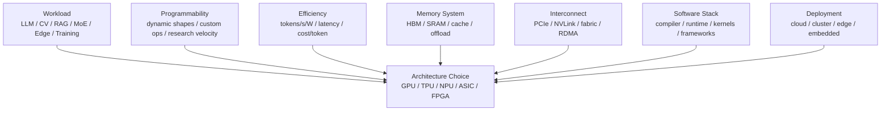

# 架构取舍：GPU、NPU、TPU、ASIC 与 FPGA

AI 加速器不是只有一种正确形态。GPU、NPU、TPU、ASIC、FPGA 都是在不同约束下做出来的工程选择。

真正的问题不是：

> 哪一种芯片最快？

而是：

> 给定 workload、模型变化速度、软件栈、部署规模、功耗预算和成本目标，哪一种架构能长期交付最高有效吞吐和最低复杂度？

这篇用系统视角解释几类 AI 加速器的取舍。重点不是背名词，而是建立判断框架。

## 选型不是芯片分类，而是风险管理

选择 AI 加速器，本质是在几类风险之间做交换：

| 风险 | 含义 | 常见缓解 |
| --- | --- | --- |
| 性能风险 | 峰值很高，但真实模型跑不快 | 端到端 benchmark、profiler、真实 shape |
| 适配风险 | 新模型、新算子、新 dtype 跑不通 | 算子覆盖清单、fallback 策略、编译器验证 |
| 生态风险 | 框架、kernel、runtime、工具链不成熟 | 选择成熟栈、保留迁移路径、建立内部能力 |
| 规模风险 | 单卡快，多卡/多机扩展差 | 拓扑 benchmark、collective 测试、并行策略验证 |
| 运维风险 | 监控、故障、升级、调度不完善 | telemetry、health check、版本矩阵、SRE 流程 |
| 成本风险 | 采购便宜但开发/维护/迁移成本高 | TCO 评估、软件人力估算、生命周期成本 |
| 锁定风险 | 模型和系统被某一硬件/云/编译器绑定 | 抽象层、标准格式、双栈验证、退出方案 |

因此，硬件选型不要只问“哪个芯片快”，而要问：

```text
在未来 12 到 36 个月里，
目标 workload 会怎么变？
团队能控制多少软件栈？
端到端收益是否足以覆盖迁移、调试和运维成本？
```

## 一张取舍图



选择加速器时，要同时看七个维度：

| 维度 | 关键问题 |
| --- | --- |
| workload | 训练还是推理，dense 还是 sparse，batch 大还是 latency 敏感 |
| 可编程性 | 是否经常改模型、改算子、改数据流 |
| 能效 | 每瓦吞吐、每 token 能耗、散热和供电约束 |
| 存储 | HBM 容量、带宽、片上 SRAM、KV Cache、optimizer state |
| 互连 | 单机多卡、多机扩展、collective、KV transfer |
| 软件栈 | framework、compiler、kernel、profiler、debugger、生态 |
| 部署 | 数据中心、云、边缘、嵌入式、成本、供应链 |

如果只看芯片峰值算力，就会忽略很多实际决定因素。

## 架构对比速查

| 架构 | 核心优势 | 主要代价 | 更适合 |
| --- | --- | --- | --- |
| GPU | 通用性强、生态成熟、自定义 kernel 和分布式栈成熟 | 功耗高、成本高、小 shape/动态请求能效未必最优 | 训练、研发、多模型、多租户、快速迭代 |
| TPU | 矩阵数据流、XLA 编译、Pod/slice 系统化扩展 | 依赖特定编译和云生态，迁移 CUDA/Triton 成本高 | 规整大规模训练/推理、JAX/XLA 工作流 |
| NPU | 面向神经网络的低功耗/低延迟路径 | 算子覆盖、编译器和工具链差异大 | 边缘、终端、固定模型推理 |
| AI ASIC | 针对目标 workload 的高能效和低单位成本 | 灵活性低，模型变化和软件栈风险高 | 大规模稳定部署、自研或强控制场景 |
| FPGA | 可重构、低延迟、bit-level 定制、流式 pipeline | 开发难、频率/资源受限、大模型生态弱 | 原型、边缘、网络/视频/固定 pipeline |

这张表不能替代 benchmark。它只是提醒：每种架构都有“适合的形状”和“容易踩的坑”。

## 先理解通用性与专用性的矛盾

硬件架构有一个长期矛盾：

```text
越通用，越容易适配新 workload，但能效可能不如专用硬件
越专用，越容易做到高能效，但适配新 workload 的代价更高
```

可以粗略画成这样：

```text
CPU        GPU        FPGA        NPU/TPU/ASIC
通用  <------------------------------>  专用
灵活  <------------------------------>  高能效
```

这不是绝对排序。现代 GPU 也有非常专用的 Tensor Core，现代 ASIC 也会加入可编程单元，FPGA 也能定制矩阵数据流。但这个轴能帮助初学者理解为什么不同架构会共存。

AI 计算的困难在于，模型和系统都变化很快：

- Transformer 之后又有 MoE、long context、speculative decoding、RAG/Agent、多模态。
- Attention pattern 从 dense 到 sparse、sliding window、paged、prefix reuse。
- 精度从 FP32、FP16、BF16 到 FP8、INT8、INT4、FP4。
- 推理系统出现 continuous batching、PagedAttention、P/D 分离、KV Cache 分层。
- 训练系统出现 FSDP、ZeRO、TP、PP、EP、activation checkpointing、FLUX、Muon。

如果硬件太专用，可能很高效，但模型一变就难以跟上。如果硬件太通用，能跟上变化，但能效和成本可能不够好。

## GPU：通用高吞吐并行处理器

GPU 最初不是为深度学习专门设计，但它非常适合 AI 的原因是：

- 有大量并行计算单元。
- 有高带宽显存。
- 有成熟的矩阵单元，例如 Tensor Core 或类似矩阵引擎。
- 有成熟的软件生态。
- 能运行广泛算子，而不只是固定模型。
- 多 GPU 训练和推理生态成熟。

GPU 的本质可以理解为：

> 通用并行处理器 + 专用矩阵加速单元 + 高带宽内存 + 强软件生态。

### GPU 擅长什么

GPU 特别适合：

- 模型研发和快速迭代。
- 大模型训练。
- 算子种类丰富的 workload。
- 动态 shape、动态控制流、复杂后处理。
- 需要自定义 kernel 的系统优化。
- 多模型混部。
- 新论文复现和实验。
- 高性能推理服务。

GPU 的优势不是单点硬件，而是完整生态：

- CUDA / ROCm。
- PyTorch、JAX、TensorFlow。
- cuBLAS、cuDNN、NCCL、CUTLASS、Triton。
- Nsight、Profiler、DCGM、ROCm SMI 等工具。
- 大量现成 kernel 和优化经验。

对研究和系统工程来说，生态经常比峰值硬件指标更重要。因为新模型通常先在 GPU 上跑通，再逐步被其他硬件支持。

### GPU 的生态优势来自哪里

GPU 的优势不只是“硬件强”，而是很多层已经被反复打磨：

| 层次 | 典型能力 |
| --- | --- |
| 编程模型 | CUDA、ROCm、SIMT、thread/block/grid、stream/event |
| 数学库 | GEMM、convolution、attention、FFT、collective |
| Kernel 开发 | CUDA C++、Triton、CUTLASS、inline assembly、autotune |
| 框架集成 | PyTorch、JAX、TensorFlow、ONNX Runtime、vLLM、TensorRT-LLM |
| 分布式 | NCCL/RCCL、FSDP、Megatron、DeepSpeed、DTensor |
| 可观测性 | Nsight、PyTorch Profiler、DCGM、ROCm SMI |

这让 GPU 很适合“模型和系统还在快速变化”的阶段。即使某个新算子一开始没有最优 kernel，也往往能用通用路径先跑通，再逐步优化。

### GPU 的代价

GPU 的通用性也有代价：

- 控制逻辑和缓存体系复杂。
- 功耗高。
- 对小 batch、低 latency、动态请求可能不够能效最优。
- 需要复杂 kernel 才能吃满矩阵单元。
- 不规则访存、分支和小 shape 会降低利用率。
- 多 GPU 扩展依赖昂贵互连和复杂通信库。

一个 GPU 可以跑很多东西，但并不意味着每个东西都跑得最省电。

### GPU 适合的判断

如果满足以下条件，GPU 通常是保守且强的选择：

- 模型还在频繁变化。
- 需要训练大模型。
- 需要支持广泛算子。
- 需要用主流框架快速迭代。
- 需要自定义 kernel 或 profiler 深度优化。
- 需要多机多卡成熟生态。

如果 workload 非常固定、规模巨大、能效压力极高，专用 ASIC/NPU/TPU 可能更有吸引力。

### GPU 的隐藏风险

GPU 也不是没有风险。

- CUDA 和 ROCm 生态不完全等价，迁移要验证 kernel、compiler、library 和 profiler。
- 依赖大量手写 kernel 时，跨 GPU 架构升级需要重新调优。
- 高端 GPU 对供电、散热、互连和机柜能力要求高。
- 多租户场景需要额外处理隔离、MIG/MPS、显存碎片和 QoS。
- 如果 workload 已经非常固定，GPU 的通用性可能变成成本和功耗负担。

因此 GPU 是保守强选择，但不等于永远是最低成本选择。

## TPU：面向矩阵计算和数据流的专用加速器

TPU 是 Google 面向机器学习 workload 设计的专用加速器。它强调矩阵计算、数据流、编译器和系统级扩展。

从架构思想上看，TPU 的代表性概念是 systolic array：

```text
数据按固定节奏流过二维计算阵列
每个单元做局部乘加
中间结果在阵列中传播
```

这种设计很适合大规模矩阵乘，因为它能让数据在片上高效复用，减少来回访问外部内存。

### TPU 擅长什么

TPU 通常适合：

- 大规模 dense 矩阵计算。
- 训练和推理中形状较规整的模型。
- 能被 XLA 等编译器良好捕获的计算图。
- 大 batch 或高吞吐场景。
- JAX / TensorFlow / PyTorch/XLA 生态下的工作流。
- Google Cloud TPU Pod 这类系统级扩展。

TPU 的核心价值不只是芯片，而是：

- 硬件矩阵阵列。
- HBM 和片上存储。
- XLA 编译器。
- 分布式运行时。
- 云上互连和资源形态。

也就是说，TPU 更像“硬件 + 编译器 + 云系统”一起交付。

### TPU 的编译器路径

TPU 体验很大程度取决于 XLA 编译器能否把模型图优化成适合硬件的数据流。

这意味着要关注：

- graph 是否能被编译器捕获。
- shape 是否稳定。
- sharding 策略是否明确。
- layout 是否适合矩阵单元和内存层次。
- compile time 是否可接受。
- 动态 shape 是否导致频繁重编译。
- unsupported op 是否 fallback 或阻塞。

对规整训练 workload，编译器可以做全图优化、跨 op fusion 和分片规划。对动态 serving runtime，如果请求形状变化很大，编译缓存、padding、bucket 和 fallback 策略就会变得很重要。

### TPU 的约束

TPU 的约束主要来自专用化和编译器路径：

- 计算图和 shape 对编译效果影响大。
- 动态 shape、复杂控制流和非常规算子可能更难处理。
- 自定义 kernel 生态不像 GPU 那样普遍。
- 迁移已有 CUDA/Triton 优化不直接。
- 需要理解 XLA、sharding、layout、compile time 等问题。
- 依赖特定云生态和运行方式。

这不是说 TPU 不灵活，而是它的灵活性更多来自编译器和框架，而不是像 GPU 那样由大量手写 kernel 覆盖各种场景。

### TPU 适合的判断

如果满足以下条件，TPU 值得认真评估：

- workload 以大规模 dense tensor 计算为主。
- 模型结构相对规整。
- 团队能接受 XLA/JAX/TensorFlow/PyTorch-XLA 工作流。
- 目标是高吞吐训练或推理。
- 部署环境天然在 Google Cloud TPU 生态中。

如果系统强依赖 CUDA/Triton 自定义 kernel、动态 serving runtime、复杂算子 fallback，迁移成本要提前评估。

### TPU 的隐藏风险

TPU 选型要提前验证：

- 模型里所有关键 op 是否被高效支持。
- JAX/TensorFlow/PyTorch-XLA 路径是否符合团队能力。
- serving runtime 是否满足连续 batching、KV Cache、P/D 分离等需求。
- 编译时间是否影响开发迭代。
- 调试工具是否能定位性能问题。
- 云资源形态、配额、地域和成本是否匹配。

如果团队已有大量 CUDA/Triton kernel 资产，迁移到 TPU 不只是换硬件，而是换编译和运行生态。

## NPU 与 AI ASIC：为 AI workload 专门设计

NPU 是 Neural Processing Unit。ASIC 是 Application-Specific Integrated Circuit。两者经常被一起讨论，但含义不完全相同。

可以这样理解：

- NPU 通常指面向神经网络计算的专用处理器。
- AI ASIC 更泛，强调为特定应用或 workload 设计的专用芯片。
- TPU 本身也可以看作 AI ASIC 的一种代表。

行业里很多芯片都叫 NPU，但跨度很大：

- 手机 SoC 里的小型 NPU。
- 边缘摄像头和车载推理 NPU。
- 数据中心推理 ASIC。
- 面向训练的大规模 AI ASIC。

所以不能只听名字，要看具体架构和软件栈。

### NPU/ASIC 的核心目标

NPU/ASIC 通常追求：

- 更高 perf/W。
- 更低 latency。
- 更低单位推理成本。
- 更确定的数据流。
- 更小的控制开销。
- 面向特定模型族优化。
- 在固定场景中大规模部署。

它们常见设计包括：

- 矩阵阵列。
- 大片上 SRAM。
- 显式 dataflow。
- 专用 DMA 和 tensor layout。
- 固定或半固定的算子 pipeline。
- INT8/INT4/FP8 等低精度路径。
- 编译器把 graph 映射到硬件执行计划。

相比 GPU，NPU/ASIC 可能牺牲一部分通用性，换取能效和成本。

### 算子覆盖是隐藏关键

评估 NPU/ASIC 时，最重要的问题之一是算子覆盖。

一个模型不是只有 GEMM。还包括：

- embedding。
- positional encoding。
- LayerNorm / RMSNorm。
- Softmax。
- attention mask。
- RoPE。
- sampling。
- top-k / top-p。
- quantize / dequantize。
- KV Cache 读写。
- reshape / transpose / concat。
- MoE router。
- all-to-all dispatch/combine。
- vision/audio preprocessing。

如果核心 GEMM 很快，但很多小算子 fallback 到 CPU 或低效路径，端到端性能可能很差。

所以要问：

- 支持哪些 dtype。
- 支持哪些 operator。
- 动态 shape 如何处理。
- unsupported op 会怎样 fallback。
- fallback 是否发生 device-host copy。
- 编译器能否融合小算子。
- runtime 是否支持 batching、KV Cache、paged memory。
- profiler 能否定位瓶颈。

NPU/ASIC 的真实能力经常不在矩阵峰值，而在端到端 graph coverage。

### 编译器、Runtime 与 Runtime Feature

NPU/ASIC 常常依赖 graph compiler 把模型转换成硬件执行计划。

需要看三类能力。

第一，编译能力：

- graph partition。
- operator fusion。
- layout transform。
- memory planning。
- quantization-aware lowering。
- dynamic shape 支持。
- multi-core / multi-chip mapping。

第二，runtime 能力：

- request batching。
- KV Cache 管理。
- memory pool。
- graph cache。
- fallback 调度。
- 多模型共存。
- profiling。

第三，生产能力：

- model versioning。
- rolling upgrade。
- error handling。
- telemetry。
- QoS。
- 故障隔离。

很多 NPU/ASIC demo 在单模型、单 batch、静态 shape 下很好，但生产系统会遇到动态请求、模型版本切换、fallback、长尾 latency 和多租户资源管理。

### NPU/ASIC 适合的判断

NPU/ASIC 通常适合：

- 模型结构相对稳定。
- 部署规模大。
- 能效或成本是硬约束。
- 延迟目标明确。
- 团队能控制模型导出、编译、量化和 runtime。
- 线上模型族比较集中。

风险在于：

- 新模型结构出现后，硬件或编译器支持跟不上。
- 少数 unsupported op 破坏端到端性能。
- 生态不成熟，debug 成本高。
- 训练支持不足，推理和训练割裂。
- 软件栈绑定厂商，迁移成本高。

所以 NPU/ASIC 更适合“规模化、稳定化、工程化”的场景，而不是最早期的探索阶段。

## FPGA：可重构的数据流硬件

FPGA 是 Field-Programmable Gate Array。它不是固定处理器，而是一块可以配置逻辑电路的可重构硬件。

FPGA 的核心价值是：

> 用可重构逻辑搭出适合特定 workload 的 pipeline。

与 GPU 的线程并行不同，FPGA 更强调 spatial dataflow：

```text
输入数据流入 pipeline
每一级做固定处理
中间结果直接流到下一级
尽量减少通用控制和无用搬运
```

### FPGA 擅长什么

FPGA 适合：

- 低延迟流式处理。
- 边缘和嵌入式场景。
- 自定义数据类型和 bit width。
- 固定 pipeline。
- 网络包处理、视频流、传感器数据。
- 需要硬件级定制但不想流片的场景。
- 原型验证。

AI 场景中，FPGA 常用于：

- CNN/vision pipeline。
- 低比特推理。
- 前处理/后处理。
- 网络和存储旁路加速。
- 边缘设备。
- 自定义算子原型。

### FPGA 的限制

FPGA 不适合所有 AI workload。

主要限制包括：

- 片上资源有限。
- 频率通常低于 ASIC/GPU。
- HBM 或外部内存带宽取决于板卡。
- 工具链复杂。
- 编译和 place-and-route 时间长。
- 性能调优需要硬件设计经验。
- 大模型训练生态不如 GPU/TPU 成熟。

对 LLM 这类大规模 dense 矩阵和巨大 KV Cache workload，FPGA 要和 GPU/ASIC 竞争并不容易，除非目标是特定子问题，例如极低延迟、低比特、边缘、网络侧预处理或固定模型推理。

### FPGA 适合的判断

FPGA 值得考虑的场景：

- latency 比吞吐更重要。
- workload 很固定。
- 需要自定义 bit-level 数据路径。
- 数据天然是 streaming。
- 部署数量不足以支撑 ASIC 流片。
- 团队有硬件设计和 HLS/RTL 能力。
- 需要快速验证某种专用 dataflow。

如果模型频繁变化、算子复杂、需要 PyTorch 生态快速迭代，FPGA 开发成本会很高。

### FPGA 的工程路径

FPGA 项目通常要经历：

```text
算法/数据流设计
  -> HLS 或 RTL 描述
  -> 仿真
  -> 综合
  -> place and route
  -> bitstream
  -> 板卡验证
  -> runtime/driver 集成
```

每一步都可能耗时。相比 GPU kernel 几秒到几分钟编译，FPGA place-and-route 可能需要很久。它更适合固定 pipeline 和长期复用，不适合每天大改模型结构。

FPGA 的真正优势通常出现在：

- 数据天然以流方式到达。
- pipeline 可以持续工作。
- 需要非常低的 deterministic latency。
- bit width 可以高度定制。
- 与网络、存储、传感器或视频链路深度耦合。

## CPU 的位置

虽然这篇主要讨论 AI 加速器，但 CPU 仍然重要。

CPU 常负责：

- 数据加载和预处理。
- tokenization。
- serving control plane。
- scheduler。
- RPC / HTTP。
- storage I/O。
- checkpoint 编排。
- metric 和 logging。
- 小规模或低频 fallback op。

但 CPU 不适合承担大规模 dense tensor 主计算。AI 系统设计的关键是让 CPU 做控制和 I/O，让加速器做高吞吐 tensor 计算，并避免 CPU/GPU 或 CPU/NPU 之间来回搬数据。

## 架构维度一：执行模型

不同架构的执行模型不同。

| 架构 | 执行模型直觉 |
| --- | --- |
| GPU | 大量线程 / warp / wavefront，SIMT 执行，矩阵单元加速 GEMM |
| TPU | 编译器驱动的数据流，systolic array 高效执行矩阵计算 |
| NPU/ASIC | 专用 tensor dataflow，graph 编译到硬件 pipeline |
| FPGA | 可重构 spatial pipeline，数据流过自定义逻辑 |

执行模型决定了什么 workload 容易跑快。

GPU 对不规则和动态逻辑更友好，但需要足够并行度。TPU/NPU/ASIC 对规整 tensor graph 更高效，但更依赖编译器。FPGA 对固定 streaming pipeline 很强，但开发和调试难度高。

## 架构维度二：存储层次

AI 性能经常受数据搬运限制。不同架构的存储哲学不同。

GPU 常见：

- register。
- shared memory / SRAM。
- L1/L2 cache。
- HBM。
- host memory。

TPU/NPU/ASIC 常见：

- 大片上 SRAM。
- 显式 buffer。
- compiler-managed data movement。
- HBM 或外部 DRAM。
- 专用 DMA。

FPGA 常见：

- register / LUTRAM / BRAM / URAM。
- streaming FIFO。
- 外部 DDR/HBM。
- 自定义 memory banking。

一个重要判断是：

> 数据是否能留在片上复用？

如果 workload 每次计算都要从 HBM 或外部内存重新搬数据，矩阵峰值再高也可能浪费。

## 架构维度三：精度支持

AI 加速器通常通过低精度提高性能和能效。

需要看：

- FP32 / TF32。
- FP16 / BF16。
- FP8。
- INT8。
- INT4。
- FP4 / 自定义低比特。
- accumulator 精度。
- scale 粒度。
- 混合精度规则。
- 量化校准工具。

不同架构的低精度支持差异很大。

硬件支持某种 dtype 不等于端到端可用。还要看：

- 框架是否支持。
- kernel 是否支持。
- compiler 是否能生成对应路径。
- 算子是否全链路低精度。
- 精度损失是否可接受。
- 通信和存储是否也低精度。

## 架构维度四：软件栈

AI 加速器最终通过软件交付能力。

软件栈至少包括：

- framework integration。
- graph compiler。
- kernel library。
- runtime scheduler。
- memory manager。
- communication library。
- profiler。
- debugger。
- model export。
- quantization tool。
- deployment server。

一个硬件如果缺少成熟软件栈，用户会遇到：

- 模型跑不通。
- unsupported op。
- 编译时间长。
- 性能不可解释。
- debug 信息不足。
- 版本组合脆弱。
- 无法定位是模型、compiler、kernel、driver 还是硬件问题。

所以评估架构时，要把软件栈看作架构的一部分。

## 软件栈成熟度模型

评估一个 AI 加速器，可以把软件栈成熟度分成五级。

| 级别 | 状态 | 典型表现 |
| --- | --- | --- |
| L0：Demo | 能跑少数样例 | benchmark 好看，但模型覆盖很窄 |
| L1：Model Port | 能跑目标模型 | 需要大量手工改图、固定 shape、调试困难 |
| L2：Optimized | 能优化关键路径 | 有 profiler、kernel library、量化和编译报告 |
| L3：Production | 能在线稳定服务 | 支持监控、升级、fallback、错误处理、多租户 |
| L4：Ecosystem | 能支持模型演进 | 新模型、新 dtype、新 runtime 能较快跟进 |

很多硬件评估卡在 L1 到 L2：模型能跑，但性能不可解释，fallback 不透明，编译器报错难定位。生产部署至少要达到 L3。研究和长期平台建设更看重 L4。

评估软件栈时，建议准备一个“模型/算子覆盖矩阵”：

- 目标模型族。
- 每层主要 operator。
- shape 分布。
- dtype。
- 是否编译成功。
- 是否高效执行。
- 是否 fallback。
- fallback 位置和成本。
- profiler 是否能解释性能。

没有这个矩阵，就很容易被单个漂亮 demo 误导。

## 迁移成本与锁定

从一种加速器迁移到另一种，不只是替换实例类型。

迁移成本包括：

- framework 代码路径。
- 自定义 kernel。
- dtype 和量化策略。
- checkpoint 格式。
- model export。
- serving runtime。
- profiler 和 benchmark 工具。
- 分布式并行策略。
- 运维监控。
- 人员经验。

锁定也有不同层次：

| 锁定层 | 例子 |
| --- | --- |
| 编程模型 | CUDA、ROCm、XLA、厂商 SDK |
| 模型格式 | 专有 graph、engine、compiled artifact |
| Kernel | 手写 CUDA/Triton 或厂商 kernel |
| Runtime | serving engine、KV Cache 管理、batching 策略 |
| 集群 | 调度、拓扑、监控、故障处理 |
| 商业 | 云资源、供货、价格、支持周期 |

锁定不一定是坏事。专用化带来收益时，锁定是代价。关键是提前知道：

```text
收益是什么？
退出成本多高？
未来模型变化时还能不能跟上？
```

## 架构维度五：动态性

现代 AI workload 越来越动态：

- variable sequence length。
- continuous batching。
- dynamic request arrival。
- RAG context 长度变化。
- Agent 工具调用不确定。
- MoE routing 动态。
- speculative decoding 的 accept/reject 不确定。
- 多模态输入大小不同。

GPU 通常更容易适应动态 workload。专用 dataflow 架构要靠编译器、runtime 和调度设计处理动态性。

如果硬件更适合固定 shape，但线上请求 shape 高度变化，就可能出现：

- padding 浪费。
- 频繁 recompile。
- batch 合并困难。
- kernel 选择不稳定。
- p99 latency 变差。

推理系统尤其要关注动态性，因为线上请求不会像离线 benchmark 那样整齐。

## 架构维度六：扩展方式

单芯片性能不够时，要看扩展方式。

GPU 扩展依赖：

- NVLink/NVSwitch 或 PCIe。
- RDMA 网络。
- NCCL/RCCL 等通信库。
- TP/PP/DP/EP 并行策略。

TPU 扩展通常依赖：

- TPU Pod / slice。
- XLA sharding。
- 专用互连。
- 框架级分布式抽象。

NPU/ASIC 扩展依赖：

- 厂商 fabric。
- 编译器和 runtime 的分片能力。
- collective 支持。
- serving runtime。

FPGA 扩展通常更工程化：

- 多板卡 pipeline。
- PCIe 或网络互连。
- host orchestration。
- 固定数据流 partition。

扩展能力必须和并行策略匹配。单芯片很快，但多芯片通信差，仍然无法支撑大模型。

## 训练和推理要分开评估

同一个硬件，对训练和推理的价值可能完全不同。

训练关注：

- backward 和 optimizer 是否高效。
- FP32/BF16/FP8 混合精度是否稳定。
- optimizer state 和 activation 显存是否够。
- 分布式通信是否支持 TP/PP/DP/EP/FSDP。
- checkpoint/resume 是否成熟。
- 长时间稳定性和错误恢复。
- time to target quality。

推理关注：

- Prefill 和 Decode 是否分别高效。
- KV Cache 容量、layout、分页和量化。
- continuous batching。
- speculative decoding。
- P/D 分离。
- sampling、logits、tokenization、后处理。
- p95/p99 latency。
- cost/token 和 joules/token。

有些硬件训练很强，但 serving runtime 不成熟；有些推理 ASIC 能效很好，但训练不支持或不经济。选型时要把训练、离线推理、在线推理、边缘推理分别评估。

## 数据中心与边缘是两类问题

数据中心加速器关注：

- HBM 容量和带宽。
- 多卡互连。
- RDMA 网络。
- 机柜供电和散热。
- 多租户调度。
- 大规模运维和故障处理。
- 总拥有成本。

边缘/终端加速器关注：

- 功耗和电池。
- 体积和散热。
- 单请求延迟。
- 成本。
- 模型压缩和量化。
- 离线运行。
- 安全、隐私和本地数据。

同样叫 NPU，在手机 SoC、车载芯片、边缘盒子和数据中心卡里，约束完全不同。不要把一个场景的 benchmark 直接外推到另一个场景。

## TCO 与单位经济性

硬件单价只是成本的一部分。

TCO 至少包括：

- 设备采购。
- 机柜、电力、冷却。
- 互连和网络。
- 服务器 CPU/内存/存储。
- 软件许可或云资源。
- 工程迁移和调优人力。
- 监控和运维。
- 故障、重启、返修和备件。
- 模型迭代带来的再适配成本。

对推理，最终可以落到：

```text
cost/token
joules/token
p99 latency under SLO
```

对训练，最终可以落到：

```text
cost to target quality
energy to target quality
calendar time to target quality
```

如果一个硬件单价低，但需要大量工程适配、fallback 多、运维复杂、模型迭代慢，TCO 未必低。

## 自研 ASIC 还是采购通用硬件

是否自研 ASIC，要非常谨慎。

自研的潜在收益：

- 面向固定 workload 做极致能效。
- 控制供应链和产品差异化。
- 在超大规模部署中摊薄 NRE。
- 深度结合自家 runtime 和模型。

自研的代价：

- 流片周期长。
- NRE 高。
- 编译器和软件栈要同步建设。
- 模型变化可能让设计过时。
- 调试、验证、良率、可靠性、生态都要投入。
- 没有规模时单位成本很难摊薄。

一个简单判断：

```text
如果模型和系统还在快速变化，优先用 GPU/TPU/成熟硬件迭代。
如果 workload 长期稳定、规模极大、能效收益足以覆盖 NRE，再考虑更专用的 ASIC。
```

## 如何按 workload 选择

下面是一个粗略判断表。

| 场景 | 更常见选择 | 原因 |
| --- | --- | --- |
| 新模型研发 | GPU | 生态成熟、可编程性强、debug 方便 |
| 大模型训练 | GPU / TPU / 成熟 AI ASIC | 需要矩阵吞吐、HBM、分布式通信和框架生态 |
| LLM 高吞吐推理 | GPU / NPU / TPU / ASIC | 取决于 KV Cache、batching、量化和 serving runtime |
| 低延迟边缘推理 | NPU / FPGA / ASIC | 功耗、体积、延迟和成本约束强 |
| 固定模型大规模部署 | NPU / ASIC | 模型稳定后可用专用硬件换能效 |
| 快速验证专用数据流 | FPGA | 可重构，避免立刻流片 |
| 算子变化快、长尾多 | GPU | fallback 和自定义 kernel 成本低 |
| 流式传感器处理 | FPGA / NPU | pipeline 和低延迟优势明显 |
| 多租户云推理 | GPU / ASIC | 需要 isolation、runtime、监控和生态 |

这张表不是规则，而是起点。最终还是要端到端 benchmark。

## 决策流程

一个实用选型流程如下：

```text
1. 定义 workload
   -> 训练 / 推理 / 边缘 / 多租户 / 研发

2. 列出硬约束
   -> latency、throughput、power、cost、部署环境、供应周期

3. 列出模型变化预期
   -> 模型族是否稳定、是否会引入 MoE/多模态/长上下文/新 dtype

4. 做算子覆盖矩阵
   -> supported、optimized、fallback、unsupported

5. 做三层 benchmark
   -> micro、component、end-to-end

6. 计算 TCO
   -> 硬件、软件、人力、运维、迁移、故障成本

7. 设计退出路径
   -> 如果硬件或软件栈跟不上，如何回退或迁移
```

这个流程的目的不是选出“理论最优芯片”，而是避免过早押注一个无法支撑长期演进的栈。

## Benchmark 不能只测矩阵峰值

比较不同架构时，最容易犯的错误是只测 GEMM。

GEMM 很重要，但端到端 AI 系统还包括：

- 数据输入。
- embedding。
- attention。
- normalization。
- sampling。
- KV Cache 管理。
- 通信。
- scheduler。
- 编译时间。
- 模型加载。
- cache 命中。
- fallback op。
- 错误恢复。

因此 benchmark 至少要分三层：

| 层次 | 目的 |
| --- | --- |
| microbenchmark | 看 GEMM、HBM、interconnect、latency 上限 |
| component benchmark | 看 attention、MoE、KV Cache、compiler、serving runtime |
| end-to-end benchmark | 看真实 workload 的吞吐、延迟、能效和稳定性 |

对不同架构做公平比较时，还要固定：

- 模型版本。
- dtype / quantization。
- batch 和 sequence length 分布。
- prompt/output 长度。
- SLO。
- 并发。
- warmup。
- 运行时长。
- 功耗采集方式。
- 错误和 fallback 记录。

如果一个硬件只在单一 shape、单一 batch、单一模型上表现好，就不能外推到所有 AI workload。

## 架构评估报告应该包含什么

建议每次评估不同加速器时，报告至少包含：

| 模块 | 内容 |
| --- | --- |
| Workload | 模型、版本、输入分布、batch、seq、并发、SLO |
| 硬件 | 芯片、显存/内存、互连、节点拓扑、功耗/散热 |
| 软件 | framework、compiler、runtime、driver、kernel library |
| 覆盖 | operator coverage、fallback、unsupported op、dtype 支持 |
| 性能 | micro/component/end-to-end benchmark |
| 稳定性 | 长测、错误、重启、p99、热稳态 |
| 能效 | tokens/s/W、joules/token、cost/token |
| 迁移 | 改代码量、自定义 kernel、checkpoint、runtime 变化 |
| 运维 | telemetry、debug、升级、故障隔离、供应链 |
| 结论 | 推荐场景、不推荐场景、风险和缓解措施 |

如果报告只有“某模型吞吐比另一个硬件高 20%”，通常信息不够。你还需要知道这个收益是否稳定、是否可维护、是否能覆盖未来模型变化。

## 典型组合策略

现实系统不一定只选一种硬件。

常见组合包括：

- GPU 用于训练和新模型研发，ASIC/NPU 用于稳定模型大规模推理。
- GPU 用于高动态 online serving，专用硬件用于离线批量推理。
- CPU 负责控制面、tokenization、I/O，GPU/NPU 负责 tensor 主计算。
- FPGA/DPU/SmartNIC 处理网络、压缩、预处理或固定 pipeline。
- TPU/GPU 分别服务不同团队或不同模型族。

混合架构的关键是边界清楚：

- 哪些模型在哪种硬件上跑。
- 模型 artifact 如何导出和验证。
- fallback 路径是什么。
- 监控指标如何统一。
- 成本如何归因。
- 出问题时如何切流。

不要为了“多一种硬件”而引入复杂度。只有当收益明确大于运维和迁移成本时，混合架构才值得。

## 常见误区

### 误区一：NPU 一定比 GPU 更适合 AI

NPU 名字里有 neural，不代表端到端一定更好。要看算子覆盖、编译器、runtime、显存/内存、互连、调试工具和模型适配。

### 误区二：GPU 只是通用，所以一定能效差

现代 GPU 有专用矩阵单元、低精度路径、高带宽内存和成熟通信栈。在模型快速变化和多 workload 场景中，通用性本身就是效率。

### 误区三：TPU/ASIC 只要矩阵快就够

大模型系统不是只有矩阵乘。动态 shape、KV Cache、MoE、通信、编译、fallback 都会影响端到端。

### 误区四：FPGA 可以轻松替代 GPU

FPGA 很适合特定 pipeline，但大模型训练和通用深度学习生态不是它的默认强项。开发工具链和硬件设计能力是实际门槛。

### 误区五：只比较芯片，不比较软件栈

AI 加速器的可用性很大程度来自软件。没有 compiler、kernel、runtime、profiler、debugger 和 framework 支持，硬件峰值很难变成生产吞吐。

### 误区六：只看平均吞吐

推理要看 p95/p99 latency，训练要看扩展效率、稳定性和收敛。平均吞吐掩盖不了动态请求、fallback 和长尾问题。

## 设计检查清单

评估或设计 AI 加速器架构时，可以问：

- 目标 workload 是训练、推理，还是二者都要。
- 模型结构是否稳定。
- 是否需要支持 Transformer、MoE、多模态、RAG/Agent。
- 支持哪些 dtype 和 accumulator。
- 片上 SRAM 与 HBM 容量是否匹配目标模型。
- KV Cache、activation、optimizer state 如何放置。
- 算子覆盖是否完整。
- unsupported op 会怎样 fallback。
- 编译器是否支持 dynamic shape。
- runtime 是否支持 batching、cache、调度和多租户。
- 自定义 kernel 能否开发、调试和发布。
- 多芯片互连是否支持目标并行策略。
- benchmark 是否覆盖端到端真实 workload。
- 能效是否按 tokens/s/W 或 joules/token 评估。
- 故障、监控、升级和生态是否可维护。
- 迁移成本和锁定风险是否量化。
- 训练和推理是否分别评估。
- 软件栈成熟度是否至少达到生产要求。
- 是否有退出路径或 fallback 策略。
- TCO 是否包含软件人力和运维成本。

## 小结

可以把几类架构理解成不同答案：

```text
GPU:
  用通用并行能力和成熟生态覆盖快速变化的 AI workload

TPU:
  用专用矩阵数据流、编译器和系统级互连提高规整 tensor 计算效率

NPU / AI ASIC:
  用更专用的硬件和 runtime 换取固定场景下的能效、成本和延迟

FPGA:
  用可重构逻辑构建特定 pipeline，适合低延迟、流式和原型验证
```

没有一种架构能在所有维度最好。真实选择要从 workload 出发，看：

- 模型是否稳定。
- 算子是否完整覆盖。
- 数据是否能高效复用。
- 软件栈是否成熟。
- 扩展方式是否匹配。
- 能效是否真实可测。
- 端到端系统是否可维护。
- 团队是否有能力长期维护这套栈。

AI 加速器的竞争，最终不是单芯片峰值的竞争，而是“硬件架构 + 编译器 + runtime + 系统软件 + 运维能力”的整体竞争。

## 延伸阅读

- [NVIDIA CUDA C++ Programming Guide](https://docs.nvidia.com/cuda/cuda-c-programming-guide/index.html)
- [Google Cloud TPU System Architecture](https://cloud.google.com/tpu/docs/system-architecture-tpu-vm)
- [Google Cloud TPU Performance Guide](https://cloud.google.com/tpu/docs/performance-guide)
- [AMD ROCm Documentation](https://rocm.docs.amd.com/)
- [Intel Gaudi Documentation](https://docs.habana.ai/)
- [AMD Vitis AI Documentation](https://xilinx.github.io/Vitis-AI/)
