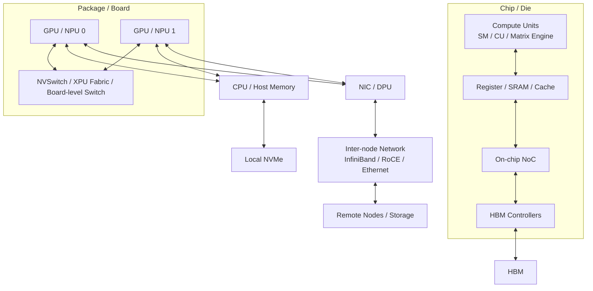

# 互连与通信架构：PCIe、NVLink、CXL、RDMA 与 NoC

AI 加速器不是孤立工作的。单个芯片里有计算单元、片上存储和 HBM；单台服务器里有多张 GPU/NPU、CPU、NIC、SSD；一个训练或推理集群里又有很多节点。只要模型、数据或 KV Cache 放不进一张卡，系统就必须通信。

互连与通信架构要回答的问题是：

> 数据从哪里到哪里？经过哪条链路？通信发生在训练或推理的哪一步？这条链路的带宽、延迟和拓扑是否匹配上层并行策略？

很多性能问题表面看是“GPU 利用率低”，本质是通信路径不合适：

- Tensor Parallel 放到了跨节点，层内 collective 被网络拖慢。
- MoE expert dispatch 产生大量 AllToAll，网络 bisection bandwidth 不够。
- Prefill/Decode 分离后，KV transfer 成为隐藏瓶颈。
- NIC 和 GPU 不在同一个 PCIe/NUMA 邻近域，GPU Direct RDMA 路径绕远。
- 节点内没有高速 GPU-to-GPU fabric，TP 通信让 Tensor Core 长时间等待。

所以互连不是附属硬件参数，而是 AI 系统可扩展性的核心约束。

## 一张总图

典型 AI 系统里，可以把互连分成几层：



从近到远，通常有这些通信域：

| 通信域 | 典型技术 | 主要问题 |
| --- | --- | --- |
| 片内 | NoC、crossbar、ring、mesh | 计算单元、cache、HBM controller 之间如何高效搬数据 |
| 封装内 / 板内 | chiplet interconnect、die-to-die link、NVLink 类链路 | 多 die、多 tile、多加速器之间的高带宽低延迟互连 |
| 设备本地 | HBM、L2、SRAM | 数据能否留在离计算最近的位置 |
| 节点内 GPU-to-GPU | NVLink、NVSwitch、PCIe P2P、厂商自研 fabric | TP、PP、EP、KV transfer 是否能走高速链路 |
| Host-to-device | PCIe、CXL、NVLink-C2C 等 | CPU、GPU、NIC、SSD、host memory 的 I/O 与一致性 |
| 节点间 | InfiniBand、RoCE、Ethernet、RDMA | 多机训练/推理的 collective、P2P、拥塞和尾延迟 |
| 远端存储 | NVMe-oF、对象存储、分布式文件系统 | 数据集、checkpoint、模型权重的吞吐和可靠性 |

越靠近计算单元，链路通常越快、越贵、容量越小、拓扑越受硬件固定约束。越远离计算单元，容量和扩展性更好，但延迟、拥塞、软件栈开销和不确定性更高。

## PCIe：通用 I/O 主干

PCIe 是服务器里最通用的高速 I/O 互连。GPU、NIC、NVMe SSD、DPU、FPGA 等设备通常通过 PCIe 接入 CPU root complex 或 PCIe switch。

在 AI 系统里，PCIe 常负责：

- CPU 与 GPU/NPU 之间的控制和数据搬运。
- Host memory 到 device memory 的 DMA。
- GPU 与 NIC 之间的 GPU Direct RDMA 路径。
- GPU 与 NVMe SSD 之间的数据路径。
- 没有专用 GPU fabric 时的 GPU P2P 通信。

PCIe 的优点是通用、生态成熟、设备丰富。缺点是它不是为高频 GPU-to-GPU 层内通信专门设计的。

需要特别关注三件事。

第一，PCIe 带宽是拓扑相关的。

同样是 `PCIe x16`，如果设备挂在不同 CPU socket、不同 root complex、不同 PCIe switch 下，实际路径可能完全不同。两个 GPU 看起来在一台机器里，但通信可能要经过 CPU socket 间互连，或者和 NIC 抢同一条上行链路。

第二，PCIe 适合 I/O，不一定适合每层都发生的 collective。

例如 Tensor Parallel 每个 Transformer layer 都可能产生 AllReduce、AllGather 或 ReduceScatter。如果这些通信走 PCIe，而不是节点内更高速的 GPU fabric，就很容易让矩阵单元等待通信。

第三，PCIe 设备亲和性会影响 RDMA。

多机训练常希望 GPU 直接通过 NIC 收发数据。如果 GPU 和 NIC 在 PCIe/NUMA 拓扑上离得很远，数据路径可能绕行，增加延迟并降低有效带宽。

排查 PCIe 问题时，不能只看设备型号，还要看：

- GPU、NIC、SSD 分别挂在哪个 CPU socket。
- 是否经过 PCIe switch。
- GPU P2P 是否可用。
- GPU Direct RDMA 是否走到预期路径。
- 多个设备是否共享同一上行带宽。
- NUMA 绑定和进程 rank 绑定是否合理。

## NVLink 与 NVSwitch：节点内 GPU 高速通信域

NVLink 是 NVIDIA GPU 之间的高速互连，NVSwitch 则把多张 GPU 组织成更接近全互联的高速交换域。类似思想也存在于其他厂商的 XPU fabric 或专用加速器互连中。

它们解决的问题是：

> 多张 GPU 参与同一个模型计算时，如何让 GPU-to-GPU 通信足够快，避免 Tensor Core 等待数据。

节点内高速 GPU fabric 对这些场景尤其关键：

- Tensor Parallel 的层内同步。
- Attention head 或 MLP 分片后的 AllGather / ReduceScatter。
- 大模型推理中的 TP synchronization。
- 多卡 MoE 的 expert dispatch / combine。
- Prefill/Decode 分离时的 KV Cache 迁移。
- Pipeline Parallel stage 间 activation 传递。

可以这样理解：

```text
PCIe 更像通用外设高速公路
NVLink/NVSwitch 更像 GPU 之间的专用快速路
```

如果一个通信模式发生频率很高、tensor 很大、直接阻塞下一层计算，就应该尽量放在最快的节点内 GPU fabric 上。

NVIDIA 关于 NVLink/NVSwitch 的公开资料中也强调，多 GPU 推理并不是每张 GPU 各算各的；TP 场景下，每层分片计算后还要把结果同步给其他 GPU，通信时间会直接让 Tensor Core 空等。因此，节点内 GPU-to-GPU 带宽和 all-to-all 交换能力会直接影响多 GPU 推理吞吐。

需要注意，`有 NVLink` 不等于 `所有 GPU pair 等价`。

实际系统可能存在：

- GPU 分成多个 NVLink island。
- 某些 pair 直连，某些 pair 需要中转。
- NVSwitch 域大小有限。
- 跨 tray、跨 baseboard、跨机柜时带宽和延迟不同。
- NCCL topology detection 与实际 rank mapping 不一致。

所以在多卡系统里，要把并行组映射到拓扑上：

- TP group 优先放在最快、最对称的 GPU 域。
- PP stage 间通信量相对低，可以放在次优链路。
- DP group 可以跨节点，因为 DP 通信通常按 step/bucket 发生，而不是每层都强依赖。
- EP/MoE group 要结合 AllToAll 通信量和专家负载分布决定。

## RDMA、InfiniBand 与 RoCE：跨节点高速网络

当模型训练或推理跨越多台服务器时，节点间网络就成为扩展效率的核心。

RDMA 的核心思想是让一台机器的网卡直接访问另一台机器的内存区域，尽量减少 CPU 参与和额外拷贝。对于 GPU 集群，还会进一步结合 GPU Direct RDMA，让 NIC 和 GPU memory 之间直接搬运数据。

在 AI 集群里，RDMA 主要承载：

- DDP / Data Parallel 的 gradient AllReduce。
- FSDP / ZeRO 的 parameter AllGather 和 gradient ReduceScatter。
- Tensor Parallel 跨节点 collective。
- MoE Expert Parallel 的 AllToAll。
- Pipeline Parallel 的跨节点 P2P activation。
- 推理 P/D 分离部署中的 KV transfer。
- 分布式 checkpoint 或参数同步相关流量。

InfiniBand 和 RoCE 都可以承载 RDMA。

| 技术 | 直觉 |
| --- | --- |
| InfiniBand | 专用高性能网络 fabric，常见于 HPC 和大规模 AI 训练集群 |
| RoCE | 在 Ethernet 上承载 RDMA，依赖数据中心以太网的无损/拥塞控制配置 |

InfiniBand 常被认为部署模型更专用，RoCE 则更容易与以太网生态结合，但对 PFC、ECN、拥塞控制、交换机 buffer、QoS 和运维一致性要求更高。实际选择不是单纯的带宽比较，而是看规模、成本、网络团队能力、故障域、可观测性和多租户隔离能力。

跨节点网络有三个常见陷阱。

第一，只看单链路带宽不够。

训练和 MoE 更关心 bisection bandwidth、拥塞、路径多样性和 collective 效率。单个 NIC 很快，不代表所有节点同时 AllToAll 时不会堵。

第二，平均带宽不等于尾延迟。

推理服务尤其关心 p95/p99。网络中的拥塞、重传、ECN/PFC 配置问题、队头阻塞，都可能让少量请求的 Decode 或 KV transfer 变慢。

第三，网络拓扑必须进入 rank mapping。

如果一个 DP/TP/EP group 跨越了不合适的机架、leaf/spine、rail 或 NIC，collective 可能走到很差的路径。拓扑感知 rank mapping 通常比单纯增加网卡更有效。

## CXL：一致性、内存扩展与资源池化

CXL 是面向 CPU、设备和内存扩展的开放互连标准。它基于 PCIe 物理层演进，并引入了更丰富的语义，例如设备访问 host memory、host 访问 device-attached memory，以及一致性相关能力。

对 AI 系统来说，CXL 的潜在价值主要在内存层次，而不是替代 HBM 做高频计算。

可能相关的方向包括：

- CPU 侧内存扩展。
- 内存池化和分层内存。
- 参数、KV Cache、embedding table 或冷数据的容量扩展。
- 多设备之间更灵活的一致性访问。
- DPU、SmartNIC、加速器和 host 之间更统一的内存语义。

但要避免一个误解：

> CXL memory 不等于 HBM。

HBM 靠近加速器计算单元，带宽和延迟面向高频 kernel 访问。CXL 连接的外部内存即使容量更大，也通常更远，延迟更高，带宽和访问粒度也不一定适合热路径。

所以 CXL 更适合思考：

- 哪些数据是 cold 或 warm，可以放到更远的内存层。
- 哪些访问可以异步预取。
- 哪些对象可以被多个设备共享。
- 哪些 offload 不会破坏端到端 latency。
- 软件 runtime 是否能感知这种内存层次。

在 AI 推理里，如果把高频 Decode 每步都要读的 KV Cache 随意放到远端层，可能省了 HBM 容量，却严重拉高 TPOT。更合理的方向是把热 KV 留在 HBM，把冷 KV、长尾 prefix、embedding 或大容量缓存分层管理。

## NoC 与 Chiplet Interconnect：片内和封装内的数据路径

NoC 是 Network-on-Chip，负责芯片内部各模块之间的数据移动。现代 AI 加速器里，计算单元、cache slice、memory controller、DMA engine、I/O block、chiplet tile 之间都需要互连。

片内互连影响的是更底层但非常关键的问题：

- 一个 compute tile 访问哪个 HBM controller 更近。
- L2 cache slice 是否均匀分布。
- 多个矩阵单元同时取数时是否争用 NoC。
- reduction、broadcast、barrier 是否有硬件支持。
- 多 die/chiplet 之间的访问是否有 NUMA-like 差异。
- HBM 带宽是否能被所有计算单元均匀利用。

Chiplet 让一个加速器可以由多个 die 组合而成，例如 compute die、I/O die、HBM controller die、interposer 上的多个 tile。好处是提升良率、扩展规模、复用 IP。代价是封装内互连变成性能和能效关键路径。

从软件侧看，NoC 和 chiplet interconnect 往往不会直接暴露成一个简单 API，但会通过这些现象表现出来：

- 某些 tensor layout 更快。
- 某些 tile/block shape 更适合硬件。
- 某些 collective 或 reduction 有特殊硬件加速。
- 某些显存访问 pattern 更容易打满 HBM。
- 某些跨 tile 通信会造成局部拥塞。

因此，做 kernel、compiler 或 runtime 优化时，不能只把加速器看成一个平坦的 FLOPS 机器。

## Collective 通信模式

AI 分布式系统中，最常见的不是普通 request/response，而是 collective。

| 模式 | 含义 | 常见场景 |
| --- | --- | --- |
| AllReduce | 每个 rank 都有一份输入，规约后每个 rank 都得到完整结果 | DDP 梯度同步、部分 TP 同步 |
| ReduceScatter | 先规约，再把结果分片给各 rank | ZeRO/FSDP gradient shard、部分 TP |
| AllGather | 每个 rank 有一片数据，收集后每个 rank 得到完整数据 | FSDP 参数收集、TP 输出拼接 |
| AllToAll | 每个 rank 都向每个 rank 发送不同数据 | MoE token dispatch/combine、专家并行 |
| Broadcast | 一个 rank 的数据发给其他 rank | 参数初始化、配置同步 |
| P2P Send/Recv | 点对点发送 | Pipeline stage activation、KV transfer |

这些通信的性能特征不同。

AllReduce 通常可以用 ring/tree/hierarchical 算法优化。AllGather 和 ReduceScatter 对 shard 大小、bucket size 和 group size 敏感。AllToAll 对网络 bisection bandwidth 和负载均衡极其敏感，因为它会让很多 rank 同时互相发送不同数据。

MoE 训练和推理中的 AllToAll 是典型例子：

1. Router 决定每个 token 去哪些 expert。
2. Token 根据 expert 所在 rank 被重新分发。
3. Expert 计算。
4. 结果再 combine 回原 rank。

如果路由不均衡，某些 expert 或某些 rank 会收到更多 token。即使平均带宽够，尾部 rank 仍然会拖慢整步。

## 并行策略与互连的匹配

并行策略不是纯软件选择，它必须匹配互连。

| 并行方式 | 主要通信 | 对互连的要求 |
| --- | --- | --- |
| Data Parallel | gradient AllReduce / ReduceScatter | 可跨节点，但要有足够网络带宽和 overlap |
| FSDP / ZeRO | parameter AllGather、gradient ReduceScatter | 通信频繁，bucket 和 prefetch 很关键 |
| Tensor Parallel | 层内 AllReduce / AllGather / ReduceScatter | 最好放在高速节点内 GPU fabric |
| Pipeline Parallel | stage 间 P2P activation | 延迟敏感，但通信频率低于 TP |
| Expert Parallel | token AllToAll | 对 bisection bandwidth、负载均衡、拓扑极敏感 |
| Sequence Parallel | activation 分片和同步 | 常和 TP 组合，依赖节点内链路 |
| P/D 分离推理 | KV transfer | 需要评估 KV 大小、传输频率和 TTFT/TPOT 影响 |

一个常见经验是：

- TP 优先放在节点内高速 GPU fabric。
- DP/FSDP 可以跨节点，但要做好通信重叠。
- EP/MoE 不能只看 expert 数量，还要看 AllToAll 跨越的拓扑范围。
- PP 可以用来跨节点切层，但要处理 pipeline bubble 和 stage balance。
- 长上下文推理要认真评估 KV Cache 迁移和跨卡读取成本。

反过来说，如果硬件拓扑已经固定，并行策略就不是随便组合的。

例如一台机器有 8 张 GPU，节点内 GPU fabric 很强，节点间网络相对弱：

- 适合把 TP group 放在 8 卡内或 4 卡内。
- 多节点用 DP/FSDP 扩展吞吐。
- 尽量避免跨节点 TP。
- MoE 的 EP group 如果跨节点，需要单独 benchmark AllToAll。

如果节点内没有高速 GPU fabric，只有 PCIe：

- TP size 不宜盲目增大。
- 大 batch 推理可能被 GPU-to-GPU 同步拖慢。
- 更适合用 DP 扩并发，或选择单卡/少卡模型切分。

## 拓扑与 Rank Mapping

拓扑决定“谁和谁离得近”。

需要关注的拓扑层次包括：

- GPU 与 GPU：NVLink、NVSwitch、PCIe P2P、是否同一 fabric domain。
- GPU 与 NIC：是否同 PCIe switch / root complex / NUMA node。
- GPU 与 CPU：host memory 访问是否跨 socket。
- NIC 与网络：是否多 rail，rail 是否对称。
- 节点与节点：是否同 leaf、同 rack、跨 spine、跨 pod。
- 存储与计算：checkpoint / dataset 是否跨网络瓶颈。

Rank mapping 的目标是让高频通信发生在近邻之间。

常见策略：

- 把同一个 TP group 映射到同一节点内的高速 GPU 域。
- 把同一个 PP stage 的上下游放在通信路径短的位置。
- 把 EP group 的 AllToAll 范围限制在网络更强的范围内，或做 hierarchical EP。
- 让每个 GPU 优先使用拓扑邻近的 NIC。
- 多 NIC 系统中，让不同 DP/TP/EP 流量分布到不同 rail。
- 避免一个 job 内部的重通信 group 横跨过多网络层级。

拓扑不匹配时，代码可能完全正确，但性能表现会很差。

## 通信性能指标

分析互连时，不应只看宣传页上的峰值带宽。

更实用的指标有：

| 指标 | 含义 |
| --- | --- |
| latency | 小消息或同步点等待时间 |
| bandwidth | 大消息持续传输速率 |
| effective bandwidth | 应用实际看到的有效带宽 |
| bisection bandwidth | 网络被切成两半时，两侧之间的总通信能力 |
| injection bandwidth | 单节点或单 GPU 向网络注入数据的能力 |
| collective efficiency | collective 实际性能相对理想值的比例 |
| exposed communication time | 没有被计算重叠隐藏的通信时间 |
| p95/p99 latency | 尾部请求或尾部 step 的通信延迟 |
| congestion | 多流量同时存在时的拥塞程度 |
| overlap ratio | 通信被计算覆盖的比例 |

训练中，最终要看：

- step time。
- tokens/s。
- MFU/HFU。
- scaling efficiency。
- communication time 占比。
- exposed communication time。

推理中，最终要看：

- TTFT。
- TPOT。
- output tokens/s。
- request throughput。
- p95/p99 latency。
- GPU utilization。
- KV transfer time。
- cache hit/miss 对通信的影响。

## Benchmark 方法

互连 benchmark 要分层做。

第一层是 microbenchmark。

常见测法包括：

- GPU P2P bandwidth / latency。
- GPU-to-NIC RDMA bandwidth。
- NCCL AllReduce / AllGather / ReduceScatter / AllToAll。
- 不同 message size 下的 latency 和 bandwidth。
- 单 NIC、多 NIC、多 rail 情况下的性能。
- 同节点、同 rack、跨 rack、跨 pod 对比。

这层可以回答：

> 这条链路、这个拓扑、这个 collective 的基本能力是多少？

第二层是 component benchmark。

针对具体 AI 组件测：

- TP layer synchronization。
- FSDP all-gather / reduce-scatter bucket。
- MoE dispatch/combine。
- PP activation send/recv。
- P/D KV transfer。
- checkpoint 写入和读取。

这层可以回答：

> 真实 tensor shape、真实并行组、真实 runtime 下，通信成本是多少？

第三层是 end-to-end benchmark。

训练看 step time、tokens/s、扩展效率和 loss curve 正确性。推理看 TTFT、TPOT、吞吐、尾延迟和成本。因为有些通信能被计算重叠，有些不能，只有端到端才能判断最终影响。

一个好的通信 benchmark 记录至少包括：

- 节点数、GPU 数、GPU/NIC 型号。
- PCIe/NVLink/NVSwitch/网络拓扑。
- driver、CUDA/ROCm、NCCL/RCCL/MPI 版本。
- rank mapping 和环境变量。
- collective 类型、message size、dtype。
- 并发 job 数、是否多租户。
- p50/p95/p99，而不只是平均值。
- 是否启用 overlap。
- 是否出现重试、拥塞、PFC pause、NCCL timeout。

## 常见优化方向

### 让高频通信留在最快的域

TP、部分 EP、KV transfer 这类高频通信应尽量留在节点内高速 fabric。跨节点通信更适合放 DP/FSDP 这类可以 bucket、overlap、分层处理的模式。

### 使用分层 collective

多节点系统常用 hierarchical collective：

1. 节点内先用 NVLink/NVSwitch 做局部规约。
2. 节点间再通过 IB/RoCE 做跨节点通信。
3. 节点内再广播或 scatter。

这通常比所有 rank 扁平通信更匹配硬件拓扑。

### 调整 bucket size 和 message size

小消息太多会被 latency 主导，大消息太大又可能拖延 overlap。DDP、FSDP、ZeRO、NCCL 等系统里的 bucket size 不是无关紧要的参数，它决定通信启动时机、重叠机会和链路利用率。

### 计算与通信重叠

如果通信在 critical path 上，就会直接增加 step time 或 TPOT。优化目标不是让通信“消失”，而是让通信尽量和计算同时发生。

训练中常见：

- backward 过程中逐 bucket AllReduce。
- FSDP forward 前预取下一层参数。
- reduce-scatter 和 backward 计算重叠。
- optimizer step 与通信/拷贝流水化。

推理中常见：

- P/D KV transfer 与后续调度重叠。
- 多 request batching 下隐藏部分传输。
- prefix cache 命中减少重复 prefill 通信。

### 拓扑感知 Rank Mapping

把通信强相关的 rank 放近，比盲目增加并行度更重要。

实践中要检查：

- `nvidia-smi topo -m` 或厂商等价工具。
- NCCL topology dump。
- GPU/NIC PCIe path。
- NUMA affinity。
- 多机 hostfile / rank order。
- Kubernetes、Slurm 或调度系统是否改变了设备顺序。

### 避免不必要的跨域数据移动

常见浪费包括：

- tensor 在 CPU 和 GPU 间来回搬。
- 日志、metric 或 debug hook 触发同步拷贝。
- checkpoint 每一步阻塞训练。
- 推理服务把中间状态搬到 host 再发给另一个 GPU。
- 多进程之间不能复用 device memory，只能复制。

优化前要先画出数据路径，确认每一次跨域移动是否必要。

### 为 MoE 和 AllToAll 做专门设计

MoE 的瓶颈往往不是单个 expert 计算，而是 token dispatch/combine。

优化方向包括：

- 控制 EP group 范围。
- 做 expert load balancing。
- 减少跨节点 expert 路由。
- 使用 hierarchical all-to-all。
- 对 token 做 reorder、packing、coalescing。
- 让 expert placement 和网络拓扑匹配。

MoE benchmark 必须单独看 AllToAll，而不能只看 dense 模型的 AllReduce。

### 网络拥塞与多租户隔离

大规模集群里，单 job benchmark 好，不代表多 job 同时跑也好。

需要关注：

- 多租户流量隔离。
- QoS。
- ECN / PFC / congestion control。
- rail 分配。
- checkpoint / storage 流量是否冲击训练网络。
- 推理东西向流量是否和训练 collective 抢网络。

AI workload 的网络流量经常是突发的、同步的、周期性的，比普通 Web 服务更容易在固定时间点制造拥塞。

## 常见误区

### 误区一：只看 FLOPS，不看互连

模型并行后，很多计算必须等待通信结果。互连慢时，增加 GPU 可能不会线性加速，甚至会变慢。

### 误区二：只看单卡 HBM，不看集群网络

训练大模型时，显存够只是第一步。参数、梯度、activation、optimizer state 被切分后，通信能否承受才决定扩展效率。

### 误区三：把 PCIe、NVLink、RDMA 当成可互换带宽

它们处在不同通信域，软件栈、拓扑、延迟、可达性和一致性语义都不同。不能只用 GB/s 数字横向比较。

### 误区四：忽略尾延迟

推理系统里，少数慢请求会影响用户体验和 SLO。网络抖动、拥塞和 KV transfer 尾延迟都需要单独观测。

### 误区五：认为 CXL 可以直接解决 HBM 不够

CXL 可以带来新的内存层次和共享方式，但热路径数据仍然要考虑延迟、带宽和访问频率。容量扩展不等于性能免费。

## 设计检查清单

设计或评估 AI 计算系统时，可以按下面顺序检查：

- 单卡内：算子是否主要受 HBM、SRAM、NoC 或计算单元限制。
- 节点内：TP/EP/PP/KV transfer 是否走最快 GPU fabric。
- Host-to-device：CPU、GPU、NIC、SSD 的 PCIe/NUMA 关系是否合理。
- 节点间：DP/FSDP/EP 通信是否匹配 IB/RoCE 带宽和拓扑。
- Rank mapping：高频通信 group 是否放在近邻。
- Collective：AllReduce、AllGather、ReduceScatter、AllToAll 分别测了吗。
- Overlap：通信是否真的被计算隐藏，还是暴露在 critical path。
- Tail latency：p95/p99 是否因为网络或 KV transfer 变差。
- 多租户：其他 job、checkpoint、存储流量是否影响训练/推理。
- 可观测性：是否能定位到 GPU、NIC、switch、collective、runtime 哪一层。

## 小结

AI 互连架构的核心不是记住每种链路的名字，而是建立路径意识：

```text
数据对象
  -> 所在位置
  -> 访问频率
  -> 通信模式
  -> 经过拓扑
  -> 是否阻塞 critical path
  -> 是否能 overlap 或缓存
```

当你看到一个训练或推理性能问题时，可以先问：

- 这一步到底在传什么。
- 从哪个 rank 到哪个 rank。
- 走 PCIe、NVLink、RDMA、CXL 还是片内 NoC。
- 是 AllReduce、AllGather、ReduceScatter、AllToAll 还是 P2P。
- 通信能不能被计算隐藏。
- 这个通信 group 是否映射到了正确拓扑。

能回答这些问题，就能把“网络慢”“多卡效率低”“GPU 利用率不高”转化为可验证、可优化的工程问题。

## 延伸阅读

- [NVIDIA NCCL Documentation](https://docs.nvidia.com/deeplearning/nccl/user-guide/docs/index.html)
- [NVIDIA NVLink and NVSwitch Supercharge Large Language Model Inference](https://developer.nvidia.com/blog/nvidia-nvlink-and-nvidia-nvswitch-supercharge-large-language-model-inference/)
- [NVIDIA Networking Documentation](https://docs.nvidia.com/networking/)
- [PCI-SIG PCI Express Specifications](https://pcisig.com/specifications)
- [Compute Express Link Consortium](https://computeexpresslink.org/)
