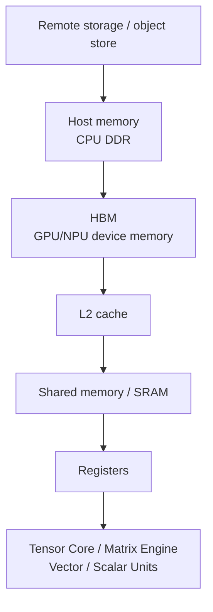

# 存储层次：HBM、SRAM、Cache 与数据复用

AI 加速器的真实性能，经常不是“算不动”，而是“数据送不到”。

矩阵单元可以很快，但它每次计算都需要输入数据。数据如果反复从 HBM 读取、写回，再读取、再写回，就会被内存带宽限制。很多高性能 kernel 的本质不是减少数学计算，而是减少数据搬运。

这一篇的核心问题是：

> 数据在哪一层存储？搬了几次？每搬一次能做多少有效计算？

理解这个问题，就能理解 FlashAttention、算子融合、KV Cache、HBM 容量、memory-bound kernel、Roofline 和很多 AI 芯片架构设计。

## 本篇和 Roofline 的关系

上一节 [AI 加速器性能模型：算力、带宽与 Roofline](performance-model-roofline.md) 解释了：

```text
attainable performance <= min(peak compute, bandwidth * arithmetic intensity)
```

本篇关注公式里的 `bytes moved` 从哪里来。

同一个数学算子，不同实现的 FLOPs 可能一样，但 bytes moved 完全不同：

```text
naive implementation:
  intermediate tensor 落 HBM，多次读写

IO-aware implementation:
  tile 放到片上存储，边算边归约，只写最终结果
```

因此存储层次不是“硬件背景知识”，而是决定 arithmetic intensity、energy/token、tokens/s 和 batch/context 上限的核心系统因素。

## 存储层次是什么

AI 加速器里，数据不是只有“显存”一层。

典型层次如下：

```text
Register
  -> Shared Memory / SRAM / Scratchpad
  -> L1 / L2 Cache
  -> HBM
  -> Host Memory
  -> Remote Memory / Storage / Network
```

越靠近计算单元：

- 速度越快。
- 带宽越高。
- 延迟越低。
- 容量越小。
- 管理越精细。

越远离计算单元：

- 容量越大。
- 延迟越高。
- 带宽越低。
- 能耗越高。

高性能 kernel 的基本策略是：

```text
把数据从慢层搬到快层
在快层尽可能多复用
只把最终必要结果写回慢层
```

## 一张简化图



每跨一层，都有代价。AI 系统优化的很多动作，本质都是减少跨层搬运。

## 三个维度：容量、带宽、延迟

每一层存储都要同时看三个维度。

| 维度 | 问题 | 典型影响 |
| --- | --- | --- |
| capacity | 放得下多少数据 | OOM、batch size、context length、KV Cache 并发 |
| bandwidth | 每秒能搬多少数据 | memory-bound kernel、Decode TPOT、optimizer step |
| latency | 单次访问要等多久 | small batch、random access、launch-bound 和 pointer chasing |

高性能 AI workload 往往不是单一受限。

例如 LLM decode：

- KV Cache capacity 决定能服务多少并发和上下文。
- HBM bandwidth 决定每步读取历史 KV 的速度。
- cache/TLB/block table 访问延迟影响 paged KV 的尾延迟。
- kernel launch 和调度会放大小 batch 的延迟问题。

所以不能只说“HBM 很大”或“带宽很高”。要把数据对象、访问频率和关键路径放在一起分析。

## Register

Register 是最靠近计算单元的存储。

特点：

- 速度最快。
- 每个线程或执行 lane 可用。
- 容量极小。
- 由编译器和硬件深度管理。

高性能 kernel 会把临时变量、accumulator、tile 内中间值放在 register 中。

问题是 register 太多会降低 occupancy。

例如一个 Triton matmul，如果 accumulator tile 太大：

- 每个 program 需要很多 register。
- 一个 SM 上能同时驻留的 program 变少。
- latency 隐藏能力下降。
- 甚至出现 register spill，把本该在 register 的数据溢出到更慢存储。

所以 tile 不是越大越好。大 tile 提高复用，但也会增加 register 压力。

## Register Spill 与 Local Memory

当一个 kernel 使用的 register 太多，编译器可能把部分变量 spill 到 local memory。

名字叫 local memory，但它通常不是“很近的本地存储”，而是会落到更慢的 memory path。结果是：

- 本应在 register 中的临时值变成额外 load/store。
- HBM 或 cache traffic 增加。
- latency 上升。
- occupancy 可能仍然不高。

常见原因：

- tile 太大，accumulator 太多。
- fusion 太激进，中间变量太多。
- per-thread array 或复杂索引让编译器无法放 register。
- unroll 太多。

排查时要看 profiler 或编译报告中的 register count、local memory、spill load/store。对 Triton/CUDA kernel 来说，register spill 经常是“看起来 fusion 了，但实际变慢”的原因之一。

## Shared Memory / SRAM / Scratchpad

Shared memory 或片上 SRAM 位于计算单元附近。

特点：

- 比 HBM 快得多。
- 容量远小于 HBM。
- 适合 tile 缓存和线程/warp 协作。
- 需要显式或半显式管理。

用途：

- 缓存 A/B tile。
- 做 reduction。
- 做 softmax 中间统计。
- 做 transpose / swizzle。
- 减少重复 HBM 读取。

FlashAttention 的关键思想之一，就是把 Q/K/V 的块搬到片上 SRAM，块内完成 attention 的一部分计算，避免完整 attention matrix 落到 HBM。

## Shared Memory 的代价：Bank Conflict 与容量压力

Shared memory/SRAM 很快，但也不是免费。

常见问题：

| 问题 | 表现 |
| --- | --- |
| bank conflict | 多个 lane 访问同一 bank，访问被序列化 |
| 容量不足 | tile 放不下，必须拆块或回到 HBM |
| 过度占用 | 每个 block 用太多 shared memory，resident blocks 下降 |
| 同步开销 | block 内协作需要 barrier |
| layout 不合适 | transpose/swizzle 额外复杂 |

高性能 kernel 常会做 swizzle、padding、double buffering、software pipeline，目的都是让片上存储访问更规则，并和计算重叠。

在 NVIDIA Hopper 等架构中，Tensor Memory Accelerator 这类机制用于更高效地把多维 tensor tile 在全局内存和 shared memory 之间搬运。系统直觉是：矩阵单元越快，越需要更强的 tile 搬运机制，否则计算单元会等数据。

## Async Copy、Double Buffering 与 Pipeline

Tile kernel 常用 pipeline：

```text
load tile k+1
compute tile k
store or prepare tile k-1
```

如果 load 和 compute 能重叠，就能隐藏一部分 HBM latency。

典型技术：

- async copy。
- double buffering。
- multi-stage software pipeline。
- prefetch。
- TMA / DMA-like tile movement。

限制：

- 需要额外 shared memory buffer。
- 增加调度和同步复杂度。
- 对访问模式和 tile shape 有要求。
- bandwidth 已经饱和时，overlap 也不能突破 roof。

因此 `num_stages`、tile size、shared memory layout 都是性能参数，不只是实现细节。

## L1 / L2 Cache

Cache 用来自动缓存最近使用的数据。

L1 更靠近 SM，L2 通常是 GPU 全局共享 cache。

Cache 有两个关键价值：

- 减少重复访问 HBM。
- 吸收一部分不规则访问。

但 cache 不是魔法。

如果访问模式完全随机，或者工作集远大于 cache，cache hit rate 仍然会低。

高性能 kernel 会尽量让访问模式有 locality：

- 连续访问。
- block/tile 访问。
- 重用同一 A/B tile。
- 减少无用 stride。
- 合理 program ordering。

Triton matmul 中的 grouped ordering，就是为了提升 L2 reuse。

## Cache 的真实作用

Cache 最适合处理有 locality 的访问。

常见 locality：

| 类型 | 例子 |
| --- | --- |
| temporal locality | 同一权重 tile 被多个 output tile 复用 |
| spatial locality | warp 内 lane 访问连续地址 |
| producer-consumer locality | 前一个 kernel 写，后一个 kernel 很快读 |
| cross-request locality | prefix cache、hot embedding、共享 prompt |

Cache 不擅长：

- 完全随机 gather。
- 工作集远大于 cache。
- stride 很大且无规律。
- 每次访问只用 cache line 中很小一部分。
- 多租户或多 stream 把 cache 不断冲掉。

所以优化 cache 通常不是“打开 cache”，而是改变访问顺序和 layout：

- grouped ordering。
- blocking/tiling。
- token/expert grouping。
- KV block locality。
- 减少无用 transpose/copy。
- 固定热数据驻留策略。

## HBM

HBM 是 AI 加速器最重要的片外高带宽内存。

它的作用：

- 保存模型权重。
- 保存 activation。
- 保存 optimizer state。
- 保存 KV Cache。
- 保存中间 tensor。
- 为 kernel 提供大容量数据来源。

HBM 同时有两个限制：

| 限制 | 影响 |
| --- | --- |
| capacity | 放不下模型、activation、optimizer、KV Cache 会 OOM |
| bandwidth | memory-bound 算子的速度受限 |

很多 AI 系统问题都能归到 HBM：

- 训练显存不够。
- 推理 KV Cache 放不下。
- Decode TPOT 被 KV Cache 读取拖慢。
- LayerNorm/Softmax/Embedding 吃不满计算单元。
- Optimizer step 读写大量 state。
- Attention 直接写完整 score matrix 导致 IO 过大。

## HBM 容量预算

做训练或推理系统设计时，先要做 HBM budget。

训练中常见对象：

```text
parameters
gradients
optimizer states
master weights
activations
temporary buffers
communication buffers
fragmentation / allocator reserve
```

推理中常见对象：

```text
model weights
KV Cache
batch runtime buffers
temporary attention/logits buffers
CUDA graph workspace
prefix cache
speculative decoding extra state
fragmentation / allocator reserve
```

如果不做预算，很容易出现：

- 理论 batch 能放下，实际被 temporary buffer 顶爆。
- KV Cache 估算只算 K/V tensor，没算 block table 和 allocator 碎片。
- 训练只算参数，没算 optimizer state 和 activation。
- 开启 CUDA Graph 或 compile 后 workspace 变大。

一个稳妥的 HBM 预算应该留 headroom。线上推理尤其不能把 HBM 打满，否则并发波动、长上下文和碎片会放大尾延迟。

## HBM 带宽预算

对 memory-bound 算子，要估算每 step/token 的 HBM traffic。

例子：AdamW optimizer step 可能读写：

```text
param read/write
grad read
m read/write
v read/write
master weight read/write
```

这意味着 optimizer 的 FLOPs 不高，但 bytes 很大。

例子：Decode KV Cache 读取：

```text
layers * active_requests * context_length * kv_heads * head_dim * dtype_bytes
```

每生成一个 token 都要读取与上下文相关的数据。上下文越长，HBM traffic 越大。

HBM bandwidth budget 能帮助判断：

- TPOT 是否被 KV Cache 读限制。
- optimizer step 是否 memory-bound。
- fusion 是否真的减少 bytes。
- 量化是否能降低带宽压力。
- 增加 compute peak 是否有意义。

## HBM 不是无限快

HBM 带宽很高，但矩阵单元峰值更高。

如果一个算子 arithmetic intensity 很低，即使 HBM 很快，也可能喂不饱计算单元。

例如 elementwise：

```text
读 x
读 y
写 z
只做一次加法
```

它每搬很多 bytes，只做很少 FLOPs，典型 memory-bound。

相比之下 GEMM：

```text
读 A tile
读 B tile
做很多乘加
写 C tile
```

数据复用高，更容易 compute-bound。

这就是为什么同一块 GPU 上，GEMM 的 TFLOP/s 可以很高，但 LayerNorm、Softmax、KV Cache 读取不会接近峰值 TFLOPS。

## Host Memory 与 Offload

Host memory 是 CPU 侧内存，容量通常比 GPU HBM 大，但带宽和延迟不适合高频 GPU 计算。

训练中常见 offload：

- optimizer state offload。
- parameter offload。
- activation offload。
- checkpoint staging。

推理中也可能出现：

- KV Cache offload。
- 权重分层加载。
- prefix cache / retrieval cache 在 CPU。

Offload 的本质是：

```text
用更大容量换更高访问延迟和更低带宽
```

是否值得，取决于：

- offload 数据访问频率。
- PCIe/NVLink/CXL 带宽。
- 是否能 prefetch。
- 是否能和计算重叠。
- 是否会阻塞关键路径。

不能因为 CPU 内存便宜，就把热数据随便 offload。

## Pinned Memory、UVM 与 Page Fault

Host memory 相关机制也会影响 AI 系统性能。

常见概念：

| 机制 | 用途 | 风险 |
| --- | --- | --- |
| pinned memory | 提高 CPU 到 GPU 拷贝效率 | 占用不可分页内存，过多会影响系统 |
| Unified Virtual Memory / managed memory | 让 CPU/GPU 共享地址空间 | page migration 可能造成不可预测延迟 |
| demand paging | 按需迁移页面 | page fault 在关键路径上会形成尖刺 |
| prefetch | 提前把数据迁移到目标设备 | 需要准确预测访问时机 |

训练 data pipeline 中，pinned memory 和异步 H2D copy 常用于隐藏输入传输。

但对 GPU 热路径来说，依赖 page fault 或临时迁移通常很危险。线上推理和长训练更需要显式管理数据位置，而不是把位置问题交给运行时“碰运气”。

## Remote Memory / Storage

远端存储包括：

- 网络文件系统。
- 对象存储。
- 分布式缓存。
- 远端 KV / embedding store。
- 远端 checkpoint。

这些层主要用于：

- 数据集。
- checkpoint。
- model artifact。
- RAG index。
- 冷缓存。
- 多节点共享数据。

它们不适合放在每个 step 或每个 token 的关键路径上，除非有足够缓存和 prefetch。

训练 data pipeline 慢、checkpoint 保存慢、RAG 检索抖动，都和远端存储有关。

## 远端存储不能进 token 关键路径

远端对象存储、网络文件系统、远端 KV/embedding store 通常适合作为冷层。

适合：

- dataset shard。
- checkpoint。
- model artifact。
- 离线 embedding index。
- 冷 prefix / response cache。

不适合：

- 每 token 都同步访问。
- 每 step 都阻塞读取。
- attention/KV 的细粒度随机访问。
- optimizer hot state。

如果必须使用远端数据，要通过：

- 本地 NVMe cache。
- host memory cache。
- 预取。
- 异步加载。
- request admission control。
- backpressure。
- 失败降级。

把远端访问放进关键路径，通常会把 GPU/NPU 变成等待网络或存储的昂贵空转资源。

## 数据复用是关键

性能优化的核心是数据复用。

数据复用可以发生在多个层面：

| 层面 | 例子 |
| --- | --- |
| Register reuse | accumulator 保持在 register |
| Shared memory reuse | matmul tile、attention tile |
| L2 reuse | program ordering、weight reuse |
| HBM reuse | weights 常驻 HBM、KV Cache 复用 |
| Host cache reuse | tokenizer cache、dataset cache |
| Remote cache reuse | object cache、artifact cache |

高效算子会让数据尽量在高带宽低延迟层多用几次。

低效算子经常是：

```text
load -> compute little -> store
load again -> compute little -> store again
```

这会被 HBM 带宽限制。

## 数据对象生命周期

理解数据复用，要先知道数据对象活多久、被谁使用。

| 数据对象 | 生命周期 | 优化方向 |
| --- | --- | --- |
| weights | 整个训练/推理任务 | 常驻 HBM、分片、量化、cache |
| activations | forward 到 backward | checkpointing、recompute、activation offload |
| gradients | backward 到 optimizer step | bucket、reduce-scatter、overlap |
| optimizer states | 整个训练任务 | sharding、低精度、offload |
| temporary buffers | 单个 kernel 或 op group | fusion、memory planning、buffer reuse |
| KV Cache | 请求生命周期 | paging、quantization、prefix reuse、eviction |
| input batch | 一个 step 或请求 | prefetch、pin memory、packing |
| checkpoint shard | save/resume 窗口 | async IO、manifest、two-phase commit |

不同生命周期对应不同存储层。

例如 temporary buffer 最好不落 HBM；activation 可以用重算换容量；KV Cache 必须高频读，通常不能随便放到远端。

## Temporary Buffer 与 Allocator

很多性能问题来自临时 buffer：

- attention score。
- logits。
- mask。
- layout conversion。
- communication staging buffer。
- workspace。
- quant/dequant temporary。

这些 buffer 可能只活很短时间，但峰值显存会被它们抬高。

编译器和 runtime 会尝试：

- buffer reuse。
- memory planning。
- fusion 消除中间 tensor。
- workspace cache。
- allocator pooling。

排查 OOM 时不要只看模型参数，还要看 peak memory 时刻有哪些 temporary buffer 同时存在。

## Attention 为什么受 IO 影响大

标准 attention 可以写成：

```text
QK^T -> score matrix
softmax(score)
softmax(score) @ V -> output
```

如果直接把 score matrix 写到 HBM：

- score 是 `seq_len x seq_len`。
- 长序列时非常大。
- softmax 又要再读写它。
- backward 还会更复杂。

FlashAttention 的论文明确指出：attention 的关键瓶颈在于 GPU memory hierarchy 中 HBM 和片上 SRAM 之间的读写。它通过 IO-aware tiling 减少 HBM 访问，并避免完整 attention matrix 落地。

系统直觉：

```text
普通实现:
  HBM 写 score
  HBM 读 score
  HBM 写 softmax
  HBM 读 softmax

FlashAttention:
  tile Q/K/V 到 SRAM
  块内在线 softmax
  累积输出
  只写最终 output
```

这就是存储层次优化的经典案例。

## Online Softmax 为什么能省 IO

普通 attention 如果先完整算出 score matrix，再 softmax，再乘 V，会让 `seq_len x seq_len` 中间结果落到 HBM。

FlashAttention 使用 online softmax 思路，让每个 tile 的 max、sum 和 output 累积可以分块更新。

直觉：

```text
读一块 Q
循环读取 K/V tile
更新当前行的 max 和 sum
更新 output accumulator
最后写 output
```

关键收益：

- 不写完整 score matrix。
- softmax 中间状态留在片上。
- HBM traffic 从“大中间矩阵”变成“必要的 Q/K/V/O 访问”。

这类优化体现了一个原则：

```text
算法写法可以改变 IO complexity
```

不是所有性能问题都靠硬件带宽解决，有时要改 kernel 算法。

## KV Cache 为什么吃 HBM

推理 Decode 阶段，每生成一个 token，都要读取历史 K/V。

对于长上下文：

```text
KV Cache size grows with:
  layers * batch * sequence_length * heads * head_dim * dtype_bytes
```

KV Cache 的问题有两个：

1. 容量：HBM 放不下太多请求或太长上下文。
2. 带宽：每步 Decode 要读历史 KV，容易 memory-bound。

所以推理系统会做：

- PagedAttention。
- KV Cache block 管理。
- KV Cache quantization。
- Prefix Cache。
- KV Cache offload。
- sliding window / attention sink。
- prefill/decode 分离。

这些都可以理解为围绕 HBM 容量和带宽做权衡。

## KV Cache Layout

KV Cache 不只是一个大 tensor。它的 layout 会影响容量、带宽、碎片和调度。

常见设计问题：

- K/V 分开存还是合并存。
- head-major、token-major、block-major 如何组织。
- block size 多大。
- MQA/GQA 的 KV head 数如何影响容量。
- page/block table 如何查找。
- contiguous batching 如何访问不同请求。
- eviction 和 prefix sharing 如何管理引用。
- 量化后的 scale metadata 放哪里。

Layout 不好会导致：

- 非连续读取。
- cache line 利用率低。
- block table 访问多。
- 内存碎片。
- prefix cache 命中后仍然拷贝很多数据。

PagedAttention 的核心价值之一就是把连续大块预留变成块式管理，减少 capacity 浪费；但它也引入了 block table 和间接寻址成本。工程上要同时看容量收益和访问开销。

## KV Cache 量化的带宽收益

KV Cache 量化可以降低：

- HBM capacity。
- HBM read bandwidth。
- cache footprint。

但要付出：

- scale metadata。
- quant/dequant 计算。
- 可能的精度损失。
- kernel 复杂度。
- 与 attention kernel layout 的耦合。

如果 decode 主要受 KV bandwidth 限制，KV Cache 量化可能显著改善 TPOT；如果瓶颈在 scheduler、launch 或网络，收益会有限。

## 算子融合为什么有效

假设有三个 elementwise op：

```python
y = gelu(x + bias)
z = dropout(y) + residual
```

不融合时可能：

```text
read x/bias -> write tmp1
read tmp1 -> write tmp2
read tmp2/residual -> write z
```

融合后：

```text
read x/bias/residual once
compute add/gelu/dropout/residual in one kernel
write z once
```

收益：

- 少读写 HBM。
- 少 kernel launch。
- 减少 allocator 压力。
- 减少中间 tensor。

代价：

- register pressure 上升。
- kernel 更复杂。
- 可能降低 occupancy。
- debugging 更难。

Fusion 的本质是用更多片上计算和寄存器压力，换更少 HBM traffic。

## Memory-bound 算子的典型优化

### LayerNorm / RMSNorm

特点：

- 读一行 hidden states。
- 做 reduction。
- 归一化。
- 写回。

优化：

- 一行尽量在一个 block 内处理。
- reduce 放在片上。
- 融合 residual / bias。
- 减少中间 tensor。
- 合理处理 hidden size。

### Softmax

特点：

- max reduction。
- exp。
- sum reduction。
- normalize。

优化：

- fused softmax。
- online softmax。
- 避免 score matrix 多次落 HBM。
- 对长行分块。

### Embedding

特点：

- 随机 gather。
- arithmetic intensity 低。
- cache hit 不稳定。

优化：

- cache 热 embedding。
- batch/group by index。
- table sharding。
- quantized embedding。
- 减少远端访问。

### Optimizer

AdamW step 要读写：

- parameter。
- gradient。
- first moment。
- second moment。
- master weight。

它可能非常 memory-bound。

优化：

- fused optimizer。
- foreach。
- optimizer state sharding。
- offload。
- low precision optimizer state。

## 容量与带宽的不同问题

HBM capacity 和 bandwidth 经常混在一起，但它们是不同瓶颈。

### 容量瓶颈

表现：

- OOM。
- batch 放不下。
- context 放不下。
- checkpoint 聚合 OOM。
- 多请求并发受限。

解决：

- ZeRO/FSDP。
- activation checkpointing。
- tensor/pipeline parallel。
- quantization。
- KV Cache paging。
- offload。
- 更大 HBM。

### 带宽瓶颈

表现：

- GPU 忙但 TFLOP/s 低。
- memory throughput 高。
- Tensor Core utilization 低。
- decode TPOT 慢。
- normalization/embedding/optimizer 占比高。

解决：

- fusion。
- data reuse。
- lower precision。
- layout optimization。
- cache blocking。
- prefetch。
- 减少无效读写。

容量够不代表带宽够；带宽高也不代表容量够。

## 数据布局

数据布局决定访问是否规则。

常见 layout 维度：

- row-major / column-major。
- contiguous / strided。
- channels-last。
- packed sequence。
- paged KV blocks。
- sharded tensors。
- expert token grouping。

不好的 layout 会导致：

- uncoalesced memory access。
- 多余 transpose。
- cache miss。
- scatter/gather。
- kernel fusion 被打断。

好的 layout 应该服务 workload：

- GEMM 需要矩阵连续和对齐。
- attention 需要 Q/K/V 访问顺序友好。
- KV Cache 需要 block 管理和调度友好。
- MoE 需要 token 按 expert grouped。

很多系统优化实际上是 layout 优化。

## Coalescing、Stride 与 Alignment

GPU/NPU 访存喜欢规则访问。

理想情况：

```text
lane 0 -> addr 0
lane 1 -> addr 1
lane 2 -> addr 2
...
```

这种访问可以合并成更少 memory transaction。

低效情况：

```text
lane 0 -> addr random_a
lane 1 -> addr random_b
lane 2 -> addr random_c
...
```

或者：

```text
lane 0 -> addr 0
lane 1 -> addr 4096
lane 2 -> addr 8192
...
```

这会导致：

- cache line 只用到一小部分。
- memory transaction 增多。
- L2 hit 下降。
- warp 等待不同地址。

常见优化：

- 调整 tensor layout。
- 让 inner dimension contiguous。
- 按 block 重排数据。
- 对齐到硬件友好边界。
- 提前 pack/unpack 到计算友好 layout。
- 用 fused kernel 避免来回 transpose。

Alignment 不是形式要求。对低精度 Tensor Core、vectorized load、cache line 和 memory transaction 来说，对齐常常决定能不能走高效路径。

## MoE 的 Token Grouping

MoE 的数据布局问题很典型。

原始 token 顺序通常按 batch/sequence 排列，但 expert GEMM 希望按 expert 分组：

```text
token order:
  t0, t1, t2, t3, ...

expert grouped:
  expert 0: tokens [...]
  expert 1: tokens [...]
  expert 2: tokens [...]
```

这个过程需要 dispatch、sort/permute、grouped GEMM、combine。

收益：

- 每个 expert 得到相对连续 token。
- grouped GEMM 更容易高效。
- expert weight 访问更局部。

代价：

- token permutation 读写。
- metadata。
- load imbalance。
- AllToAll。
- combine 再写回。

所以 MoE 性能经常受 layout 和 communication 限制，而不只是 expert GEMM FLOPs。

## Prefetch 和 Overlap

数据搬运不一定完全阻塞计算。

可以通过 prefetch 和 overlap 隐藏一部分延迟：

- H2D copy 与计算重叠。
- FSDP all-gather 预取参数。
- checkpoint 异步写入。
- KV offload 预取。
- pipeline stage 传输与计算重叠。
- Tensor Core 计算时预取下一 tile。

但 overlap 有前提：

- 后续计算不立即依赖数据。
- 有独立 stream / engine。
- 带宽没有被完全占满。
- 调度时机正确。
- buffer 生命周期清楚。

如果计算立即依赖数据，或者带宽已经饱和，overlap 效果有限。

## Activation Checkpointing 的存储视角

Activation checkpointing 本质是用更多计算换更少 activation 存储。

不使用 checkpointing：

```text
forward 保存大量 activation
backward 直接读取
```

使用 checkpointing：

```text
forward 少保存
backward 需要时重算一部分 forward
```

从存储层次看：

- HBM capacity 压力下降。
- HBM 中长期保存的 activation 减少。
- 计算量增加。
- backward timeline 改变。
- RNG/dropout 语义要保持一致。

它适合 capacity-bound 训练，但如果已经 compute-bound，过多 checkpointing 会拖慢 step time。

## ZeRO / FSDP 的存储视角

ZeRO/FSDP 把参数、梯度、optimizer state 分片，减少每卡 HBM 占用。

但它引入通信：

```text
forward/backward 前 all-gather parameter
backward 后 reduce-scatter gradient
optimizer state 分片更新
```

从存储层次看，这是把：

```text
每卡 HBM capacity 压力
```

转成：

```text
网络带宽/延迟压力 + runtime prefetch/overlap 问题
```

是否划算取决于：

- 模型是否放得下。
- all-gather/reduce-scatter 是否能 overlap。
- 网络是否足够快。
- shard 和 bucket 粒度是否合理。
- checkpoint/resume 是否支持 sharded state。

所以 memory optimization 往往会移动瓶颈，不一定消灭瓶颈。

## Memory Hierarchy 和编译器

编译器和 kernel 负责把高层计算映射到存储层次。

它们要决定：

- 哪些数据放 register。
- 哪些 tile 放 shared memory。
- 哪些中间结果不落 HBM。
- 哪些 op fusion。
- 哪些 layout 需要转换。
- 是否预取。
- 是否使用 cache hint。
- 是否使用 Tensor Core。

Triton、TorchInductor、XLA、TVM、CUTLASS、FlashAttention 都在不同层面做这些决策。

如果 generated kernel 没有利用片上存储，或者生成了大量中间 tensor，硬件 HBM 再快也会被浪费。

## Memory Planning 与 Compile

`torch.compile`、XLA、TVM 等编译器会尝试做 memory planning。

目标：

- 复用生命周期不重叠的 buffer。
- 消除不必要中间 tensor。
- 把多个 op fused 到同一 kernel。
- 选择更合适的 layout。
- 降低 allocator overhead。

限制：

- graph break 会切断 planning。
- dynamic shape 让 buffer size 难提前确定。
- alias/in-place mutation 会限制复用。
- distributed runtime 会插入通信 buffer。
- custom op 可能让编译器看不见内部内存行为。

因此内存优化和编译优化高度相关。调 `torch.compile` 或 Triton kernel 时，除了看 kernel 时间，也要看 peak memory、allocation count、copy kernel 和 generated layout。

## Benchmark 怎么看存储瓶颈

### 指标

关注：

- achieved memory bandwidth。
- L2 hit rate。
- DRAM read/write bytes。
- register usage。
- shared memory usage。
- occupancy。
- memory stall。
- kernel duration。
- end-to-end step time。

### 工具

- Nsight Compute。
- Nsight Systems。
- PyTorch Profiler。
- vendor profiler。
- DCGM / GPU telemetry。

### 对比

做三类对比：

| 对比 | 目的 |
| --- | --- |
| eager vs fused | 看中间 tensor 读写是否减少 |
| normal attention vs FlashAttention | 看 HBM IO 是否下降 |
| full precision vs quantized KV | 看容量/带宽收益 |
| synthetic data vs real data | 看数据输入层是否拖慢 |
| no offload vs offload | 看容量收益是否被传输延迟抵消 |

只看 GPU utilization 不够，要看 bytes、bandwidth 和 timeline。

## Profiler 证据怎么解释

可以把 profiler 指标映射到问题。

| 现象 | 可能原因 | 优先动作 |
| --- | --- | --- |
| DRAM throughput 高，Tensor Core utilization 低 | memory-bound | fusion、低精度、layout、tiling |
| L2 hit rate 低 | 复用差或访问随机 | grouped ordering、blocking、重排数据 |
| local memory / spill 高 | register 不够 | 减小 tile、拆 fusion、减少中间变量 |
| shared memory bank conflict 高 | 片上 layout 不佳 | padding、swizzle、改访问模式 |
| copy/transpose kernel 多 | layout 不稳定 | 统一 layout、fused conversion、避免来回转换 |
| allocator 时间高 | 临时 buffer 多 | memory planning、buffer reuse、预分配 |
| H2D/D2H 拷贝阻塞 | 输入或 offload 在关键路径 | pin memory、prefetch、overlap、减少 offload |
| checkpoint IO 暴露 | 存储写入阻塞训练 | async checkpoint、分片、限流 |
| p99 TPOT 高 | KV Cache 或远端访问抖动 | KV layout、admission control、cache、减少 page fault |

Profiler 的关键不是收集更多图，而是形成证据链：

```text
哪个数据对象
在哪一层存储
每次访问多少 bytes
是否在关键路径
优化后 bytes / timeline 是否下降
端到端指标是否改善
```

## 硬件设计的几个反问

评估或设计 AI 加速器存储层次时，可以反问：

- HBM capacity 是否匹配目标模型、batch、context 和 KV Cache？
- HBM bandwidth 与 compute peak 是否平衡？
- L2/cache 容量是否能覆盖关键 weight/KV/tile 工作集？
- 片上 SRAM/shared memory 是否足够支持目标 tile 和 pipeline？
- 是否有高效的全局内存到片上存储搬运机制？
- gather/scatter 和不规则访问性能如何？
- 低精度是否同时降低 compute bytes、memory bytes 和 communication bytes？
- CPU/host/offload 路径是否能 prefetch 和 overlap？
- 多租户或多 stream 是否会造成 cache 互相干扰？
- profiler 是否能暴露 bytes、cache、spill、bank conflict、copy kernel？

这些问题比单纯比较 HBM GB/s 更接近真实架构能力。

## 常见误区

### 误区一：HBM 带宽高，所以 memory-bound 不是问题

不对。AI 加速器计算峰值增长很快，很多低 arithmetic intensity 算子仍然会被 HBM 限制。

### 误区二：显存容量够就说明内存没问题

容量够只能说明放得下，不说明搬得快。

### 误区三：Cache 会自动解决重复访问

不一定。访问模式、工作集大小、layout 和 program ordering 都影响 cache 命中。

### 误区四：Offload 一定能省钱

Offload 省 HBM capacity，但可能增加延迟和带宽压力。热数据 offload 可能直接拖慢关键路径。

### 误区五：Fusion 越多越好

不一定。Fusion 减少 HBM IO，但可能增加 register pressure、降低 occupancy，甚至破坏高效库路径。

### 误区六：Offload 只影响容量，不影响性能

不对。Offload 会引入 host memory、PCIe/NVLink/CXL、page migration、prefetch 和同步问题。热数据 offload 往往会直接影响 step time 或 TPOT。

### 误区七：KV Cache 只是显存容量问题

不对。KV Cache 同时是 capacity、bandwidth、layout、fragmentation、scheduler 和 tail latency 问题。

## 设计检查清单

分析存储层次时，可以逐项确认：

- 主要数据对象有哪些？
- 它们分别在 register、SRAM/cache、HBM、CPU memory 还是远端存储？
- 每个 step/token 读写多少 bytes？
- arithmetic intensity 是高还是低？
- 是 capacity-bound 还是 bandwidth-bound？
- 是否有中间 tensor 落 HBM？
- 是否能 fusion？
- 是否有 repeated load？
- cache hit rate 如何？
- layout 是否连续？
- scatter/gather 是否过多？
- KV Cache 是否成为 HBM 容量或带宽瓶颈？
- KV Cache layout、block size、page table、scale metadata 是否合理？
- offload 是否在关键路径？
- 是否存在 UVM/page fault 或同步 H2D/D2H copy？
- prefetch/overlap 是否有效？
- shared memory 是否有 bank conflict？
- register spill 是否明显？
- copy/transpose/layout conversion kernel 是否过多？
- temporary buffer 是否造成 peak memory？
- compiler memory planning 是否被 graph break、dynamic shape 或 alias 限制？
- profiler 是否证明瓶颈来自数据搬运？

## 小结

AI 加速器的性能不只由计算单元决定，还由数据能否高效进入计算单元决定。

关键结论：

- 存储层次越靠近计算单元越快，但容量越小。
- HBM 是容量和带宽的核心瓶颈之一。
- Register spill、shared memory bank conflict、cache miss、layout copy 都可能让“片上复用”失效。
- 数据复用是提高 arithmetic intensity 的关键。
- FlashAttention、算子融合、tiling、KV Cache 管理都可以用存储层次解释。
- Capacity-bound、bandwidth-bound、latency-bound 和 IO-bound 是不同问题。
- Offload、prefetch、fusion、layout 优化都必须用 profiler 和端到端指标验证。
- 训练 activation/optimizer、推理 KV Cache、MoE dispatch、远端存储和 checkpoint 都是不同生命周期的数据管理问题。

理解存储层次后，再看 Triton、TorchInductor、FlashAttention、PagedAttention、FSDP/ZeRO 和硬件架构，很多优化为什么有效会变得更清楚。

## 参考资料

- [NVIDIA CUDA C Programming Guide](https://docs.nvidia.com/cuda/cuda-c-programming-guide/index.html)
- [NVIDIA: Hopper Architecture In-Depth](https://developer.nvidia.com/blog/nvidia-hopper-architecture-in-depth/)
- [NVIDIA GPUDirect Storage Documentation](https://docs.nvidia.com/gpudirect-storage/)
- [FlashAttention: Fast and Memory-Efficient Exact Attention with IO-Awareness](https://arxiv.org/abs/2205.14135)
- [The I/O Complexity of Attention, or How Optimal is Flash Attention?](https://arxiv.org/abs/2402.07443)
- [Roofline: An Insightful Visual Performance Model for Multicore Architectures](https://dl.acm.org/doi/10.1145/1498765.1498785)
