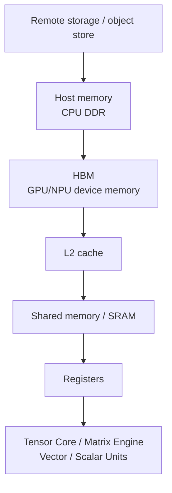

# 存储层次：HBM、SRAM、Cache 与数据复用

AI 加速器的真实性能，经常不是“算不动”，而是“数据送不到”。

矩阵单元可以很快，但它每次计算都需要输入数据。数据如果反复从 HBM 读取、写回，再读取、再写回，就会被内存带宽限制。很多高性能 kernel 的本质不是减少数学计算，而是减少数据搬运。

这一篇的核心问题是：

> 数据在哪一层存储？搬了几次？每搬一次能做多少有效计算？

理解这个问题，就能理解 FlashAttention、算子融合、KV Cache、HBM 容量、memory-bound kernel、Roofline 和很多 AI 芯片架构设计。

## 存储层次是什么

AI 加速器里，数据不是只有“显存”一层。

典型层次如下：

```text
Register
  -> Shared Memory / SRAM / Scratchpad
  -> L1 / L2 Cache
  -> HBM
  -> Host Memory
  -> Remote Memory / Storage / Network
```

越靠近计算单元：

- 速度越快。
- 带宽越高。
- 延迟越低。
- 容量越小。
- 管理越精细。

越远离计算单元：

- 容量越大。
- 延迟越高。
- 带宽越低。
- 能耗越高。

高性能 kernel 的基本策略是：

```text
把数据从慢层搬到快层
在快层尽可能多复用
只把最终必要结果写回慢层
```

## 一张简化图



每跨一层，都有代价。AI 系统优化的很多动作，本质都是减少跨层搬运。

## Register

Register 是最靠近计算单元的存储。

特点：

- 速度最快。
- 每个线程或执行 lane 可用。
- 容量极小。
- 由编译器和硬件深度管理。

高性能 kernel 会把临时变量、accumulator、tile 内中间值放在 register 中。

问题是 register 太多会降低 occupancy。

例如一个 Triton matmul，如果 accumulator tile 太大：

- 每个 program 需要很多 register。
- 一个 SM 上能同时驻留的 program 变少。
- latency 隐藏能力下降。
- 甚至出现 register spill，把本该在 register 的数据溢出到更慢存储。

所以 tile 不是越大越好。大 tile 提高复用，但也会增加 register 压力。

## Shared Memory / SRAM / Scratchpad

Shared memory 或片上 SRAM 位于计算单元附近。

特点：

- 比 HBM 快得多。
- 容量远小于 HBM。
- 适合 tile 缓存和线程/warp 协作。
- 需要显式或半显式管理。

用途：

- 缓存 A/B tile。
- 做 reduction。
- 做 softmax 中间统计。
- 做 transpose / swizzle。
- 减少重复 HBM 读取。

FlashAttention 的关键思想之一，就是把 Q/K/V 的块搬到片上 SRAM，块内完成 attention 的一部分计算，避免完整 attention matrix 落到 HBM。

## L1 / L2 Cache

Cache 用来自动缓存最近使用的数据。

L1 更靠近 SM，L2 通常是 GPU 全局共享 cache。

Cache 有两个关键价值：

- 减少重复访问 HBM。
- 吸收一部分不规则访问。

但 cache 不是魔法。

如果访问模式完全随机，或者工作集远大于 cache，cache hit rate 仍然会低。

高性能 kernel 会尽量让访问模式有 locality：

- 连续访问。
- block/tile 访问。
- 重用同一 A/B tile。
- 减少无用 stride。
- 合理 program ordering。

Triton matmul 中的 grouped ordering，就是为了提升 L2 reuse。

## HBM

HBM 是 AI 加速器最重要的片外高带宽内存。

它的作用：

- 保存模型权重。
- 保存 activation。
- 保存 optimizer state。
- 保存 KV Cache。
- 保存中间 tensor。
- 为 kernel 提供大容量数据来源。

HBM 同时有两个限制：

| 限制 | 影响 |
| --- | --- |
| capacity | 放不下模型、activation、optimizer、KV Cache 会 OOM |
| bandwidth | memory-bound 算子的速度受限 |

很多 AI 系统问题都能归到 HBM：

- 训练显存不够。
- 推理 KV Cache 放不下。
- Decode TPOT 被 KV Cache 读取拖慢。
- LayerNorm/Softmax/Embedding 吃不满计算单元。
- Optimizer step 读写大量 state。
- Attention 直接写完整 score matrix 导致 IO 过大。

## HBM 不是无限快

HBM 带宽很高，但矩阵单元峰值更高。

如果一个算子 arithmetic intensity 很低，即使 HBM 很快，也可能喂不饱计算单元。

例如 elementwise：

```text
读 x
读 y
写 z
只做一次加法
```

它每搬很多 bytes，只做很少 FLOPs，典型 memory-bound。

相比之下 GEMM：

```text
读 A tile
读 B tile
做很多乘加
写 C tile
```

数据复用高，更容易 compute-bound。

这就是为什么同一块 GPU 上，GEMM 的 TFLOP/s 可以很高，但 LayerNorm、Softmax、KV Cache 读取不会接近峰值 TFLOPS。

## Host Memory 与 Offload

Host memory 是 CPU 侧内存，容量通常比 GPU HBM 大，但带宽和延迟不适合高频 GPU 计算。

训练中常见 offload：

- optimizer state offload。
- parameter offload。
- activation offload。
- checkpoint staging。

推理中也可能出现：

- KV Cache offload。
- 权重分层加载。
- prefix cache / retrieval cache 在 CPU。

Offload 的本质是：

```text
用更大容量换更高访问延迟和更低带宽
```

是否值得，取决于：

- offload 数据访问频率。
- PCIe/NVLink/CXL 带宽。
- 是否能 prefetch。
- 是否能和计算重叠。
- 是否会阻塞关键路径。

不能因为 CPU 内存便宜，就把热数据随便 offload。

## Remote Memory / Storage

远端存储包括：

- 网络文件系统。
- 对象存储。
- 分布式缓存。
- 远端 KV / embedding store。
- 远端 checkpoint。

这些层主要用于：

- 数据集。
- checkpoint。
- model artifact。
- RAG index。
- 冷缓存。
- 多节点共享数据。

它们不适合放在每个 step 或每个 token 的关键路径上，除非有足够缓存和 prefetch。

训练 data pipeline 慢、checkpoint 保存慢、RAG 检索抖动，都和远端存储有关。

## 数据复用是关键

性能优化的核心是数据复用。

数据复用可以发生在多个层面：

| 层面 | 例子 |
| --- | --- |
| Register reuse | accumulator 保持在 register |
| Shared memory reuse | matmul tile、attention tile |
| L2 reuse | program ordering、weight reuse |
| HBM reuse | weights 常驻 HBM、KV Cache 复用 |
| Host cache reuse | tokenizer cache、dataset cache |
| Remote cache reuse | object cache、artifact cache |

高效算子会让数据尽量在高带宽低延迟层多用几次。

低效算子经常是：

```text
load -> compute little -> store
load again -> compute little -> store again
```

这会被 HBM 带宽限制。

## Attention 为什么受 IO 影响大

标准 attention 可以写成：

```text
QK^T -> score matrix
softmax(score)
softmax(score) @ V -> output
```

如果直接把 score matrix 写到 HBM：

- score 是 `seq_len x seq_len`。
- 长序列时非常大。
- softmax 又要再读写它。
- backward 还会更复杂。

FlashAttention 的论文明确指出：attention 的关键瓶颈在于 GPU memory hierarchy 中 HBM 和片上 SRAM 之间的读写。它通过 IO-aware tiling 减少 HBM 访问，并避免完整 attention matrix 落地。

系统直觉：

```text
普通实现:
  HBM 写 score
  HBM 读 score
  HBM 写 softmax
  HBM 读 softmax

FlashAttention:
  tile Q/K/V 到 SRAM
  块内在线 softmax
  累积输出
  只写最终 output
```

这就是存储层次优化的经典案例。

## KV Cache 为什么吃 HBM

推理 Decode 阶段，每生成一个 token，都要读取历史 K/V。

对于长上下文：

```text
KV Cache size grows with:
  layers * batch * sequence_length * heads * head_dim * dtype_bytes
```

KV Cache 的问题有两个：

1. 容量：HBM 放不下太多请求或太长上下文。
2. 带宽：每步 Decode 要读历史 KV，容易 memory-bound。

所以推理系统会做：

- PagedAttention。
- KV Cache block 管理。
- KV Cache quantization。
- Prefix Cache。
- KV Cache offload。
- sliding window / attention sink。
- prefill/decode 分离。

这些都可以理解为围绕 HBM 容量和带宽做权衡。

## 算子融合为什么有效

假设有三个 elementwise op：

```python
y = gelu(x + bias)
z = dropout(y) + residual
```

不融合时可能：

```text
read x/bias -> write tmp1
read tmp1 -> write tmp2
read tmp2/residual -> write z
```

融合后：

```text
read x/bias/residual once
compute add/gelu/dropout/residual in one kernel
write z once
```

收益：

- 少读写 HBM。
- 少 kernel launch。
- 减少 allocator 压力。
- 减少中间 tensor。

代价：

- register pressure 上升。
- kernel 更复杂。
- 可能降低 occupancy。
- debugging 更难。

Fusion 的本质是用更多片上计算和寄存器压力，换更少 HBM traffic。

## Memory-bound 算子的典型优化

### LayerNorm / RMSNorm

特点：

- 读一行 hidden states。
- 做 reduction。
- 归一化。
- 写回。

优化：

- 一行尽量在一个 block 内处理。
- reduce 放在片上。
- 融合 residual / bias。
- 减少中间 tensor。
- 合理处理 hidden size。

### Softmax

特点：

- max reduction。
- exp。
- sum reduction。
- normalize。

优化：

- fused softmax。
- online softmax。
- 避免 score matrix 多次落 HBM。
- 对长行分块。

### Embedding

特点：

- 随机 gather。
- arithmetic intensity 低。
- cache hit 不稳定。

优化：

- cache 热 embedding。
- batch/group by index。
- table sharding。
- quantized embedding。
- 减少远端访问。

### Optimizer

AdamW step 要读写：

- parameter。
- gradient。
- first moment。
- second moment。
- master weight。

它可能非常 memory-bound。

优化：

- fused optimizer。
- foreach。
- optimizer state sharding。
- offload。
- low precision optimizer state。

## 容量与带宽的不同问题

HBM capacity 和 bandwidth 经常混在一起，但它们是不同瓶颈。

### 容量瓶颈

表现：

- OOM。
- batch 放不下。
- context 放不下。
- checkpoint 聚合 OOM。
- 多请求并发受限。

解决：

- ZeRO/FSDP。
- activation checkpointing。
- tensor/pipeline parallel。
- quantization。
- KV Cache paging。
- offload。
- 更大 HBM。

### 带宽瓶颈

表现：

- GPU 忙但 TFLOP/s 低。
- memory throughput 高。
- Tensor Core utilization 低。
- decode TPOT 慢。
- normalization/embedding/optimizer 占比高。

解决：

- fusion。
- data reuse。
- lower precision。
- layout optimization。
- cache blocking。
- prefetch。
- 减少无效读写。

容量够不代表带宽够；带宽高也不代表容量够。

## 数据布局

数据布局决定访问是否规则。

常见 layout 维度：

- row-major / column-major。
- contiguous / strided。
- channels-last。
- packed sequence。
- paged KV blocks。
- sharded tensors。
- expert token grouping。

不好的 layout 会导致：

- uncoalesced memory access。
- 多余 transpose。
- cache miss。
- scatter/gather。
- kernel fusion 被打断。

好的 layout 应该服务 workload：

- GEMM 需要矩阵连续和对齐。
- attention 需要 Q/K/V 访问顺序友好。
- KV Cache 需要 block 管理和调度友好。
- MoE 需要 token 按 expert grouped。

很多系统优化实际上是 layout 优化。

## Prefetch 和 Overlap

数据搬运不一定完全阻塞计算。

可以通过 prefetch 和 overlap 隐藏一部分延迟：

- H2D copy 与计算重叠。
- FSDP all-gather 预取参数。
- checkpoint 异步写入。
- KV offload 预取。
- pipeline stage 传输与计算重叠。
- Tensor Core 计算时预取下一 tile。

但 overlap 有前提：

- 后续计算不立即依赖数据。
- 有独立 stream / engine。
- 带宽没有被完全占满。
- 调度时机正确。
- buffer 生命周期清楚。

如果计算立即依赖数据，或者带宽已经饱和，overlap 效果有限。

## Memory Hierarchy 和编译器

编译器和 kernel 负责把高层计算映射到存储层次。

它们要决定：

- 哪些数据放 register。
- 哪些 tile 放 shared memory。
- 哪些中间结果不落 HBM。
- 哪些 op fusion。
- 哪些 layout 需要转换。
- 是否预取。
- 是否使用 cache hint。
- 是否使用 Tensor Core。

Triton、TorchInductor、XLA、TVM、CUTLASS、FlashAttention 都在不同层面做这些决策。

如果 generated kernel 没有利用片上存储，或者生成了大量中间 tensor，硬件 HBM 再快也会被浪费。

## Benchmark 怎么看存储瓶颈

### 指标

关注：

- achieved memory bandwidth。
- L2 hit rate。
- DRAM read/write bytes。
- register usage。
- shared memory usage。
- occupancy。
- memory stall。
- kernel duration。
- end-to-end step time。

### 工具

- Nsight Compute。
- Nsight Systems。
- PyTorch Profiler。
- vendor profiler。
- DCGM / GPU telemetry。

### 对比

做三类对比：

| 对比 | 目的 |
| --- | --- |
| eager vs fused | 看中间 tensor 读写是否减少 |
| normal attention vs FlashAttention | 看 HBM IO 是否下降 |
| full precision vs quantized KV | 看容量/带宽收益 |
| synthetic data vs real data | 看数据输入层是否拖慢 |
| no offload vs offload | 看容量收益是否被传输延迟抵消 |

只看 GPU utilization 不够，要看 bytes、bandwidth 和 timeline。

## 常见误区

### 误区一：HBM 带宽高，所以 memory-bound 不是问题

不对。AI 加速器计算峰值增长很快，很多低 arithmetic intensity 算子仍然会被 HBM 限制。

### 误区二：显存容量够就说明内存没问题

容量够只能说明放得下，不说明搬得快。

### 误区三：Cache 会自动解决重复访问

不一定。访问模式、工作集大小、layout 和 program ordering 都影响 cache 命中。

### 误区四：Offload 一定能省钱

Offload 省 HBM capacity，但可能增加延迟和带宽压力。热数据 offload 可能直接拖慢关键路径。

### 误区五：Fusion 越多越好

不一定。Fusion 减少 HBM IO，但可能增加 register pressure、降低 occupancy，甚至破坏高效库路径。

## 设计检查清单

分析存储层次时，可以逐项确认：

- 主要数据对象有哪些？
- 它们分别在 register、SRAM/cache、HBM、CPU memory 还是远端存储？
- 每个 step/token 读写多少 bytes？
- arithmetic intensity 是高还是低？
- 是 capacity-bound 还是 bandwidth-bound？
- 是否有中间 tensor 落 HBM？
- 是否能 fusion？
- 是否有 repeated load？
- cache hit rate 如何？
- layout 是否连续？
- scatter/gather 是否过多？
- KV Cache 是否成为 HBM 容量或带宽瓶颈？
- offload 是否在关键路径？
- prefetch/overlap 是否有效？
- profiler 是否证明瓶颈来自数据搬运？

## 小结

AI 加速器的性能不只由计算单元决定，还由数据能否高效进入计算单元决定。

关键结论：

- 存储层次越靠近计算单元越快，但容量越小。
- HBM 是容量和带宽的核心瓶颈之一。
- 数据复用是提高 arithmetic intensity 的关键。
- FlashAttention、算子融合、tiling、KV Cache 管理都可以用存储层次解释。
- Capacity-bound 和 bandwidth-bound 是不同问题。
- Offload、prefetch、fusion、layout 优化都必须用 profiler 和端到端指标验证。

理解存储层次后，再看 Triton、TorchInductor、FlashAttention、PagedAttention、FSDP/ZeRO 和硬件架构，很多优化为什么有效会变得更清楚。

## 参考资料

- [NVIDIA CUDA C Programming Guide](https://docs.nvidia.com/cuda/cuda-c-programming-guide/index.html)
- [NVIDIA: Hopper Architecture In-Depth](https://developer.nvidia.com/blog/nvidia-hopper-architecture-in-depth/)
- [FlashAttention: Fast and Memory-Efficient Exact Attention with IO-Awareness](https://arxiv.org/abs/2205.14135)
- [The I/O Complexity of Attention, or How Optimal is Flash Attention?](https://arxiv.org/abs/2402.07443)
- [Roofline: An Insightful Visual Performance Model for Multicore Architectures](https://dl.acm.org/doi/10.1145/1498765.1498785)
