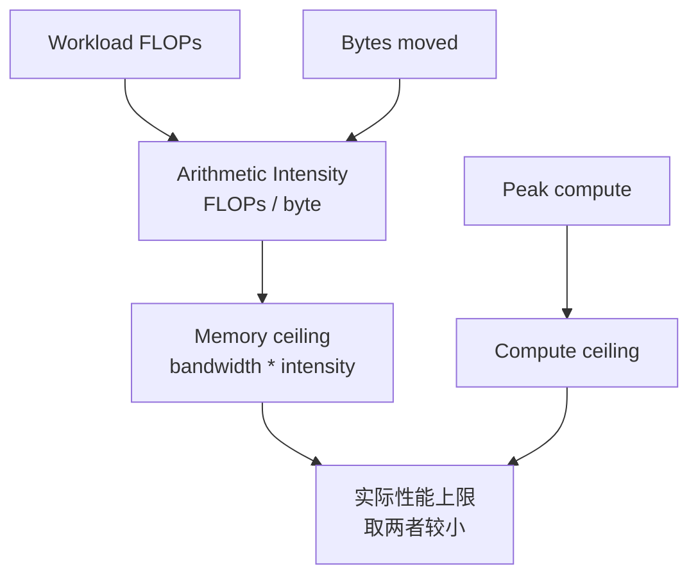

# AI 加速器性能模型：算力、带宽与 Roofline

评价 AI 加速器，不能只看宣传页上的 TFLOPS。

同一块 GPU / NPU / TPU，跑 GEMM 可能很快，跑 embedding 可能不快；跑大 batch 训练可能效率高，跑小 batch decode 可能吃不满；算力峰值很高，但 HBM 带宽、片上存储、互连、kernel launch、编译器和数据布局都会限制真实性能。

这篇建立一个基础性能模型：

> 一个 AI workload 的速度，取决于它能把多少数据复用到足够多的计算上。算力峰值给出上限，内存带宽给出另一条上限，实际性能落在哪条上限下面，要看 arithmetic intensity、数据复用、算子形状和系统开销。

本篇站在硬件架构视角，回答：

- 一块加速器的峰值算力、显存带宽、片上存储和互连如何共同形成性能上限。
- 为什么 compute peak 增长很快，但很多 AI workload 不会等比例变快。
- 如何用 workload 的 FLOPs、bytes、shape、dtype 判断硬件是否匹配。
- 训练、Prefill、Decode、MoE、KV Cache、optimizer 对硬件的压力为什么不同。

第 8 章的 [Roofline 分析：算力、带宽与瓶颈上限](../08-benchmark-capacity/roofline-analysis-compute-bandwidth.md) 更偏“拿到 profiler 数据后怎么画图和做实验”。本篇更偏“看硬件架构和 workload 时，脑子里应该有什么性能模型”。

## 性能模型先回答什么问题

性能模型不是为了算出一个精确数字，而是为了在设计和选型时减少误判。

它至少要回答四类问题：

| 问题 | 例子 |
| --- | --- |
| 上限在哪里 | 这个算子最多能接近 HBM roof 还是 compute roof？ |
| 差距在哪里 | 实测性能离理论 roof 很远，是实现问题还是硬件不匹配？ |
| 优化方向是什么 | 应该加算力、加带宽、改 layout、做 fusion，还是换并行策略？ |
| 架构取舍是否合理 | 新芯片多给了 2x TFLOPS，但目标 workload 是否需要这 2x？ |

对 AI 硬件研发来说，Roofline 的价值在于把讨论从“峰值参数更漂亮”拉回到：

```text
目标 workload 的 FLOPs 是什么？
真实 bytes moved 是什么？
数据复用在哪里发生？
瓶颈资源是哪一个？
```

## 为什么 TFLOPS 不等于真实性能

芯片规格里常见：

```text
BF16 peak: xxx TFLOP/s
FP8 peak:  xxx TFLOP/s
HBM bandwidth: x TB/s
HBM capacity:  x GB
```

这些指标很重要，但它们只是硬件峰值。

真实 AI workload 中，性能可能受这些因素限制：

- 数据从 HBM 搬到计算单元太慢。
- 算子 arithmetic intensity 太低。
- tensor shape 太小，矩阵单元吃不满。
- kernel launch overhead 主导。
- 数据 layout 不连续。
- intermediate tensor 反复写回 HBM。
- 通信等待暴露在关键路径上。
- 编译器没有生成合适 kernel。
- 混合精度格式没有真正用到高吞吐路径。

所以要问的不是“这块卡峰值多少”，而是：

```text
目标 workload 能达到峰值的多少？
达不到时，瓶颈在哪里？
```

## 峰值、可持续峰值与应用性能

硬件资料里常见的 peak 指标通常是理想条件下的理论峰值。工程上至少要分三层：

| 层级 | 含义 | 用途 |
| --- | --- | --- |
| theoretical peak | 规格书里的最大吞吐 | 看硬件上限和代际变化 |
| sustained microbenchmark peak | GEMM、bandwidth benchmark 实测上限 | 更接近当前系统可达到的 roof |
| application achieved performance | 真实模型或服务指标 | 决定业务是否真的变快 |

例如同样写着“FP8 峰值很高”，真实应用还要满足：

- kernel 真的走 FP8 Tensor Core / Matrix Engine。
- shape 和 tile 能喂满矩阵单元。
- scale、amax、layout 不引入过多额外开销。
- 其它部分没有被 HBM、通信或 launch overhead 卡住。

所以硬件评估不要只拿理论 peak 做分母。更稳妥的是同时报告：

```text
achieved / theoretical peak
achieved / sustained microbenchmark peak
end-to-end metric
```

## 两个核心资源：计算和数据搬运

AI 加速器最核心的两个资源：

| 资源 | 问题 |
| --- | --- |
| Compute | 每秒能做多少乘加、矩阵乘、向量运算 |
| Memory / IO | 每秒能从 HBM、SRAM、cache、register、互连搬多少数据 |

一个算子要运行，必须同时消耗：

```text
计算: FLOPs
数据搬运: bytes
```

如果算子需要很多 FLOPs，但数据可以高度复用，可能是 compute-bound。

如果算子 FLOPs 不多，但需要读写大量数据，可能是 memory-bound。

## 单位口径：FLOPs、FLOP/s、OPS 与 Bytes/s

性能讨论里最常见的错误，是把不同单位混在一起。

| 单位 | 含义 | 常见误用 |
| --- | --- | --- |
| FLOPs | floating-point operations，总操作数 | 和 FLOP/s 混用 |
| FLOP/s | 每秒浮点操作数，吞吐率 | 忽略测量窗口和 dtype |
| OPS / TOPS | 操作数，常用于 INT8/INT4 | 不同厂商对 operation 口径可能不同 |
| bytes | 数据移动总量 | 只算输入不算输出或中间写回 |
| bytes/s | 带宽 | 把理论带宽当真实可持续带宽 |

在 AI 系统里，还要说明：

- 是 FP32、TF32、BF16、FP16、FP8、INT8 还是 INT4。
- 是 dense 计算还是 sparse 计算。
- multiply-add 算 1 FLOP 还是 2 FLOPs。
- bytes 统计的是 HBM、L2、shared memory、网络，还是端到端 IO。
- 是否包含 padding、mask、layout copy、scale、metadata。

没有口径，性能数字不能比较。

## Arithmetic Intensity

Arithmetic intensity 描述每搬运 1 byte 数据，能做多少计算。

```text
arithmetic_intensity = FLOPs / bytes_moved
```

单位通常是：

```text
FLOPs / byte
```

直觉：

- 高 arithmetic intensity：数据复用高，搬一次数据能做很多计算。
- 低 arithmetic intensity：数据复用低，搬很多数据只做少量计算。

例如：

### Elementwise Add

```python
y = a + b
```

每个元素：

- 读 `a`
- 读 `b`
- 写 `y`
- 做一次加法

如果是 FP16/BF16，每个元素 2 bytes：

```text
bytes ~= 2 + 2 + 2 = 6 bytes
FLOPs ~= 1
AI ~= 1 / 6 FLOPs/byte
```

这是典型 memory-bound。

### Matrix Multiplication

```text
C = A @ B
```

矩阵块里的 A 和 B 可以被复用很多次。一个元素读入后可以参与多个乘加。

如果 tile 合理，GEMM 的 arithmetic intensity 很高，更容易接近 compute-bound。

这就是为什么 AI 芯片普遍强化矩阵单元：大模型训练和推理里的主要计算，很多都能转成矩阵乘。

## Ridge Point：机器平衡点

Roofline 里有一个关键分界点：

```text
ridge_point = peak_compute / memory_bandwidth
```

单位是：

```text
FLOPs / byte
```

它表示：一个 workload 的 arithmetic intensity 至少要达到多少，才有机会吃满计算峰值。

如果：

```text
peak_compute = 1000 TFLOP/s
memory_bandwidth = 4 TB/s
```

那么：

```text
ridge_point = 1000 / 4 = 250 FLOPs/byte
```

含义是：如果某个 kernel 的 arithmetic intensity 只有 10 FLOPs/byte，它大概率仍在 memory-bound 区域，哪怕芯片的 TFLOPS 很高。

### 为什么新硬件不一定让所有任务等比例变快

如果一代硬件：

- compute peak 提升 2x。
- HBM bandwidth 只提升 1.2x。

则 ridge point 会向右移动。也就是说，workload 需要更高的数据复用，才能吃满新增的算力。

这解释了很多现象：

- 大 GEMM 变快明显。
- LayerNorm、embedding、KV Cache read 变快有限。
- Decode 阶段不随 TFLOPS 等比例加速。
- 软件必须通过 fusion、tiling、cache reuse 提高 arithmetic intensity，才能释放硬件算力。

## Roofline 模型

Roofline 模型用一张图把计算峰值、内存带宽和 arithmetic intensity 联系起来。

核心公式：

```text
attainable_performance
  <= min(peak_compute, memory_bandwidth * arithmetic_intensity)
```

也就是：

- 如果 `memory_bandwidth * arithmetic_intensity` 小于计算峰值，算子受内存带宽限制。
- 如果 `memory_bandwidth * arithmetic_intensity` 大于计算峰值，算子受计算峰值限制。

可以用下图理解：



Roofline 不是精确预测器，而是定位思路：

- 算子低于 memory roofline 很多，可能访存不连续、cache 复用差、layout 差。
- 算子低于 compute roofline 很多，可能矩阵单元没用上、tile 不好、occupancy 低。
- 算子处于 memory-bound 区域，继续提高峰值 TFLOPS 也未必有用。
- 算子处于 compute-bound 区域，提高 HBM 带宽也未必立刻有用。

## 多重 Roofline：不是只有一条屋顶线

真实 AI 加速器不是只有一个 compute roof 和一个 memory roof。

### 按 dtype 分 compute roof

同一硬件可能有多条计算屋顶：

| roof | 代表 |
| --- | --- |
| FP32 / TF32 roof | 高精度或兼容 FP32 路径 |
| BF16 / FP16 roof | 主流训练矩阵计算 |
| FP8 roof | 新一代训练/推理低精度矩阵计算 |
| INT8 / INT4 roof | 量化推理 |
| scalar / vector roof | 非矩阵、非 Tensor Core 路径 |

如果算子没有走到对应硬件路径，就不能用更高那条 roof 判断。

例如一个 LayerNorm 用 BF16 输入，但内部大部分是普通向量 load、reduce、store，它不应该按 BF16 Tensor Core peak 估算收益。

### 按存储层次分 memory roof

也可以有多条带宽屋顶：

| roof | 含义 |
| --- | --- |
| register / operand reuse | 最靠近计算，容量极小 |
| shared memory / SRAM roof | 片上可控存储带宽 |
| L1/L2 cache roof | cache 命中时的片上带宽 |
| HBM roof | 全局显存带宽 |
| host / remote memory roof | CPU 内存或远端访问 |

同一个 kernel，在 HBM 层看可能 arithmetic intensity 很高，但在 L2/shared memory 层可能暴露其它瓶颈。NERSC 的 Roofline 文档也强调，层级化 Roofline 会为不同 memory/cache level 收集不同 bytes，从而得到不同层级的 intensity。

### 按通信分 network roof

多卡系统还需要通信屋顶：

```text
communication_bound <= network_bandwidth * communication_intensity
```

这里的 communication intensity 可以粗略理解为：

```text
useful FLOPs or tokens / bytes communicated
```

TP、EP、FSDP、ZeRO、Prefill/Decode 分离，都可能被通信 roof 限制。

所以真实判断往往是：

```text
compute roof
HBM roof
cache/SRAM roof
network roof
launch/runtime overhead
```

共同决定端到端性能。

## Compute-bound 与 Memory-bound

### Compute-bound

Compute-bound 表示算子主要受计算单元限制。

典型：

- 大 GEMM。
- attention QK / PV 的大矩阵乘。
- MLP projection。
- grouped GEMM，如果 shape 足够大。

优化方向：

- 使用 Tensor Core / Matrix Core。
- 合适 tile shape。
- 提高矩阵规模。
- 减少小 GEMM。
- 使用合适 dtype，例如 BF16/FP8。
- 提高 occupancy 和 Tensor Core utilization。

### Memory-bound

Memory-bound 表示算子主要受数据搬运限制。

典型：

- elementwise。
- LayerNorm / RMSNorm。
- Softmax。
- Embedding lookup。
- KV Cache 读取。
- optimizer update。
- scatter/gather。

优化方向：

- fusion。
- 减少中间 tensor 写回。
- 提高 data locality。
- 使用更低精度减少 bytes。
- 改善 memory coalescing。
- cache / SRAM / shared memory 复用。

### Launch-bound

还有一种常见情况是 launch-bound。

算子本身很小，计算和访存都不多，但 kernel launch、调度和 Python overhead 占比高。

典型：

- 小 batch 推理。
- Decode 阶段大量小 kernel。
- 很多 elementwise 小 op。
- control-heavy workload。

优化方向：

- operator fusion。
- CUDA graph。
- persistent kernel。
- batching。
- 编译器减少 Python 调度。

## 典型 AI 算子的性能直觉

下面不是严格公式，而是建立硬件判断的第一层直觉。

| 算子 / 场景 | 常见瓶颈 | 主要原因 |
| --- | --- | --- |
| 大 GEMM | compute-bound | A/B tile 复用高，Tensor Core 利用好 |
| 小 GEMM | launch-bound 或 under-utilized compute | shape 太小，矩阵单元吃不满 |
| LayerNorm / RMSNorm | memory-bound | 每个元素计算少，读写和 reduction 主导 |
| Softmax | memory-bound 或 mixed | max/sum/exp 需要多次读写，fusion 可改善 |
| Embedding lookup | memory-bound / irregular | 随机读，复用低 |
| KV Cache read | memory-bound | Decode 每步从 HBM 读历史 KV |
| Optimizer update | memory-bound | 参数、梯度、m/v、master weight 多状态读写 |
| MoE dispatch/combine | memory/communication-bound | scatter/gather、AllToAll、负载不均 |
| AllReduce / AllToAll | communication-bound | 网络带宽、拓扑、rank mapping 限制 |

这个表的含义很重要：如果目标 workload 大量时间花在 KV Cache、optimizer、scatter/gather 上，单纯堆更高 Tensor Core peak 可能不是最有效的架构方向。

## GEMM 的 Arithmetic Intensity

对矩阵乘：

```text
C[M, N] = A[M, K] @ B[K, N]
```

粗略 FLOPs：

```text
2 * M * N * K
```

粗略 HBM bytes，如果只算读 A、读 B、写 C：

```text
bytes ~= sizeof(dtype) * (M*K + K*N + M*N)
```

实际 kernel 会受 tiling、cache、writeback、accumulator、epilogue、layout copy 影响，但这个估算已经能说明问题。

当 M、N、K 都很大时，FLOPs 按三维增长，bytes 按二维增长，arithmetic intensity 会变高。

这就是大 GEMM 容易接近 compute roof 的原因。

但以下情况会破坏 GEMM 效率：

- batch 太小。
- M/N/K 某一维太小。
- TP 把矩阵切得太细。
- MoE 每个 expert token 数太少或不均。
- 维度不满足 Tensor Core 友好对齐。
- epilogue fusion 后寄存器压力过高。
- layout 需要额外 copy。

所以“模型里有很多矩阵乘”不等于“一定吃满矩阵单元”。要看矩阵形状和调度。

## Prefill 与 Decode 的差异

LLM 推理里，同一个模型的 Prefill 和 Decode 在 Roofline 上可能落到完全不同区域。

### Prefill

Prefill 一次处理 prompt 中的多个 token。

特征：

- QKV projection、MLP projection 是较大的 GEMM。
- Attention QK/PV 的矩阵规模较大。
- batch 和 sequence length 如果足够大，更容易提高 Tensor Core utilization。
- 长上下文会增加 attention IO，但仍有大量可批量计算。

因此 Prefill 往往更接近 compute-bound 或 mixed-bound。

### Decode

Decode 每次生成一个或少量 token。

特征：

- 每步矩阵规模小。
- 要反复读取历史 KV Cache。
- batch 由 scheduler 动态组织。
- kernel launch 和调度开销更明显。
- continuous batching 会让 shape 变化更复杂。

Decode 往往更容易 memory-bound、launch-bound 或 runtime-bound。

这就是为什么：

- 同一张卡的 Prefill tokens/s 和 Decode tokens/s 不能直接比较。
- HBM bandwidth、KV Cache layout、batching、CUDA Graph、persistent kernel 对 Decode 很关键。
- 只看峰值 TFLOPS 会高估小 batch Decode 性能。

## Training Forward/Backward/Optimizer 的差异

训练 step 可以拆成：

```text
forward -> loss -> backward -> gradient sync -> optimizer step
```

不同阶段的瓶颈不同。

| 阶段 | 常见瓶颈 | 说明 |
| --- | --- | --- |
| forward GEMM | compute-bound | 大 batch 训练时矩阵较大 |
| attention softmax/norm | memory-bound | reduction 和读写多 |
| backward GEMM | compute-bound | 权重梯度和输入梯度通常是大矩阵 |
| activation gradient | memory-bound / mixed | 依赖保存的 activation 和 fusion |
| gradient sync | communication-bound | DP/FSDP/TP/EP 通信暴露 |
| optimizer step | memory-bound | 多状态读写，FLOPs 相对少 |
| checkpoint save | IO-bound | 存储吞吐和元数据管理 |

因此训练硬件不能只看矩阵峰值。还要看：

- HBM capacity 是否能减少 recompute/offload。
- HBM bandwidth 是否能支撑 optimizer 和 activation 流量。
- 网络是否能隐藏 gradient sync。
- 稳态功耗/散热是否能长时间保持频率。
- ECC/RAS 是否满足长作业可靠性。

## MoE 的性能模型

MoE 看起来能用更少激活参数获得更大模型容量，但系统上会引入新的 roof。

MoE layer 典型路径：

```text
router -> top-k -> token dispatch -> expert GEMM -> combine
```

瓶颈可能来自：

- router/top-k 小算子。
- dispatch/combine 的 scatter/gather。
- expert token 数不均导致 grouped GEMM 效率下降。
- AllToAll 通信暴露。
- expert 权重显存和缓存。
- capacity factor、token dropping、load balance 策略。

从 Roofline 角度看：

- expert GEMM 可能 compute-bound。
- dispatch/combine 更可能 memory-bound。
- 跨卡 expert parallel 更可能 communication-bound。

所以 MoE 硬件评估要同时测：

- grouped GEMM efficiency。
- AllToAll bandwidth / latency。
- token distribution skew。
- dispatch/combine kernel 时间。
- expert weight residency。

只测 dense GEMM 无法代表 MoE 性能。

## 存储层次

AI 加速器的性能很大程度上取决于数据在哪一层。

常见层次：

| 层次 | 特点 |
| --- | --- |
| Register | 最靠近计算单元，容量极小，速度最快 |
| SRAM / Shared Memory / Scratchpad | 片上存储，容量小，带宽高 |
| L1/L2 Cache | 片上 cache，降低重复访问 HBM |
| HBM | 高带宽显存，容量大但比片上存储慢 |
| Host Memory | CPU 内存，延迟和带宽更差 |
| Remote Memory / Network | 多机访问，最慢且不稳定 |

高性能 kernel 的基本目标：

```text
把数据从慢层搬到快层后，尽量多复用，再写回慢层
```

FlashAttention、Triton matmul、fused softmax、LayerNorm fusion 等优化，本质都围绕这个目标。

## HBM：容量和带宽都重要

HBM 有两个核心指标：

- capacity：能放多少数据。
- bandwidth：每秒能搬多少数据。

训练里，capacity 决定能不能放下：

- parameters。
- gradients。
- optimizer states。
- activations。
- temporary buffers。

推理里，capacity 决定能不能放下：

- model weights。
- KV Cache。
- batch requests。
- long context。
- speculative decoding 的额外状态。

Bandwidth 决定 memory-bound 算子速度：

- KV Cache 读取。
- embedding。
- normalization。
- optimizer。
- sampling / logits processing。

如果 workload 主要在读 KV Cache，单纯提高 Tensor Core 峰值不一定改善 TPOT。

## 容量、带宽与复用的三角关系

HBM capacity、HBM bandwidth、片上复用不是互相替代的。

| 资源 | 决定什么 | 不足时的表现 |
| --- | --- | --- |
| HBM capacity | 模型、KV Cache、activation、optimizer state 能不能放下 | OOM、offload、batch/seq 被迫变小 |
| HBM bandwidth | memory-bound 算子能搬多快 | Tensor Core 等数据、TPOT 高、optimizer 慢 |
| 片上存储/缓存 | 数据能否重复使用 | HBM traffic 过大、roofline 左移 |

常见误判：

- capacity 够，但 bandwidth 不够：模型能跑，但吞吐不高。
- bandwidth 高，但 capacity 不够：需要更小 batch、更多重算或 offload。
- compute peak 高，但片上存储不足：tile 复用差，更多数据回到 HBM。

对硬件架构来说，三者要和目标 workload 匹配。训练大模型通常需要 capacity + bandwidth + network；在线 decode 往往特别看重 KV Cache capacity/bandwidth 和调度开销；MoE 还要看 expert weight residency 和 AllToAll。

## Tensor Core / Matrix Engine

现代 AI 加速器通常有专门矩阵计算单元：

- NVIDIA Tensor Core。
- Google TPU systolic array / matrix unit。
- AMD Matrix Core。
- 各类 NPU/ASIC 的 matrix engine。

这些单元适合大规模矩阵乘：

```text
M x K 乘 K x N -> M x N
```

它们通常对 dtype、shape、alignment 有要求：

- FP16/BF16/FP8/INT8 等低精度。
- 矩阵维度最好是特定倍数。
- tile shape 要合适。
- memory layout 要匹配。
- accumulator dtype 要正确。

如果 shape 太小或不规则，矩阵单元可能吃不满。

这解释了为什么：

- 大 batch 训练容易高 MFU。
- 小 batch decode 难吃满。
- MoE expert token 数不均会降低 grouped GEMM 效率。
- TP 过大把矩阵切太小，可能降低 Tensor Core 利用率。

## 矩阵单元利用率为什么上不去

矩阵单元峰值高，但实际 utilization 取决于软件是否能持续喂给它合适的 tile。

常见原因：

| 原因 | 表现 |
| --- | --- |
| shape 太小 | SM/阵列不满，launch overhead 占比高 |
| K 维太短 | 数据复用不足，pipeline 难隐藏 |
| 维度不对齐 | 不能走最高吞吐 tile 或需要 padding |
| batch 不稳定 | autotune 和 kernel 选择不稳定 |
| layout 不匹配 | 多余 transpose/copy |
| fusion 过度 | register pressure 增加，occupancy 降低 |
| 稀疏/动态控制流 | 规则矩阵路径被打断 |

所以评估矩阵单元时，不只看规格表，还要测：

- 大 GEMM。
- 小 batch GEMM。
- grouped GEMM。
- batched GEMM。
- attention QK/PV。
- MLP projection。
- 目标模型真实 shape。

峰值 GEMM benchmark 只能证明上限存在，不能证明目标 workload 会接近上限。

## Systolic Array 的直觉

TPU 等加速器常用 systolic array 思想。

可以把它理解成一个规则的乘加阵列：

```text
A 数据从一个方向流入
B 数据从另一个方向流入
每个小单元做 multiply-accumulate
部分和在阵列中流动
```

优势：

- 数据在阵列中复用。
- 控制逻辑规则。
- 能效高。
- 适合 dense matrix multiply。

代价：

- 对 shape/layout 更敏感。
- 不规则控制流和稀疏访问不一定高效。
- 编译器/runtime 需要把 workload 映射成合适 tile。

GPU Tensor Core 和 TPU systolic array 实现不同，但系统思想相似：把 AI workload 尽量变成规则、密集、可复用的矩阵计算。

## 不规则访问与稀疏性

AI workload 里并非所有计算都是规则 dense matmul。

不规则来源包括：

- embedding lookup。
- MoE routing。
- top-k / sampling。
- block sparse attention。
- variable-length sequence。
- graph / retrieval / agent workload。
- 动态 shape 和动态控制流。

这些 workload 的问题通常不是 FLOPs 不够，而是：

- 地址不连续。
- 分支不一致。
- token/expert 分布不均。
- metadata 开销大。
- load/store 不容易合并。
- 计算单元等待数据。

硬件如果只强化 dense matrix engine，不一定能改善这类路径。需要配合：

- 更强的 gather/scatter。
- 更大的 cache 或 scratchpad。
- 更灵活的编译器/runtime。
- 更好的 scheduling。
- 对 sparse/block sparse 的原生支持。
- topology-aware 的通信路径。

## 精度格式影响性能和稳定性

低精度能减少：

- 计算能耗。
- HBM 带宽。
- 显存容量。
- 通信量。

常见格式：

| 格式 | 常见用途 |
| --- | --- |
| FP32 | 高精度累积、敏感计算、基线 |
| TF32 | NVIDIA 上加速 FP32 风格 matmul |
| FP16 | 训练/推理低精度，范围较小 |
| BF16 | 训练常用，动态范围接近 FP32 |
| FP8 | 新一代训练/推理提速，需 scale 管理 |
| INT8 | 推理量化常用 |
| INT4 / FP4 | 更激进推理量化 |

硬件峰值通常按 dtype 分开列。比如 FP8 峰值可能远高于 BF16，但前提是：

- 模型和 kernel 支持 FP8。
- scale / amax 管理正确。
- 累积精度足够。
- 算子在 FP8 路径上。
- 质量损失可接受。

不能只看 FP8 峰值，就假设训练速度翻倍。

## 低精度也有系统成本

低精度降低 bytes 和提高矩阵吞吐，但会引入额外系统问题。

| 问题 | 说明 |
| --- | --- |
| scale 管理 | FP8/INT8 通常需要 per-tensor、per-channel 或 block scale |
| metadata bytes | scale、zero point、amax history 也要读写 |
| accumulator | 低精度输入常需要更高精度累积 |
| fallback op | 部分 op 仍需 BF16/FP32 |
| quality validation | 训练稳定性或推理质量可能下降 |
| conversion kernel | cast/quant/dequant 可能吃掉收益 |
| communication dtype | 梯度/activation/KV 是否低精度通信要单独验证 |

低精度是否有效，要看端到端：

```text
更少 bytes + 更快 matrix path
是否大于
scale/convert/fallback/质量验证/调参成本
```

在硬件设计里，低精度支持不只是矩阵单元的问题，还包括 load/store、cache、scale unit、compiler、debug 工具和数值监控。

## 互连也是性能模型的一部分

单卡性能只是第一层。

多 GPU / 多节点训练和推理还受互连限制：

- PCIe。
- NVLink / NVSwitch。
- InfiniBand。
- RoCE。
- CXL。
- chiplet interconnect。
- NoC。

不同并行策略对应不同通信：

| 并行方式 | 通信特点 |
| --- | --- |
| Data Parallel | 梯度 AllReduce / ReduceScatter |
| Tensor Parallel | 层内高频 AllReduce/AllGather |
| Pipeline Parallel | stage 间 activation P2P |
| Expert Parallel | AllToAll |
| FSDP / ZeRO | 参数 AllGather、梯度 ReduceScatter |
| Prefill/Decode 分离 | KV Cache 或 hidden state 传输 |

如果通信在关键路径上暴露，单卡算力再高也会等网络。

所以硬件架构要同时看：

```text
compute roofline
memory roofline
network roofline
```

## 通信 Roofline 的直觉

通信可以用类似 Roofline 的方式看。

例如 data parallel gradient sync：

```text
useful_compute_between_syncs / bytes_communicated
```

如果每次同步之间计算很多，通信容易被隐藏；如果每次同步之间计算很少，网络更容易暴露。

不同并行策略的通信强度不同：

| 场景 | 通信压力 |
| --- | --- |
| 大 batch DP | 每 step 梯度同步，但计算也多 |
| TP | 每层内高频通信，延迟敏感 |
| PP | stage 边界 activation P2P，受 bubble 和 micro-batch 影响 |
| EP/MoE | AllToAll，受 token skew 和拓扑影响 |
| FSDP/ZeRO-3 | 参数 all-gather 和梯度 reduce-scatter |
| Prefill/Decode disaggregation | KV/hidden state 传输和远端访问 |

如果网络 roof 低，软件通常会尝试：

- 增大计算粒度。
- overlap communication and computation。
- 改 rank mapping。
- 分层 collective。
- 减少通信 dtype/bytes。
- 改并行策略。

但如果通信量是算法本身决定的，硬件互连仍然是硬上限。

## 能效：性能不只看速度

AI 计算规模越来越大，能效是核心指标。

常见指标：

```text
tokens / joule
samples / joule
FLOPs / watt
cost per billion tokens
energy per query
```

加速器设计里，高能效来自：

- 低精度计算。
- 数据复用。
- 减少 HBM 访问。
- 减少跨芯片通信。
- 专用矩阵单元。
- 靠近数据的计算。
- 更好的调度和编译。

很多情况下，搬数据比做计算更耗能。因此“少搬数据”不仅提高性能，也提高能效。

## Energy Roofline 的直觉

能效也可以按“每次操作”和“每次数据移动”理解。

粗略说：

```text
energy = compute_energy + memory_energy + communication_energy + idle_energy
```

AI 系统里常见现象：

- compute 单元很高效，但 HBM 访问耗能高。
- 跨芯片/跨节点通信比片上访问更贵。
- 低 utilization 时，静态功耗摊到每个 token 上，energy/token 变差。
- thermal throttling 会让同样功耗下吞吐下降。
- 过高峰值设计如果喂不满，能效未必好。

因此能效优化方向和性能优化高度重合：

- 提高数据复用。
- 减少 HBM traffic。
- 减少跨卡通信。
- 用合适低精度。
- 增大有效 batch 或提高调度效率。
- 避免长时间低利用率。

对硬件研发来说，tokens/s/W、J/token、steady-state power、thermal headroom 应该和 TFLOPS 一起看。

## Workload Mapping

硬件再强，也要把 workload 映射上去。

映射包括：

- tensor 如何切分。
- tile shape 如何选择。
- 数据放在哪层存储。
- 哪些 op fusion。
- 哪些通信 overlap。
- 哪些 dtype 使用低精度。
- kernel launch 顺序。
- 多卡 rank mapping。

同一个模型，映射不同，性能差异可能很大。

例如 Transformer layer：

```text
Attention:
  QKV projection -> QK matmul -> softmax -> PV matmul -> output projection

MLP:
  up/gate projection -> activation -> down projection
```

性能上：

- projection 是大 GEMM，偏 compute-bound。
- softmax / norm 偏 memory-bound。
- attention score/KV Cache 受 sequence length 影响。
- long context 增加 attention IO。
- decode 阶段矩阵规模小，更难吃满。

## 从模型结构到硬件需求

做硬件评估时，可以把模型拆成几类“硬件压力”。

| 模型部分 | 主要硬件压力 |
| --- | --- |
| QKV/MLP projection | Tensor Core / Matrix Engine、HBM bandwidth、layout |
| Attention score / PV | 矩阵单元、片上存储、长上下文 IO |
| Softmax / norm | HBM bandwidth、fusion、reduction |
| KV Cache | HBM capacity、HBM bandwidth、cache layout |
| Embedding / logits | HBM bandwidth、大词表输出、sharding |
| MoE router/dispatch | gather/scatter、AllToAll、load balance |
| Optimizer | HBM bandwidth、optimizer state capacity、offload |
| Gradient sync | 网络 bandwidth、latency、collective implementation |
| Checkpoint | 存储 IO、网络、故障恢复 |

这张表的意义是：硬件需求不是一个数字，而是一组资源向量。

例如：

```text
训练大 dense LLM:
  需要高矩阵吞吐 + 大 HBM + 高网络带宽 + 长时间稳定性

在线 LLM decode:
  需要 HBM capacity/bandwidth + 小 batch kernel 效率 + 调度/runtime

MoE:
  需要 grouped GEMM + AllToAll + expert weight/cache 管理

Embedding/rerank:
  可能更看内存带宽、cache 和不规则访问
```

不同 workload 对硬件的偏好不同，不能用单一峰值指标代表全部。

## 训练和推理对硬件的要求不同

### 训练

训练特点：

- forward + backward + optimizer。
- batch 通常更大。
- GEMM 规模较大。
- activation 和 optimizer state 显存压力大。
- 通信量大。
- checkpoint 和容错重要。

硬件关注：

- BF16/FP8 训练吞吐。
- HBM capacity。
- HBM bandwidth。
- 多卡互连。
- RAS / ECC / 长时间稳定性。
- 分布式通信效率。

### 推理

推理特点：

- Prefill 计算密集。
- Decode 小 batch、逐 token、KV Cache 读写重。
- latency 和 tail latency 重要。
- 并发和缓存管理重要。

硬件关注：

- HBM capacity for KV Cache。
- memory bandwidth。
- 小 shape kernel 效率。
- INT8/INT4/FP8 推理。
- scheduler / batching 支持。
- 多租户隔离。

同一块硬件在训练和推理中的表现可能完全不同。

## 用 Roofline 做硬件选型

硬件选型可以按下面步骤做。

### 1. 固定目标 workload

先明确：

- 模型类型。
- 参数规模。
- batch / sequence length / context length。
- dtype。
- 训练还是推理。
- 是否 MoE。
- 是否多模态。
- 是否多机。
- SLO 或训练周期目标。

没有目标 workload 的“硬件快不快”没有意义。

### 2. 拆主要算子和系统路径

列出时间占比高的部分：

- GEMM。
- attention。
- normalization。
- embedding/logits。
- KV Cache。
- optimizer。
- communication。
- data pipeline。
- checkpoint。

### 3. 估算 FLOPs 与 bytes

对每类算子估算：

- FLOPs。
- HBM read/write bytes。
- cache/SRAM 复用。
- communication bytes。
- kernel launch 数量。

### 4. 对照硬件 roof

对照：

- dtype-specific compute peak。
- sustained GEMM peak。
- HBM bandwidth。
- cache/SRAM 能力。
- network bandwidth/latency。
- power/thermal envelope。

### 5. 用 benchmark 校准

最后用实测修正模型：

- microbenchmark 校准 peak 和 bandwidth。
- operator benchmark 校准关键算子。
- end-to-end benchmark 校准真实系统。
- profiler 解释 gap。

模型不是替代 benchmark，而是帮助 benchmark 更有方向。

## 硬件评估报告模板

评估一个 AI 加速器时，可以写成下面结构。

```markdown
# Hardware Performance Analysis

## Workload
- model:
- training/inference:
- batch/sequence/context:
- dtype:
- parallelism:
- SLO or target:

## Hardware
- compute peak by dtype:
- sustained GEMM:
- HBM capacity/bandwidth:
- cache/SRAM:
- interconnect:
- power/thermal:

## Roofline Summary
- ridge point:
- main compute-bound ops:
- main memory-bound ops:
- main communication-bound ops:
- launch/runtime-bound regions:

## Benchmark Evidence
- microbenchmark:
- operator benchmark:
- end-to-end benchmark:
- profiler trace:

## Bottlenecks
- bottleneck 1:
- bottleneck 2:
- bottleneck 3:

## Optimization / Architecture Implications
- software changes:
- compiler/runtime changes:
- hardware implications:
- residual risk:
```

这个模板的目的不是形成漂亮报告，而是防止团队只拿单个峰值指标做结论。

## Benchmark 应该怎么设计

硬件 benchmark 不能只跑峰值 GEMM。

需要分层：

### Microbenchmark

- GEMM TFLOP/s。
- HBM bandwidth。
- L2 bandwidth。
- latency。
- all-reduce bandwidth。
- all-to-all bandwidth。

### Operator Benchmark

- attention。
- layernorm。
- softmax。
- embedding。
- MoE grouped GEMM。
- KV Cache read/write。
- optimizer step。

### End-to-End Benchmark

- training step time。
- tokens/s。
- MFU。
- TTFT / TPOT。
- throughput。
- p99 latency。
- energy per token。

### Stress / Reliability

- 长时间运行。
- thermal throttling。
- ECC/Xid/error。
- checkpoint IO。
- 多节点网络稳定性。

只有 microbenchmark 好，不代表端到端好。只有端到端慢，也需要 microbenchmark 帮助定位硬件瓶颈。

## Profiler 该提供哪些证据

性能模型需要 profiler 支撑。

至少要看：

| 证据 | 用来判断 |
| --- | --- |
| kernel time breakdown | 时间花在哪些算子 |
| achieved FLOP/s | 是否接近 compute roof |
| memory throughput | 是否接近 HBM roof |
| L2 hit rate / cache metrics | 是否复用不足 |
| Tensor Core utilization | 矩阵单元是否吃满 |
| occupancy / stall reason | 是否受资源、访存或调度限制 |
| kernel launch gap | 是否 launch-bound |
| communication timeline | 通信是否暴露 |
| power / clock / throttle | 是否受功耗和散热限制 |

没有这些证据时，Roofline 只能给出方向，不能给出充分结论。

## 架构设计的几个反问

设计或评估新加速器时，可以反问：

- compute peak 增加后，ridge point 是否变得过高？
- HBM bandwidth 是否跟得上矩阵单元增长？
- HBM capacity 是否能承载目标 batch/context/KV Cache？
- 片上存储是否足够支持关键 tile？
- 是否有足够强的 gather/scatter 支持不规则 workload？
- 低精度路径是否覆盖 load/store、scale、accumulate、通信？
- 多卡互连是否匹配目标并行策略？
- 编译器/runtime 能否把真实模型映射到高效 kernel？
- power/thermal 是否允许长时间持续吞吐？
- benchmark 是否覆盖训练、Prefill、Decode、MoE、optimizer、通信？

这些问题比单纯比较“TOPS 更高”更接近架构真实价值。

## 常见误区

### 误区一：峰值 TFLOPS 高，模型就一定快

不一定。Memory-bound、launch-bound、communication-bound workload 都可能达不到高 TFLOPS。

### 误区二：HBM 容量够就行

不够。容量决定能不能放下，带宽决定搬得快不快。KV Cache、optimizer、normalization 等都很吃带宽。

### 误区三：低精度峰值能直接换成等比例提速

不一定。还要看算子是否走低精度路径、scale 管理、累积精度、模型质量和其他瓶颈。

### 误区四：Roofline 可以精确预测所有性能

Roofline 是上限模型和诊断工具，不是完整模拟器。它不直接包含 kernel launch、调度、通信、cache conflict、编译器限制等所有因素。

### 误区五：硬件问题可以完全靠软件优化解决

不一定。如果 workload 的 arithmetic intensity 天然低，或者网络带宽不够，上层优化只能缓解，不能突破物理上限。

### 误区六：一个 benchmark 可以代表所有 AI workload

不对。训练、Prefill、Decode、MoE、多模态、embedding/rerank、RAG/Agent、后训练 workload 的瓶颈都不同。

合理评估需要 workload suite，而不是单个分数。

## 设计检查清单

分析一个 AI workload 与硬件是否匹配时，可以逐项确认：

- 主要算子有哪些？
- 每类算子的 FLOPs 和 bytes moved 是多少？
- arithmetic intensity 大概是多少？
- 是 compute-bound、memory-bound 还是 launch-bound？
- 是否能使用矩阵单元？
- shape 是否足够大？
- dtype 是否匹配高吞吐路径？
- HBM 容量是否够？
- HBM 带宽是否成为瓶颈？
- 是否有大量中间 tensor 写回？
- 是否能通过 fusion 减少 IO？
- 多卡通信是否暴露？
- 网络拓扑是否匹配并行策略？
- benchmark 是否覆盖真实训练/推理负载？
- profiler 是否证明瓶颈位置？
- 能效指标是否满足目标？
- ridge point 是否和目标算子 arithmetic intensity 匹配？
- 是否分别评估了 Prefill、Decode、训练 backward、optimizer、MoE、通信？
- 是否区分理论峰值、microbenchmark sustained peak 和应用 achieved performance？
- 是否记录 dtype、shape、layout、padding、fusion、并行策略和 runtime？

## 小结

AI 加速器性能模型的核心不是背芯片参数，而是理解工作负载如何消耗计算、带宽、容量和互连。

关键结论：

- TFLOPS 是上限，不是实际性能。
- Arithmetic intensity 决定 workload 更可能受算力限制还是带宽限制。
- Roofline 用 `min(peak compute, bandwidth * intensity)` 给出性能上限直觉。
- Ridge point 描述一块硬件需要多高的数据复用才能吃满计算峰值。
- 新硬件如果算力增长快于带宽增长，低 arithmetic intensity workload 不会等比例变快。
- HBM、SRAM、cache、register 和互连共同决定数据搬运成本。
- Tensor Core / Matrix Engine 适合规则密集矩阵计算，但 shape 和 dtype 必须匹配。
- Prefill、Decode、训练、MoE、optimizer 和通信会落在不同 roof 下面。
- 训练和推理对硬件的压力不同，不能用一个 benchmark 代表全部。
- 真正的硬件评估必须从 microbenchmark、operator benchmark 和 end-to-end benchmark 三层验证。

后续学习 GPU/NPU/TPU、集群网络和编译优化时，都可以回到这个模型：算力在哪里，数据在哪里，数据搬了几次，每搬一次能做多少有效计算。

## 参考资料

- [Roofline: An Insightful Visual Performance Model for Multicore Architectures](https://dl.acm.org/doi/10.1145/1498765.1498785)
- [NERSC: Roofline Performance Model](https://docs.nersc.gov/tools/performance/roofline/)
- [NVIDIA Nsight Compute Profiling Guide: Roofline Charts](https://docs.nvidia.com/nsight-compute/ProfilingGuide/index.html#roofline-charts)
- [NVIDIA: Hopper Architecture In-Depth](https://developer.nvidia.com/blog/nvidia-hopper-architecture-in-depth/)
- [Google Cloud: Introduction to Cloud TPU](https://cloud.google.com/tpu/docs/intro-to-tpu)
- [In-Datacenter Performance Analysis of a Tensor Processing Unit](https://arxiv.org/abs/1704.04760)
