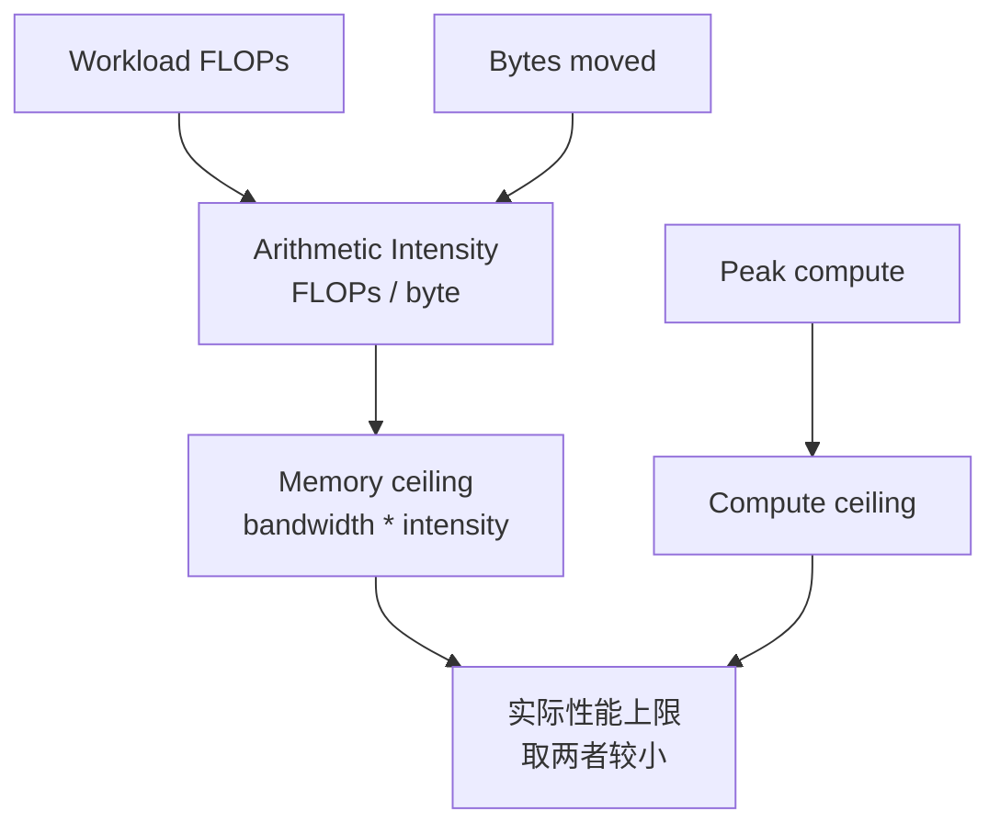

# AI 加速器性能模型：算力、带宽与 Roofline

评价 AI 加速器，不能只看宣传页上的 TFLOPS。

同一块 GPU / NPU / TPU，跑 GEMM 可能很快，跑 embedding 可能不快；跑大 batch 训练可能效率高，跑小 batch decode 可能吃不满；算力峰值很高，但 HBM 带宽、片上存储、互连、kernel launch、编译器和数据布局都会限制真实性能。

这篇建立一个基础性能模型：

> 一个 AI workload 的速度，取决于它能把多少数据复用到足够多的计算上。算力峰值给出上限，内存带宽给出另一条上限，实际性能落在哪条上限下面，要看 arithmetic intensity、数据复用、算子形状和系统开销。

## 为什么 TFLOPS 不等于真实性能

芯片规格里常见：

```text
BF16 peak: xxx TFLOP/s
FP8 peak:  xxx TFLOP/s
HBM bandwidth: x TB/s
HBM capacity:  x GB
```

这些指标很重要，但它们只是硬件峰值。

真实 AI workload 中，性能可能受这些因素限制：

- 数据从 HBM 搬到计算单元太慢。
- 算子 arithmetic intensity 太低。
- tensor shape 太小，矩阵单元吃不满。
- kernel launch overhead 主导。
- 数据 layout 不连续。
- intermediate tensor 反复写回 HBM。
- 通信等待暴露在关键路径上。
- 编译器没有生成合适 kernel。
- 混合精度格式没有真正用到高吞吐路径。

所以要问的不是“这块卡峰值多少”，而是：

```text
目标 workload 能达到峰值的多少？
达不到时，瓶颈在哪里？
```

## 两个核心资源：计算和数据搬运

AI 加速器最核心的两个资源：

| 资源 | 问题 |
| --- | --- |
| Compute | 每秒能做多少乘加、矩阵乘、向量运算 |
| Memory / IO | 每秒能从 HBM、SRAM、cache、register、互连搬多少数据 |

一个算子要运行，必须同时消耗：

```text
计算: FLOPs
数据搬运: bytes
```

如果算子需要很多 FLOPs，但数据可以高度复用，可能是 compute-bound。

如果算子 FLOPs 不多，但需要读写大量数据，可能是 memory-bound。

## Arithmetic Intensity

Arithmetic intensity 描述每搬运 1 byte 数据，能做多少计算。

```text
arithmetic_intensity = FLOPs / bytes_moved
```

单位通常是：

```text
FLOPs / byte
```

直觉：

- 高 arithmetic intensity：数据复用高，搬一次数据能做很多计算。
- 低 arithmetic intensity：数据复用低，搬很多数据只做少量计算。

例如：

### Elementwise Add

```python
y = a + b
```

每个元素：

- 读 `a`
- 读 `b`
- 写 `y`
- 做一次加法

如果是 FP16/BF16，每个元素 2 bytes：

```text
bytes ~= 2 + 2 + 2 = 6 bytes
FLOPs ~= 1
AI ~= 1 / 6 FLOPs/byte
```

这是典型 memory-bound。

### Matrix Multiplication

```text
C = A @ B
```

矩阵块里的 A 和 B 可以被复用很多次。一个元素读入后可以参与多个乘加。

如果 tile 合理，GEMM 的 arithmetic intensity 很高，更容易接近 compute-bound。

这就是为什么 AI 芯片普遍强化矩阵单元：大模型训练和推理里的主要计算，很多都能转成矩阵乘。

## Roofline 模型

Roofline 模型用一张图把计算峰值、内存带宽和 arithmetic intensity 联系起来。

核心公式：

```text
attainable_performance
  <= min(peak_compute, memory_bandwidth * arithmetic_intensity)
```

也就是：

- 如果 `memory_bandwidth * arithmetic_intensity` 小于计算峰值，算子受内存带宽限制。
- 如果 `memory_bandwidth * arithmetic_intensity` 大于计算峰值，算子受计算峰值限制。

可以用下图理解：



Roofline 不是精确预测器，而是定位思路：

- 算子低于 memory roofline 很多，可能访存不连续、cache 复用差、layout 差。
- 算子低于 compute roofline 很多，可能矩阵单元没用上、tile 不好、occupancy 低。
- 算子处于 memory-bound 区域，继续提高峰值 TFLOPS 也未必有用。
- 算子处于 compute-bound 区域，提高 HBM 带宽也未必立刻有用。

## Compute-bound 与 Memory-bound

### Compute-bound

Compute-bound 表示算子主要受计算单元限制。

典型：

- 大 GEMM。
- attention QK / PV 的大矩阵乘。
- MLP projection。
- grouped GEMM，如果 shape 足够大。

优化方向：

- 使用 Tensor Core / Matrix Core。
- 合适 tile shape。
- 提高矩阵规模。
- 减少小 GEMM。
- 使用合适 dtype，例如 BF16/FP8。
- 提高 occupancy 和 Tensor Core utilization。

### Memory-bound

Memory-bound 表示算子主要受数据搬运限制。

典型：

- elementwise。
- LayerNorm / RMSNorm。
- Softmax。
- Embedding lookup。
- KV Cache 读取。
- optimizer update。
- scatter/gather。

优化方向：

- fusion。
- 减少中间 tensor 写回。
- 提高 data locality。
- 使用更低精度减少 bytes。
- 改善 memory coalescing。
- cache / SRAM / shared memory 复用。

### Launch-bound

还有一种常见情况是 launch-bound。

算子本身很小，计算和访存都不多，但 kernel launch、调度和 Python overhead 占比高。

典型：

- 小 batch 推理。
- Decode 阶段大量小 kernel。
- 很多 elementwise 小 op。
- control-heavy workload。

优化方向：

- operator fusion。
- CUDA graph。
- persistent kernel。
- batching。
- 编译器减少 Python 调度。

## 存储层次

AI 加速器的性能很大程度上取决于数据在哪一层。

常见层次：

| 层次 | 特点 |
| --- | --- |
| Register | 最靠近计算单元，容量极小，速度最快 |
| SRAM / Shared Memory / Scratchpad | 片上存储，容量小，带宽高 |
| L1/L2 Cache | 片上 cache，降低重复访问 HBM |
| HBM | 高带宽显存，容量大但比片上存储慢 |
| Host Memory | CPU 内存，延迟和带宽更差 |
| Remote Memory / Network | 多机访问，最慢且不稳定 |

高性能 kernel 的基本目标：

```text
把数据从慢层搬到快层后，尽量多复用，再写回慢层
```

FlashAttention、Triton matmul、fused softmax、LayerNorm fusion 等优化，本质都围绕这个目标。

## HBM：容量和带宽都重要

HBM 有两个核心指标：

- capacity：能放多少数据。
- bandwidth：每秒能搬多少数据。

训练里，capacity 决定能不能放下：

- parameters。
- gradients。
- optimizer states。
- activations。
- temporary buffers。

推理里，capacity 决定能不能放下：

- model weights。
- KV Cache。
- batch requests。
- long context。
- speculative decoding 的额外状态。

Bandwidth 决定 memory-bound 算子速度：

- KV Cache 读取。
- embedding。
- normalization。
- optimizer。
- sampling / logits processing。

如果 workload 主要在读 KV Cache，单纯提高 Tensor Core 峰值不一定改善 TPOT。

## Tensor Core / Matrix Engine

现代 AI 加速器通常有专门矩阵计算单元：

- NVIDIA Tensor Core。
- Google TPU systolic array / matrix unit。
- AMD Matrix Core。
- 各类 NPU/ASIC 的 matrix engine。

这些单元适合大规模矩阵乘：

```text
M x K 乘 K x N -> M x N
```

它们通常对 dtype、shape、alignment 有要求：

- FP16/BF16/FP8/INT8 等低精度。
- 矩阵维度最好是特定倍数。
- tile shape 要合适。
- memory layout 要匹配。
- accumulator dtype 要正确。

如果 shape 太小或不规则，矩阵单元可能吃不满。

这解释了为什么：

- 大 batch 训练容易高 MFU。
- 小 batch decode 难吃满。
- MoE expert token 数不均会降低 grouped GEMM 效率。
- TP 过大把矩阵切太小，可能降低 Tensor Core 利用率。

## Systolic Array 的直觉

TPU 等加速器常用 systolic array 思想。

可以把它理解成一个规则的乘加阵列：

```text
A 数据从一个方向流入
B 数据从另一个方向流入
每个小单元做 multiply-accumulate
部分和在阵列中流动
```

优势：

- 数据在阵列中复用。
- 控制逻辑规则。
- 能效高。
- 适合 dense matrix multiply。

代价：

- 对 shape/layout 更敏感。
- 不规则控制流和稀疏访问不一定高效。
- 编译器/runtime 需要把 workload 映射成合适 tile。

GPU Tensor Core 和 TPU systolic array 实现不同，但系统思想相似：把 AI workload 尽量变成规则、密集、可复用的矩阵计算。

## 精度格式影响性能和稳定性

低精度能减少：

- 计算能耗。
- HBM 带宽。
- 显存容量。
- 通信量。

常见格式：

| 格式 | 常见用途 |
| --- | --- |
| FP32 | 高精度累积、敏感计算、基线 |
| TF32 | NVIDIA 上加速 FP32 风格 matmul |
| FP16 | 训练/推理低精度，范围较小 |
| BF16 | 训练常用，动态范围接近 FP32 |
| FP8 | 新一代训练/推理提速，需 scale 管理 |
| INT8 | 推理量化常用 |
| INT4 / FP4 | 更激进推理量化 |

硬件峰值通常按 dtype 分开列。比如 FP8 峰值可能远高于 BF16，但前提是：

- 模型和 kernel 支持 FP8。
- scale / amax 管理正确。
- 累积精度足够。
- 算子在 FP8 路径上。
- 质量损失可接受。

不能只看 FP8 峰值，就假设训练速度翻倍。

## 互连也是性能模型的一部分

单卡性能只是第一层。

多 GPU / 多节点训练和推理还受互连限制：

- PCIe。
- NVLink / NVSwitch。
- InfiniBand。
- RoCE。
- CXL。
- chiplet interconnect。
- NoC。

不同并行策略对应不同通信：

| 并行方式 | 通信特点 |
| --- | --- |
| Data Parallel | 梯度 AllReduce / ReduceScatter |
| Tensor Parallel | 层内高频 AllReduce/AllGather |
| Pipeline Parallel | stage 间 activation P2P |
| Expert Parallel | AllToAll |
| FSDP / ZeRO | 参数 AllGather、梯度 ReduceScatter |
| Prefill/Decode 分离 | KV Cache 或 hidden state 传输 |

如果通信在关键路径上暴露，单卡算力再高也会等网络。

所以硬件架构要同时看：

```text
compute roofline
memory roofline
network roofline
```

## 能效：性能不只看速度

AI 计算规模越来越大，能效是核心指标。

常见指标：

```text
tokens / joule
samples / joule
FLOPs / watt
cost per billion tokens
energy per query
```

加速器设计里，高能效来自：

- 低精度计算。
- 数据复用。
- 减少 HBM 访问。
- 减少跨芯片通信。
- 专用矩阵单元。
- 靠近数据的计算。
- 更好的调度和编译。

很多情况下，搬数据比做计算更耗能。因此“少搬数据”不仅提高性能，也提高能效。

## Workload Mapping

硬件再强，也要把 workload 映射上去。

映射包括：

- tensor 如何切分。
- tile shape 如何选择。
- 数据放在哪层存储。
- 哪些 op fusion。
- 哪些通信 overlap。
- 哪些 dtype 使用低精度。
- kernel launch 顺序。
- 多卡 rank mapping。

同一个模型，映射不同，性能差异可能很大。

例如 Transformer layer：

```text
Attention:
  QKV projection -> QK matmul -> softmax -> PV matmul -> output projection

MLP:
  up/gate projection -> activation -> down projection
```

性能上：

- projection 是大 GEMM，偏 compute-bound。
- softmax / norm 偏 memory-bound。
- attention score/KV Cache 受 sequence length 影响。
- long context 增加 attention IO。
- decode 阶段矩阵规模小，更难吃满。

## 训练和推理对硬件的要求不同

### 训练

训练特点：

- forward + backward + optimizer。
- batch 通常更大。
- GEMM 规模较大。
- activation 和 optimizer state 显存压力大。
- 通信量大。
- checkpoint 和容错重要。

硬件关注：

- BF16/FP8 训练吞吐。
- HBM capacity。
- HBM bandwidth。
- 多卡互连。
- RAS / ECC / 长时间稳定性。
- 分布式通信效率。

### 推理

推理特点：

- Prefill 计算密集。
- Decode 小 batch、逐 token、KV Cache 读写重。
- latency 和 tail latency 重要。
- 并发和缓存管理重要。

硬件关注：

- HBM capacity for KV Cache。
- memory bandwidth。
- 小 shape kernel 效率。
- INT8/INT4/FP8 推理。
- scheduler / batching 支持。
- 多租户隔离。

同一块硬件在训练和推理中的表现可能完全不同。

## Benchmark 应该怎么设计

硬件 benchmark 不能只跑峰值 GEMM。

需要分层：

### Microbenchmark

- GEMM TFLOP/s。
- HBM bandwidth。
- L2 bandwidth。
- latency。
- all-reduce bandwidth。
- all-to-all bandwidth。

### Operator Benchmark

- attention。
- layernorm。
- softmax。
- embedding。
- MoE grouped GEMM。
- KV Cache read/write。
- optimizer step。

### End-to-End Benchmark

- training step time。
- tokens/s。
- MFU。
- TTFT / TPOT。
- throughput。
- p99 latency。
- energy per token。

### Stress / Reliability

- 长时间运行。
- thermal throttling。
- ECC/Xid/error。
- checkpoint IO。
- 多节点网络稳定性。

只有 microbenchmark 好，不代表端到端好。只有端到端慢，也需要 microbenchmark 帮助定位硬件瓶颈。

## 常见误区

### 误区一：峰值 TFLOPS 高，模型就一定快

不一定。Memory-bound、launch-bound、communication-bound workload 都可能达不到高 TFLOPS。

### 误区二：HBM 容量够就行

不够。容量决定能不能放下，带宽决定搬得快不快。KV Cache、optimizer、normalization 等都很吃带宽。

### 误区三：低精度峰值能直接换成等比例提速

不一定。还要看算子是否走低精度路径、scale 管理、累积精度、模型质量和其他瓶颈。

### 误区四：Roofline 可以精确预测所有性能

Roofline 是上限模型和诊断工具，不是完整模拟器。它不直接包含 kernel launch、调度、通信、cache conflict、编译器限制等所有因素。

### 误区五：硬件问题可以完全靠软件优化解决

不一定。如果 workload 的 arithmetic intensity 天然低，或者网络带宽不够，上层优化只能缓解，不能突破物理上限。

## 设计检查清单

分析一个 AI workload 与硬件是否匹配时，可以逐项确认：

- 主要算子有哪些？
- 每类算子的 FLOPs 和 bytes moved 是多少？
- arithmetic intensity 大概是多少？
- 是 compute-bound、memory-bound 还是 launch-bound？
- 是否能使用矩阵单元？
- shape 是否足够大？
- dtype 是否匹配高吞吐路径？
- HBM 容量是否够？
- HBM 带宽是否成为瓶颈？
- 是否有大量中间 tensor 写回？
- 是否能通过 fusion 减少 IO？
- 多卡通信是否暴露？
- 网络拓扑是否匹配并行策略？
- benchmark 是否覆盖真实训练/推理负载？
- profiler 是否证明瓶颈位置？
- 能效指标是否满足目标？

## 小结

AI 加速器性能模型的核心不是背芯片参数，而是理解工作负载如何消耗计算、带宽、容量和互连。

关键结论：

- TFLOPS 是上限，不是实际性能。
- Arithmetic intensity 决定 workload 更可能受算力限制还是带宽限制。
- Roofline 用 `min(peak compute, bandwidth * intensity)` 给出性能上限直觉。
- HBM、SRAM、cache、register 和互连共同决定数据搬运成本。
- Tensor Core / Matrix Engine 适合规则密集矩阵计算，但 shape 和 dtype 必须匹配。
- 训练和推理对硬件的压力不同，不能用一个 benchmark 代表全部。
- 真正的硬件评估必须从 microbenchmark、operator benchmark 和 end-to-end benchmark 三层验证。

后续学习 GPU/NPU/TPU、集群网络和编译优化时，都可以回到这个模型：算力在哪里，数据在哪里，数据搬了几次，每搬一次能做多少有效计算。

## 参考资料

- [Roofline: An Insightful Visual Performance Model for Multicore Architectures](https://dl.acm.org/doi/10.1145/1498765.1498785)
- [NVIDIA: Hopper Architecture In-Depth](https://developer.nvidia.com/blog/nvidia-hopper-architecture-in-depth/)
- [Google Cloud: Introduction to Cloud TPU](https://cloud.google.com/tpu/docs/intro-to-tpu)
- [In-Datacenter Performance Analysis of a Tensor Processing Unit](https://arxiv.org/abs/1704.04760)
