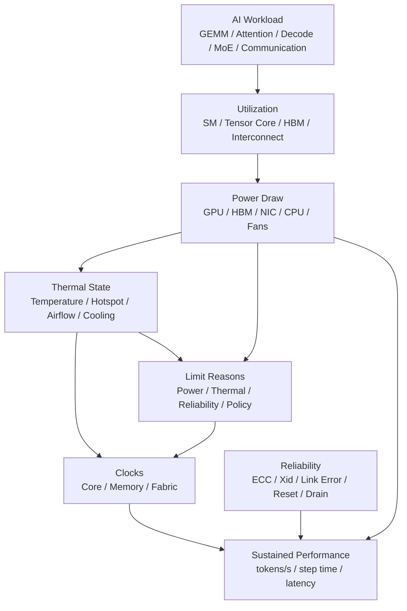

# 功耗、散热、频率与可靠性：从峰值算力到持续吞吐

AI 加速器参数表里经常写着很高的 TFLOPS、很高的 HBM 带宽、很高的互连带宽。但真实系统长期运行时，性能不只由这些峰值决定，还受功耗、散热、频率、电源、机箱风道、机柜供电、ECC 错误和故障处理影响。

这篇关注的问题是：

> 一块加速器、一台服务器、一个机柜或一个集群，能不能在目标 workload 下长期、稳定、可复现地输出有效 tokens/s 或 samples/s？

峰值算力回答的是“瞬间最多能算多快”。功耗、散热和可靠性回答的是“能不能一直这样算”。

## 从单卡到整柜的约束链

功耗和散热不是只发生在 GPU 芯片上。约束会沿着系统层次向上传递：

| 层次 | 约束 | 典型表现 |
| --- | --- | --- |
| 芯片 | 电压、频率、功耗、温度、ECC | clock 变化、throttle、错误计数 |
| 加速卡 | HBM、VRM、风冷/液冷接触、板级供电 | HBM 温度高、局部热点、卡间差异 |
| 服务器 | PSU、风道、CPU/NIC/NVMe、机箱阻抗 | 后排 GPU 更热、风扇高转、整机 power cap |
| 机柜 | PDU、供电回路、冷热通道、液冷 CDU | 整柜功耗超限、进风温度上升 |
| 集群 | 调度、并发 job、冷却容量、故障域 | 高功耗任务集中、错误率上升、SLO 抖动 |

很多性能问题看起来发生在单个 GPU，其实根因在更上层：

- 机柜进风温度高，导致同一机柜所有节点降频。
- 调度把多个高功耗训练 job 放到同一列机柜，引发 power cap。
- 某台服务器风道被线缆或高密度 NIC 阻挡，后排 GPU 长期热。
- 液冷供回水温差异常，导致冷板接触或流量问题。

所以功耗/热/可靠性分析要把单卡指标、节点指标、机柜指标和 job 指标放在一起看。

## 一张总图



这个图表达一个核心事实：

```text
真实吞吐 = workload 对硬件的压力
        + 电源和散热允许的持续频率
        + runtime 是否能稳定调度
        + 错误和故障是否被及时处理
```

所以评估 AI 服务器不能只跑一个短 benchmark。短 benchmark 可能还没进入热稳态，也没暴露电源、风扇、机箱、机柜或网络故障问题。

## 峰值性能与持续性能

峰值性能通常是理想条件下的上限：

- 特定 dtype。
- 特定矩阵尺寸。
- 特定 kernel。
- 足够高的 clocks。
- 没有明显 power throttling。
- 没有 thermal throttling。
- 通信和数据输入不是瓶颈。

持续性能则要考虑更长时间：

- 运行 30 分钟、数小时、数天后是否仍稳定。
- 温度是否达到 steady state。
- clocks 是否下降。
- 风扇是否进入高转速且仍有 thermal margin。
- 机柜供电是否有余量。
- 多 job 同时运行时是否触发 power cap。
- ECC 错误、链路错误、GPU reset 是否增加。
- 性能是否有长尾抖动。

很多 AI workload 是长时间满载，尤其是训练。推理虽然单个请求短，但线上服务 24/7 运行，也会在高峰时进入持续压力状态。

因此，系统 benchmark 至少要分两类：

| 类型 | 目的 |
| --- | --- |
| 短时峰值 benchmark | 看 kernel、算力、带宽上限 |
| 长时稳态 benchmark | 看功耗、散热、频率、错误率和持续吞吐 |

只看短时峰值，很容易高估真实可交付能力。

## 功耗从哪里来

加速器功耗不是一个固定值。它随 workload、频率、电压、温度和数据移动变化。

简化理解：

```text
dynamic power 约等于 C * V^2 * f * activity
```

其中：

- `C` 是电路等效电容。
- `V` 是电压。
- `f` 是频率。
- `activity` 是切换活动强度。

这不是用来精确计算 GPU 功耗的公式，而是建立直觉：

- 提高频率通常会增加功耗。
- 提高电压会更显著增加功耗。
- 同样频率下，不同 workload 的活动强度不同，功耗也不同。
- 温度升高会增加漏电和散热压力。

AI 服务器中的功耗来源包括：

| 部分 | 功耗来源 |
| --- | --- |
| GPU/NPU core | Tensor Core、SIMT、scheduler、cache、NoC |
| HBM | HBM stack、memory controller、大量读写 |
| 互连 | NVLink、PCIe、CXL、NIC、switch 芯片 |
| CPU | data pipeline、tokenization、runtime、control plane |
| DRAM | host memory、cache、offload |
| SSD | dataset、checkpoint、model loading |
| 风扇 / 泵 | air cooling fan、liquid cooling pump |
| PSU / VRM | 电源转换损耗 |

AI 服务器通常不是只有 GPU 耗电。NIC、CPU、风扇、NVMe、DPU 和电源转换损耗加起来也会影响整机和机柜功耗。

## 不同 workload 的功耗特征

不同 AI workload 对功耗的压力不同。

### 大 GEMM 和训练主干

大矩阵乘通常能充分使用 Tensor Core 或矩阵单元，活动强度高，功耗也高。

训练中的 forward/backward 如果 batch 足够大、矩阵尺寸合适，可能长时间把 GPU 推到高功耗区间。此时性能常受：

- power limit。
- thermal limit。
- HBM 带宽。
- communication overlap。
- clock stability。

共同影响。

### Decode 推理

LLM Decode 每次生成一个 token，经常是小 batch、小矩阵、频繁读取 KV Cache。

它可能表现为：

- Tensor Core 利用率不如大 GEMM。
- HBM 读取压力高。
- 每步 latency 敏感。
- 功耗随并发、batching、KV Cache 命中情况波动。
- 高并发 continuous batching 后功耗更接近稳态。

所以 Decode 不一定总是最高功耗，但它对频率抖动和尾延迟很敏感。

### Prefill

Prefill 会一次处理较长 prompt，attention 和 MLP 计算更接近大矩阵 workload。长 prompt 或 batch prefill 容易出现高功耗、高 HBM 访问和高互连通信。

Prefill/Decode 分离部署时，Prefill 节点和 Decode 节点的功耗形态可能明显不同。

### MoE

MoE workload 有更强的动态性：

- router 会导致不同 expert 负载不同。
- AllToAll 通信可能突发。
- grouped GEMM 的形状和 token 分布变化大。
- 部分 GPU 可能更忙，部分 GPU 更空。

这会带来功耗不均、温度不均和尾延迟问题。MoE 系统不能只看平均 GPU power，更要看最热 GPU、最慢 rank 和 expert load imbalance。

### 通信密集型 workload

Tensor Parallel、FSDP、MoE、checkpoint、KV transfer 都可能让互连和 NIC 成为功耗与性能关键路径。

通信密集不一定让 GPU core 功耗最高，但可能带来：

- GPU 等通信，SM 利用率低。
- NIC、PCIe、NVLink 活跃。
- step time 变长。
- 集群网络拥塞导致性能抖动。

这类问题看 GPU power 可能会误判：功耗不高，不代表系统没瓶颈。

## Power Limit 与 Power Capping

加速器通常有功耗上限。达到功耗上限时，硬件或驱动会通过降低频率、电压或调度策略，把功耗压回限制内。

Power limit 的作用是：

- 保护硬件。
- 保持服务器电源和散热在设计范围内。
- 避免机柜总功耗超限。
- 在多租户或大规模集群里做功耗治理。

Power capping 不一定总是坏事。

很多 workload 存在 perf/W sweet spot：

```text
最高功耗点：性能最高，但能效可能变差
中等功耗点：性能略低，但每瓦吞吐更高
过低功耗点：频率下降过多，性能损失明显
```

例如一个 memory-bound kernel，继续提高 core clock 可能不能明显提升吞吐，却会增加功耗。适度降低 power cap 或 core clock，可能保持大部分性能，同时显著降低能耗和热压力。

对推理集群来说，perf/W 很重要，因为长期成本不只是机器采购，还包括电力、散热、机柜空间和可靠性。

## Power Capping 怎么决策

Power cap 不是只用于“省电”，它也是稳定性和容量治理工具。

可以按目标分三类：

| 目标 | 做法 | 评价指标 |
| --- | --- | --- |
| 追求最大性能 | 使用较高 power limit，保证散热充足 | tokens/s、step time、p99 |
| 追求能效 | 扫描多个 power cap，找 perf/W 或 joules/token sweet spot | tokens/s/W、joules/token、温度 |
| 追求容量稳定 | 限制单机/单柜峰值，减少同步功耗尖峰 | 整柜功耗、throttle、故障率 |

典型实验方式：

1. 固定 workload、batch、并行策略和软件版本。
2. 选择多个 power cap 点，例如 100%、90%、80%、70%。
3. 每个点 warmup 到热稳态。
4. 记录吞吐、延迟、能耗、温度、clock、throttle reason。
5. 画出 `performance`、`power`、`energy/token`、`p99 latency` 随 power cap 的曲线。
6. 选择满足 SLO 的最低成本点，而不是盲目选最大功耗点。

判断要看 workload 类型：

- compute-bound 训练主干可能更依赖高 core clock，power cap 过低会明显降速。
- memory-bound Decode 或 KV Cache 访问可能对 core clock 不敏感，适度降功耗损失较小。
- 通信受限任务降低 GPU power 可能几乎不影响吞吐，因为瓶颈在网络。
- MoE 需要看 tail expert 和 tail rank，平均功耗不能说明问题。

如果 power cap 后性能几乎不变，说明原先可能不是 compute-bound；如果 p99 变差但平均吞吐不变，说明频率或调度抖动影响了尾延迟。

## 频率、Clock 与 Throttling

GPU/NPU 有多种频率：

- core clock。
- memory clock。
- fabric / interconnect clock。
- video / copy engine 等辅助单元 clock。

频率会受多种因素影响：

| 限制原因 | 含义 |
| --- | --- |
| power limit | 功耗达到上限，需要降频 |
| thermal limit | 温度过高，需要降频 |
| reliability limit | 为保证可靠性或错误率，需要限制频率 |
| idle / low utilization | workload 不需要高频 |
| application clocks / locked clocks | 管理策略固定或限制 clocks |
| sync boost / group policy | 多 GPU 为一致性采用相近 boost 策略 |

对 benchmark 来说，频率漂移会让结果不可复现。

两个相同命令的 benchmark，可能因为温度、前序 workload、风扇状态、机柜进风温度不同，得到不同结果。

所以严肃 benchmark 要记录：

- core clock。
- memory clock。
- power draw。
- power limit。
- GPU temperature。
- HBM / memory temperature。
- throttle reason。
- fan speed 或 cooling 状态。
- 运行时长和 warmup。

如果只记录 tokens/s，不记录这些上下文，很难判断结果是否可解释。

## 遥测指标体系

功耗和可靠性分析依赖 telemetry。只看 `GPU utilization` 不够。

至少要分成几组：

| 类别 | 关键指标 | 用途 |
| --- | --- | --- |
| 性能 | SM utilization、Tensor Core 利用、HBM bandwidth、copy engine、NVLink/PCIe traffic | 判断瓶颈位置 |
| 功耗 | GPU power draw、power limit、energy、PSU/节点功耗 | 判断 power cap 和能效 |
| 频率 | graphics/core clock、memory clock、fabric clock、P-state | 判断是否降频或策略不同 |
| 温度 | GPU temperature、HBM temperature、hotspot、inlet/exhaust、fan/pump | 判断 thermal margin |
| 限制原因 | power throttle、thermal throttle、reliability throttle、application clock limit | 判断性能下降原因 |
| 可靠性 | ECC、row remap/retired page、Xid、PCIe/NVLink error、reset | 判断硬件健康 |
| 作业上下文 | model、batch、seq、parallelism、dtype、node、rank、container image | 关联 workload 和硬件状态 |

NVIDIA 环境常见工具包括 `nvidia-smi`、NVML、DCGM/DCGM exporter；AMD 环境常见 ROCm SMI 和相关 exporter。具体字段名随硬件和驱动不同，但思路一致：把功耗、温度、频率、错误和应用吞吐放在同一个时间轴上。

推荐采样方式：

- benchmark 期间持续采样，而不是只在开始/结束时查一次。
- 采样间隔要能看见抖动，常见为 1s 到数秒级。
- 每个 GPU、每个 rank、每个节点都要保留原始数据。
- 集群层面要聚合到节点、机柜、队列和 job。
- 报告中保留 p50/p95/p99、最大值和稳态均值。

如果 telemetry 只有平均值，很容易错过尾部 GPU、短时 throttle、温度尖峰和链路错误。

## 散热：温度不是单点数字

散热的目标不是“温度越低越好”，而是在目标功耗下保持足够 thermal margin，让硬件稳定运行。

需要关注多个温度概念：

| 概念 | 含义 |
| --- | --- |
| inlet temperature | 进入服务器的冷空气温度 |
| exhaust temperature | 排出服务器的热空气温度 |
| GPU temperature | GPU sensor 报告的温度 |
| hotspot | 局部热点，可能高于平均温度 |
| HBM temperature | HBM stack 或 memory sensor 温度 |
| VRM temperature | 供电模块温度 |
| ambient temperature | 机房环境温度 |

AI 服务器常见散热问题：

- 前后风道不畅。
- 冷热通道混风。
- 机柜局部热点。
- GPU 间距太小，后排卡进风温度高。
- 高密度 NIC/SSD/DPU 阻挡气流。
- 风扇策略保守，温度上升后才快速响应。
- 液冷系统的 CDU、泵、冷板接触或流量问题。
- 长时间运行后灰尘和滤网增加风阻。

温度问题的表现不一定是直接宕机，更多时候是：

- clocks 慢慢下降。
- p99 latency 变差。
- 同一节点内某些 GPU 比其他 GPU 慢。
- 训练 step time 随时间漂移。
- 错误率上升。
- 风扇功耗和噪音升高。

所以长测必须让系统进入热稳态。

## 热稳态实验方法

热稳态不是固定运行几分钟就算完成，而是温度、功耗和频率进入相对稳定区间。

一个简单判断方法：

```text
在连续观察窗口内：
  GPU temperature 上升速度接近 0
  HBM temperature 上升速度接近 0
  power draw 和 clocks 不再系统性漂移
  throttle reason 没有持续新增
```

稳态测试要避免几个陷阱：

- 只跑前几分钟，结果偏向冷机状态。
- 前一个高功耗 job 刚结束，下一次测试起始温度更高。
- 风扇策略有延迟，短测没触发真实风扇曲线。
- 机房进风温度一天内变化，早晚结果不同。
- 多 job 并发时，机柜级热负载改变单机结果。

推荐记录：

- warmup 时长。
- measurement window 起止时间。
- 稳态区间选择规则。
- 起始温度和结束温度。
- 是否出现 power/thermal throttle。
- 机房或机柜进风温度。

严肃比较两个硬件或两个配置时，要用同样的热状态进入测量窗口，否则差异可能只是温度历史造成的。

## 机柜与集群功耗

单机能跑，不代表整柜能跑。整柜功耗要看：

- 每台服务器最大功耗。
- PSU 转换效率和冗余策略。
- 机柜 PDU 容量。
- 机房供电回路。
- 冷却能力。
- 同一机柜内 job 是否同时达到功耗峰值。
- PUE。

AI workload 容易产生同步峰值：

- 多节点训练同一时刻进入 forward/backward GEMM。
- checkpoint 同一时刻写存储。
- MoE AllToAll 同一时刻打网络。
- 推理高峰请求同时进入 prefill。

如果所有节点同时冲到最大功耗，可能触发：

- 机柜电力超限。
- PSU 保护。
- power cap。
- 降频。
- 任务抖动。
- 故障率上升。

大规模集群需要 power-aware scheduling：

- 控制单机或单柜功耗上限。
- 避免高功耗 job 全部集中在同一机柜。
- 对 checkpoint、preprocessing、training peak 做错峰。
- 在低负载时调低 clocks 或进入节能状态。
- 记录 job 级能耗，做成本归因。

## 能效指标

只看吞吐不够，还要看能效。

常见指标：

| 指标 | 含义 |
| --- | --- |
| tokens/s/W | 每瓦输出 token 吞吐 |
| samples/s/W | 每瓦样本吞吐 |
| joules/token | 每个 token 消耗多少焦耳 |
| joules/sample | 每个样本消耗多少焦耳 |
| joules/step | 每个训练 step 消耗多少能量 |
| cost/token | 把设备折旧、电力、冷却、运维合并后的 token 成本 |
| MFU per watt | 模型 FLOPs 利用率与能效结合 |

推理系统特别适合看 `joules/token`，因为最终交付对象就是 token。

训练系统可以看：

- joules/token。
- joules/step。
- joules to target loss。
- energy to target quality。

最后一个更重要。因为训练不是只跑快，还要达到目标质量。如果一个配置 tokens/s 很高，但收敛变差或不稳定，能效指标就没有意义。

## 训练场景怎么判读

训练通常是长时间、高占用、强同步 workload。

重点看：

| 维度 | 训练中的含义 |
| --- | --- |
| sustained tokens/s | 长时间稳态吞吐，不能只看前几分钟 |
| step time jitter | 某些 step 是否因为通信、checkpoint、温度或错误变慢 |
| MFU/HFU | 算力是否有效转化为模型计算 |
| energy to target quality | 到达目标 loss/eval 需要多少能量 |
| retry / restart cost | 可靠性问题带来的重跑和 checkpoint rollback 成本 |
| slow rank | 最慢 GPU 或节点是否拖累全局 step |

训练的功耗优化不能只追求单 step 最快。一个配置如果更快但更容易触发温度、错误、重启或不稳定，整体 time-to-quality 可能反而更差。

训练 benchmark 应该至少覆盖：

- 从冷机到热稳态的变化。
- 多小时运行的 step time 分布。
- checkpoint 周期对功耗和 I/O 的影响。
- 多节点同步峰值。
- 错误计数趋势。
- resume 后能否继续稳定训练。

## 推理场景怎么判读

推理通常更关注在线 SLO 和单位 token 成本。

重点看：

| 维度 | 推理中的含义 |
| --- | --- |
| TTFT | Prefill、调度、排队和冷启动的用户感知 |
| TPOT | Decode 每 token 延迟，受频率、HBM、KV Cache 影响 |
| p95/p99 | 少数慢请求是否违反 SLO |
| joules/token | 长期在线服务单位成本 |
| power headroom | 高峰流量时是否触发 power/thermal throttle |
| thermal recovery | 峰值流量后是否能恢复到稳定状态 |

推理系统常见现象：

- 平均 tokens/s 正常，但 p99 因降频、KV transfer 或调度抖动变差。
- Prefill 高峰导致瞬时功耗高，Decode 稳态功耗低。
- Continuous batching 提高吞吐，同时把系统推向更高热稳态。
- 多租户推理共用节点时，某个模型的 prefill 峰值影响其他模型尾延迟。

所以推理 benchmark 要同时报告 throughput 和 latency distribution，不能只报告最大吞吐。

## 可靠性与 RAS

RAS 是 Reliability、Availability、Serviceability。

在 AI 集群里，可靠性问题通常不是偶发小事，因为：

- 单个训练任务可能运行数天或数周。
- 节点数越多，遇到硬件错误的概率越高。
- 一次 GPU reset 可能让整个分布式 job 失败。
- Silent Data Corruption 会比直接 crash 更危险。
- 推理服务要长期满足 SLO。

常见错误类型包括：

| 错误 | 影响 |
| --- | --- |
| ECC correctable error | 硬件纠正了错误，但需要监控趋势 |
| ECC uncorrectable error | 可能导致进程失败、GPU reset 或数据损坏 |
| retired page / row remap | HBM 局部区域被隔离或重映射 |
| Xid / GPU fault | 驱动报告 GPU 错误，可能需要 reset 或重启 |
| PCIe replay / link error | 链路质量问题，可能导致性能下降或错误 |
| NVLink / fabric error | GPU 间链路错误，影响 collective 和 P2P |
| thermal event | 过温降频、保护或关机 |
| power event | 电源瞬断、PSU 限制、机柜电力问题 |

Correctable error 不是立刻灾难，但如果持续增加，说明硬件或环境可能有风险。Uncorrectable error 更严重，需要结合厂商建议做隔离、诊断、换卡或维修。

可靠性治理不能只依赖训练框架报错。需要从底层采集：

- GPU health。
- ECC counters。
- retired pages / row remapping 状态。
- Xid 错误。
- link errors。
- temperature。
- power limit / thermal limit。
- reset 记录。
- node reboot 记录。
- job failure 和硬件事件关联。

## 可靠性事件分级

RAS 事件要分级处理，不能所有告警都人工看，也不能所有错误都忽略。

一个实用分级如下：

| 级别 | 事件 | 处理 |
| --- | --- | --- |
| 观察 | 少量 correctable ECC、短暂温度尖峰、单次 link retry | 记录趋势，暂不影响调度 |
| 降级 | correctable ECC 快速增长、频繁 power/thermal throttle、某 GPU 长期过热 | 降低优先级、限制新任务、安排诊断 |
| 隔离 | uncorrectable ECC、GPU reset、持续 Xid、NVLink/PCIe 错误异常 | cordon/drain 节点，停止新任务 |
| 维修 | 重复故障、诊断失败、硬件错误与 job failure 强相关 | 报修、换件、保留证据 |

关键是把硬件事件和 job 结果关联起来：

```text
hardware event timeline
  + job timeline
  + rank / device mapping
  + application error
  -> 判断是否为硬件导致的失败或性能下降
```

如果没有 rank 到 GPU 的映射，看到 `rank 37 timeout` 很难知道对应哪张卡、哪个 NIC、哪个机柜。

## ECC 与性能

ECC 用来检测并纠正内存中的 bit error。对长时间训练和重要推理服务，ECC 很重要。

需要理解三点。

第一，ECC 是可靠性能力，不是性能优化能力。

关闭 ECC 可能在某些硬件或 workload 上改变可用内存或性能，但会增加数据错误风险。对于大规模训练、线上推理、科研复现和长期运行，通常不应为了短期 benchmark 数字随意关闭 ECC。

第二，correctable error 也要监控。

单次 correctable error 可能被硬件处理，但错误计数持续上升、集中在某个 GPU 或某个 HBM 区域，就需要进一步诊断。

第三，错误处理策略要自动化。

例如：

- 发现高风险 GPU 后自动 cordon/drain node。
- 暂停新任务调度。
- 运行诊断。
- 保留错误日志。
- 根据策略重启、reset、换卡或报修。
- 把 job failure 和硬件事件关联起来。

否则集群会出现“某个节点反复让任务失败，但没有人定位”的问题。

## HBM 错误、Page Retirement 与 Row Remapping

现代数据中心 GPU 通常会提供内存错误管理能力。具体机制随硬件不同，常见思想包括：

- 发现内存错误。
- 对可纠正错误计数。
- 对不可纠正错误触发更强处理。
- 隔离或重映射风险内存区域。
- 在驱动、管理工具或 DCGM 中暴露健康状态。

对 AI 系统来说，要关心的不只是“有没有 ECC”，还要关心：

- 错误集中在哪张 GPU。
- 错误集中在哪个 HBM 区域。
- 错误是否随温度升高而增加。
- page retirement / row remap 是否持续发生。
- 错误是否和特定 job、特定 batch 或长时间运行相关。

如果某张 GPU correctable error 持续增长，即使任务暂时没失败，也可能已经不适合继续承载长时间训练。对线上推理，它可能造成少量请求失败或尾延迟异常；对训练，它可能导致反复重启、checkpoint rollback，甚至更严重的数据正确性风险。

## Silent Data Corruption

比 crash 更危险的是 silent data corruption，简称 SDC。

Crash 会让系统知道任务失败；SDC 可能让计算继续进行，但结果已经错误。AI 训练和推理中，SDC 可能表现为：

- loss curve 异常但没有明确报错。
- 某些 rank 的参数或梯度悄悄偏离。
- eval 指标突然下降。
- 推理输出偶发异常。
- checkpoint 保存了已经损坏的状态。

缓解方向包括：

- ECC 和硬件 RAS 能力。
- 分布式训练中的 NaN/Inf、gradient norm、loss spike 监控。
- checkpoint 校验和 manifest。
- 定期 evaluation 和回归测试。
- 对高风险节点自动隔离。
- 重要推理服务使用输出质量和异常分布监控。

可靠性不是只保证机器不宕机，还要保证长期计算结果可信。

## Benchmark 应该记录什么

功耗、散热和可靠性相关 benchmark，建议至少记录这些字段：

| 类别 | 字段 |
| --- | --- |
| 硬件 | GPU/NPU 型号、数量、HBM、NIC、CPU、机箱、散热方式 |
| 软件 | driver、CUDA/ROCm、NCCL/RCCL、framework、kernel/compiler 版本 |
| 功耗 | power draw、power limit、energy、PSU/机柜功耗 |
| 频率 | core clock、memory clock、clock policy、throttle reason |
| 温度 | GPU、HBM、hotspot、inlet、ambient、fan/pump 状态 |
| 性能 | tokens/s、step time、TTFT、TPOT、p95/p99、MFU/HFU |
| 错误 | ECC、Xid、link error、reset、node reboot |
| 运行条件 | batch、sequence length、并发、并行策略、运行时长、warmup |

推荐 benchmark 流程：

1. 记录空闲状态。
2. warmup 到温度接近稳态。
3. 运行足够长时间。
4. 采集性能、功耗、频率、温度、错误。
5. 分析 steady-state 区间，而不是只看前几分钟。
6. 重复多次，确认方差。
7. 比较不同 power cap、clock policy、batch 和并行策略。

如果目标是线上推理，还要单独压测 p95/p99。平均 tokens/s 无法说明尾延迟是否可接受。

## Benchmark 报告模板

功耗和热稳定性报告建议用固定结构，方便不同硬件、不同节点、不同 power cap 对比。

```yaml
workload:
  type: training | inference | synthetic
  model: ...
  batch_size: ...
  sequence_length: ...
  parallelism: ...
  precision: ...

hardware:
  node_count: ...
  accelerator: ...
  accelerator_count_per_node: ...
  cooling: air | liquid
  nic: ...
  chassis: ...

runtime:
  driver: ...
  cuda_or_rocm: ...
  framework: ...
  communication_library: ...
  container_image: ...

power_thermal:
  power_limit: ...
  clock_policy: ...
  warmup_minutes: ...
  measurement_minutes: ...
  inlet_temperature: ...

results:
  throughput: ...
  latency_p50_p95_p99: ...
  energy_per_token_or_sample: ...
  steady_state_temperature: ...
  steady_state_clocks: ...
  throttle_reasons: ...
  ecc_xid_link_errors: ...
```

报告里最重要的是可解释性。一个结论如果没有 power、clock、temperature、throttle reason 和运行时长，很难复现，也很难判断是否适合生产。

## 调度与运维治理

功耗、温度和可靠性最终要进入调度系统和运维系统。

调度层可以做：

- 避免把高功耗训练任务集中到同一机柜。
- 把对尾延迟敏感的推理任务放到 thermal margin 更好的节点。
- 对近期错误多的节点降低调度优先级。
- 对机柜或电力域设置功耗预算。
- 对不同 job 类型使用不同 power cap 或 clock policy。
- 在低负载时让部分节点进入节能或维护状态。

运维层可以做：

- 维护节点健康分数。
- 记录硬件事件和 job failure 的关联。
- 自动 cordon/drain 风险节点。
- 触发 burn-in、诊断、换件流程。
- 对机柜热点做容量限制。
- 将电力、冷却和任务成本归因到队列或团队。

这类治理的目标不是单纯降低功耗，而是让同样电力和冷却预算产生更多可靠产出。

## 常见优化方向

### 找 perf/W sweet spot

不要只测最大功耗。应该在多个 power cap 下测：

- throughput。
- latency。
- energy/token。
- temperature。
- throttle reason。
- error rate。

有时降低 5% 到 10% 性能，可以换来明显更好的能效、温度和可靠性。

### 区分 compute-bound 与 memory-bound

如果 workload 是 compute-bound，提高 core clock 可能有效。如果 workload 是 memory-bound，提高 core clock 可能收益很小。

对 memory-bound workload，可以考虑：

- 提高数据复用。
- fusion。
- 减少 HBM 读写。
- 优化 tensor layout。
- 降低不必要的 core clock。
- 优化 KV Cache 存储和访问。

这比盲目追求最高频率更有价值。

### 控制热热点

同一台服务器里，不同 GPU 温度可能不同。原因可能是风道、位置、邻近设备、负载分布或散热接触差异。

优化方向：

- 调整机箱风道和挡板。
- 检查线缆是否阻挡气流。
- 保证冷通道供风。
- 对高温节点降低 power cap。
- job 调度时避免持续把高功耗任务放在热点机器。
- 液冷系统检查流量、冷板接触和供回水温差。

### 让调度系统感知功耗和温度

调度不应只看 GPU 数量。

可以把这些作为调度信号：

- 当前节点温度。
- 当前 power headroom。
- 最近硬件错误。
- GPU health。
- 机柜功耗。
- job 类型。
- 预估功耗曲线。

例如训练大 job 可以避开近期 ECC 错误增多的节点；高 prefill 推理流量可以分散到 thermal margin 更高的机器。

### 降低数据移动

数据移动不仅耗时，也耗能。

减少 HBM、PCIe、NVLink、NIC、SSD 之间的数据搬运，可以同时提高性能和降低功耗。

常见方式：

- kernel fusion。
- FlashAttention / IO-aware kernel。
- KV Cache 压缩或分层。
- prefix cache。
- mixed precision。
- activation checkpointing 的合理粒度。
- 避免 CPU/GPU 来回同步。
- checkpoint 异步写入。

### 错误自动隔离

可靠性优化不是让硬件永不出错，而是让错误不反复伤害 workload。

需要建立自动化流程：

- 采集硬件事件。
- 与 job failure 关联。
- 对高风险节点 cordon。
- 执行健康检查。
- 自动重试或迁移任务。
- 触发人工维修流程。

长期看，这比手工查日志更重要。

## 常见误区

### 误区一：短 benchmark 代表长期性能

短 benchmark 可能还没热起来，也没遇到机柜供电和长时间错误问题。长期训练和线上推理必须看稳态。

### 误区二：GPU power 越高越好

高功耗可能说明利用率高，也可能说明能效差。最终要看 tokens/s/W、joules/token、step time 和目标质量。

### 误区三：温度没到上限就没问题

温度接近上限之前，频率可能已经开始变化，风扇功耗可能增加，热点可能高于平均温度。还要看 thermal margin 和 throttle reason。

### 误区四：平均性能稳定就可以

推理要看尾延迟，训练要看 step time 抖动。少数慢 GPU、慢节点或错误重试会拖累整个系统。

### 误区五：ECC 错误被纠正就不用管

Correctable error 也要看趋势和集中度。持续增长可能预示硬件、温度、电源或链路问题。

### 误区六：关闭可靠性能力换 benchmark 数字

如果 benchmark 目标是科研可复现或生产部署，关闭 ECC、忽略错误、降低校验，可能得到漂亮数字，但结论不可用。

## 诊断思路

看到性能不稳定时，可以按下面顺序排查：

1. 性能抖动是否和温度上升同步。
2. clocks 是否下降。
3. throttle reason 是否出现 power 或 thermal limit。
4. power draw 是否长期贴近 power limit。
5. 某几张 GPU 是否明显更热或更慢。
6. ECC、Xid、link error 是否增加。
7. NIC、PCIe、NVLink 是否有错误或重传。
8. 机柜或节点是否有电源事件。
9. 同时运行的其他 job 是否造成功耗或网络峰值。
10. benchmark 是否包含足够 warmup 和稳态窗口。

如果 GPU utilization 低，但 power 也低，可能不是功耗问题，而是数据输入、网络、调度、kernel shape 或 CPU 侧瓶颈。如果 GPU utilization 高，power 贴近上限，clocks 下降，则要重点看 power cap、散热和频率策略。

## 现象到原因速查

| 现象 | 可能原因 | 下一步 |
| --- | --- | --- |
| tokens/s 随时间下降 | 热稳态后降频、power cap、数据输入变慢 | 对齐温度、clock、throttle timeline |
| p99 latency 偶发升高 | 降频、KV transfer、网络拥塞、GC/调度抖动 | 看请求时间线和 GPU telemetry |
| GPU power 高但吞吐低 | kernel 低效、通信等待、频繁数据搬运 | profiler 分解 compute/memory/network |
| GPU power 低且 utilization 低 | 数据输入、排队、CPU、launch-bound | 看 DataLoader、调度、kernel launch |
| 某张 GPU 总是最慢 | 位置更热、链路差、错误计数高、rank mapping 差 | 对比同节点各 GPU telemetry |
| 训练偶发失败 | ECC/Xid/link error、节点重启、网络 timeout | 关联 job failure 和硬件事件 |
| 同一配置结果不可复现 | 起始温度、clock policy、后台 job、功耗策略不同 | 固定 benchmark manifest |
| 降 power cap 性能不变 | 原本不是 compute-bound，可能 memory/network-bound | 寻找能效 sweet spot |

## 设计检查清单

设计 AI 服务器或集群时，可以检查：

- 单卡：目标 workload 是否会触发 power 或 thermal limit。
- 遥测：是否能持续采集 power、clock、temperature、throttle reason、错误和应用指标。
- 整机：CPU、GPU、NIC、SSD、风扇总功耗是否在 PSU 余量内。
- 机箱：高密度 GPU/NIC/SSD 是否影响气流。
- 机柜：整柜峰值功耗和冷却是否足够。
- 调度：是否能避免高功耗 job 过度集中。
- 监控：是否采集 power、clocks、temperature、ECC、Xid、link error。
- benchmark：是否看 steady-state，而不是只看短时峰值。
- 推理：是否同时看 TTFT、TPOT、p95/p99、joules/token。
- 训练：是否看 time/energy to target quality、step jitter 和重启成本。
- 可靠性：是否有自动 drain、诊断、隔离和维修流程。
- 成本：是否计算 tokens/s/W、joules/token 和 cost/token。
- 复现：是否记录 power cap、clock policy 和环境温度。

## 小结

AI 加速器的真实能力可以理解为：

```text
峰值算力
  受到 workload shape 影响
  受到 HBM 和互连影响
  受到功耗和散热影响
  受到频率策略影响
  受到可靠性事件影响
  最终变成持续 tokens/s 或 samples/s
```

如果只看芯片峰值，就会忽略系统最容易出问题的部分。真正有用的硬件评估应该同时报告：

- 性能。
- 功耗。
- 温度。
- 频率。
- 错误。
- 稳态时长。
- 能效。

这样才能判断一套 AI 计算系统是否适合长期训练、线上推理和大规模部署。

## 延伸阅读

- [NVIDIA System Management Interface Documentation](https://docs.nvidia.com/deploy/nvidia-smi/index.html)
- [NVIDIA Data Center GPU Manager Documentation](https://docs.nvidia.com/datacenter/dcgm/latest/user-guide/index.html)
- [NVIDIA GPU Memory Error Management](https://docs.nvidia.com/deploy/a100-gpu-mem-error-mgmt/index.html)
- [AMD ROCm SMI Documentation](https://rocm.docs.amd.com/projects/rocm_smi_lib/en/latest/)
