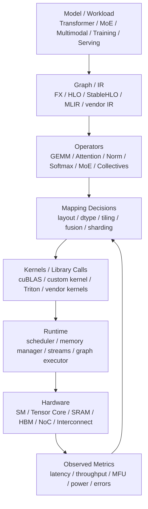

# Workload Mapping：算子、Compiler、Runtime 与硬件执行

AI 加速器不会直接执行“Transformer”或“训练任务”。硬件真正执行的是一串 kernel、memory copy、collective communication 和 runtime 调度动作。

从模型到硬件之间，需要完成一件事：

> 把 workload 映射到具体硬件资源上，让计算单元、存储层次、互连和 runtime 协同工作。

这件事就是 workload mapping。

如果 mapping 做得好，同样的模型和同样的硬件可以得到高吞吐、低延迟和稳定能效。如果 mapping 做得不好，硬件峰值再高也会表现为 GPU/NPU 利用率低、HBM 带宽浪费、频繁 fallback、编译时间长、尾延迟抖动和多卡扩展效率差。

## 一张总图



这张图表达一个核心判断：

```text
硬件性能不是自动出现的
它需要 graph、operator、compiler、kernel、runtime 和 topology 一起把 workload 映射好
```

## Workload Mapping 是什么

Workload mapping 可以理解为一组选择：

- 一个模型算子由哪个 kernel 执行。
- tensor 用什么 dtype 和 layout。
- GEMM / attention / reduction 如何分块。
- 数据放在 register、SRAM、cache、HBM 还是 host memory。
- 哪些 op 融合，哪些 op 保持独立。
- 一个 batch 如何切到多个 GPU/NPU。
- 一个模型如何做 TP、PP、DP、EP。
- collective group 如何映射到互连拓扑。
- runtime 何时 launch kernel、何时通信、何时等待。
- 动态 shape 如何复用已编译代码。
- unsupported op 如何处理。

所以 workload mapping 不是单个编译器优化，也不是单个 kernel 调参。它横跨模型、图编译、算子库、kernel、运行时、显存管理和分布式通信。

## Mapping 决策流程

做 workload mapping 时，可以按一条固定路径分析：

```text
1. 定义 workload
   -> 训练 / 推理 / Prefill / Decode / MoE / 多模态 / RAG

2. 统计 shape inventory
   -> batch、sequence length、hidden、head_dim、expert tokens、image size

3. 拆出热路径
   -> 哪些 op、哪些 kernel、哪些 communication 占主要时间或 p99

4. 选择数据表示
   -> dtype、layout、sharding、KV Cache 格式、scale metadata

5. 选择执行路径
   -> library call、generated kernel、custom kernel、collective、fallback

6. 规划内存和调度
   -> buffer lifetime、workspace、stream、overlap、cache、allocator

7. 验证端到端
   -> 性能、质量、数值正确性、稳定性、能效、可复现性
```

这个流程的关键是不要从“我要优化某个 kernel”开始，而要从真实 workload 的形状、热路径和关键路径开始。否则很容易优化了一个漂亮的 microbenchmark，却没有改善端到端训练 step 或推理 p99。

## 为什么 Mapping 会决定真实性能

以一个 Transformer layer 为例，表面上它只是：

```text
Attention + MLP + Norm + Residual
```

真正执行时会变成：

- Q/K/V projection GEMM。
- RoPE。
- attention score 计算。
- mask。
- softmax。
- dropout 或 sampling 相关逻辑。
- value aggregation。
- output projection。
- LayerNorm / RMSNorm。
- MLP up/gate/down projection。
- activation function。
- residual add。
- dtype cast。
- reshape / transpose。
- KV Cache read/write。
- tensor parallel collective。

每一步都要决定：

- 是否走矩阵单元。
- 是否从 HBM 读写。
- 是否能在片上 SRAM 复用。
- 是否产生临时 tensor。
- 是否需要同步。
- 是否跨卡通信。
- 是否触发 fallback。

一条糟糕的 mapping 可能让模型跑通，但性能很差。

例如：

- GEMM shape 不适合 Tensor Core tile。
- attention 写出完整 score matrix，HBM IO 过大。
- LayerNorm、activation、residual 分成多个小 kernel，launch overhead 和 HBM 往返过多。
- transpose 频繁发生，吞掉优化收益。
- dynamic shape 导致频繁 recompile。
- unsupported op fallback 到 CPU，引发 device-host copy。
- TP group 跨节点，层内 collective 被网络拖慢。

这些问题不是“硬件不够快”，而是 mapping 没有把 workload 放到合适的执行路径上。

## 端到端例子：一个 Decode Step

LLM Decode 看起来只是“生成下一个 token”，但一个请求在硬件上会变成一串 mapping 决策：

```text
active requests
  -> scheduler 组成 batch
  -> 读取每个请求的 KV Cache block table
  -> Q projection / K/V update
  -> attention 读取历史 KV
  -> MLP GEMM
  -> logits projection
  -> sampling / top-k / top-p
  -> 写回新 token 和 KV Cache
```

每一步都有不同瓶颈：

| 阶段 | 关键 mapping |
| --- | --- |
| batch 调度 | 请求合并、SLO、长短请求混排、padding |
| KV Cache | page/block layout、cache locality、量化、碎片 |
| attention | MHA/MQA/GQA、PagedAttention、Flash/Paged kernel |
| GEMM | batch size、dtype、tile、Tensor Core 对齐 |
| logits/sampling | vocab shard、top-k/top-p、CPU/GPU fallback |
| runtime | stream、memory pool、CUDA Graph、recompile、cache eviction |

这解释了为什么 Decode 的优化不能只看 GEMM。很多时候 TPOT 和 p99 受 KV Cache layout、batch scheduler、sampling fallback 或 runtime allocator 影响。

## 端到端例子：一个训练 Step

训练 step 的 mapping 又是另一种形态：

```text
data batch
  -> forward
  -> activation save / checkpoint
  -> loss
  -> backward
  -> gradient communication
  -> optimizer step
  -> checkpoint / logging / eval hooks
```

关键 mapping 包括：

- activation 是否保存、重算或 offload。
- forward/backward 是否被 compiler capture。
- backward bucket 何时发起通信。
- FSDP/ZeRO 参数 all-gather 是否能 prefetch。
- optimizer state 是 FP32、低精度还是 sharded。
- gradient communication 是否低精度、是否 overlap。
- checkpoint 是否阻塞训练关键路径。

训练 mapping 的目标不是单个 kernel 最快，而是稳定降低 step time，并且不破坏收敛、数值稳定和可恢复性。

## 从模型到硬件的层次

### 模型层

模型层关注：

- 模型结构。
- tensor shape。
- sequence length。
- batch size。
- attention pattern。
- MoE routing。
- 多模态输入。
- 训练还是推理。
- 是否有 KV Cache、optimizer state、activation checkpointing。

模型层决定了 workload 的基本形态。

例如：

- 大 batch 训练更容易形成大 GEMM。
- Decode 推理有很多小步、KV Cache 读取和调度问题。
- MoE 增加 routing、AllToAll 和 grouped GEMM。
- 长上下文会显著增加 attention 和 KV Cache 成本。
- 多模态模型会引入 vision/audio encoder 和跨模态 projector。

如果模型层 shape 非常动态，后面的 compiler 和 runtime 都要为动态性付出代价。

### Graph / IR 层

模型通常会被表示为计算图或中间表示。

常见形式包括：

- PyTorch FX graph。
- TorchInductor IR。
- XLA HLO。
- StableHLO。
- MLIR dialect。
- ONNX graph。
- 厂商自定义 IR。

Graph / IR 的作用是让编译器能看见计算结构，并做优化：

- 常量折叠。
- dead code elimination。
- op fusion。
- layout propagation。
- dtype propagation。
- shape inference。
- memory planning。
- sharding propagation。
- lowering。

OpenXLA/XLA、StableHLO 和 MLIR 这类项目的核心价值就在于为 tensor computation 提供可分析、可变换、可 lowering 的中间表示。没有 IR，优化就只能停留在单个 op 或手写 kernel 层面。

IR 不是只有一种层次。常见做法是多层 IR：

| 层次 | 关注点 | 例子 |
| --- | --- | --- |
| 高层 graph | 模型语义、op 依赖、shape、dtype | FX、ONNX、StableHLO/HLO |
| 中层 tensor IR | fusion、layout、buffer、loop/tile | MLIR dialect、compiler internal IR |
| 低层 kernel IR | thread/block、vector、memory、指令选择 | Triton IR、LLVM IR、PTX/ISA 之前的 IR |

多层 IR 的好处是：高层可以看见全图结构，低层可以表达硬件细节。一个成熟编译栈通常要在这些层之间传递 shape、layout、dtype、alias、lifetime 和 target hardware 信息。

### 算子层

算子层关注每个 op 怎么执行。

AI 常见算子包括：

- GEMM / batched GEMM。
- convolution。
- attention。
- softmax。
- LayerNorm / RMSNorm。
- embedding。
- activation。
- top-k / sampling。
- quantize / dequantize。
- reshape / transpose / concat。
- MoE routing / dispatch / combine。
- AllReduce / AllGather / ReduceScatter / AllToAll。

算子层最重要的问题是：

> 这个 op 有没有高性能实现？它能不能和周围 op 融合？它的 shape 是否适合硬件？

很多新硬件或新编译器的端到端性能问题，不是主 GEMM 不快，而是长尾算子覆盖不完整。

### Kernel 层

Kernel 层是真正贴近硬件的执行单元。

一个高性能 kernel 要决定：

- tile size。
- block size。
- program ID mapping。
- num warps / wavefront。
- pipeline stages。
- register 使用量。
- shared memory / SRAM 使用量。
- memory coalescing。
- bank conflict。
- vectorized load/store。
- Tensor Core / Matrix Core 使用。
- accumulator dtype。
- epilogue fusion。
- boundary mask。

Triton、CUDA、CUTLASS、vendor kernel library 都在这一层发挥作用。

Kernel 层的核心矛盾是：

```text
更大 tile 可以提高数据复用
但也会增加 register / SRAM 压力
进而降低 occupancy 或引发 spill
```

所以 kernel mapping 不只是“把块调大”，而是在复用、并行度、occupancy、带宽和寄存器压力之间找平衡。

### Runtime 层

Runtime 负责把 kernel、memory、communication 和 request/job 调度起来。

Runtime 常做：

- kernel launch。
- stream 管理。
- event synchronization。
- memory allocation。
- graph execution。
- cache 管理。
- batching。
- request scheduling。
- collective launch。
- error handling。
- device placement。
- multi-process / multi-tenant coordination。

训练 runtime 关注 step pipeline、communication overlap、checkpoint 和 fault tolerance。推理 runtime 关注 continuous batching、KV Cache、prefix cache、P/D 分离、SLO 和尾延迟。

Runtime mapping 决定了理论上的 kernel 优化能否真正转化为端到端收益。

### 硬件层

硬件层提供资源：

- scalar/vector units。
- Tensor Core / Matrix Engine。
- register file。
- SRAM/shared memory。
- L1/L2 cache。
- HBM。
- NoC。
- PCIe/NVLink/CXL/RDMA。
- copy engine。
- synchronization primitive。

硬件层不是一个平坦资源池。不同资源带宽、延迟、容量和约束都不同。Mapping 的目标就是让正确的数据在正确时间出现在正确层级。

## 算子支持：跑通不等于跑快

评估加速器和编译器时，算子支持要分层看。

| 层级 | 含义 |
| --- | --- |
| 不支持 | 模型无法运行，或必须手工改模型 |
| 支持但 fallback | 可以运行，但回退到 CPU、慢 kernel 或解释路径 |
| 支持基础 kernel | 可以在设备上运行，但未融合或未针对 shape 优化 |
| 支持高性能 kernel | 有适配 dtype、layout、tile、epilogue 的优化实现 |
| 支持 graph-level fusion | 能和周围 op 融合，减少中间写回和 launch |
| 支持动态场景 | 能处理 shape 变化、batching、cache、runtime 调度 |

很多性能陷阱发生在“支持但 fallback”或“支持基础 kernel”阶段。

例如一个 LLM 推理模型：

- GEMM 走高性能矩阵库。
- RoPE 是普通 elementwise kernel。
- RMSNorm 没融合。
- dequantize 单独读写 HBM。
- sampling 在 CPU 上做。
- KV Cache layout 不匹配 attention kernel。

这种系统每个 op 都“支持”，但端到端仍然可能很慢。

所以看算子支持时，要问：

- op 是在设备上执行还是 CPU fallback。
- 是否触发 device-host copy。
- dtype 是否是目标 dtype。
- layout 是否需要额外 transpose。
- 是否能 fusion。
- 是否有 target shape 的 autotune 结果。
- profiler 中是否有很多小 kernel。
- p99 是否受某个长尾 op 影响。

## Compiler 做什么

编译器的任务不是简单“把 Python 变成 CUDA”。它通常做多层变换。

典型流程：

```text
Frontend capture
  -> Graph / IR
  -> Shape and dtype analysis
  -> Fusion and canonicalization
  -> Layout and memory planning
  -> Lowering to library call / generated kernel / custom call
  -> Code generation
  -> Autotuning
  -> Runtime execution
```

不同系统名字不同，但大体问题相似。

### Capture

编译器首先要捕获模型计算。

难点包括：

- Python 动态控制流。
- tensor shape 动态变化。
- data-dependent branch。
- mutation。
- random number。
- custom autograd。
- unsupported Python side effect。

如果 capture 不完整，就会出现 graph break。Graph break 会让编译器只能优化局部，端到端 fusion 和 memory planning 都受影响。

### IR 优化

IR 层可以做：

- 删除无用 op。
- 合并等价 op。
- 把复杂 op 分解成硬件支持的基本 op。
- 把多个小 op 融合。
- 传播 layout。
- 推导 shape。
- 分析 alias 和 lifetime。

MLIR 的多 dialect 思路和 XLA/StableHLO 的 tensor IR 思路，都是为了让不同层次的优化有清晰表达。

### Lowering

Lowering 是把高层 op 变成更贴近硬件的形式。

例如：

- `matmul` lowering 到 cuBLAS / CUTLASS / generated GEMM。
- `attention` lowering 到 FlashAttention 类 kernel。
- `layernorm + residual` lowering 到 fused kernel。
- `allreduce` lowering 到 NCCL/RCCL/vendor collective。
- `reshape/transpose` 尽量变成 metadata change，避免真实搬数据。

Lowering 的选择会直接影响性能。

同一个 high-level op，可以有多种实现：

- 调库。
- 生成 kernel。
- 调手写 custom kernel。
- 分解成多个基础 op。
- fallback。

编译器要根据 shape、dtype、layout、target hardware 和 runtime 信息选择。

### Lowering 示例

以 `linear -> bias -> activation` 为例，可能有多种 lowering：

| lowering | 执行方式 | 适合情况 |
| --- | --- | --- |
| library GEMM + separate bias + separate activation | 调库后多个小 kernel | 简单、保守、容易跑通 |
| GEMM epilogue fusion | bias/activation 放进 GEMM epilogue | 减少 HBM 写回和 kernel launch |
| generated fused kernel | 编译器生成完整 fused op | shape 固定、fusion 收益大 |
| custom kernel | 手写 CUDA/Triton/vendor kernel | 热路径明确、需要极致优化 |
| fallback decomposition | 分解成基础 op 或 CPU 路径 | 兼容但可能很慢 |

Lowering 的核心不是“哪个方式最高级”，而是当前 shape、dtype、layout、硬件和 runtime 下哪个端到端成本最低。

Attention 也是类似：

- 短序列、小 batch 可能被 launch overhead 主导。
- 长序列 Prefill 更适合 IO-aware attention kernel。
- Decode 更关心 KV Cache layout、page table 和小 batch GEMM。
- Sparse/Sliding Window attention 要看 pattern 是否适合 block-level kernel。

同一个数学 op，在不同 workload 阶段可能需要完全不同的 lowering。

### Autotuning

很多 kernel 参数没有一个永远最优的值。

Autotuning 会尝试不同配置：

- tile size。
- num warps。
- pipeline stages。
- memory layout。
- split-k。
- block scheduling。
- epilogue fusion。

然后为特定 shape 和硬件选择更快配置。

Autotuning 的问题是：

- 搜索成本高。
- 结果依赖硬件和 driver。
- dynamic shape 会扩大搜索空间。
- 线上 serving 不能频繁长时间 autotune。
- 缓存和版本管理复杂。

所以生产系统经常要做 shape bucketing、预编译、warmup 和 autotune cache。

### Guard、Specialization 与 Recompile

很多编译系统会根据 shape、dtype、stride、device、requires_grad、control flow 等条件生成专门版本。

这些条件可以理解为 guard：

```text
如果输入满足这些条件
  使用已编译版本
否则
  graph break / recompile / fallback
```

Specialization 可以让常见 shape 很快，但会带来风险：

- 线上 shape 太散，编译缓存膨胀。
- 首次请求遇到冷编译，尾延迟升高。
- guard 频繁失败，优化路径不稳定。
- 不同版本 driver 或 compiler 生成的 kernel 不一致。

生产系统需要记录：

- compiled graph 数量。
- recompile 次数。
- guard failure 原因。
- compile latency。
- cache hit rate。
- 每个 compiled artifact 对应的 shape bucket。

否则“编译器优化”可能在用户侧表现为不可解释的延迟尖刺。

## Runtime Interface：编译器和硬件之间的合约

编译器生成计划后，还需要 runtime 执行。

Runtime interface 至少要表达：

- kernel 入口。
- tensor 地址。
- shape / stride。
- dtype。
- stream。
- dependency。
- workspace。
- temporary buffer。
- collective group。
- device placement。
- error handling。
- profiling marker。

可以把 runtime interface 理解成合约：

```text
compiler 说：
  我需要这些 tensor、这些 layout、这些 workspace、这些顺序和同步关系

runtime 说：
  我负责分配内存、安排 stream、发起 kernel、处理通信、监控错误

hardware 说：
  我按这些指令和数据路径执行，但必须满足 alignment、dtype、layout、同步等约束
```

如果合约设计不好，会出现：

- compiler 以为 tensor layout 不变，runtime 实际做了额外 copy。
- runtime memory allocator 导致 fragmentation。
- kernel workspace 竞争显存。
- stream dependency 过度保守，失去 overlap。
- collective 和 compute 没有并行。
- dynamic shape 导致频繁重新编译。
- error 无法定位到具体 kernel 或 op。

## Memory Planning 与 Buffer Lifetime

Memory planning 是 workload mapping 中很容易被低估的一层。

编译器和 runtime 要决定：

- 哪些 tensor 需要真实分配。
- 哪些 tensor 只是 view 或 metadata change。
- 中间 buffer 何时创建、何时释放、能否复用。
- workspace 大小如何选择。
- activation 保存还是重算。
- KV Cache block 如何分配、回收和压缩。
- communication buffer 和 compute buffer 是否能重叠。
- CUDA Graph 或 graph executor 是否要求稳定地址。

一个简单例子：

```text
op A output -> op B input -> op C input
```

如果 `op A` 的输出只被 `op B` 使用一次，且 `op B` 可以融合进 `op A` 或复用同一 buffer，那么就可能省掉一次 HBM 写回和一次 allocation。反过来，如果某个 tensor 被多个下游 op 使用，或者 alias 关系复杂，编译器就不能随便覆盖它。

Memory planning 常见问题：

- allocator fragmentation 导致明明总显存够却 OOM。
- temporary buffer 峰值超过预期。
- dynamic batch 让 KV Cache 空洞增多。
- graph break 让编译器看不见 tensor lifetime。
- custom op 隐藏内部 allocation。
- communication workspace 和 model activation 同时达到峰值。

所以 profiler 里除了看 kernel time，还要看 allocation timeline、peak memory、temporary buffer、copy kernel 和 fragmentation。

## Correctness Gate

Mapping 优化必须先保证正确性。

每次改变 layout、dtype、fusion、tiling、parallel mapping 或 lowering，都可能引入错误：

- stride/index 算错。
- mask 边界处理错误。
- reduction 顺序改变导致数值差异。
- FP8/INT8 scale 管理错误。
- parallel shard 拼接错位。
- dropout/RNG 状态不一致。
- dynamic shape 分支漏测。
- fused kernel 没处理特殊值。

建议设置 correctness gate：

| 层次 | 检查 |
| --- | --- |
| Kernel | 与 reference kernel 对比，覆盖边界 shape 和 dtype |
| Operator | forward/backward 数值误差、NaN/Inf、极值输入 |
| Graph | compiled vs eager、fusion on/off、dynamic shape |
| Distributed | 单卡 vs 多卡、不同 rank mapping、checkpoint/resume |
| End-to-end | loss curve、eval、生成质量、p99 和异常请求 |

性能优化如果没有 correctness gate，很容易把“跑得快”建立在隐蔽错误上。

## 数据 Layout 是第一等问题

很多性能问题来自 layout。

Layout 包括：

- row-major / column-major。
- NCHW / NHWC。
- contiguous / strided。
- blocked layout。
- tensor core friendly layout。
- KV Cache page layout。
- MoE token packing layout。
- sharded tensor layout。

Layout 影响：

- memory coalescing。
- cache locality。
- Tensor Core 使用。
- vectorized load/store。
- transpose 成本。
- collective packing。
- fusion 可行性。

一个常见问题是：

```text
A op 喜欢 layout 1
B op 喜欢 layout 2
中间需要 transpose
transpose 本身没有数学价值，但会读写大量 HBM
```

如果 layout propagation 做得好，可以让多个 op 共享同一种高效 layout，或者把 transpose 融合/消除。否则大量 invisible data movement 会吃掉硬件收益。

## Fusion：减少中间数据搬运

Fusion 的目标不是减少数学计算，而是减少：

- kernel launch。
- HBM 读写。
- intermediate tensor。
- synchronization。
- memory allocation。

例如：

```text
x = layernorm(x)
y = matmul(x, w)
z = y + residual
```

某些场景可以把 norm、bias、activation、residual、dequantize、epilogue 等融合到更少 kernel 中。

Fusion 的收益：

- 减少 HBM 往返。
- 减少小 kernel launch。
- 提高 cache / register / SRAM 复用。
- 降低 latency。

Fusion 的代价：

- kernel 更复杂。
- register pressure 增加。
- occupancy 可能下降。
- 代码生成更难。
- dynamic shape 更难处理。
- debug 更难。

所以 fusion 不是越多越好。合理 fusion 要看算子特性、shape、memory traffic 和硬件资源。

## Tiling：把大问题拆到硬件能吃的块

Tiling 是 workload mapping 的核心技术。

大矩阵不能一次全部放进 register 或 SRAM，所以要切块：

```text
大矩阵
  -> block tile
  -> warp tile
  -> matrix instruction tile
  -> register fragment
```

好的 tiling 会让：

- A/B tile 在片上多次复用。
- HBM 访问连续且合并。
- Tensor Core 输入 shape 对齐。
- accumulator 放在 register。
- shared memory 不发生严重 bank conflict。
- occupancy 足够。

差的 tiling 会导致：

- HBM 重复读取。
- register spill。
- shared memory 冲突。
- 计算单元等待数据。
- 边界 mask 太多。
- 小 shape 利用率差。

Tiling 参数和硬件强相关，所以跨硬件迁移时不能假设同一套 tile 永远最优。

## Precision Mapping

低精度不是简单 cast。

Precision mapping 要决定：

- 权重存储 dtype。
- activation 存储 dtype。
- GEMM 输入 dtype。
- accumulator dtype。
- reduction dtype。
- scale 粒度。
- outlier 如何处理。
- communication dtype。
- checkpoint dtype。

如果硬件支持 FP8/INT8/INT4，但 compiler/runtime 没有正确管理 scale、layout、accumulator 和 fallback，低精度路径就不会稳定工作。

训练中还要关注：

- loss scaling。
- master weight。
- optimizer state。
- gradient communication。
- overflow/underflow。

推理中还要关注：

- weight-only quantization。
- activation quantization。
- KV Cache quantization。
- per-channel / per-group scale。
- dequantize 是否融合进 GEMM。

Precision mapping 是硬件、数值和系统的交叉问题。

## Parallel Mapping：多卡不是自动加速

当 workload 放不进单卡，或者单卡吞吐不够，就要做 parallel mapping。

需要决定：

- Data Parallel group。
- Tensor Parallel group。
- Pipeline Parallel stage。
- Expert Parallel group。
- Sequence Parallel。
- ZeRO/FSDP shard。
- KV Cache placement。
- rank mapping。
- collective algorithm。

Parallel mapping 要匹配互连拓扑。

例如：

- TP 通信高频，尽量放在节点内高速 GPU fabric。
- DP/FSDP 可以跨节点，但要 bucket 和 overlap。
- EP/MoE 的 AllToAll 对 bisection bandwidth 敏感。
- PP 要考虑 stage balance 和 pipeline bubble。
- P/D 分离要考虑 KV transfer 路径和频率。

多卡性能差，常常不是单卡 kernel 差，而是 parallel mapping 把高频通信放到了错误拓扑上。

## Training Mapping

训练 mapping 和推理 mapping 不同，因为训练有 backward、optimizer 和长期状态。

训练 mapping 要处理：

| 对象 | Mapping 问题 |
| --- | --- |
| forward activation | 保存、重算、offload、shard、dtype |
| backward graph | autograd capture、fusion、通信启动时机 |
| gradients | bucket、reduce-scatter/all-reduce、dtype、overlap |
| parameters | FSDP/ZeRO shard、all-gather、prefetch、layout |
| optimizer state | FP32/低精度、shard、CPU/NVMe offload |
| RNG/dropout | checkpointing 和 recomputation 的一致性 |
| checkpoint | shard format、异步保存、resume 正确性 |

训练 mapping 的几个典型目标：

- 降低 peak activation memory。
- 让 backward communication 尽量 overlap。
- 避免 optimizer step 成为 memory-bound 长尾。
- 让 FSDP/ZeRO all-gather 不阻塞 forward。
- 保持 loss curve 和 baseline 一致。
- 让 checkpoint/resume 后状态完整。

因此训练优化要看 step timeline，而不只看 forward kernel。

## Inference Mapping

推理 mapping 更关注请求调度、KV Cache 和尾延迟。

推理 mapping 要处理：

| 对象 | Mapping 问题 |
| --- | --- |
| request batch | continuous batching、admission control、SLO |
| prefill | 长 prompt GEMM/attention、chunked prefill、P/D 分离 |
| decode | 小 batch GEMM、KV Cache bandwidth、TPOT |
| KV Cache | block size、page table、layout、量化、eviction |
| prefix cache | cache key、共享前缀、命中率、内存压力 |
| logits/sampling | vocab shard、top-k/top-p、CPU fallback |
| multi-tenant | 模型共存、显存池、QoS、隔离 |

推理 mapping 的几个典型目标：

- 降低 TTFT。
- 降低 TPOT。
- 提高 batch throughput。
- 控制 p95/p99 latency。
- 提高 KV Cache 利用率。
- 减少 fallback 和冷编译。

推理系统里，runtime mapping 往往和 kernel mapping 一样重要。一个 attention kernel 很快，但 scheduler、cache eviction 或 allocator 抖动，仍然会让线上 p99 变差。

## Target Backend 差异

同一个 graph 在不同硬件后端上，最佳 mapping 往往不同。

| 后端差异 | 影响 |
| --- | --- |
| 矩阵指令 tile | GEMM/attention tile、alignment、padding |
| SRAM/shared memory 大小 | fusion、tiling、FlashAttention block size |
| register file | occupancy、spill、fusion 边界 |
| HBM 带宽 | memory-bound op、KV Cache、layout |
| cache 行为 | blocking、program ordering、reuse |
| 低精度格式 | FP8/INT8/INT4 路径、accumulator、scale |
| interconnect | TP/EP/DP group、collective algorithm |
| compiler backend | lowering、fusion、dynamic shape、fallback |

因此跨硬件迁移时，不能只改 device name。需要重新验证：

- shape inventory。
- layout。
- kernel selection。
- autotune cache。
- parallel group。
- precision policy。
- fallback log。
- profiler evidence。

硬件越专用，mapping 对 compiler/runtime 的依赖通常越强。

## Dynamic Shape 与线上推理

训练 benchmark 常常用固定 batch 和 sequence length。线上推理不是这样。

线上推理有：

- prompt 长度不同。
- output 长度不同。
- request 到达时间不同。
- batch 动态合并。
- KV Cache 动态增长。
- prefix cache 命中不确定。
- tool call 和 RAG context 不确定。
- speculative decoding 接受率变化。

这会给 compiler/runtime 带来挑战：

- shape 变化导致 recompile。
- padding 浪费计算。
- kernel 选择不稳定。
- memory allocator 碎片。
- cache block 管理复杂。
- p99 latency 受长尾 shape 影响。

常见处理方法：

- shape bucketing。
- padding 到有限集合。
- dynamic shape compilation。
- 预编译常见 shape。
- runtime autotune cache。
- paged KV Cache。
- continuous batching。
- admission control。

推理系统的 mapping 不能只看单个静态 shape 的 kernel 性能，要看真实请求分布。

## Fallback 是端到端性能杀手

Fallback 指某个 op、shape、dtype 或 layout 没有高性能实现，被迫走慢路径。

Fallback 可能发生在：

- compiler 无法 capture。
- IR 不支持某个 op。
- target backend 不支持某个 dtype。
- kernel library 没有该 shape 的实现。
- dynamic shape 超出编译器能力。
- custom op 没有设备实现。
- runtime 不支持某种 memory layout。

Fallback 的危害：

- 触发 CPU/GPU 同步。
- 引入 device-host copy。
- 打断 fusion。
- 增加 kernel launch。
- 引发 graph break。
- 让 profiler 难以解释。
- 造成 p99 抖动。

排查 fallback 时，要看：

- graph break log。
- compiler explain。
- profiler timeline。
- kernel name。
- CPU activity。
- H2D/D2H copy。
- unsupported op warning。
- dynamic shape guard 和 recompile log。

端到端优化时，消除一个 fallback 往往比优化主 GEMM 1% 更有价值。

## Benchmark 方法

Workload mapping 的 benchmark 要能定位映射问题。

建议分层：

### Microbenchmark

测单个硬件能力：

- GEMM。
- HBM bandwidth。
- shared memory / SRAM。
- Tensor Core dtype。
- PCIe / NVLink / RDMA。
- kernel launch overhead。

### Operator Benchmark

测具体 op：

- attention。
- LayerNorm / RMSNorm。
- FlashAttention。
- MoE grouped GEMM。
- all-to-all dispatch/combine。
- quantized GEMM。
- KV Cache read/write。

### Graph Benchmark

测一段真实子图：

- Transformer layer。
- attention block。
- MLP block。
- MoE layer。
- prefill stage。
- decode step。

### End-to-End Benchmark

测真实训练或推理：

- tokens/s。
- step time。
- TTFT。
- TPOT。
- p95/p99。
- MFU/HFU。
- power。
- memory footprint。
- recompile count。
- fallback count。
- graph break count。
- kernel time breakdown。

一个好的 mapping benchmark 不只回答“快不快”，还要回答：

- 哪个 op 慢。
- 哪个 layout 造成额外搬运。
- 哪个 shape 触发 fallback。
- 哪个 kernel 没吃到矩阵单元。
- 哪个通信暴露在 critical path。
- 哪个 runtime decision 导致尾延迟。

## Profiler 证据矩阵

Workload mapping 的判断必须靠证据。

常见现象和证据如下：

| 现象 | 需要看的证据 | 可能方向 |
| --- | --- | --- |
| Tensor Core 利用率低 | kernel metrics、instruction mix、shape、dtype | tile/alignment/dtype 不匹配 |
| HBM traffic 高 | memory throughput、bytes moved、copy/transpose kernel | layout、fusion、temporary buffer |
| 小 kernel 很多 | profiler timeline、kernel duration、launch count | fusion、CUDA Graph、runtime batching |
| recompile 多 | compiler log、guard failure、compiled graph cache | shape bucketing、dynamic shape、预编译 |
| CPU activity 高 | CPU timeline、H2D/D2H copy、fallback log | unsupported op、synchronization、sampling |
| communication 暴露 | NCCL/RCCL timeline、stream overlap、rank trace | bucket、rank mapping、topology、overlap |
| p99 抖动 | request trace、allocator、KV cache、compile event | runtime scheduling、cache、冷编译 |
| OOM 或碎片 | allocation timeline、reserved/active memory、KV blocks | memory planning、pool、block size |

如果没有 profiler 证据，很多优化只是猜测。Mapping 优化的基本流程应该是：

```text
假设瓶颈
  -> 找 profiler 证据
  -> 改 mapping
  -> 做 A/B benchmark
  -> 检查正确性和端到端指标
```

## Mapping Manifest

为了让 benchmark 可复现，建议为每次实验保存 mapping manifest。

至少包括：

```yaml
model:
  name: ...
  commit: ...
  dtype: ...
  shapes: ...

compiler:
  framework: ...
  compiler: ...
  mode: ...
  dynamic_shape: ...
  graph_breaks: ...
  compiled_graphs: ...

runtime:
  batcher: ...
  kv_cache_layout: ...
  memory_pool: ...
  cuda_graph: ...
  streams: ...

kernels:
  attention: ...
  gemm_backend: ...
  custom_kernels: ...
  autotune_cache: ...

parallelism:
  dp: ...
  tp: ...
  pp: ...
  ep: ...
  rank_mapping: ...

hardware:
  accelerator: ...
  driver: ...
  interconnect: ...
  power_policy: ...
```

没有 manifest，就很难解释为什么同一模型在不同日期、不同节点、不同 driver 上性能不同。

## 常见优化方向

### 建立 Shape Inventory

先统计真实 workload 的 shape 分布：

- prompt length。
- output length。
- batch size。
- sequence length。
- hidden size。
- expert token count。
- image/audio resolution。

没有 shape inventory，就无法判断 compiler、kernel 和 autotune 应该优先优化什么。

### 优先优化热路径

不要平均对待所有 op。

先看：

- 总时间最高的 op。
- p99 贡献最大的 op。
- HBM traffic 最大的 op。
- fallback op。
- 频繁出现的小 kernel。
- communication exposed time。

热路径之外的优化可能很优雅，但对端到端收益有限。

### 消除无价值数据搬运

重点找：

- transpose。
- contiguous copy。
- dtype cast。
- dequantize 独立 kernel。
- CPU/GPU 同步。
- H2D/D2H copy。
- 临时 tensor 写 HBM。

这些操作有时不改变模型数学结果，却消耗大量时间和能耗。

### 让 Layout 贯穿多层

一个 op 内部 layout 最优，不等于全图最优。

更好的方法是跨 op 看 layout：

- 上游生成什么 layout。
- 下游需要什么 layout。
- 是否能避免中间 transpose。
- 是否能让 KV Cache layout 直接匹配 attention kernel。
- 是否能让 sharded tensor layout 匹配 collective。

### 管理 Recompile

对动态 shape 系统，要监控：

- recompile count。
- compile latency。
- guard failure。
- cache hit rate。
- 每种 shape 的执行次数。

如果线上频繁 recompile，用户看到的不是编译器优化，而是延迟尖刺。

### 把 Runtime 也纳入优化

很多性能问题不是 kernel 本身，而是 runtime：

- batch 调度不合理。
- memory allocator 碎片。
- stream dependency 过度保守。
- collective launch 太晚。
- cache eviction 策略差。
- admission control 不合理。
- 多模型混部互相干扰。

优化 mapping 时，要同时看 compiler output 和 runtime timeline。

## 常见误区

### 误区一：编译器会自动解决所有性能问题

编译器很重要，但它受限于 IR、shape、layout、算子支持、硬件 backend 和 runtime 信息。很多优化需要模型、kernel、runtime 和部署策略一起配合。

### 误区二：算子支持表等于端到端性能

支持一个 op 只代表能运行。是否高性能，还要看 dtype、layout、shape、fusion、fallback 和动态场景。

### 误区三：只优化最大的 GEMM

GEMM 重要，但端到端瓶颈可能在 attention IO、KV Cache、Norm、sampling、MoE AllToAll、fallback 或 runtime 调度。

### 误区四：Fusion 越多越好

Fusion 可以减少 HBM IO，但也可能增加 register pressure、降低 occupancy、增加编译复杂度。要用 benchmark 判断。

### 误区五：静态 benchmark 能代表线上推理

线上 shape、并发、cache、batching、routing 都是动态的。只测固定 batch 和固定 sequence length 会低估 p99 风险。

### 误区六：硬件换了，mapping 可以不变

不同硬件的矩阵 tile、SRAM、cache、HBM、互连和 dtype 支持不同。换硬件时，layout、tiling、fusion、parallel group 都可能要重调。

## 设计检查清单

评估 workload mapping 时，可以按下面检查：

- 模型是否能完整 capture。
- 是否有 graph break。
- 是否有 unsupported op。
- 是否有 CPU fallback。
- hot op 是否有高性能 kernel。
- dtype 是否走到硬件低精度路径。
- accumulator 和 scale 是否正确。
- layout 是否导致额外 transpose。
- memory planning 是否能复用 buffer、控制峰值和碎片。
- fusion 是否减少 HBM IO。
- tile 是否匹配矩阵单元。
- register/shared memory 压力是否合理。
- dynamic shape 是否频繁 recompile。
- guard failure、compiled graph 数量和 compile latency 是否可控。
- runtime 是否有多余同步。
- memory allocator 是否有碎片。
- communication 是否能 overlap。
- parallel group 是否匹配拓扑。
- correctness gate 是否覆盖 kernel、operator、graph、distributed 和 end-to-end。
- mapping manifest 是否记录 shape、compiler、runtime、kernel、parallelism 和 hardware。
- benchmark 是否覆盖真实 shape 分布。

## 小结

Workload mapping 是 AI 系统性能的连接层。

```text
模型定义了要算什么
编译器决定如何表达和变换
算子库和 kernel 决定如何执行
runtime 决定何时执行和如何调度
硬件决定可用资源和约束
benchmark 告诉我们 mapping 是否真的有效
```

理解 workload mapping 后，就能把很多模糊问题拆开：

- 为什么同一个模型在不同硬件上差异很大。
- 为什么某个 backend 峰值高但端到端慢。
- 为什么 dynamic shape 会造成延迟尖刺。
- 为什么 unsupported op 会毁掉整条链路。
- 为什么优化 kernel 之外还要优化 runtime 和 layout。
- 为什么训练和推理需要不同的 mapping 策略。
- 为什么 benchmark 必须同时保存 profiler 证据和 mapping manifest。

从硬件研发和 AI Infra 的角度看，真正有竞争力的系统不是只有快芯片，而是能把真实 workload 稳定映射到硬件上的完整栈。

## 延伸阅读

- [OpenXLA Documentation](https://openxla.org/xla)
- [StableHLO Documentation](https://openxla.org/stablehlo)
- [MLIR Project](https://mlir.llvm.org/)
- [NVIDIA CUDA C++ Programming Guide](https://docs.nvidia.com/cuda/cuda-c-programming-guide/index.html)
- [Triton Documentation](https://triton-lang.org/main/index.html)
- [PyTorch torch.compile Documentation](https://pytorch.org/docs/stable/torch.compiler.html)
