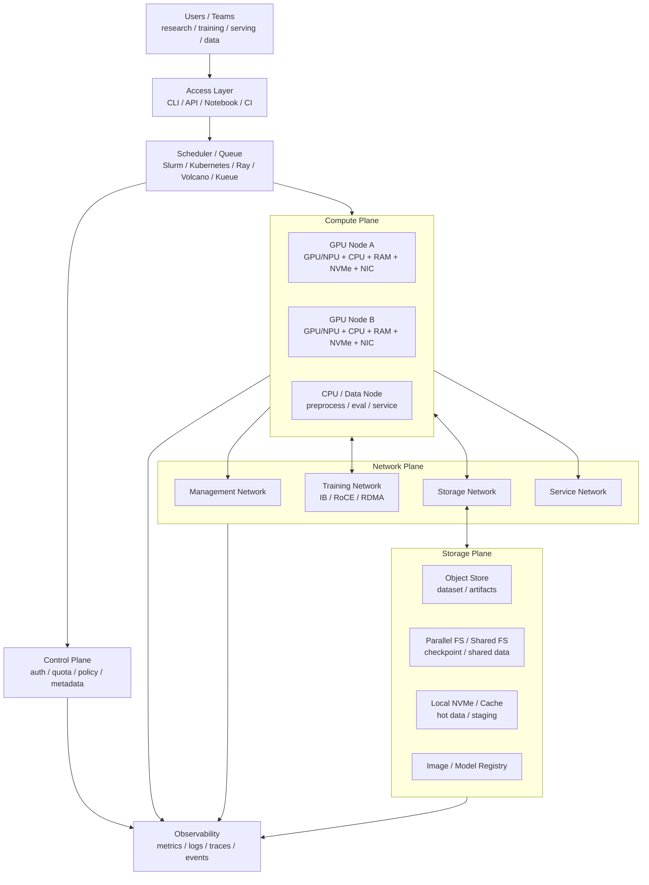

# AI 集群架构总览：节点、网络、存储与调度

当模型、数据、显存、吞吐或并发需求超过单台服务器后，AI 计算就进入集群问题。

集群不是“很多 GPU 服务器放在一起”。真正的 AI 集群要同时解决：

- 计算节点如何组织。
- GPU/NPU 如何分配。
- 多节点网络如何承载 collective。
- 数据集、checkpoint、模型权重如何读写。
- 训练、推理、数据处理和交互实验如何排队。
- 多租户如何隔离。
- 失败如何定位和恢复。
- 资源利用率、排队时间、成本和能效如何度量。

这篇先建立第 7 章的总览框架。

## 集群设计的四个目标

AI 集群设计不是把硬件堆起来，而是同时满足四个目标：

| 目标 | 含义 | 常见失败表现 |
| --- | --- | --- |
| 可用 | 用户能提交任务，服务能稳定运行 | 控制面故障、镜像拉取失败、节点不可用 |
| 高效 | GPU/NPU、网络、存储都能转化为有效吞吐 | GPU 分配率高但利用率低、训练扩展效率差 |
| 公平 | 多团队共享资源时有明确配额和优先级 | 大任务饿死、小任务插队、资源被长期占用 |
| 可复现 | 同一代码、数据、环境和硬件状态能复现结果 | 版本漂移、节点差异、benchmark 不可解释 |

这四个目标经常互相拉扯：

- 为了提高利用率，可能要混跑训练和推理，但会增加隔离难度。
- 为了公平，可能要限制单个团队占用，但会降低某些大任务的启动速度。
- 为了可复现，可能要锁定镜像和驱动，但会降低环境迭代速度。
- 为了降低排队时间，可能要允许抢占，但会增加 checkpoint 和恢复压力。

所以 AI 集群架构是资源、调度、运行时、运维和治理的组合设计。

## 一张总图



这张图表达几个关键点：

- 调度器只是一部分，不等于整个集群。
- GPU 节点不是孤立资源，它依赖网络、存储、镜像、驱动和监控。
- 训练和推理对网络、存储、延迟、隔离的要求不同。
- 集群设计的目标不是“把 GPU 塞满”，而是让真实 workload 稳定、高效、可复现地运行。

## AI 集群要承载哪些 Workload

AI 集群通常不只跑训练。

常见 workload 包括：

| Workload | 特点 |
| --- | --- |
| 交互实验 | notebook、debug、小规模验证，强调响应快 |
| 数据处理 | 清洗、tokenization、packing、embedding 生成，CPU/IO 压力大 |
| 预训练 / 后训练 | 多机多卡、长时间运行、checkpoint 频繁 |
| Fine-tuning | 规模中等，任务数量多，环境差异多 |
| 推理服务 | 长期在线，SLO、尾延迟、弹性和灰度重要 |
| Benchmark | 需要隔离、可复现、固定环境 |
| 评测 / eval | 模型加载多、任务并发多、可能混用 CPU/GPU |
| RAG / Agent | LLM、embedding、retrieval、rerank、tool call 混合 |

不同 workload 对资源的压力不同。

训练关心：

- 多 GPU / 多节点 gang allocation。
- 网络 collective。
- checkpoint 吞吐。
- 长时间稳定性。
- 失败恢复。
- 扩展效率。

推理关心：

- request scheduling。
- TTFT / TPOT / p95 / p99。
- model loading。
- KV Cache。
- 自动扩缩容。
- 服务发现和流量治理。
- 多租户隔离。

数据处理关心：

- 存储吞吐。
- CPU core。
- 内存。
- 本地 NVMe。
- 任务并发。
- 数据版本。

一个集群如果没有区分 workload 类型，就容易出现：训练任务抢占推理网络，checkpoint 冲击存储，交互实验长时间排队，或者推理服务被 batch job 影响尾延迟。

## AI Job 生命周期

一个 AI job 从提交到结束，通常会经历多层系统：

```text
submit
  -> admission / quota check
  -> queue
  -> scheduling / placement
  -> environment preparation
  -> data/model staging
  -> runtime launch
  -> execution and monitoring
  -> checkpoint / artifact write
  -> completion / failure / retry
  -> accounting and cleanup
```

每一步都可能成为瓶颈：

| 阶段 | 常见问题 |
| --- | --- |
| submit | 配置不完整、镜像不存在、权限不足 |
| admission | quota 不足、队列策略不允许、优先级太低 |
| scheduling | 找不到满足 GPU 数量、拓扑、显存、NIC 的节点 |
| environment | 镜像拉取慢、driver/CUDA/NCCL 不匹配 |
| data staging | 数据集读取慢、本地缓存未命中 |
| launch | torchrun/rank/env 配置错误、端口冲突 |
| execution | 网络、存储、GPU health、OOM、NaN、timeout |
| checkpoint | 写入阻塞、文件过多、元数据压力、恢复状态不完整 |
| cleanup | 本地 NVMe 残留、GPU 进程未退出、配额未释放 |
| accounting | 没有记录成本、能耗、失败原因和资源使用 |

总览集群架构时，要把这些步骤当成完整链路，而不是只看调度器是否把 Pod 或 job 放到了节点上。

## 集群里的节点类型

AI 集群通常包含多类节点。

### 控制节点

控制节点运行集群管理组件，例如：

- scheduler control plane。
- API server。
- metadata service。
- auth / identity。
- quota / policy。
- job controller。
- monitoring control component。

控制节点不应承担重计算。它们要高可用、可备份、易恢复。

### 登录 / 开发节点

很多集群会提供 login node 或 dev node。

用途：

- 用户登录。
- 提交任务。
- 编辑配置。
- 编译镜像。
- 小规模 CPU 预处理。

这类节点要避免被当作训练节点滥用。否则容易影响所有用户提交任务和管理集群。

### GPU / NPU 计算节点

计算节点是核心资源。

每台节点不只是 GPU 数量，还包括：

- GPU/NPU 型号和数量。
- GPU-to-GPU 拓扑。
- CPU socket 和 NUMA。
- host memory。
- local NVMe。
- NIC 数量和速率。
- PCIe 拓扑。
- 电源和散热能力。
- driver / firmware / runtime 版本。

调度时不能只看“还有几张 GPU”。一个 8 GPU job 可能需要同一台机器内的 8 张互连良好的 GPU；一个多机训练 job 需要 GPU 和 NIC 拓扑匹配；一个数据处理任务可能更需要 CPU 和 NVMe。

### CPU / 数据节点

并非所有任务都应该占 GPU 节点。

CPU / 数据节点适合：

- 数据清洗。
- tokenization。
- dataset packing。
- embedding 后处理。
- evaluation orchestration。
- feature extraction 的轻量部分。
- storage gateway。

把 CPU/IO-heavy 任务放在 GPU 节点上，可能导致 GPU 空闲但节点资源被占满。

### 存储节点

存储可能是独立系统，也可能由专门节点组成：

- 对象存储。
- 并行文件系统。
- 分布式文件系统。
- NVMe cache。
- metadata server。
- checkpoint storage。

AI workload 对存储的访问通常很突发：训练启动时读数据，checkpoint 时写大文件，推理扩容时同时拉模型权重，RAG 任务检索大量小对象。

## 资源不是一个简单数字

调度系统常把资源抽象成：

```text
GPU: 8
CPU: 128
Memory: 1 TB
```

但 AI 集群真实资源更复杂。

### GPU 资源

GPU 资源要看：

- 型号。
- 显存容量。
- GPU-to-GPU 拓扑。
- MIG / MPS。
- ECC / health 状态。
- power / thermal 状态。
- 是否被同机其他任务干扰。

同样是 8 张 GPU，NVLink/NVSwitch 拓扑不同，TP 性能可能完全不同。

### CPU 与 NUMA

CPU 影响：

- data loader。
- tokenization。
- network stack。
- storage client。
- runtime control。
- model serving frontend。

NUMA 不匹配可能让 CPU 访问远端 memory 或远端 PCIe device，影响 GPU feeding、RDMA 和 storage throughput。

### 本地 NVMe

本地 NVMe 常用于：

- dataset cache。
- checkpoint staging。
- model weight cache。
- shuffle cache。
- temporary files。
- out-of-core 数据。

本地 NVMe 快，但不是共享持久存储。任务失败、节点重启、调度迁移时要考虑数据生命周期。

### NIC 与网络邻近性

多机训练中，GPU 和 NIC 的 PCIe/NUMA 邻近性很重要。

如果某个 rank 使用远端 NIC，或者多个 GPU 争用同一条 PCIe 上行，collective 性能会下降。

所以调度和 rank mapping 应尽量感知：

- GPU/NIC affinity。
- PCIe switch。
- CPU socket。
- multi-rail network。
- rack / leaf / spine 位置。

## Resource Flavor 与容量池

AI 集群里，“一张 GPU”不是一个足够精确的资源单位。更实用的抽象是 Resource Flavor：同一种资源在不同硬件、软件、网络和故障域上的具体变体。

例如，下面这些都应该被看成不同 flavor：

- `H100-80G-NVLink-IB`。
- `A100-80G-PCIe-RoCE`。
- `L40S-48G-serving`。
- `H100-MIG-1g.10gb-interactive`。
- `GPU-with-local-nvme-cache`。
- `GPU-in-rack-a`。
- `GPU-driver-550-cuda-12.4`。

Resource Flavor 不是为了把名字写复杂，而是为了让调度系统知道“这个任务到底能不能跑、跑起来性能是否可预期”。

一个 flavor 通常包含：

| 维度 | 例子 | 为什么重要 |
| --- | --- | --- |
| 加速器型号 | H100、A100、L40S、MI300X | 算力、显存、指令和 kernel 支持不同 |
| 显存容量 | 40GB、80GB、192GB | 决定 batch size、模型切分和 KV Cache 容量 |
| 节点拓扑 | NVLink、NVSwitch、PCIe-only | 影响 TP、EP、collective 和 rank mapping |
| 网络能力 | IB、RoCE、普通以太网、多 rail | 影响多机训练、AllToAll 和 checkpoint |
| 本地存储 | 是否有本地 NVMe、容量、带宽 | 影响数据缓存、模型权重缓存和 checkpoint staging |
| 软件栈 | driver、CUDA/ROCm、NCCL/RCCL、firmware | 影响可运行性、性能和可复现 |
| 健康状态 | ECC、Xid、降频、链路错误 | 影响 job 成功率和稳定性 |
| 故障域 | rack、leaf、power domain、room | 影响可用性和大 job 风险 |

在平台上，flavor 往往还会进一步组织成容量池。

常见容量池包括：

- 交互实验池：给 Notebook、小规模调试、短任务使用。
- 训练池：给多卡、多机、长时间训练使用。
- 推理池：给在线服务、batch inference、RAG/Agent runtime 使用。
- 数据与评测池：给 tokenization、数据清洗、benchmark、evaluation 使用。
- 基准测试池：尽量隔离干扰，用来做稳定性能对比。
- 隔离 / 维护池：放入有健康风险、待升级或待排查的节点。

容量池的核心价值是把不同 SLA 的任务隔开。交互任务追求快启动，训练任务追求大块连续资源，推理任务追求低抖动和稳定尾延迟，benchmark 追求环境干净。如果所有任务都挤在同一个池里，表面上资源利用率可能更高，实际会带来排队不可解释、碎片严重、SLO 抖动和性能归因困难。

## 网络平面

AI 集群通常需要区分不同网络平面。

| 网络平面 | 用途 |
| --- | --- |
| 管理网络 | SSH、控制面、监控、节点管理 |
| 训练网络 | NCCL/RCCL/MPI collective、RDMA、GPU Direct |
| 存储网络 | 数据集、checkpoint、模型权重、对象存储 |
| 服务网络 | 推理请求、API gateway、service mesh、client traffic |

这些流量最好不要无脑混在一起。

训练 collective 具有同步、突发、高带宽特点。checkpoint 写入也可能突发。推理请求则对尾延迟敏感。如果它们争用同一套交换机、队列或链路，问题会很难定位。

### 训练网络

训练网络关注：

- InfiniBand / RoCE / Ethernet。
- RDMA。
- NCCL/RCCL topology。
- rail 优化。
- congestion control。
- collective performance。
- topology-aware scheduling。

训练网络的目标不是单个节点 ping 通，而是在大量节点同时 AllReduce、ReduceScatter、AllGather、AllToAll 时仍然有稳定性能。

### 存储网络

存储网络关注：

- 大文件吞吐。
- 小文件 metadata。
- checkpoint 写入。
- 数据集读取。
- 多 job 并发。
- cache hit/miss。
- failure recovery。

AI 训练很容易把存储打爆：多个 job 同时启动读取数据，或者很多 rank 同时写 checkpoint。存储网络和训练网络需要协同规划。

### 服务网络

推理服务还需要：

- ingress。
- load balancing。
- service discovery。
- health check。
- streaming response。
- rate limit。
- 多 AZ / 多机房部署。

服务网络对 p95/p99 敏感，不适合被训练 collective 或 checkpoint 流量无保护地冲击。

## 故障域与容量域

集群不是一块均匀的大资源池。它由很多故障域和容量域组成。

常见故障域包括：

- 单张 GPU。
- 单台服务器。
- 单个机箱或 tray。
- 单个 rack。
- 单个 leaf switch。
- 单条 rail。
- 单个 storage metadata server。
- 单个 power domain。
- 单个机房区域。
- 镜像仓库、对象存储、DNS、身份系统等共享服务。

故障域关心的是“哪里坏了会影响谁”。容量域关心的是“哪些资源可以被当成一个整体使用”。二者经常相关，但不是同一个概念。

例如：

- 一个 rack 内网络带宽最好，适合作为训练 job 的优先容量域。
- 一个 rack 也是故障域，如果所有副本都放在同 rack，推理服务可用性会下降。
- 一个 leaf switch 下的节点适合降低通信距离，但 leaf 故障会影响整组 job。
- 一个共享 metadata server 能支撑多个训练任务，但 checkpoint 高峰可能成为集群级瓶颈。

所以 AI 集群的放置策略要按 workload 区分：

| Workload | 更偏向集中 | 更偏向分散 |
| --- | --- | --- |
| 多机训练 | 希望 rank 尽量靠近，减少通信代价 | 避免把极长任务放在高风险硬件上 |
| 在线推理 | 单个副本不一定需要靠近 | 副本要跨节点、rack、power domain 分散 |
| batch inference | 取决于模型加载和数据位置 | 可以用空闲碎片资源提高吞吐 |
| checkpoint / 数据任务 | 希望靠近缓存和存储入口 | 避免集中冲击同一 storage target |

这也是为什么 topology-aware scheduling 不能只理解成“离得越近越好”。对训练，近可能更快；对服务，高可用可能要求分散；对容量治理，要在性能、风险和碎片之间取舍。

## 存储层次

AI 集群常见存储层次如下：

```text
Object Store / Data Lake
  -> Parallel FS / Shared FS
  -> Node Local NVMe
  -> GPU HBM / KV Cache
```

不同层次适合不同对象。

| 对象 | 常见位置 | 关键指标 |
| --- | --- | --- |
| 原始数据 | object store / data lake | 容量、成本、版本 |
| 训练样本 | parallel FS / cache | 吞吐、metadata、并发 |
| checkpoint | parallel FS / object store | 写入吞吐、原子性、恢复 |
| 模型权重 | model registry / object store / local cache | 拉取速度、版本、校验 |
| 镜像 | image registry | 分发速度、缓存、漏洞扫描 |
| KV Cache | GPU HBM / host memory / remote cache | latency、容量、命中率 |
| RAG 索引 | vector DB / local SSD / distributed store | 查询延迟、更新、容量 |

一个常见错误是把所有东西都放到一个共享文件系统里。短期方便，长期会遇到：

- metadata server 压力。
- 大量小文件问题。
- checkpoint 互相干扰。
- 模型拉取慢。
- 数据版本混乱。
- 多租户权限复杂。

更合理的做法是按对象生命周期和访问模式分层。

## 调度系统的角色

调度系统的目标不是“谁先来谁先跑”。

它要同时处理：

- queue。
- priority。
- quota。
- fair share。
- gang scheduling。
- preemption。
- backfill。
- bin packing。
- topology awareness。
- fault handling。
- resource accounting。
- multi-tenant isolation。

常见系统包括：

- Slurm：HPC 和大规模训练常见，适合 batch job、队列、分区、fairshare。
- Kubernetes：云原生生态强，适合服务化、容器、控制器、推理平台和混合 workload。
- Ray：适合分布式 Python、RL、数据处理、训练/推理任务编排。
- Volcano / Kueue：面向 Kubernetes 上的 batch、queue、gang scheduling、quota 等能力。

它们不是简单替代关系。很多组织会组合使用：

- Slurm 承载训练集群。
- Kubernetes 承载推理服务和平台组件。
- Ray 承载数据处理或分布式应用层。
- Kueue / Volcano 提供 Kubernetes batch queueing。

关键不是选一个名字，而是明确 workload、隔离、运维和生态需求。

## Admission、Placement 与 Orchestration

很多人把“调度”理解成一个动作：找一台机器，把任务放上去。AI 集群里这个理解太窄了。更准确地说，调度系统至少包含三层语义：

| 层次 | 回答的问题 | 典型内容 |
| --- | --- | --- |
| Admission | 这个任务现在有没有资格进入运行池 | quota、queue、priority、resource flavor、fair share、preemption policy |
| Placement | 这个任务具体放到哪些节点和设备上 | GPU 数量、显存、NUMA、GPU/NIC affinity、rack、failure domain |
| Orchestration | 任务生命周期如何被拉起、监控、重试和清理 | distributed launch、pod/job controller、health check、restart、checkpoint recovery |

这三层经常由不同系统共同完成。

以 Kubernetes 生态为例：

- kube-scheduler 负责把 Pod 放到合适节点上。
- Device Plugin 把 GPU/NPU 等设备暴露给 Kubernetes。
- Kueue / Volcano 负责 batch queue、quota、gang admission、preemption 等批处理语义。
- 自定义 controller 负责训练任务、推理服务、Ray cluster、模型部署等生命周期。
- GPU Operator 或类似组件负责驱动、device plugin、runtime、monitoring 组件的部署和升级。

以 HPC 训练集群为例：

- Slurm partition / account / QOS 更接近 admission 和 policy。
- Slurm scheduler 负责节点分配、backfill、fairshare 等。
- `srun`、MPI launcher、训练框架 launcher 负责 rank 启动。
- 作业脚本、checkpoint 逻辑和监控系统负责运行期恢复。

以 Ray 应用为例：

- 底层集群管理系统先提供节点和容器。
- Ray head/worker 形成应用级资源池。
- Ray scheduler 再把 Python task、actor、placement group 放到 Ray 节点上。

所以设计 AI 集群时，不要只问“用哪个 scheduler”。更应该问：

- 谁决定 job 能不能进入队列。
- 谁决定 job 使用哪个资源池和 flavor。
- 谁决定具体节点、GPU、NIC 和 rank mapping。
- 谁负责 distributed job 的整体启动和失败回收。
- 谁负责资源释放、缓存清理、日志归档和成本记账。

如果这些责任没有明确边界，常见现象是：任务已经被平台接受，但底层排不到资源；Pod 已经创建，但分布式训练 group 不能完整启动；训练失败后 GPU 释放了，但本地缓存、临时文件、日志和配额状态没有清理。

## Gang Scheduling 为什么重要

多机训练通常要求一组资源同时到位。

例如一个 64 GPU job，如果只分配到了 60 张 GPU，任务无法正常启动。即使启动了，也可能因为 rank 数不一致或通信 group 不完整而失败。

Gang scheduling 要保证：

```text
要么整组资源一起分配
要么暂时不启动
```

否则会出现：

- 部分资源被占住但 job 不能运行。
- GPU 空转等待其他 rank。
- 作业反复启动失败。
- 队列碎片化加剧。

训练、分布式评测、大型 batch 推理都可能需要 gang scheduling。

## Topology-Aware Scheduling

Topology-aware scheduling 的目标是让任务形状和硬件形状匹配。

它不是一个单独功能，而是一组放置约束：

- 同机 GPU 是否在同一个 NVSwitch domain。
- GPU 到 NIC 是否跨 CPU socket。
- 多 rail 网络是否能均匀使用。
- 多机任务是否集中在同 rack、同 leaf 或同 pod。
- 本地 NVMe cache 是否在目标节点上。
- 推理副本是否跨故障域分散。
- benchmark 是否避开 noisy neighbor。

对大模型训练来说，拓扑影响很直接：

- TP 对 GPU-to-GPU 带宽敏感，通常希望在同机高速互联内部完成。
- PP 更关注 stage 之间的链路和气泡，跨节点时要关注相邻 stage 的通信。
- DP/ZeRO/FSDP 依赖跨节点 collective，网络拓扑、rail 和拥塞会影响 step time。
- MoE 的 EP/AllToAll 对网络带宽和 tail latency 非常敏感，跨 rack 放置可能带来明显抖动。

对推理来说，拓扑也重要，但目标不同：

- 单模型多 GPU 推理要关注 GPU-to-GPU 拓扑。
- PD 分离部署要关注 prefill、decode、KV 传输和网络距离。
- 多副本服务要关注副本分散，避免单节点或单 rack 故障影响整个服务。
- RAG/Agent 服务要关注向量库、工具服务、模型服务之间的网络路径。

拓扑感知调度常见做法包括：

- 给节点打 label，记录 GPU 型号、网络、rack、failure domain、local NVMe 等。
- 使用 node affinity / anti-affinity / topology spread 约束。
- 把大 job 限定到整节点、整机柜或特定资源池。
- 对训练 job 生成 rank mapping，让 GPU、NIC、NUMA 对齐。
- 对推理副本设置 spread policy，保证可用性。
- 对 benchmark 使用独立池或排他节点。

拓扑信息越细，调度越容易做对；但约束越多，也越容易增加排队时间和碎片。平台要把“必须满足的硬约束”和“尽量满足的软偏好”分开，否则会让队列变得难以解释。

## Fragmentation：资源碎片

GPU 集群最大的利用率问题之一是碎片。

例如一个 8 GPU 节点，已经被几个小任务占用了 1、2、1 张 GPU。剩下 4 张 GPU 看起来空闲，但一个需要 8 张同机 GPU 的训练任务无法运行。

碎片类型包括：

- GPU 数量碎片。
- 显存碎片。
- 同机拓扑碎片。
- CPU/GPU 配比碎片。
- GPU/NIC 邻近性碎片。
- 机柜 / 网络拓扑碎片。
- quota 碎片。

减少碎片的方法包括：

- bin packing。
- backfill。
- 任务大小分区。
- topology-aware scheduling。
- 小任务用 MIG / MPS 或共享池。
- 大任务预留整节点。
- 对交互任务设置时间限制。
- idle reclaim / preemption。

利用率高不等于没有碎片。一个集群可能 GPU 分配率很高，但大任务排队很久。

## 多租户隔离

AI 集群通常被多个团队共享。

隔离要覆盖：

- compute。
- memory。
- GPU。
- network。
- storage。
- namespace。
- secret。
- image。
- log。
- metric。

常见隔离手段：

- Linux cgroup / namespace。
- container。
- Kubernetes namespace / RBAC。
- Slurm account / partition / QOS。
- quota。
- network policy。
- storage ACL。
- MIG。
- process isolation。
- job sandbox。

多租户隔离不只是安全问题，也影响性能。

例如：

- 两个 job 共用同一节点，可能争用 PCIe、CPU、NVMe、NIC。
- 一个 job 大量写 checkpoint，影响另一个 job 数据读取。
- 一个推理服务抢占网络，影响训练 collective。
- 一个用户拉取大镜像，拖慢整个 registry。

所以多租户设计要同时考虑安全边界和性能边界。

## 环境可复现

AI 集群里，“代码没变但跑不起来”经常来自环境漂移。

需要锁定：

- container image。
- driver。
- CUDA / ROCm。
- NCCL / RCCL。
- framework。
- Python package。
- compiler。
- kernel。
- firmware。
- OFED / network driver。
- GPU Operator 或 device plugin。
- storage client。
- environment variables。

训练和推理 benchmark 必须记录这些版本。否则结果很难复现，也无法判断性能变化来自代码、模型、driver 还是硬件。

环境治理通常需要：

- image registry。
- base image 策略。
- dependency lock。
- driver rollout 策略。
- canary node。
- compatibility matrix。
- rollback。
- SBOM / vulnerability scan。

## Cluster Manifest 与 Job Manifest

想让 AI 集群可复现，不能只靠“大家记得版本”。平台需要把集群状态和任务状态记录成 manifest。

Cluster Manifest 记录“这批资源长什么样”：

- 节点型号、GPU/NPU 型号、显存、CPU、内存、本地盘。
- GPU topology、PCIe、NVLink/NVSwitch、GPU/NIC affinity。
- 网络类型、rail、RDMA、switch、rack、failure domain。
- driver、firmware、CUDA/ROCm、NCCL/RCCL、OFED。
- Kubernetes/Slurm/Ray/Volcano/Kueue 等平台版本。
- device plugin、GPU Operator、container runtime。
- storage client、filesystem mount、object store endpoint。
- 镜像仓库、监控 agent、日志 agent、安全策略。
- 节点健康状态、维护窗口、入池/出池时间。

Job Manifest 记录“这个任务是怎么跑的”：

- 代码 commit。
- container image digest。
- Python/Conda/package lock。
- 模型版本、tokenizer 版本、配置文件。
- 数据集版本、数据 shard、数据过滤规则。
- 资源请求：GPU、CPU、memory、NVMe、network、resource flavor。
- 分布式配置：DP、TP、PP、EP、world size、rank mapping。
- 关键环境变量：NCCL、CUDA、OMP、通信后端等。
- checkpoint 路径和恢复点。
- benchmark 配置、seed、profiling 开关。
- 提交人、项目、队列、优先级、成本归属。

这两个 manifest 的作用不同：

- Cluster Manifest 用于解释“同一个任务为什么在这批节点上表现不同”。
- Job Manifest 用于解释“同一个代码为什么这次结果和上次不同”。

如果只有 job 日志，没有 cluster manifest，性能回归可能查不到硬件、驱动、网络或存储变化。如果只有集群 CMDB，没有 job manifest，训练结果、benchmark 数据和成本归因也无法追溯。

更成熟的做法是把 manifest 和监控、日志、profile、checkpoint 关联起来。这样排查问题时可以回答：

- 这个 job 跑在哪些节点和 GPU 上。
- 当时这些节点的 driver、NCCL、网络和健康状态是什么。
- 是否和其他任务共享了节点、rack、storage target 或网络链路。
- 性能变化发生在代码变更、镜像升级、驱动升级还是硬件维护之后。

## 可观测性

AI 集群需要比普通服务更多维度的可观测性。

### 节点与设备

需要采集：

- GPU utilization。
- HBM usage。
- GPU power。
- temperature。
- clocks。
- ECC/Xid/link error。
- PCIe/NVLink 状态。
- CPU、memory、disk、NIC。

### 作业与队列

需要采集：

- queue time。
- run time。
- allocation。
- pending reason。
- preemption。
- failure reason。
- retry count。
- GPU allocation vs actual utilization。
- team / project / user accounting。

### 网络

需要采集：

- RDMA bandwidth。
- packet loss / retry。
- congestion。
- PFC / ECN。
- switch port utilization。
- NCCL/RCCL collective time。

### 存储

需要采集：

- read/write throughput。
- metadata ops。
- latency。
- cache hit rate。
- checkpoint duration。
- error rate。

### 推理服务

需要采集：

- QPS。
- TTFT。
- TPOT。
- p95 / p99。
- tokens/s。
- batch size。
- KV Cache usage。
- cache hit rate。
- model loading time。

没有可观测性，调度、网络、存储和训练框架之间的责任边界会变得模糊。

## 集群指标

AI 集群要同时看效率、公平、稳定和成本。

| 指标 | 含义 |
| --- | --- |
| GPU allocation | GPU 被分配的比例 |
| GPU utilization | GPU 实际忙碌程度 |
| queue time | 任务等待时间 |
| job success rate | 任务成功率 |
| preemption rate | 被抢占比例 |
| fragmentation | 空闲资源能否组成目标 shape |
| scaling efficiency | 多节点扩展效率 |
| checkpoint overhead | checkpoint 占 step time 比例 |
| storage throughput | 数据和 checkpoint 吞吐 |
| network collective time | 通信时间占比 |
| p95/p99 latency | 推理尾延迟 |
| tokens/s/GPU | 每 GPU 有效 token 吞吐 |
| tokens/s/W | 能效 |
| cost/token | 成本 |

注意 GPU allocation 和 GPU utilization 不一样。

一个 job 分配了 GPU，但在等数据、等网络、等 CPU、等 checkpoint，GPU allocation 很高，实际 utilization 很低。平台如果只看 allocation，会误以为集群很忙；用户却觉得任务很慢。

## 容量规划闭环

AI 集群的容量规划不能只看“还剩多少 GPU”。它需要形成闭环：

```text
需求进入
  -> workload 分类
  -> 资源 shape 统计
  -> 队列和碎片分析
  -> 性能瓶颈定位
  -> 容量池调整
  -> 调度策略调整
  -> benchmark 验证
  -> 成本与能效复盘
  -> 下一轮规划
```

每一轮容量规划都要同时看四类信号。

第一类是需求信号：

- 哪些团队提交任务最多。
- 任务是训练、推理、数据处理、评测还是交互实验。
- 典型 shape 是 1 GPU、8 GPU、64 GPU 还是更多。
- 任务运行时间是分钟、小时还是数周。
- 是否需要特定 GPU 型号、显存、网络或本地盘。

第二类是等待信号：

- queue time 主要来自没有 GPU，还是没有连续 GPU。
- pending reason 是 quota、priority、gang、flavor、topology 还是存储限制。
- 大任务是否长期等不到整节点或整机柜。
- 小任务是否挤占了大任务所需的连续资源。

第三类是运行信号：

- GPU utilization 和 tokens/s/GPU 是否合理。
- step time 里 compute、communication、data loading、checkpoint 各占多少。
- 推理服务的 TTFT、TPOT、p99、tokens/s/W 是否稳定。
- 存储和网络是否在高峰期成为瓶颈。

第四类是治理信号：

- preemption 是否过多。
- fair share 是否符合组织目标。
- benchmark 是否受到 noisy neighbor 影响。
- 成本是否能按 job、team、model、service 归因。
- 能耗、功率上限和散热是否影响可用容量。

容量治理的目标不是永远买更多 GPU，而是回答三个问题：

- 现有 GPU 为什么没有转化为有效吞吐。
- 哪些 workload 需要独立资源池或不同 flavor。
- 下一批硬件、网络、存储和软件投入应该补在哪个瓶颈上。

很多时候，最有效的容量提升不是加 GPU，而是减少碎片、改进 checkpoint、优化镜像分发、分离训练/推理网络、改善数据缓存，或者把小任务迁移到更合适的共享池。

## 训练集群与推理集群的差异

训练集群更像 batch/HPC 系统：

- 大 job。
- 长时间运行。
- 多机 gang scheduling。
- 通信密集。
- checkpoint 重要。
- 失败恢复重要。
- 吞吐和扩展效率重要。

推理集群更像在线服务系统：

- 长期运行。
- 请求动态到达。
- SLO 和 p99 重要。
- autoscaling。
- load balancing。
- rolling upgrade。
- model registry。
- traffic routing。
- cache。

混合集群可以提高资源利用率，但会增加隔离难度。尤其要避免训练流量影响推理 SLO。

## 常见部署形态

### HPC 风格训练集群

典型特征：

- Slurm。
- 裸机或轻量容器。
- InfiniBand。
- 并行文件系统。
- 大规模 batch queue。
- 用户提交训练脚本。

优势是训练效率和 HPC 生态成熟。挑战是服务化、多租户平台能力、弹性和云原生集成。

### Kubernetes AI 平台

典型特征：

- Kubernetes。
- container。
- GPU Operator / device plugin。
- namespace / RBAC。
- CRD / controller。
- Kueue / Volcano / Kubeflow / Ray。
- 推理服务和平台组件统一管理。

优势是平台化和服务生态强。挑战是大规模 gang scheduling、RDMA、拓扑感知、低抖动和 HPC 级训练性能。

### 混合架构

很多组织采用混合：

- Slurm 管训练。
- Kubernetes 管推理、平台服务、数据服务。
- 对象存储和模型仓库共享。
- 统一身份、镜像、监控和审计。

混合架构的问题是边界要清晰，否则用户体验会割裂，资源核算也复杂。

## 常见误区

### 误区一：有 GPU 就是 AI 集群

GPU 只是集群的一部分。没有网络、存储、调度、镜像、监控、错误处理和配额，GPU 很难稳定转化为有效产出。

### 误区二：只追求 GPU 利用率

利用率高不代表体验好。大任务可能排队很久，推理 p99 可能很差，checkpoint 可能很慢。要同时看 queue time、SLO、成功率和成本。

### 误区三：训练和推理混跑不需要隔离

训练通信和 checkpoint 流量可能影响推理尾延迟。混跑可以，但必须设计网络、存储和调度隔离。

### 误区四：存储后面再说

数据输入和 checkpoint 是训练系统的关键路径。存储规划滞后，会让 GPU 等数据、等 checkpoint、等模型加载。

### 误区五：调度只看 GPU 数量

AI job 还需要 CPU、内存、NVMe、NIC、拓扑、显存和健康状态。只按 GPU 数调度会制造碎片和性能不确定性。

### 误区六：环境问题靠用户自己解决

驱动、CUDA、NCCL、framework、镜像和网络库版本不一致，会直接影响可复现和稳定性。平台必须提供环境治理。

## 设计检查清单

设计 AI 集群时，可以按下面检查：

- 有哪些 workload：训练、推理、数据处理、交互实验、评测。
- 每类 workload 的资源 shape 是什么。
- 是否定义了 resource flavor：型号、显存、网络、拓扑、软件栈、故障域。
- 是否把交互、训练、推理、数据、benchmark、维护隔离成合适容量池。
- admission、placement、orchestration 的责任边界是否清晰。
- 调度是否支持 quota、priority、gang、preemption、backfill。
- GPU topology 是否进入调度和 rank mapping。
- 拓扑约束是否区分硬约束和软偏好。
- 故障域和容量域是否被记录并进入放置策略。
- 网络是否区分训练、存储、管理、服务流量。
- 存储是否按数据、checkpoint、模型、镜像分层。
- 本地 NVMe cache 的生命周期是否清晰。
- 镜像、driver、CUDA、NCCL、framework 是否可复现。
- 是否维护 cluster manifest 和 job manifest。
- 是否采集 GPU、网络、存储、队列、作业、推理指标。
- 多租户隔离是否覆盖性能和安全。
- 故障节点是否能自动隔离。
- 作业结束后是否清理本地缓存、临时文件、日志和配额状态。
- 成本是否按 job、team、model、service 归因。
- 容量规划是否形成需求、队列、运行、治理的闭环。
- Benchmark 是否覆盖真实排队、网络、存储和多租户场景。

## 小结

AI 集群可以理解为：

```text
计算节点
  + 高速网络
  + 分层存储
  + 调度队列
  + 容器和环境
  + 可观测性
  + 多租户治理
  + 故障处理
```

其中任何一层薄弱，都会表现为 GPU 等待、任务失败、排队时间长、推理尾延迟差或成本不可控。

第 7 章后续主题会进一步展开：

- 调度系统。
- GPU 拓扑与资源隔离。
- RDMA 网络与 NCCL topology。
- 存储、数据缓存与 checkpoint。
- 容器镜像与环境可复现。
- 多租户、公平性、成本和能效。
- 节点生命周期、健康检查和容量治理。

## 延伸阅读

- [Kubernetes Scheduling Documentation](https://kubernetes.io/docs/concepts/scheduling-eviction/kube-scheduler/)
- [Kubernetes Device Plugins](https://kubernetes.io/docs/concepts/extend-kubernetes/compute-storage-net/device-plugins/)
- [Kubernetes Persistent Volumes](https://kubernetes.io/docs/concepts/storage/persistent-volumes/)
- [Slurm Workload Manager Documentation](https://slurm.schedmd.com/documentation.html)
- [NVIDIA NCCL Documentation](https://docs.nvidia.com/deeplearning/nccl/user-guide/docs/index.html)
- [NVIDIA GPU Operator Documentation](https://docs.nvidia.com/datacenter/cloud-native/gpu-operator/latest/index.html)
- [Kueue Documentation](https://kueue.sigs.k8s.io/docs/overview/)
- [Kueue Resource Flavor](https://kueue.sigs.k8s.io/docs/concepts/resource_flavor/)
- [Volcano Documentation](https://volcano.sh/en/docs/)
- [Ray Cluster Documentation](https://docs.ray.io/en/latest/cluster/getting-started.html)
