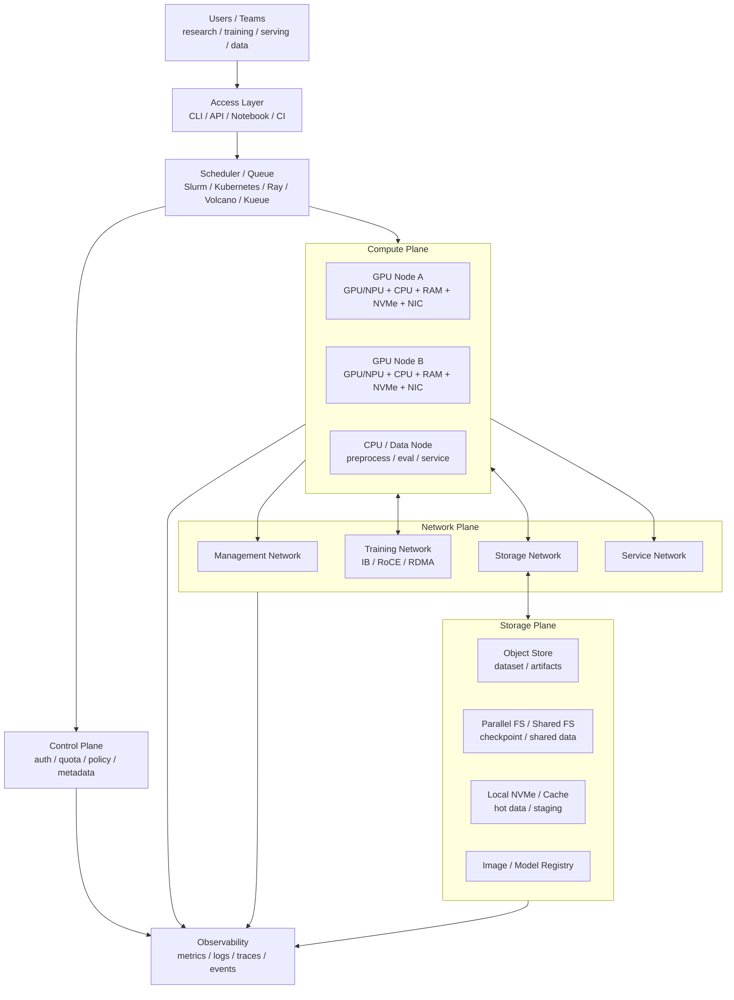

# AI 集群架构总览：节点、网络、存储与调度

当模型、数据、显存、吞吐或并发需求超过单台服务器后，AI 计算就进入集群问题。

集群不是“很多 GPU 服务器放在一起”。真正的 AI 集群要同时解决：

- 计算节点如何组织。
- GPU/NPU 如何分配。
- 多节点网络如何承载 collective。
- 数据集、checkpoint、模型权重如何读写。
- 训练、推理、数据处理和交互实验如何排队。
- 多租户如何隔离。
- 失败如何定位和恢复。
- 资源利用率、排队时间、成本和能效如何度量。

这篇先建立第 7 章的总览框架。

## 一张总图



这张图表达几个关键点：

- 调度器只是一部分，不等于整个集群。
- GPU 节点不是孤立资源，它依赖网络、存储、镜像、驱动和监控。
- 训练和推理对网络、存储、延迟、隔离的要求不同。
- 集群设计的目标不是“把 GPU 塞满”，而是让真实 workload 稳定、高效、可复现地运行。

## AI 集群要承载哪些 Workload

AI 集群通常不只跑训练。

常见 workload 包括：

| Workload | 特点 |
| --- | --- |
| 交互实验 | notebook、debug、小规模验证，强调响应快 |
| 数据处理 | 清洗、tokenization、packing、embedding 生成，CPU/IO 压力大 |
| 预训练 / 后训练 | 多机多卡、长时间运行、checkpoint 频繁 |
| Fine-tuning | 规模中等，任务数量多，环境差异多 |
| 推理服务 | 长期在线，SLO、尾延迟、弹性和灰度重要 |
| Benchmark | 需要隔离、可复现、固定环境 |
| 评测 / eval | 模型加载多、任务并发多、可能混用 CPU/GPU |
| RAG / Agent | LLM、embedding、retrieval、rerank、tool call 混合 |

不同 workload 对资源的压力不同。

训练关心：

- 多 GPU / 多节点 gang allocation。
- 网络 collective。
- checkpoint 吞吐。
- 长时间稳定性。
- 失败恢复。
- 扩展效率。

推理关心：

- request scheduling。
- TTFT / TPOT / p95 / p99。
- model loading。
- KV Cache。
- 自动扩缩容。
- 服务发现和流量治理。
- 多租户隔离。

数据处理关心：

- 存储吞吐。
- CPU core。
- 内存。
- 本地 NVMe。
- 任务并发。
- 数据版本。

一个集群如果没有区分 workload 类型，就容易出现：训练任务抢占推理网络，checkpoint 冲击存储，交互实验长时间排队，或者推理服务被 batch job 影响尾延迟。

## 集群里的节点类型

AI 集群通常包含多类节点。

### 控制节点

控制节点运行集群管理组件，例如：

- scheduler control plane。
- API server。
- metadata service。
- auth / identity。
- quota / policy。
- job controller。
- monitoring control component。

控制节点不应承担重计算。它们要高可用、可备份、易恢复。

### 登录 / 开发节点

很多集群会提供 login node 或 dev node。

用途：

- 用户登录。
- 提交任务。
- 编辑配置。
- 编译镜像。
- 小规模 CPU 预处理。

这类节点要避免被当作训练节点滥用。否则容易影响所有用户提交任务和管理集群。

### GPU / NPU 计算节点

计算节点是核心资源。

每台节点不只是 GPU 数量，还包括：

- GPU/NPU 型号和数量。
- GPU-to-GPU 拓扑。
- CPU socket 和 NUMA。
- host memory。
- local NVMe。
- NIC 数量和速率。
- PCIe 拓扑。
- 电源和散热能力。
- driver / firmware / runtime 版本。

调度时不能只看“还有几张 GPU”。一个 8 GPU job 可能需要同一台机器内的 8 张互连良好的 GPU；一个多机训练 job 需要 GPU 和 NIC 拓扑匹配；一个数据处理任务可能更需要 CPU 和 NVMe。

### CPU / 数据节点

并非所有任务都应该占 GPU 节点。

CPU / 数据节点适合：

- 数据清洗。
- tokenization。
- dataset packing。
- embedding 后处理。
- evaluation orchestration。
- feature extraction 的轻量部分。
- storage gateway。

把 CPU/IO-heavy 任务放在 GPU 节点上，可能导致 GPU 空闲但节点资源被占满。

### 存储节点

存储可能是独立系统，也可能由专门节点组成：

- 对象存储。
- 并行文件系统。
- 分布式文件系统。
- NVMe cache。
- metadata server。
- checkpoint storage。

AI workload 对存储的访问通常很突发：训练启动时读数据，checkpoint 时写大文件，推理扩容时同时拉模型权重，RAG 任务检索大量小对象。

## 资源不是一个简单数字

调度系统常把资源抽象成：

```text
GPU: 8
CPU: 128
Memory: 1 TB
```

但 AI 集群真实资源更复杂。

### GPU 资源

GPU 资源要看：

- 型号。
- 显存容量。
- GPU-to-GPU 拓扑。
- MIG / MPS。
- ECC / health 状态。
- power / thermal 状态。
- 是否被同机其他任务干扰。

同样是 8 张 GPU，NVLink/NVSwitch 拓扑不同，TP 性能可能完全不同。

### CPU 与 NUMA

CPU 影响：

- data loader。
- tokenization。
- network stack。
- storage client。
- runtime control。
- model serving frontend。

NUMA 不匹配可能让 CPU 访问远端 memory 或远端 PCIe device，影响 GPU feeding、RDMA 和 storage throughput。

### 本地 NVMe

本地 NVMe 常用于：

- dataset cache。
- checkpoint staging。
- model weight cache。
- shuffle cache。
- temporary files。
- out-of-core 数据。

本地 NVMe 快，但不是共享持久存储。任务失败、节点重启、调度迁移时要考虑数据生命周期。

### NIC 与网络邻近性

多机训练中，GPU 和 NIC 的 PCIe/NUMA 邻近性很重要。

如果某个 rank 使用远端 NIC，或者多个 GPU 争用同一条 PCIe 上行，collective 性能会下降。

所以调度和 rank mapping 应尽量感知：

- GPU/NIC affinity。
- PCIe switch。
- CPU socket。
- multi-rail network。
- rack / leaf / spine 位置。

## 网络平面

AI 集群通常需要区分不同网络平面。

| 网络平面 | 用途 |
| --- | --- |
| 管理网络 | SSH、控制面、监控、节点管理 |
| 训练网络 | NCCL/RCCL/MPI collective、RDMA、GPU Direct |
| 存储网络 | 数据集、checkpoint、模型权重、对象存储 |
| 服务网络 | 推理请求、API gateway、service mesh、client traffic |

这些流量最好不要无脑混在一起。

训练 collective 具有同步、突发、高带宽特点。checkpoint 写入也可能突发。推理请求则对尾延迟敏感。如果它们争用同一套交换机、队列或链路，问题会很难定位。

### 训练网络

训练网络关注：

- InfiniBand / RoCE / Ethernet。
- RDMA。
- NCCL/RCCL topology。
- rail 优化。
- congestion control。
- collective performance。
- topology-aware scheduling。

训练网络的目标不是单个节点 ping 通，而是在大量节点同时 AllReduce、ReduceScatter、AllGather、AllToAll 时仍然有稳定性能。

### 存储网络

存储网络关注：

- 大文件吞吐。
- 小文件 metadata。
- checkpoint 写入。
- 数据集读取。
- 多 job 并发。
- cache hit/miss。
- failure recovery。

AI 训练很容易把存储打爆：多个 job 同时启动读取数据，或者很多 rank 同时写 checkpoint。存储网络和训练网络需要协同规划。

### 服务网络

推理服务还需要：

- ingress。
- load balancing。
- service discovery。
- health check。
- streaming response。
- rate limit。
- 多 AZ / 多机房部署。

服务网络对 p95/p99 敏感，不适合被训练 collective 或 checkpoint 流量无保护地冲击。

## 存储层次

AI 集群常见存储层次如下：

```text
Object Store / Data Lake
  -> Parallel FS / Shared FS
  -> Node Local NVMe
  -> GPU HBM / KV Cache
```

不同层次适合不同对象。

| 对象 | 常见位置 | 关键指标 |
| --- | --- | --- |
| 原始数据 | object store / data lake | 容量、成本、版本 |
| 训练样本 | parallel FS / cache | 吞吐、metadata、并发 |
| checkpoint | parallel FS / object store | 写入吞吐、原子性、恢复 |
| 模型权重 | model registry / object store / local cache | 拉取速度、版本、校验 |
| 镜像 | image registry | 分发速度、缓存、漏洞扫描 |
| KV Cache | GPU HBM / host memory / remote cache | latency、容量、命中率 |
| RAG 索引 | vector DB / local SSD / distributed store | 查询延迟、更新、容量 |

一个常见错误是把所有东西都放到一个共享文件系统里。短期方便，长期会遇到：

- metadata server 压力。
- 大量小文件问题。
- checkpoint 互相干扰。
- 模型拉取慢。
- 数据版本混乱。
- 多租户权限复杂。

更合理的做法是按对象生命周期和访问模式分层。

## 调度系统的角色

调度系统的目标不是“谁先来谁先跑”。

它要同时处理：

- queue。
- priority。
- quota。
- fair share。
- gang scheduling。
- preemption。
- backfill。
- bin packing。
- topology awareness。
- fault handling。
- resource accounting。
- multi-tenant isolation。

常见系统包括：

- Slurm：HPC 和大规模训练常见，适合 batch job、队列、分区、fairshare。
- Kubernetes：云原生生态强，适合服务化、容器、控制器、推理平台和混合 workload。
- Ray：适合分布式 Python、RL、数据处理、训练/推理任务编排。
- Volcano / Kueue：面向 Kubernetes 上的 batch、queue、gang scheduling、quota 等能力。

它们不是简单替代关系。很多组织会组合使用：

- Slurm 承载训练集群。
- Kubernetes 承载推理服务和平台组件。
- Ray 承载数据处理或分布式应用层。
- Kueue / Volcano 提供 Kubernetes batch queueing。

关键不是选一个名字，而是明确 workload、隔离、运维和生态需求。

## Gang Scheduling 为什么重要

多机训练通常要求一组资源同时到位。

例如一个 64 GPU job，如果只分配到了 60 张 GPU，任务无法正常启动。即使启动了，也可能因为 rank 数不一致或通信 group 不完整而失败。

Gang scheduling 要保证：

```text
要么整组资源一起分配
要么暂时不启动
```

否则会出现：

- 部分资源被占住但 job 不能运行。
- GPU 空转等待其他 rank。
- 作业反复启动失败。
- 队列碎片化加剧。

训练、分布式评测、大型 batch 推理都可能需要 gang scheduling。

## Fragmentation：资源碎片

GPU 集群最大的利用率问题之一是碎片。

例如一个 8 GPU 节点，已经被几个小任务占用了 1、2、1 张 GPU。剩下 4 张 GPU 看起来空闲，但一个需要 8 张同机 GPU 的训练任务无法运行。

碎片类型包括：

- GPU 数量碎片。
- 显存碎片。
- 同机拓扑碎片。
- CPU/GPU 配比碎片。
- GPU/NIC 邻近性碎片。
- 机柜 / 网络拓扑碎片。
- quota 碎片。

减少碎片的方法包括：

- bin packing。
- backfill。
- 任务大小分区。
- topology-aware scheduling。
- 小任务用 MIG / MPS 或共享池。
- 大任务预留整节点。
- 对交互任务设置时间限制。
- idle reclaim / preemption。

利用率高不等于没有碎片。一个集群可能 GPU 分配率很高，但大任务排队很久。

## 多租户隔离

AI 集群通常被多个团队共享。

隔离要覆盖：

- compute。
- memory。
- GPU。
- network。
- storage。
- namespace。
- secret。
- image。
- log。
- metric。

常见隔离手段：

- Linux cgroup / namespace。
- container。
- Kubernetes namespace / RBAC。
- Slurm account / partition / QOS。
- quota。
- network policy。
- storage ACL。
- MIG。
- process isolation。
- job sandbox。

多租户隔离不只是安全问题，也影响性能。

例如：

- 两个 job 共用同一节点，可能争用 PCIe、CPU、NVMe、NIC。
- 一个 job 大量写 checkpoint，影响另一个 job 数据读取。
- 一个推理服务抢占网络，影响训练 collective。
- 一个用户拉取大镜像，拖慢整个 registry。

所以多租户设计要同时考虑安全边界和性能边界。

## 环境可复现

AI 集群里，“代码没变但跑不起来”经常来自环境漂移。

需要锁定：

- container image。
- driver。
- CUDA / ROCm。
- NCCL / RCCL。
- framework。
- Python package。
- compiler。
- kernel。
- firmware。
- OFED / network driver。
- GPU Operator 或 device plugin。
- storage client。
- environment variables。

训练和推理 benchmark 必须记录这些版本。否则结果很难复现，也无法判断性能变化来自代码、模型、driver 还是硬件。

环境治理通常需要：

- image registry。
- base image 策略。
- dependency lock。
- driver rollout 策略。
- canary node。
- compatibility matrix。
- rollback。
- SBOM / vulnerability scan。

## 可观测性

AI 集群需要比普通服务更多维度的可观测性。

### 节点与设备

需要采集：

- GPU utilization。
- HBM usage。
- GPU power。
- temperature。
- clocks。
- ECC/Xid/link error。
- PCIe/NVLink 状态。
- CPU、memory、disk、NIC。

### 作业与队列

需要采集：

- queue time。
- run time。
- allocation。
- pending reason。
- preemption。
- failure reason。
- retry count。
- GPU allocation vs actual utilization。
- team / project / user accounting。

### 网络

需要采集：

- RDMA bandwidth。
- packet loss / retry。
- congestion。
- PFC / ECN。
- switch port utilization。
- NCCL/RCCL collective time。

### 存储

需要采集：

- read/write throughput。
- metadata ops。
- latency。
- cache hit rate。
- checkpoint duration。
- error rate。

### 推理服务

需要采集：

- QPS。
- TTFT。
- TPOT。
- p95 / p99。
- tokens/s。
- batch size。
- KV Cache usage。
- cache hit rate。
- model loading time。

没有可观测性，调度、网络、存储和训练框架之间的责任边界会变得模糊。

## 集群指标

AI 集群要同时看效率、公平、稳定和成本。

| 指标 | 含义 |
| --- | --- |
| GPU allocation | GPU 被分配的比例 |
| GPU utilization | GPU 实际忙碌程度 |
| queue time | 任务等待时间 |
| job success rate | 任务成功率 |
| preemption rate | 被抢占比例 |
| fragmentation | 空闲资源能否组成目标 shape |
| scaling efficiency | 多节点扩展效率 |
| checkpoint overhead | checkpoint 占 step time 比例 |
| storage throughput | 数据和 checkpoint 吞吐 |
| network collective time | 通信时间占比 |
| p95/p99 latency | 推理尾延迟 |
| tokens/s/GPU | 每 GPU 有效 token 吞吐 |
| tokens/s/W | 能效 |
| cost/token | 成本 |

注意 GPU allocation 和 GPU utilization 不一样。

一个 job 分配了 GPU，但在等数据、等网络、等 CPU、等 checkpoint，GPU allocation 很高，实际 utilization 很低。平台如果只看 allocation，会误以为集群很忙；用户却觉得任务很慢。

## 训练集群与推理集群的差异

训练集群更像 batch/HPC 系统：

- 大 job。
- 长时间运行。
- 多机 gang scheduling。
- 通信密集。
- checkpoint 重要。
- 失败恢复重要。
- 吞吐和扩展效率重要。

推理集群更像在线服务系统：

- 长期运行。
- 请求动态到达。
- SLO 和 p99 重要。
- autoscaling。
- load balancing。
- rolling upgrade。
- model registry。
- traffic routing。
- cache。

混合集群可以提高资源利用率，但会增加隔离难度。尤其要避免训练流量影响推理 SLO。

## 常见部署形态

### HPC 风格训练集群

典型特征：

- Slurm。
- 裸机或轻量容器。
- InfiniBand。
- 并行文件系统。
- 大规模 batch queue。
- 用户提交训练脚本。

优势是训练效率和 HPC 生态成熟。挑战是服务化、多租户平台能力、弹性和云原生集成。

### Kubernetes AI 平台

典型特征：

- Kubernetes。
- container。
- GPU Operator / device plugin。
- namespace / RBAC。
- CRD / controller。
- Kueue / Volcano / Kubeflow / Ray。
- 推理服务和平台组件统一管理。

优势是平台化和服务生态强。挑战是大规模 gang scheduling、RDMA、拓扑感知、低抖动和 HPC 级训练性能。

### 混合架构

很多组织采用混合：

- Slurm 管训练。
- Kubernetes 管推理、平台服务、数据服务。
- 对象存储和模型仓库共享。
- 统一身份、镜像、监控和审计。

混合架构的问题是边界要清晰，否则用户体验会割裂，资源核算也复杂。

## 常见误区

### 误区一：有 GPU 就是 AI 集群

GPU 只是集群的一部分。没有网络、存储、调度、镜像、监控、错误处理和配额，GPU 很难稳定转化为有效产出。

### 误区二：只追求 GPU 利用率

利用率高不代表体验好。大任务可能排队很久，推理 p99 可能很差，checkpoint 可能很慢。要同时看 queue time、SLO、成功率和成本。

### 误区三：训练和推理混跑不需要隔离

训练通信和 checkpoint 流量可能影响推理尾延迟。混跑可以，但必须设计网络、存储和调度隔离。

### 误区四：存储后面再说

数据输入和 checkpoint 是训练系统的关键路径。存储规划滞后，会让 GPU 等数据、等 checkpoint、等模型加载。

### 误区五：调度只看 GPU 数量

AI job 还需要 CPU、内存、NVMe、NIC、拓扑、显存和健康状态。只按 GPU 数调度会制造碎片和性能不确定性。

### 误区六：环境问题靠用户自己解决

驱动、CUDA、NCCL、framework、镜像和网络库版本不一致，会直接影响可复现和稳定性。平台必须提供环境治理。

## 设计检查清单

设计 AI 集群时，可以按下面检查：

- 有哪些 workload：训练、推理、数据处理、交互实验、评测。
- 每类 workload 的资源 shape 是什么。
- 调度是否支持 quota、priority、gang、preemption、backfill。
- GPU topology 是否进入调度和 rank mapping。
- 网络是否区分训练、存储、管理、服务流量。
- 存储是否按数据、checkpoint、模型、镜像分层。
- 本地 NVMe cache 的生命周期是否清晰。
- 镜像、driver、CUDA、NCCL、framework 是否可复现。
- 是否采集 GPU、网络、存储、队列、作业、推理指标。
- 多租户隔离是否覆盖性能和安全。
- 故障节点是否能自动隔离。
- 成本是否按 job、team、model、service 归因。
- Benchmark 是否覆盖真实排队、网络、存储和多租户场景。

## 小结

AI 集群可以理解为：

```text
计算节点
  + 高速网络
  + 分层存储
  + 调度队列
  + 容器和环境
  + 可观测性
  + 多租户治理
  + 故障处理
```

其中任何一层薄弱，都会表现为 GPU 等待、任务失败、排队时间长、推理尾延迟差或成本不可控。

第 7 章后续主题会进一步展开：

- 调度系统。
- GPU 拓扑与资源隔离。
- RDMA 网络与 NCCL topology。
- 存储、数据缓存与 checkpoint。
- 容器镜像与环境可复现。
- 多租户、公平性、成本和能效。

## 延伸阅读

- [Kubernetes Scheduling Documentation](https://kubernetes.io/docs/concepts/scheduling-eviction/kube-scheduler/)
- [Kubernetes Device Plugins](https://kubernetes.io/docs/concepts/extend-kubernetes/compute-storage-net/device-plugins/)
- [Kubernetes Persistent Volumes](https://kubernetes.io/docs/concepts/storage/persistent-volumes/)
- [Slurm Workload Manager Documentation](https://slurm.schedmd.com/documentation.html)
- [NVIDIA NCCL Documentation](https://docs.nvidia.com/deeplearning/nccl/user-guide/docs/index.html)
- [NVIDIA GPU Operator Documentation](https://docs.nvidia.com/datacenter/cloud-native/gpu-operator/latest/index.html)
- [Kueue Documentation](https://kueue.sigs.k8s.io/)
- [Volcano Documentation](https://volcano.sh/en/docs/)
