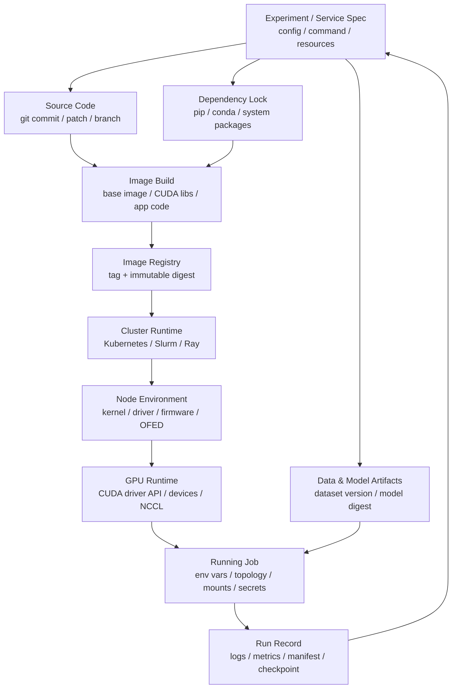

# 环境可复现：镜像、驱动、CUDA 与依赖锁定

AI 系统里的“可复现”不只是训练脚本里写一个 `seed=42`。在真实集群里，同一份代码换一台机器、换一个镜像、换一个 CUDA minor version、换一个 NCCL 版本、换一个 Python wheel，结果都可能变成：

- 任务根本启动不了。
- 能启动，但某个算子找不到。
- 能训练，但 loss 曲线不同。
- 精度相近，但性能差很多。
- 单机可复现，多机不可复现。
- 今天能跑，半年后拉不到同一个依赖。

所以 AI Infra 里的环境可复现要回答的是：

> 给定一次实验、训练任务或推理服务，我们能否在未来某一天、另一批节点、另一个队列中，尽量还原它当时使用的代码、数据、镜像、驱动、CUDA、库版本、配置、硬件和运行约束？

这篇文章讨论的不是“数学意义上完全相同的结果”，而是工程上可管理、可追溯、可诊断、可回滚的运行环境。

## 一张总图



这张图表达一个基本事实：可复现不是某一个文件，而是一条链。

如果只锁 Python 依赖，不锁镜像 digest，仍然可能漂移。
如果只锁镜像，不记录 host driver，仍然可能漂移。
如果只记录 driver，不记录数据版本，实验仍然不可复现。
如果只记录实验配置，不记录运行时拓扑，性能问题仍然很难复盘。

## 可复现的四个层次

“可复现”要分层讨论。不同目标需要的严格程度不同。

| 层次 | 目标 | 典型问题 | 主要手段 |
| --- | --- | --- | --- |
| 可启动 | 任务能重新跑起来 | 镜像拉不到、驱动不匹配、依赖缺失 | 镜像 digest、driver/CUDA 兼容矩阵、基础健康检查 |
| 可追溯 | 知道当时跑的是什么 | tag 被覆盖、配置丢失、数据版本不清 | run manifest、artifact digest、配置归档 |
| 可对比 | 结果和性能可比较 | 版本小变导致吞吐变化、数据 shuffle 不同 | 固定依赖、记录硬件/拓扑/seed、统一 benchmark |
| 尽量确定 | 同环境下结果尽量一致 | 非确定性算子、并行归约顺序、cuDNN autotune | deterministic 设置、固定算法、牺牲部分性能 |

很多工程团队真正需要的不是“每个 bit 完全一致”，而是：

- 能找回同一个运行环境。
- 能解释为什么结果或性能变了。
- 能快速回滚到一个已知能工作的版本。
- 能把实验、训练、推理、benchmark 的差异控制在可理解范围内。

## 环境由哪些层组成

AI 任务的运行环境通常可以拆成七层。

### 硬件与固件

包括：

- GPU 型号、显存容量、SM 架构、PCIe/NVLink/NVSwitch 拓扑。
- CPU 型号、NUMA 拓扑、内存容量和频率。
- NIC/HCA 型号、端口速率、RDMA firmware。
- 本地 NVMe、RAID、文件系统、挂载参数。
- BIOS、PCIe ACS、IOMMU、Resizable BAR 等平台配置。

这些不是“背景信息”，它们会影响：

- kernel 是否能使用某类 Tensor Core 指令。
- NCCL ring/tree 选择。
- GPU Direct RDMA 是否可用。
- 本地 NVMe cache 是否成为瓶颈。
- 同一镜像在不同节点上的吞吐是否一致。

所以关键实验和 benchmark 至少要记录：

```text
gpu model / gpu count / gpu memory
driver version
cuda runtime visible to application
nccl version
cpu model
numa layout
nic model / link speed
kernel version
node hostname or node pool
```

### Host OS、Kernel 与 Driver

容器可以封装用户态依赖，但不能把所有东西都装进镜像里。GPU driver、kernel module、container runtime、cgroup 行为、RDMA driver、文件系统 driver 通常仍然依赖宿主机。

AI 集群里最常见的问题之一是：

> 镜像没变，代码没变，但换了一批节点后任务失败或性能下降。

这时原因常常在 host 层：

- NVIDIA driver 版本不同。
- GPU firmware 或 NVSwitch firmware 不同。
- OFED/RDMA stack 不同。
- kernel 参数不同。
- container runtime 配置不同。
- `/dev/nvidia*`、MIG、MPS、IPC、shared memory 挂载不同。

因此，节点不应该只是“有 GPU 就能跑”。更好的方式是定义 node image 或 node profile：

| Profile | 内容 |
| --- | --- |
| `gpu-h100-cuda12-prod` | H100 节点、指定 driver、指定 OFED、指定 kernel、指定 container runtime |
| `gpu-a100-cuda11-legacy` | A100 旧任务兼容池，保留 CUDA 11 系列运行能力 |
| `gpu-l40s-infer` | 推理节点池，偏重模型加载、NVMe cache 和服务稳定性 |
| `gpu-h100-benchmark` | benchmark 专用池，尽量减少后台干扰和版本漂移 |

### CUDA、Driver 与用户态库

CUDA 环境容易混淆，因为它不是一个单一版本号。

至少要区分：

- NVIDIA kernel driver。
- CUDA driver API。
- CUDA runtime library，例如 `libcudart`。
- CUDA toolkit，例如 `nvcc`、headers、profiling 工具。
- cuBLAS、cuDNN、cuSPARSE、NCCL、TensorRT 等上层库。
- PyTorch、JAX、TensorFlow 这些框架编译时绑定的 CUDA 版本。

`nvidia-smi` 里显示的 `CUDA Version` 不等于你的 Python 框架实际使用的全部 CUDA 用户态库版本。它更多反映 driver 支持的 CUDA 能力上限。

NVIDIA 官方 CUDA compatibility 文档把兼容关系拆成 backward compatibility、minor version compatibility 和 forward compatibility。工程上可以简化理解为：

- 新 driver 通常可以跑旧 CUDA 应用。
- CUDA 11 之后，同一个 major 系列内存在 minor version compatibility，但有最低 driver 要求。
- 某些新特性需要新 driver 支持，旧 driver 上可能报 `cudaErrorCallRequiresNewerDriver`。
- 依赖 PTX JIT 的应用在旧 driver 上更容易遇到兼容问题。
- 编译自定义 CUDA kernel 时，要明确目标架构，例如 `sm_80`、`sm_90`。

这意味着环境声明不能只写：

```text
CUDA 12
```

更好的写法是：

```text
driver: 535.XXX
cuda runtime: 12.2
cuda toolkit in image: 12.2
torch: 2.x + cu12x wheel
nccl: 2.x
target arch: sm_80, sm_90
```

### 容器镜像

容器镜像是 AI 环境复现的核心载体，但它不是全部。

镜像适合封装：

- Linux userspace。
- Python/Conda 环境。
- CUDA userspace libraries。
- PyTorch/JAX/TensorFlow。
- 自定义 C++/CUDA extension。
- Triton kernel、编译缓存策略、服务代码。
- 启动脚本和默认环境变量。

镜像不适合也通常不能完整封装：

- GPU kernel driver。
- 物理 GPU 设备。
- NIC firmware。
- 宿主机 kernel。
- 调度系统策略。
- 实际网络拓扑。

NVIDIA Container Toolkit 的作用就是把容器和宿主机 GPU 运行时连接起来：容器启动时注入 GPU 设备、驱动相关库和必要挂载，让容器里的进程可以访问 GPU。这也是为什么“同一个镜像”在不同 driver 节点上仍可能表现不同。

### Python 与包管理环境

Python 依赖漂移是 AI 项目里最常见的复现问题。

容易漂移的来源包括：

- `requirements.txt` 只写顶层依赖，没有锁 transitive dependency。
- `torch>=2.3`、`transformers>=...` 这类范围过宽。
- `pip install -U` 出现在 Dockerfile 或启动脚本里。
- 安装源不同，wheel 选择不同。
- 同一包在不同 Python 版本、平台、CUDA 版本下选择了不同构建。
- 自定义 extension 在不同编译器、不同 `TORCH_CUDA_ARCH_LIST` 下生成不同二进制。

pip 官方文档把 repeatable installs 分成不同强度：固定版本、hash checking、wheelhouse。工程上可以对应三档：

| 方式 | 复现强度 | 适用场景 |
| --- | --- | --- |
| 固定版本 | 中 | 研发日常、快速迭代 |
| 固定版本 + hash | 高 | CI、生产镜像、关键实验 |
| wheelhouse / 私有镜像源 | 更高 | 离线集群、长期归档、受控部署 |

Conda 环境也类似。`environment.yml` 适合表达意图，但不是最严格的锁定方式；显式 lockfile 或 conda-lock 这类工具更适合长期复现。

### 代码、数据与模型工件

很多实验环境“看起来复现了”，但其实数据或模型变了。

必须明确记录：

- Git commit。
- 是否有未提交 patch。
- 配置文件内容，而不是只记录配置文件路径。
- 数据集版本、数据预处理版本、采样规则。
- tokenizer 版本。
- base model digest。
- checkpoint digest。
- 评测集版本。
- prompt template 或 serving template。

如果数据目录只是：

```text
/mnt/datasets/latest
```

那它不是一个可复现输入。更好的方式是：

```text
dataset: s3://bucket/datasets/corpus-v2026-06-01/
manifest: sha256:...
preprocess: git commit abc123
tokenizer: model-x-tokenizer-v3 sha256:...
```

### 运行时配置

运行时配置常常比镜像更容易被忽略。

需要记录：

- 命令行参数。
- 环境变量。
- Kubernetes Pod spec 或 Slurm sbatch script。
- GPU 数量、CPU、memory、shared memory。
- volume mount。
- secret/configmap 版本。
- NCCL、CUDA、OMP、MKL、PyTorch 相关 env。
- rank mapping。
- node list。
- 网络接口选择。
- 是否启用 flash attention、torch compile、CUDA graphs。

一次训练或推理服务的 run manifest 至少应该能回答：

```text
谁跑的？
什么时候跑的？
在哪些节点上跑的？
用哪个镜像 digest？
用哪个代码 commit？
用哪些数据和模型 artifact？
用什么命令和配置？
用了哪些关键环境变量？
产出了哪些 checkpoint、日志和指标？
```

## 镜像 Tag 与 Digest

Kubernetes 官方文档明确区分 image tag 和 image digest：tag 可以移动，digest 是内容哈希。生产环境应避免使用 `:latest`，因为它会让“同一个 YAML”在不同时间拉到不同内容。

错误示例：

```yaml
containers:
  - name: train
    image: registry.example.com/aikg/train:latest
```

稍好但仍不够严格：

```yaml
containers:
  - name: train
    image: registry.example.com/aikg/train:v0.8.3
```

更适合复现：

```yaml
containers:
  - name: train
    image: registry.example.com/aikg/train@sha256:...
```

实践上可以同时保留 tag 和 digest：

```yaml
containers:
  - name: train
    image: registry.example.com/aikg/train:v0.8.3@sha256:...
```

这样人能看懂版本名，系统按 digest 拉取不可变内容。

## AI 镜像应该如何分层

AI 镜像如果没有分层策略，会出现两个问题：

- 每次业务代码改动都导致几十 GB 镜像重建和重新分发。
- 基础依赖漂移后很难判断问题来自系统层、框架层还是业务层。

一个常见分层是：

```text
base-os
  -> cuda-runtime
  -> framework-runtime
  -> infra-libs
  -> project-deps
  -> project-code
  -> entrypoint
```

示例：

| 层 | 内容 | 变更频率 |
| --- | --- | --- |
| Base OS | Ubuntu、glibc、基础工具 | 低 |
| CUDA Runtime | CUDA userspace、cuDNN、NCCL | 低到中 |
| Framework | PyTorch/JAX/TensorFlow | 中 |
| Infra Libs | vLLM、Triton、TensorRT-LLM、Ray | 中 |
| Project Deps | requirements/conda lock | 中到高 |
| Project Code | 训练脚本、服务代码 | 高 |
| Runtime Config | entrypoint、默认 env | 高 |

分层的目标不是让镜像“看起来整齐”，而是让问题定位更快：

- 只有业务代码层变了，性能回退多半不是 driver 问题。
- CUDA/NCCL 层变了，通信、kernel、编译行为都需要重新验证。
- base image 变了，要重新跑系统依赖和安全扫描。

## Dockerfile 的常见风险

不可复现的 Dockerfile 常常长这样：

```dockerfile
FROM nvidia/cuda:12.4.0-runtime-ubuntu22.04

RUN apt-get update && apt-get install -y python3-pip
RUN pip install torch transformers accelerate
RUN git clone https://github.com/example/project.git
RUN pip install -U some-package
```

主要问题：

- base image 只用了 tag，没有 digest。
- apt 仓库状态随时间变化。
- Python 依赖没有固定版本。
- 没有 hash 校验。
- 直接 clone 默认分支。
- 构建时和运行时边界不清。
- 没有记录构建 metadata。

更好的方向：

```dockerfile
FROM nvidia/cuda:12.4.0-runtime-ubuntu22.04@sha256:...

ARG GIT_COMMIT
ARG BUILD_TIME

LABEL org.opencontainers.image.revision=$GIT_COMMIT
LABEL org.opencontainers.image.created=$BUILD_TIME

COPY requirements.lock /tmp/requirements.lock
RUN python -m pip install --require-hashes -r /tmp/requirements.lock

COPY . /workspace/app
WORKDIR /workspace/app
```

这个例子不是完整模板，但表达几个原则：

- base image 固定 digest。
- 依赖从 lockfile 安装。
- 关键 metadata 写入镜像 label。
- 代码来自构建上下文，而不是构建时拉一个可变分支。

## Driver/CUDA 兼容策略

集群里不可能每个任务都要求管理员立刻升级 driver。更现实的策略是维护少数几个经过验证的环境组合。

例如：

| 环境族 | Host driver | 镜像 CUDA | 框架 | 用途 |
| --- | --- | --- | --- | --- |
| `cuda11-legacy` | 兼容 CUDA 11 | CUDA 11.x | 旧 PyTorch/JAX | 旧实验复现 |
| `cuda12-stable` | 兼容 CUDA 12 | CUDA 12.x | 当前主力框架 | 主力训练/推理 |
| `cuda12-compile` | 兼容 CUDA 12 | CUDA toolkit + nvcc | 自定义 kernel | Triton/CUDA extension 开发 |
| `cuda-next` | 新 driver | 新 toolkit | 预研 | 新硬件、新算子验证 |

不要让每个项目各自选择 driver/CUDA 组合。否则集群会变成：

- 节点池越来越碎。
- 镜像越来越多。
- 排障时无法判断是不是环境组合问题。
- 升级和安全修复难以推进。

更好的方式是：

1. 定义官方支持矩阵。
2. 每个矩阵组合有 smoke test。
3. 新组合进入 `experimental`，稳定后进入 `stable`。
4. 老组合设置 deprecation timeline。
5. 所有任务记录所用环境族。

## 依赖锁定

依赖锁定要区分“声明想要什么”和“记录实际安装了什么”。

### requirements.txt

这种文件常用于声明顶层依赖：

```text
torch
transformers
datasets
```

它适合人读，但不适合复现。

### requirements.lock

更适合复现的 lockfile 会固定 transitive dependency：

```text
torch==2.x.y
transformers==x.y.z
tokenizers==x.y.z
numpy==x.y.z
...
```

如果使用 pip 的 hash-checking，还会记录每个包的 hash，避免同名同版本包内容变化或安装源异常。

### wheelhouse

长期复现或离线集群可以使用 wheelhouse：

```text
requirements.lock
  -> pip wheel
  -> wheelhouse archive
  -> offline install
```

它的价值是：

- 安装不依赖公网。
- 避免重复编译。
- 控制安装源。
- 适合归档关键实验环境。

代价是 wheelhouse 通常和 OS、Python 版本、CPU 架构、CUDA 版本有关，不是天然跨平台。

### Conda Lock

Conda 的 `environment.yml` 适合描述环境，但如果要更强复现，应该生成 lockfile。conda-lock 这类工具会针对目标平台生成锁定结果，安装时尽量避免重新求解依赖。

这对 AI 环境很重要，因为 solver 重新求解可能导致：

- 同一个 `environment.yml` 在不同时间解析出不同版本。
- Linux/macOS 解析结果不同。
- CUDA 相关包选择不同。
- 某个底层依赖升级导致 ABI 变化。

## 随机性与数值可复现

环境可复现不等于结果 bitwise identical。

PyTorch 官方 reproducibility 文档强调：不同 PyTorch release、不同平台、CPU/GPU 之间不保证完全可复现；但可以控制随机源、避免部分非确定性算法，从而减少不确定性。

常见随机源包括：

- Python `random`。
- NumPy RNG。
- PyTorch CPU/GPU RNG。
- DataLoader worker 的 seed。
- 数据 shuffle 顺序。
- dropout、sampling、augmentation。
- cuDNN benchmarking。
- 某些并行归约和 atomic 操作。
- 分布式训练中的通信顺序和失败重试。

基础设置通常包括：

```python
import random
import numpy as np
import torch

seed = 42
random.seed(seed)
np.random.seed(seed)
torch.manual_seed(seed)
torch.cuda.manual_seed_all(seed)

torch.backends.cudnn.benchmark = False
torch.use_deterministic_algorithms(True)
```

但要理解代价：

- deterministic 算法可能更慢。
- 某些操作没有 deterministic 实现。
- 分布式大规模训练很难保证严格 bitwise 一致。
- 编译器、kernel fusion、Tensor Core、混合精度都会带来数值差异。

因此，工程上更常用的是“可比较”而不是“绝对一致”：

- 相同环境下 loss 曲线在合理范围内一致。
- benchmark 使用固定输入和固定参数。
- 推理服务比较 p50/p95/p99、吞吐、错误率，而不是只看单次延迟。
- 模型评测使用固定 eval set、固定 prompt、固定 decoding 参数。

## 运行清单：Run Manifest

每次关键训练、benchmark、推理发布，都应该产出一个 run manifest。

示例：

```yaml
run_id: train-2026-06-11-001
type: training
owner: team-a
created_at: 2026-06-11T10:30:00Z

code:
  repo: git@github.com:example/project.git
  commit: abc123
  dirty: false

image:
  name: registry.example.com/aikg/train
  tag: v0.8.3
  digest: sha256:...

environment:
  node_pool: gpu-h100-cuda12-prod
  driver: 535.xxx
  cuda_runtime: "12.2"
  torch: "2.x"
  nccl: "2.x"

input:
  dataset: s3://bucket/datasets/corpus-v2026-06-01/
  dataset_manifest: sha256:...
  tokenizer: tokenizer-v3
  base_model: model-x@sha256:...

runtime:
  scheduler: kubernetes
  namespace: research
  gpu: 64
  cpu_per_pod: 64
  memory_per_pod: 512Gi
  command: ["python", "train.py", "--config", "configs/run.yaml"]
  env:
    NCCL_DEBUG: WARN
    CUDA_DEVICE_MAX_CONNECTIONS: "1"

output:
  checkpoint: s3://bucket/checkpoints/run-001/
  metrics: https://metrics.example.com/run-001
  logs: s3://bucket/logs/run-001/
```

manifest 的价值不只是归档。它可以用于：

- 失败后重跑。
- 性能回退排查。
- 镜像升级影响分析。
- 数据版本审计。
- 训练和推理版本对齐。
- AI agent 读取并理解系统历史。

## 环境升级策略

AI 环境必须升级，否则会积累安全、性能和硬件支持问题。但升级不能靠“大家自己试一下”。

推荐流程：

```text
proposal
  -> build candidate image
  -> smoke test
  -> unit / integration test
  -> representative benchmark
  -> canary jobs
  -> stable release
  -> deprecate old image
```

### Smoke Test

目标是验证能启动、能看到 GPU、能跑最小算子：

```bash
python - <<'PY'
import torch
print(torch.__version__)
print(torch.cuda.is_available())
print(torch.cuda.get_device_name(0))
x = torch.randn(4096, 4096, device="cuda")
y = x @ x
torch.cuda.synchronize()
print(y.mean().item())
PY
```

### Distributed Smoke Test

验证 NCCL 和多卡通信：

```text
single-node all_reduce
multi-node all_reduce
multi-node all_gather
small message latency
large message bandwidth
```

### Representative Benchmark

不要只跑 `deviceQuery` 或一个 matmul。AI 环境升级要覆盖典型 workload：

- LLM prefill/decode。
- 训练 step time。
- DataLoader + storage path。
- checkpoint save/restore。
- distributed all-reduce/all-to-all。
- torch compile / Triton kernel。
- vLLM/TensorRT-LLM/SGLang 服务启动和压测。

## 生产推理环境可复现

推理服务的可复现重点和训练略有不同。

训练更关注：

- 数据版本。
- checkpoint。
- optimizer state。
- 随机性。
- 分布式拓扑。

推理更关注：

- 模型权重 digest。
- tokenizer 和 chat template。
- serving engine 版本。
- decoding 参数。
- quantization artifact。
- TensorRT engine / CUDA graph / compile cache。
- KV cache 配置。
- 请求路由和 batch 策略。

一次推理发布至少应记录：

```text
model artifact digest
tokenizer digest
chat template version
serving image digest
engine version
quantization config
max context length
batching policy
sampling defaults
hardware profile
rollback target
```

如果只记录“部署了 model-x v3”，后续很难解释：

- 为什么同一个 prompt 输出格式变了。
- 为什么吞吐变了。
- 为什么某些语言效果变差。
- 为什么 p99 latency 上升。

## 编译缓存与生成物

现代 AI 系统越来越依赖 runtime compilation：

- TorchInductor 编译 kernel。
- Triton JIT 编译 kernel。
- TensorRT 构建 engine。
- vLLM/SGLang 可能使用编译缓存或 CUDA graphs。
- 自定义 CUDA extension 在安装或首次运行时编译。

这些生成物也要纳入复现思路。

需要记录：

- 编译输入：模型、shape、dtype、backend config。
- 编译环境：compiler、CUDA toolkit、driver、GPU arch。
- 生成物 digest。
- cache key。
- 是否允许 fallback。
- cache miss 时的性能影响。

否则常见现象是：

- 第一次启动慢很多。
- 某些节点 cache miss，性能不一致。
- 升级 driver 后旧 engine 不可用。
- shape 变化导致重新编译。
- debug 时不知道实际运行的是 eager、compiled 还是 fallback kernel。

## 多租户与环境隔离

集群里多个团队共用节点时，环境可复现还涉及隔离。

需要关注：

- 不同任务是否共享 host path。
- 用户是否能修改共享 Conda 环境。
- 镜像是否允许运行时安装依赖。
- notebook 环境和 batch job 环境是否一致。
- 开发镜像是否进入生产。
- root 权限、privileged container、host IPC 是否被滥用。
- `/dev/shm`、tmp、NVMe cache 是否互相污染。

一个常见原则是：

```text
开发环境可以灵活，但关键实验和生产任务必须 immutable。
```

也就是说：

- Notebook 可以探索。
- Exploratory job 可以快速装包。
- 关键训练必须使用固定镜像。
- Benchmark 必须使用固定镜像和固定节点池。
- 生产推理必须使用 digest、签名和发布流程。

## 版本命名

环境版本命名应表达兼容边界，而不是只表达日期。

不太好的命名：

```text
latest
new
test
cuda
torch
```

更好的命名：

```text
train-cu122-torch24-v3
infer-cu124-vllm09-v2
bench-h100-cu122-nccl2x-v1
legacy-a100-cu118-torch21-v5
```

命名中通常包含：

- 用途：train / infer / bench / dev。
- CUDA major/minor。
- 框架或 serving engine。
- 硬件目标。
- 递增版本。

但真正用于复现的仍然应该是 digest 和 manifest，名字只是方便人沟通。

## 可观测性

环境可复现也需要可观测性。

建议在任务启动时自动打印或上报：

```text
git commit
image digest
python version
torch version
torch cuda version
driver version
nccl version
gpu model
visible devices
cuda device capability
important env vars
node name
rank mapping
```

训练日志开头可以包含：

```text
ENV SNAPSHOT
  image: registry.example.com/aikg/train@sha256:...
  commit: abc123
  torch: 2.x
  cuda: 12.x
  driver: 535.xxx
  nccl: 2.x
  gpu: H100-SXM
  nodes: node-[001-008]
```

这样做的价值很直接：当某个实验半年后被重新分析时，不需要靠记忆推断当时环境。

## 常见误区

### 误区一：用了 Docker 就可复现

容器镜像只是用户态封装。GPU driver、kernel、RDMA、节点拓扑、调度策略仍然可能变化。

### 误区二：固定 tag 就等于固定版本

tag 可以被覆盖。digest 才是内容寻址。

### 误区三：`nvidia-smi` 的 CUDA Version 就是实际运行库版本

它不能替代对 PyTorch/JAX、`libcudart`、cuDNN、NCCL 等用户态库的记录。

### 误区四：只要 seed 一样结果就一样

分布式训练、非确定性算子、不同硬件、不同框架版本都可能导致差异。

### 误区五：开发环境可以直接进生产

开发环境通常允许临时装包和手工修改。生产环境需要 immutable、可追溯、可回滚。

### 误区六：升级环境只需要跑单机 smoke test

AI 环境升级必须覆盖多机通信、数据读取、checkpoint、推理服务和典型模型。

## 设计检查清单

- 是否有官方支持的环境矩阵。
- 每个环境矩阵是否有 owner、状态和 deprecation 计划。
- 镜像是否使用 digest，而不是只使用 tag。
- 是否避免生产环境使用 `:latest`。
- base image 是否固定 digest。
- Python/Conda 依赖是否有 lockfile。
- 关键依赖是否有 hash 或 wheelhouse。
- 自定义 CUDA extension 是否记录编译参数和目标架构。
- 任务是否记录 Git commit 和 dirty 状态。
- 数据、模型、tokenizer 是否有版本和 digest。
- 运行配置是否完整归档。
- 是否记录 node pool、driver、CUDA、NCCL、GPU 型号。
- 是否有 run manifest。
- 是否有环境升级 smoke test 和 representative benchmark。
- 是否有回滚目标。
- 是否区分 dev、train、infer、benchmark 镜像。
- 是否能在半年后回答“这个结果是怎么跑出来的”。

## 小结

AI 环境可复现的核心不是“把所有东西塞进一个镜像”，而是把运行环境拆成可管理的层：

```text
hardware / firmware
  -> host OS / kernel / driver
  -> CUDA / NCCL / framework
  -> container image
  -> package lock
  -> code / data / model
  -> runtime config
  -> run manifest
```

对研发和基础设施团队来说，最务实的目标是：

- 镜像 immutable。
- 依赖 lock。
- 输入 artifact 可追溯。
- 运行 manifest 完整。
- 环境矩阵受控。
- 升级有 benchmark。
- 回滚有明确目标。

做到这些，环境问题就不会再隐藏在“代码没变但结果变了”这种模糊描述里，而能被拆解、定位和治理。

## 延伸阅读

- [NVIDIA CUDA Compatibility](https://docs.nvidia.com/deploy/cuda-compatibility/latest/)
- [NVIDIA Container Toolkit Architecture Overview](https://docs.nvidia.com/datacenter/cloud-native/container-toolkit/latest/arch-overview.html)
- [Kubernetes Images](https://kubernetes.io/docs/concepts/containers/images/)
- [OCI Image Format Specification](https://github.com/opencontainers/image-spec/blob/main/spec.md)
- [pip Repeatable Installs](https://pip.pypa.io/en/stable/topics/repeatable-installs/)
- [conda-lock](https://conda.github.io/conda-lock/)
- [PyTorch Reproducibility](https://docs.pytorch.org/docs/2.12/notes/randomness.html)
