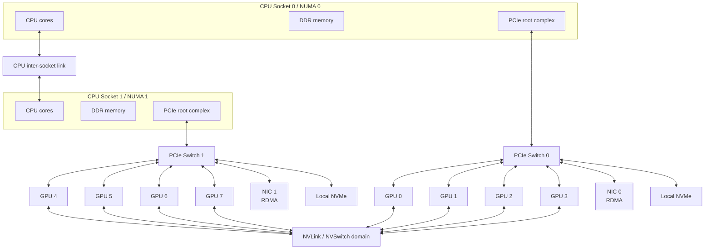

# GPU 拓扑、NUMA、MIG/MPS 与资源隔离

AI 集群调度不能只看“还有几张 GPU”。同样是 8 张 GPU，可能是一台服务器内互连很强的 8 张卡，也可能分散在多个节点；可能 GPU 和 NIC 在同一个 PCIe switch 下，也可能隔着 CPU socket；可能是整卡独占，也可能是 MIG 分片或 MPS 共享。

这些差异会直接影响：

- Tensor Parallel 的 GPU-to-GPU 通信。
- 多机训练的 GPU-to-NIC RDMA 路径。
- DataLoader 和 CPU preprocessing 的 NUMA 访问。
- 推理服务的 p95/p99。
- 多租户隔离和故障影响范围。
- 集群碎片和资源利用率。

这篇关注的问题是：

> 一个 AI workload 拿到的 GPU，到底处在怎样的硬件拓扑和隔离边界里？

## 一张单机拓扑图



这张图强调几个事实：

- GPU 与 GPU 之间可能通过 NVLink/NVSwitch，也可能通过 PCIe。
- GPU 与 NIC 是否靠近，会影响 RDMA 和 NCCL/RCCL 性能。
- GPU 与 CPU socket / host memory 是否靠近，会影响 DataLoader、runtime、H2D/D2H copy。
- 本地 NVMe 也有拓扑位置，不是所有 GPU 访问它都等价。
- 单机内部已经有 NUMA-like 差异，多机之后差异更大。

## 拓扑为什么重要

AI workload 对拓扑敏感，主要因为它们不是单个进程独立计算。

### GPU-to-GPU

Tensor Parallel、Pipeline Parallel、Expert Parallel、KV Cache transfer 都会让 GPU 之间通信。

如果 GPU pair 之间是 NVLink/NVSwitch，通信路径通常更快；如果走 PCIe，甚至跨 CPU socket，延迟和带宽会明显不同。

对 TP 来说，这种差异尤其明显：

```text
每个 Transformer layer 都可能有 collective
高频通信走慢链路
  -> Tensor Core 等待
  -> tokens/s 下降
  -> p99 变差
```

### GPU-to-NIC

多机训练和分布式推理依赖 NIC。

如果 GPU 和 NIC 在同一个 PCIe switch 或同一个 NUMA 近邻域，GPU Direct RDMA 更容易走到高效路径。如果 GPU 使用远端 NIC，可能需要跨 CPU socket 或更复杂路径，增加延迟并降低有效带宽。

这会影响：

- DDP AllReduce。
- FSDP/ZeRO ReduceScatter / AllGather。
- MoE AllToAll。
- P/D 分离中的 KV transfer。
- 多节点 TP。

### GPU-to-CPU / Host Memory

CPU 仍然负责很多工作：

- DataLoader。
- tokenization。
- runtime control。
- model serving frontend。
- storage client。
- logging / metrics。

如果 CPU thread 绑定在远端 NUMA node，而 GPU 挂在另一个 socket 下，H2D copy、page pinning、network stack、storage IO 都可能受影响。

### GPU-to-NVMe

本地 NVMe 常用于：

- dataset cache。
- checkpoint staging。
- model weight cache。
- temporary shard。

但 NVMe 也挂在某个 PCIe root complex 下。某些 GPU 访问它更近，某些 GPU 访问它更远。数据密集任务要关注这种 locality。

## 常见拓扑关系

可以把拓扑关系分成几类。

| 关系 | 含义 | 影响 |
| --- | --- | --- |
| same GPU | 同一张卡 | 无跨 GPU 通信 |
| same NVLink domain | GPU 间有高速互连 | 适合 TP、P2P、KV transfer |
| same PCIe switch | 同一 PCIe switch 下 | 比跨 socket 好，但通常弱于 NVLink |
| same CPU socket | 同 NUMA 域 | CPU/GPU/NIC 访问更近 |
| cross socket | 跨 CPU socket | 可能经过 UPI/QPI/Infinity Fabric 等链路 |
| cross node | 跨服务器 | 依赖 IB/RoCE/Ethernet |
| cross rack | 跨机架或更远 | 受网络层级和拥塞影响 |

调度和 rank mapping 要尽量让高频通信发生在近距离关系中。

## 读懂 `nvidia-smi topo -m`

NVIDIA 系统里常用 `nvidia-smi topo -m` 查看 GPU、NIC、CPU affinity 的拓扑关系。

常见输出会显示：

- GPU 与 GPU 之间的连接类型。
- GPU 与 NIC 之间的亲和性。
- CPU affinity。
- NUMA affinity。

不同系统中的标记可能包括 NVLink、PCIe switch、host bridge、system link 等含义。具体解释要以当前 `nvidia-smi` 文档和输出说明为准。

使用时重点不是记住缩写，而是回答：

- 哪些 GPU 之间最近。
- 哪些 GPU 适合组成 TP group。
- 哪些 GPU 更靠近哪张 NIC。
- 哪些 CPU cores 更适合服务某些 GPU。
- 是否存在跨 socket 路径。
- 调度分配是否打散了本该放近的 rank。

典型流程：

1. 查看 `nvidia-smi topo -m`。
2. 找到 GPU-to-GPU 关系。
3. 找到 GPU-to-NIC 关系。
4. 结合 NUMA 绑定 CPU worker。
5. 结合 NCCL topology / profiler 观察通信是否符合预期。

## NUMA：CPU、内存和 PCIe 的局部性

NUMA 是 Non-Uniform Memory Access。多 socket 服务器中，每个 CPU socket 通常有自己的本地内存和 PCIe root complex。访问本地资源比访问远端资源更快。

AI 节点里，NUMA 影响：

- CPU thread 访问 host memory。
- pinned memory。
- H2D/D2H copy。
- DataLoader 到 GPU 的数据路径。
- GPU 和 NIC 的 PCIe 路径。
- storage client。
- tokenizer / preprocessing。

一个常见问题：

```text
GPU 在 NUMA 0
NIC 在 NUMA 0
DataLoader thread 跑在 NUMA 1
host memory 分配在 NUMA 1
```

结果数据要跨 socket，再到 GPU/NIC，带来额外延迟和带宽损失。

### NUMA 绑定原则

常见原则：

- 让服务某个 GPU 的 CPU thread 靠近该 GPU。
- 让 GPU 使用邻近 NIC。
- 让 pinned memory 尽量在近端 NUMA 分配。
- DataLoader worker 不要随机散到远端 socket。
- 多进程训练中，rank 与 GPU/CPU/NIC 一起绑定。
- 同一节点上多个任务避免争用同一个 socket 的 CPU/NIC/NVMe。

NUMA 不是只属于 CPU 优化。多 GPU AI 节点里，它直接影响端到端吞吐。

## GPU/NIC Affinity 与多 Rail

多机训练常有多个 NIC。

理想状态下：

- GPU 0-3 使用 NIC 0。
- GPU 4-7 使用 NIC 1。
- 每张 NIC 服务拓扑邻近的 GPU。
- NCCL/RCCL 能识别多 rail。
- 网络流量均匀分布。

如果所有 GPU 都挤到同一张 NIC，或者远端 GPU 访问远端 NIC，网络性能会下降。

需要关注：

- NIC 和 GPU 是否在同一 PCIe switch / root complex。
- 多 NIC 是否都被通信库使用。
- rail 分配是否对称。
- rank order 是否让通信组跨越不必要路径。
- 交换机层面是否也有 rail 对应关系。

GPU/NIC affinity 是 topology-aware scheduling 的核心输入之一。

## MIG：硬件级 GPU 分区

MIG 是 Multi-Instance GPU。它允许一张支持 MIG 的 NVIDIA GPU 被划分成多个隔离的 GPU instance，每个 instance 拥有一部分计算和内存资源。

直觉：

```text
一张大 GPU
  -> 切成多个硬件隔离的 GPU instance
  -> 每个 instance 作为独立资源被调度
```

MIG 适合：

- 小模型推理。
- embedding / rerank 服务。
- notebook 小实验。
- 多租户共享。
- 需要比 MPS 更强隔离的场景。
- 显存需求可预测的小 workload。

### MIG 的价值

MIG 解决的问题是：

- 整卡给小任务太浪费。
- 多租户共享整卡容易互相干扰。
- 需要更清晰的显存和计算资源边界。
- 希望调度器把一张 GPU 拆成多个可见资源。

相比 MPS 或普通多进程共享，MIG 的隔离更硬：

- 显存容量按 profile 划分。
- 计算资源按 instance 划分。
- 错误和性能干扰边界更清晰。
- Kubernetes / device plugin 可以把 MIG instance 暴露成可调度资源。

### MIG 的限制

MIG 不是万能资源池。

限制包括：

- profile 是离散的，不是任意切分。
- 重新配置 MIG 可能需要 drain 节点或重启相关工作负载。
- 大任务不能自动把多个小 MIG instance 合成完整 GPU。
- 某些跨 GPU 或 profiling 能力在 MIG 模式下有限制。
- 资源碎片会从“GPU 碎片”变成“MIG profile 碎片”。
- 不适合需要整卡带宽、整卡显存或复杂多 GPU 通信的任务。

例如一个需要整张 80 GB GPU 的任务，无法使用几个小 MIG slice 替代，除非模型和 runtime 明确支持这种切分。

### MIG 调度策略

MIG 适合独立资源池管理：

- 小推理任务池。
- notebook / dev pool。
- embedding pool。
- 低优先级实验池。

不要让关键训练节点频繁在 MIG/non-MIG 模式之间切换。那会增加运维复杂度和排队不确定性。

## MPS：多进程共享 GPU

MPS 是 CUDA Multi-Process Service。它允许多个 CUDA 进程更高效地共享同一张 GPU，减少进程上下文切换开销，并改善小 kernel 多进程并发时的利用率。

直觉：

```text
多个 CUDA 进程
  -> 通过 MPS server 协调
  -> 共享同一张 GPU 执行资源
```

MPS 适合：

- 多个小 CUDA 进程。
- MPI rank 共享 GPU。
- 小模型推理。
- 开发实验。
- 单个进程无法打满 GPU 的场景。

### MPS 的价值

MPS 可以：

- 提高多进程并发效率。
- 降低上下文切换成本。
- 让小 workload 更容易填满 GPU。
- 支持一定程度的 GPU sharing。

对于很多小任务，独占整卡浪费，MPS 能提高利用率。

### MPS 的风险

MPS 不是硬隔离。

多个进程仍然共享：

- HBM 容量。
- HBM 带宽。
- L2/cache。
- copy engine。
- power / thermal headroom。
- kernel scheduling。

风险包括：

- 一个进程占用过多显存，影响其他进程。
- 一个重 IO kernel 影响另一个 latency-sensitive 任务。
- 故障影响范围比 MIG 更大。
- p99 latency 不稳定。
- 资源记账和调试更复杂。

所以 MPS 更适合可信、可控、低风险的共享场景，不应把它当作强多租户隔离边界。

## Time Slicing 与 Oversubscription

有些调度系统或 device plugin 支持 GPU time slicing / oversubscription。

这类方式通常表示：

```text
调度层允许多个 workload 共享同一张 GPU
但不一定提供硬件级资源保证
```

适合：

- 轻量 notebook。
- 教学实验。
- 偶发 GPU 使用。
- 低优先级任务。

不适合：

- 性能 benchmark。
- 生产推理 SLO。
- 大训练。
- 强隔离多租户。

Time slicing 提高的是表面可分配性，不一定提高可预测性能。

## Exclusive GPU、MIG、MPS 怎么选

可以粗略按下面判断。

| 模式 | 适合场景 | 隔离 | 利用率 | 风险 |
| --- | --- | --- | --- | --- |
| Exclusive GPU | 大训练、benchmark、关键推理、TP/PP | 强 | 可能浪费小任务 | 成本高 |
| MIG | 小推理、多租户、小实验、固定 profile | 较强 | 好 | profile 碎片 |
| MPS | 多小进程、可信共享、开发实验 | 较弱 | 好 | 性能干扰 |
| Time slicing | 低优先级轻量任务 | 弱 | 表面高 | 抖动大 |

实践建议：

- 训练和 benchmark 默认整卡独占。
- 生产推理如果要求稳定 p99，优先整卡或 MIG，不要随意 MPS 混部。
- 小模型推理和 notebook 可以用 MIG 提高利用率。
- MPS 适合可信 workload 的并发利用率优化。
- Time slicing 用于低风险场景。

## Kubernetes 中的 GPU 资源表达

Kubernetes 原生不知道 GPU 细节，它通过 device plugin 暴露 GPU 这类扩展资源。

常见资源表达：

- `nvidia.com/gpu`：整卡 GPU。
- MIG 相关资源：不同 device plugin 配置下可暴露不同 MIG profile。
- node label：GPU 型号、显存、拓扑、MIG 能力等。

Kubernetes scheduler 会根据资源请求和节点标签做调度。但要做到 AI 需要的拓扑感知，还需要额外能力：

- NVIDIA device plugin。
- GPU Feature Discovery。
- GPU Operator。
- node labels。
- topology manager。
- 自定义 scheduler / scheduler plugin。
- Volcano / Kueue 等 batch 层。

需要注意：

```text
Kubernetes 能调度 GPU resource
不等于它天然理解 NVLink、GPU/NIC affinity、NCCL topology
```

这些通常要靠标签、插件、调度扩展和运行时配置配合。

## Slurm 中的 GPU 资源表达

Slurm 常通过 GRES/TRES 表达 GPU 资源。

可以管理：

- GPU 数量。
- GPU 类型。
- 分区。
- account / QOS。
- GPU 绑定。
- job step。
- 拓扑和节点选择策略。

HPC 训练中，Slurm 常与 NCCL、MPI、hostfile、rank mapping 配合。用户或平台需要确保：

- rank 与 GPU 对应正确。
- CPU affinity 正确。
- NIC 选择正确。
- 多节点拓扑符合预期。
- 环境变量一致。

Slurm 能给你一组节点，但高性能 rank mapping 仍然需要训练框架、通信库和启动脚本配合。

## 资源隔离维度

GPU 隔离不是单一维度。

| 维度 | 问题 |
| --- | --- |
| 显存容量 | 一个任务能否占满 HBM，是否影响其他任务 |
| 显存带宽 | 多任务是否争用 HBM bandwidth |
| 计算单元 | SM/Tensor Core 是否可预测分配 |
| cache / L2 | 任务间是否污染 cache |
| copy engine | H2D/D2H 是否互相影响 |
| PCIe / NVLink | 通信是否被其他任务抢占 |
| power / thermal | 一个任务高功耗是否让整卡降频 |
| fault domain | 一个任务崩溃是否影响其他任务 |
| security | 数据是否可能跨租户泄漏 |
| accounting | 资源用量是否能准确归因 |

MIG、MPS、time slicing 对这些维度的隔离能力不同。设计多租户 GPU 平台时，必须逐项判断，而不是简单说“支持共享 GPU”。

## Rank Mapping 与拓扑

多 GPU 任务启动后，还要把 rank 映射到 GPU 和 NIC。

常见目标：

- 同一个 TP group 放在同一 NVLink/NVSwitch domain。
- PP stage 相邻 rank 放在通信路径较近的位置。
- DP group 可以跨节点，但要均匀分布网络压力。
- EP/MoE group 避免跨越过差 bisection bandwidth。
- 每个 GPU 使用邻近 NIC。
- CPU worker 绑定到邻近 NUMA。

错误 rank mapping 的表现：

- NCCL collective 时间异常高。
- 某些 rank 长时间等待。
- GPU utilization 呈周期性掉零。
- 多节点扩展效率低。
- p99 latency 变差。

排查时要结合：

- 调度分配结果。
- `nvidia-smi topo -m`。
- NCCL topology / debug log。
- profiler timeline。
- 网络端口流量。
- rank-to-device mapping。

## Benchmark 方法

拓扑和隔离相关 benchmark 要分层做。

### 单机拓扑 benchmark

测：

- GPU-to-GPU P2P bandwidth。
- GPU-to-GPU latency。
- GPU-to-NIC RDMA bandwidth。
- GPU-to-NVMe read/write。
- CPU NUMA 到 GPU copy。
- 同机多 GPU collective。

### 多租户共享 benchmark

比较：

- exclusive vs MIG。
- exclusive vs MPS。
- MIG profile A vs profile B。
- MPS 并发数量。
- time slicing 下 p99。
- 多任务干扰下 HBM、SM、copy engine、power。

### 端到端 workload benchmark

看：

- training step time。
- inference TTFT / TPOT / p99。
- tokens/s/GPU。
- GPU utilization。
- HBM utilization。
- NCCL/RCCL time。
- power / temperature。
- job failure。

只测空闲单任务不够。资源隔离的价值要在多租户压力下验证。

## 常见优化方向

### 标准化资源池

把节点分成清晰资源池：

- 训练整卡池。
- 推理整卡池。
- MIG 推理池。
- notebook / dev 池。
- benchmark 独占池。
- 高网络能力池。

资源池清晰后，调度策略和用户预期都更稳定。

### 给拓扑打标签

在 Kubernetes 或 Slurm 中记录：

- GPU 型号。
- 显存容量。
- NVLink/NVSwitch domain。
- NIC 数量。
- RDMA 能力。
- NUMA 信息。
- MIG profile。
- 是否适合整节点训练。

让用户和调度器能表达正确需求。

### 让小任务不要打碎大节点

小 notebook 或小推理如果随机占用训练节点上的一两张 GPU，会让整节点训练难以启动。

策略：

- 小任务进入共享池。
- 用 MIG 承载小任务。
- 给大训练保留整节点池。
- 对交互任务设置时间限制。
- 空闲会话回收。

### 绑定 CPU / GPU / NIC

多机训练和高性能推理中，要同时考虑：

- rank -> GPU。
- GPU -> NIC。
- CPU worker -> NUMA。
- DataLoader -> local memory。
- NCCL interface。

不要只设置 `CUDA_VISIBLE_DEVICES`，还要确认 CPU 和 NIC 是否匹配。

### 区分性能隔离和安全隔离

性能隔离关注干扰，安全隔离关注边界。

MPS 可以改善利用率，但不代表强安全隔离。MIG 隔离更强，但也要结合容器、权限、驱动、日志、存储、网络等整体安全边界。

## 常见误区

### 误区一：同型号 GPU 完全等价

同型号 GPU 如果拓扑位置不同，通信和数据路径也可能不同。调度必须看位置。

### 误区二：MIG 可以替代所有 GPU 共享方案

MIG 适合固定 profile 的小任务和推理，但不适合所有训练、整卡任务和动态资源需求。

### 误区三：MPS 等于强隔离

MPS 是共享执行优化，不是强隔离边界。任务之间仍然可能互相影响。

### 误区四：GPU 分片一定提高利用率

分片会引入 profile 碎片、运维复杂度和调度约束。利用率要看真实 workload 分布。

### 误区五：只看 GPU utilization

拓扑问题可能表现为网络等待、CPU 等待、HBM 等待或 p99 抖动。GPU utilization 只是一个指标。

### 误区六：拓扑靠用户手工处理

用户不应该每次手工研究节点拓扑。平台要把拓扑抽象成资源标签、调度策略和启动模板。

## 设计检查清单

设计 GPU 资源管理时，可以检查：

- 是否知道每台节点的 GPU-to-GPU 拓扑。
- 是否知道 GPU-to-NIC affinity。
- 是否记录 CPU NUMA 和 PCIe root complex。
- 是否区分整卡、MIG、MPS、time slicing。
- 哪些 workload 必须整卡独占。
- 哪些 workload 可以 MIG。
- 哪些 workload 可以 MPS。
- MIG profile 是否会造成碎片。
- 小任务是否会打碎训练节点。
- rank mapping 是否和拓扑匹配。
- DataLoader / tokenizer 是否绑定到近端 CPU。
- 多机训练是否使用邻近 NIC。
- Benchmark 是否覆盖多租户干扰。
- 监控是否能看到 GPU、MIG、MPS、进程、功耗、温度、错误。
- 故障是否能定位到整卡、MIG instance、进程或节点。

## 小结

GPU 资源管理的核心不是“把 GPU 数量报给调度器”，而是：

```text
GPU 在哪里
  -> 和谁通信
  -> 靠近哪个 CPU / NIC / NVMe
  -> 是否整卡独占
  -> 是否 MIG 分片
  -> 是否 MPS 共享
  -> 是否满足 workload 的性能和隔离要求
```

当平台能表达这些信息时，调度系统才能减少碎片、避免慢拓扑、提高利用率，并给训练和推理提供更稳定的性能。

## 延伸阅读

- [NVIDIA MIG User Guide](https://docs.nvidia.com/datacenter/tesla/mig-user-guide/)
- [NVIDIA CUDA Multi-Process Service Documentation](https://docs.nvidia.com/deploy/mps/index.html)
- [NVIDIA System Management Interface Documentation](https://docs.nvidia.com/deploy/nvidia-smi/index.html)
- [NVIDIA Kubernetes Device Plugin](https://github.com/NVIDIA/k8s-device-plugin)
- [NVIDIA GPU Operator Documentation](https://docs.nvidia.com/datacenter/cloud-native/gpu-operator/latest/index.html)
- [Kubernetes Device Plugins](https://kubernetes.io/docs/concepts/extend-kubernetes/compute-storage-net/device-plugins/)
- [NVIDIA NCCL Documentation](https://docs.nvidia.com/deeplearning/nccl/user-guide/docs/index.html)
