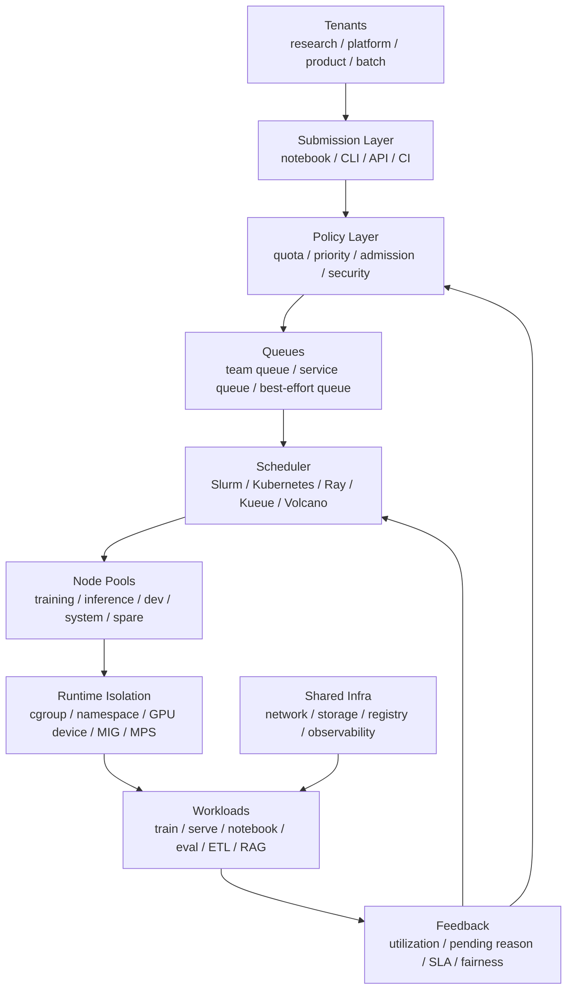

# 混合集群与多租户隔离：训练、推理、Notebook 与批处理共存

AI 集群很少只跑一种任务。真实环境里通常同时存在：

- 大规模训练任务。
- 在线推理服务。
- Notebook 和交互式实验。
- 数据预处理和离线评测。
- embedding、RAG index 构建和批量推理。
- 系统监控、日志采集、镜像缓存、存储网关等基础设施任务。

这些任务共用 GPU、CPU、内存、网络、存储、镜像仓库和调度系统，但它们的目标完全不同。

训练任务关心吞吐、扩展效率和故障恢复；推理任务关心 p99 latency、稳定性和弹性扩缩容；Notebook 关心响应速度和灵活性；批处理关心成本和排队时间；系统任务关心高可用和低干扰。

因此，混合集群的核心问题不是“能不能把所有任务都提交进去”，而是：

> 如何在同一套集群资源上，让不同租户、不同优先级、不同 SLA、不同资源形态的 AI workload 共存，同时控制干扰、碎片、故障半径和治理复杂度？

## 一张总图



这张图强调三点：

- 多租户不是只靠调度器完成，入口、策略、队列、运行时隔离和可观测性都要参与。
- 混部不是简单提高利用率，而是在利用率、SLA、公平性、隔离和可维护性之间取舍。
- 集群治理应该形成反馈闭环：资源使用、排队原因、SLA 违约和故障复盘要反过来修正队列和策略。

## 先区分 workload 类型

混合集群设计的第一步，是承认不同 workload 的行为差异。

| Workload | 典型资源 | 时间特征 | 主要目标 | 主要风险 |
| --- | --- | --- | --- | --- |
| LLM 训练 | 多机多卡、网络、存储 | 长时运行 | step time、扩展效率、可恢复 | gang 等待、故障重启、网络拥塞 |
| 微调 / LoRA | 少量 GPU、存储 | 中短任务 | 周转时间、环境灵活 | 碎片化、依赖漂移 |
| 在线推理 | GPU、CPU、内存、网络 | 长驻服务 | p99 latency、可用性、吞吐 | 被抢占、batch 抖动、模型加载慢 |
| 离线推理 | GPU、存储、网络 | 批量任务 | 成本、吞吐 | 与在线服务争资源 |
| Notebook | GPU、CPU、内存 | 交互式、空闲多 | 响应速度、易用性 | 占而不用、手工改环境 |
| 数据预处理 | CPU、内存、存储、网络 | 批处理 | 数据吞吐、成本 | 小文件、元数据压力 |
| RAG index 构建 | CPU/GPU、存储、向量库 | 批处理或周期性 | 构建速度、一致性 | 存储和网络尖峰 |
| Benchmark | 固定硬件、低干扰 | 短时或周期性 | 可比较、可解释 | 被混部噪声污染 |
| 系统组件 | CPU、内存、网络 | 长驻 | 稳定性 | 被用户任务挤压 |

这些任务不能都放在一个默认队列里。否则会出现：

- Notebook 长期占用 GPU，训练任务排队。
- 低优先级离线推理把在线推理 p99 拉高。
- 数据预处理把共享文件系统打满，训练 GPU 等数据。
- 多个大训练任务同时 checkpoint，存储瞬间拥塞。
- Benchmark 被后台任务干扰，结论不可用。

## 多租户要隔离什么

多租户隔离不只是“不同团队用不同 namespace”。至少要分七个维度。

### 资源隔离

控制每个租户能用多少：

- GPU 数量和 GPU 类型。
- CPU、内存、ephemeral storage。
- 本地 NVMe cache。
- 网络带宽或 RDMA 能力。
- 共享文件系统配额。
- 对象存储 bucket/prefix。
- 镜像仓库和构建资源。

Kubernetes ResourceQuota 可以限制 namespace 级别的对象数量和资源总量；Slurm 可以用 account、partition、QoS、fairshare 等方式控制租户使用。

资源隔离解决的是“谁能用多少”，但不自动解决“用得是否高效”。

### 性能隔离

性能隔离关注一个任务是否会拖慢另一个任务。

典型干扰包括：

- 多个任务共享同一 PCIe switch 或 NIC。
- 多个 job 同时走同一个 RDMA uplink。
- 本地 NVMe cache 被别的任务清空。
- 共享文件系统 metadata server 被小文件打爆。
- CPU thread、DataLoader、tokenizer 抢占推理服务 CPU。
- 推理服务和训练任务共享 GPU 时互相影响。

性能隔离通常比资源隔离更难，因为它依赖拓扑和运行时行为。

### 故障隔离

故障隔离关注失败是否扩散。

例如：

- 一个团队的错误镜像是否拖垮节点。
- 一个任务的日志量是否打满磁盘。
- 一个 job 的 NCCL hang 是否占住整批 GPU。
- 某个数据集路径异常是否影响所有训练任务。
- 一个租户的恶意或错误配置是否影响 host。

故障隔离需要限额、超时、健康检查、自动清理和权限边界共同完成。

### 安全隔离

AI 集群常常保存训练数据、模型权重、日志、实验结果和密钥。安全隔离包括：

- 身份认证和授权。
- namespace / account / project 边界。
- Secret 访问控制。
- 容器权限限制。
- host path、privileged container、host network 的限制。
- 网络访问控制。
- 数据集和模型 artifact 权限。

Kubernetes 官方多租户文档强调，隔离既包括控制面隔离，也包括数据面隔离。对于 AI 集群，数据面隔离尤其重要，因为很多任务会挂载大规模数据和模型。

### 环境隔离

环境隔离关注依赖是否互相污染：

- 是否共享 Conda 环境。
- 是否允许运行时 `pip install -U`。
- Notebook 环境和 batch 环境是否一致。
- 生产推理是否使用 immutable image。
- 自定义 CUDA extension 是否写入共享路径。
- 编译缓存是否按镜像、模型、GPU 架构区分。

环境隔离与上一篇“环境可复现”直接相关。混合集群里越允许灵活环境，越需要明确哪些任务可以灵活，哪些必须固定。

### 数据隔离

数据隔离关注谁能读写哪些数据，以及不同任务的数据生命周期。

包括：

- 数据集只读挂载。
- checkpoint 写入路径隔离。
- 模型权重发布路径隔离。
- RAG index 构建和发布路径隔离。
- 临时数据清理。
- 日志和 trace 脱敏。

训练和推理常常共享模型 artifact，但不应该共享所有中间路径。否则一次错误覆盖可能影响线上服务。

### 控制面隔离

控制面隔离关注用户能否影响调度和集群状态。

例如：

- 用户是否能创建高优先级任务。
- 用户是否能使用 privileged pod。
- 用户是否能修改 node selector、toleration、priority class。
- 用户是否能创建大量小任务压垮 API server。
- 用户是否能绕过队列直接提交到节点池。

很多混合集群问题不是底层算力不够，而是控制面没有准入策略。

## 节点池设计

混合集群通常不会把所有节点放在一个池子里。更常见的是把节点按用途、硬件和隔离级别分组。

| Node Pool | 典型任务 | 设计重点 |
| --- | --- | --- |
| Training Pool | 大规模训练、微调 | 高带宽网络、拓扑一致、gang scheduling |
| Inference Pool | 在线推理 | 稳定性、模型缓存、低抖动、弹性扩缩容 |
| Dev Pool | Notebook、小实验 | 灵活、低优先级、可抢占、自动回收 |
| Batch Pool | 数据预处理、离线推理 | 成本、吞吐、可抢占 |
| Benchmark Pool | 性能测试 | 低干扰、固定环境、固定拓扑 |
| System Pool | 监控、日志、控制面组件 | 高可靠、避免被用户任务挤压 |
| Spare / Burst Pool | 临时扩容、抢占式资源 | 成本优化、容忍中断 |

节点池太少会导致互相干扰；节点池太多会导致碎片和管理成本上升。

一个常见折中是：

```text
关键在线服务和 benchmark 硬隔离
大训练和普通批处理软隔离
Notebook 和低优先级任务可抢占
系统组件独立节点池
```

## Hard Isolation 与 Soft Sharing

混部策略可以放在一条轴上理解。

```text
hard isolation
  -> dedicated node pool
  -> quota + queue
  -> quota borrowing
  -> opportunistic sharing
  -> best-effort preemptible
soft sharing
```

### Hard Isolation

硬隔离适合：

- 在线推理核心服务。
- 关键 benchmark。
- 安全级别高的数据。
- 需要固定拓扑的大训练。
- 系统控制面组件。

优点是可预测、容易排障；缺点是利用率可能低。

### Soft Sharing

软共享适合：

- 离线批处理。
- Notebook。
- 小规模微调。
- 低优先级评测。
- 资源空闲时的 opportunistic job。

优点是利用率高；缺点是需要更强的抢占、隔离和可观测性。

### Quota Borrowing

很多队列系统支持“有配额上限，但空闲资源可以借用”。

例如：

```text
team-a guaranteed: 64 GPU
team-a max: 128 GPU
team-b guaranteed: 64 GPU
team-b max: 128 GPU
shared cluster: 192 GPU
```

当 team-b 空闲时，team-a 可以临时使用超过 guaranteed 的资源；当 team-b 提交任务时，系统可以通过排队或抢占逐步收回借用资源。

这比静态切分资源更高效，但必须回答：

- 借用资源是否可抢占。
- 抢占谁。
- 抢占前是否有 grace period。
- 在线服务是否允许被抢占。
- 大训练被抢占后 checkpoint 是否足够快。

## Queue、Quota、Priority、Preemption

混合集群治理最核心的四个词是：

```text
queue
quota
priority
preemption
```

### Queue

Queue 是用户提交任务时看到的入口。

好的队列应该表达：

- 属于哪个团队或项目。
- 面向哪类 workload。
- 可用哪些节点池。
- 默认优先级。
- 是否允许借用资源。
- 是否允许抢占或被抢占。
- 是否有最大运行时间。

Kueue 这类 Kubernetes 批处理队列系统把 LocalQueue、ClusterQueue、ResourceFlavor 等概念分开：用户提交到本地队列，平台侧把不同队列映射到集群资源和 flavor。这个模型适合把“用户入口”和“底层资源池”解耦。

### Quota

Quota 表示租户或队列的资源边界。

Quota 可以是：

- 硬上限：不能超过。
- 软上限：可以借用空闲资源。
- 最小保障：资源紧张时仍应保留。
- 周期预算：按天、周、月统计资源用量。
- 对象数量限制：限制 pod/job/PVC/configmap 数量。

Kubernetes ResourceQuota 适合 namespace 内的资源和对象数量治理；AI 批处理场景往往还需要队列层的 GPU quota、fairshare 和借用策略。

### Priority

Priority 决定资源紧张时谁先运行，谁可以等待。

高优先级通常给：

- 在线推理。
- 生产评测。
- 关键发布流程。
- 快到 deadline 的任务。
- 系统组件。

低优先级通常给：

- Notebook 空闲 session。
- 离线批处理。
- 可重试评测。
- opportunistic training。

Kubernetes Pod Priority and Preemption 允许高优先级 Pod 抢占低优先级 Pod，但对 AI workload 要谨慎：抢占一个普通 Web Pod 和抢占一个 512 GPU 训练 job 的代价完全不同。

### Preemption

Preemption 是提高利用率的强工具，也是制造事故的强工具。

适合被抢占的任务：

- 有 checkpoint 的训练。
- 可重跑的数据处理。
- 离线推理。
- Notebook idle session。
- 低优先级评测。

不适合被抢占的任务：

- 无冗余在线推理。
- 关键 benchmark。
- 控制面组件。
- 没有 checkpoint 的长训练。
- 正在写关键 artifact 的任务。

抢占策略必须配合：

- checkpoint 周期。
- graceful termination。
- 最大运行时间。
- retry policy。
- artifact 原子提交。
- 用户可见的 pending/preempted reason。

## 在线推理与训练混部

训练和推理混部是最有吸引力、也最容易出问题的场景。

### 为什么想混部

因为在线推理的负载有波峰波谷：

- 白天高峰，夜间低谷。
- 活动期间高峰，平时低谷。
- 不同业务峰值时间不同。

空闲 GPU 如果完全保留给推理，会降低利用率。低谷时可以运行低优先级训练、离线推理或数据任务。

### 为什么难

在线推理和训练的性能目标冲突：

| 维度 | 训练 | 在线推理 |
| --- | --- | --- |
| 目标 | 平均吞吐、step time | p95/p99 latency、可用性 |
| 资源使用 | 长时高占用 | 随请求波动 |
| 容错 | 可 checkpoint 重跑 | 请求不能随意失败 |
| 调度 | gang、拓扑敏感 | 弹性、滚动发布 |
| 性能风险 | 网络/存储拥塞 | 抖动、冷启动、batch 延迟 |

因此，常见策略是：

```text
推理保留基础容量
  + 空闲资源运行低优先级批任务
  + 高峰时回收低优先级任务
  + 推理扩容优先
  + 批任务必须可中断
```

### 混部边界

推理和训练混部时要设边界：

- 不让训练任务使用推理服务所在节点的所有 CPU。
- 不让训练 checkpoint 挤占模型加载和日志路径。
- 不让训练 NCCL 流量影响推理入口网络。
- 推理节点上的低优先级任务必须可驱逐。
- 推理服务要有模型预热和冷启动预算。
- 低优先级任务不能使用生产推理的 secret。

如果这些边界没有建立，混部带来的利用率提升很容易被 p99 抖动和事故成本抵消。

## Notebook 治理

Notebook 是研发效率工具，也是 GPU 利用率治理难点。

典型问题：

- 用户启动后忘记关闭。
- GPU 被进程占用但显存和算力利用率很低。
- Notebook 内临时安装依赖，环境不可复现。
- 开发 session 使用生产数据。
- 多个 Notebook 共享同一机器，互相影响。

常见治理策略：

- 默认使用 dev node pool。
- 设置 idle timeout。
- 设置最大连续运行时间。
- 对 Notebook GPU 配额单独统计。
- 长时间训练必须转成 batch job。
- 关键实验必须固化为镜像和 manifest。
- Notebook 镜像和生产镜像分离。

一个实用规则是：

```text
Notebook 用来探索，不用来承载关键长任务。
```

当探索变成可复现实验，应进入 batch 或 training queue。

## 系统任务保护

混合集群必须保护系统任务。

系统任务包括：

- DNS、CNI、CSI。
- GPU device plugin。
- DCGM exporter。
- 日志 agent。
- metrics collector。
- ingress / gateway。
- 镜像缓存和 registry mirror。
- 调度器和队列控制器。

如果系统任务和用户任务争抢资源，会出现很难排查的问题：

- 节点心跳抖动。
- 日志丢失。
- 监控空洞。
- CSI mount 超时。
- GPU plugin 异常导致资源不可见。
- 调度器延迟升高。

因此应考虑：

- system node pool。
- system priority class。
- resource requests/limits。
- taints/tolerations。
- pod disruption budget。
- 和用户任务分离的日志/监控资源。

系统任务不应该靠“刚好还有一点 CPU”运行。

## Kubernetes 隔离工具箱

Kubernetes 提供了很多通用隔离工具，但 AI 场景要组合使用。

| 工具 | 解决什么 | AI 场景注意点 |
| --- | --- | --- |
| Namespace | 逻辑分组 | 不是安全边界本身，需要 RBAC/Policy |
| ResourceQuota | namespace 资源上限 | GPU extended resource 也要纳入治理 |
| LimitRange | 默认 request/limit | 避免用户漏写 CPU/memory |
| PriorityClass | 优先级 | 谨慎给用户高优先级权限 |
| Preemption | 高优先级抢占低优先级 | 大训练抢占代价高，要配 checkpoint |
| QoS Class | Guaranteed/Burstable/BestEffort | 推理服务应避免 BestEffort |
| NodeSelector/Affinity | 节点选择 | 表达 GPU 型号、拓扑、节点池 |
| Taints/Tolerations | 控制哪些任务能上节点 | 保护系统池、推理池、benchmark 池 |
| NetworkPolicy | 网络访问控制 | 限制租户间访问和外部访问 |
| Pod Security Standards | 限制容器权限 | 控制 privileged、host path、host network |

这些工具的共同问题是：它们只提供机制，不自动给出策略。AI Infra 的工作是把策略固化成默认模板、准入规则和队列约束。

## Slurm 隔离工具箱

很多 AI 训练集群仍然以 Slurm 为主。Slurm 的优势是 HPC 批处理、拓扑、accounting、fairshare 和大型 gang job。

常见抽象包括：

- Partition：把节点分组。
- Account：按组织、项目或团队统计资源。
- QOS：限制优先级、最大资源、最大运行时间等。
- Fairshare：根据历史使用量调整优先级。
- GRES：表示 GPU 等通用资源。
- Reservation：预留资源。
- Preemption：抢占低优先级 job。

AI 场景下要关注：

- 大训练 job 需要 gang 分配。
- 交互式 job 不能长期占住高价值节点。
- Fairshare 要结合 GPU 类型和 GPU hour，而不只是 job 数。
- Preemption 必须和 checkpoint 能力匹配。
- Partition 不宜过碎，否则排队和碎片严重。

## GPU 共享：MIG、MPS 与 Time Slicing

GPU 共享是混部中的敏感点。

### MIG

MIG 把支持的 GPU 切成硬件隔离的实例，适合：

- 小模型推理。
- Notebook。
- 小规模实验。
- 多租户隔离要求较高的场景。

限制是：

- 不是所有 GPU 都支持。
- 切分形态固定。
- 大模型训练不适合。
- 切分和调度策略需要配合。

### MPS

MPS 让多个 CUDA 进程更高效共享 GPU，适合某些小 kernel、低占用场景。

但它的隔离性弱于 MIG，使用时要注意：

- 显存控制。
- 错误传播。
- 性能干扰。
- 用户权限边界。

### Time Slicing

Time slicing 可以让多个容器轮流使用 GPU，适合低优先级、交互式或轻量任务。

但对延迟敏感推理和 benchmark 来说，time slicing 可能带来不可接受的抖动。

结论是：

```text
GPU 共享适合提高小任务利用率，不适合默认用于所有任务。
```

## 存储与网络的多租户

很多混部问题表面上是 GPU 争用，根因其实是网络或存储。

### 存储隔离

需要治理：

- 每个租户的容量配额。
- checkpoint 写入速率。
- 小文件数量。
- 本地 NVMe cache 使用。
- 对象存储 API 请求量。
- 共享文件系统 metadata 压力。

如果只限制 GPU 数量，不限制 checkpoint 和数据读取，高优先级训练仍然可能被低优先级数据任务拖慢。

### 网络隔离

需要治理：

- RDMA 网络和普通业务网络分离。
- 训练 all-reduce 流量和推理入口流量分离。
- 多租户网络访问控制。
- QoS / traffic class。
- 拓扑感知调度。
- 拥塞可观测性。

RoCE 集群尤其要小心。一个错误配置或突发流量可能造成 PFC pause、ECN 异常和尾延迟恶化。

## 可观测性：看见干扰

混合集群必须能看见干扰，否则只能靠用户抱怨。

需要监控的指标包括：

### 资源使用

- GPU utilization。
- GPU memory。
- SM occupancy。
- HBM bandwidth。
- CPU utilization。
- memory pressure。
- local NVMe usage。
- network throughput。
- storage IOPS 和 metadata rate。

### 调度状态

- pending job 数量。
- pending reason。
- queue wait time。
- quota 使用率。
- fairshare 变化。
- preemption 次数。
- gang job 等待时间。
- fragmentation。

### SLA

- 推理 p50/p95/p99。
- 请求错误率。
- 模型加载时间。
- 训练 step time。
- checkpoint duration。
- DataLoader wait。
- job restart 次数。

### 多租户公平性

- 每个租户 GPU hour。
- 每个租户等待时间。
- 每个租户被抢占次数。
- 每个租户 quota borrowing。
- 每个租户资源浪费。

没有这些指标，混部策略无法调优。

## 常见策略模板

### 策略一：训练主导型集群

适合研究和模型开发阶段。

```text
training pool: majority GPU
dev pool: small, preemptible
inference pool: separate minimal
batch pool: uses idle capacity
benchmark pool: small dedicated
```

关注点：

- 大 job 排队效率。
- GPU 拓扑一致性。
- checkpoint 和恢复。
- fairshare。
- Notebook 自动回收。

### 策略二：推理主导型集群

适合模型上线和服务平台。

```text
inference pool: reserved + autoscaling
batch inference: low priority
training/fine-tune: separate or preemptible
model cache: local NVMe
canary pool: deployment validation
```

关注点：

- p99 latency。
- 模型加载和预热。
- rollback。
- 低优先级任务驱逐。
- 线上和离线网络隔离。

### 策略三：共享研究平台

适合多个课题组或团队共用。

```text
team queues
guaranteed quota
borrowable quota
dev queue
benchmark reservation
shared storage quota
```

关注点：

- 公平性。
- 配额透明。
- 排队原因可解释。
- 数据权限。
- 环境模板。

### 策略四：成本优化型集群

适合大量离线任务和弹性资源。

```text
base reserved capacity
burst spot/preemptible capacity
checkpoint-aware training
best-effort batch jobs
aggressive idle cleanup
```

关注点：

- 任务是否可中断。
- checkpoint 成本。
- 重试风暴。
- 队列退避。
- 成本归因。

## 准入控制

准入控制决定任务能否进入集群。

AI 任务常见准入检查：

- 是否指定队列。
- 是否指定镜像 digest。
- 是否声明 GPU/CPU/memory。
- 是否超过租户 quota。
- 是否使用未授权节点池。
- 是否使用禁止的 host path。
- 是否设置 checkpoint 路径。
- 是否设置最大运行时间。
- 是否使用高优先级。
- 是否使用生产 secret。
- 是否符合环境矩阵。

准入控制的目标不是增加门槛，而是把事故挡在运行前。

## 资源碎片

混合集群很容易出现碎片：

- 8 卡节点上剩 1 张卡，大训练用不了。
- 某些节点 CPU 不够，GPU 空闲。
- 某些节点本地 NVMe 满了，GPU 空闲。
- GPU 型号分散，任务可用范围缩小。
- MIG 切分后形态不匹配。
- 大 job 需要同一拓扑，资源分散在多个 rack。

碎片治理手段包括：

- bin packing 和 gang scheduling。
- topology-aware scheduling。
- 大任务优先匹配完整节点。
- 小任务使用小 GPU、MIG 或 dev pool。
- 定期 defragmentation。
- 限制随意 node selector。
- 统一 GPU flavor 命名。

利用率指标不能只看“GPU 是否分配”。如果 GPU 已分配但任务 pending、DataLoader 等待或网络拥塞，实际有效利用率仍然低。

## 成本与归因

多租户集群必须能回答：

```text
谁用了多少资源？
用于什么 workload？
是否符合配额？
等待时间是多少？
浪费在哪里？
性能损失来自哪里？
```

常见归因维度：

- team / project / namespace / account。
- workload type。
- queue。
- GPU type。
- node pool。
- priority class。
- image/environment。
- dataset/model artifact。

成本治理不是单纯压低使用量，而是让资源从低价值占用流向高价值任务。

## 常见误区

### 误区一：所有任务放一个队列最公平

表面公平，实际会让长任务、短任务、在线服务和 Notebook 互相伤害。公平必须结合 workload 类型和 SLA。

### 误区二：GPU quota 够了就不需要别的隔离

网络、存储、CPU、内存、镜像拉取和控制面都可能成为共享瓶颈。

### 误区三：抢占一定能提高利用率

如果任务没有 checkpoint、恢复慢或写 artifact 不原子，抢占会制造更多浪费。

### 误区四：推理和训练混部只要设置优先级

优先级只能影响调度和抢占，不能自动隔离网络、存储、CPU、模型缓存和尾延迟。

### 误区五：Notebook 是小事

Notebook 常常是长期 GPU 占用、环境漂移和数据权限问题的来源。

### 误区六：利用率高就是好

高利用率可能来自低价值任务占满资源。AI 集群更应关注有效吞吐、SLA、公平性和可恢复性。

## 设计检查清单

- 是否明确区分训练、推理、Notebook、批处理、benchmark 和系统任务。
- 是否有清晰的 node pool 策略。
- 是否有 team/project queue。
- 是否有 guaranteed quota、max quota 和 borrowing 策略。
- 是否定义 priority class，并限制谁能使用高优先级。
- 哪些任务可以被抢占，哪些不能。
- 被抢占任务是否有 checkpoint 和 graceful termination。
- 在线推理是否与低优先级任务有明确隔离边界。
- Notebook 是否有 idle timeout 和最大运行时间。
- 系统任务是否有独立资源保障。
- GPU、CPU、memory、storage、network 是否都纳入治理。
- 共享文件系统和对象存储是否有租户配额。
- 是否有 NetworkPolicy 或等价网络隔离。
- 是否限制 privileged、host path、host network。
- 是否记录 pending reason、preemption、quota borrowing 和 SLA。
- 是否有资源碎片指标。
- 是否能按 team/project/workload 做成本归因。
- 是否有准入控制阻止危险配置。

## 小结

混合集群的目标不是“把所有任务塞进一个大池子”，而是在共享中建立边界：

```text
workload classification
  -> queue and quota
  -> priority and preemption
  -> node pool and topology
  -> runtime isolation
  -> storage/network governance
  -> observability and feedback
```

对 AI Infra 来说，混部的价值在于提升资源有效利用率，而不是追求表面分配率。好的混合集群会让高优先级任务有保障，低优先级任务能利用空闲资源，研发探索不阻塞生产服务，系统组件不被用户任务拖垮。

一旦这些边界不清，集群就会从“共享资源池”退化成“互相干扰的黑盒”。

## 延伸阅读

- [Kubernetes Multi-tenancy](https://kubernetes.io/docs/concepts/security/multi-tenancy/)
- [Kubernetes Resource Quotas](https://kubernetes.io/docs/concepts/policy/resource-quotas/)
- [Kubernetes Pod Priority and Preemption](https://kubernetes.io/docs/concepts/scheduling-eviction/pod-priority-preemption/)
- [Kubernetes Pod QoS Classes](https://kubernetes.io/docs/concepts/workloads/pods/pod-qos/)
- [Kubernetes Network Policies](https://kubernetes.io/docs/concepts/services-networking/network-policies/)
- [Kubernetes Pod Security Standards](https://kubernetes.io/docs/concepts/security/pod-security-standards/)
- [Kueue LocalQueue](https://kueue.sigs.k8s.io/docs/concepts/local_queue/)
- [Kueue ClusterQueue](https://kueue.sigs.k8s.io/docs/concepts/cluster_queue/)
- [Slurm Multifactor Priority Plugin](https://slurm.schedmd.com/priority_multifactor.html)
