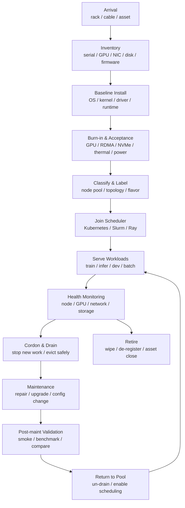

# 节点生命周期与集群运维：交付、验收、入池、维护与下线

AI 集群不是把 GPU 服务器上架、装好驱动、加入调度器就结束了。一个计算节点从进入机房到退出生产，会经历交付、验收、基线安装、压力测试、入池、运行、维护、升级、故障隔离、归还资源和下线。

如果这个生命周期没有被设计清楚，集群会出现很多“看似偶发”的问题：

- 新节点刚入池就出现 NCCL timeout。
- GPU 型号一样，但某批节点吞吐低。
- 训练任务随机 OOM 或 Xid error。
- 维护时任务被粗暴杀掉，checkpoint 不完整。
- 驱动和 CUDA 组合漂移，某些镜像突然不可用。
- 节点已经有硬件错误，却还在被调度。
- 下线节点仍保留数据、secret、缓存或监控噪声。

节点生命周期治理的目标是：

> 让每一台 AI 计算节点在可验证、可追溯、可维护、可回滚的状态下进入和退出资源池。

这篇文章关注集群运维流程，不深入故障复盘和可观测性体系。后者更适合放在可靠性章节展开。

## 一张总图



这张图表达一个基本原则：节点不是“可用/不可用”两个状态，而是一组受控阶段。

每个阶段都应该有：

- 进入条件。
- 验证命令或指标。
- 失败处理。
- 责任人。
- 记录位置。
- 回滚方式。

## 为什么 AI 节点生命周期更复杂

普通计算节点关注 CPU、内存、磁盘、网络和操作系统。AI 节点还要额外关注：

- GPU 型号、显存、SM 架构。
- GPU firmware、NVSwitch firmware。
- NVIDIA driver 和 CUDA compatibility。
- NCCL/RCCL、RDMA、GPUDirect RDMA。
- PCIe、NUMA、NVLink、NVSwitch 拓扑。
- HBM ECC、Xid、retired pages、thermal throttling。
- 本地 NVMe cache。
- 大功耗、大热量和供电冗余。
- 大模型加载和 checkpoint 流量。
- 节点间拓扑对训练性能的影响。

这意味着 AI 节点不能只通过“能 SSH、能看到 GPU”就入池。它必须通过面向 AI workload 的验收。

## 节点事实源：Node Manifest

节点生命周期治理首先要有一个事实源。不能只靠 Kubernetes Node 对象、Slurm node list、资产表或监控标签中的任意一个，因为它们分别只覆盖一部分事实。

建议为每台节点维护 Node Manifest：

```yaml
node_id: node-h100-042
asset:
  vendor: example
  serial: SN123456
  rack: R12
  position: U18
  pdu: pdu-r12-a

hardware:
  gpu: H100-SXM-80GB
  gpu_count: 8
  cpu: 2x example-cpu
  memory: 2048Gi
  nic: 8x 400G IB
  local_nvme: 8x 3.84TB

topology:
  fabric_domain: ib-fabric-a
  rack_group: island-03
  switch_ports:
    - leaf-12/1
    - leaf-12/2

profile:
  node_profile: h100-sxm-cu12-train
  os_image: ai-node-ubuntu2204-v7
  driver: 550.x
  ofed: 24.x
  container_runtime: containerd

state:
  lifecycle_state: active
  scheduler: kubernetes
  node_pool: training
  last_validated_at: 2026-06-12T09:00:00Z
```

Node Manifest 的作用是把几类系统对齐：

- 资产系统知道它是哪台物理机器。
- 调度系统知道它属于哪个节点池和资源 flavor。
- 监控系统知道它应上报哪些指标。
- 成本系统知道它属于哪类容量。
- 运维系统知道它当前生命周期状态。
- 故障分析能按批次、机柜、fabric、profile 做聚合。

没有统一事实源时，经常会出现：

- 调度器里节点叫 `gpu-node-42`，资产系统里叫另一个名字。
- 监控标签缺少 rack 或 GPU flavor，无法定位批量故障。
- 节点换过 NIC 或 GPU，但 manifest 没更新。
- 节点从训练池改到推理池，但成本和告警还按旧池统计。

Node Manifest 不一定是单独文件，也可以存在 CMDB、GitOps 仓库或资产平台里。关键是它要可查询、可变更审计、可被自动化系统消费。

## 生命周期阶段

### 1. 到货与资产登记

节点进入机房后，首先要把物理世界的信息变成平台可查询的资产记录。

至少记录：

- 资产编号。
- 厂商、型号、序列号。
- GPU 型号、数量、显存。
- CPU 型号、内存容量。
- NIC/HCA 型号、端口速率。
- 本地磁盘和 NVMe。
- 电源、PDU、机柜、U 位。
- 交换机端口、线缆编号。
- 保修和支持信息。
- 计划归属的 node pool。

资产记录不是财务表格而已。后续排查“某批节点性能异常”时，往往要按服务器批次、GPU 批次、NIC firmware、机柜、交换机端口做关联分析。

### 2. 物理验收

物理验收关注硬件和布线是否符合设计。

检查项包括：

- GPU 数量是否正确。
- NIC 是否插在预期 PCIe slot。
- NVLink/NVSwitch 是否识别。
- RDMA 网口是否连到正确网络。
- 管理网、业务网、存储网是否分离。
- 电源是否双路或符合冗余要求。
- 风道、温度、功耗是否正常。
- BIOS/UEFI 设置是否符合集群基线。

很多性能问题来自物理层：

- 网线插错交换机。
- NIC 插在带宽不足的 PCIe slot。
- NUMA 亲和性不符合预期。
- BIOS 省电策略导致频率异常。
- 风道问题导致 GPU 降频。

这些问题如果在入池后才发现，排查成本会高很多。

### 3. 软件基线安装

软件基线包括：

- OS image。
- kernel version。
- kernel 参数。
- NVIDIA driver。
- container runtime。
- NVIDIA Container Toolkit。
- RDMA/OFED stack。
- 文件系统和挂载参数。
- 安全 agent。
- 监控 agent。
- GPU device plugin 或 Slurm GRES 配置。

关键是基线要可声明、可重建、可比较。

不建议把节点变成“手工调出来的状态”。更好的方式是：

```text
node profile
  -> base image
  -> driver bundle
  -> runtime config
  -> health checks
  -> labels / taints
```

例如：

| Node Profile | 说明 |
| --- | --- |
| `h100-sxm-cu12-train` | H100 训练节点，RDMA 和 NCCL 优化 |
| `a100-cu11-legacy` | 旧 CUDA 11 任务兼容池 |
| `l40s-infer` | 推理节点，强调模型 cache 和服务稳定性 |
| `cpu-storage-etl` | 数据预处理节点，强调 CPU、内存和存储吞吐 |

### 基线即代码

软件基线应当像应用版本一样被管理，而不是散落在运维命令里。

一个 node profile 至少应该声明：

| 类别 | 示例 |
| --- | --- |
| OS | distribution、image id、kernel version |
| Driver | NVIDIA driver、GPU firmware、NVSwitch firmware |
| Network | OFED/RDMA stack、NIC firmware、RoCE/IB 配置 |
| Runtime | containerd、NVIDIA Container Toolkit、GPU Operator/device plugin |
| Storage | filesystem、mount options、local NVMe layout |
| Security | SSH/agent、cert、audit、kernel hardening |
| Observability | DCGM exporter、node exporter、log agent |
| Scheduler | Kubernetes labels/taints 或 Slurm GRES/features |

推荐把 profile、安装脚本、配置模板和验证脚本放在版本控制里：

```text
node-profiles/
  h100-sxm-cu12-train/
    manifest.yaml
    kernel-args.conf
    containerd.toml
    rdma.conf
    labels.yaml
    validation/
      smoke.sh
      nccl.sh
      nvme.sh
```

这样升级或回滚时，平台能明确回答：

- 哪些节点运行哪个 profile 版本。
- 本次维护改了哪些字段。
- 维护后应该跑哪些验证。
- 出问题时要退回哪个 profile。

“基线即代码”的价值不是形式化，而是减少手工漂移。

### 4. Burn-in 与验收测试

Burn-in 是节点入池前的压力测试。它的目标不是跑一个 demo，而是尽早暴露硬件、散热、供电、网络和驱动问题。

建议分层测试。

| 层 | 测什么 | 示例 |
| --- | --- | --- |
| 基础识别 | 设备是否完整 | GPU/NIC/NVMe/NUMA |
| GPU 健康 | 显存、ECC、温度、功耗 | DCGM diagnostics、压力测试 |
| 计算性能 | 矩阵乘、Tensor Core | GEMM、框架 smoke test |
| GPU 拓扑 | NVLink/NVSwitch/PCIe | topo matrix、bandwidth |
| 网络 | RDMA、带宽、延迟 | ib_write_bw、NCCL all-reduce |
| 存储 | 本地 NVMe、共享 FS | fio、dataset read、checkpoint |
| 长稳 | 长时间运行 | 多小时训练/通信压力 |

AI 节点至少应通过：

- 单卡计算 smoke test。
- 多卡 collective test。
- 多节点 NCCL/RCCL test。
- 本地 NVMe 读写测试。
- 共享存储读写测试。
- 监控指标上报测试。
- 温度和功耗稳定性测试。

如果节点是训练池，还要验证多节点拓扑；如果节点是推理池，还要验证模型加载、服务启动、冷启动和 p99 latency。

### 验收报告与入池门禁

Burn-in 结束后要产出验收报告，而不是只看命令是否通过。验收报告应包含：

- node manifest 版本。
- node profile 版本。
- 测试开始和结束时间。
- GPU、NIC、NVMe、拓扑识别结果。
- DCGM diagnostics 结果。
- 单机和多机 NCCL/RCCL 结果。
- RDMA bandwidth/latency 结果。
- NVMe 和共享存储测试结果。
- 温度、功耗、频率曲线。
- 与同类节点的性能对比。
- 失败项、豁免项和责任人。

入池门禁可以分三档：

| 结果 | 动作 |
| --- | --- |
| pass | 允许进入目标 node pool |
| pass with warning | 进入 suspect 或 canary pool，限制承载关键 workload |
| fail | 不入池，进入 repair/RMA 流程 |

不要让“有个测试失败但先用着”变成常态。AI 集群里的坏节点会制造大量二次浪费：训练失败、排队重试、性能抖动、用户自行绕过平台。

### 5. 分类、打标签与入池

节点验收通过后，才应该加入可调度资源池。

Kubernetes 中通常会使用：

- labels 表达 GPU 型号、节点池、拓扑、zone。
- taints 限制哪些 workload 能调度上来。
- device plugin 暴露 GPU。
- Node Feature Discovery 暴露硬件特征。
- ResourceQuota/queue 系统控制谁能使用。

Slurm 中通常会使用：

- partition。
- node features。
- GRES。
- account/QoS。
- reservation。

节点标签不能随意命名。建议统一资源 flavor：

```text
gpu.vendor=nvidia
gpu.product=h100
gpu.memory=80gb
gpu.interconnect=nvswitch
node.pool=training
network.rdma=true
storage.local-nvme=true
```

标签是调度、可观测性、成本归因和故障分析的共同语言。

### 6. 运行期健康管理

节点入池后，要持续判断它是否仍适合承载 workload。

Kubernetes Node Status 包含 conditions、addresses、capacity/allocatable、info 等信息。常见 condition 包括 Ready、DiskPressure、MemoryPressure、PIDPressure、NetworkUnavailable。

AI 集群还需要额外健康信号：

- GPU Xid error。
- ECC 错误。
- retired pages。
- GPU 温度和降频。
- NVLink/NVSwitch 错误。
- RDMA port error。
- NCCL test 异常。
- 本地 NVMe wear、IO error、容量满。
- 共享存储 mount 异常。
- driver/device plugin 异常。
- container runtime 异常。

健康管理不是“看到问题报警”就够。平台要能根据严重程度采取动作：

| 严重程度 | 动作 |
| --- | --- |
| 轻微指标异常 | 告警、标记观察 |
| 可疑性能下降 | 降低调度优先级、进入 suspect |
| 单次可恢复错误 | 自动恢复、记录事件 |
| 反复错误 | cordon、drain、人工检查 |
| 明确硬件故障 | 下线、报修、替换 |

### 健康分级与自动动作

健康信号要转成可执行状态，而不是只出现在告警里。

| 状态 | 典型信号 | 调度动作 |
| --- | --- | --- |
| healthy | 指标正常，验证通过 | 正常调度 |
| watch | 单次可恢复错误、轻微性能波动 | 保持调度，增加观察 |
| suspect | 多次错误、性能低于同类节点、监控缺口 | 限制新任务，优先跑低风险 workload |
| cordon-required | 反复 Xid、RDMA 错误、NVMe 异常 | 停止新调度，准备 drain |
| maintenance | 已确认需要维护 | 不承载 workload |
| retire-required | 无法修复或成本过高 | 退役或 RMA |

自动动作要保守：

- 单次指标异常可以先进入 `watch`。
- 重复错误才进入 `suspect` 或 `cordon-required`。
- 对长训练和在线推理，自动 drain 前要检查 checkpoint、副本、PDB 或等价保护。
- 严重硬件错误可以立即 cordon，但是否驱逐要结合 workload 安全性。

健康分级的关键是避免两个极端：

- 每个小波动都把节点踢出池子，造成容量抖动。
- 已知坏节点长期继续接任务，造成用户任务反复失败。

### 7. Cordon、Drain 与维护

维护节点前，不能直接杀进程或关机。

Kubernetes 里常见动作：

```text
cordon: 不再调度新 Pod
drain: 驱逐已有 Pod
maintenance: 做维护动作
uncordon: 恢复调度
```

Kubernetes 官方文档提供 `kubectl drain` 用于安全地从节点驱逐 Pod，并把节点标记为不可调度。AI 任务使用 drain 时要特别注意：

- 训练任务是否有 checkpoint。
- 推理服务是否有足够副本。
- PodDisruptionBudget 是否允许驱逐。
- eviction grace period 是否足够。
- local storage 是否需要保留或清理。
- job controller 是否会重试。
- checkpoint 是否已经完成。

Slurm 中类似动作包括：

- drain node。
- resume node。
- 设置 node reason。
- 停止新 job。
- 等待已有 job 结束或主动 requeue。

对 AI workload 来说，安全 drain 的难点是“任务状态大”。一个大训练任务可能需要几分钟甚至更久才能保存 checkpoint；一个推理节点可能需要先把流量摘除、等待请求清空、再停止服务。

### 维护窗口契约

计划维护需要提前声明维护窗口契约，让调度器、用户和服务知道会发生什么。

维护窗口至少包含：

```yaml
maintenance:
  node: node-h100-042
  reason: driver upgrade
  window: 2026-06-12T18:00:00Z/2026-06-12T22:00:00Z
  impact:
    node_pool: training
    gpu_count: 8
  drain_policy:
    stop_new_work: true
    wait_for_completion: preferred
    checkpoint_grace_period: 30m
    force_after: 2h
  validation:
    smoke: required
    performance_compare: required
  rollback:
    target_profile: h100-sxm-cu12-train-v6
```

不同 workload 的维护策略不同：

| Workload | 维护前动作 |
| --- | --- |
| 在线推理 | 摘流、等待请求 drain、确认副本容量充足 |
| 大训练 | 等待 checkpoint、requeue 或迁移到可恢复队列 |
| Notebook | 通知用户、保存 session、超时回收 |
| 数据任务 | 完成当前 shard，避免半成品提交 |
| Benchmark | 直接禁止维护窗口内运行，保持结果可比 |

维护窗口结束后要有明确结论：

- 已恢复调度。
- 验证失败，继续 cordon。
- 回滚到旧 profile。
- 转 repair/RMA。

没有结论的维护会造成“节点看似回来了，但没人知道是否可靠”。

### 8. 维护后验证

维护后不要直接恢复调度。需要先验证：

- 节点是否 Ready。
- GPU 是否全部识别。
- driver/CUDA/NCCL 版本是否符合 profile。
- device plugin 是否正常上报。
- RDMA 是否可用。
- 本地 NVMe 和共享存储是否正常。
- 基础 smoke test 是否通过。
- 与同类节点相比性能是否异常。
- 监控和日志是否恢复。

建议把维护后验证分成两类：

```text
smoke validation: 快速判断能不能回池
performance validation: 判断是否和同类节点一致
```

前者适合每次维护后都跑；后者适合驱动、firmware、kernel、网络、存储变更后跑。

### 9. 下线与退役

节点下线不是简单从调度器删除。

需要处理：

- 从调度器移除。
- 从监控和告警中移除。
- 清理本地 NVMe cache。
- 清理镜像缓存。
- 清理临时数据。
- 撤销节点证书和凭据。
- 更新资产系统。
- 回收或销毁磁盘。
- 关闭保修/维修工单。
- 记录下线原因。

如果下线流程不完整，会留下：

- 噪声告警。
- 失效节点仍显示在 dashboard。
- 数据残留。
- 证书和 secret 残留。
- 成本和资产统计错误。

## 节点状态模型

建议为 AI 节点定义比 Ready/NotReady 更细的状态。

| 状态 | 含义 |
| --- | --- |
| `new` | 新到货，未验收 |
| `installing` | 正在装系统或配置 |
| `burn-in` | 正在压力测试 |
| `ready-to-join` | 验收通过，待入池 |
| `active` | 正常承载 workload |
| `suspect` | 有异常信号，限制调度 |
| `cordoned` | 不接收新任务 |
| `draining` | 正在迁出任务 |
| `maintenance` | 正在维护 |
| `validating` | 维护后验证 |
| `retired` | 已下线 |

这个状态模型可以映射到：

- Kubernetes labels/taints。
- Slurm node state/reason。
- 资产系统状态。
- CMDB。
- 运维工单。
- 监控告警抑制规则。

核心是让系统、用户和运维看到同一事实。

## 入池验收清单

新节点入池前建议至少检查：

- 资产信息完整。
- 机柜、端口、线缆记录完整。
- OS/kernel/driver 符合 node profile。
- GPU 数量、型号、显存正确。
- GPU ECC/Xid/retired pages 正常。
- GPU 拓扑符合设计。
- CPU NUMA 与 GPU/NIC 亲和性符合设计。
- NIC/RDMA link up，速率正确。
- RDMA bandwidth/latency 通过。
- NCCL/RCCL 单机和多机测试通过。
- 本地 NVMe 性能和容量正常。
- 共享存储挂载正常。
- container runtime 正常。
- GPU device plugin 或 Slurm GRES 正常。
- 监控 agent 正常上报。
- 日志 agent 正常上报。
- 温度、功耗、风扇稳定。
- 长稳测试通过。
- 节点 labels/taints/features 正确。
- 入池记录和验收报告归档。

## 健康检查设计

健康检查要区分“节点是否存活”和“节点是否适合跑 AI 任务”。

### Liveness

节点是否还活着：

- kubelet 或 slurmd 是否在线。
- SSH/管理面是否可达。
- 心跳是否正常。
- container runtime 是否可用。

### Readiness

节点是否能接任务：

- GPU 是否可见。
- device plugin 是否正常。
- driver 是否匹配。
- 本地存储是否可写。
- 网络是否可用。
- 必要 daemon 是否运行。

### Performance Health

节点性能是否正常：

- GPU clock 是否异常。
- HBM 带宽是否异常。
- NCCL bandwidth 是否异常。
- RDMA error counter 是否异常。
- NVMe latency 是否异常。
- 温度/功耗是否触发 throttle。

### Workload Health

节点上的 workload 是否正常：

- 训练 step time 是否异常。
- 推理 p99 是否异常。
- DataLoader wait 是否异常。
- checkpoint duration 是否异常。
- 失败和重启是否集中在某些节点。

如果多个 job 在同一节点上表现异常，节点应进入 suspect，而不是让用户反复踩坑。

## 故障隔离策略

节点异常时，不同故障要有不同策略。

| 故障 | 典型动作 |
| --- | --- |
| kubelet/slurmd 短暂异常 | 自动恢复、记录事件 |
| 单次 GPU Xid | 标记观察，必要时重启 GPU/节点 |
| 反复 GPU Xid | cordon/drain，硬件检查 |
| ECC 错误增加 | 降级或下线检查 |
| RDMA 错误 | 排查 NIC、线缆、交换机、PFC/ECN |
| NVMe 错误 | 停止使用本地 cache，维护更换 |
| 温度异常 | 降载、检查风道和功耗 |
| 性能异常但无硬错误 | suspect、跑 benchmark 对比 |

故障隔离的关键不是“一出错就重启”，而是避免坏节点反复进入生产队列。

## 升级策略

节点升级包括：

- OS。
- kernel。
- NVIDIA driver。
- CUDA userspace。
- NCCL/RCCL。
- container runtime。
- GPU Operator/device plugin。
- OFED/RDMA stack。
- firmware。
- BIOS。
- 监控 agent。

升级风险很高，因为 AI workload 依赖复杂。

推荐流程：

```text
candidate profile
  -> canary node
  -> smoke test
  -> representative benchmark
  -> small canary workload
  -> limited node pool rollout
  -> full rollout
  -> old profile deprecation
```

不要直接全量升级训练池。先选择少量 canary 节点，跑：

- GPU smoke test。
- NCCL/RDMA test。
- 数据读取测试。
- checkpoint save/restore。
- 典型训练 step。
- 推理服务启动和压测。
- 自定义 CUDA/Triton kernel 编译。

升级完成后要能比较：

- step time 是否变化。
- NCCL bandwidth 是否变化。
- 推理 p99 是否变化。
- 错误率是否变化。
- 功耗和温度是否变化。

### 批次发布与回滚

节点升级最好按批次推进，并限制故障半径。

一个常见 rollout：

```text
1 node canary
  -> 1 rack canary
  -> 5% node pool
  -> 25% node pool
  -> 50% node pool
  -> full rollout
```

每个批次都要设置停止条件：

- Xid/ECC/RDMA 错误高于基线。
- NCCL bandwidth 下降超过阈值。
- 训练 step time 回退超过阈值。
- 推理 p99 或错误率恶化。
- 节点 Ready/device plugin 异常增加。
- 用户 workload 失败率升高。

回滚不只是重新装旧 driver。还要恢复：

- node profile。
- kernel 参数。
- container runtime 配置。
- RDMA/OFED 配置。
- labels/taints/features。
- GPU Operator 或 device plugin 版本。
- 监控 agent 和告警规则。

因此，升级计划必须记录 rollback target，而不是只记录“升级到新版本”。

## 配置漂移

配置漂移是长期运维的大敌。

常见漂移：

- 某批节点 driver 版本不同。
- 某些节点 kernel 参数不同。
- 手工安装了调试包。
- RDMA 配置不同。
- BIOS 设置不同。
- 容器运行时配置不同。
- 节点 label 被临时修改后没有恢复。
- 监控 agent 版本不一致。

治理方法：

- 节点 profile 声明化。
- 定期配置审计。
- drift detection。
- immutable node image。
- 禁止手工修复不留记录。
- 所有临时变更必须有过期时间。
- 维护后自动验证并更新资产状态。

AI 集群里，配置漂移经常表现为“只有某些节点慢”。这类问题很难靠用户自己定位。

### 漂移处理流程

发现漂移后，不要只在节点上手工修一下。建议流程：

```text
detect drift
  -> classify severity
  -> compare against node profile
  -> decide repair / cordon / tolerate
  -> apply change through managed path
  -> validate
  -> update manifest and audit log
```

漂移分级：

| 漂移 | 处理 |
| --- | --- |
| 监控 agent 小版本不同 | 计划修复，低风险 |
| label/taint 缺失 | 立即修复，否则影响调度 |
| driver/kernel/RDMA 不一致 | cordon 后修复并验证 |
| BIOS/firmware 不一致 | 进入维护窗口，跑性能验证 |
| 手工安装未知包或改配置 | 视为不可解释状态，重装或隔离 |

漂移治理的目标不是“所有节点永远完全一样”，而是让差异有声明、有原因、有过期时间。

## 自动扩缩容与电源管理

部分集群会使用弹性节点、云上实例、spot/preemptible 资源，或者 Slurm power saving。

自动扩缩容要处理：

- 节点启动时间。
- 镜像预热。
- 驱动和 device plugin 准备。
- 模型权重和数据 cache 预热。
- 节点入池前健康检查。
- 空闲多久后缩容。
- 缩容前如何 drain。
- spot/preemptible 中断通知。

AI 节点启动慢，尤其是推理节点。模型权重很大，冷启动会显著影响 SLA。所以扩容不能只看“节点 Ready”，还要看：

- GPU device ready。
- 模型 cache ready。
- 服务 warmup ready。
- 网络和存储 ready。

## 备件、RMA 与容量回补

节点故障不是生命周期的例外，而是生命周期的一部分。AI 节点硬件密度高，GPU、NIC、NVMe、风扇、电源和线缆都会产生故障。

故障管理要回答：

- 这台节点是否还能承载低风险 workload。
- 是否需要立刻 cordon/drain。
- 是现场维修、整机替换还是 RMA。
- 维修期间容量缺口如何回补。
- 维修后是否要重新 burn-in。
- 历史故障是否影响后续调度信任度。

建议保留 spare capacity：

```text
production inference: spare for failover
large training pool: spare for bad node replacement
benchmark pool: no degraded replacement without validation
dev pool: can absorb repaired or lower-trust nodes
```

维修节点重新入池时，不应直接回到 `active`。至少要经过：

```text
repaired
  -> validating
  -> canary
  -> active
```

如果同一节点反复 RMA，或同一批次节点故障率异常，应按资产批次和供应链维度复盘。

## 数据与缓存清理

节点维护和下线时必须处理本地数据。

常见本地数据：

- dataset cache。
- model cache。
- compiled kernel cache。
- TensorRT engine。
- checkpoint staging。
- temporary shard。
- logs。
- core dump。
- 用户手工文件。

清理策略要区分：

- 正常维护：保留可复用 cache，提高回池速度。
- 故障排查：保留现场，避免覆盖证据。
- 租户切换：清理敏感数据。
- 下线退役：彻底清除数据和凭据。

不要让本地 NVMe 变成无人管理的共享垃圾场。容量满会导致节点看似 Ready，但任务启动失败或性能下降。

## 安全、凭据与数据擦除

节点生命周期也包括安全边界。节点上可能残留：

- kubelet 证书。
- container registry 凭据。
- monitoring token。
- SSH key。
- workload secret mount。
- 模型权重和 tokenizer。
- 数据集 cache。
- 用户临时文件。
- core dump 和日志。

因此，维护和退役要区分：

| 场景 | 处理 |
| --- | --- |
| 普通重启 | 保留凭据和 cache，验证 agent 恢复 |
| 租户切换 | 清理本地用户数据和敏感 cache |
| 安全事件 | 隔离节点，保留取证，暂停自动清理 |
| 退役/返修 | 撤销证书，擦除本地盘，移除监控和调度身份 |

退役节点尤其要保证：

- 从 Kubernetes/Slurm/Ray 等调度系统注销。
- 从 registry、监控、日志系统撤销身份。
- 本地磁盘按策略擦除或销毁。
- 资产系统状态关闭。
- 容量报表不再计入可用资源。

否则节点虽然物理离开，逻辑身份仍可能残留在系统里。

## 运维证据链

节点生命周期的每个关键动作都应该留下证据。

建议记录：

| 事件 | 证据 |
| --- | --- |
| 到货 | asset record、机柜/端口记录、照片或验收单 |
| 安装 | node profile 版本、安装日志、配置 hash |
| burn-in | 测试报告、指标曲线、失败项 |
| 入池 | labels/taints、scheduler state、验收批准人 |
| 健康异常 | 告警、DCGM/NCCL/RDMA/NVMe 诊断结果 |
| 维护 | 工单、维护窗口、drain 记录、变更内容 |
| 升级 | canary 结果、benchmark 对比、rollback target |
| 回池 | post-maint validation、观察窗口结果 |
| 退役 | wipe 记录、证书撤销、资产关闭 |

证据链的价值是：

- 用户问“为什么这个节点被下线”时有依据。
- 平台做容量规划时知道真实可用资源。
- 出现批量故障时能按 profile、批次、rack、fabric 聚合。
- AI agent 查阅知识库时能理解节点状态和历史。

## Runbook

节点运维需要标准 runbook。

### 新节点入池

```text
register asset
install baseline
run burn-in
apply labels/taints
join scheduler
run smoke test
enable scheduling
archive acceptance report
```

### 计划维护

```text
announce maintenance
cordon node
drain workloads
confirm checkpoint/service handoff
apply maintenance
run validation
uncordon node
watch metrics
close ticket
```

### 异常节点隔离

```text
detect anomaly
mark suspect
collect diagnostics
cordon if needed
drain if workload-safe
run hardware/software checks
repair or retire
post-maint validation
return or replace
```

### 节点退役

```text
cordon and drain
remove from scheduler
wipe local data
revoke credentials
remove monitoring targets
update asset system
close capacity record
```

## 常见误区

### 误区一：节点 Ready 就能跑 AI 任务

Ready 只说明节点达到调度系统的基本条件。GPU、RDMA、NCCL、NVMe、热稳定性和应用性能还需要额外验证。

### 误区二：维护就是重启

重启可能暂时掩盖问题，但不会解释根因，也不会保证节点适合回池。

### 误区三：坏节点让用户重试就行

如果节点持续异常，重试只会浪费更多 GPU hour，并污染用户对平台的信任。

### 误区四：驱动升级可以全量推

AI stack 对 driver/CUDA/NCCL/框架组合敏感。升级必须有 canary、benchmark 和回滚。

### 误区五：本地缓存不需要管

本地 NVMe cache 会影响启动、数据读取、checkpoint staging 和隐私边界。必须有容量和清理策略。

### 误区六：资产系统和调度系统无关

资产、拓扑、故障、成本和容量规划都依赖节点身份一致。

## 设计检查清单

- 是否有统一的节点 profile。
- 是否有 Node Manifest 作为节点事实源。
- 资产、调度、监控、成本和运维状态是否使用一致节点身份。
- 新节点是否必须 burn-in 后才能入池。
- 是否有 GPU、RDMA、NVMe、NCCL、温度、功耗验收测试。
- burn-in 是否产出验收报告和入池门禁结论。
- 节点 labels/taints/features 是否标准化。
- 是否能从节点追溯到资产、机柜、交换机端口和硬件批次。
- 是否区分 Ready、suspect、maintenance、retired 等状态。
- 是否有健康分级和自动动作策略。
- 是否有自动健康检查和异常隔离策略。
- 是否记录 GPU Xid、ECC、retired pages、thermal throttling。
- 是否能发现某节点上的 workload 性能持续异常。
- 是否有安全的 cordon/drain 流程。
- 计划维护是否有维护窗口契约。
- 维护前是否考虑 checkpoint、PDB、grace period、服务摘流。
- 维护后是否有 smoke validation 和 performance validation。
- 驱动、firmware、kernel 升级是否有 canary。
- 升级是否按批次推进，并定义停止条件和 rollback target。
- 是否有配置漂移检测。
- 漂移是否通过受控路径修复并更新审计记录。
- 是否有 spare/RMA/维修后 canary 流程。
- 本地 NVMe cache 是否有容量、保留和清理策略。
- 维护、租户切换、安全事件、退役是否有不同的数据清理策略。
- 节点退役是否清理数据、证书、监控和资产记录。
- 是否保留完整运维证据链。
- 是否有新节点入池、计划维护、异常隔离、退役 runbook。

## 小结

AI 节点生命周期可以概括为：

```text
asset
  -> baseline
  -> burn-in
  -> classify
  -> join pool
  -> serve workload
  -> monitor health
  -> isolate / maintain
  -> validate
  -> return or retire
```

节点治理的关键是把“节点能不能跑”变成可验证的工程事实。只有当入池、维护、升级和下线都有标准流程，集群才不会被少数坏节点、漂移配置和粗暴维护拖慢。

这也是后续可靠性、可观测性和故障复盘章节的基础。

## 延伸阅读

- [Kubernetes Node Status](https://kubernetes.io/docs/reference/node/node-status/)
- [Kubernetes Safely Drain a Node](https://kubernetes.io/docs/tasks/administer-cluster/safely-drain-node/)
- [Kubernetes Node Shutdown](https://kubernetes.io/docs/concepts/cluster-administration/node-shutdown/)
- [Kubernetes Monitor Node Health](https://kubernetes.io/docs/tasks/debug/debug-cluster/monitor-node-health/)
- [Kubernetes Upgrade Nodes](https://kubernetes.io/docs/tasks/administer-cluster/kubeadm/upgrading-linux-nodes/)
- [NVIDIA GPU Operator Overview](https://docs.nvidia.com/datacenter/cloud-native/gpu-operator/latest/overview.html)
- [NVIDIA DCGM Diagnostics](https://docs.nvidia.com/datacenter/dcgm/latest/user-guide/feature-overview.html#diagnostics)
- [Slurm scontrol](https://slurm.schedmd.com/scontrol.html)
- [Slurm Power Saving Guide](https://slurm.schedmd.com/power_save.html)
