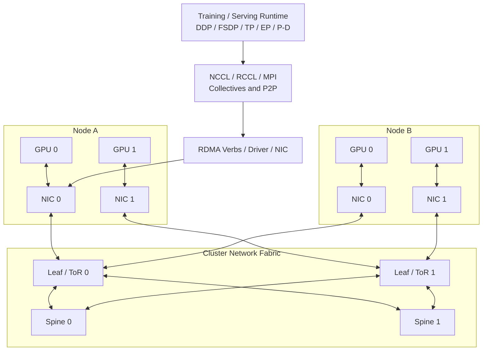

# RDMA 网络与 NCCL 拓扑：InfiniBand、RoCE 与拥塞控制

多机 AI 训练和分布式推理的瓶颈，常常不在单卡算力，而在网络。

当一个模型跨越多台服务器后，GPU 之间必须同步梯度、参数、activation、expert token、KV Cache 或中间状态。网络如果慢、抖动、拥塞或拓扑不匹配，就会让 GPU 等通信，最终表现为 step time 变长、tokens/s 下降、p99 变差、扩展效率低。

这篇关注的问题是：

> AI 集群网络如何支撑 NCCL/RCCL collective、RDMA、InfiniBand/RoCE、GPU Direct RDMA、拓扑感知调度和拥塞控制？

## 一张总图



这张图表达几个关键点：

- AI 网络不是普通东西向流量，它承载同步、突发、大带宽的 collective。
- NCCL/RCCL 会根据 GPU、NIC、PCIe、NVLink 和网络拓扑选择通信路径。
- 多 rail、多 NIC、多交换机只有被正确使用时才有价值。
- 拥塞、错误和尾延迟会直接暴露到训练 step time 或推理 p99。

## RDMA 是什么

RDMA 是 Remote Direct Memory Access。核心思想是让一台机器的网卡直接读写另一台机器的内存区域，尽量绕过 CPU copy 和内核协议栈开销。

对 AI 集群来说，RDMA 的价值是：

- 降低通信延迟。
- 减少 CPU 参与。
- 提高大 tensor 传输带宽。
- 支撑 NCCL/RCCL/MPI 等通信库。
- 和 GPU Direct RDMA 结合，让 NIC 直接访问 GPU memory。

简化路径：

```text
普通路径:
GPU memory -> host memory -> kernel/network stack -> NIC -> network

理想 GPU Direct RDMA 路径:
GPU memory -> NIC -> network
```

实际路径受 GPU/NIC 拓扑、driver、IOMMU、ACS、firmware、通信库和系统配置影响。不能只因为机器有 RDMA NIC，就假设所有通信都走到了理想路径。

## InfiniBand 与 RoCE

AI 集群常见两类 RDMA fabric：

| 类型 | 直觉 | 常见特点 |
| --- | --- | --- |
| InfiniBand | 专用 RDMA/HPC 网络 | 性能和拥塞控制能力强，HPC/训练集群常见 |
| RoCE | 在 Ethernet 上承载 RDMA | 结合以太网生态，但对无损/拥塞配置要求高 |

### InfiniBand

InfiniBand 是专用高性能网络 fabric。它有自己的链路层、交换体系、Subnet Manager、服务等级和拥塞管理能力。

适合：

- 大规模同步训练。
- 高带宽 AllReduce / ReduceScatter。
- 低延迟多节点通信。
- HPC 风格集群。
- 对网络性能和可预测性要求高的场景。

InfiniBand 的优势通常在于它是为 HPC/RDMA 这类 workload 设计的，网络语义和工具链更专用。

### RoCE

RoCE 是 RDMA over Converged Ethernet。它把 RDMA 语义运行在 Ethernet 上。

RoCE 的吸引力是：

- 使用以太网生态。
- 可以和现有数据中心网络能力结合。
- RoCEv2 可以跨三层网络。
- 设备和运维体系更接近普通数据中心网络。

但 RoCE 的挑战在于：RDMA 对丢包和重传非常敏感，RoCE 网络通常需要正确配置 PFC、ECN、QoS、buffer、DSCP/priority、交换机队列和拥塞控制。NVIDIA RoCE 文档也强调，RoCE 需要某种流控形式，常用方式是 Priority Flow Control，并且路径上的端点和交换机都要启用。

### 怎么选择

粗略判断：

- 大规模训练、追求极致稳定和性能：InfiniBand 常更自然。
- 数据中心以太网能力强、希望统一网络生态：RoCE 值得评估。
- 小规模集群：两者都可能可行，关键看团队运维能力。
- 推理东西向流量和训练混合：要重点看隔离、QoS 和拥塞。

不要只比较单口带宽。要比较端到端：

- collective performance。
- 拥塞行为。
- 多租户隔离。
- 故障排查工具。
- 交换机配置复杂度。
- 运维团队经验。
- 成本和供应链。

## NCCL/RCCL 承载什么通信

NCCL/RCCL 是 GPU collective 通信库，常用于多 GPU 和多节点训练/推理。

常见通信模式：

| 模式 | 用途 |
| --- | --- |
| AllReduce | DDP 梯度同步 |
| ReduceScatter | FSDP/ZeRO 梯度分片、部分 TP |
| AllGather | FSDP 参数收集、TP 输出拼接 |
| AllToAll | MoE expert dispatch/combine |
| Broadcast | 参数初始化、配置同步 |
| P2P send/recv | Pipeline Parallel、KV transfer |

不同通信模式对网络压力不同。

AllReduce 可以用 ring/tree/hierarchical 算法优化。ReduceScatter 和 AllGather 常和 sharding 绑定。AllToAll 对网络 bisection bandwidth 和负载均衡特别敏感。P2P 对特定路径和尾延迟敏感。

训练和推理常见映射：

| 并行/系统模式 | 网络压力 |
| --- | --- |
| DDP | step 内 gradient AllReduce |
| FSDP / ZeRO | 多层 AllGather / ReduceScatter |
| Tensor Parallel | 层内高频 collective，跨节点代价很高 |
| Pipeline Parallel | stage 间 activation P2P |
| Expert Parallel / MoE | AllToAll，突发且易不均衡 |
| P/D 分离推理 | KV Cache transfer |
| RAG / Agent | 服务间 RPC、检索网络和 LLM serving 网络叠加 |

## NCCL Topology

NCCL 不只是调用网络，它会理解拓扑并选择路径。

NCCL 需要考虑：

- GPU 与 GPU 的关系。
- GPU 与 NIC 的关系。
- PCIe switch。
- CPU NUMA。
- NVLink/NVSwitch。
- 多 NIC。
- network interface。
- rank mapping。
- collective algorithm。
- channel 数量。

NCCL 文档中也有大量与网络和拓扑相关的环境变量，例如 `NCCL_IB_HCA`、`NCCL_SOCKET_IFNAME`、`NCCL_CROSS_NIC`、`NCCL_TOPO_FILE`、`NCCL_TOPO_DUMP_FILE`、`NCCL_DEBUG`、`NCCL_DEBUG_SUBSYS` 等。

这些变量不是让用户随便调，而是说明 NCCL 的性能和拓扑、网卡选择、调试信息强相关。

### Topology Dump

排查问题时，可以让 NCCL dump topology，结合：

- `nvidia-smi topo -m`。
- NCCL debug log。
- hostfile / rank order。
- network interface。
- switch port counters。
- profiler timeline。

目标是确认：

- NCCL 识别到的拓扑是否正确。
- 是否选到了预期 NIC。
- 是否多 NIC 都在使用。
- 是否跨了错误 NUMA。
- 是否使用了 P2P/NVLink。
- collective 是否分层。

## 网络拓扑：不是所有节点等价

集群网络有拓扑。

常见形态：

- single switch。
- leaf-spine / Clos。
- fat-tree。
- dragonfly。
- torus / mesh。
- multi-rail。
- rail-optimized topology。

AI workload 特别关心：

- bisection bandwidth。
- oversubscription ratio。
- path diversity。
- hop count。
- rack locality。
- rail symmetry。
- congestion domain。
- failure domain。

一个 32 节点 job 如果分布在同 rack，可能表现很好；如果分散跨多个 rack、多个 pod，通信路径变长、拥塞变多，step time 可能变差。

所以调度要能表达：

- 尽量同 rack。
- 尽量同 rail。
- 尽量同网络 island。
- 避免跨低带宽边界。
- 大 job 独占一段拓扑。
- MoE/AllToAll 避免被放到 bisection bandwidth 弱的位置。

## Multi-Rail 网络

Multi-rail 指一台服务器有多张 NIC，连接到多个网络 rail。

理想目标：

```text
GPU 0/1/2/3 -> NIC 0 -> Rail 0
GPU 4/5/6/7 -> NIC 1 -> Rail 1
跨节点通信均匀使用多个 rail
```

多 rail 的好处：

- 提高总带宽。
- 降低单 rail 拥塞。
- 增加路径多样性。
- 更好匹配 GPU/NIC affinity。

但多 rail 不是自动生效。

需要确认：

- 每张 NIC 是否连到正确 rail。
- NCCL/RCCL 是否使用多个 NIC。
- rank mapping 是否均匀。
- 每个 rail 的交换机配置一致。
- RoCE 的 PFC/ECN/QoS 是否在所有 rail 一致。
- 监控是否能分 rail 看流量和错误。

一个常见问题是硬件有多张 NIC，但通信库实际只用了其中一张。

## 拥塞为什么严重

AI 训练网络有同步特征。

例如一个 FSDP 训练 step：

1. 多个 rank 同时 backward。
2. 多个 bucket 同时 ReduceScatter。
3. 下一层又触发 AllGather。
4. 所有节点周期性产生相似流量。

这种流量不是平滑 Web 请求，而是同步、周期性、突发的。

拥塞会导致：

- collective time 增加。
- tail rank 拖慢所有 rank。
- GPU 空等。
- step time 抖动。
- NCCL timeout。
- RoCE pause storm。
- p99 latency 变差。
- 多 job 互相影响。

MoE AllToAll 更容易制造拥塞，因为每个 rank 都可能向多个 rank 发送不同大小的数据，且 token routing 可能不均衡。

## RoCE 拥塞控制：PFC、ECN 与 QoS

RoCE 在 Ethernet 上跑 RDMA，需要认真配置无损或低丢包网络行为。

常见机制：

- PFC：Priority Flow Control，按优先级 pause 流量。
- ECN：Explicit Congestion Notification，用标记提示拥塞。
- QoS：把不同流量放入不同 priority / traffic class。
- DSCP / PCP：标记流量优先级。
- Buffer tuning：交换机 buffer 和队列配置。

PFC 能减少丢包，但配置不好会带来 pause storm、head-of-line blocking 和跨流量影响。ECN 配合端侧拥塞控制可以提前降速。QoS 用来把训练、存储、管理、服务流量隔离到不同 class。

RoCE 运维要点：

- 端点和交换机配置一致。
- PFC 只对需要的 priority 开启。
- ECN 阈值合理。
- DSCP/PCP 映射一致。
- 训练流量和存储/服务流量不要混成同一优先级。
- 监控 pause、ECN mark、drop、buffer、retransmit。

RoCE 的难点不是跑通，而是长期稳定跑快。

## InfiniBand 拥塞与路由

InfiniBand 也会拥塞，尤其是在大规模同步 collective、AllToAll、多个 job 同时运行时。

关注点包括：

- Subnet Manager。
- routing。
- adaptive routing。
- service level。
- virtual lane。
- link error。
- port counters。
- credit / flow control。
- congestion control。
- SHARP / in-network reduction。

InfiniBand 的优势是体系更面向 HPC/RDMA，但仍需要拓扑规划、路由策略、故障监控和 job placement。

大 job 是否跨越多个网络 island，rank 是否和 rail 对齐，都会影响性能。

## 流量隔离

AI 集群常有多类网络流量：

- 训练 collective。
- checkpoint 写入。
- dataset 读取。
- model loading。
- 推理请求。
- RAG 检索。
- monitoring/logging。
- control plane。

这些流量不应无保护地混在一起。

典型隔离策略：

- 管理网络和训练网络分离。
- 存储网络和训练网络分离或 QoS 隔离。
- 推理服务网络与 batch 网络分离。
- checkpoint 流量限速或错峰。
- 大训练 job 独占特定网络分区。
- 多租户按 queue / namespace / project 做流量策略。

网络隔离的目标不是复杂化，而是防止一个 workload 的突发流量拖垮另一个 workload。

## 调度与网络拓扑

调度器需要网络信息。

至少要知道：

- 节点属于哪个 rack。
- 节点属于哪个 leaf / pod。
- 节点有哪些 NIC。
- NIC 属于哪个 rail。
- GPU/NIC affinity。
- 节点间是否同网络 island。
- 哪些节点适合组成大训练 job。

调度策略例子：

- TP 跨节点任务优先放在同一高带宽网络 island。
- MoE AllToAll 任务避免跨低 bisection boundary。
- 大训练 job 尽量获得连续节点集合。
- 多个大 job 不放在同一拥塞域。
- 推理服务避免和 checkpoint-heavy 任务共享关键网络。

如果调度器完全不知道网络拓扑，NCCL 再努力也只能在已经分配的节点上优化。

## 可观测性

网络问题必须可观测。

需要采集：

### NIC / Host

- RDMA bandwidth。
- packet drop。
- retry / retransmission。
- completion error。
- CQ error。
- RoCE GID / traffic class。
- NIC temperature。
- PCIe error。

### Switch

- port utilization。
- port error。
- pause frame。
- PFC storm。
- ECN mark。
- buffer occupancy。
- link flap。
- congestion counter。

### Communication Library

- NCCL debug log。
- collective type。
- collective duration。
- algorithm / protocol。
- channel count。
- selected NIC。
- topology dump。
- timeout / async error。

### Workload

- step time。
- exposed communication time。
- p95/p99 latency。
- rank skew。
- GPU idle time。
- tokens/s。
- job placement。

没有这些指标，网络问题会被误判成“模型慢”“GPU 有问题”或“框架不稳定”。

## Benchmark 方法

网络 benchmark 要从 micro 到 end-to-end。

### Microbenchmark

测基本能力：

- point-to-point RDMA bandwidth。
- RDMA latency。
- GPU Direct RDMA bandwidth。
- single NIC / multi NIC。
- same rack / cross rack。
- same rail / cross rail。

### Collective Benchmark

测 NCCL/RCCL：

- AllReduce。
- ReduceScatter。
- AllGather。
- AllToAll。
- Broadcast。
- P2P send/recv。

要覆盖不同 message size，因为小消息受 latency 影响，大消息受 bandwidth 影响。

### Component Benchmark

测真实 AI 组件：

- DDP gradient sync。
- FSDP bucket。
- TP layer collective。
- MoE dispatch/combine。
- P/D KV transfer。
- checkpoint write burst。

### End-to-End Benchmark

最终看：

- training step time。
- scaling efficiency。
- MFU/HFU。
- TTFT / TPOT。
- p95/p99。
- tokens/s/GPU。
- timeout / failure rate。
- 多 job 干扰。

单 job 网络 benchmark 很好，不代表多租户集群里也好。必须在接近真实负载下测拥塞。

## 常见排查路径

看到多机训练慢，可以按下面查：

1. 单机性能是否正常。
2. GPU/NIC affinity 是否合理。
3. NCCL 是否选到预期 NIC。
4. 多 NIC 是否都在使用。
5. rank mapping 是否跨错拓扑。
6. NCCL debug 是否有 warning / timeout。
7. switch port 是否有 drop / pause / ECN。
8. RoCE PFC/ECN/QoS 是否一致。
9. 是否与 checkpoint 或其他 job 同时拥塞。
10. 同 rack 与跨 rack 性能差异是否异常。

看到推理 p99 抖动，可以查：

- P/D KV transfer 是否堵塞。
- 推理服务是否和训练共享网络。
- model loading 是否冲击网络。
- RAG 检索是否和 LLM serving 抢网络。
- 某些 replica 是否被放到远端网络路径。

## 常见优化方向

### 拓扑感知分配

把重通信 job 放在网络邻近节点上，比盲目增加节点更有效。

### 分层 collective

先节点内规约，再节点间通信，再节点内分发，通常比扁平跨所有 GPU 通信更符合硬件拓扑。

### 多 rail 对齐

让 GPU、NIC、rail、rank order 对齐，避免所有流量挤到一张 NIC 或一个 rail。

### 通信与计算重叠

训练中把 gradient bucket、FSDP prefetch、reduce-scatter 和 backward 计算重叠。推理中把 KV transfer 和调度、precompute、cache 管理重叠。

### 流量隔离和 QoS

把训练、存储、服务和管理流量分开或设置不同优先级。checkpoint 可以限速或错峰。

### 降低通信量

减少通信比优化网络更直接：

- 使用合适并行策略。
- 避免跨节点 TP。
- 使用 FSDP/ZeRO 合理 bucket。
- MoE 做 load balance。
- 梯度或 activation 压缩要谨慎评估精度和收益。
- KV transfer 做 cache 和 locality 优化。

## 常见误区

### 误区一：有 RDMA 就一定快

RDMA 只是能力。是否走到 GPU Direct RDMA、是否选到正确 NIC、网络是否拥塞、PFC/ECN 是否正确，都会影响性能。

### 误区二：单链路带宽代表集群能力

AI job 关心的是多节点同时通信时的 bisection bandwidth、collective efficiency 和 tail rank。

### 误区三：RoCE 只是普通以太网

RoCE 对无损/拥塞控制要求高。普通以太网能 ping 通，不代表 RoCE collective 稳定。

### 误区四：网络问题只看 NCCL log

NCCL log 重要，但还要看 NIC、switch、PFC、ECN、drop、pause、rank mapping 和 job placement。

### 误区五：训练网络和存储网络混用没关系

Checkpoint 和 dataset 读取也会产生大流量。它们可能和 collective 互相干扰。

### 误区六：网络调优全靠用户环境变量

平台应该提供默认正确的 topology、interface、QoS、rank mapping 和监控，而不是让每个用户自己摸索。

## 设计检查清单

设计 AI 集群网络时，可以检查：

- 使用 InfiniBand、RoCE 还是二者混合。
- 是否支持 GPU Direct RDMA。
- GPU/NIC affinity 是否清晰。
- 是否有多 rail。
- NCCL/RCCL 是否能使用所有预期 NIC。
- 节点、rack、leaf、pod 拓扑是否进入调度。
- 大 job 是否能获得拓扑连续资源。
- RoCE 的 PFC/ECN/QoS 是否端到端一致。
- 训练、存储、推理、管理流量是否隔离。
- checkpoint 是否会冲击训练网络。
- 是否采集 switch port、NIC、NCCL、job placement 指标。
- 是否有 NCCL topology dump 和 debug 流程。
- 是否有 micro、collective、component、end-to-end benchmark。
- 是否在多 job 干扰下测过拥塞。
- timeout、drop、pause、ECN、retry 是否有告警。

## 小结

AI 集群网络的核心不是“网卡速率是多少”，而是：

```text
通信模式
  -> GPU/NIC 拓扑
  -> 网络 fabric
  -> collective algorithm
  -> 拥塞控制
  -> 调度放置
  -> 可观测性
  -> 端到端 step time / p99
```

如果网络设计和调度不匹配，GPU 会等通信；如果拥塞不可观测，问题会长期被误判；如果多租户流量不隔离，一个 job 的 checkpoint 或 AllToAll 可能拖慢整个集群。

高质量 AI 网络设计，应把 RDMA、NCCL topology、拥塞控制、调度和 benchmark 作为一个系统一起看。

## 延伸阅读

- [NVIDIA NCCL Documentation](https://docs.nvidia.com/deeplearning/nccl/user-guide/docs/index.html)
- [NVIDIA NCCL Environment Variables](https://docs.nvidia.com/deeplearning/nccl/user-guide/docs/env.html)
- [NVIDIA RDMA over Converged Ethernet Documentation](https://docs.nvidia.com/networking/display/mlnxofedv23103220lts/rdma+over+converged+ethernet+(roce))
- [NVIDIA Networking Documentation](https://docs.nvidia.com/networking/)
- [OpenFabrics Alliance](https://www.openfabrics.org/)
