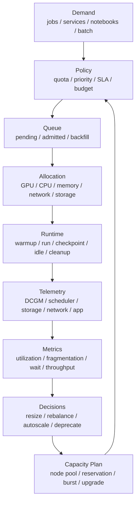

# 资源利用率、碎片与容量治理：从 GPU 分配到有效吞吐

AI 集群最容易被一个指标误导：GPU 利用率。

很多团队会先问：

> 集群 GPU 利用率有多少？

但这个问题本身不够精确。这里的利用率可能指：

- GPU 被分配给任务的比例。
- GPU 上是否有进程。
- SM 是否在忙。
- HBM 带宽是否在跑。
- Tensor Core 是否在跑。
- 训练 step 是否有效推进。
- 推理服务是否在稳定产出 token。
- 用户是否得到了有价值的实验结果。

这些都可以叫“利用率”，但它们表达的含义完全不同。

一个 GPU 被任务占着，不代表它在计算；GPU 在计算，不代表它在做有价值的计算；训练任务在跑，不代表集群资源配置是健康的。如果只盯分配率，集群会很快变成“看起来很忙，实际有效吞吐很低”。

这篇文章讨论的是 AI 集群运营视角下的资源治理：如何理解利用率、碎片、排队、公平性、SLA、容量、成本和能效之间的关系。

## 一张总图



这张图表达一个运营闭环：

- 需求进入队列。
- 策略决定谁能用资源。
- 调度器完成分配。
- 运行时产生真实消耗和产出。
- 监控收集事实。
- 指标暴露问题。
- 决策改变配额、节点池、镜像、任务模板和容量计划。

如果没有这个闭环，集群治理就会停留在“资源不够，加机器”或“GPU 利用率低，催用户”的粗糙阶段。

## 利用率不是一个指标

AI 集群至少要区分五种利用率。

| 指标 | 含义 | 容易误判 |
| --- | --- | --- |
| 分配率 | GPU 被 scheduler 分配出去的比例 | 分配了不代表在计算 |
| 驻留率 | GPU 上有进程或显存占用的比例 | 显存占用不代表 SM 忙 |
| 活跃率 | GPU SM、Tensor Core、HBM 正在工作的比例 | 活跃不代表任务有效推进 |
| 有效吞吐 | step/token/sample/query 等业务产出 | 需要应用指标配合 |
| 价值利用率 | 单位成本产出的有效训练/推理结果 | 最难测，但最接近治理目标 |

举例：

```text
GPU allocation rate: 95%
GPU SM utilization: 35%
training step efficiency: 20%
```

这说明 GPU 大部分时间被任务占住，但任务实际推进慢。原因可能是：

- DataLoader 等数据。
- checkpoint 卡住。
- 通信同步等待。
- CPU tokenization 成为瓶颈。
- 小 batch 导致 GPU 不饱和。
- 多租户干扰导致网络或存储抖动。
- Notebook 占着 GPU 但很少计算。

所以“GPU 分配率高”不是好消息，也不是坏消息。它只是第一个信号。

## 从分配到有效吞吐

可以把 GPU 资源使用分成一条链：

```text
available GPU
  -> schedulable GPU
  -> allocated GPU
  -> process resident GPU
  -> active GPU
  -> productive GPU
  -> valuable output
```

每一层都会损耗。

### Available GPU

物理存在且健康的 GPU。

排除：

- 故障 GPU。
- drain 节点。
- driver 异常节点。
- 被维护窗口占用的节点。
- 被系统保留的节点。

### Schedulable GPU

调度器认为可以分配的 GPU。

排除：

- taint 不允许使用。
- 节点池不匹配。
- MIG 切分形态不匹配。
- GPU 型号不满足任务要求。
- CPU/memory/NVMe 不足导致 GPU 无法被调度。

### Allocated GPU

已经被 job 或 service 占用的 GPU。

这是很多集群报表里的“利用率”，但它只能说明资源被占住。

### Resident GPU

任务在 GPU 上有进程、上下文或显存占用。

Notebook 经常停在这一层：显存占着，SM 不忙。

### Active GPU

GPU 真的在执行 kernel、访问 HBM 或通信。

这一层需要 DCGM、NVML、框架 profiler 或系统 telemetry。

### Productive GPU

GPU 活跃时间里，有多少在推动目标 workload。

例如训练里：

- forward/backward/optimizer 是 productive。
- DataLoader wait 不是。
- checkpoint blocking 不是。
- NCCL 等慢 rank 不完全是。
- 失败后重跑的一部分可能不是。

推理里：

- prefill/decode 是 productive。
- 模型冷加载不是。
- 空 batch 等待不是。
- 被取消请求的计算价值较低。

### Valuable Output

最终产出：

- 训练 token。
- 有效 step。
- eval score。
- 推理 token。
- 成功请求。
- 构建好的 embedding index。
- 通过验收的模型版本。

这才是资源治理真正想提升的东西。

## 核心指标体系

### 资源供给指标

资源供给回答“集群能提供什么”。

| 指标 | 说明 |
| --- | --- |
| total GPU | 物理 GPU 总量 |
| healthy GPU | 健康可用 GPU |
| schedulable GPU | 调度器可分配 GPU |
| GPU by type | H100/A100/L40S/MI300 等型号分布 |
| GPU by node pool | train/infer/dev/batch/system |
| CPU/GPU ratio | 每 GPU 对应 CPU 核数 |
| memory/GPU ratio | 每 GPU 对应 host memory |
| local NVMe/GPU ratio | 每 GPU 对应本地缓存容量 |
| network bandwidth/GPU | 每 GPU 对应网络能力 |

AI 集群不能只统计 GPU 数量。GPU 很强但 CPU、内存、网络或存储不足，会形成“假容量”。

### 资源需求指标

资源需求回答“用户想要什么”。

| 指标 | 说明 |
| --- | --- |
| submitted jobs | 提交任务数 |
| requested GPU hours | 请求的 GPU 小时 |
| requested GPU type | 请求的 GPU 型号 |
| requested gang size | 需要同时分配的 GPU 数 |
| requested duration | 用户预估或历史推断运行时间 |
| queue wait time | 排队等待 |
| pending reason | 等待原因 |
| deadline / SLA | 任务时限 |

大训练、短微调、Notebook、推理服务的需求曲线完全不同。如果只看总 GPU 需求，会掩盖结构性问题。

### 资源使用指标

资源使用回答“资源实际怎么被用掉”。

| 指标 | 说明 |
| --- | --- |
| allocation rate | GPU 被分配比例 |
| SM utilization | GPU 计算单元活跃程度 |
| HBM utilization | 显存带宽使用 |
| GPU memory used | 显存占用 |
| power draw | 功耗 |
| PCIe/NVLink/RDMA traffic | 互连与网络流量 |
| CPU utilization | CPU 使用 |
| memory pressure | host memory 压力 |
| storage throughput | 数据和 checkpoint 吞吐 |
| checkpoint duration | checkpoint 时间 |
| job failure/retry | 失败和重试 |

NVIDIA DCGM exporter 常用于把 GPU telemetry 暴露给 Prometheus；Kubernetes resource metrics pipeline 主要提供 CPU/memory 等资源指标，不能替代 GPU、网络、存储和应用层 telemetry。

### 产出指标

产出指标回答“这些资源产生了什么”。

| Workload | 产出指标 |
| --- | --- |
| 预训练 | tokens/sec、step time、MFU、loss 曲线 |
| 微调 | samples/sec、epoch time、eval score |
| 推理 | tokens/sec、requests/sec、p50/p95/p99、错误率 |
| 离线推理 | samples/hour、cost/sample |
| 数据预处理 | files/sec、GB/hour、shard 产出 |
| RAG index | vectors/sec、index build time、query recall |
| Notebook | active session、idle time、GPU active ratio |
| Benchmark | 固定 workload 的可比较吞吐 |

没有产出指标，就无法判断高利用率是否有意义。

## 一个实用分解

可以用几个简单比例定位问题：

```text
allocation_util = allocated_gpu_hours / schedulable_gpu_hours
active_util = active_gpu_time / allocated_gpu_time
productive_util = productive_time / active_gpu_time
useful_output_efficiency = useful_output / allocated_gpu_hours
```

不同组合代表不同问题。

| 现象 | 可能含义 |
| --- | --- |
| allocation 高，active 低 | 占用但不计算，Notebook idle、数据瓶颈、任务卡住 |
| allocation 低，pending 高 | 碎片、约束过强、gang 调度等待 |
| active 高，throughput 低 | 通信、低效 kernel、batch 太小、memory bound |
| throughput 高，SLA 差 | 平均吞吐好但尾延迟差 |
| utilization 高，成本高 | 高价值任务和低价值任务混在一起，需要成本归因 |

这套分解的价值是：不要把所有问题都归结成“GPU 利用率低”。

## 资源碎片

碎片是 AI 集群最常见的隐性损耗。

### 节点内碎片

例如 8 卡节点上只剩 1 张 GPU。小任务可以跑，但 8 卡训练任务无法调度。

碎片来源：

- 小任务随意占用大节点。
- CPU/memory request 不匹配。
- 本地 NVMe 已满。
- MIG 切分形态不匹配。
- GPU 与 NIC/NUMA 拓扑不匹配。

### 节点间碎片

总 GPU 数够，但分散在不同 rack、不同网络域或不同节点池里，不能组成一个拓扑一致的大 job。

例如：

```text
free GPU total: 64
needed: 64 GPU, same high-speed fabric island
actual: 8 islands x 8 free GPU, network topology not suitable
```

这时“空闲 GPU 总数”会误导容量判断。

### 型号碎片

不同 GPU 型号混杂：

- H100。
- A100 80GB。
- A100 40GB。
- L40S。
- 推理卡。
- MIG 实例。

如果任务只接受一种 flavor，其他 GPU 就是不可用容量。

### 配额碎片

资源在不同 team/project quota 中静态切分。某个团队空闲，另一个团队排队，但资源不能借用。

解决方式通常是：

- guaranteed quota。
- borrowable quota。
- fairshare。
- preemption。
- queue-level resource flavor。

### 时间碎片

短任务和长任务混合时，调度器可能为了等待大 job 而保留资源，也可能为了提高即时利用率不断塞小任务，导致大 job 长期无法启动。

这就是 backfill、gang scheduling 和 deadline-aware scheduling 要处理的问题。

## 碎片指标

可以从多个角度度量碎片。

### Free-but-unusable GPU

```text
unusable_free_gpu = free_gpu - gpu_that_can_satisfy_pending_jobs
```

这比简单的 `free_gpu` 更有意义。

### Largest Contiguous Allocation

能立即分配给单个 job 的最大连续资源。

例如：

```text
total free: 128 GPU
largest contiguous allocation: 32 GPU
```

如果队列里有多个 64 GPU 任务，集群看似空闲，实际不可用。

### Pending Reason 分布

统计 pending 原因：

- GPU 不足。
- 特定 GPU 型号不足。
- CPU/memory 不足。
- 节点亲和性不满足。
- quota 不足。
- gang size 无法满足。
- topology 不满足。
- storage mount 失败。
- image pull 慢。

Kueue、Slurm、Kubernetes 的事件和队列状态都可以提供这类信号。关键是要把它们转成可聚合的报表，而不是让用户自己读日志。

### Fragmentation Ratio

一个简单定义：

```text
fragmentation_ratio = 1 - schedulable_for_pending / total_free
```

它不一定适合所有场景，但能提醒你：空闲资源不等于可用资源。

## 排队指标

排队是资源不足、策略不合理和碎片的综合结果。

核心指标：

- queue length。
- queue wait time p50/p95/p99。
- wait time by queue。
- wait time by workload type。
- wait time by GPU type。
- wait time by gang size。
- admitted vs pending。
- backfill 成功率。
- preemption 次数。
- starvation task 数量。

平均等待时间很容易误导。一个队列可能平均等待 10 分钟，但 512 GPU 训练任务等待 3 天。AI 集群应该按 job size 和 workload type 拆分排队指标。

## 公平性指标

公平性不是“每个人一样多”，而是资源分配和组织目标一致。

常见公平性指标：

- 每个 team 的 GPU hour。
- 每个 project 的 quota 使用率。
- guaranteed quota 满足率。
- borrowed quota 使用量。
- fairshare score。
- 每个 team 的等待时间。
- 每个 team 被抢占次数。
- 每个 workload type 的资源占比。

公平性要结合时间窗口：

```text
1 hour: 当前是否拥塞
1 day: 日常使用是否平衡
1 week: 项目是否持续超用
1 month: 成本和预算归因
```

短时间内不公平可能是合理的，因为大训练需要一次性拿到很多 GPU；长期不公平才需要调整策略。

## SLA 指标

不同 workload 的 SLA 不同。

### 推理服务

关注：

- p50/p95/p99 latency。
- time to first token。
- tokens/sec。
- request error rate。
- timeout rate。
- cold start time。
- model loading time。
- batch queue delay。

推理服务的 SLA 经常和低优先级混部冲突。平均 GPU 利用率提升 10%，如果 p99 latency 翻倍，通常不值得。

### 训练任务

关注：

- queue wait time。
- time to first step。
- step time。
- tokens/sec。
- MFU。
- checkpoint duration。
- failure recovery time。
- successful run rate。

训练 SLA 不一定是实时延迟，而是周转时间和可恢复性。

### Notebook

关注：

- session 启动时间。
- idle GPU 时间。
- interactive latency。
- 最大连续运行时间。
- 从 Notebook 转 batch 的比例。

Notebook 的治理重点是减少“占而不用”。

## 容量治理

容量治理不是简单地看平均利用率。

需要回答：

```text
现有容量能满足哪些 workload？
哪些需求长期排队？
瓶颈是 GPU、CPU、内存、网络还是存储？
新增资源应该买什么型号？
是扩训练池、推理池、dev 池，还是优化调度？
空闲资源是否真的可用？
```

### Demand Model

一个基础模型：

```text
demand = arrival_rate * requested_gpu * expected_duration
```

但 AI workload 还要考虑：

- gang size。
- GPU type。
- topology。
- checkpoint 周期。
- job failure rate。
- peak/off-peak。
- deadline。
- priority。

同样 1024 GPU hours，可能是：

- 1 个 1024 GPU 任务跑 1 小时。
- 128 个 8 GPU 任务跑 1 小时。
- 1 个 8 GPU 任务跑 128 小时。

它们对调度和碎片的压力完全不同。

### Headroom

集群不能追求 100% 分配率。

需要保留 headroom：

- 推理突发。
- 失败重试。
- 高优先级任务。
- 节点维护。
- checkpoint 高峰。
- 数据重处理。
- 大 job gang allocation。

headroom 不是浪费，而是 SLA 和稳定性的成本。

### Capacity by Flavor

容量必须按 flavor 管理：

```text
H100-SXM-80GB
A100-SXM-80GB
A100-PCIe-40GB
L40S
MIG-1g.10gb
CPU-only high-memory
NVMe-heavy
network-heavy
```

如果只看总 GPU 数，很容易把不可替代的 H100 需求用普通 GPU 空闲量掩盖。

## 成本指标

成本治理要从“花了多少钱”走向“每单位有效产出多少钱”。

常见指标：

| 指标 | 含义 |
| --- | --- |
| cost / GPU hour | 单位 GPU 时间成本 |
| cost / training token | 训练单位 token 成本 |
| cost / successful run | 成功实验成本 |
| cost / inference token | 推理 token 成本 |
| cost / request | 单请求成本 |
| cost / eval point | 评测成本 |
| wasted cost | 失败、idle、重试、无效 checkpoint 成本 |

成本归因维度：

- team。
- project。
- workload type。
- queue。
- node pool。
- GPU type。
- model。
- dataset。
- environment image。
- priority class。

成本报表不能只按 namespace 或账号聚合。AI 系统更需要看到“哪个模型、哪个实验、哪个服务、哪个数据流程”在消耗资源。

## 能效指标

AI 集群能效不只是数据中心 PUE，也包括 workload 级别的有效计算。

常见指标：

- GPU power draw。
- energy / training token。
- energy / inference token。
- energy / request。
- tokens per joule。
- step time per watt。
- idle power。
- cooling headroom。
- thermal throttling。

功耗指标和利用率要一起看：

| 现象 | 含义 |
| --- | --- |
| 高功耗、高吞吐 | 可能正常 |
| 高功耗、低吞吐 | 可能 kernel、通信、数据瓶颈 |
| 低功耗、GPU 分配高 | 任务占着但没跑 |
| 功耗周期性锯齿 | 可能数据读取或 checkpoint 周期造成 |
| 频率下降 | 可能温度、电源或功耗限制 |

能效治理不是简单降频，而是提高单位能耗的有效产出。

## 可观测性实现

### Kubernetes

Kubernetes resource metrics pipeline 提供 CPU、内存等资源指标，常用于 autoscaling 和 `kubectl top`。但 AI 集群还需要：

- GPU metrics。
- queue metrics。
- object state metrics。
- storage metrics。
- network metrics。
- application metrics。

常见组件包括：

- Metrics Server：基础 CPU/memory 指标。
- kube-state-metrics：Kubernetes 对象状态。
- DCGM exporter：GPU telemetry。
- CNI / network exporter：网络指标。
- CSI / storage exporter：存储指标。
- scheduler / queue metrics：调度和排队指标。
- application metrics：训练和推理产出。

### DCGM Exporter

NVIDIA DCGM exporter 可以把 GPU 指标暴露给 Prometheus，包括利用率、显存、功耗、温度、错误等。它适合做集群 GPU 监控，但仍要和应用指标结合。

例如：

```text
DCGM says GPU busy
training says tokens/sec low
storage says read latency high
```

这三者合在一起才说明：GPU 忙不等于训练有效。

### Kueue

Kueue 提供队列、准入、资源 flavor 和 workload 相关指标。它适合观察：

- workload 是否 admitted。
- queue 是否拥塞。
- resource flavor 是否不足。
- pending workload 分布。
- borrowing 和 quota 使用。

这些指标能把“为什么任务还没跑”从用户感受转成平台信号。

### Slurm

Slurm 常用：

- `squeue` 看当前队列。
- `sacct` 看历史 accounting。
- `sinfo` 看节点和 partition。
- `sshare` 看 fairshare。
- `sstat` 看运行中 job 指标。

Slurm accounting 对长期资源归因很重要，但 GPU active utilization、HBM、功耗等仍需要 DCGM 或其他 GPU telemetry 补齐。

## Dashboard 设计

AI 集群 dashboard 不应该只有一张 GPU 利用率图。

建议分层：

### Executive View

面向管理和容量决策：

- total GPU hours。
- effective utilization。
- cost by team/project。
- wait time by queue。
- SLA violation。
- node pool health。
- trend and forecast。

### Operator View

面向平台运维：

- unhealthy nodes。
- pending reason。
- fragmentation。
- scheduler latency。
- image pull failure。
- storage/network saturation。
- GPU error。
- checkpoint spikes。

### Research View

面向用户和课题组：

- 我的 quota。
- 我的 waiting jobs。
- 我的 GPU hour。
- 我的 idle notebook。
- 我的失败重试。
- 推荐队列和资源规格。

### Workload View

面向单个任务：

- queue wait。
- startup time。
- step time / tokens/sec。
- GPU SM/HBM/power。
- DataLoader wait。
- communication time。
- checkpoint duration。
- failure/restart。

不同视图对应不同问题。把所有指标堆在一张图上，通常谁也看不懂。

## 告警策略

告警要避免“利用率低就报警”的粗糙规则。

更有价值的告警：

- schedulable GPU 突然下降。
- unhealthy GPU 增多。
- pending time p95 超阈值。
- 某队列长期 starvation。
- fragmentation ratio 高。
- 推理 p99 与低优先级混部相关。
- checkpoint duration 异常升高。
- DataLoader wait 大面积升高。
- storage metadata rate 异常。
- network retransmit / congestion 异常。
- GPU 分配高但功耗和 SM utilization 低。
- system node pool 资源压力。

告警要能指向动作：

```text
drain node
rebalance queue
increase quota
disable low-priority backfill
investigate storage
roll back image
expand node pool
```

没有动作的告警会变成噪声。

## 常见治理动作

### 清理 Idle

适合 Notebook 和 dev job：

- idle timeout。
- GPU active ratio 低于阈值提醒。
- 超时自动释放。
- 长任务转 batch。

### 调整 Request

很多任务 request 过大或过小：

- CPU request 太低导致 DataLoader 慢。
- memory request 太低导致 OOM。
- GPU request 太大导致浪费。
- shared memory 不足导致 dataloader/推理问题。

可以基于历史运行推荐资源规格。

### Backfill

用短任务填补大任务等待期间的空隙。

要求：

- 任务时长可估计。
- 可抢占或短时完成。
- 不破坏大 job 的 gang allocation。

### Defragmentation

通过驱逐、迁移或等待策略减少碎片。

适用于：

- 大 job 长期 pending。
- 小 job 占据大节点。
- MIG 形态不匹配。
- 多节点拓扑被打散。

### Queue Rebalancing

根据需求和等待时间调整：

- guaranteed quota。
- borrow limit。
- priority。
- node pool mapping。
- fairshare weight。

### Node Pool 调整

当某类资源长期短缺，而其他资源长期空闲，应调整 node pool：

- 推理池扩容。
- dev 池缩容。
- benchmark 池固定。
- H100 和 A100 分层。
- NVMe-heavy 节点给数据任务。

## 容量规划方法

容量规划可以按三步做。

### 1. 记录历史需求

至少记录：

- job type。
- requested GPU。
- GPU type。
- duration。
- wait time。
- success/failure。
- preemption。
- output throughput。
- cost。

### 2. 建立需求画像

按 workload type 建模：

```text
large training: needs gang, topology sensitive, long duration
fine-tuning: medium GPU, frequent, deadline moderate
notebook: interactive, idle heavy, preemptible
online inference: SLA strict, bursty
batch inference: throughput-oriented, preemptible
data pipeline: storage-heavy, often CPU-bound
```

### 3. 做情景分析

典型问题：

- 如果新增 20% 推理流量，推理池是否够。
- 如果启动一个 1024 GPU 训练，其他队列等待多久。
- 如果一个 rack 维护，哪些任务受影响。
- 如果低优先级任务可抢占，能释放多少 headroom。
- 如果 H100 需求增长，A100 空闲能否替代。

容量规划不是一次性表格，而是持续更新的模型。

## 常见误区

### 误区一：GPU 分配率越高越好

分配率高但有效吞吐低，说明资源被占住却没有产出。

### 误区二：空闲 GPU 就等于浪费

有些 headroom 是为了推理 SLA、高优先级任务、维护和大 job gang allocation。

### 误区三：平均利用率能代表集群健康

平均值会掩盖队列、型号、节点池和租户之间的结构性问题。

### 误区四：只买更多 GPU 就能解决排队

如果瓶颈是 CPU、存储、网络、碎片、调度策略或环境启动，新增 GPU 可能只是制造更多空转。

### 误区五：成本只按 GPU hour 算

失败重试、idle、低效数据管道、长 checkpoint、冷启动和人工排障都是真实成本。

### 误区六：能效就是降低功耗

AI 集群能效的关键是单位能耗的有效产出，而不是单纯让 GPU 少耗电。

## 设计检查清单

- 是否区分 GPU 分配率、活跃率、有效吞吐和价值产出。
- 是否采集 DCGM/NVML 级 GPU 指标。
- 是否采集训练、推理和数据任务的应用层产出指标。
- 是否能看到 pending reason。
- 是否能按 queue、team、project、GPU type 拆分等待时间。
- 是否能度量资源碎片，而不只是空闲 GPU。
- 是否能计算 largest contiguous allocation。
- 是否区分 guaranteed quota、borrowed quota 和实际使用。
- 是否能看到 Notebook idle GPU。
- 是否能看到 checkpoint duration 和 DataLoader wait。
- 是否能把成本归因到 team/project/workload/model。
- 是否有推理 p99 与混部任务的关联分析。
- 是否有 headroom 策略。
- 是否按 GPU flavor 做容量规划。
- 是否能识别 GPU 分配高但功耗/SM 利用低的任务。
- 是否能识别高功耗低吞吐任务。
- 是否有 queue rebalancing 和 defragmentation 流程。
- 是否有面向管理、运维、用户和单任务的不同 dashboard。

## 小结

AI 集群治理要从单一“GPU 利用率”升级为多层指标体系：

```text
capacity
  -> demand
  -> queue
  -> allocation
  -> active usage
  -> productive usage
  -> output
  -> cost and energy
```

真正有价值的目标不是让每张 GPU 都被占满，而是让高价值 workload 更快、更稳、更便宜地产生结果。

当你能解释“为什么空闲 GPU 不能用”“为什么分配率高但吞吐低”“为什么某个队列长期等待”“为什么推理 p99 被混部影响”“为什么新增 GPU 不能解决瓶颈”时，集群才进入可治理状态。

## 延伸阅读

- [Kubernetes Resource Metrics Pipeline](https://kubernetes.io/docs/tasks/debug/debug-cluster/resource-metrics-pipeline/)
- [NVIDIA DCGM Exporter](https://docs.nvidia.com/datacenter/dcgm/latest/gpu-telemetry/dcgm-exporter.html)
- [Kueue Prometheus Metrics](https://kueue.sigs.k8s.io/docs/reference/metrics/)
- [Slurm sacct](https://slurm.schedmd.com/sacct.html)
- [Slurm squeue](https://slurm.schedmd.com/squeue.html)
