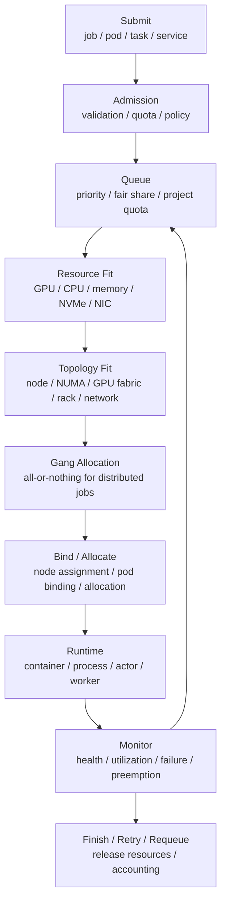

# 调度系统与资源队列：Slurm、Kubernetes、Ray、Volcano 与 Kueue

AI 集群里的调度，不只是“找几张空 GPU”。它要在有限资源上同时处理训练、推理、数据处理、评测和交互实验，并在效率、公平、拓扑、SLO、抢占、成本之间做取舍。

真正的问题是：

> 一个 workload 应该什么时候运行、在哪些节点运行、拿到什么资源、能不能被抢占、失败后如何恢复，以及它是否会影响其他 workload？

调度系统如果设计不好，会出现：

- GPU 被分配了但实际利用率很低。
- 大训练任务排队很久，因为资源被小任务碎片化。
- 多机任务拿到的 GPU 跨越糟糕网络拓扑，扩展效率差。
- 交互任务被长训练任务堵住。
- 推理服务被 batch job 干扰，p99 延迟变差。
- 抢占发生了，但没有 checkpoint，任务损失巨大。
- 队列公平看似合理，实际关键项目没有资源。

这篇建立 AI 集群调度的系统框架。

## 一张总图



调度可以分成三层：

| 层次 | 主要问题 |
| --- | --- |
| 队列层 | 谁先获得运行机会，如何处理 quota、priority、fairness |
| 放置层 | workload 放到哪些节点，是否满足资源、拓扑、亲和性 |
| 运行层 | 运行中是否抢占、重试、扩缩容、隔离、记账 |

AI 集群的调度难点在于：资源不是同质的，任务不是短小的，很多 workload 还需要一组资源同时到位。

## AI 调度与普通服务调度有什么不同

普通在线服务调度常关注：

- CPU。
- 内存。
- 副本数。
- 节点健康。
- 滚动升级。
- 服务发现。

AI workload 还额外关注：

- GPU/NPU 型号。
- 显存容量。
- GPU-to-GPU 拓扑。
- GPU/NIC 邻近性。
- 多节点网络拓扑。
- HBM、NVMe、host memory。
- RDMA / NCCL collective。
- gang scheduling。
- checkpoint。
- 长任务抢占成本。
- queue time。
- tokens/s/GPU。
- p95/p99 latency。

例如一个普通 Web 服务 pod，可以先启动 7 个副本，再慢慢补第 8 个。一个 8 GPU Tensor Parallel 推理实例，少 1 张 GPU 就可能不能启动。一个 64 GPU 训练任务，如果只分配到 60 张 GPU，资源被占住但任务不能跑。

所以 AI 调度必须理解资源 shape。

## Workload 类型决定调度策略

不同 workload 需要不同策略。

| Workload | 调度关注点 |
| --- | --- |
| 交互实验 | 快速启动、短时配额、闲置回收、避免长期占卡 |
| 单机训练 | 整节点/部分 GPU、CPU/IO 配比、环境复现 |
| 多机训练 | gang scheduling、网络拓扑、checkpoint、抢占成本 |
| Fine-tuning | 任务数量多、资源尺寸多样、排队公平 |
| 批量推理 | 高吞吐、可中断、数据 locality、成本 |
| 在线推理 | SLO、p99、弹性、隔离、滚动升级 |
| 数据处理 | CPU、内存、存储吞吐、本地 NVMe |
| Benchmark | 独占、固定环境、可复现、低干扰 |

把所有 workload 丢进同一个队列，通常会产生冲突。更合理的做法是按 workload 类型设置分区、队列、quota、优先级和抢占策略。

## 调度生命周期

### 1. Submit

用户或系统提交 workload。

可能形式包括：

- Slurm job script。
- Kubernetes Pod / Job / Deployment / StatefulSet。
- Ray job。
- VolcanoJob。
- Kueue-managed Job。
- 推理平台的 model deployment。

提交阶段需要明确：

- 需要多少 GPU。
- 需要什么型号。
- 是否必须同机。
- 是否需要多节点。
- CPU、内存、NVMe、网络需求。
- 预计运行时长。
- 是否可抢占。
- checkpoint 能力。
- 镜像和环境。
- 队列 / 项目 / 账号。

需求描述不完整，后面的调度就只能靠猜。

### 2. Admission

Admission 决定任务是否允许进入系统。

常见检查：

- 用户是否有权限。
- project quota 是否足够。
- 镜像是否合规。
- 资源请求是否超过限制。
- 是否指定非法节点。
- 是否缺少 checkpoint 策略。
- 是否会违反安全策略。
- 是否属于允许的 workload 类型。

Admission 不等于调度。Admission 是“能不能进入队列”，调度是“什么时候在哪里运行”。

### 3. Queue

队列层处理等待顺序。

常见因素：

- priority。
- fair share。
- quota。
- project 权重。
- job age。
- job size。
- deadline。
- preemption policy。
- backfill opportunity。

公平调度并不等于所有人平均分 GPU。不同团队、项目和任务紧急程度不同，通常需要显式策略。

### 4. Resource Fit

资源匹配检查：

- GPU 数量。
- GPU 型号。
- 显存容量。
- CPU core。
- host memory。
- local NVMe。
- NIC。
- 是否需要整节点。
- 是否允许 GPU 共享。

AI 任务常有硬约束。例如某模型需要 80 GB 显存，放到 40 GB GPU 上没有意义。某些训练任务要求 8 张同机 GPU，因为 TP group 需要 NVLink/NVSwitch。

### 5. Topology Fit

拓扑匹配比资源数量更细。

需要考虑：

- GPU-to-GPU fabric。
- GPU/NIC PCIe 邻近性。
- CPU NUMA。
- 节点所属 rack。
- leaf/spine 网络路径。
- 多 rail 分布。
- 存储和数据 locality。

例如两个 job 都需要 8 GPU。一个是 data parallel，可以跨节点。另一个是 tensor parallel，最好同机同 fabric。调度器如果只看 GPU 数量，就会做错放置。

### 6. Gang Allocation

分布式训练常需要 all-or-nothing。

Gang allocation 解决：

```text
一组 worker 必须同时拿到资源
否则不要启动
```

没有 gang scheduling，多机训练会出现：

- 部分 worker 启动，等待其他 worker。
- 已分配 GPU 空转。
- 任务反复失败。
- 队列碎片加剧。

Volcano、Kueue 等 Kubernetes batch 系统的重要价值之一，就是在 Kubernetes 上补充 batch queueing 和 gang 类能力。

### 7. Bind / Allocate

调度决策最终要绑定资源。

在 Kubernetes 里，scheduler 把 Pod 绑定到 Node。在 Slurm 里，controller 给 job 分配 nodes、GRES/TRES 等资源。在 Ray 里，tasks/actors 根据资源和 placement group 分布到节点。

绑定后还要设置：

- environment。
- device visibility。
- rank。
- network interface。
- mount。
- secret。
- topology env。
- checkpoint path。

### 8. Run / Monitor

运行时要持续监控：

- 进程是否存活。
- GPU 是否健康。
- 利用率是否异常低。
- 网络是否拥塞。
- checkpoint 是否成功。
- 是否触发抢占。
- 是否达到 wall time。
- 是否需要重试。

调度不是任务启动就结束。长训练任务运行数天，推理服务运行数月，运行期控制非常重要。

### 9. Finish / Retry / Requeue

任务结束后要：

- 释放资源。
- 记录用量。
- 保存日志。
- 保存 exit status。
- 标记失败原因。
- 触发 retry 或 requeue。
- 更新 quota / accounting。

失败分类很重要。用户代码错误、节点硬件错误、网络错误、抢占、镜像拉取失败、存储超时，处理方式完全不同。

## Slurm：HPC / Batch Training 的经典选择

Slurm 常见于 HPC 和大规模训练集群。

它的核心抽象包括：

- partition。
- node。
- job。
- step。
- account。
- QOS。
- priority。
- fairshare。
- backfill。
- preemption。
- GRES / TRES。

Slurm 适合：

- batch training。
- 多节点训练。
- 裸机或接近裸机环境。
- InfiniBand / HPC 网络。
- 分区、账号、fairshare。
- 大规模排队和资源记账。
- 用户提交脚本式训练任务。

### Slurm 的优势

Slurm 的强项是 batch workload。

典型能力：

- 多节点资源一次性分配。
- 适合 MPI/NCCL 训练。
- 支持 partition 和 QOS。
- fairshare 和 priority 机制成熟。
- backfill 可以提高利用率。
- GRES/TRES 可以表达 GPU 等资源。
- 和 HPC 用户习惯兼容。

大训练任务通常喜欢 Slurm，因为它更接近“申请一组机器，然后在里面运行训练进程”的模型。

### Slurm 的挑战

Slurm 的挑战通常在平台化和服务化：

- 在线推理服务不是 Slurm 的天然强项。
- 容器、镜像、服务发现、滚动升级需要额外集成。
- 细粒度多租户隔离要靠额外治理。
- 与云原生控制器生态不如 Kubernetes 自然。
- Notebook、API 服务、RAG/Agent 复合服务管理不如 Kubernetes 方便。

所以很多组织会让 Slurm 管训练，Kubernetes 管平台服务和在线推理。

## Kubernetes：云原生控制面与服务化平台

Kubernetes 的核心是声明式 API、控制器和容器编排。

调度层面，Kubernetes scheduler 会根据 Pod 的资源请求、node affinity、taints/tolerations、priority、拓扑等信息，把 Pod 放到合适节点。

Kubernetes 适合：

- 在线推理服务。
- 平台控制面。
- 多租户 namespace。
- 容器镜像管理。
- 滚动升级。
- 自动扩缩容。
- 服务发现。
- 混合 CPU/GPU 服务。
- 与云原生生态集成。

### Kubernetes 的优势

优势包括：

- API 和 controller 生态成熟。
- container 是一等公民。
- Deployment / StatefulSet / Job 等抽象丰富。
- RBAC、namespace、secret、service、ingress 等平台能力完善。
- 适合长期运行服务。
- 易于和监控、日志、CI/CD、镜像仓库集成。

在线 LLM serving、embedding service、RAG service、model registry、feature service、control plane 通常更适合 Kubernetes。

### Kubernetes 的挑战

原生 Kubernetes 并不是为大规模 HPC batch 训练专门设计。

挑战包括：

- gang scheduling 不是默认核心能力。
- 多机训练的 all-or-nothing 需要扩展。
- GPU 拓扑感知需要额外组件。
- RDMA、NCCL、multi-NIC 配置复杂。
- 默认调度更偏通用服务，而不是大 job queue。
- 资源碎片和 queueing 需要专门 batch 系统补充。

因此 AI 平台经常在 Kubernetes 上叠加：

- Volcano。
- Kueue。
- Kubeflow。
- Ray。
- GPU Operator。
- device plugin。
- topology-aware scheduler。

## Ray：分布式 Python 与应用层调度

Ray 更像应用层分布式运行时，而不是传统集群底座的完整替代。

它的核心抽象包括：

- task。
- actor。
- object store。
- resource。
- placement group。
- Ray Job。
- Ray Serve。

Ray 适合：

- 分布式 Python 应用。
- 数据处理。
- RL。
- 超参搜索。
- 分布式推理编排。
- 复杂 DAG。
- 多 worker 任务调度。
- 需要 actor 生命周期管理的应用。

### Ray 的优势

Ray 对 AI 应用开发很友好：

- Python 原生体验强。
- task/actor 模型灵活。
- placement group 可以表达一组资源的放置需求。
- Ray Data、Ray Train、Ray Serve 形成应用生态。
- 适合把数据处理、训练、推理、评测串成分布式应用。

### Ray 的位置

Ray 通常运行在 Slurm 或 Kubernetes 之上。

例如：

- Slurm 分配一批节点，里面启动 Ray cluster。
- Kubernetes 运行 Ray cluster 和 RayJob。
- Ray 在应用内部调度 task/actor。

这意味着 Ray 解决的是应用层分布式调度，而底层资源准入、quota、集群隔离、节点管理仍然需要 Slurm 或 Kubernetes。

## Volcano：Kubernetes 上的 Batch Scheduling

Volcano 是面向 Kubernetes 的 batch scheduling 系统，常用于 AI、HPC、big data 等 workload。

它关注：

- queue。
- gang scheduling。
- job。
- priority。
- fair share。
- preemption。
- resource reservation。
- scheduling plugin。

Volcano 的价值在于把 Kubernetes 更服务化的调度模型，补充成更适合 batch workload 的模型。

典型场景：

- 多 Pod 训练任务需要 gang scheduling。
- 多队列公平共享 GPU。
- batch job 需要 priority / preemption。
- 大任务需要避免部分 worker 启动后空等。

如果团队希望所有 AI workload 都在 Kubernetes 上统一管理，Volcano 是常见选项之一。

## Kueue：Kubernetes 原生 Job Queueing

Kueue 是 Kubernetes SIG Scheduling 下的 job queueing 系统。

它更关注：

- queue。
- workload admission。
- quota。
- cohort。
- flavor。
- borrowing / lending。
- admission check。
- 与 Kubernetes Job、RayJob、MPIJob、PyTorchJob 等 workload 集成。

可以把 Kueue 理解为：

> 在 Kubernetes 上管理 batch workload 的准入、队列和 quota，让 job 只有在资源和策略满足时才进入运行。

Kueue 不一定替代底层 scheduler，而是和 Kubernetes scheduler 配合：Kueue 决定某个 workload 何时被准入，Kubernetes scheduler 再负责具体 Pod 绑定。

适合场景：

- 多团队共享 Kubernetes AI 集群。
- 需要 queue / quota / cohort。
- 需要控制 batch job 何时真正创建或运行。
- 希望使用 Kubernetes 原生 API 和生态。

## 关键调度概念

### Queue

Queue 是等待区。

队列可以按：

- team。
- project。
- workload type。
- priority。
- hardware type。
- deadline。

划分。

队列划分太粗，会互相干扰。队列划分太细，会造成资源孤岛和利用率下降。

### Priority

Priority 决定谁更重要。

常见优先级：

- 生产推理高于离线训练。
- 紧急修复高于普通实验。
- benchmark 独占窗口高于普通任务。
- 交互调试短任务高于长训练的启动等待。

Priority 必须配合 quota 和 preemption，否则高优任务可能长期拿不到资源。

### Quota

Quota 限制团队或项目能使用多少资源。

Quota 可以按：

- GPU 数。
- GPU 小时。
- specific GPU type。
- CPU/memory。
- namespace。
- queue。
- project。

设置。

Quota 的目标不是降低利用率，而是避免少数团队长期占满资源。好的 quota 体系通常允许 borrowing：资源空闲时可以借用，但高优先级或资源所有者需要时要归还。

### Fair Share

Fair share 根据历史用量调整优先级。

如果一个团队最近使用很多资源，它的新任务优先级会降低；使用较少的团队优先级会上升。

Fair share 比固定 quota 更柔性，但解释成本更高。用户经常会问“为什么我的任务排在后面”，所以需要可观测的 pending reason。

### Backfill

Backfill 用小任务填补大任务等待期间的空隙。

例如一个大任务等 64 GPU，还要 2 小时才能凑齐。此时可以运行一个预计 30 分钟结束的小任务，提高利用率。

Backfill 的风险是估计运行时长不准。如果小任务超时，就会影响大任务启动。

### Preemption

Preemption 是抢占。

抢占适合：

- 低优先级实验任务。
- 可中断 batch 推理。
- 有 checkpoint 的训练任务。
- idle interactive session。

不适合：

- 无 checkpoint 的长训练。
- 高 SLO 推理服务。
- 关键 benchmark。
- 正在写 checkpoint 的任务。

抢占不是开关，而是一套协议：

- 提前通知。
- 给任务保存状态的时间。
- 标记可抢占性。
- 恢复和重试。
- 抢占原因记录。
- 成本归因。

### Gang Scheduling

Gang scheduling 适合分布式任务。

核心是：

```text
一组 worker 一起启动，一起等待，一起失败或重试
```

AI 训练中的 PyTorch DDP、FSDP、TP/PP/EP 任务通常都需要这种语义。

### Topology-aware Scheduling

拓扑感知调度要把 job 放到合适的硬件位置。

需要考虑：

- 同机 GPU。
- NVLink/NVSwitch。
- GPU/NIC affinity。
- NUMA。
- rack。
- leaf/spine。
- multi-rail。
- storage locality。

拓扑感知不是锦上添花。对于 TP、EP、RDMA 训练，它直接影响性能。

## 资源碎片与调度策略

AI 集群经常出现资源碎片。

例如：

```text
Node A: 8 GPU, 已用 1
Node B: 8 GPU, 已用 2
Node C: 8 GPU, 已用 3
总空闲 GPU = 18
但没有一个完整 8 GPU 节点
```

一个需要整节点 8 GPU 的任务仍然无法启动。

碎片治理策略：

- 小任务优先放到共享池或特定小卡池。
- 大任务预留整节点。
- 交互任务设置 max duration。
- 空闲会话自动回收。
- 使用 MIG/MPS 承载小推理或实验任务。
- 用 backfill 填短空隙。
- 对资源请求做标准化 shape。
- 让用户明确声明是否必须同机。

调度策略要避免“短期看利用率高，长期看大任务启动不了”。

## 推理服务的调度

在线推理和训练调度差异很大。

推理服务关心：

- 副本数。
- 模型加载时间。
- warmup。
- traffic routing。
- autoscaling。
- SLO。
- p95/p99。
- cache locality。
- rolling update。
- canary。
- GPU sharing。

一个推理实例可能需要：

- 1 GPU。
- 多 GPU TP。
- 多节点 P/D 分离。
- embedding + reranker + generator 组合。
- KV Cache 容量保障。
- 专用高优先级队列。

推理调度常常不只由 Kubernetes scheduler 决定，还要由 serving layer 做二级调度：

- request routing。
- continuous batching。
- priority queue。
- admission control。
- model placement。
- cache-aware routing。

所以推理调度要区分：

```text
pod / replica 放在哪里
request 放到哪个 replica
token generation 如何在 GPU 内调度
```

这三层都影响尾延迟。

## 训练任务的调度

训练任务关心：

- 多节点 gang allocation。
- wall time。
- checkpoint interval。
- fault tolerance。
- network topology。
- storage throughput。
- job priority。
- fairshare。
- preemption cost。

训练调度要特别关注 checkpoint。

如果任务可抢占但 checkpoint 不可靠，抢占会浪费大量 GPU 小时。如果 checkpoint 太频繁，又会冲击存储并增加 step overhead。

合理策略：

- 长任务必须配置 checkpoint。
- 高抢占风险队列要求更短 checkpoint interval。
- 抢占前发送 signal。
- 给 graceful shutdown 时间。
- 恢复时优先调度最近被抢占任务。
- 记录 lost work。

## 混合集群策略

训练、推理、数据处理混跑时，需要明确边界。

常见策略：

- 生产推理独立高优队列。
- 长训练使用 batch 队列。
- 交互实验使用短时队列。
- 数据处理使用 CPU/IO 队列。
- Benchmark 使用独占队列。
- 不同 GPU 型号分池。
- 不同网络能力分池。
- 把高 RDMA 训练和普通推理分开。

混跑的目标是提高利用率，但不能牺牲关键 workload 的 SLO 和稳定性。

## 可观测性：调度必须可解释

用户最关心的问题之一是：

> 我的任务为什么还没跑？

调度系统应该能解释：

- 等待哪个资源。
- quota 是否不足。
- priority 是否低。
- 是否需要 gang resource。
- 是否缺少指定 GPU 型号。
- 是否因为 topology 不满足。
- 是否被高优任务抢占。
- 预计什么时候可能启动。

平台需要记录：

- pending reason。
- queue time。
- scheduling attempt。
- preemption event。
- allocated nodes。
- resource shape。
- job actual utilization。
- failure reason。

没有可解释性，用户会用经验绕过调度系统，例如过度申请资源、拆任务、抢交互节点，进一步加剧碎片。

## 调度指标

关键指标包括：

| 指标 | 含义 |
| --- | --- |
| queue time | 任务等待时间 |
| scheduling latency | 调度器做出决策的时间 |
| allocation rate | 资源被分配比例 |
| utilization | 资源实际忙碌比例 |
| fragmentation | 空闲资源能否组成常见 job shape |
| pending reason distribution | 任务等待原因分布 |
| preemption rate | 任务被抢占比例 |
| lost work | 抢占或失败造成的无效计算 |
| backfill efficiency | backfill 提升了多少利用率 |
| fairness | 团队/项目资源使用是否符合策略 |
| job success rate | 任务成功率 |
| SLO violation | 推理或关键任务违约比例 |

调度优化不应只追求 allocation rate。一个调度器可以把 GPU 分配得很满，但如果大任务长时间排队、推理 p99 变差、失败率高，它仍然不是好调度。

## 选型建议

下面是一个简化判断。

| 场景 | 更自然的选择 |
| --- | --- |
| 大规模 batch training | Slurm 或 Kubernetes + batch scheduler |
| HPC 风格多节点训练 | Slurm |
| 云原生推理平台 | Kubernetes |
| Kubernetes 上的 AI batch queue | Kueue / Volcano |
| Python 分布式应用 | Ray |
| RL / data / serving 组合应用 | Ray + Kubernetes 或 Ray + Slurm |
| 统一容器平台 | Kubernetes + GPU Operator + queueing layer |
| 混合训练与推理 | Slurm + Kubernetes 或 Kubernetes 多队列分池 |

选型时不要只问“哪个调度器更先进”，要问：

- workload 是 batch 还是 service。
- 是否需要 gang scheduling。
- 是否需要 Kubernetes 原生生态。
- 团队是否熟悉 HPC 还是云原生。
- 是否需要在线服务能力。
- 是否需要复杂 Python 分布式任务。
- GPU topology 和 RDMA 是否是一等约束。
- 是否有成熟运维能力。

## 常见误区

### 误区一：Kubernetes 可以直接替代所有训练调度

Kubernetes 很强，但原生调度不等于 HPC batch scheduler。多机训练通常需要额外的 queue、gang、topology 和 RDMA 支持。

### 误区二：Slurm 不适合 AI

Slurm 在大规模训练和 HPC batch 场景仍然很有价值。问题通常在服务化和平台生态，而不是训练调度能力本身。

### 误区三：只看空闲 GPU 数量

AI job 需要特定 shape。空闲 GPU 分散在很多节点上，可能无法启动整节点训练或 TP 推理。

### 误区四：抢占一定能提高利用率

没有 checkpoint、graceful shutdown 和恢复策略的抢占，会浪费更多 GPU 小时。

### 误区五：公平就是平均分

不同项目优先级、业务价值、deadline 和历史用量不同。公平是策略问题，不是简单平均。

### 误区六：调度和 runtime 无关

推理系统的 request scheduler、training framework 的 rank mapping、NCCL topology 都会影响最终性能。集群调度只是第一层。

## 设计检查清单

设计 AI 调度系统时，可以检查：

- 是否按 workload 类型分队列。
- 是否支持 project/team quota。
- 是否支持 priority 和 fairshare。
- 是否支持 gang scheduling。
- 是否支持 preemption 和 graceful shutdown。
- 是否要求可抢占任务具备 checkpoint。
- 是否有 backfill 策略。
- 是否感知 GPU 型号和显存。
- 是否感知整节点、NVLink/NVSwitch、GPU/NIC affinity。
- 是否避免训练和推理互相干扰。
- 是否能解释 pending reason。
- 是否记录 queue time、lost work、fragmentation。
- 是否区分 allocation 和 utilization。
- 是否支持环境、镜像、driver 约束。
- 是否与监控、日志、成本归因联动。

## 小结

AI 调度系统的目标不是简单分配 GPU，而是：

```text
把合适的 workload
  在合适的时间
  放到合适的硬件拓扑
  使用合适的隔离和优先级
  并在失败、抢占和恢复时保持可解释
```

Slurm、Kubernetes、Ray、Volcano、Kueue 解决的问题层次不同：

- Slurm 偏 HPC / batch training。
- Kubernetes 偏云原生控制面和服务化。
- Ray 偏应用层分布式运行时。
- Volcano 偏 Kubernetes 上的 batch/gang scheduling。
- Kueue 偏 Kubernetes 上的 job queueing、quota 和 admission。

好的 AI 平台往往不是迷信单一系统，而是让调度层、运行时、网络、存储和业务 SLO 共同工作。

## 延伸阅读

- [Slurm Workload Manager Documentation](https://slurm.schedmd.com/documentation.html)
- [Slurm Scheduling Configuration Guide](https://slurm.schedmd.com/sched_config.html)
- [Kubernetes Scheduler Documentation](https://kubernetes.io/docs/concepts/scheduling-eviction/kube-scheduler/)
- [Kubernetes Assigning Pods to Nodes](https://kubernetes.io/docs/concepts/scheduling-eviction/assign-pod-node/)
- [Ray Scheduling Documentation](https://docs.ray.io/en/latest/ray-core/scheduling/index.html)
- [Ray Placement Groups](https://docs.ray.io/en/latest/ray-core/scheduling/placement-group.html)
- [Kueue Documentation](https://kueue.sigs.k8s.io/docs/overview/)
- [Volcano Documentation](https://volcano.sh/en/docs/)
