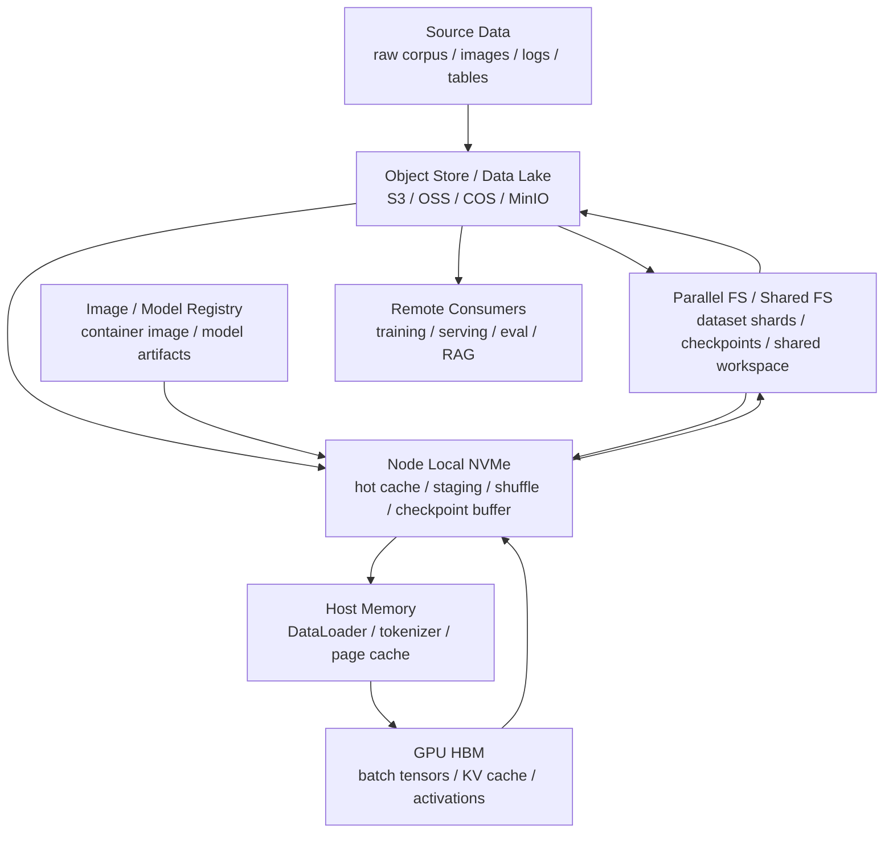

# 存储、数据缓存与 Checkpoint：NVMe、并行文件系统与对象存储

AI 集群里的存储不是“找个盘放文件”。训练数据、模型权重、checkpoint、容器镜像、日志、embedding、RAG 索引和推理缓存都有不同的访问模式、容量需求、延迟要求和一致性要求。

存储设计要回答的问题是：

> 哪些数据应该放在对象存储，哪些放在共享文件系统，哪些放在本地 NVMe，哪些必须进入 GPU HBM？数据什么时候预取、缓存、校验、清理和恢复？

如果存储设计不好，GPU 会等数据，训练会等 checkpoint，推理扩容会等模型加载，RAG 会等索引读取，集群会在高峰期被小文件和元数据请求拖慢。

## 一张总图



这张图表达几个关键点：

- 对象存储适合大容量、低成本、版本化和长期保存。
- 共享/并行文件系统适合多节点共同访问和 checkpoint。
- 本地 NVMe 适合热数据、临时数据和高速 staging。
- Host memory 和 page cache 是 CPU 侧过渡层。
- GPU HBM 只适合最热的数据和当前计算状态。
- 数据路径应该有生命周期，而不是所有东西都永久堆在一个目录里。

## AI 集群里有哪些数据对象

先区分对象，再选存储。

| 数据对象 | 典型大小 | 访问模式 | 关键问题 |
| --- | --- | --- | --- |
| 原始数据 | TB-PB | 顺序写、多次读 | 版本、权限、成本 |
| 训练样本 shard | GB-TB | 高吞吐顺序读 | 吞吐、shuffle、metadata |
| 小文件数据集 | 大量 KB-MB 文件 | metadata 密集 | 元数据瓶颈、打包 |
| tokenizer / vocab | MB-GB | 多任务重复读 | 缓存、版本 |
| 模型权重 | GB-TB | 启动时读、部署时分发 | 拉取速度、校验、灰度 |
| checkpoint | GB-TB/次 | 周期性写、恢复读 | 原子性、吞吐、保留策略 |
| optimizer state | 模型参数数倍 | checkpoint 写入 | sharding、恢复一致性 |
| activation offload | GB-TB 临时 | step 内读写 | 延迟、带宽、生命周期 |
| KV Cache | GB-TB 热数据 | decode 高频读写 | latency、容量、淘汰 |
| embedding / vector index | GB-TB | 查询密集、批量更新 | p99、更新、分片 |
| container image | GB-十GB | 节点启动时拉取 | registry、预热、层缓存 |
| logs / traces | 持续写 | 小写入、查询 | retention、索引成本 |

不同对象混在同一个共享文件系统里，是很多 AI 集群的早期常见错误。

## 存储层次

### 对象存储

对象存储适合长期保存和大规模数据管理。

常见用途：

- raw dataset。
- processed dataset。
- model artifact。
- checkpoint archive。
- evaluation output。
- logs archive。
- RAG 文档原文。

对象存储的特点：

- 容量大。
- 成本相对低。
- 适合按 bucket/key 管理对象。
- 易于做版本、生命周期、权限和跨区域复制。
- 不提供 POSIX 文件系统语义。
- 大量小对象可能效率差。
- 高性能训练通常需要缓存或打包。

Amazon S3 官方文档说明，S3 以 bucket 和 object/key 组织数据，并对对象 PUT/DELETE 提供强读后写一致性；同时也说明单个 key 的更新是原子的，但跨 key 不提供事务式原子更新。这对 checkpoint 设计很重要：不能假设多个文件一起写就是原子事务。

### 并行文件系统 / 共享文件系统

共享文件系统适合多节点共同访问。

常见用途：

- 训练数据 shard。
- checkpoint 当前版本。
- 多节点共享 workspace。
- 评测结果。
- 用户 home / project space。

常见类型：

- Lustre。
- GPFS / IBM Spectrum Scale。
- BeeGFS。
- NFS。
- CephFS。
- 云厂商托管并行文件系统。

它们差异很大，不能只说“共享盘”。

关键指标：

- 顺序读写吞吐。
- 小文件 metadata 性能。
- 多客户端并发。
- 单目录文件数。
- stripe / block 配置。
- failure recovery。
- snapshot。
- quota。
- POSIX 语义。
- 与 GDS / RDMA / CSI 的支持程度。

并行文件系统不等于无限快。多个训练任务同时启动、同时 checkpoint、同时扫描小文件，会让 metadata server 和存储网络成为瓶颈。

### 本地 NVMe

本地 NVMe 是每台计算节点上的高速本地存储。

适合：

- dataset hot cache。
- model weight cache。
- checkpoint staging。
- shuffle buffer。
- tokenizer cache。
- temporary files。
- spill / offload。
- RAG index shard。

本地 NVMe 优点：

- 延迟低。
- 带宽高。
- 不经过共享存储网络。
- 适合反复读取热数据。

缺点：

- 节点本地，不天然共享。
- 节点故障会丢失临时数据。
- 调度迁移后 cache miss。
- 容量有限。
- 需要清理和配额。

所以本地 NVMe 应作为 cache/staging 层，而不是唯一持久层。

### Host Memory / Page Cache

Linux page cache 和 host memory 也在数据路径上。

它们影响：

- DataLoader。
- tokenizer。
- CPU preprocessing。
- mmap dataset。
- pinned memory。
- H2D copy。

如果数据集反复读取，page cache 可以提高性能；但如果多个任务互相污染 cache，或者数据大于内存，性能会抖动。

### GPU HBM

GPU HBM 是最热层。

适合：

- 当前 batch tensor。
- activation。
- parameter shard。
- KV Cache hot block。
- temporary kernel buffer。

不适合：

- 长期保存数据集。
- 大量冷 KV。
- 长期 checkpoint。
- 低频访问的模型历史版本。

推理系统里，KV Cache 是最典型的 HBM 容量压力来源。把冷 KV 分层到 host memory、local NVMe 或远端 cache 要非常谨慎，因为 Decode 每步都可能访问 KV，延迟会直接影响 TPOT。

## 数据集读取路径

训练数据常见路径：

```text
object store / parallel FS
  -> node local NVMe cache
  -> host memory / DataLoader
  -> pinned memory
  -> GPU HBM
```

每一层都可能成为瓶颈。

### 小文件问题

AI 数据集常来自图片、文本片段、JSON、日志、小样本文件。大量小文件会造成：

- metadata 请求多。
- open/close 开销大。
- directory scan 慢。
- 分布式多 worker 同时扫描时放大压力。
- object store 请求数量暴涨。

常见优化：

- 打包成 shard。
- 使用 tar / WebDataset。
- 使用 Parquet / Arrow / TFRecord / RecordIO 等格式。
- 每个 shard 足够大，减少 metadata。
- shard 内顺序读。
- 预生成 index。
- 避免每个 rank 重复扫描全目录。

目标是让训练读数据更像高吞吐顺序读，而不是大量随机小文件请求。

### Sharding 与 Shuffle

训练需要随机性，但存储喜欢顺序读。

常见折中：

- dataset 分成较大 shard。
- shard 内顺序读。
- shard 级别 shuffle。
- buffer shuffle。
- epoch 间重新排列 shard。
- 每个 rank 读取不同 shard。

错误做法是所有 rank 都从同一个共享目录随机读小文件。这会把存储和 metadata 打爆。

### DataLoader 与 CPU

DataLoader 可能成为瓶颈。

要看：

- worker 数。
- CPU core。
- NUMA。
- tokenizer 速度。
- decompression。
- image decode。
- augmentation。
- Python GIL。
- pinned memory。
- prefetch factor。
- host-to-device copy。

如果 GPU utilization 周期性掉零，可能不是 GPU 问题，而是 DataLoader、存储或 CPU preprocessing 跟不上。

## 数据缓存策略

缓存不是“复制一份数据”这么简单。要定义缓存对象、失效策略、预热方式和一致性。

### Read-through Cache

任务首次读取数据时，如果本地没有，就从远端拉取到本地 NVMe，后续复用。

优点：

- 简单。
- 不需要预先知道所有数据。

缺点：

- 第一次访问慢。
- 多任务同时 cache miss 会冲击远端。
- 需要控制本地容量和淘汰。

### Pre-staging

任务启动前，把需要的数据 shard 预先拉到本地 NVMe。

优点：

- 训练开始后更稳定。
- 可提前发现数据缺失。

缺点：

- 启动时间变长。
- 如果任务被抢占，预热成本浪费。
- 需要和调度器结合。

### Shared Cache

一组节点共享一个缓存层，例如高性能缓存文件系统或缓存服务。

优点：

- 多节点复用。
- 避免每台机器重复拉取。

缺点：

- 仍然可能成为集中瓶颈。
- 需要一致性和淘汰策略。

### Cache Key

缓存必须有清晰 key。

常见 key：

- dataset version。
- shard id。
- preprocessing version。
- tokenizer version。
- model artifact digest。
- quantization config。

如果 cache key 不包含数据版本和处理逻辑版本，就可能出现“读到了旧数据但没人发现”的问题。

## Checkpoint 是存储系统压力源

Checkpoint 不是简单保存一个文件。

训练 checkpoint 可能包括：

- model parameters。
- optimizer state。
- scheduler state。
- RNG state。
- dataloader state。
- sampler state。
- global step。
- distributed rank/shard metadata。
- AMP / grad scaler。
- tokenizer / config。
- framework / code version。

大模型训练中，optimizer state 和 sharded parameters 会让 checkpoint 非常大。多个 rank 同时写 checkpoint，会制造巨大的突发写入。

### Checkpoint 写入模式

常见模式：

| 模式 | 特点 |
| --- | --- |
| single file | 简单，但大模型不现实 |
| per-rank file | 每个 rank 写自己的 shard，恢复要依赖 metadata |
| sharded checkpoint | 参数/optimizer state 分片保存 |
| async checkpoint | 后台写入，减少阻塞 |
| local staging + remote commit | 先写本地 NVMe，再上传共享存储 |
| incremental checkpoint | 只保存变化部分，复杂度更高 |

分布式 checkpoint 的关键是：

- 写入是否原子可见。
- 最新 checkpoint 指针如何更新。
- rank 文件是否完整。
- metadata 是否和数据 shard 一致。
- 写入失败如何清理。
- 恢复时是否能发现不完整 checkpoint。

### Atomic Latest

常见做法：

```text
checkpoint-000100/
  rank-00000.pt
  rank-00001.pt
  ...
  metadata.json
  _SUCCESS

latest -> checkpoint-000100
```

原则：

- 先写新目录。
- 每个 rank 写自己的文件。
- metadata 写完后再写 `_SUCCESS`。
- 最后原子更新 latest 指针或 manifest。
- 恢复时只读取有 `_SUCCESS` 的 checkpoint。

对象存储没有跨 key 原子事务，所以更要依赖 manifest、success marker 和幂等恢复逻辑。

### Checkpoint 频率

Checkpoint 太频繁：

- step time 增加。
- 存储写入压力大。
- 网络拥塞。
- 影响其他任务。

Checkpoint 太少：

- 故障后 lost work 大。
- 抢占成本高。
- 长任务风险大。

合理频率取决于：

- job failure rate。
- checkpoint 写入时间。
- 训练成本。
- 抢占概率。
- 存储带宽。
- 恢复时间。

一个实用指标：

```text
checkpoint overhead = checkpoint_time / checkpoint_interval
```

例如每 30 分钟 checkpoint 一次，每次阻塞 3 分钟，overhead 就是 10%。这可能无法接受。

## 异步 Checkpoint

异步 checkpoint 的思路是把训练主流程和写入解耦。

典型路径：

1. 训练进程把状态快照到内存或本地 NVMe。
2. 训练继续下一步。
3. 后台线程/进程上传到共享文件系统或对象存储。
4. 上传完成后更新 manifest。

收益：

- 减少训练阻塞。
- 平滑远端存储压力。

风险：

- 占用额外内存或本地 NVMe。
- 后台写入失败要被发现。
- 训练进程退出时要处理未完成写入。
- 恢复时不能引用未完成 checkpoint。
- 多个异步 checkpoint 可能堆积。

异步 checkpoint 不是把问题消灭，而是把阻塞移动到后台，需要可靠状态机。

## 恢复与 Resharding

恢复比保存更难。

要考虑：

- 节点数是否变化。
- GPU 数是否变化。
- TP/PP/DP/EP group 是否变化。
- FSDP/ZeRO shard 是否变化。
- optimizer state 是否能重新分片。
- dataloader 是否从正确位置继续。
- RNG 是否一致。
- checkpoint 是否跨版本兼容。

如果训练从 64 GPU 恢复到 128 GPU，checkpoint 可能需要 resharding。保存时只按 rank 写文件，不记录足够 metadata，会让恢复变得困难。

建议保存：

- global topology。
- parallel config。
- shard metadata。
- tensor shape / dtype。
- model config。
- optimizer config。
- software version。
- checksum。

## 模型权重分发

推理服务扩容时，模型权重分发常成为瓶颈。

一个 100 GB 级别模型，如果 100 个 replica 同时启动，可能同时从对象存储或模型仓库拉取数 TB 数据。

常见优化：

- 节点本地模型缓存。
- 镜像和模型分离。
- 模型 artifact 用 digest 校验。
- 分层加载。
- lazy loading。
- peer-to-peer / registry mirror。
- 预热常用模型。
- 灰度发布时错峰拉取。
- 多版本保留和清理策略。

模型加载影响：

- cold start。
- autoscaling。
- rolling update。
- failure recovery。
- 多租户模型服务成本。

推理平台要把模型权重当作一等存储对象，而不是每个服务自己随便下载。

## 容器镜像存储

容器镜像也会影响 AI 集群。

问题包括：

- 镜像很大。
- 每个节点重复拉取。
- CUDA / framework 层变化导致缓存失效。
- registry 带宽不足。
- 镜像漏洞扫描和签名。
- 多团队维护重复镜像。

优化方向：

- 统一 base image。
- 分层稳定依赖。
- 节点预拉取。
- registry mirror。
- 镜像清理。
- digest pinning。
- SBOM 和签名。
- driver 和 CUDA 兼容矩阵。

镜像拉取慢会直接影响调度启动时间和推理扩容速度。

## GPUDirect Storage

GPUDirect Storage (GDS) 让 storage 和 GPU memory 之间有直接 DMA 数据路径，避免经过 CPU bounce buffer。NVIDIA GDS 文档说明，这可以减少 CPU 负载、降低延迟，并缓解系统带宽瓶颈。

GDS 适合：

- GPU 直接消费大块数据。
- 数据处理 pipeline 已经迁移到 GPU。
- 大吞吐顺序 IO。
- local NVMe 或支持 GDS 的分布式文件系统。

但 GDS 不是自动加速所有场景。

需要关注：

- 文件系统是否支持。
- 是否使用 `O_DIRECT` 或满足对齐条件。
- GPU 与 NVMe/NIC 的 PCIe 拓扑。
- IO size 是否足够。
- 是否有 fallback 到 CPU 路径。
- 应用是否使用 cuFile。
- 是否有足够并发 saturate 链路。

GDS 的价值在于减少 CPU 中转和提高直接路径效率，但它仍然需要应用、文件系统、驱动、拓扑和 benchmark 配合。

## Kubernetes 存储抽象

Kubernetes 用 PV/PVC/StorageClass 抽象持久存储。

官方文档把 PersistentVolume 描述为集群中的一块存储资源，可以由管理员静态创建，也可以通过 StorageClass 动态创建；PersistentVolumeClaim 是用户对存储的请求。这个抽象让用户不必直接知道底层 NFS、iSCSI 或云存储细节。

对 AI 来说，Kubernetes 存储要关注：

- access mode。
- volume mode。
- StorageClass。
- CSI driver。
- dynamic provisioning。
- node affinity。
- reclaim policy。
- snapshot / clone。
- performance class。
- quota。

AI workload 常见问题：

- PVC 创建了，但性能不适合训练。
- 多 pod 共享 RWX volume，metadata 压力大。
- checkpoint volume 与 dataset volume 混用。
- pod 被调度到远离存储的节点。
- local PV 生命周期不清晰。
- storage class 名字隐藏了真实性能差异。

所以 AI 平台应该定义清晰的存储类别，例如：

- `dataset-readonly`。
- `checkpoint-fast`。
- `local-nvme-cache`。
- `model-artifact-cache`。
- `logs-archive`。

不要让用户只看到一个泛泛的 `standard` storage class。

## 存储可观测性

需要采集：

### 数据集读取

- read throughput。
- open/close rate。
- metadata ops。
- cache hit rate。
- DataLoader wait time。
- H2D copy time。
- GPU idle due to input。

### Checkpoint

- checkpoint duration。
- checkpoint size。
- write bandwidth。
- async backlog。
- failed checkpoint count。
- restore time。
- latest pointer update。
- cleanup status。

### 存储系统

- filesystem metadata latency。
- object store request rate。
- object store error / throttle。
- storage network utilization。
- NVMe utilization。
- disk full。
- inode usage。
- quota usage。

### 推理模型加载

- model download time。
- local cache hit rate。
- model load time。
- cold start latency。
- artifact checksum failure。

没有这些指标，用户看到的是“GPU 利用率低”或“任务启动慢”，平台无法判断到底是存储、网络、CPU 还是代码问题。

## Benchmark 方法

存储 benchmark 要贴近 workload。

### Microbenchmark

测：

- 顺序读写带宽。
- 随机读写。
- metadata ops。
- 小文件 open/close。
- object GET/PUT。
- local NVMe bandwidth。
- network filesystem bandwidth。
- GDS direct read/write。

### Dataset Benchmark

测真实数据集：

- shard 数量。
- shard 大小。
- worker 数。
- 每 rank 读取速率。
- shuffle 策略。
- decode / tokenizer 成本。
- cache warm / cold 差异。

### Checkpoint Benchmark

测：

- 单次 checkpoint size。
- 保存时间。
- 恢复时间。
- async checkpoint backlog。
- 多 job 同时 checkpoint。
- checkpoint 失败恢复。
- latest manifest 正确性。

### End-to-End Benchmark

最终看：

- training step time。
- GPU idle time。
- checkpoint overhead。
- restore time objective。
- 推理 cold start。
- model rollout 时间。
- p99 受存储影响程度。

只测 `fio` 不够。`fio` 能测存储设备，但不能代表 DataLoader、tokenizer、shuffle、checkpoint metadata 和多租户干扰。

## 常见优化方向

### 把小文件打包成 Shard

减少 metadata 压力，让读取变成顺序流。

### 本地 NVMe 热缓存

把高频读取的 dataset shard、模型权重、tokenizer 和临时结果放到本地缓存。

### Checkpoint Staging

先写本地 NVMe，再异步上传远端，减少训练主流程阻塞。

### 错峰 Checkpoint

避免多个大训练任务同时 checkpoint。调度系统可以参与 checkpoint window 管理。

### 分离训练、推理、日志和归档存储

不同流量不要全部打到同一个文件系统。

### Manifest 与 Checksum

模型、数据集、checkpoint 都应有 manifest、版本、checksum，避免读到半写入或错误版本。

### 预热模型与数据

对高频模型和数据集做预拉取，降低 cold start 和首 epoch 抖动。

## 常见误区

### 误区一：共享文件系统能解决所有问题

共享文件系统方便，但大量小文件、并发 checkpoint 和多租户扫描会造成 metadata 和吞吐瓶颈。

### 误区二：对象存储可以当 POSIX 文件系统用

对象存储是 bucket/key/object 模型，不是本地文件系统。路径 rename、目录语义、多文件原子更新都不能简单假设。

### 误区三：本地 NVMe 是持久存储

本地 NVMe 适合 cache 和 staging。节点故障或任务迁移后，数据可能不可用，必须有远端持久层。

### 误区四：Checkpoint 越频繁越安全

Checkpoint 太频繁会拖慢训练并冲击存储。要平衡 lost work 和 checkpoint overhead。

### 误区五：异步 checkpoint 没有代价

异步写入需要内存/NVMe、后台状态机、失败检测和恢复逻辑。否则会生成不可用 checkpoint。

### 误区六：只看存储带宽

AI 存储还要看 metadata、cache hit、DataLoader wait、checkpoint overhead、恢复时间、cold start 和多租户干扰。

## 设计检查清单

设计 AI 存储系统时，可以检查：

- 原始数据、训练 shard、checkpoint、模型权重、镜像、日志是否分层。
- 小文件是否打包。
- dataset version 和 preprocessing version 是否明确。
- 本地 NVMe cache 是否有容量、淘汰和清理策略。
- checkpoint 是否有 `_SUCCESS` 或 manifest。
- latest 指针是否原子或幂等。
- 恢复是否能识别不完整 checkpoint。
- 是否支持 sharded checkpoint 和 resharding。
- checkpoint 频率是否基于 lost work 和 overhead 计算。
- 多 job 同时 checkpoint 是否压测过。
- 模型权重是否有 digest、缓存和预热。
- 镜像是否有 base image 策略和 registry mirror。
- Kubernetes StorageClass 是否表达真实性能类别。
- 对象存储是否考虑一致性、权限、版本和生命周期。
- 是否采集 DataLoader wait、checkpoint duration、cache hit、restore time。

## 小结

AI 存储设计的核心不是“盘够不够大”，而是：

```text
数据对象
  -> 生命周期
  -> 访问模式
  -> 一致性要求
  -> 性能要求
  -> 放置层次
  -> 缓存策略
  -> 恢复策略
```

好的存储系统会让 GPU 少等数据、训练少等 checkpoint、推理少等模型加载，并在故障后快速恢复。差的存储系统会把所有瓶颈伪装成“GPU 利用率低”。

第 7 章后续的环境可复现、混合集群和成本治理，都需要建立在清晰的数据生命周期和存储分层之上。

## 延伸阅读

- [Kubernetes Persistent Volumes](https://kubernetes.io/docs/concepts/storage/persistent-volumes/)
- [NVIDIA GPUDirect Storage Overview Guide](https://docs.nvidia.com/gpudirect-storage/overview-guide/index.html)
- [PyTorch Distributed Checkpoint](https://docs.pytorch.org/docs/stable/distributed.checkpoint.html)
- [Amazon S3 User Guide](https://docs.aws.amazon.com/AmazonS3/latest/userguide/Welcome.html)
- [Amazon S3 Performance Guidelines](https://docs.aws.amazon.com/AmazonS3/latest/userguide/optimizing-performance.html)
