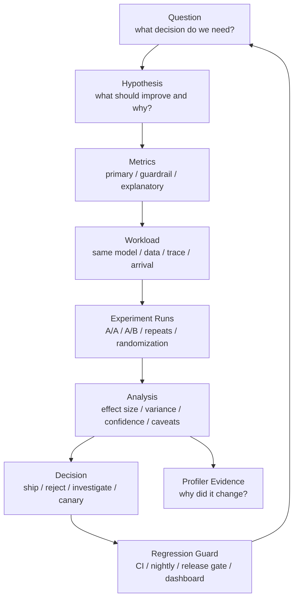

# A/B 对比、消融实验与性能回归检测

AI 系统优化经常会出现这样的结论：

- “新 kernel 快了 20%。”
- “这个调度策略 p99 更好。”
- “量化后吞吐提升了。”
- “升级框架后没有性能回退。”
- “这个参数让训练效率更高。”
- “新版本可以上线。”

这些结论如果没有严谨的 A/B 对比、消融实验和回归检测，很容易误判。

常见问题包括：

- A 和 B 的 workload 不一样。
- 只跑一次就下结论。
- 只看均值，不看 p95/p99 和错误率。
- 只看吞吐，不看质量、显存、能耗和稳定性。
- 环境变了却归因到代码。
- 随机波动被当成优化收益。
- benchmark client 成为瓶颈。
- 回归检测阈值太松，性能慢慢变差。
- 阈值太紧，CI 天天误报。
- 只在离线 benchmark 里通过，线上 traffic 一来就暴露问题。

本篇重点回答：

> 如何设计 AI 系统里的 A/B 性能对比、消融实验和性能回归检测，让“更快、更省、更稳”的结论可复现、可解释、可进入工程流程？

## 一张总图



这张图强调一个闭环：

```text
提出假设
  -> 设计可复现对比
  -> 用主指标和保护指标判断
  -> 用 profiler 解释原因
  -> 把结论固化成回归检测
```

如果只做了 benchmark，没有形成回归检测，同样的问题还会回来。

## 先区分四类实验

### A/B 对比

A/B 对比回答：

```text
方案 B 是否比方案 A 更好？
```

例如：

- vLLM 版本 A vs 版本 B。
- 原始 attention kernel vs 新 Triton kernel。
- BF16 vs FP8。
- 默认 scheduler vs 新 scheduler。
- 旧 batch policy vs 新 batch policy。

A/B 对比必须保证：

- 同一 workload。
- 同一硬件或等价硬件。
- 同一环境。
- 同一 warmup。
- 同一测量窗口。
- 同一指标口径。

否则差异可能来自别的变量。

### A/A 测试

A/A 测试是把同一个方案当作 A 和 A 再测一遍。

它回答：

```text
在没有真实改动时，benchmark 自身会波动多少？
```

A/A 很重要，因为它给出 noise floor。

如果 A/A 自然波动就是 3%，那么一个 2% 的 A/B 提升很可能不可靠。

AI benchmark 常见噪声来源：

- GPU 频率波动。
- 温度和功耗状态。
- 其他进程干扰。
- 网络拥塞。
- 存储 cache 状态。
- 输入分布随机性。
- token 输出长度随机性。
- 调度和排队抖动。
- client 侧资源限制。

没有 A/A，就很难知道 A/B 的提升是否显著。

### 消融实验

消融实验回答：

```text
某个模块、策略或优化到底贡献了多少？
```

例如：

- 关闭 prefix cache。
- 关闭 speculative decoding。
- 关闭 CUDA Graph。
- 关闭 fused kernel。
- 去掉 quantization。
- 固定 batch size。
- 关闭 communication overlap。
- 不使用 activation checkpointing。

消融实验不是为了找到最快配置，而是为了理解因果贡献。

### 回归检测

回归检测回答：

```text
新提交、新镜像、新驱动、新模型或新配置是否让性能变差？
```

它应该进入：

- pull request。
- nightly benchmark。
- release gate。
- canary。
- production dashboard。

回归检测的价值是持续防线，而不是一次性报告。

## 指标分层

一次 A/B 实验不要只看一个指标。

建议分成三层。

### Primary Metric

Primary metric 是本次实验真正要优化的目标。

推理例子：

- goodput at SLA。
- output tokens/s under p99 target。
- p99 TTFT。
- p99 TPOT。
- cost per 1M output tokens。

训练例子：

- tokens/s。
- step time。
- MFU。
- time to target loss。
- energy to target quality。

Primary metric 只能少数几个。太多主指标会让决策混乱。

### Guardrail Metrics

Guardrail metrics 是不能变坏的保护指标。

推理 guardrail：

- p99 latency。
- error rate。
- timeout rate。
- output quality。
- memory usage。
- GPU OOM。
- energy/token。

训练 guardrail：

- loss curve。
- convergence。
- numerical stability。
- gradient overflow。
- checkpoint success。
- failure rate。
- memory headroom。

例如一个优化让 throughput 提升 20%，但 p99 翻倍，在线推理可能不能接受。

### Explanatory Metrics

Explanatory metrics 用来解释原因。

例如：

- SM utilization。
- HBM bandwidth。
- Tensor Core utilization。
- KV Cache hit rate。
- queue length。
- batch size。
- active sequences。
- NCCL time。
- kernel time。
- CPU tokenization time。
- power draw。

这些指标不是最终目标，但能帮助定位为什么 A/B 有差异。

Google SRE 的监控实践强调 latency、traffic、errors、saturation 这类核心信号。AI 系统可以把它扩展成：latency、tokens throughput、errors/timeout、resource saturation、quality 和 cost/energy。

## 实验假设要写清楚

一个好的实验假设应该包含：

```text
change:
  what exactly changes

expected effect:
  which metric should improve

mechanism:
  why it should improve

guardrails:
  what must not regress

scope:
  which workload this applies to
```

例如：

```text
change:
  enable prefix cache for repeated system prompts

expected effect:
  p99 TTFT improves for repeated-prefix traffic

mechanism:
  prefill work is skipped for cached prefix tokens

guardrails:
  memory usage and cache eviction must not worsen p99 TPOT

scope:
  only traffic with repeated prefix; not expected to help random prompts
```

没有机制假设的 A/B，很容易变成“数字变了但不知道为什么”。

## 控制变量

A/B 对比要尽量一次只改一个变量。

需要固定：

- model weights。
- tokenizer。
- chat template。
- input/output length distribution。
- request arrival process。
- sampling parameters。
- cache state。
- batch policy。
- hardware。
- driver / CUDA / framework / engine。
- container image。
- power limit。
- warmup。
- measurement window。

如果一次改了多个变量，就要承认这是 bundle comparison，而不是单一因素归因。

例如：

```text
A: old engine + old CUDA + old model template
B: new engine + new CUDA + new model template
```

这个对比可以回答“新 bundle 是否更好”，但不能回答“新 engine 是否更好”。

## Paired Runs 与随机化

AI benchmark 容易受环境波动影响。一个实用办法是 paired runs。

不要这样：

```text
AAAAA BBBBB
```

更好：

```text
ABBA BAAB ABAB
```

这样可以降低时间漂移、温度变化、网络状态变化对结果的影响。

还可以：

- 随机化运行顺序。
- 在同一节点上交替跑。
- 对多个节点做配对。
- 每轮前重置 cache 或明确保留 cache。
- 记录每轮环境状态。

如果 B 总是在 A 后面跑，B 可能享受更热的 cache，也可能遭遇更高温度。顺序本身会成为变量。

## 样本量、方差和实际意义

性能实验不是只看“B 比 A 快了 3%”。

还要看：

- 重复次数够不够。
- 方差有多大。
- 置信区间是否重叠。
- 是否稳定复现。
- 这个提升是否有业务意义。

### Effect Size

Effect size 是实际差异大小。

例如：

```text
tokens/s: +8%
p99 TTFT: -12%
energy/token: -6%
```

要区分：

- 统计上可能显著。
- 工程上值得采用。

如果某个优化提升 1%，但引入复杂依赖、维护成本和稳定风险，未必值得。

### Noise Floor

Noise floor 来自 A/A。

例如：

```text
A/A p50 tokens/s variance: +/- 1%
A/A p99 latency variance: +/- 5%
```

则 A/B 判断可以更谨慎：

- tokens/s 提升 5% 可能可信。
- p99 改善 2% 可能只是噪声。

### Practical Threshold

工程门禁通常需要 practical threshold。

例如：

```text
ship if:
  goodput improves >= 5%
  and p99 latency does not regress > 2%
  and error rate does not increase
  and memory peak stays below limit
```

阈值应该来自历史噪声、SLA 和业务价值，而不是随手定。

## 消融实验怎么做

消融实验的目标是解释贡献。

一个推理系统可能有这些优化：

```text
continuous batching
prefix cache
PagedAttention
CUDA Graph
quantized weights
speculative decoding
custom sampling kernel
```

如果只测全部打开和全部关闭，只知道组合效果，不知道每项贡献。

可以做：

```text
baseline
baseline + batching
baseline + batching + prefix cache
baseline + batching + prefix cache + CUDA Graph
...
```

也可以做 leave-one-out：

```text
full system
full system - prefix cache
full system - CUDA Graph
full system - speculative decoding
```

要注意交互效应。

例如：

- quantization 可能降低 memory bandwidth，但 dequant kernel 是否融合会影响收益。
- speculative decoding 的收益依赖 draft 模型质量和接受率。
- prefix cache 的收益依赖请求分布。
- batching 的收益可能和 p99 guardrail 冲突。

单项贡献不能简单相加。

## AI 系统常见 A/B 场景

### Kernel / Compiler

对比：

- 原 kernel vs 新 kernel。
- eager vs torch.compile。
- cuBLAS/cuDNN vs Triton。
- Inductor 配置 A vs B。

指标：

- kernel time。
- operator time。
- end-to-end latency。
- Tensor Core utilization。
- HBM bandwidth。
- memory peak。

注意：

- shape 分布要真实。
- compile time 和 warmup 要分开。
- fallback 路径要检测。
- 单 kernel 提升要换算成端到端收益。

### Serving Engine

对比：

- vLLM 版本。
- TensorRT-LLM 配置。
- SGLang 配置。
- batch policy。
- KV Cache policy。

指标：

- TTFT。
- TPOT。
- goodput at SLA。
- output tokens/s。
- p99。
- timeout/reject。
- KV Cache hit/eviction。
- memory usage。

注意：

- 固定 trace replay。
- 记录 request mix。
- 不只看 peak throughput。
- p99 和 errors 是 guardrail。

### Quantization

对比：

- BF16 vs FP8。
- FP16 vs INT8。
- INT8 vs INT4。
- KV Cache quantization on/off。

指标：

- tokens/s。
- latency。
- memory footprint。
- HBM bandwidth。
- power/energy。
- quality。

注意：

- 质量是 guardrail。
- dequant 开销要用 profiler 验证。
- 不同请求长度可能收益不同。

### Training Parallelism

对比：

- DP/TP/PP/EP 组合。
- FSDP vs ZeRO。
- activation checkpointing。
- communication overlap。
- FLUX 或 fusion 配置。

指标：

- step time。
- tokens/s。
- MFU。
- scaling efficiency。
- communication time。
- memory peak。
- loss curve。

注意：

- 不能只看前几个 step。
- checkpoint/eval 要单独记录。
- 多轮运行要看 slowest rank。
- loss 和稳定性是 guardrail。

## 性能回归检测分层

不是所有 benchmark 都适合放进 PR CI。

建议分层。

### PR Smoke Benchmark

目标：快速发现明显回退。

特点：

- 小模型。
- 少量 shape。
- 短时间。
- 只覆盖关键路径。
- 阈值相对宽。

适合检查：

- 是否能运行。
- latency 是否大幅退化。
- memory 是否爆炸。
- kernel fallback 是否出现。

### Nightly Benchmark

目标：发现中等回退。

特点：

- 更多模型。
- 更多 shape。
- 多个 batch/concurrency。
- 更长测量窗口。
- 保存历史趋势。

适合检查：

- tokens/s 趋势。
- p95/p99。
- memory peak。
- energy。
- compiler/runtime 回退。

### Release Gate

目标：上线前确认关键 workload。

特点：

- 接近生产配置。
- trace replay。
- 多节点。
- 稳态窗口。
- SLA guardrail。
- profiler 采样。

适合检查：

- goodput at SLA。
- p99。
- timeout。
- capacity。
- power/thermal。
- stability。

### Production Canary

目标：真实流量下小范围验证。

特点：

- 少量流量。
- 可快速回滚。
- 监控核心指标。
- 对比控制组。

适合检查：

- 真实 cache。
- 真实 tenant mix。
- 真实突发。
- 用户可见问题。

离线 benchmark 通过，不代表 canary 可以省略。

## 回归阈值怎么设

阈值太松，回退漏掉。

阈值太紧，噪声太多。

常见策略：

### 相对阈值

例如：

```text
tokens/s must not regress > 3%
```

适合吞吐类指标。

### 绝对阈值

例如：

```text
p99 TTFT must stay below 500 ms
```

适合 SLA。

### 混合阈值

例如：

```text
p99 must not regress > 5%
and must stay below 500 ms
```

适合线上服务。

### 连续失败阈值

为了降低噪声，可以要求连续 N 次失败才阻塞。

但对严重回归，例如 OOM、crash、error rate 激增，应立即阻塞。

### 分级响应

可以分成：

- warning：轻微回退，记录趋势。
- block：超过阈值，阻止合并或发布。
- page：线上用户可见问题。

不要让所有性能波动都变成同一种告警。

## Baseline 管理

回归检测需要 baseline。

baseline 可以是：

- main branch 最新通过结果。
- 最近 N 次运行中位数。
- 固定 release 版本。
- 同硬件同环境的 golden result。

baseline 管理要注意：

- 不要让坏结果自动成为新 baseline。
- baseline 更新要有审核。
- 硬件或环境变化要重建 baseline。
- 不同 GPU 型号要分开。
- 不同 driver/runtime 要分开。
- 不同 workload 要分开。

如果 baseline 混乱，回归检测会失去可信度。

## 从回归到定位

检测到回归后，不要只看红灯。

需要自动保存：

- commit。
- image digest。
- model/dataset digest。
- benchmark command。
- workload spec。
- raw metrics。
- system metrics。
- profiler trace。
- logs。
- hardware/node id。

定位流程：

1. 确认是否可复现。
2. 跑 A/A 排除噪声。
3. 对比上一好版本。
4. 缩小 commit 范围。
5. 对关键阶段做 profiler。
6. 找到主指标和解释指标的对应关系。
7. 修复后加入回归 guard。

如果回归只在某个 workload 出现，要把该 workload 加入 benchmark 集合。

## Canary 与 Shadow

线上服务不能只靠离线 benchmark。

### Canary

Canary 是把少量真实流量导向新版本。

需要比较：

- latency。
- errors。
- saturation。
- goodput。
- quality。
- cost/energy。
- user-visible issues。

Canary 必须能快速回滚。

### Shadow Traffic

Shadow 是把真实请求复制给新系统，但不把结果返回用户。

优点：

- 不影响用户。
- 能观察真实输入分布。
- 适合验证服务能否承载。

限制：

- 输出不会影响用户后续行为。
- streaming、tool call、state mutation 可能难以复制。
- 不能完全代表真实闭环。

### Dark Launch

Dark launch 可以提前加载模型、跑后台请求、验证资源和稳定性，但不对用户可见。

它适合检查：

- 模型加载。
- warmup。
- memory。
- power/thermal。
- background stability。

## 报告模板

A/B 或回归检测报告可以按下面写。

```text
Question:
  what decision this experiment supports

Change:
  exact diff between A and B

Hypothesis:
  expected metric change and mechanism

Workload:
  model / trace / token distribution / QPS / batch / cache

Environment:
  hardware / image / driver / runtime / node / power state

Metrics:
  primary
  guardrails
  explanatory

Run Plan:
  warmup / repeats / order / random seed / measurement window

Result:
  A summary
  B summary
  effect size
  variance / confidence

Profiler Evidence:
  if applicable, why changed

Decision:
  ship / reject / canary / investigate

Regression Guard:
  benchmark added
  threshold
  owner
```

## 常见误区

### 误区一：B 比 A 快一点就该上线

不一定。

要看：

- 是否超过 noise floor。
- guardrail 是否变坏。
- 实际收益是否值得复杂度。
- 是否只对某个窄 workload 有效。
- 是否能在线上 canary 复现。

### 误区二：只要 p50 好，用户就会感知更快

不一定。

在线服务经常由 p95/p99 决定体验。Google SRE 对 tail latency 的讨论也强调，均值会掩盖尾部问题。

AI 推理还要区分：

- TTFT。
- TPOT。
- E2E。
- timeout。
- streaming interruption。

### 误区三：一次 benchmark 失败就是回归

不一定。

可能是噪声、节点问题、client 问题、环境变化。

正确做法是保留原始证据，必要时自动重跑或用 A/A 验证。

但 crash、OOM、错误率明显上升这类硬失败，可以直接阻塞。

### 误区四：消融实验可以证明所有因果

不一定。

消融只能说明在当前 workload、当前系统和当前组合下的贡献。多个优化之间可能有强交互。

### 误区五：回归检测只需要一个总分

不够。

AI 系统的性能不是单维度。至少要同时看：

- latency。
- throughput。
- errors。
- memory。
- saturation。
- quality。
- cost/energy。

一个总分会掩盖关键风险。

## 检查清单

设计 A/B 前：

- 是否写清假设？
- 是否明确主指标和保护指标？
- 是否有 A/A 噪声基线？
- 是否只改变一个变量？
- 是否 workload 代表目标场景？

运行实验时：

- 是否固定环境？
- 是否随机化或交替运行顺序？
- 是否重复足够次数？
- 是否保存原始结果？
- 是否记录失败、超时和取消？

分析结果时：

- 是否看 effect size 和方差？
- 是否看 p95/p99？
- 是否解释机制？
- 是否检查质量、显存、能耗和错误率？
- 是否说明适用范围？

接入回归检测时：

- 是否有稳定 baseline？
- 阈值是否基于历史噪声和 SLA？
- 是否区分 warning/block/page？
- 是否保存足够定位证据？
- 是否有 owner 处理回归？

## 小结

A/B 对比、消融实验和回归检测，是把一次性优化变成长期工程能力的关键。

一条可靠路径是：

```text
先用 A/A 理解噪声
  -> 再用 A/B 判断真实收益
  -> 用消融理解贡献
  -> 用 profiler 解释原因
  -> 用 canary 验证真实流量
  -> 用回归检测防止问题回来
```

对 AI 系统来说，“性能提升”必须同时满足：

- 主指标变好。
- 保护指标不坏。
- 差异超过噪声。
- 机制可解释。
- workload 有代表性。
- 可以被自动化回归检测守住。

只有这样，benchmark 才不是一次跑分，而是研发体系的一部分。

## 参考资料

- [Google SRE Book: Monitoring Distributed Systems](https://sre.google/sre-book/monitoring-distributed-systems/)
- [Airspeed Velocity Documentation](https://asv.readthedocs.io/en/stable/)
- [pytest-benchmark Documentation](https://pytest-benchmark.readthedocs.io/en/latest/)
- [Criterion.rs Documentation](https://bheisler.github.io/criterion.rs/book/)
