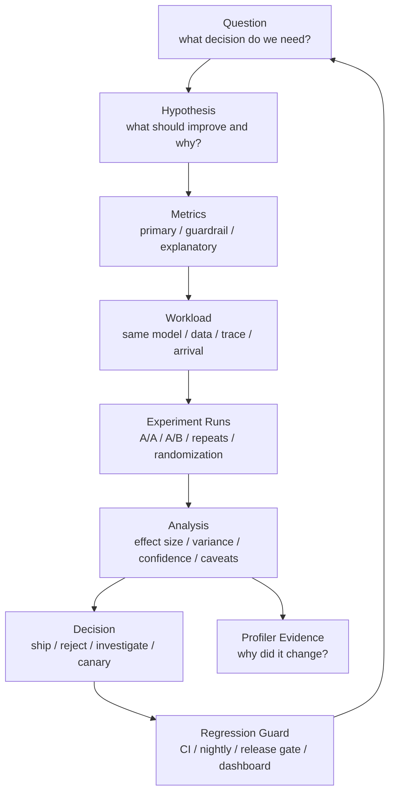

# A/B 对比、消融实验与性能回归检测

AI 系统优化经常会出现这样的结论：

- “新 kernel 快了 20%。”
- “这个调度策略 p99 更好。”
- “量化后吞吐提升了。”
- “升级框架后没有性能回退。”
- “这个参数让训练效率更高。”
- “新版本可以上线。”

这些结论如果没有严谨的 A/B 对比、消融实验和回归检测，很容易误判。

常见问题包括：

- A 和 B 的 workload 不一样。
- 只跑一次就下结论。
- 只看均值，不看 p95/p99 和错误率。
- 只看吞吐，不看质量、显存、能耗和稳定性。
- 环境变了却归因到代码。
- 随机波动被当成优化收益。
- benchmark client 成为瓶颈。
- 回归检测阈值太松，性能慢慢变差。
- 阈值太紧，CI 天天误报。
- 只在离线 benchmark 里通过，线上 traffic 一来就暴露问题。

本篇重点回答：

> 如何设计 AI 系统里的 A/B 性能对比、消融实验和性能回归检测，让“更快、更省、更稳”的结论可复现、可解释、可进入工程流程？

先给出一个判断原则：

```text
性能对比不是看 B 的数字是否更好，
而是证明这个差异来自目标改动，
并且足够大、足够稳定、没有破坏保护指标。
```

很多性能“提升”并不是假数据，而是证据不完整：workload 变了、节点变了、cache 状态变了、随机输出长度变了，或者只看了最有利的一次 run。A/B 方法论的目标是把这些干扰显式控制住。

## Experiment Contract

每次 A/B、消融或回归实验前，先写一个 Experiment Contract。

```yaml
question:
  decision: ship | reject | canary | rollback | investigate
  scope: kernel | model | serving | training | cluster

change:
  A: baseline description
  B: candidate description
  diff: exact variable changed

hypothesis:
  expected_primary_effect: ...
  mechanism: ...
  expected_affected_workloads: ...
  expected_unaffected_workloads: ...

metrics:
  primary: ...
  guardrails: ...
  explanatory: ...

workload:
  source: synthetic | sampled | trace_replay | production_canary
  distribution: ...
  arrival_process: ...
  cache_state: ...

run_plan:
  aa_runs: ...
  ab_runs: ...
  paired_order: ...
  repetitions: ...
  warmup: ...
  measurement_window: ...
  random_seed: ...

decision_rule:
  ship_if: ...
  block_if: ...
  rerun_if: ...

artifacts:
  raw_metrics: ...
  system_metrics: ...
  profiler_trace: ...
  run_manifest: ...
```

这个 contract 的作用是让实验在运行前就定义清楚“什么算赢、什么算输、什么算证据不足”。不要等看到结果后再改主指标、挑 workload 或调整阈值。

一个可靠的实验至少要能回答：

- B 只改了什么。
- 预期为什么会变好。
- 哪个指标是主目标。
- 哪些指标不能变坏。
- workload 是否代表目标场景。
- A/A 噪声有多大。
- 如果结果矛盾，如何处理。
- 如果通过，回归检测怎么守住。

## 一张总图



这张图强调一个闭环：

```text
提出假设
  -> 设计可复现对比
  -> 用主指标和保护指标判断
  -> 用 profiler 解释原因
  -> 把结论固化成回归检测
```

如果只做了 benchmark，没有形成回归检测，同样的问题还会回来。

## 先区分四类实验

### A/B 对比

A/B 对比回答：

```text
方案 B 是否比方案 A 更好？
```

例如：

- vLLM 版本 A vs 版本 B。
- 原始 attention kernel vs 新 Triton kernel。
- BF16 vs FP8。
- 默认 scheduler vs 新 scheduler。
- 旧 batch policy vs 新 batch policy。

A/B 对比必须保证：

- 同一 workload。
- 同一硬件或等价硬件。
- 同一环境。
- 同一 warmup。
- 同一测量窗口。
- 同一指标口径。

否则差异可能来自别的变量。

一个好的 A/B 对比不是“两个命令各跑一次”，而是：

```text
same workload
same measurement boundary
same run protocol
same artifact collection
predefined decision rule
```

如果 B 需要新的 workload 才能体现收益，也可以做，但要把结论限定为该 workload。不要把“在 long context trace 上有效”外推成“整体服务更快”。

### A/A 测试

A/A 测试是把同一个方案当作 A 和 A 再测一遍。

它回答：

```text
在没有真实改动时，benchmark 自身会波动多少？
```

A/A 很重要，因为它给出 noise floor。

如果 A/A 自然波动就是 3%，那么一个 2% 的 A/B 提升很可能不可靠。

AI benchmark 常见噪声来源：

- GPU 频率波动。
- 温度和功耗状态。
- 其他进程干扰。
- 网络拥塞。
- 存储 cache 状态。
- 输入分布随机性。
- token 输出长度随机性。
- 调度和排队抖动。
- client 侧资源限制。

没有 A/A，就很难知道 A/B 的提升是否显著。

A/A 的结果应该进入实验报告：

```text
A/A goodput variance: +/- 1.5%
A/A p99 TTFT variance: +/- 6%
A/A energy/token variance: +/- 2%
```

之后所有 A/B 判断都要和这个 noise floor 对比。

如果 A/A 波动很大，优先修 benchmark，而不是继续做 A/B。因为这说明实验系统还不能稳定区分真实改动和噪声。

### 消融实验

消融实验回答：

```text
某个模块、策略或优化到底贡献了多少？
```

例如：

- 关闭 prefix cache。
- 关闭 speculative decoding。
- 关闭 CUDA Graph。
- 关闭 fused kernel。
- 去掉 quantization。
- 固定 batch size。
- 关闭 communication overlap。
- 不使用 activation checkpointing。

消融实验不是为了找到最快配置，而是为了理解因果贡献。

消融实验常见有两种：

```text
additive ablation:
  baseline
  baseline + feature_1
  baseline + feature_1 + feature_2

subtractive ablation:
  full_system
  full_system - feature_1
  full_system - feature_2
```

前者适合理解增量收益，后者适合解释一个复杂系统里某个功能是否真正有贡献。

### 回归检测

回归检测回答：

```text
新提交、新镜像、新驱动、新模型或新配置是否让性能变差？
```

它应该进入：

- pull request。
- nightly benchmark。
- release gate。
- canary。
- production dashboard。

回归检测的价值是持续防线，而不是一次性报告。

回归检测要特别关注“慢性退化”：

- 每次提交只慢 1%，单次不明显，但几周后慢很多。
- p99 没有超过绝对阈值，但趋势持续变差。
- 显存余量逐渐变小，直到某个 workload OOM。
- 编译 fallback 偶发出现，后来变成常态。

因此回归检测不仅要有阈值，还要保留历史趋势和 baseline 更新记录。

## 指标分层

一次 A/B 实验不要只看一个指标。

建议分成三层。

### Primary Metric

Primary metric 是本次实验真正要优化的目标。

推理例子：

- goodput at SLA。
- output tokens/s under p99 target。
- p99 TTFT。
- p99 TPOT。
- cost per 1M output tokens。

训练例子：

- tokens/s。
- step time。
- MFU。
- time to target loss。
- energy to target quality。

Primary metric 只能少数几个。太多主指标会让决策混乱。

Primary metric 要和决策直接相关。

例如：

| 决策 | 更合适的主指标 | 不够直接的指标 |
| --- | --- | --- |
| 线上推理是否上线 | goodput at SLA、p99 TTFT/TPOT | 平均 tokens/s |
| 是否减少副本 | 单副本 goodput 曲线 | 单请求 latency |
| 训练是否更快 | time to target、tokens/s/GPU | 前 10 step time |
| 是否采用量化 | cost/token under quality guardrail | peak throughput |
| 是否合入 kernel | 端到端 operator/model 改善 | 单 kernel 最佳值 |

### Guardrail Metrics

Guardrail metrics 是不能变坏的保护指标。

推理 guardrail：

- p99 latency。
- error rate。
- timeout rate。
- output quality。
- memory usage。
- GPU OOM。
- energy/token。

训练 guardrail：

- loss curve。
- convergence。
- numerical stability。
- gradient overflow。
- checkpoint success。
- failure rate。
- memory headroom。

例如一个优化让 throughput 提升 20%，但 p99 翻倍，在线推理可能不能接受。

Guardrail 不是“顺便看看”，而是硬约束。报告里应该写清：

```text
primary improves but guardrail fails
  => do not ship

primary neutral and guardrail improves
  => consider if risk/cost is low

primary improves and guardrails neutral
  => candidate for canary or release
```

如果 guardrail 没有提前定义，实验后很容易选择性忽略坏消息。

### Explanatory Metrics

Explanatory metrics 用来解释原因。

例如：

- SM utilization。
- HBM bandwidth。
- Tensor Core utilization。
- KV Cache hit rate。
- queue length。
- batch size。
- active sequences。
- NCCL time。
- kernel time。
- CPU tokenization time。
- power draw。

这些指标不是最终目标，但能帮助定位为什么 A/B 有差异。

Google SRE 的监控实践强调 latency、traffic、errors、saturation 这类核心信号。AI 系统可以把它扩展成：latency、tokens throughput、errors/timeout、resource saturation、quality 和 cost/energy。

Explanatory metrics 还可以帮助识别“假提升”。

例如：

| 现象 | 可能解释 |
| --- | --- |
| tokens/s 上升但 output length 变短 | workload 不一致 |
| p99 下降但 reject 增加 | 系统通过丢请求降低延迟 |
| GPU 利用率下降且 latency 下降 | 可能是请求量不足 |
| kernel time 下降但端到端不变 | 瓶颈在 CPU、调度或网络 |
| throughput 上升但质量下降 | 量化或采样改变了输出 |

## 实验假设要写清楚

一个好的实验假设应该包含：

```text
change:
  what exactly changes

expected effect:
  which metric should improve

mechanism:
  why it should improve

guardrails:
  what must not regress

scope:
  which workload this applies to
```

例如：

```text
change:
  enable prefix cache for repeated system prompts

expected effect:
  p99 TTFT improves for repeated-prefix traffic

mechanism:
  prefill work is skipped for cached prefix tokens

guardrails:
  memory usage and cache eviction must not worsen p99 TPOT

scope:
  only traffic with repeated prefix; not expected to help random prompts
```

没有机制假设的 A/B，很容易变成“数字变了但不知道为什么”。

## 控制变量

A/B 对比要尽量一次只改一个变量。

需要固定：

- model weights。
- tokenizer。
- chat template。
- input/output length distribution。
- request arrival process。
- sampling parameters。
- cache state。
- batch policy。
- hardware。
- driver / CUDA / framework / engine。
- container image。
- power limit。
- warmup。
- measurement window。

如果一次改了多个变量，就要承认这是 bundle comparison，而不是单一因素归因。

例如：

```text
A: old engine + old CUDA + old model template
B: new engine + new CUDA + new model template
```

这个对比可以回答“新 bundle 是否更好”，但不能回答“新 engine 是否更好”。

## Paired Runs 与随机化

AI benchmark 容易受环境波动影响。一个实用办法是 paired runs。

不要这样：

```text
AAAAA BBBBB
```

更好：

```text
ABBA BAAB ABAB
```

这样可以降低时间漂移、温度变化、网络状态变化对结果的影响。

还可以：

- 随机化运行顺序。
- 在同一节点上交替跑。
- 对多个节点做配对。
- 每轮前重置 cache 或明确保留 cache。
- 记录每轮环境状态。

如果 B 总是在 A 后面跑，B 可能享受更热的 cache，也可能遭遇更高温度。顺序本身会成为变量。

### Paired Difference

Paired runs 的分析重点不是分别看 A 和 B 的平均值，而是看每一对的差值。

例如：

```text
pair_1: B - A = +4.8%
pair_2: B - A = +5.2%
pair_3: B - A = +4.5%
pair_4: B - A = +5.0%
```

这比：

```text
mean(B) - mean(A)
```

更能抵抗时间漂移、节点状态和环境温度变化。

如果 paired difference 的方向不稳定：

```text
+5%, -3%, +8%, -2%
```

说明实验还不够稳定，不能只报告平均提升。

### 分桶配对

推理服务中，还要按请求类型分桶配对：

- short chat。
- long context。
- code generation。
- RAG。
- agent。
- cache hit。
- cache miss。

如果 B 只改善 long context，但恶化 short chat，总体平均值取决于流量配比。报告必须说明收益来自哪个 bucket。

## 样本量、方差和实际意义

性能实验不是只看“B 比 A 快了 3%”。

还要看：

- 重复次数够不够。
- 方差有多大。
- 置信区间是否重叠。
- 是否稳定复现。
- 这个提升是否有业务意义。

### Effect Size

Effect size 是实际差异大小。

例如：

```text
tokens/s: +8%
p99 TTFT: -12%
energy/token: -6%
```

要区分：

- 统计上可能显著。
- 工程上值得采用。

如果某个优化提升 1%，但引入复杂依赖、维护成本和稳定风险，未必值得。

Effect size 要同时写绝对值和相对值。

例如：

```text
p99 TTFT:
  A = 820 ms
  B = 760 ms
  delta = -60 ms
  relative = -7.3%
```

只写相对值可能夸大很小的绝对差异；只写绝对值也可能忽略不同 workload 的规模。

### Noise Floor

Noise floor 来自 A/A。

例如：

```text
A/A p50 tokens/s variance: +/- 1%
A/A p99 latency variance: +/- 5%
```

则 A/B 判断可以更谨慎：

- tokens/s 提升 5% 可能可信。
- p99 改善 2% 可能只是噪声。

Noise floor 不同指标不同。

通常：

- 平均吞吐比较稳定。
- p99 延迟更容易波动。
- 多机训练 step time 受 slowest rank 影响，波动可能更大。
- 能耗受温度、功耗策略和采样边界影响。
- 质量指标可能受随机种子和评测集影响。

不要用 tokens/s 的噪声阈值去判断 p99，也不要用单机噪声阈值去判断多机训练。

### Practical Threshold

工程门禁通常需要 practical threshold。

例如：

```text
ship if:
  goodput improves >= 5%
  and p99 latency does not regress > 2%
  and error rate does not increase
  and memory peak stays below limit
```

阈值应该来自历史噪声、SLA 和业务价值，而不是随手定。

可以把判断写成三层：

```text
statistical confidence:
  差异是否明显超过实验噪声

practical significance:
  差异是否足以带来工程价值

risk acceptance:
  复杂度、稳定性、质量和维护成本是否可接受
```

性能系统里，第三层经常被忽略。一个小收益但高复杂度的优化，可能不值得进入长期维护路径。

### 结果分类

建议把 A/B 结果分为四类：

| 结果 | 处理 |
| --- | --- |
| 明确胜出 | 进入 canary 或 release gate |
| 明确失败 | reject，记录原因 |
| 指标冲突 | 扩展实验或按业务优先级决策 |
| 证据不足 | 增加样本、修 benchmark 或缩小问题 |

不要把“证据不足”误写成“无差异”。证据不足说明当前实验无法证明结论，不代表两个方案真的等价。

## 消融实验怎么做

消融实验的目标是解释贡献。

一个推理系统可能有这些优化：

```text
continuous batching
prefix cache
PagedAttention
CUDA Graph
quantized weights
speculative decoding
custom sampling kernel
```

如果只测全部打开和全部关闭，只知道组合效果，不知道每项贡献。

可以做：

```text
baseline
baseline + batching
baseline + batching + prefix cache
baseline + batching + prefix cache + CUDA Graph
...
```

也可以做 leave-one-out：

```text
full system
full system - prefix cache
full system - CUDA Graph
full system - speculative decoding
```

要注意交互效应。

例如：

- quantization 可能降低 memory bandwidth，但 dequant kernel 是否融合会影响收益。
- speculative decoding 的收益依赖 draft 模型质量和接受率。
- prefix cache 的收益依赖请求分布。
- batching 的收益可能和 p99 guardrail 冲突。

单项贡献不能简单相加。

### 消融矩阵

如果优化之间有强交互，可以用小型矩阵而不是线性链。

例如：

| Prefix Cache | CUDA Graph | Quantization | Goodput | p99 | 备注 |
| --- | --- | --- | --- | --- | --- |
| off | off | off | ... | ... | baseline |
| on | off | off | ... | ... | cache 单项 |
| off | on | off | ... | ... | graph 单项 |
| on | on | off | ... | ... | cache + graph 交互 |
| on | on | on | ... | ... | full |

矩阵不一定要覆盖所有组合。组合太多时，可以先用 profiler 和业务优先级筛选最有可能有交互的项。

### 消融要看负贡献

有些优化在某些 workload 下是负贡献：

- Prefix cache 在低复用流量下可能增加管理开销。
- Speculative decoding 在接受率低时可能浪费计算。
- Quantization 在 fallback 或 dequant 未融合时可能更慢。
- Activation checkpointing 省显存但增加训练 step time。
- Aggressive batching 提升吞吐但破坏 TTFT。

消融实验的价值就是发现这些边界条件。不要只挑它有效的 workload 报告。

## AI 系统常见 A/B 场景

### Kernel / Compiler

对比：

- 原 kernel vs 新 kernel。
- eager vs torch.compile。
- cuBLAS/cuDNN vs Triton。
- Inductor 配置 A vs B。

指标：

- kernel time。
- operator time。
- end-to-end latency。
- Tensor Core utilization。
- HBM bandwidth。
- memory peak。

注意：

- shape 分布要真实。
- compile time 和 warmup 要分开。
- fallback 路径要检测。
- 单 kernel 提升要换算成端到端收益。

Kernel/Compiler 实验特别容易出现“局部快、整体没变”的情况。

报告中建议同时写：

```text
kernel_speedup
operator_speedup
model_end_to_end_speedup
percentage_of_time_covered_by_kernel
```

如果一个 kernel 只占端到端时间的 3%，即使它快 2 倍，整体收益也有限。这个判断可以和 Roofline 与 profiler 章节衔接。

### Serving Engine

对比：

- vLLM 版本。
- TensorRT-LLM 配置。
- SGLang 配置。
- batch policy。
- KV Cache policy。

指标：

- TTFT。
- TPOT。
- goodput at SLA。
- output tokens/s。
- p99。
- timeout/reject。
- KV Cache hit/eviction。
- memory usage。

注意：

- 固定 trace replay。
- 记录 request mix。
- 不只看 peak throughput。
- p99 和 errors 是 guardrail。

Serving Engine A/B 最常见的错误是只测最高吞吐点。

更好的做法是比较整条 goodput 曲线：

```text
QPS 20 / 40 / 60 / 80 / 100
  A: goodput, p99, timeout, memory
  B: goodput, p99, timeout, memory
```

如果 B 的峰值吞吐更高，但低负载 p99 更差，或者过载时 reject 更多，要根据实际 SLA 决策。

### Quantization

对比：

- BF16 vs FP8。
- FP16 vs INT8。
- INT8 vs INT4。
- KV Cache quantization on/off。

指标：

- tokens/s。
- latency。
- memory footprint。
- HBM bandwidth。
- power/energy。
- quality。

注意：

- 质量是 guardrail。
- dequant 开销要用 profiler 验证。
- 不同请求长度可能收益不同。

量化实验要特别防止“系统指标好、模型结果坏”。

建议把质量 guardrail 写成：

```text
quality_guardrail:
  eval benchmark does not regress beyond threshold
  task-specific acceptance test passes
  output format error does not increase
  safety/refusal behavior not degraded, if relevant
```

如果量化导致输出更短、拒答更多或格式错误更多，tokens/s 可能看起来更好，但用户价值下降。

### Training Parallelism

对比：

- DP/TP/PP/EP 组合。
- FSDP vs ZeRO。
- activation checkpointing。
- communication overlap。
- FLUX 或 fusion 配置。

指标：

- step time。
- tokens/s。
- MFU。
- scaling efficiency。
- communication time。
- memory peak。
- loss curve。

注意：

- 不能只看前几个 step。
- checkpoint/eval 要单独记录。
- 多轮运行要看 slowest rank。
- loss 和稳定性是 guardrail。

训练并行 A/B 还要记录：

```text
parallel_config:
  DP / TP / PP / CP / EP / FSDP / ZeRO

global_batch:
  unchanged or changed

effective_tokens:
  same token budget and same data mix

quality:
  loss curve and eval metric
```

如果 global batch、学习率、数据顺序或 token budget 也变了，就不是纯系统并行策略对比，而是训练 recipe bundle 对比。

### RAG / Agent Workflow

RAG 和 agent 的 A/B 不应只测模型服务。

对比对象可能是：

- retrieval 参数。
- reranker。
- prompt assembly。
- context compression。
- tool routing。
- retry policy。
- cache policy。
- model serving engine。

指标要分层：

| 层级 | 指标 |
| --- | --- |
| Model-only | TTFT、TPOT、tokens/s、KV Cache |
| Retrieval/rerank | retrieval latency、recall、rerank time |
| Workflow | E2E latency、success rate、tool error |
| Quality | answer correctness、grounding、format |
| Cost | tokens/request、tool calls/request、GPU/CPU time |

如果只看 LLM tokens/s，可能错过端到端 workflow 里的真正瓶颈。

## 性能回归检测分层

不是所有 benchmark 都适合放进 PR CI。

建议分层。

### PR Smoke Benchmark

目标：快速发现明显回退。

特点：

- 小模型。
- 少量 shape。
- 短时间。
- 只覆盖关键路径。
- 阈值相对宽。

适合检查：

- 是否能运行。
- latency 是否大幅退化。
- memory 是否爆炸。
- kernel fallback 是否出现。

PR smoke benchmark 的阈值不要太追求精细。

它的目标是发现明显问题，例如：

```text
crash
OOM
latency regression > 20%
tokens/s regression > 15%
unexpected fallback
```

如果 PR benchmark 过慢或过敏，团队会倾向于绕过它。短、稳、能抓大问题更重要。

### Nightly Benchmark

目标：发现中等回退。

特点：

- 更多模型。
- 更多 shape。
- 多个 batch/concurrency。
- 更长测量窗口。
- 保存历史趋势。

适合检查：

- tokens/s 趋势。
- p95/p99。
- memory peak。
- energy。
- compiler/runtime 回退。

Nightly benchmark 要保存历史序列，而不是只保存当天结果。

建议记录：

```text
commit
date
hardware pool
driver/runtime
container digest
workload version
metric distribution
baseline used
```

这样才能区分代码回归、环境变化和硬件池变化。

### Release Gate

目标：上线前确认关键 workload。

特点：

- 接近生产配置。
- trace replay。
- 多节点。
- 稳态窗口。
- SLA guardrail。
- profiler 采样。

适合检查：

- goodput at SLA。
- p99。
- timeout。
- capacity。
- power/thermal。
- stability。

Release gate 的问题不是“能不能跑”，而是“是否可以承担上线风险”。

因此 release gate 应该包含：

- 生产代表性 trace replay。
- 关键模型和关键请求类型。
- 故障或过载场景。
- 长时间稳态窗口。
- 资源、功耗、热状态。
- 回滚条件。

如果 release gate 失败，不一定代表代码不能合并，但通常不应该进入生产发布。

### Production Canary

目标：真实流量下小范围验证。

特点：

- 少量流量。
- 可快速回滚。
- 监控核心指标。
- 对比控制组。

适合检查：

- 真实 cache。
- 真实 tenant mix。
- 真实突发。
- 用户可见问题。

离线 benchmark 通过，不代表 canary 可以省略。

Canary 要设置明确的停止条件：

```text
rollback if:
  p99 latency breaches SLA for N minutes
  error rate increases above threshold
  timeout or cancel rate increases
  quality guardrail fails
  saturation exceeds headroom
```

没有自动或半自动停止条件的 canary，容易变成“出了问题才人工发现”。

## 回归阈值怎么设

阈值太松，回退漏掉。

阈值太紧，噪声太多。

常见策略：

### 相对阈值

例如：

```text
tokens/s must not regress > 3%
```

适合吞吐类指标。

### 绝对阈值

例如：

```text
p99 TTFT must stay below 500 ms
```

适合 SLA。

### 混合阈值

例如：

```text
p99 must not regress > 5%
and must stay below 500 ms
```

适合线上服务。

### 连续失败阈值

为了降低噪声，可以要求连续 N 次失败才阻塞。

但对严重回归，例如 OOM、crash、error rate 激增，应立即阻塞。

### 分级响应

可以分成：

- warning：轻微回退，记录趋势。
- block：超过阈值，阻止合并或发布。
- page：线上用户可见问题。

不要让所有性能波动都变成同一种告警。

### Rerun Policy

性能回归检测要有重跑策略。

可以区分：

```text
hard failure:
  crash / OOM / correctness failure / error spike
  -> immediate block

soft performance regression:
  metric exceeds threshold slightly
  -> automatic rerun once or twice

trend regression:
  small degradation over multiple days
  -> warning and owner review
```

重跑不是为了“刷绿”，而是为了区分噪声和真实回归。重跑次数、触发条件和最终取值方式要固定。

## Baseline 管理

回归检测需要 baseline。

baseline 可以是：

- main branch 最新通过结果。
- 最近 N 次运行中位数。
- 固定 release 版本。
- 同硬件同环境的 golden result。

baseline 管理要注意：

- 不要让坏结果自动成为新 baseline。
- baseline 更新要有审核。
- 硬件或环境变化要重建 baseline。
- 不同 GPU 型号要分开。
- 不同 driver/runtime 要分开。
- 不同 workload 要分开。

如果 baseline 混乱，回归检测会失去可信度。

### Baseline 生命周期

Baseline 应该像代码一样有生命周期。

```text
create:
  新硬件、新 workload、新 release 时建立

validate:
  A/A 和重复运行确认稳定性

use:
  CI/nightly/release gate 对比

update:
  明确审核后接受新 baseline

retire:
  workload、硬件或软件栈不再使用
```

不要用失败 run 自动覆盖 baseline。否则系统会把回归“学成正常”。

### Baseline 分组

Baseline 至少要按以下维度分组：

- GPU 型号。
- 节点配置。
- driver / CUDA / ROCm。
- inference engine / framework。
- workload version。
- model version。
- power/clock policy。
- measurement boundary。

不同分组之间不能直接比较。比如同一个模型在不同 GPU 上的 p99 绝对值不同，不能混用一条阈值。

## 从回归到定位

检测到回归后，不要只看红灯。

需要自动保存：

- commit。
- image digest。
- model/dataset digest。
- benchmark command。
- workload spec。
- raw metrics。
- system metrics。
- profiler trace。
- logs。
- hardware/node id。

定位流程：

1. 确认是否可复现。
2. 跑 A/A 排除噪声。
3. 对比上一好版本。
4. 缩小 commit 范围。
5. 对关键阶段做 profiler。
6. 找到主指标和解释指标的对应关系。
7. 修复后加入回归 guard。

如果回归只在某个 workload 出现，要把该 workload 加入 benchmark 集合。

### 自动归因线索

回归系统可以自动给出初步归因线索：

| 现象 | 优先检查 |
| --- | --- |
| tokens/s 降低，GPU 利用率降低 | client、CPU、data path、调度 |
| TTFT 变差，TPOT 不变 | prefill、queue、prefix cache |
| TPOT 变差，TTFT 不变 | decode、KV Cache、memory bandwidth |
| memory peak 上升 | batch、KV Cache、activation、fragmentation |
| p99 变差但均值不变 | tail、slow node、queue、throttle |
| error 增加 | OOM、timeout、server crash、routing |
| energy/token 变差 | power cap、frequency、thermal、batching |

自动归因不替代 profiler，但能减少第一次排查的搜索空间。

## Canary 与 Shadow

线上服务不能只靠离线 benchmark。

### Canary

Canary 是把少量真实流量导向新版本。

需要比较：

- latency。
- errors。
- saturation。
- goodput。
- quality。
- cost/energy。
- user-visible issues。

Canary 必须能快速回滚。

### Shadow Traffic

Shadow 是把真实请求复制给新系统，但不把结果返回用户。

优点：

- 不影响用户。
- 能观察真实输入分布。
- 适合验证服务能否承载。

限制：

- 输出不会影响用户后续行为。
- streaming、tool call、state mutation 可能难以复制。
- 不能完全代表真实闭环。

### Dark Launch

Dark launch 可以提前加载模型、跑后台请求、验证资源和稳定性，但不对用户可见。

它适合检查：

- 模型加载。
- warmup。
- memory。
- power/thermal。
- background stability。

## 报告模板

A/B 或回归检测报告可以按下面写。

```text
Question:
  what decision this experiment supports

Change:
  exact diff between A and B

Hypothesis:
  expected metric change and mechanism

Workload:
  model / trace / token distribution / QPS / batch / cache

Environment:
  hardware / image / driver / runtime / node / power state

Metrics:
  primary
  guardrails
  explanatory

Run Plan:
  warmup / repeats / order / random seed / measurement window

Result:
  A summary
  B summary
  effect size
  variance / confidence

Profiler Evidence:
  if applicable, why changed

Decision:
  ship / reject / canary / investigate

Regression Guard:
  benchmark added
  threshold
  owner
```

### Decision Record

如果实验影响上线、采购、默认配置或长期维护，建议写一份简短 decision record。

```text
Decision:
  accepted / rejected / canary / needs more evidence

Reason:
  primary metric result
  guardrail result
  noise floor
  risk assessment

Scope:
  workloads where decision applies
  workloads where it does not apply

Follow-up:
  regression guard
  canary plan
  owner
  review date
```

这可以防止几个月后只剩下一句“当时测过更快”，却找不到 workload、阈值、证据和适用范围。

### 回归规则模板

回归检测规则可以像这样描述：

```yaml
benchmark: llm_serving_trace_replay
owner: inference-platform
baseline: main_branch_median_last_10_passes
workload: prod_trace_2026_06_short_long_mix
hardware_pool: h100_8gpu_pool_a

metrics:
  primary:
    goodput_at_sla:
      block_if_regression_gt: 5%
  guardrails:
    p99_ttft_ms:
      block_if_gt: 800
      warn_if_regression_gt: 5%
    timeout_rate:
      block_if_gt: 0.5%
    gpu_memory_peak:
      block_if_gt: 95%

rerun_policy:
  soft_regression_reruns: 2
  hard_failure_reruns: 0

artifacts:
  keep_raw_metrics: true
  keep_system_metrics: true
  keep_profiler_on_failure: true
```

这个模板的重点是让规则可审查：谁负责、对比哪个 baseline、在哪类硬件和 workload 下判断、失败后保存什么证据。

## 常见误区

### 误区一：B 比 A 快一点就该上线

不一定。

要看：

- 是否超过 noise floor。
- guardrail 是否变坏。
- 实际收益是否值得复杂度。
- 是否只对某个窄 workload 有效。
- 是否能在线上 canary 复现。

### 误区二：只要 p50 好，用户就会感知更快

不一定。

在线服务经常由 p95/p99 决定体验。Google SRE 对 tail latency 的讨论也强调，均值会掩盖尾部问题。

AI 推理还要区分：

- TTFT。
- TPOT。
- E2E。
- timeout。
- streaming interruption。

### 误区三：一次 benchmark 失败就是回归

不一定。

可能是噪声、节点问题、client 问题、环境变化。

正确做法是保留原始证据，必要时自动重跑或用 A/A 验证。

但 crash、OOM、错误率明显上升这类硬失败，可以直接阻塞。

### 误区四：消融实验可以证明所有因果

不一定。

消融只能说明在当前 workload、当前系统和当前组合下的贡献。多个优化之间可能有强交互。

### 误区五：回归检测只需要一个总分

不够。

AI 系统的性能不是单维度。至少要同时看：

- latency。
- throughput。
- errors。
- memory。
- saturation。
- quality。
- cost/energy。

一个总分会掩盖关键风险。

## 检查清单

设计 A/B 前：

- 是否写了 Experiment Contract？
- 是否写清假设？
- 是否明确主指标和保护指标？
- 是否有 A/A 噪声基线？
- 是否只改变一个变量？
- 是否 workload 代表目标场景？
- 是否定义了证据不足时的处理方式？

运行实验时：

- 是否固定环境？
- 是否随机化或交替运行顺序？
- 是否重复足够次数？
- 是否保存原始结果？
- 是否记录失败、超时和取消？
- 是否保存 run manifest、镜像 digest、节点 ID 和 workload 版本？

分析结果时：

- 是否看 effect size 和方差？
- 是否看 p95/p99？
- 是否解释机制？
- 是否检查质量、显存、能耗和错误率？
- 是否说明适用范围？
- 是否按 request bucket、cache hit/miss、rank/node 分组看结果？
- 是否把 primary 与 guardrail 冲突写清楚？

接入回归检测时：

- 是否有稳定 baseline？
- 阈值是否基于历史噪声和 SLA？
- 是否区分 warning/block/page？
- 是否保存足够定位证据？
- 是否有 owner 处理回归？
- 是否定义 baseline 更新流程？
- 是否定义 rerun policy？
- 是否把通过的实验转成长期 regression guard？

## 小结

A/B 对比、消融实验和回归检测，是把一次性优化变成长期工程能力的关键。

一条可靠路径是：

```text
先用 A/A 理解噪声
  -> 再用 A/B 判断真实收益
  -> 用消融理解贡献
  -> 用 profiler 解释原因
  -> 用 canary 验证真实流量
  -> 用回归检测防止问题回来
```

对 AI 系统来说，“性能提升”必须同时满足：

- 主指标变好。
- 保护指标不坏。
- 差异超过噪声。
- 机制可解释。
- workload 有代表性。
- 可以被自动化回归检测守住。

只有这样，benchmark 才不是一次跑分，而是研发体系的一部分。

## 参考资料

- [Google SRE Book: Monitoring Distributed Systems](https://sre.google/sre-book/monitoring-distributed-systems/)
- [Airspeed Velocity Documentation](https://asv.readthedocs.io/en/stable/)
- [pytest-benchmark Documentation](https://pytest-benchmark.readthedocs.io/en/latest/)
- [Criterion.rs Documentation](https://bheisler.github.io/criterion.rs/book/)
