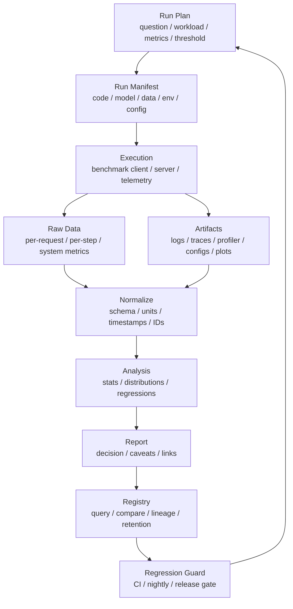

# Benchmark 数据治理与实验记录：Run Manifest、Raw Data 与可复现报告

很多 benchmark 做完以后，只剩下几张截图、一个表格和一句结论：

```text
新版本快了 18%。
```

几周后再看，常常已经回答不了这些问题：

- 当时跑的是哪个 commit？
- 模型权重和 tokenizer 是哪个版本？
- 输入长度分布是什么？
- 是否包含 warmup？
- 原始请求级数据还在吗？
- client 有没有打满？
- p99 是按请求算，还是按 token 算？
- 当时 GPU clocks、power、temperature 是否稳定？
- 失败、超时、取消请求有没有计入？
- 这个图来自哪次运行？
- 报告里的数字能不能重新生成？

如果这些问题回答不了，benchmark 就很难成为工程证据。

本篇重点回答：

> 如何治理 benchmark 数据，如何记录 run manifest、原始数据、环境元数据、artifact、trace、profiler、报告和 dashboard，让一次 benchmark 可以被复现、审查、比较、回归检测和 AI 检索？

## 一张总图



这张图强调一个原则：

```text
benchmark 结果不是一个数字，而是一组可追溯的数据资产
```

数据治理做得好，benchmark 才能用于容量模型、A/B、回归检测、成本分析和知识库沉淀。

## Benchmark 数据为什么容易丢

AI benchmark 数据有几个特点：

- 运行环境复杂。
- 指标多。
- 版本多。
- 原始数据量大。
- 部分数据敏感。
- 结果依赖硬件状态。
- 报告经常只保留聚合数字。

常见丢失方式：

- 原始 CSV 留在某台机器本地。
- profiler trace 太大，被手动删除。
- dashboard 只显示最近 7 天。
- 报告复制了图，但没有原始数据链接。
- artifact 没有和 commit/model/workload 绑定。
- 脚本参数没有保存。
- 数据集或 prompt set 更新后没有 digest。
- 同名 benchmark 覆盖旧结果。

这些问题会让团队无法回答：

```text
这次提升是真的，还是 workload 或环境变了？
```

## Run Manifest

Run manifest 是一次 benchmark 的身份证。

它应该足够完整，让别人知道这次运行到底是什么。

建议至少包含：

```yaml
run_id: 2026-06-12T10-30-00Z_llama70b_vllm_h100_traceA
question: "vLLM config B 是否提高 SLA 下 goodput"
owner: "team-or-person"
created_at: "2026-06-12T10:30:00Z"

code:
  repo: "..."
  commit: "..."
  branch: "..."
  dirty: false

model:
  name: "..."
  revision: "..."
  weights_digest: "..."
  tokenizer_digest: "..."
  chat_template_digest: "..."

workload:
  workload_id: "trace-prod-2026w22-sampled"
  input_token_distribution: "..."
  output_token_distribution: "..."
  arrival_process: "open-loop"
  qps: 120
  duration_seconds: 1800

environment:
  hardware: "8xH100-80GB"
  node_ids: ["..."]
  driver: "..."
  cuda: "..."
  framework: "..."
  engine: "..."
  image_digest: "..."

run:
  warmup_seconds: 300
  measurement_seconds: 1200
  random_seed: 42
  command: "..."
  config_file: "..."

artifacts:
  raw_metrics: "..."
  logs: "..."
  profiler_trace: "..."
  report: "..."
```

Manifest 不是为了形式化，而是为了防止关键上下文丢失。

如果一次 benchmark 没有 manifest，后续 A/B、回归和容量模型都只能靠记忆。

## Run ID 设计

Run ID 要稳定、唯一、可读。

可以包含：

- 时间。
- workload。
- model。
- engine。
- hardware。
- 运行目的。

例如：

```text
20260612-103000_infer-llama70b_vllm-h100_traceA_configB
```

也可以用 UUID，但建议同时保留可读 name。

不要只用：

```text
test1
new
final
run_latest
```

这类名字很快会失去意义。

## 原始数据必须保留

Benchmark 报告里的聚合数字不够。

至少要保留原始数据。

推理原始数据可以包括：

```text
request_id
planned_send_time
actual_send_time
server_receive_time
scheduled_time
first_token_time
last_token_time
finish_time
input_tokens
output_tokens
status
error_type
timeout
cancelled
model
replica
tenant
cache_hit
batch_id
```

训练原始数据可以包括：

```text
step
timestamp
step_time
data_time
forward_time
backward_time
optimizer_time
communication_time
checkpoint_time
tokens
loss
learning_rate
grad_norm
memory_peak
rank
node
```

系统原始数据可以包括：

```text
timestamp
gpu_utilization
sm_active
hbm_bandwidth
gpu_memory
power
temperature
clocks
network_tx_rx
storage_io
cpu
queue_length
active_requests
```

原始数据的价值是：

- 重新计算 p95/p99。
- 改变统计窗口。
- 分桶分析。
- 找异常点。
- 对比多个版本。
- 训练新的预测模型。
- 被 AI 检索和解释。

只保留最终均值，会失去这些能力。

## 聚合数据也要有 Schema

聚合结果也需要标准 schema。

例如：

```yaml
summary:
  latency:
    ttft_ms:
      p50: 120
      p95: 320
      p99: 480
    tpot_ms:
      p50: 18
      p95: 32
      p99: 45
  throughput:
    requests_per_second: 118.4
    output_tokens_per_second: 18200
    goodput_requests_per_second_at_sla: 110.2
  errors:
    timeout_rate: 0.001
    error_rate: 0.0005
  resources:
    avg_gpu_power_w: 610
    peak_memory_gb: 72
```

要统一：

- 单位。
- 分位数口径。
- 成功/失败口径。
- 时间窗口。
- token 口径。
- 统计对象。

例如 `p99 latency` 必须说明：

- 是 TTFT、TPOT 还是 E2E。
- 按请求、按 token 还是按 batch。
- 是否包含失败请求。
- 是否包含 queueing。

Schema 不统一，跨团队比较会很痛苦。

## 环境元数据

AI benchmark 对环境非常敏感。

必须记录：

### 代码与容器

- repo。
- commit。
- branch。
- dirty diff。
- build id。
- container image digest。
- Python package lock。
- system package versions。
- compiler flags。

只记录 image tag 不够，因为 tag 可能被覆盖。

### 模型与数据

- model name。
- weights digest。
- tokenizer digest。
- chat template。
- prompt set digest。
- dataset digest。
- trace id。
- sampling config。

模型名字相同，不代表权重、tokenizer 和 template 相同。

### 硬件与系统

- GPU 型号。
- GPU 数量。
- HBM 容量。
- CPU 型号。
- host memory。
- NIC。
- local storage。
- topology。
- node id。
- rack id。
- driver。
- CUDA/ROCm。
- NCCL/RCCL。
- power limit。
- clocks。

如果不记录 node id，就很难定位“某批节点慢”的问题。

### 运行状态

- warmup 时间。
- measurement window。
- cache 状态。
- concurrent jobs。
- power/thermal state。
- queue state。
- autoscaling state。

Benchmark 不是只依赖静态版本，也依赖运行时状态。

## Artifact 管理

一次 benchmark 可能产生很多 artifact：

- raw metrics。
- aggregated metrics。
- logs。
- config。
- manifest。
- profiler traces。
- screenshots。
- plots。
- dashboards。
- generated reports。
- model output samples。
- failure samples。

Artifact 管理要解决：

- 存在哪里。
- 怎么命名。
- 怎么关联 run。
- 怎么防止覆盖。
- 怎么设置 retention。
- 谁能访问。
- 是否包含敏感数据。

常见做法：

```text
artifacts/
  runs/
    <run_id>/
      manifest.yaml
      config.yaml
      raw_requests.parquet
      raw_system_metrics.parquet
      summary.json
      report.md
      profiler/
      logs/
      plots/
```

如果 artifact 很大，可以放对象存储，Git 里只保存 metadata、digest 和链接。

DVC、MLflow、Weights & Biases 等工具都围绕 experiment tracking、artifact 和版本管理提供了成熟思路。内部平台即使不直接使用这些工具，也应该借鉴它们的核心抽象：run、metric、parameter、artifact、lineage。

## Lineage：结果从哪里来

Lineage 记录结果由哪些输入产生。

一个 benchmark result 应该能追溯到：

```text
code commit
  + container image
  + model artifact
  + workload artifact
  + config
  + hardware environment
  + command
  -> raw data
  -> summary
  -> report
```

如果报告里的图不能追溯到 raw data 和 run manifest，就不能算完整证据。

Lineage 对这些场景很重要：

- A/B 对比。
- 回归检测。
- 审计。
- 复现论文或性能报告。
- 事故复盘。
- AI 助手查询历史实验。

## 时间戳和时钟

Benchmark 数据经常来自多个系统：

- client。
- server。
- GPU telemetry。
- load balancer。
- profiler。
- log system。
- tracing system。

这些系统时钟可能不同。

建议：

- 所有记录使用 UTC 时间戳。
- 保留 monotonic time 用于单进程内延迟。
- 记录 clock skew。
- client 和 server 尽量同步。
- 原始数据保留 planned send time 和 actual send time。
- 对 telemetry 做窗口对齐。

否则会出现：

- TTFT 负数。
- queueing time 不可信。
- system metrics 对不上请求峰值。
- profiler trace 与日志无法关联。

## 隐私与脱敏

Benchmark 数据可能包含敏感信息：

- 用户 prompt。
- 输出内容。
- tenant id。
- request id。
- RAG 文档。
- tool 调用参数。
- 错误日志。
- stack trace。
- 文件路径。

治理原则：

- 默认不保存原始敏感文本。
- 保存 token length、hash、类型、统计特征。
- 如果必须保存样本，做访问控制和 retention。
- 对 tenant/user 做 pseudonymization。
- 对外分享报告时只给聚合数据。
- raw trace 和 profiler artifact 做权限隔离。

不能为了 benchmark 复现性牺牲数据安全。

但也不能只保留过度脱敏后的均值，否则无法分析问题。需要在安全和可诊断性之间设计分层数据。

## 数据格式

建议区分几类格式。

### Manifest / Config

适合：

- YAML。
- JSON。
- TOML。

要求：

- 可读。
- 可 diff。
- 可 schema validate。

### Raw Metrics

适合：

- Parquet。
- CSV。
- JSONL。

如果数据量大，Parquet 更适合。

### Time Series

适合：

- Prometheus remote write。
- OpenTelemetry metrics。
- TSDB。
- Parquet time series export。

### Trace / Profiler

适合保留原工具格式：

- Nsight trace。
- Chrome trace。
- PyTorch profiler trace。
- OTLP trace。

同时保存索引 metadata，便于搜索。

## Dashboard 与报告不是一回事

Dashboard 适合持续观察：

- 趋势。
- 回归。
- 多版本对比。
- 资源使用。
- SLA。

报告适合决策：

- 问题是什么。
- 怎么测。
- 结论是什么。
- caveats 是什么。
- 是否上线或回滚。

常见问题是只有 dashboard，没有报告。

Dashboard 告诉你数字变化，报告解释为什么这个数字可以支持某个决策。

一份报告至少应该链接：

- run manifest。
- raw data。
- dashboard。
- profiler trace。
- logs。
- code diff。
- final decision。

## Retention 策略

Benchmark 数据不能无限保留所有细节。

可以分层：

| 数据 | 建议保留 |
| --- | --- |
| summary metrics | 长期 |
| run manifest | 长期 |
| report | 长期 |
| raw per-request/step data | 中期 |
| profiler trace | 短到中期，关键 run 长期 |
| full logs | 短期 |
| sensitive samples | 最短必要时间 |

关键 release、论文、采购评估、事故复盘相关 benchmark 应长期保留。

普通开发调试 run 可以较短保留。

Retention 策略要写进平台规则，不能靠个人手动删除。

## 版本与基线管理

Benchmark 数据治理必须管理 baseline。

Baseline 可能是：

- release 版本。
- main branch 最近稳定结果。
- 某硬件的 golden run。
- 某 workload 的标准结果。
- 某论文复现结果。

需要记录：

- baseline run id。
- baseline 创建原因。
- baseline 适用硬件。
- baseline 适用 workload。
- baseline 是否被替换。
- 替换审批记录。

不要让一次坏结果自动成为新 baseline。

回归检测依赖 baseline 可信。

## Benchmark Registry

当 run 多了以后，需要 registry。

Registry 至少支持按这些字段查询：

- model。
- workload。
- engine。
- hardware。
- commit。
- run date。
- owner。
- metric。
- pass/fail。
- release。
- baseline。

典型问题：

```text
H100 上 Llama 70B 最近 30 天 p99 TTFT 趋势如何？
哪个 commit 让 output tokens/s 下降？
某个 power cap 下 energy/token 最低的 run 是哪个？
同一 trace 在 vLLM 和 TensorRT-LLM 上差异多少？
某次采购测试的原始数据在哪？
```

如果这些问题只能靠问人，说明数据治理还不够。

## AI 可读性

这个知识库本身就是给人和 AI 查阅的。Benchmark 数据也应该考虑 AI 可读。

建议：

- report 使用 Markdown。
- manifest 使用结构化 YAML/JSON。
- summary 使用稳定字段名。
- raw data 有 schema 文档。
- artifact 有明确链接。
- run 之间有 lineage。
- caveats 写成明确文本。

AI 助手检索 benchmark 时，最需要的是：

- 结论。
- 适用范围。
- 原始证据位置。
- 指标口径。
- 对比对象。
- caveats。

如果只有图片和 dashboard，AI 很难正确理解。

## 与 CI / 回归检测集成

回归检测应该自动写入 benchmark registry。

每次运行记录：

- commit。
- benchmark suite。
- result。
- threshold。
- baseline。
- pass/fail。
- raw data。
- failure reason。

如果失败，应该保留足够定位证据：

- logs。
- system metrics。
- profiler sample。
- environment diff。

CI 不应该只显示：

```text
performance check failed
```

而应该告诉维护者：

```text
which metric
which workload
which baseline
how much regression
where raw data is
```

## 报告模板

Benchmark 报告可以按下面模板。

```text
Title:
  concise statement

Question:
  what decision this benchmark supports

Run:
  run_id
  owner
  time
  links to manifest/raw/artifacts

System:
  code / model / workload / hardware / environment

Method:
  warmup
  measurement window
  repeats
  load generation
  cache state

Results:
  primary metrics
  guardrail metrics
  explanatory metrics
  distributions

Evidence:
  raw data
  dashboard
  profiler
  logs

Decision:
  ship / reject / investigate / canary / update baseline

Caveats:
  what this result does not prove

Follow-up:
  regression guard
  owner
  next run
```

## 常见误区

### 误区一：报告里有图就够了

不够。

图必须能追溯到 raw data、manifest 和生成脚本。

### 误区二：只保存聚合结果

不够。

聚合结果无法重新分桶、重新计算 p99、排查异常或修正统计口径。

### 误区三：环境信息可以手动回忆

不可靠。

环境信息必须自动采集。

### 误区四：所有 run 都长期保存完整数据

成本太高。

应该分层 retention：summary 长期，raw 中期，trace 选择性长期。

### 误区五：Benchmark 数据只给人看

不够。

AI 助手要能检索、比较、总结和解释 benchmark，数据就必须结构化、可链接、可追溯。

## 检查清单

运行前：

- 是否有 run id？
- 是否有 workload spec？
- 是否有 manifest schema？
- 是否记录 code/model/data digest？
- 是否定义 raw data 存储位置？

运行中：

- 是否采集请求/step 原始数据？
- 是否采集系统 metrics？
- 是否保存日志和 profiler？
- 是否记录 warmup 和 measurement window？
- 是否记录失败、超时、取消？

运行后：

- 是否生成 summary？
- 是否生成 report？
- 是否链接 raw data 和 artifacts？
- 是否写 caveats？
- 是否登记到 registry？
- 是否设置 retention？

用于回归检测：

- 是否绑定 baseline？
- 是否保存 threshold 和 pass/fail？
- 是否保存失败定位证据？
- 是否能从 commit 反查 run？

## 小结

Benchmark 数据治理的核心是让性能结论可以被追溯。

一句话：

```text
没有 manifest、raw data、artifact 和 lineage 的 benchmark，
只能算一次观察，不能算工程证据。
```

当团队把每次 benchmark 都沉淀成结构化数据资产后，很多能力才会自然出现：

- 历史趋势。
- A/B 对比。
- 自动回归检测。
- 容量模型校准。
- 成本模型校准。
- 事故复盘。
- 知识库沉淀。
- AI 助手检索和分析。

这也是第 8 章所有内容最终要落地的地方：指标、负载、profiler、容量、能效、成本和回归检测，都需要可靠的数据治理作为底座。

## 参考资料

- [MLflow Tracking](https://mlflow.org/docs/latest/tracking/)
- [DVC: Data Versioning](https://dvc.org/doc/start/data-management/data-versioning)
- [Weights & Biases Artifacts](https://docs.wandb.ai/guides/artifacts)
- [OpenTelemetry Signals](https://opentelemetry.io/docs/concepts/signals/)
