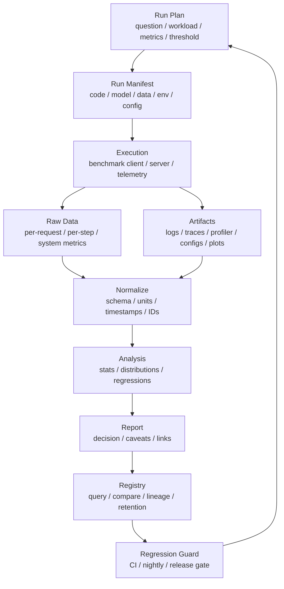

# Benchmark 数据治理与实验记录：Run Manifest、Raw Data 与可复现报告

很多 benchmark 做完以后，只剩下几张截图、一个表格和一句结论：

```text
新版本快了 18%。
```

几周后再看，常常已经回答不了这些问题：

- 当时跑的是哪个 commit？
- 模型权重和 tokenizer 是哪个版本？
- 输入长度分布是什么？
- 是否包含 warmup？
- 原始请求级数据还在吗？
- client 有没有打满？
- p99 是按请求算，还是按 token 算？
- 当时 GPU clocks、power、temperature 是否稳定？
- 失败、超时、取消请求有没有计入？
- 这个图来自哪次运行？
- 报告里的数字能不能重新生成？

如果这些问题回答不了，benchmark 就很难成为工程证据。

本篇重点回答：

> 如何治理 benchmark 数据，如何记录 run manifest、原始数据、环境元数据、artifact、trace、profiler、报告和 dashboard，让一次 benchmark 可以被复现、审查、比较、回归检测和 AI 检索？

## 一张总图



这张图强调一个原则：

```text
benchmark 结果不是一个数字，而是一组可追溯的数据资产
```

数据治理做得好，benchmark 才能用于容量模型、A/B、回归检测、成本分析和知识库沉淀。

## Benchmark Data Contract

在写具体工具之前，先定义一个更重要的东西：benchmark data contract。

Data contract 不是某个数据库表，也不是某个 dashboard，而是一组约定：

```text
一次 benchmark 运行完成后，必须留下哪些证据；
这些证据用什么字段描述；
字段单位和口径是什么；
哪些字段可以为空；
哪些 artifact 必须可追溯；
数据保存多久；
谁可以读取；
AI 助手能用什么索引理解它。
```

如果没有 data contract，benchmark 数据会慢慢变成“每个人按自己习惯保存一份文件”。短期看灵活，长期看不可比较、不可复现、不可自动化。

一个最小可用的 contract 可以包含：

| 模块 | 作用 |
| --- | --- |
| run manifest | 描述这次实验是谁、何时、为何、用什么版本跑的 |
| workload spec | 描述请求、step、trace、数据集和负载形态 |
| metric schema | 定义每个指标的单位、统计对象和计算口径 |
| raw data schema | 定义请求级、step 级、系统级原始记录 |
| artifact index | 记录日志、trace、profiler、图表、报告的位置和 digest |
| lineage | 记录从输入 artifact 到 summary/report 的生成链路 |
| quality gate | 定义缺失、重复、异常值、时钟漂移等校验规则 |
| retention | 定义不同数据保留多久、何时归档、何时删除 |
| access policy | 定义敏感样本、prompt、日志、trace 的访问范围 |
| AI index | 给 AI 检索用的摘要、标签、结论、caveats 和证据链接 |

这个 contract 应该版本化，例如：

```yaml
schema_version: benchmark-run.v1
compatibility:
  backwards_readable_from: benchmark-run.v1
  breaking_change: false
```

后续字段变更时，不要悄悄改含义。比如 `latency_ms` 原来是 E2E latency，后来改成 TTFT，就应该新增字段或升级 schema，而不是复用旧字段名。

## Benchmark 数据模型

Benchmark 数据治理可以先抽象成几个核心实体。

```text
Benchmark Suite
  -> Benchmark Case
    -> Run
      -> Trial / Repeat
        -> Sample / Event
      -> Artifact
      -> Summary
      -> Report
      -> Baseline Decision
```

这些实体分别回答不同问题。

| 实体 | 回答的问题 |
| --- | --- |
| benchmark suite | 这是一组什么测试，例如 release regression suite |
| benchmark case | 具体测哪个模型、负载、硬件、指标组合 |
| run | 某一次实际运行 |
| trial / repeat | 同一配置下的重复实验 |
| sample / event | 单个请求、单个 step、单个 telemetry 点 |
| artifact | 这次运行产生的文件和证据 |
| summary | 从 raw data 聚合出的稳定指标 |
| report | 面向决策的解释和结论 |
| baseline decision | 这次结果是否成为或替换基线 |

这层模型的意义是避免把所有东西都叫“测试结果”。例如：

- 一次 run 不等于一个 benchmark case。
- 一个 summary 不等于 raw data。
- 一个 dashboard 不等于 report。
- 一个 baseline 不等于最近一次成功 run。

当实体边界清楚以后，后续做 registry、查询、回归检测、AI 摘要都会更容易。

## Benchmark 数据为什么容易丢

AI benchmark 数据有几个特点：

- 运行环境复杂。
- 指标多。
- 版本多。
- 原始数据量大。
- 部分数据敏感。
- 结果依赖硬件状态。
- 报告经常只保留聚合数字。

常见丢失方式：

- 原始 CSV 留在某台机器本地。
- profiler trace 太大，被手动删除。
- dashboard 只显示最近 7 天。
- 报告复制了图，但没有原始数据链接。
- artifact 没有和 commit/model/workload 绑定。
- 脚本参数没有保存。
- 数据集或 prompt set 更新后没有 digest。
- 同名 benchmark 覆盖旧结果。

这些问题会让团队无法回答：

```text
这次提升是真的，还是 workload 或环境变了？
```

## Run Manifest

Run manifest 是一次 benchmark 的身份证。

它应该足够完整，让别人知道这次运行到底是什么。

建议至少包含：

```yaml
run_id: 2026-06-12T10-30-00Z_llama70b_vllm_h100_traceA
question: "vLLM config B 是否提高 SLA 下 goodput"
owner: "team-or-person"
created_at: "2026-06-12T10:30:00Z"

code:
  repo: "..."
  commit: "..."
  branch: "..."
  dirty: false

model:
  name: "..."
  revision: "..."
  weights_digest: "..."
  tokenizer_digest: "..."
  chat_template_digest: "..."

workload:
  workload_id: "trace-prod-2026w22-sampled"
  input_token_distribution: "..."
  output_token_distribution: "..."
  arrival_process: "open-loop"
  qps: 120
  duration_seconds: 1800

environment:
  hardware: "8xH100-80GB"
  node_ids: ["..."]
  driver: "..."
  cuda: "..."
  framework: "..."
  engine: "..."
  image_digest: "..."

run:
  warmup_seconds: 300
  measurement_seconds: 1200
  random_seed: 42
  command: "..."
  config_file: "..."

artifacts:
  raw_metrics: "..."
  logs: "..."
  profiler_trace: "..."
  report: "..."
```

Manifest 不是为了形式化，而是为了防止关键上下文丢失。

如果一次 benchmark 没有 manifest，后续 A/B、回归和容量模型都只能靠记忆。

更准确地说，manifest 应该是“实验快照”，不是事后补写的说明。

它最好满足几个要求：

- 在运行开始前生成初始版本。
- 运行结束后补充结果 artifact 和状态。
- 每个字段都有 schema 和单位。
- 自动采集优先，手工填写只用于 question、decision、caveats 这类解释性字段。
- 与 raw data、summary、report 使用同一个 run id。
- 保存 code、container、model、workload、config 的 digest。
- 记录 benchmark tool 本身的版本。
- 记录生成报告所用脚本的版本。

一个更工程化的 manifest 还应该记录 telemetry 来源：

```yaml
telemetry:
  request_log: "client-jsonl-v2"
  server_log: "engine-log-v1"
  gpu_metrics: "dcgm-exporter"
  trace: "opentelemetry-otlp"
  profiler: "nsys"
  time_sync:
    method: "ntp"
    max_observed_skew_ms: 3.5
```

这样后续看到异常时，才知道数据来自哪里、口径是否可靠。

Manifest 还要记录 run 的生命周期状态：

```yaml
status:
  state: "completed"
  started_at: "2026-06-12T10:30:00Z"
  ended_at: "2026-06-12T11:05:00Z"
  failure_reason: null
  excluded_from_baseline: false
```

失败 run 也应该保存 manifest。很多系统性问题只会出现在失败 run 里，如果失败 run 被丢掉，团队会丢失最有价值的诊断材料。

## Run ID 设计

Run ID 要稳定、唯一、可读。

可以包含：

- 时间。
- workload。
- model。
- engine。
- hardware。
- 运行目的。

例如：

```text
20260612-103000_infer-llama70b_vllm-h100_traceA_configB
```

也可以用 UUID，但建议同时保留可读 name。

不要只用：

```text
test1
new
final
run_latest
```

这类名字很快会失去意义。

Run ID 只负责唯一和可读，不应该承载所有查询条件。查询条件应该进入 manifest 和 registry。

例如不要把所有参数都塞进 run id：

```text
20260612_vllm_h100_qps120_prefillchunk512_prefixcacheon_ep8_tp4_long...
```

这种名字看起来信息多，实际很难维护。更好的做法是：

- run id 简洁稳定。
- manifest 保存完整配置。
- registry 提供字段化检索。
- report 用自然语言解释重点差异。

## 原始数据必须保留

Benchmark 报告里的聚合数字不够。

至少要保留原始数据。

推理原始数据可以包括：

```text
request_id
planned_send_time
actual_send_time
server_receive_time
scheduled_time
first_token_time
last_token_time
finish_time
input_tokens
output_tokens
status
error_type
timeout
cancelled
model
replica
tenant
cache_hit
batch_id
```

训练原始数据可以包括：

```text
step
timestamp
step_time
data_time
forward_time
backward_time
optimizer_time
communication_time
checkpoint_time
tokens
loss
learning_rate
grad_norm
memory_peak
rank
node
```

系统原始数据可以包括：

```text
timestamp
gpu_utilization
sm_active
hbm_bandwidth
gpu_memory
power
temperature
clocks
network_tx_rx
storage_io
cpu
queue_length
active_requests
```

原始数据的价值是：

- 重新计算 p95/p99。
- 改变统计窗口。
- 分桶分析。
- 找异常点。
- 对比多个版本。
- 训练新的预测模型。
- 被 AI 检索和解释。

只保留最终均值，会失去这些能力。

原始数据还要区分层级。

| 层级 | 例子 | 用途 |
| --- | --- | --- |
| event-level | 单个请求、单个 token、单个 step、单条错误 | 分布分析、异常定位、尾延迟分析 |
| window-level | 每 1 秒 GPU 利用率、队列长度、吞吐 | 和负载峰谷、资源瓶颈对齐 |
| artifact-level | profiler trace、日志文件、配置文件 | 深入定位和复现 |
| run-level | summary、report、decision | 横向比较和长期检索 |

不要把这些层级混在一个表里。请求级数据适合分析 latency distribution；系统级 time series 适合解释瓶颈；run-level summary 适合看趋势。它们互相关联，但不是同一种数据。

推荐为原始记录保留稳定关联字段：

```text
run_id
trial_id
request_id / step_id
trace_id
span_id
node_id
replica_id
rank_id
timestamp_utc
monotonic_time_ns
```

这些字段看起来麻烦，但在排查问题时非常关键。比如 p99 TTFT 升高时，只有能从 `request_id` 追到 `replica_id`、`node_id`、`trace_id` 和当时 GPU metrics，才可能判断是调度、网络、KV cache、CPU、GPU 还是下游依赖导致。

## 聚合数据也要有 Schema

聚合结果也需要标准 schema。

例如：

```yaml
summary:
  latency:
    ttft_ms:
      p50: 120
      p95: 320
      p99: 480
    tpot_ms:
      p50: 18
      p95: 32
      p99: 45
  throughput:
    requests_per_second: 118.4
    output_tokens_per_second: 18200
    goodput_requests_per_second_at_sla: 110.2
  errors:
    timeout_rate: 0.001
    error_rate: 0.0005
  resources:
    avg_gpu_power_w: 610
    peak_memory_gb: 72
```

要统一：

- 单位。
- 分位数口径。
- 成功/失败口径。
- 时间窗口。
- token 口径。
- 统计对象。

例如 `p99 latency` 必须说明：

- 是 TTFT、TPOT 还是 E2E。
- 按请求、按 token 还是按 batch。
- 是否包含失败请求。
- 是否包含 queueing。

Schema 不统一，跨团队比较会很痛苦。

## Schema Versioning

Benchmark 数据会长期积累，schema 一定会变化。

常见变化包括：

- 新增指标。
- 重命名字段。
- 修正单位。
- 改变统计口径。
- 增加硬件字段。
- 增加 trace/profiler 类型。
- 将单机字段扩展成多机字段。

因此每份 manifest、raw data、summary 都应该带 schema version：

```yaml
schema:
  name: "benchmark-summary"
  version: "1.3.0"
  metric_units:
    ttft_p99: "ms"
    output_tokens_per_second: "tokens/s"
    energy_per_token: "joule/token"
```

Schema 版本治理要遵守几个规则：

- 新增可选字段通常是兼容变更。
- 改字段含义是破坏性变更。
- 改单位必须升级版本。
- 删除字段要有迁移期。
- 枚举值要集中定义。
- nullable 字段要说明为什么可能为空。
- derived metric 要记录计算公式和输入字段。

例如 `goodput` 一定要绑定 SLA 口径：

```yaml
goodput:
  value: 110.2
  unit: "requests/s"
  sla:
    ttft_p99_ms: 500
    tpot_p99_ms: 50
  denominator: "successful_requests_within_measurement_window"
```

否则两个团队都说 goodput，可能根本不是同一个指标。

对于长期知识库，schema version 还有一个作用：AI 助手读取旧 benchmark 时，可以知道字段含义是否仍然适用，而不是把不同年代、不同口径的数据强行比较。

## 环境元数据

AI benchmark 对环境非常敏感。

必须记录：

### 代码与容器

- repo。
- commit。
- branch。
- dirty diff。
- build id。
- container image digest。
- Python package lock。
- system package versions。
- compiler flags。

只记录 image tag 不够，因为 tag 可能被覆盖。

### 模型与数据

- model name。
- weights digest。
- tokenizer digest。
- chat template。
- prompt set digest。
- dataset digest。
- trace id。
- sampling config。

模型名字相同，不代表权重、tokenizer 和 template 相同。

### 硬件与系统

- GPU 型号。
- GPU 数量。
- HBM 容量。
- CPU 型号。
- host memory。
- NIC。
- local storage。
- topology。
- node id。
- rack id。
- driver。
- CUDA/ROCm。
- NCCL/RCCL。
- power limit。
- clocks。

如果不记录 node id，就很难定位“某批节点慢”的问题。

### 运行状态

- warmup 时间。
- measurement window。
- cache 状态。
- concurrent jobs。
- power/thermal state。
- queue state。
- autoscaling state。

Benchmark 不是只依赖静态版本，也依赖运行时状态。

环境元数据尽量不要靠人工填写。

比较可靠的做法是：

- benchmark launcher 自动记录 git commit 和 dirty diff。
- build pipeline 自动记录 image digest。
- model loader 自动记录权重、tokenizer、chat template digest。
- workload loader 自动记录 trace/dataset/prompt set digest。
- 节点 agent 自动记录 driver、CUDA/ROCm、NCCL/RCCL、firmware、topology。
- telemetry agent 自动记录 power limit、clocks、temperature、concurrent jobs。

人工输入最适合记录“为什么跑这次 benchmark”和“结果支持什么决策”。版本、环境、硬件、命令和文件 hash 应尽量自动采集。

## Artifact 管理

一次 benchmark 可能产生很多 artifact：

- raw metrics。
- aggregated metrics。
- logs。
- config。
- manifest。
- profiler traces。
- screenshots。
- plots。
- dashboards。
- generated reports。
- model output samples。
- failure samples。

Artifact 管理要解决：

- 存在哪里。
- 怎么命名。
- 怎么关联 run。
- 怎么防止覆盖。
- 怎么设置 retention。
- 谁能访问。
- 是否包含敏感数据。

常见做法：

```text
artifacts/
  runs/
    <run_id>/
      manifest.yaml
      config.yaml
      raw_requests.parquet
      raw_system_metrics.parquet
      summary.json
      report.md
      profiler/
      logs/
      plots/
```

如果 artifact 很大，可以放对象存储，Git 里只保存 metadata、digest 和链接。

DVC、MLflow、Weights & Biases 等工具都围绕 experiment tracking、artifact 和版本管理提供了成熟思路。内部平台即使不直接使用这些工具，也应该借鉴它们的核心抽象：run、metric、parameter、artifact、lineage。

Artifact 的关键不是“有文件”，而是“文件能被验证”。

建议为每个 artifact 记录：

```yaml
artifacts:
  - name: "raw_requests"
    type: "parquet"
    uri: "s3://benchmark/runs/<run_id>/raw_requests.parquet"
    sha256: "..."
    schema: "raw-request.v2"
    size_bytes: 123456789
    created_by: "benchmark-client@1.8.0"
    sensitive: false
  - name: "profiler_trace"
    type: "nsys"
    uri: "s3://benchmark/runs/<run_id>/profiler/trace.nsys-rep"
    sha256: "..."
    retention_class: "short"
    sensitive: true
```

如果 artifact 没有 digest，就很难证明报告生成时用的文件和后来看到的文件是同一个。对于关键 run，artifact 应尽量不可变；如果确实要修正，只能生成新版本，并记录为什么修正。

## Lineage：结果从哪里来

Lineage 记录结果由哪些输入产生。

一个 benchmark result 应该能追溯到：

```text
code commit
  + container image
  + model artifact
  + workload artifact
  + config
  + hardware environment
  + command
  -> raw data
  -> summary
  -> report
```

如果报告里的图不能追溯到 raw data 和 run manifest，就不能算完整证据。

Lineage 对这些场景很重要：

- A/B 对比。
- 回归检测。
- 审计。
- 复现论文或性能报告。
- 事故复盘。
- AI 助手查询历史实验。

Lineage 可以分成两层。

第一层是输入 lineage：

```text
source code digest
container image digest
model digest
tokenizer digest
workload digest
config digest
hardware inventory snapshot
runtime telemetry source
```

第二层是派生 lineage：

```text
raw data
  -> normalized data
  -> summary metrics
  -> plots
  -> report
  -> baseline decision
```

每一步都应该记录生成脚本、参数和输出 digest。

例如：

```yaml
lineage:
  normalize:
    input: "raw_requests.parquet@sha256:..."
    script: "scripts/normalize_requests.py@commit:..."
    output: "normalized_requests.parquet@sha256:..."
  summarize:
    input: "normalized_requests.parquet@sha256:..."
    script: "scripts/summarize_inference.py@commit:..."
    output: "summary.json@sha256:..."
  report:
    input:
      - "summary.json@sha256:..."
      - "plots/latency.png@sha256:..."
    script: "scripts/render_report.py@commit:..."
    output: "report.md@sha256:..."
```

这样做的好处是：即使后来 summary 计算逻辑变了，也能知道旧报告当时是怎么生成的。

在更严格的场景里，还可以借鉴软件供应链里的 provenance 思路，把“谁在什么环境里用什么输入生成了什么输出”记录成机器可验证的声明。

## 时间戳和时钟

Benchmark 数据经常来自多个系统：

- client。
- server。
- GPU telemetry。
- load balancer。
- profiler。
- log system。
- tracing system。

这些系统时钟可能不同。

建议：

- 所有记录使用 UTC 时间戳。
- 保留 monotonic time 用于单进程内延迟。
- 记录 clock skew。
- client 和 server 尽量同步。
- 原始数据保留 planned send time 和 actual send time。
- 对 telemetry 做窗口对齐。

否则会出现：

- TTFT 负数。
- queueing time 不可信。
- system metrics 对不上请求峰值。
- profiler trace 与日志无法关联。

多系统对齐时，至少保留两类时间：

| 时间 | 用途 |
| --- | --- |
| wall-clock UTC | 跨系统、跨节点对齐 |
| monotonic time | 单进程内计算耗时 |

延迟计算优先使用同一进程内的 monotonic time；跨系统排障再使用 UTC 时间戳和 trace id 对齐。

同时保留关联 ID：

```text
run_id
request_id
trace_id
span_id
node_id
replica_id
rank_id
batch_id
```

对于分布式推理，`request_id` 可能跨越 router、prefill worker、decode worker、KV cache manager、scheduler、network transport 等多个组件。没有统一 ID，日志、trace、metric 和 profiler 就很难拼起来。

## 隐私与脱敏

Benchmark 数据可能包含敏感信息：

- 用户 prompt。
- 输出内容。
- tenant id。
- request id。
- RAG 文档。
- tool 调用参数。
- 错误日志。
- stack trace。
- 文件路径。

治理原则：

- 默认不保存原始敏感文本。
- 保存 token length、hash、类型、统计特征。
- 如果必须保存样本，做访问控制和 retention。
- 对 tenant/user 做 pseudonymization。
- 对外分享报告时只给聚合数据。
- raw trace 和 profiler artifact 做权限隔离。

不能为了 benchmark 复现性牺牲数据安全。

但也不能只保留过度脱敏后的均值，否则无法分析问题。需要在安全和可诊断性之间设计分层数据。

## 数据格式

建议区分几类格式。

### Manifest / Config

适合：

- YAML。
- JSON。
- TOML。

要求：

- 可读。
- 可 diff。
- 可 schema validate。

### Raw Metrics

适合：

- Parquet。
- CSV。
- JSONL。

如果数据量大，Parquet 更适合。

### Time Series

适合：

- Prometheus remote write。
- OpenTelemetry metrics。
- TSDB。
- Parquet time series export。

### Trace / Profiler

适合保留原工具格式：

- Nsight trace。
- Chrome trace。
- PyTorch profiler trace。
- OTLP trace。

同时保存索引 metadata，便于搜索。

## Dashboard 与报告不是一回事

Dashboard 适合持续观察：

- 趋势。
- 回归。
- 多版本对比。
- 资源使用。
- SLA。

报告适合决策：

- 问题是什么。
- 怎么测。
- 结论是什么。
- caveats 是什么。
- 是否上线或回滚。

常见问题是只有 dashboard，没有报告。

Dashboard 告诉你数字变化，报告解释为什么这个数字可以支持某个决策。

一份报告至少应该链接：

- run manifest。
- raw data。
- dashboard。
- profiler trace。
- logs。
- code diff。
- final decision。

## Retention 策略

Benchmark 数据不能无限保留所有细节。

可以分层：

| 数据 | 建议保留 |
| --- | --- |
| summary metrics | 长期 |
| run manifest | 长期 |
| report | 长期 |
| raw per-request/step data | 中期 |
| profiler trace | 短到中期，关键 run 长期 |
| full logs | 短期 |
| sensitive samples | 最短必要时间 |

关键 release、论文、采购评估、事故复盘相关 benchmark 应长期保留。

普通开发调试 run 可以较短保留。

Retention 策略要写进平台规则，不能靠个人手动删除。

更实际的做法是分 hot、warm、cold 三层：

| 层级 | 保存内容 | 典型用途 |
| --- | --- | --- |
| hot | 最近 raw data、dashboard、日志、trace 索引 | 日常排障和趋势观察 |
| warm | summary、manifest、关键 raw data、关键 profiler | 月度分析、回归复查 |
| cold | release/report/baseline 相关证据包 | 长期审计、论文/采购/事故复盘 |

并不是所有 run 都值得长期保存完整 profiler。一个可执行策略是：

- 所有 run 长期保存 manifest、summary、report、quality result。
- 所有进入 baseline 或 release 决策的 run 保存完整证据包。
- 失败但具有诊断价值的 run 保存有限时间。
- 普通开发调试 run 到期后只保留摘要。
- 敏感样本单独设置更短 retention 和更严格权限。

Retention 也要记录在 registry 中：

```yaml
retention:
  class: "release-evidence"
  raw_data_until: "2027-06-12"
  profiler_until: "2027-06-12"
  logs_until: "2026-09-12"
  sensitive_samples_until: "2026-06-19"
  legal_hold: false
```

到期删除也应该保留 tombstone metadata，说明哪些 artifact 被删除、何时删除、根据什么规则删除。否则多年后看到一个 report 链接失效，会不知道是事故、迁移还是正常 retention。

## 版本与基线管理

Benchmark 数据治理必须管理 baseline。

Baseline 可能是：

- release 版本。
- main branch 最近稳定结果。
- 某硬件的 golden run。
- 某 workload 的标准结果。
- 某论文复现结果。

需要记录：

- baseline run id。
- baseline 创建原因。
- baseline 适用硬件。
- baseline 适用 workload。
- baseline 是否被替换。
- 替换审批记录。

不要让一次坏结果自动成为新 baseline。

回归检测依赖 baseline 可信。

Baseline registry 可以记录：

```yaml
baseline_id: "h100-llama70b-traceA-2026w22"
benchmark_case: "llama70b_traceA_sla500"
run_id: "20260612-103000_infer-llama70b_vllm-h100_traceA_configB"
created_at: "2026-06-12T12:00:00Z"
created_by: "perf-review"
reason: "release 2026.06 accepted result"
metric_contract:
  primary: "goodput_requests_per_second_at_sla"
  guardrails:
    - "p99_ttft_ms"
    - "p99_tpot_ms"
    - "error_rate"
applicability:
  model: "llama-70b"
  engine: "vllm"
  hardware_pool: "h100-80gb"
  workload_id: "traceA@sha256:..."
status: "active"
replaced_by: null
```

更新 baseline 要比新增普通 run 更严格。

建议至少满足：

- data quality gate 通过。
- report 写明为什么替换。
- 与旧 baseline 有可解释差异。
- 关键 artifact 保留周期更长。
- 有 reviewer 或自动策略记录。

Baseline 不只是“上一次结果”，而是回归检测和工程判断的参照物。

## Benchmark Registry

当 run 多了以后，需要 registry。

Registry 至少支持按这些字段查询：

- model。
- workload。
- engine。
- hardware。
- commit。
- run date。
- owner。
- metric。
- pass/fail。
- release。
- baseline。

典型问题：

```text
H100 上 Llama 70B 最近 30 天 p99 TTFT 趋势如何？
哪个 commit 让 output tokens/s 下降？
某个 power cap 下 energy/token 最低的 run 是哪个？
同一 trace 在 vLLM 和 TensorRT-LLM 上差异多少？
某次采购测试的原始数据在哪？
```

如果这些问题只能靠问人，说明数据治理还不够。

Registry 可以从一个简单表开始，但字段要稳定。

一个 run registry 记录可以长这样：

```yaml
run_id: "20260612-103000_infer-llama70b_vllm-h100_traceA_configB"
benchmark_case: "llama70b_traceA_sla500"
suite: "nightly-inference-regression"
status: "completed"
owner: "perf"
created_at: "2026-06-12T10:30:00Z"
model: "llama-70b"
engine: "vllm"
hardware_pool: "h100-80gb"
workload_id: "traceA@sha256:..."
primary_metric:
  name: "goodput_requests_per_second_at_sla"
  value: 110.2
  unit: "requests/s"
baseline:
  baseline_id: "h100-llama70b-traceA-2026w22"
  result: "pass"
links:
  manifest: "..."
  summary: "..."
  report: "..."
  raw_data: "..."
  dashboard: "..."
  profiler: "..."
tags:
  - "prefix-cache"
  - "chunked-prefill"
  - "release-gate"
```

Registry 不一定一开始就做成复杂系统。早期可以是 Git 里的 YAML/JSON 索引、对象存储 metadata、DuckDB/SQLite 表，或者 experiment tracking 系统。关键是字段稳定、链接完整、能被脚本和 AI 读取。

## Data Quality Gates

有数据不等于数据可信。

Benchmark 运行结束后，应该先过 data quality gates，再进入 registry 或 report。

常见校验包括：

| 校验 | 目的 |
| --- | --- |
| manifest completeness | 必填字段不能缺 |
| artifact existence | manifest 里的链接必须存在 |
| digest validation | artifact 内容没有被替换 |
| schema validation | 字段、类型、单位符合版本 |
| row count check | 请求数、step 数、telemetry 点数符合预期 |
| uniqueness check | request_id、step_id 不应异常重复 |
| time order check | 时间戳不能倒序或出现明显负延迟 |
| clock skew check | client/server/node 时间偏差在可接受范围内 |
| warmup exclusion check | warmup 数据没有混入 measurement window |
| failure accounting | timeout/error/cancelled 有明确计入口径 |
| load generator saturation | client 没有先成为瓶颈 |
| telemetry coverage | GPU、CPU、网络、存储指标覆盖完整 |
| unit/range check | 单位和合理范围没有明显错误 |

质量门禁的结果也要保存：

```yaml
quality:
  status: "passed"
  checks:
    manifest_completeness: "passed"
    artifact_digest: "passed"
    clock_skew_ms:
      status: "passed"
      max: 3.5
    telemetry_coverage:
      status: "warning"
      missing_windows: 2
```

如果一个 run 有 warning，不一定不能使用，但 report 里必须写明 caveat。如果 quality gate failed，就不应该自动进入 baseline。

## AI 可读性

这个知识库本身就是给人和 AI 查阅的。Benchmark 数据也应该考虑 AI 可读。

建议：

- report 使用 Markdown。
- manifest 使用结构化 YAML/JSON。
- summary 使用稳定字段名。
- raw data 有 schema 文档。
- artifact 有明确链接。
- run 之间有 lineage。
- caveats 写成明确文本。

AI 助手检索 benchmark 时，最需要的是：

- 结论。
- 适用范围。
- 原始证据位置。
- 指标口径。
- 对比对象。
- caveats。

如果只有图片和 dashboard，AI 很难正确理解。

推荐为关键 run 生成一个 AI-readable run card。

它不替代 manifest 和 raw data，而是给人和 AI 快速理解：

```markdown
# Run Card: 20260612-103000_infer-llama70b_vllm-h100_traceA_configB

## Question
vLLM config B 是否在 SLA 约束下提高 Llama 70B traceA 的 goodput？

## Short Answer
config B 将 goodput 从 96.4 requests/s 提高到 110.2 requests/s，
主要收益来自 prefix cache 命中率提高和 decode batch 更稳定。

## Scope
- Model: Llama 70B
- Hardware: 8xH100-80GB
- Engine: vLLM
- Workload: traceA sampled from 2026w22
- SLA: p99 TTFT <= 500 ms, p99 TPOT <= 50 ms

## Evidence
- Manifest: ...
- Summary: ...
- Raw requests: ...
- System metrics: ...
- Profiler: ...
- Dashboard: ...

## Caveats
- 只覆盖 traceA，不代表长上下文 RAG 负载。
- client 和 server 在同一机房，不覆盖跨地域网络。
- 本次未测试 cold cache。

## Tags
inference, benchmark, vllm, h100, prefix-cache, goodput, sla
```

这类 run card 的价值很大：

- 新人能快速理解这次实验。
- AI 能检索、总结和对比历史 run。
- 决策者能看到结论和 caveats。
- 工程师能顺着链接进入原始证据。

AI 可读不是写一段漂亮总结，而是把“结论、适用范围、证据、限制、链接”固定下来。

## 与 CI / 回归检测集成

回归检测应该自动写入 benchmark registry。

每次运行记录：

- commit。
- benchmark suite。
- result。
- threshold。
- baseline。
- pass/fail。
- raw data。
- failure reason。

如果失败，应该保留足够定位证据：

- logs。
- system metrics。
- profiler sample。
- environment diff。

CI 不应该只显示：

```text
performance check failed
```

而应该告诉维护者：

```text
which metric
which workload
which baseline
how much regression
where raw data is
```

回归检测的数据记录应该区分三类运行：

| 类型 | 特点 |
| --- | --- |
| PR smoke benchmark | 快、样本少、发现明显退化 |
| nightly benchmark | 覆盖更多 workload，观察趋势 |
| release benchmark | 最严格，保留完整 artifact，可能更新 baseline |

三类运行不要混用同一个阈值。

PR benchmark 更适合发现大幅退化，例如 `>10%`。Nightly benchmark 更适合看稳定趋势。Release benchmark 才适合做正式结论和 baseline 更新。

对于 CI 里的 flaky performance result，要记录 rerun policy：

```yaml
rerun_policy:
  max_attempts: 3
  aggregation: "median_of_valid_runs"
  exclude_if:
    - "quality_gate_failed"
    - "client_saturated"
    - "thermal_throttling_detected"
```

否则团队会在“到底是代码退化还是机器抖动”上反复争论。

## 报告模板

Benchmark 报告可以按下面模板。

```text
Title:
  concise statement

Question:
  what decision this benchmark supports

Run:
  run_id
  owner
  time
  links to manifest/raw/artifacts

System:
  code / model / workload / hardware / environment

Method:
  warmup
  measurement window
  repeats
  load generation
  cache state

Results:
  primary metrics
  guardrail metrics
  explanatory metrics
  distributions

Evidence:
  raw data
  dashboard
  profiler
  logs

Decision:
  ship / reject / investigate / canary / update baseline

Caveats:
  what this result does not prove

Follow-up:
  regression guard
  owner
  next run
```

报告里的图表最好从 raw data 自动生成，不要手工复制数字。

如果报告需要人工写结论，也应该让人工只写：

- 为什么测。
- 如何解释结果。
- 是否接受。
- caveats。
- 后续行动。

指标表、图表、artifact 链接、manifest 链接应由脚本生成。这样口径变更时，可以重新生成报告并保留旧版本。

## 推荐落地路线

Benchmark 数据治理不需要一开始就做成完整平台。

可以按四步推进。

第一步，统一 run 目录和 manifest：

```text
runs/<run_id>/
  manifest.yaml
  summary.json
  report.md
  raw/
  logs/
  profiler/
```

只要每次 run 都按这个结构保存，就已经解决了很多“文件在哪”的问题。

第二步，统一 schema 和质量校验：

- manifest schema。
- summary schema。
- raw request/step schema。
- artifact index schema。
- basic quality gate。

此时 benchmark 已经能被脚本稳定读取。

第三步，建立 registry：

- 支持按 model、workload、hardware、engine、commit 查询。
- 支持 baseline 绑定。
- 支持 report/raw/artifact 链接。
- 支持 pass/fail 和 caveat 检索。

此时 benchmark 可以服务回归检测和历史趋势。

第四步，建设 AI-readable 层：

- 为关键 run 生成 run card。
- 为 benchmark case 生成知识卡片。
- 把 caveats、decision、metric contract 结构化。
- 让 AI 能根据问题找到对应 run、对比对象和原始证据。

不要先追求“酷炫 dashboard”。先把 manifest、raw data、summary、artifact、report、registry 这条链打通。dashboard 是展示层，数据治理是证据层。

## 常见误区

### 误区一：报告里有图就够了

不够。

图必须能追溯到 raw data、manifest 和生成脚本。

### 误区二：只保存聚合结果

不够。

聚合结果无法重新分桶、重新计算 p99、排查异常或修正统计口径。

### 误区三：环境信息可以手动回忆

不可靠。

环境信息必须自动采集。

### 误区四：所有 run 都长期保存完整数据

成本太高。

应该分层 retention：summary 长期，raw 中期，trace 选择性长期。

### 误区五：Benchmark 数据只给人看

不够。

AI 助手要能检索、比较、总结和解释 benchmark，数据就必须结构化、可链接、可追溯。

### 误区六：只有通过的 run 才保存

不够。

失败 run、超时 run、质量校验 warning run 往往最能暴露系统边界。它们可以不进入 baseline，但应该按策略保存诊断证据。

### 误区七：baseline 自动等于最新结果

危险。

Baseline 是带解释和审批的参照物，不是时间上最新的一次 run。自动把最新结果设为 baseline，会掩盖真实性能退化。

## 检查清单

运行前：

- 是否有 run id？
- 是否有 workload spec？
- 是否有 manifest schema？
- 是否有 schema version？
- 是否记录 code/model/data digest？
- 是否定义 raw data 存储位置？
- 是否定义 primary metric、guardrail metric 和阈值？
- 是否定义 retention class？

运行中：

- 是否采集请求/step 原始数据？
- 是否采集系统 metrics？
- 是否保存日志和 profiler？
- 是否记录 warmup 和 measurement window？
- 是否记录失败、超时、取消？
- 是否记录 trace_id/span_id/request_id 等关联字段？
- 是否监控 client 是否饱和？
- 是否记录 power、temperature、clock 等运行状态？

运行后：

- 是否生成 summary？
- 是否生成 report？
- 是否链接 raw data 和 artifacts？
- 是否写 caveats？
- 是否登记到 registry？
- 是否设置 retention？
- 是否通过 data quality gates？
- 是否保存 artifact digest？
- 是否保存 lineage？
- 是否生成 AI-readable run card？

用于回归检测：

- 是否绑定 baseline？
- 是否保存 threshold 和 pass/fail？
- 是否保存失败定位证据？
- 是否能从 commit 反查 run？
- 是否记录 rerun policy？
- 是否区分 PR、nightly、release benchmark？
- 是否防止失败 run 自动更新 baseline？

## 小结

Benchmark 数据治理的核心是让性能结论可以被追溯。

一句话：

```text
没有 manifest、raw data、artifact 和 lineage 的 benchmark，
只能算一次观察，不能算工程证据。
```

当团队把每次 benchmark 都沉淀成结构化数据资产后，很多能力才会自然出现：

- 历史趋势。
- A/B 对比。
- 自动回归检测。
- 容量模型校准。
- 成本模型校准。
- 事故复盘。
- 知识库沉淀。
- AI 助手检索和分析。

这也是第 8 章所有内容最终要落地的地方：指标、负载、profiler、容量、能效、成本和回归检测，都需要可靠的数据治理作为底座。

## 参考资料

- [MLflow Tracking](https://mlflow.org/docs/latest/tracking/)
- [DVC: Data Versioning](https://dvc.org/doc/start/data-management/data-versioning)
- [Weights & Biases Artifacts](https://docs.wandb.ai/guides/artifacts)
- [OpenTelemetry Signals](https://opentelemetry.io/docs/concepts/signals/)
- [OpenTelemetry Specification](https://opentelemetry.io/docs/specs/otel/)
- [Apache Parquet Documentation](https://parquet.apache.org/docs/)
- [JSON Schema](https://json-schema.org/)
- [OpenLineage Documentation](https://openlineage.io/docs/)
- [SLSA Provenance](https://slsa.dev/spec/v1.0/provenance)
