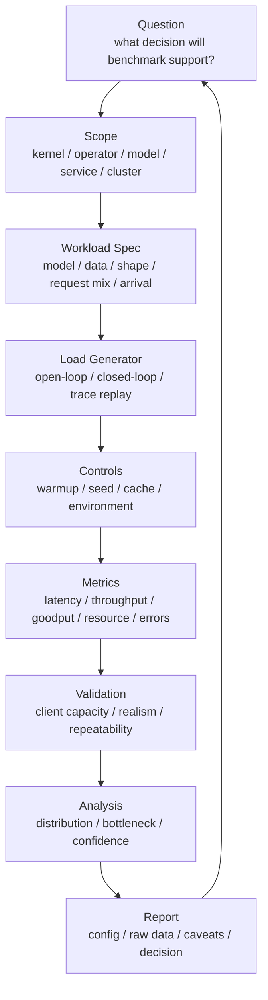

# Benchmark 负载设计与 Trace Replay：从玩具测试到真实 Workload

Benchmark 结果最常见的问题，不是脚本写错，而是 workload 设计错。

常见错误包括：

- 用一个固定 prompt 代表所有推理请求。
- 只测固定并发，不测固定 QPS。
- 只测平均输入长度，不测 p95/p99 长度。
- 只用 synthetic data，不说明它不覆盖真实 data pipeline。
- 只测单模型，不测多模型、多租户、冷热 cache。
- 只测短时间，不测 warmup 后的 steady state。
- 只测峰值吞吐，不测 SLA 下的 goodput。
- 用 client 等响应后再发下一次请求，隐藏了系统过载。
- 忽略真实流量里的突发、重试、取消、超时和长尾请求。

如果 workload 不真实，后面的 latency、throughput、profiler、capacity、energy 结论都会偏。

本篇重点回答：

> 如何设计 AI 系统 benchmark workload，如何构造 prompt/token 分布、到达过程、trace replay、warmup、测量窗口和报告模板，让 benchmark 更接近真实系统，而不是只跑一个好看的玩具测试？

## 一张总图



这张图强调一个原则：

```text
benchmark workload 必须服务于决策问题
```

如果目标是评估 kernel，synthetic shape 可能足够。

如果目标是评估线上推理容量，就必须包含真实请求长度分布、到达过程、缓存状态、错误处理和 SLA。

如果目标是评估训练集群，就必须包含数据读取、checkpoint、通信、故障和调度。

## 先确定 benchmark 层级

不同层级需要不同 workload。

| 层级 | 典型问题 | Workload 重点 |
| --- | --- | --- |
| Kernel | 某个 kernel 是否更快？ | shape、dtype、layout、warmup、重复次数 |
| Operator | attention、GEMM、norm 是否更快？ | 输入分布、batch、sequence length、实现路径 |
| Model | 单模型训练/推理速度怎样？ | 模型、token 分布、precision、batch、cache |
| Service | 在线服务能承载多少流量？ | QPS、并发、arrival process、p99、timeout、routing |
| Cluster | 集群容量和调度是否合理？ | job mix、queue、node pool、storage、network、failures |

错误通常来自层级混淆。

例如：

- 用 kernel benchmark 推断线上 p99。
- 用单请求延迟推断高并发容量。
- 用 synthetic data 训练 step time 推断真实数据流水线。
- 用单节点 benchmark 推断多节点扩展效率。

这些外推都需要额外证据。

## Workload Spec 应该写什么

一个可复现 benchmark 至少要有 workload spec。

推理 workload spec 可以包括：

```text
model:
  name / size / revision / tokenizer / chat template

request:
  input token distribution
  output token distribution
  max tokens
  sampling parameters
  stream or non-stream

arrival:
  fixed concurrency / fixed QPS / Poisson / trace replay
  burst pattern
  duration

cache:
  cold / warm
  prefix cache hit rate
  KV cache initial state

service:
  batch policy
  routing policy
  timeout
  retry
  cancellation

metrics:
  TTFT / TPOT / E2E / goodput / error / resource
```

训练 workload spec 可以包括：

```text
model:
  architecture / params / sequence length / precision

data:
  dataset / shard / synthetic or real / packing / tokenization

batch:
  micro batch / global batch / gradient accumulation

parallelism:
  DP / TP / PP / EP / FSDP / ZeRO

runtime:
  compiler / fusion / activation checkpointing / optimizer

system:
  storage path / checkpoint / eval / failure policy

metrics:
  step time / tokens/s / MFU / scaling efficiency / data stall / checkpoint
```

如果 workload spec 写不清，benchmark 结果就很难复现。

## Synthetic、Sampled 与 Trace Replay

Benchmark workload 大致可以分三类。

### Synthetic Workload

Synthetic workload 是人工构造的负载。

例如：

- 固定 input length。
- 固定 output length。
- 固定 batch size。
- 随机 token。
- synthetic tensor。
- 随机生成图像尺寸。

优点：

- 可控。
- 便于隔离变量。
- 适合 kernel/operator。
- 适合找理论上限。
- 适合快速回归测试。

缺点：

- 容易不代表真实请求。
- 忽略长尾分布。
- 忽略 cache、routing、tokenizer、RAG、agent、I/O。
- 可能让系统走到过于理想的 kernel path。

使用 synthetic workload 时，必须明确写：

```text
this benchmark isolates compute path and does not represent production traffic
```

### Sampled Workload

Sampled workload 从真实分布中抽样，但不保留完整时间序列。

例如：

- 按真实 input/output token 直方图采样。
- 从真实 prompt 集合抽样。
- 按请求类型比例混合。
- 按 cache hit rate 混合。
- 按 RAG 文档数分布采样。

优点：

- 比 synthetic 更真实。
- 仍然容易控制变量。
- 便于扩大或缩小 QPS。

缺点：

- 可能丢失 burst。
- 可能丢失租户相关性。
- 可能丢失同一用户连续对话造成的 prefix/cache 关系。
- 可能丢失 retry 和 cancellation 行为。

Sampled workload 适合大多数离线容量 benchmark。

### Trace Replay

Trace replay 用真实系统采集的请求 trace 回放。

它保留：

- 请求到达时间。
- 请求类型。
- 输入长度。
- 输出长度或 max tokens。
- cache key / prefix key。
- tenant / priority。
- deadline。
- timeout / cancellation。
- error / retry。
- routing 或模型选择。

优点：

- 最接近真实系统。
- 能复现 burst 和长尾。
- 能评估调度、缓存、排队和容量。

缺点：

- trace 采集和脱敏复杂。
- replay 工具要足够强。
- 真实输出长度可能依赖模型版本。
- 不容易做参数 sweep。
- 可能包含历史系统策略造成的偏差。

Trace replay 适合回答：

```text
如果把这段真实流量放到新模型、新引擎、新硬件或新调度策略上，会怎样？
```

## Trace Replay Schema

一个推理 trace 至少建议包含：

```text
request_id
timestamp
model
tenant or workload_class
priority
input_tokens
output_tokens or max_tokens
sampling_params
streaming
prefix_key or cache_group
rag_chunks
tool_call_count
deadline_ms
cancelled
timeout
status
```

如果隐私或安全要求不能保存原始 prompt，可以保存：

- token length。
- hash。
- template type。
- language。
- RAG chunk count。
- image/audio/video size。
- cache key hash。

注意：只保存长度不能复现所有行为。

例如：

- tokenizer path 可能和文本内容有关。
- prefix cache 命中需要 prefix 关系。
- safety/filter 可能和内容有关。
- agent tool call 可能和语义有关。
- speculative decoding 接受率可能和文本分布有关。

如果只能保留长度分布，要在报告中说明局限。

## 到达过程设计

到达过程决定排队行为。

常见模式：

| 模式 | 含义 | 适用场景 |
| --- | --- | --- |
| fixed concurrency | 固定同时 in-flight 请求数 | 交互式 client 数量有限的测试 |
| fixed QPS | 按固定请求速率发送 | 容量曲线、SLA 边界 |
| Poisson arrivals | 按随机到达过程发送 | 模拟独立用户请求 |
| burst | 短时间流量突增 | 峰值、队列和 autoscaling |
| trace replay | 按真实时间戳回放 | 真实流量复现 |
| ramp-up | QPS 逐步升高 | 找 saturation point |

不要只测 fixed concurrency。

Fixed concurrency 会出现一个问题：系统变慢时，client 发请求也会变慢，因此外部到达率自动下降。这会隐藏过载。

对于容量规划，必须测 fixed QPS 或 open-loop load。

## Open-loop 与 Closed-loop

Closed-loop：

```text
send request
wait response
send next request
```

Open-loop：

```text
send requests according to planned arrival times
regardless of previous responses
```

Closed-loop 适合模拟有限用户数。

Open-loop 适合测服务在外部流量压力下是否会排队、超时或崩溃。

两个结果不能混用。

如果一个报告只写“并发 128”，没有写 QPS、到达过程和 client 行为，就很难解释 p99。

## Coordinated Omission

延迟 benchmark 有一个常见陷阱：coordinated omission。

简单说，如果 client 在服务变慢时也停止发请求，那么最糟糕的等待时间不会被正确记录。

例如：

```text
client 每次等响应后再发下一次请求
服务卡住 5 秒
这 5 秒内本该到达的请求没有被发送
报告里只记录了一个慢请求，而不是一批被延迟影响的请求
```

结果是 p99 被低估。

解决思路：

- 使用 open-loop load generator。
- 记录计划发送时间和实际完成时间。
- 对 missed interval 做延迟修正。
- 明确报告 client 行为。

HdrHistogram 社区长期强调 coordinated omission 问题。对 AI 推理服务来说，这个问题尤其重要，因为过载时队列延迟会快速放大。

## 输入/输出长度分布

LLM 推理 benchmark 必须记录 token 长度分布。

至少包括：

```text
input_tokens: p50 / p90 / p95 / p99 / max
output_tokens: p50 / p90 / p95 / p99 / max
total_tokens: p50 / p90 / p95 / p99 / max
```

不要只写平均值。

原因：

- prefill 主要受 input length 影响。
- decode 主要受 output length 和 context length 影响。
- KV Cache 容量受 active sequence 和 context length 影响。
- p99 常由长 prompt 或长输出决定。
- RAG 和 agent 会改变长度分布。

还要保留相关性。

例如：

- 长输入是否通常伴随短输出？
- 某类 tenant 是否更容易有长上下文？
- RAG 请求是否同时更长、更慢、更容易 cache miss？
- 多轮对话是否有 prefix cache 关系？

如果只独立采样 input 和 output，可能破坏真实相关性。

## 请求类型混合

真实服务很少只有一种请求。

常见混合：

- chat。
- code generation。
- summarization。
- RAG。
- agent/tool use。
- structured output。
- batch offline generation。
- embedding。
- reranking。
- image/video/audio multimodal。

不同类型有不同特征：

| 请求类型 | 主要压力 |
| --- | --- |
| short chat | TTFT、调度、decode p99 |
| long context | prefill、KV Cache、HBM |
| code generation | 长输出、decode active set |
| RAG | retrieval latency、长上下文、cache |
| agent | 多轮调用、外部工具等待、deadline |
| embedding | batch throughput、CPU/data path |
| multimodal | preprocessing、encoder、显存 |

Benchmark 应该说明请求类型比例。

如果只用 chat prompt 测服务，却把结果外推到 RAG/agent，就会低估系统复杂度。

## Cache 状态

缓存会显著改变 benchmark。

常见 cache：

- prefix cache。
- KV Cache。
- tokenizer cache。
- model weight cache。
- dataset/page cache。
- local NVMe cache。
- RAG document cache。
- container/image cache。

报告必须说明：

- cold cache 还是 warm cache。
- cache hit rate。
- cache 是否预热。
- cache 是否在测量窗口中稳定。
- cache eviction 是否发生。
- 多 replica cache 是否一致。

例如 prefix cache 命中率从 0% 到 50%，TTFT 可能完全不同。不能把 warm cache 结果当成 cold traffic 容量。

## RAG / Agent Workload

RAG 和 agent 负载不能只当作“普通 LLM 请求”。

RAG 额外包含：

- query rewrite。
- embedding。
- vector search。
- reranking。
- document fetch。
- prompt assembly。
- 更长上下文。
- cache。

Agent 额外包含：

- 多轮模型调用。
- tool latency。
- branch。
- retry。
- deadline。
- 状态读写。
- 外部服务失败。

Benchmark 可以分两类：

### Model-only

只测模型服务本身。

适合优化：

- LLM serving engine。
- batching。
- KV Cache。
- quantization。
- GPU capacity。

### Workflow-level

测端到端 RAG/agent 流程。

适合评估：

- 用户感知延迟。
- p99。
- 外部依赖。
- tool retry。
- cache。
- end-to-end capacity。

两者都需要，但不能混为一谈。

## 训练 Workload 设计

训练 benchmark 也有 workload 真实性问题。

### Synthetic Data

Synthetic data 适合隔离模型计算。

它可以回答：

- forward/backward 是否高效。
- 并行策略是否工作。
- kernel/communication 是否接近上限。

但它不能回答：

- DataLoader 是否供得上。
- tokenization 是否是瓶颈。
- 存储是否抖动。
- dataset shard 是否均衡。
- packing/padding 是否浪费。
- checkpoint 是否影响训练。

如果训练 benchmark 使用 synthetic data，必须明确说明。

### Sequence Length

训练 sequence length 会影响：

- attention 计算。
- activation memory。
- recompute。
- batch size。
- data packing。
- communication。

如果真实训练使用 variable length 或 packing，固定 sequence length benchmark 可能高估或低估真实效率。

### Checkpoint 和 Eval

很多训练 benchmark 只测纯 step time。

真实训练还包括：

- checkpoint save。
- checkpoint upload。
- eval。
- logging。
- failure recovery。
- job restart。

容量模型应至少记录：

```text
pure_step_time
end_to_end_step_time
checkpoint_interval
checkpoint_duration
eval_duration
failure/restart overhead
```

否则训练总时间会被低估。

## 多机与集群 Workload

集群 benchmark 不只是多个单机 benchmark 相加。

要考虑：

- job arrival pattern。
- job size distribution。
- queue policy。
- priority。
- preemption。
- node pool。
- topology。
- storage path。
- network contention。
- multi-tenant interference。
- failure and retry。

例如：

```text
single training job runs well on 128 GPUs
but cluster workload mixes 8-GPU fine-tune, 64-GPU eval, 512-GPU pretrain
queueing and fragmentation become dominant
```

这类问题需要集群级 workload replay，而不是单 job peak benchmark。

## Warmup 与 Measurement Window

AI benchmark 必须区分：

- cold start。
- warmup。
- steady state。
- cooldown。

推理 warmup 可能包括：

- 模型加载。
- CUDA context。
- JIT/compile。
- CUDA Graph capture。
- KV Cache 初始化。
- prefix cache 预热。
- tokenizer cache。

训练 warmup 可能包括：

- DataLoader worker。
- NCCL communicator。
- optimizer state。
- allocator。
- compilation。
- page cache。

测量窗口应该明确：

```text
warmup_duration
measurement_start
measurement_end
cooldown
```

如果目标是 cold start，就要单独报告 cold start。不要把 cold start 混进 steady-state 吞吐。

## Load Generator 也要验证

Benchmark client 本身可能成为瓶颈。

需要确认：

- client CPU 是否打满。
- client network 是否打满。
- client 是否能按计划 QPS 发出请求。
- client 是否记录 planned send time。
- client 是否和 server 时钟同步。
- client 是否产生真实 payload。
- client 是否正确处理 streaming。
- client 是否把 timeout、cancel、error 计入结果。

如果 client 发不出目标 QPS，server benchmark 就不成立。

如果 client 只记录成功请求，不记录失败请求，goodput 和 p99 都会偏。

## 结果应该怎么报告

一个高质量 benchmark 报告至少包含：

```text
Question:
  what decision this benchmark supports

System:
  hardware / software / model / engine / topology

Workload:
  dataset / prompt source / token distribution / request mix

Arrival:
  fixed concurrency / fixed QPS / Poisson / trace replay / burst

Cache:
  cold/warm / hit rate / prewarm / eviction

Run:
  warmup / duration / repetitions / random seed

Client:
  load generator / client resources / client saturation check

Metrics:
  latency / throughput / goodput / error / resource / energy

Distribution:
  p50/p90/p95/p99/max and time series

Caveats:
  what this workload does not represent

Decision:
  ship / tune / rollback / scale / investigate
```

没有 caveats 的 benchmark 很危险。任何 workload 都只代表某个问题空间。

## 常见误区

### 误区一：固定 prompt 可以代表真实推理

固定 prompt 只能用于 smoke test 或局部对比。

真实容量测试必须覆盖长度分布、请求类型、cache、到达过程和错误处理。

### 误区二：平均长度就够了

不够。

p95/p99 长度经常决定 p99 latency、KV Cache 容量和 batch 行为。

### 误区三：只测成功请求

不对。

过载时被拒绝、超时、取消的请求也必须计入。

否则系统可以通过丢请求制造好看的 latency。

### 误区四：client 等响应再发请求更真实

有些场景真实，但不能代表外部固定 QPS 压力。

容量规划需要 open-loop 或 trace replay。

### 误区五：Trace Replay 一定等于真实生产

不一定。

Trace 可能缺少内容、缓存关系、重试、取消、上游行为或模型版本变化。Replay 工具也可能无法复现真实 client 行为。

Trace replay 很有价值，但仍然需要写清限制。

### 误区六：Benchmark 越复杂越好

不对。

Workload 复杂度要匹配问题。

如果只是验证一个 kernel 优化，简单 synthetic shape 更清晰。

如果是推理容量规划，真实 trace 更有价值。

Benchmark 的目标不是复杂，而是可解释。

## 检查清单

设计 workload 前：

- 决策问题是什么？
- Benchmark 层级是什么？
- 需要 synthetic、sampled 还是 trace replay？
- 哪些真实分布必须保留？
- 哪些变量要固定？

运行 benchmark 前：

- 是否记录 input/output token 分布？
- 是否说明 arrival process？
- 是否设置 warmup 和 measurement window？
- 是否确认 load generator 不成为瓶颈？
- 是否记录 cache 状态？
- 是否记录失败、超时和取消？

分析结果时：

- 是否看 p95/p99，而不是只看均值？
- 是否看 time series，而不是只看总体统计？
- 是否区分 throughput 和 goodput？
- 是否说明 workload 不覆盖什么？
- 是否能复现并支撑决策？

## 小结

AI benchmark 的核心不是“跑起来”，而是 workload 是否能代表要回答的问题。

一条实用原则是：

```text
越靠近硬件和 kernel，workload 越要可控；
越靠近线上服务和集群，workload 越要真实。
```

Synthetic workload 用来隔离变量，sampled workload 用来逼近分布，trace replay 用来复现系统行为。三者都重要，但不能互相替代。

当团队把 workload spec、arrival process、cache 状态、warmup、measurement window、client 能力和 caveats 都写清楚后，benchmark 才能从“跑分”变成可复现、可审查、可积累的工程证据。

## 参考资料

- [MLCommons Inference LoadGen](https://github.com/mlcommons/inference/tree/master/loadgen)
- [vLLM Benchmarks](https://docs.vllm.ai/en/latest/contributing/benchmarks.html)
- [NVIDIA GenAI-Perf](https://docs.nvidia.com/deeplearning/triton-inference-server/user-guide/docs/perf_benchmark/genai-perf/README.html)
- [HdrHistogram](https://github.com/HdrHistogram/HdrHistogram)
