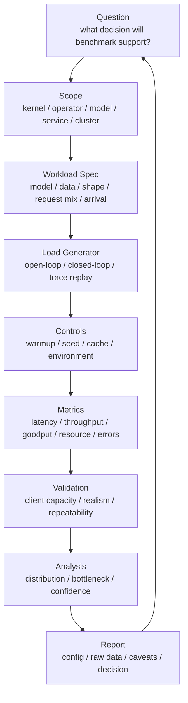

# Benchmark 负载设计与 Trace Replay：从玩具测试到真实 Workload

Benchmark 结果最常见的问题，不是脚本写错，而是 workload 设计错。

常见错误包括：

- 用一个固定 prompt 代表所有推理请求。
- 只测固定并发，不测固定 QPS。
- 只测平均输入长度，不测 p95/p99 长度。
- 只用 synthetic data，不说明它不覆盖真实 data pipeline。
- 只测单模型，不测多模型、多租户、冷热 cache。
- 只测短时间，不测 warmup 后的 steady state。
- 只测峰值吞吐，不测 SLA 下的 goodput。
- 用 client 等响应后再发下一次请求，隐藏了系统过载。
- 忽略真实流量里的突发、重试、取消、超时和长尾请求。

如果 workload 不真实，后面的 latency、throughput、profiler、capacity、energy 结论都会偏。

本篇重点回答：

> 如何设计 AI 系统 benchmark workload，如何构造 prompt/token 分布、到达过程、trace replay、warmup、测量窗口和报告模板，让 benchmark 更接近真实系统，而不是只跑一个好看的玩具测试？

先给出一个判断原则：

```text
Benchmark workload 不是越复杂越好，
而是要足够代表它要支撑的决策。
```

如果目标是验证一个 attention kernel，固定 shape 的 synthetic workload 可能是正确选择。

如果目标是决定线上推理副本数，就必须把请求长度分布、到达过程、cache、失败、超时、取消、SLA 和负载发生器行为写清楚。

如果目标是规划训练集群，就必须把数据 pipeline、checkpoint、eval、通信、故障恢复和调度队列纳入 workload。

## Workload Benchmark Contract

每次 benchmark 前先写一个 Workload Benchmark Contract。

```yaml
question:
  decision: ship | tune | rollback | scale | investigate
  scope: kernel | operator | model | service | cluster
  primary_metric: ...
  guardrail_metrics: ...

system_under_test:
  hardware: ...
  software: ...
  model_or_workflow: ...
  serving_or_training_engine: ...

workload:
  source: synthetic | sampled | trace_replay
  request_or_step_schema: ...
  distribution: ...
  preserved_correlations: ...
  omitted_behavior: ...

arrival:
  mode: fixed_concurrency | fixed_qps | poisson | burst | trace_replay
  target_rate: ...
  duration: ...
  time_scaling: ...

state:
  cache_state: cold | warm | mixed
  prewarm_policy: ...
  random_seed: ...
  environment_state: ...

run:
  warmup: ...
  measurement_window: ...
  repetitions: ...
  load_generator: ...

validity:
  client_capacity_checked: true
  clock_sync_checked: true
  failures_counted: true
  caveats: ...
```

这个 contract 的价值是把 benchmark 从“我跑了一条命令”变成“我定义了一个可复现的实验对象”。后续所有指标、图表、容量推导和性能结论都应该能追溯到这个 contract。

尤其要提前写清三件事：

- **代表什么**：这个 workload 代表真实生产、某类离线任务、某个 kernel shape，还是只代表 smoke test。
- **不代表什么**：没有覆盖多租户、缓存、RAG、重试、长尾、失败、真实数据 pipeline，就必须直接写出来。
- **怎么判定有效**：负载发生器是否足够强，是否达到目标 QPS，是否记录失败请求，是否有稳定测量窗口。

## 一张总图



这张图强调一个原则：

```text
benchmark workload 必须服务于决策问题
```

如果目标是评估 kernel，synthetic shape 可能足够。

如果目标是评估线上推理容量，就必须包含真实请求长度分布、到达过程、缓存状态、错误处理和 SLA。

如果目标是评估训练集群，就必须包含数据读取、checkpoint、通信、故障和调度。

## 先确定 benchmark 层级

不同层级需要不同 workload。

| 层级 | 典型问题 | Workload 重点 |
| --- | --- | --- |
| Kernel | 某个 kernel 是否更快？ | shape、dtype、layout、warmup、重复次数 |
| Operator | attention、GEMM、norm 是否更快？ | 输入分布、batch、sequence length、实现路径 |
| Model | 单模型训练/推理速度怎样？ | 模型、token 分布、precision、batch、cache |
| Service | 在线服务能承载多少流量？ | QPS、并发、arrival process、p99、timeout、routing |
| Cluster | 集群容量和调度是否合理？ | job mix、queue、node pool、storage、network、failures |

错误通常来自层级混淆。

例如：

- 用 kernel benchmark 推断线上 p99。
- 用单请求延迟推断高并发容量。
- 用 synthetic data 训练 step time 推断真实数据流水线。
- 用单节点 benchmark 推断多节点扩展效率。

这些外推都需要额外证据。

## Workload Spec 应该写什么

一个可复现 benchmark 至少要有 workload spec。

推理 workload spec 可以包括：

```text
model:
  name / size / revision / tokenizer / chat template

request:
  input token distribution
  output token distribution
  max tokens
  sampling parameters
  stream or non-stream

arrival:
  fixed concurrency / fixed QPS / Poisson / trace replay
  burst pattern
  duration

cache:
  cold / warm
  prefix cache hit rate
  KV cache initial state

service:
  batch policy
  routing policy
  timeout
  retry
  cancellation

metrics:
  TTFT / TPOT / E2E / goodput / error / resource
```

训练 workload spec 可以包括：

```text
model:
  architecture / params / sequence length / precision

data:
  dataset / shard / synthetic or real / packing / tokenization

batch:
  micro batch / global batch / gradient accumulation

parallelism:
  DP / TP / PP / EP / FSDP / ZeRO

runtime:
  compiler / fusion / activation checkpointing / optimizer

system:
  storage path / checkpoint / eval / failure policy

metrics:
  step time / tokens/s / MFU / scaling efficiency / data stall / checkpoint
```

如果 workload spec 写不清，benchmark 结果就很难复现。

### Spec 要保留相关性

很多 workload spec 的问题不是字段少，而是把真实相关性打散了。

例如真实流量里可能存在：

- 长输入通常来自 RAG，请求还会访问向量库和 reranker。
- 代码生成请求通常输出更长，decode 阶段压力更大。
- 同一 tenant 的请求共享 prefix cache。
- 高优先级请求有更短 timeout。
- 多轮 agent 请求中，下一轮是否出现取决于上一轮 tool 结果。
- 多模态请求的图像尺寸、文本长度和 encoder 负载相关。

如果 benchmark 只独立采样 input length 和 output length，就可能构造出生产中很少出现的组合，也可能丢掉真实最难处理的组合。

更好的写法是：

```text
request_class:
  class_name
  probability
  input_length_distribution
  output_length_distribution
  correlation(input_len, output_len)
  cache_behavior
  deadline
  external_dependencies
```

这样可以在保持可控的同时保留关键结构。

### Spec 要区分 workload 和 policy

Workload 是外部世界给系统的输入；policy 是系统如何处理输入。

例如：

| 类型 | 例子 |
| --- | --- |
| workload | 请求何时到达、prompt 多长、用户何时取消、RAG 文档数 |
| policy | batch size、调度策略、路由策略、prefix cache 开关、timeout 设置 |

做 A/B 对比时，应该尽量保持 workload 不变，只改变 policy 或系统实现。否则你不知道性能差异来自新系统，还是来自测试流量本身不同。

## Synthetic、Sampled 与 Trace Replay

Benchmark workload 大致可以分三类。

### Synthetic Workload

Synthetic workload 是人工构造的负载。

例如：

- 固定 input length。
- 固定 output length。
- 固定 batch size。
- 随机 token。
- synthetic tensor。
- 随机生成图像尺寸。

优点：

- 可控。
- 便于隔离变量。
- 适合 kernel/operator。
- 适合找理论上限。
- 适合快速回归测试。

缺点：

- 容易不代表真实请求。
- 忽略长尾分布。
- 忽略 cache、routing、tokenizer、RAG、agent、I/O。
- 可能让系统走到过于理想的 kernel path。

使用 synthetic workload 时，必须明确写：

```text
this benchmark isolates compute path and does not represent production traffic
```

Synthetic workload 最适合回答“局部机制是否变好”：

- 新 kernel 的 bandwidth 或 FLOPs 是否更接近上限。
- 某个 batch size 是否触发更好的 GEMM shape。
- CUDA Graph、Triton kernel、Inductor 编译是否稳定。
- 同一输入形状下，before/after 是否存在性能回归。

但它不适合直接回答：

- 线上 p99 会不会变好。
- 总副本数可以减少多少。
- cache 命中率变化后容量如何。
- 多租户和突发流量下是否稳定。

报告里可以把 synthetic workload 写成“实验台”，而不是“真实世界”。

### Sampled Workload

Sampled workload 从真实分布中抽样，但不保留完整时间序列。

例如：

- 按真实 input/output token 直方图采样。
- 从真实 prompt 集合抽样。
- 按请求类型比例混合。
- 按 cache hit rate 混合。
- 按 RAG 文档数分布采样。

优点：

- 比 synthetic 更真实。
- 仍然容易控制变量。
- 便于扩大或缩小 QPS。

缺点：

- 可能丢失 burst。
- 可能丢失租户相关性。
- 可能丢失同一用户连续对话造成的 prefix/cache 关系。
- 可能丢失 retry 和 cancellation 行为。

Sampled workload 适合大多数离线容量 benchmark。

Sampled workload 的关键是说明采样方法：

```text
sample_source:
  production logs, last 7 days

sample_unit:
  request

stratification:
  request_class / tenant / model / hour_of_day

sampling_method:
  uniform / weighted / stratified / tail oversampling

scale:
  replay at 0.5x / 1x / 2x target QPS
```

如果真实生产里长尾请求很少但影响很大，可以做 tail oversampling，但必须说明权重。否则 p99、KV Cache、显存和排队结果会被误解。

### Trace Replay

Trace replay 用真实系统采集的请求 trace 回放。

它保留：

- 请求到达时间。
- 请求类型。
- 输入长度。
- 输出长度或 max tokens。
- cache key / prefix key。
- tenant / priority。
- deadline。
- timeout / cancellation。
- error / retry。
- routing 或模型选择。

优点：

- 最接近真实系统。
- 能复现 burst 和长尾。
- 能评估调度、缓存、排队和容量。

缺点：

- trace 采集和脱敏复杂。
- replay 工具要足够强。
- 真实输出长度可能依赖模型版本。
- 不容易做参数 sweep。
- 可能包含历史系统策略造成的偏差。

Trace replay 适合回答：

```text
如果把这段真实流量放到新模型、新引擎、新硬件或新调度策略上，会怎样？
```

Trace replay 最重要的是“保真度”。它至少有三个层次：

| 层次 | 保留内容 | 能回答的问题 |
| --- | --- | --- |
| Length replay | token 长度、请求类型 | 粗略容量和阶段压力 |
| Event replay | 到达时间、状态、timeout、cancel、retry | 排队、过载、goodput |
| State-aware replay | prefix/cache 关系、tenant、session、外部依赖 | 调度、缓存、多租户和端到端流程 |

保真度越高，隐私、脱敏、工具复杂度和解释成本也越高。不要把 trace replay 当成自动正确，它仍然需要校验 replay 工具和 trace 字段是否覆盖了要回答的问题。

### Workload Realism Ladder

可以把 workload 真实性看成一条阶梯：

```text
fixed shape smoke test
  -> synthetic distribution
  -> sampled production distribution
  -> trace replay without state
  -> state-aware trace replay
  -> shadow traffic / canary
```

越往右越真实，但越难控制变量。工程上通常需要多层组合：

- 用 fixed shape 快速发现明显回归。
- 用 sampled workload 做日常容量曲线。
- 用 trace replay 验证上线前风险。
- 用 canary/production monitoring 校准 benchmark 假设。

## Trace Replay Schema

一个推理 trace 至少建议包含：

```text
request_id
timestamp
model
tenant or workload_class
priority
input_tokens
output_tokens or max_tokens
sampling_params
streaming
prefix_key or cache_group
rag_chunks
tool_call_count
deadline_ms
cancelled
timeout
status
```

如果隐私或安全要求不能保存原始 prompt，可以保存：

- token length。
- hash。
- template type。
- language。
- RAG chunk count。
- image/audio/video size。
- cache key hash。

注意：只保存长度不能复现所有行为。

例如：

- tokenizer path 可能和文本内容有关。
- prefix cache 命中需要 prefix 关系。
- safety/filter 可能和内容有关。
- agent tool call 可能和语义有关。
- speculative decoding 接受率可能和文本分布有关。

如果只能保留长度分布，要在报告中说明局限。

### Trace Replay 的时间语义

Trace 中的 `timestamp` 不只是排序字段，它决定队列行为。

至少要说明：

```text
timestamp_meaning:
  client_planned_send_time
  server_receive_time
  scheduler_enqueue_time
  first_token_time
  completion_time
```

如果只有 server receive time，就不能完全复现用户侧等待；如果只有 completion time，就很难还原到达过程；如果没有 planned send time，就容易低估 coordinated omission。

回放时还要说明时间缩放：

```text
time_scale = 1.0   # 原速回放
time_scale = 2.0   # 压缩时间，相当于提高 QPS
time_scale = 0.5   # 拉长时间，相当于降低 QPS
```

时间缩放可以用于容量曲线，但不能随便改变 inter-arrival correlation。真实 burst、tenant 同步行为、agent 多轮调用间隔都可能依赖时间结构。

### Trace 脱敏与隐私

生产 trace 往往不能保存原始 prompt、文档、图片或音频。可替代字段包括：

| 原始信息 | 可替代字段 |
| --- | --- |
| prompt 文本 | token length、template type、language、content hash |
| 用户身份 | tenant class、priority、匿名 session id |
| RAG 文档 | chunk count、chunk token length、doc hash |
| 图片 | width、height、patch/token 数、encoder type |
| tool call | tool class、latency bucket、status |
| prefix | prefix hash、cache group、prefix token length |

但脱敏会降低可复现性。比如只保留 token length，无法复现 tokenizer CPU 路径、prefix cache 关系、speculative decoding 接受率、safety 过滤和语义相关的 tool branch。

因此 trace 报告要写：

```text
trace_privacy_policy:
  raw_content: not stored
  preserved: token length, request class, prefix hash
  lost: semantic branch behavior, exact tokenizer path
```

不要把脱敏后的 length replay 说成完整真实流量。

### 推理 Trace 示例

一个更完整的推理 trace event 可以像这样：

```json
{
  "request_id": "r-001",
  "session_id_hash": "s-abc",
  "timestamp_ms": 1710000000123,
  "planned_send_time_ms": 1710000000100,
  "model": "llm-a",
  "tenant_class": "interactive",
  "priority": "normal",
  "request_class": "rag_chat",
  "input_tokens": 2840,
  "max_output_tokens": 512,
  "observed_output_tokens": 274,
  "streaming": true,
  "sampling": {
    "temperature": 0.7,
    "top_p": 0.95
  },
  "cache": {
    "prefix_key_hash": "p-123",
    "expected_prefix_hit": true
  },
  "rag": {
    "chunk_count": 6,
    "chunk_tokens": 2100
  },
  "deadline_ms": 30000,
  "status": "success"
}
```

字段不一定要完全相同，但要能支撑你要分析的问题。如果要分析 prefix cache，就必须保留 prefix 关系；如果要分析 p99，就必须保留失败、超时和取消。

## 到达过程设计

到达过程决定排队行为。

常见模式：

| 模式 | 含义 | 适用场景 |
| --- | --- | --- |
| fixed concurrency | 固定同时 in-flight 请求数 | 交互式 client 数量有限的测试 |
| fixed QPS | 按固定请求速率发送 | 容量曲线、SLA 边界 |
| Poisson arrivals | 按随机到达过程发送 | 模拟独立用户请求 |
| burst | 短时间流量突增 | 峰值、队列和 autoscaling |
| trace replay | 按真实时间戳回放 | 真实流量复现 |
| ramp-up | QPS 逐步升高 | 找 saturation point |

不要只测 fixed concurrency。

Fixed concurrency 会出现一个问题：系统变慢时，client 发请求也会变慢，因此外部到达率自动下降。这会隐藏过载。

对于容量规划，必须测 fixed QPS 或 open-loop load。

### 阶梯压测与突发压测

容量测试通常至少需要两种到达过程。

阶梯压测：

```text
QPS: 20 -> 40 -> 60 -> 80 -> 100
each step: warmup + measurement window
record: throughput, goodput, p99, queue, error
```

它用于找 saturation point 和 SLA 拐点。

突发压测：

```text
baseline QPS: 50
burst QPS: 150
burst duration: 30s
recovery window: 5min
```

它用于观察队列是否能恢复、autoscaling 是否太慢、cache 是否被冲垮、p99 是否长期退化。

真实系统还可能有日周期、租户同步峰值、批处理任务集中提交、agent workflow fan-out 等模式。Benchmark 不一定要全部覆盖，但报告要说明覆盖了什么。

## Open-loop 与 Closed-loop

Closed-loop：

```text
send request
wait response
send next request
```

Open-loop：

```text
send requests according to planned arrival times
regardless of previous responses
```

Closed-loop 适合模拟有限用户数。

Open-loop 适合测服务在外部流量压力下是否会排队、超时或崩溃。

两个结果不能混用。

如果一个报告只写“并发 128”，没有写 QPS、到达过程和 client 行为，就很难解释 p99。

### Planned Time 和 Observed Time

Open-loop benchmark 应该区分：

```text
planned_send_time: 负载计划发出请求的时间
actual_send_time: client 实际发出请求的时间
server_receive_time: server 收到请求的时间
first_token_time: 首 token 返回时间
completion_time: 请求完成时间
```

如果 `actual_send_time` 明显晚于 `planned_send_time`，说明 client 可能已经成为瓶颈。此时 server 结果不可信。

延迟也可以分成：

```text
client_scheduling_delay = actual_send_time - planned_send_time
network_and_queue_delay = server_receive_time - actual_send_time
ttft = first_token_time - actual_send_time
e2e_latency = completion_time - actual_send_time
planned_latency = completion_time - planned_send_time
```

如果要避免 coordinated omission，很多情况下要看 `planned_latency`，因为它把“本该到达但被 client 延迟发送”的等待也体现出来。

## Coordinated Omission

延迟 benchmark 有一个常见陷阱：coordinated omission。

简单说，如果 client 在服务变慢时也停止发请求，那么最糟糕的等待时间不会被正确记录。

例如：

```text
client 每次等响应后再发下一次请求
服务卡住 5 秒
这 5 秒内本该到达的请求没有被发送
报告里只记录了一个慢请求，而不是一批被延迟影响的请求
```

结果是 p99 被低估。

解决思路：

- 使用 open-loop load generator。
- 记录计划发送时间和实际完成时间。
- 对 missed interval 做延迟修正。
- 明确报告 client 行为。

HdrHistogram 社区长期强调 coordinated omission 问题。对 AI 推理服务来说，这个问题尤其重要，因为过载时队列延迟会快速放大。

### Throughput、Offered Load 与 Goodput

Workload 设计还要区分三个概念：

```text
offered_load:
  外部计划施加到系统的请求速率

throughput:
  系统实际完成的请求或 token 速率

goodput:
  满足 SLA 且成功完成的有效请求或 token 速率
```

过载时可能出现：

```text
offered_load increases
throughput plateaus
goodput drops
p99 and errors rise
```

这才是容量边界。只看 throughput 可能看不到服务已经开始丢请求、超时或超过 SLA。

## 输入/输出长度分布

LLM 推理 benchmark 必须记录 token 长度分布。

至少包括：

```text
input_tokens: p50 / p90 / p95 / p99 / max
output_tokens: p50 / p90 / p95 / p99 / max
total_tokens: p50 / p90 / p95 / p99 / max
```

不要只写平均值。

原因：

- prefill 主要受 input length 影响。
- decode 主要受 output length 和 context length 影响。
- KV Cache 容量受 active sequence 和 context length 影响。
- p99 常由长 prompt 或长输出决定。
- RAG 和 agent 会改变长度分布。

还要保留相关性。

例如：

- 长输入是否通常伴随短输出？
- 某类 tenant 是否更容易有长上下文？
- RAG 请求是否同时更长、更慢、更容易 cache miss？
- 多轮对话是否有 prefix cache 关系？

如果只独立采样 input 和 output，可能破坏真实相关性。

### 长度分桶

建议按长度分桶报告指标，而不是只给全局 p99。

例如：

| Bucket | 输入长度 | 输出长度 | 关注点 |
| --- | --- | --- | --- |
| short chat | <= 512 | <= 256 | TTFT、调度、decode p99 |
| medium | 512-4k | 256-1k | mixed prefill/decode |
| long context | 4k-32k | <= 512 | prefill、KV Cache、HBM |
| long generation | <= 2k | > 1k | decode active set、TPOT |
| extreme | p99+ | any | tail latency、OOM、eviction |

这样可以避免一个常见问题：总体 p99 看起来还好，但 long context bucket 已经不可用。

### 输出长度的可控性

真实输出长度通常不是一个独立输入，而是模型根据 prompt、采样参数、stop condition 和 max tokens 生成的结果。

Benchmark 可以有两种做法：

- 固定 `max_tokens`，观察模型自然停止。
- 使用合成输出长度控制，强制 decode 指定 token 数。

前者更真实，但结果会受模型版本和 prompt 内容影响；后者更可控，但不代表真实用户输出。报告中要说明是哪一种。

## 请求类型混合

真实服务很少只有一种请求。

常见混合：

- chat。
- code generation。
- summarization。
- RAG。
- agent/tool use。
- structured output。
- batch offline generation。
- embedding。
- reranking。
- image/video/audio multimodal。

不同类型有不同特征：

| 请求类型 | 主要压力 |
| --- | --- |
| short chat | TTFT、调度、decode p99 |
| long context | prefill、KV Cache、HBM |
| code generation | 长输出、decode active set |
| RAG | retrieval latency、长上下文、cache |
| agent | 多轮调用、外部工具等待、deadline |
| embedding | batch throughput、CPU/data path |
| multimodal | preprocessing、encoder、显存 |

Benchmark 应该说明请求类型比例。

如果只用 chat prompt 测服务，却把结果外推到 RAG/agent，就会低估系统复杂度。

### 多模态请求

多模态 workload 不能只写“input tokens”。

还要记录：

- 图像数量、分辨率、patch/token 数。
- 音频时长、采样率、chunk 策略。
- 视频帧数、分辨率、抽帧策略。
- encoder 是否和 LLM 同卡。
- preprocessing 是否在 CPU、GPU 或独立服务。
- 多模态 embedding 是否 cache。

多模态请求的瓶颈可能在 encoder、preprocessing、显存峰值、PCIe/NVLink 拷贝、CPU 解码，也可能在后续 LLM decode。把它们折算成一个“prompt length”通常不够。

## Cache 状态

缓存会显著改变 benchmark。

常见 cache：

- prefix cache。
- KV Cache。
- tokenizer cache。
- model weight cache。
- dataset/page cache。
- local NVMe cache。
- RAG document cache。
- container/image cache。

报告必须说明：

- cold cache 还是 warm cache。
- cache hit rate。
- cache 是否预热。
- cache 是否在测量窗口中稳定。
- cache eviction 是否发生。
- 多 replica cache 是否一致。

例如 prefix cache 命中率从 0% 到 50%，TTFT 可能完全不同。不能把 warm cache 结果当成 cold traffic 容量。

### Cache 预热策略

报告中建议明确：

```text
cache_state:
  cold: measurement starts after cache cleared
  warm: measurement starts after prewarm workload
  production-like: hit/miss mixed according to trace

prewarm:
  duration
  workload
  target hit rate
  eviction observed or not
```

如果 cache 在测量窗口中持续升温，前半段和后半段结果会不同。此时最好把 time series 和 hit rate 曲线放进报告，不要只给整体平均值。

### Cache 和路由的关系

Prefix cache、KV Cache 和本地数据 cache 往往与路由策略绑定。

例如：

- sticky routing 提高 cache hit rate，但可能造成负载不均。
- round-robin 路由负载均匀，但 cache hit rate 下降。
- 多副本扩容会稀释本地 cache。
- 故障转移会把 warm traffic 打到 cold replica。

因此 cache benchmark 不要只测单 replica。若目标是线上容量，至少要说明 routing policy 和 cache locality。

## RAG / Agent Workload

RAG 和 agent 负载不能只当作“普通 LLM 请求”。

RAG 额外包含：

- query rewrite。
- embedding。
- vector search。
- reranking。
- document fetch。
- prompt assembly。
- 更长上下文。
- cache。

Agent 额外包含：

- 多轮模型调用。
- tool latency。
- branch。
- retry。
- deadline。
- 状态读写。
- 外部服务失败。

Benchmark 可以分两类：

### Model-only

只测模型服务本身。

适合优化：

- LLM serving engine。
- batching。
- KV Cache。
- quantization。
- GPU capacity。

### Workflow-level

测端到端 RAG/agent 流程。

适合评估：

- 用户感知延迟。
- p99。
- 外部依赖。
- tool retry。
- cache。
- end-to-end capacity。

两者都需要，但不能混为一谈。

### Workflow Trace

RAG/agent trace 最好记录 workflow graph，而不只是最终 LLM 请求。

例如：

```text
workflow_id
  request_arrival
  retrieval_start/end
  rerank_start/end
  llm_prefill_start
  first_token
  tool_call_start/end
  second_llm_call
  completion
```

这样才能区分：

- LLM 服务慢。
- 检索慢。
- reranker 慢。
- tool 慢。
- 外部系统失败导致 retry。
- deadline 太短导致取消。

如果只测 model-only，可以优化 GPU serving engine；如果要回答用户体验和端到端容量，就必须测 workflow-level。

## 训练 Workload 设计

训练 benchmark 也有 workload 真实性问题。

### Synthetic Data

Synthetic data 适合隔离模型计算。

它可以回答：

- forward/backward 是否高效。
- 并行策略是否工作。
- kernel/communication 是否接近上限。

但它不能回答：

- DataLoader 是否供得上。
- tokenization 是否是瓶颈。
- 存储是否抖动。
- dataset shard 是否均衡。
- packing/padding 是否浪费。
- checkpoint 是否影响训练。

如果训练 benchmark 使用 synthetic data，必须明确说明。

Synthetic data 还要说明是否保留了真实 shape：

```text
synthetic_tensor_same_shape_as_real_batch
synthetic_tokens_same_length_distribution_as_real_data
synthetic_random_fixed_sequence_length
```

三者差别很大。固定 sequence length 可以让 kernel 更整齐，但真实训练里的 packing、padding、document boundary 和 variable length 会改变显存、attention、通信和 DataLoader 行为。

### Sequence Length

训练 sequence length 会影响：

- attention 计算。
- activation memory。
- recompute。
- batch size。
- data packing。
- communication。

如果真实训练使用 variable length 或 packing，固定 sequence length benchmark 可能高估或低估真实效率。

建议同时报告：

```text
raw_tokens
packed_tokens
loss_tokens
padding_tokens
effective_token_ratio = loss_tokens / processed_tokens
```

因为系统吞吐高不等于有效训练 token 高。如果 padding 很多或 packing 策略不合理，tokens/s 可能好看，但有效训练进展不一定好。

### Checkpoint 和 Eval

很多训练 benchmark 只测纯 step time。

真实训练还包括：

- checkpoint save。
- checkpoint upload。
- eval。
- logging。
- failure recovery。
- job restart。

容量模型应至少记录：

```text
pure_step_time
end_to_end_step_time
checkpoint_interval
checkpoint_duration
eval_duration
failure/restart overhead
```

否则训练总时间会被低估。

### Data Pipeline

训练 workload 还要覆盖数据路径。

至少记录：

- dataset shard 数量和大小。
- 数据源：对象存储、并行文件系统、本地 NVMe、缓存。
- tokenization 是否在线做。
- packing 是否在线做。
- DataLoader worker 数。
- prefetch depth。
- page cache / dataset cache 状态。
- 是否有数据增强或过滤。

常见现象是 synthetic data 下 GPU 很满，真实数据下 GPU 周期性等待。此时瓶颈不是模型计算，而是数据管线。

### 训练 Trace 示例

训练 trace 可以按 step 或 window 记录：

```json
{
  "job_id": "train-001",
  "step": 1200,
  "timestamp_ms": 1710000000000,
  "global_batch": 2048,
  "sequence_length": 8192,
  "raw_tokens": 16777216,
  "loss_tokens": 15100000,
  "padding_tokens": 1677216,
  "step_time_ms": 1320,
  "data_wait_ms": 80,
  "forward_backward_ms": 980,
  "optimizer_ms": 120,
  "communication_ms": 140,
  "checkpoint_active": false,
  "eval_active": false,
  "failure_recovery": false
}
```

如果要做训练容量建模，step trace 比单个平均 step time 更有价值，因为它能看出 data stall、checkpoint、通信、eval 和故障恢复的占比。

## 多机与集群 Workload

集群 benchmark 不只是多个单机 benchmark 相加。

要考虑：

- job arrival pattern。
- job size distribution。
- queue policy。
- priority。
- preemption。
- node pool。
- topology。
- storage path。
- network contention。
- multi-tenant interference。
- failure and retry。

例如：

```text
single training job runs well on 128 GPUs
but cluster workload mixes 8-GPU fine-tune, 64-GPU eval, 512-GPU pretrain
queueing and fragmentation become dominant
```

这类问题需要集群级 workload replay，而不是单 job peak benchmark。

### 集群 Job Trace

集群 workload trace 至少应记录：

```text
job_id
submit_time
start_time
end_time
job_type: pretrain / finetune / eval / inference / notebook / batch
requested_gpus
requested_nodes
gpu_type
duration
priority
queue
preemptible
checkpoint_interval
failure_count
retry_count
node_pool
placement_constraints
```

它可以回答：

- 队列等待是否超过训练本身。
- GPU 碎片是否导致大 job 长时间 pending。
- 多租户混部是否影响在线推理。
- 某些 job 类型是否制造网络、存储或功耗热点。
- preemption 是否节省资源，还是制造大量重启成本。

如果集群 benchmark 只回放 GPU 数和 duration，而不保留 job size、priority、queue 和拓扑约束，就很难分析调度策略。

## Warmup 与 Measurement Window

AI benchmark 必须区分：

- cold start。
- warmup。
- steady state。
- cooldown。

推理 warmup 可能包括：

- 模型加载。
- CUDA context。
- JIT/compile。
- CUDA Graph capture。
- KV Cache 初始化。
- prefix cache 预热。
- tokenizer cache。

训练 warmup 可能包括：

- DataLoader worker。
- NCCL communicator。
- optimizer state。
- allocator。
- compilation。
- page cache。

测量窗口应该明确：

```text
warmup_duration
measurement_start
measurement_end
cooldown
```

如果目标是 cold start，就要单独报告 cold start。不要把 cold start 混进 steady-state 吞吐。

### 稳态窗口不能只凭感觉

稳态窗口最好有可验证条件：

```text
steady_state_criteria:
  throughput variance within threshold
  p99 not drifting upward
  GPU clocks stable
  temperature stable
  cache hit rate stable
  queue length not monotonically increasing
  no new error mode appears
```

如果队列长度持续增长，即使吞吐看起来很高，也不是稳态；如果 cache hit rate 持续上升，前后窗口代表的 workload 状态也不同。

### 多次重复与随机种子

Workload 中可能有随机抽样、采样参数、到达过程和调度非确定性。

报告中应记录：

```text
random_seed
sample_set_id
trace_version
repetition_id
```

如果不同 repetition 差异很大，要先解释方差来源，再做结论。不要只挑最好的 run。

## Load Generator 也要验证

Benchmark client 本身可能成为瓶颈。

需要确认：

- client CPU 是否打满。
- client network 是否打满。
- client 是否能按计划 QPS 发出请求。
- client 是否记录 planned send time。
- client 是否和 server 时钟同步。
- client 是否产生真实 payload。
- client 是否正确处理 streaming。
- client 是否把 timeout、cancel、error 计入结果。

如果 client 发不出目标 QPS，server benchmark 就不成立。

如果 client 只记录成功请求，不记录失败请求，goodput 和 p99 都会偏。

### Load Generator 校验方法

负载发生器至少要做四类校验。

第一，空跑校验：

```text
load generator -> mock server
```

确认 client 能发出目标 QPS，planned send time 和 actual send time 差距可接受。

第二，带 payload 校验：

```text
真实 payload / tokenization / streaming parser
```

确认 client 生成请求、解析流式响应、写日志不会成为瓶颈。

第三，多 client 校验：

```text
client sharding
clock sync
dedup request id
merged result consistency
```

如果一个 client 发不出目标 QPS，需要多 client 分摊，但多 client 会引入时钟同步和结果合并问题。

第四，失败路径校验：

```text
timeout
cancel
connection reset
server error
partial streaming response
```

确认失败请求也会进入统计，不能只记录成功响应。

### 负载发生器不是标准本身

MLCommons LoadGen、NVIDIA GenAI-Perf/AIPerf、vLLM benchmark CLI、Triton perf analyzer、wrk/wrk2、Locust、k6 等工具都可以用于不同场景。

但工具不是结论本身。无论用哪个工具，都要说明：

- 它支持 open-loop 还是 closed-loop。
- 是否支持 planned send time。
- 是否支持流式响应。
- 是否记录失败、取消和超时。
- 是否能生成真实 payload。
- 是否支持 trace replay。
- client 自身是否经过容量校验。

## 结果应该怎么报告

一个高质量 benchmark 报告至少包含：

```text
Question:
  what decision this benchmark supports

System:
  hardware / software / model / engine / topology

Workload:
  dataset / prompt source / token distribution / request mix

Arrival:
  fixed concurrency / fixed QPS / Poisson / trace replay / burst

Cache:
  cold/warm / hit rate / prewarm / eviction

Run:
  warmup / duration / repetitions / random seed

Client:
  load generator / client resources / client saturation check

Metrics:
  latency / throughput / goodput / error / resource / energy

Distribution:
  p50/p90/p95/p99/max and time series

Raw Data:
  request-level or step-level logs
  trace version
  load generator logs
  server metrics
  profiler links, if any

Caveats:
  what this workload does not represent

Decision:
  ship / tune / rollback / scale / investigate
```

没有 caveats 的 benchmark 很危险。任何 workload 都只代表某个问题空间。

### 报告里的图

高质量报告通常至少包含：

- offered load vs throughput vs goodput。
- QPS 或 concurrency vs p50/p95/p99 latency。
- request length bucket vs latency。
- time series：throughput、queue、p99、error、GPU utilization、cache hit rate。
- cache hit/miss 分组结果。
- 失败、超时、取消的比例。
- client planned send delay。
- steady-state window 标记。

如果只有一个最终平均值，通常不足以支撑容量或上线决策。

## 常见误区

### 误区一：固定 prompt 可以代表真实推理

固定 prompt 只能用于 smoke test 或局部对比。

真实容量测试必须覆盖长度分布、请求类型、cache、到达过程和错误处理。

### 误区二：平均长度就够了

不够。

p95/p99 长度经常决定 p99 latency、KV Cache 容量和 batch 行为。

### 误区三：只测成功请求

不对。

过载时被拒绝、超时、取消的请求也必须计入。

否则系统可以通过丢请求制造好看的 latency。

### 误区四：client 等响应再发请求更真实

有些场景真实，但不能代表外部固定 QPS 压力。

容量规划需要 open-loop 或 trace replay。

### 误区五：Trace Replay 一定等于真实生产

不一定。

Trace 可能缺少内容、缓存关系、重试、取消、上游行为或模型版本变化。Replay 工具也可能无法复现真实 client 行为。

Trace replay 很有价值，但仍然需要写清限制。

### 误区六：Benchmark 越复杂越好

不对。

Workload 复杂度要匹配问题。

如果只是验证一个 kernel 优化，简单 synthetic shape 更清晰。

如果是推理容量规划，真实 trace 更有价值。

Benchmark 的目标不是复杂，而是可解释。

## 检查清单

设计 workload 前：

- 是否写了 Workload Benchmark Contract？
- 决策问题是什么？
- Benchmark 层级是什么？
- 需要 synthetic、sampled 还是 trace replay？
- 哪些真实分布必须保留？
- 哪些变量要固定？
- 是否写清这个 workload 不代表什么？

运行 benchmark 前：

- 是否记录 input/output token 分布？
- 是否保留 input/output 相关性？
- 是否说明 arrival process？
- 是否设置 warmup 和 measurement window？
- 是否确认 load generator 不成为瓶颈？
- 是否记录 cache 状态？
- 是否记录失败、超时和取消？
- 是否记录 planned send time 和 actual send time？
- 多 client 时是否做了时钟同步和结果合并校验？

分析结果时：

- 是否看 p95/p99，而不是只看均值？
- 是否看 time series，而不是只看总体统计？
- 是否区分 throughput 和 goodput？
- 是否说明 workload 不覆盖什么？
- 是否能复现并支撑决策？
- 是否按请求类型、长度 bucket、cache hit/miss 分组？
- 是否确认 steady-state 窗口内队列没有持续增长？
- 是否保留 raw logs、trace version 和 run manifest？

## 小结

AI benchmark 的核心不是“跑起来”，而是 workload 是否能代表要回答的问题。

一条实用原则是：

```text
越靠近硬件和 kernel，workload 越要可控；
越靠近线上服务和集群，workload 越要真实。
```

Synthetic workload 用来隔离变量，sampled workload 用来逼近分布，trace replay 用来复现系统行为。三者都重要，但不能互相替代。

当团队把 workload spec、arrival process、cache 状态、warmup、measurement window、client 能力和 caveats 都写清楚后，benchmark 才能从“跑分”变成可复现、可审查、可积累的工程证据。

## 参考资料

- [MLCommons Inference LoadGen](https://github.com/mlcommons/inference/tree/master/loadgen)
- [vLLM Benchmark CLI](https://docs.vllm.ai/en/latest/benchmarking/cli/)
- [NVIDIA GenAI-Perf](https://docs.nvidia.com/deeplearning/triton-inference-server/user-guide/docs/client/src/c%2B%2B/perf_analyzer/genai-perf/README.html)
- [NVIDIA AIPerf](https://github.com/triton-inference-server/aiperf)
- [HdrHistogram](https://github.com/HdrHistogram/HdrHistogram)
