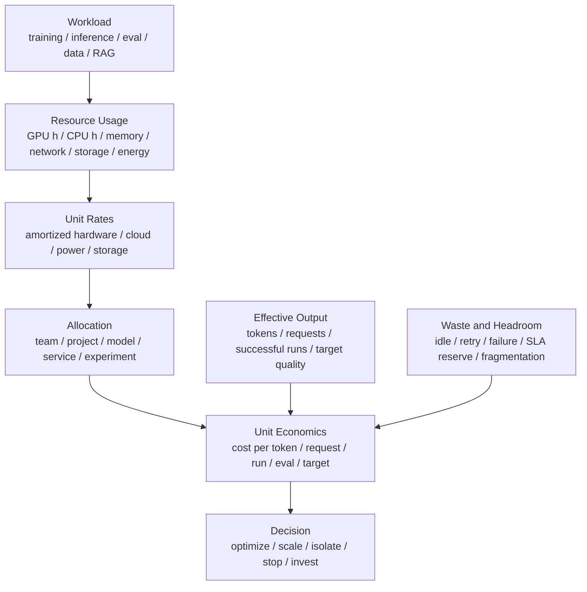

# 成本模型与单位经济性：Cost per Token、GPU Hour 与有效产出

AI 系统里的“更快”不一定等于“更便宜”。

常见误判包括：

- 只看 GPU hour，不看有效 token。
- 只看推理吞吐，不看 SLA 下的 goodput。
- 只看训练主任务，不算失败重跑、评测、checkpoint、数据处理。
- 只看 GPU 成本，不算 CPU、内存、网络、存储、电力、冷却和工程排障。
- 只看平均成本，不看 p99、空闲冗余和峰值容量。
- 只看模型服务，不看 RAG、agent、embedding、rerank、tool call 的全链路成本。
- 只看单次实验成本，不看成功实验成本。
- 只按团队或 namespace 分摊成本，无法归因到模型、服务、实验、数据集和 workload。

成本模型的目标不是简单省钱，而是回答：

> 在满足质量、SLA、可靠性和研发速度的前提下，每单位有效产出到底花了多少资源和多少钱？哪些成本是必要 headroom，哪些是可优化浪费？

本篇不写固定云价格或硬件价格，因为价格会随时间、合同、地区和采购方式变化。这里关注可复用的成本口径和计算方法。

## 一张总图



核心公式很简单：

```text
unit_cost = allocated_total_cost / effective_output
```

难点在于：

- `allocated_total_cost` 包含哪些资源。
- `effective_output` 怎样定义。
- 共享资源怎样分摊。
- 失败、空闲、重试和 headroom 怎样处理。

## 先定义成本边界

成本模型必须先写清边界。

### GPU-only

只算 GPU。

适合：

- 比较 kernel、engine、batch、量化、KV Cache。
- 评估模型 serving 单副本效率。
- 做快速工程优化。

典型公式：

```text
gpu_cost = gpu_hours * cost_per_gpu_hour
```

局限：

- 不包含 CPU、网络、存储、电力、冷却。
- 不包含 idle reserve。
- 不包含数据处理和工程成本。

### Node-level

算整台服务器。

包括：

- GPU。
- CPU。
- 内存。
- 本地 NVMe。
- NIC。
- 风扇/冷却相关电力。
- 节点折旧或租用成本。

适合：

- 推理服务成本。
- 训练节点池成本。
- 采购和资源池规划。

### Service-level

算一个完整服务。

例如 LLM API 服务可能包括：

- online inference replicas。
- router / gateway。
- tokenizer / preprocessor。
- embedding service。
- reranker。
- vector database。
- object storage。
- logs / traces。
- monitoring。
- autoscaling reserve。
- failed / timeout / retry work。

适合回答：

```text
一个成功用户请求到底花了多少成本？
```

### End-to-end Product / Workflow-level

RAG、agent、训练流水线、评测系统通常需要端到端成本。

例如 agent 任务可能包含：

```text
planning LLM call
  + tool calls
  + retrieval
  + code execution sandbox
  + multiple follow-up LLM calls
  + logs/traces
  + retries
```

只算最后一次 LLM 生成，会严重低估成本。

## 成本组成

AI 系统成本可以拆成几个大类。

### 计算成本

包括：

- GPU/NPU/TPU accelerator time。
- CPU time。
- host memory。
- DPU / SmartNIC。
- inference replicas。
- training jobs。
- eval jobs。
- data preprocessing jobs。

常见单位：

- GPU hour。
- accelerator hour。
- CPU core hour。
- node hour。
- replica second。

### 存储成本

包括：

- model weights。
- checkpoints。
- dataset shards。
- feature/embedding cache。
- KV/prefix cache 备份或分层。
- logs。
- traces。
- profiler artifacts。
- benchmark raw data。

还要考虑：

- storage capacity。
- request cost。
- metadata cost。
- lifecycle retention。
- replication。
- egress。

Checkpoint 尤其重要：保存频率、保留数量和上传路径都会影响成本。

### 网络成本

包括：

- GPU-GPU 通信。
- node-node 通信。
- cross-zone / cross-region traffic。
- object storage egress。
- model weight distribution。
- dataset loading。
- RAG document fetch。
- P/D 分离 KV transfer。

网络成本不只是账单，也包括性能成本：网络拥塞会增加训练 step time 或推理 p99，间接增加计算成本。

### 能源与冷却成本

包括：

- power。
- cooling。
- PUE。
- rack power headroom。
- thermal constraints。

能源成本可以和第 8 章的能效 benchmark 结合：

```text
energy_cost = energy_kWh * price_per_kWh
```

如果没有具体电价，也可以先用：

```text
joules/token
tokens/joule
```

作为跨配置对比指标。

### 失败与重试成本

AI 任务经常失败。

成本包括：

- failed training run。
- failed fine-tune。
- failed eval。
- checkpoint 恢复前丢失的 work。
- 推理 timeout 后仍完成的无效生成。
- client retry 放大的流量。
- unstable node 导致的重跑。

成功实验成本通常高于单次运行成本：

```text
cost_per_successful_run
  = total_attempt_cost / successful_runs
```

如果成功率只有 50%，单次成功成本可能接近单次运行成本的 2 倍。

### 人工与工程成本

有些成本很难直接量化，但不能完全忽略：

- benchmark 维护。
- kernel debug。
- 模型迁移。
- 线上事故排查。
- 节点故障定位。
- 数据修复。
- 性能回归定位。

工程成本不一定进入每日报表，但在技术决策中必须考虑。

一个优化如果节省 1% GPU 成本，却引入长期复杂运维，可能不值得。

## 推理单位经济性

推理服务常见单位成本：

```text
cost_per_request
cost_per_input_token
cost_per_output_token
cost_per_total_token
cost_per_successful_request
cost_per_successful_output_token_at_SLA
```

### 基础公式

如果一个 replica 的成本是：

```text
replica_cost_per_second
```

在满足 SLA 的情况下，它能提供：

```text
goodput_requests_per_second
```

则：

```text
cost_per_successful_request
  = replica_cost_per_second / goodput_requests_per_second
```

如果看 output token：

```text
cost_per_output_token
  = replica_cost_per_second / output_tokens_per_second_at_SLA
```

关键是 `at_SLA`。

极限吞吐下的 cost/token 可能很好看，但如果 p99 超标、timeout 增加，就不是有效产出。

### Prefill 和 Decode 分开算

LLM 推理里，input token 和 output token 成本不一样。

粗略拆分：

```text
prefill_cost ~ input_tokens
decode_cost ~ output_tokens * active_context
```

更完整还要看：

- attention 实现。
- KV Cache layout。
- batch size。
- prefix cache hit rate。
- speculative decoding。
- quantization。
- P/D 分离。

如果只用“总 tokens”平均，会掩盖：

- 长 prompt 短输出。
- 短 prompt 长输出。
- RAG 长上下文。
- agent 多轮调用。

建议报告：

```text
cost_per_1k_input_tokens
cost_per_1k_output_tokens
cost_per_request_by_length_bucket
```

### Goodput 比 Throughput 更重要

成本分母应该是有效产出。

例如：

```text
raw_output_tokens/s = 10000
successful_output_tokens/s_at_SLA = 7500
```

如果用 raw tokens/s 计算 cost/token，会低估真实成本。

需要扣除：

- timeout。
- cancelled。
- rejected。
- retry duplicate。
- SLA miss。
- invalid output。

一个实用指标：

```text
cost_per_successful_output_token_at_SLA
```

### Cache 对成本的影响

缓存可以降低成本，也可以制造成本。

收益：

- prefix cache 降低 prefill。
- model weight cache 降低冷启动。
- RAG cache 降低检索。
- local cache 降低存储和网络。

成本：

- cache 占用显存/内存/存储。
- cache invalidation。
- cache miss 抖动。
- 多副本 cache 不一致。
- 预热成本。

缓存的成本模型应该看：

```text
cache_cost
cache_hit_rate
cost_saved_per_hit
miss_penalty
eviction_penalty
```

只看命中率不够。一个高命中缓存如果占用昂贵 HBM，让 batch 变小，也可能不划算。

## 训练单位经济性

训练常见单位成本：

```text
cost_per_training_token
cost_per_step
cost_per_checkpoint
cost_per_eval
cost_per_successful_run
cost_to_target_loss
cost_to_target_quality
```

### Cost per Training Token

基础公式：

```text
cost_per_training_token
  = training_cost / trained_tokens
```

其中：

```text
training_cost = gpu_hours * cost_per_gpu_hour
```

但这只是最简模型。

更完整：

```text
total_training_cost
  = compute_cost
  + data_pipeline_cost
  + checkpoint_storage_cost
  + checkpoint_io_cost
  + eval_cost
  + queue_reserved_cost
  + failure_retry_cost
  + debugging_cost
```

### Cost to Target

训练不是为了消耗 token，而是达到目标质量。

更重要的是：

```text
cost_to_target = total_cost_until_target_quality
```

例如：

- 配置 A tokens/s 高，但 loss 更不稳定。
- 配置 B tokens/s 低一点，但收敛更稳。

如果 B 更早达到目标质量，B 的 cost to target 可能更低。

### 实验探索成本

研究和工程迭代中，很多训练不会成为最终模型。

要看：

```text
cost_per_successful_experiment
  = total_experiment_cost / successful_experiments
```

成功的定义要写清楚：

- 跑完。
- 达到 loss。
- 通过 eval。
- 可上线。
- 产生可复用结论。

大量失败实验可能是研发必要成本，但也需要度量，才能发现：

- 配置错误。
- 数据 pipeline 不稳定。
- 节点故障。
- checkpoint 不可靠。
- 调度等待过长。

## GPU Hour 为什么不够

GPU hour 是基础指标，但不能代表价值。

同样 1000 GPU hours：

- 一个任务高效训练 1T tokens。
- 一个任务 GPU 分配了但 DataLoader 供不上。
- 一个任务反复 OOM 重启。
- 一个任务在错误节点上失败重跑。
- 一个推理服务为了 p99 保留大量 idle headroom。

它们的价值完全不同。

需要把 GPU hour 转成：

```text
effective_tokens
successful_requests
successful_runs
target_quality
SLA_goodput
```

再谈成本。

## Headroom 不是简单浪费

线上推理必须有 headroom。

原因：

- 流量突发。
- 节点故障。
- rolling update。
- cache miss。
- 长请求比例上升。
- 上游 retry。
- 冷启动时间。

如果没有 headroom，p99 和 timeout 会变差，重试会放大流量，最终可能更贵。

成本模型里应把 headroom 分成：

| 类型 | 是否合理 |
| --- | --- |
| SLA reserve | 合理成本 |
| failure reserve | 合理成本 |
| rolling update reserve | 合理成本 |
| 长期无人使用的过量副本 | 可优化 |
| 资源碎片导致不可用 | 可优化 |
| 配置错误导致 idle | 可优化 |

目标不是把 idle 降到 0，而是让 headroom 有明确理由。

## 共享成本如何归因

AI 平台有大量共享成本：

- Kubernetes control plane。
- Slurm controller。
- monitoring/logging。
- shared storage。
- container registry。
- model registry。
- artifact store。
- network fabric。
- base image cache。
- notebook platform。
- benchmark platform。

成本归因有几种方式。

### Direct Allocation

能直接归因的直接归因。

例如：

- job 使用的 GPU hours。
- service replica seconds。
- dataset storage bytes。
- object storage requests。
- network egress。

### Proportional Allocation

共享成本按比例分摊。

常见比例：

- GPU hours。
- node hours。
- storage usage。
- request count。
- tokens。
- active users。

### Weighted Allocation

不同资源权重不同。

例如：

```text
cost_weight = gpu_hours * gpu_type_weight
```

H100 hour 和 A10 hour 不能直接相加。

### Tagging

归因依赖标签。

至少需要：

- team。
- project。
- environment。
- workload type。
- model。
- experiment。
- service。
- dataset。
- owner。

没有标签，成本只能按 namespace 或账号粗分，很难指导优化。

## 多租户成本治理

多租户环境里，成本治理不能只靠账单。

还要能回答：

- 哪些 team 用了哪些 GPU 型号。
- 哪些服务消耗了最多推理 token。
- 哪些训练任务失败率高。
- 哪些 workload 占着 GPU 但有效吞吐低。
- 哪些 notebook 长期 idle。
- 哪些模型副本长期低利用。
- 哪些缓存节省了成本，哪些缓存浪费了 HBM。

成本 dashboard 应该同时显示：

- allocation。
- utilization。
- effective output。
- unit cost。
- waste。
- SLA。
- owner。

如果只展示“花了多少钱”，用户不知道怎么优化。

## 研发速度也是成本

AI 研发里，成本不只是资源账单。

还有：

- 实验排队时间。
- 失败重跑时间。
- debug 周期。
- 环境不一致导致的复现成本。
- benchmark 不可靠导致的决策成本。
- 模型上线慢导致的机会成本。

例如，买更便宜但生态不成熟的硬件，可能降低单位算力价格，但增加：

- kernel 迁移。
- compiler bug。
- fallback。
- profiler 不成熟。
- 招聘和培训成本。
- 模型适配时间。

所以硬件和系统选型要看：

```text
total cost of useful progress
```

而不是只看设备单价。

## 常见优化方向

### 提高 Goodput

如果 SLA 下 goodput 提升，单位成本通常下降。

方向：

- batching。
- scheduling。
- KV Cache 管理。
- prefix cache。
- quantization。
- speculative decoding。
- P/D 分离。
- 优化 p99，减少重试。

但要确保质量和稳定性不下降。

### 降低无效工作

无效工作包括：

- 已超时请求继续生成。
- client retry duplicate。
- 失败训练重复跑。
- 错误节点反复被调度。
- checkpoint 失败。
- 数据 pipeline stall。
- benchmark 噪声导致错误决策。

方向：

- deadline propagation。
- cancellation。
- load shedding。
- retry budget。
- health-based scheduling。
- checkpoint 验证。
- 回归检测。

### 提高资源匹配

不同 workload 适合不同资源。

例如：

- 长上下文推理需要 HBM capacity。
- decode 可能更吃 HBM bandwidth 和 scheduler。
- 大训练需要高速互连。
- embedding 可以偏吞吐和成本优化。
- notebook 需要灵活但不应占高端训练卡。

把任务放到合适资源池，比单纯提高整体利用率更有效。

### 降低数据移动

数据移动既影响性能也影响成本。

方向：

- local cache。
- dataset shard locality。
- model weight distribution。
- prefix cache。
- KV Cache 分层。
- checkpoint 增量/异步。
- 避免跨区/跨地域流量。

### 管理保留容量

保留容量不是越少越好。

应该按用途分类：

- 在线 SLA headroom。
- 训练大 job 预留。
- 维护和故障冗余。
- 发布和回滚窗口。
- 实验突发。

然后逐项评估是否合理。

## 报告模板

成本分析报告可以按下面写。

```text
Scope:
  GPU-only / node / service / workflow / cluster

Workload:
  model / training job / inference service / RAG workflow / eval

Time Window:
  start / end / warmup included? / steady state?

Resource Usage:
  GPU hours
  CPU hours
  memory
  storage
  network
  energy

Unit Rates:
  cost per GPU hour
  cost per node hour
  storage/network/power assumptions

Effective Output:
  successful requests
  input/output tokens
  trained tokens
  successful runs
  target quality reached

Unit Cost:
  cost/request
  cost/input token
  cost/output token
  cost/training token
  cost/successful run
  cost/to target

Waste / Headroom:
  idle
  retry
  failed jobs
  SLA reserve
  fragmentation
  cold start

Decision:
  optimize / scale / isolate / deprecate / investigate
```

## 常见误区

### 误区一：成本就是 GPU hour

GPU hour 是资源消耗，不是价值产出。

必须结合：

- tokens。
- requests。
- success。
- SLA。
- quality。
- failure。

### 误区二：最便宜的配置就是最佳配置

不一定。

如果便宜配置导致：

- p99 变差。
- 失败率上升。
- 工程维护复杂。
- 实验排队更久。
- 模型质量下降。

总成本可能更高。

### 误区三：idle 都是浪费

不一定。

在线系统需要 headroom。关键是 idle 是否有明确目的。

### 误区四：成本下降但质量不看

AI 系统不能只看低成本。

推理要看输出质量和用户体验。

训练要看收敛和目标质量。

### 误区五：共享成本可以忽略

不应该。

监控、日志、存储、网络、registry、benchmark 平台和运维成本会随着规模增长而显著增加。

## 检查清单

建立成本模型前：

- 是否定义成本边界？
- 是否定义有效产出？
- 是否区分 raw throughput 和 goodput？
- 是否区分 GPU-only、node-level、service-level？
- 是否知道哪些成本是共享成本？

采集数据时：

- 是否有 GPU/node usage？
- 是否有 token/request/run 输出？
- 是否记录失败、超时、重试、取消？
- 是否有标签归因到 team/project/model/service？
- 是否记录 storage、network、energy？

分析时：

- 是否计算 unit cost？
- 是否分开必要 headroom 和浪费？
- 是否看 quality/SLA guardrail？
- 是否看成功实验成本？
- 是否能定位 top cost drivers？

决策时：

- 优化是否真的降低 cost per effective output？
- 是否增加工程复杂度？
- 是否影响研发速度？
- 是否需要回归检测和 dashboard？

## 小结

AI 成本模型的核心不是压低账单，而是提高单位有效产出。

可以用一句话概括：

```text
成本优化 = 在质量、SLA、可靠性和研发速度约束下，
降低 cost per effective output。
```

对推理来说，重点是：

- cost per successful request。
- cost per output token at SLA。
- cache、batch、p99、retry 和 headroom。

对训练来说，重点是：

- cost per training token。
- cost to target quality。
- cost per successful experiment。
- failure、checkpoint、eval 和 data pipeline。

当成本模型能和 benchmark、profiler、容量模型、能效模型、调度系统和标签体系打通时，团队才能真正判断一个优化是“数字更好看”，还是“系统整体更划算”。

## 参考资料

- [FinOps Foundation: Unit Economics](https://www.finops.org/framework/capabilities/unit-economics/)
- [FinOps Foundation: Allocation](https://www.finops.org/framework/capabilities/allocation/)
- [AWS Well-Architected Framework: Cost Optimization Pillar](https://docs.aws.amazon.com/wellarchitected/latest/cost-optimization-pillar/welcome.html)
- [OpenCost Documentation](https://www.opencost.io/docs/)
