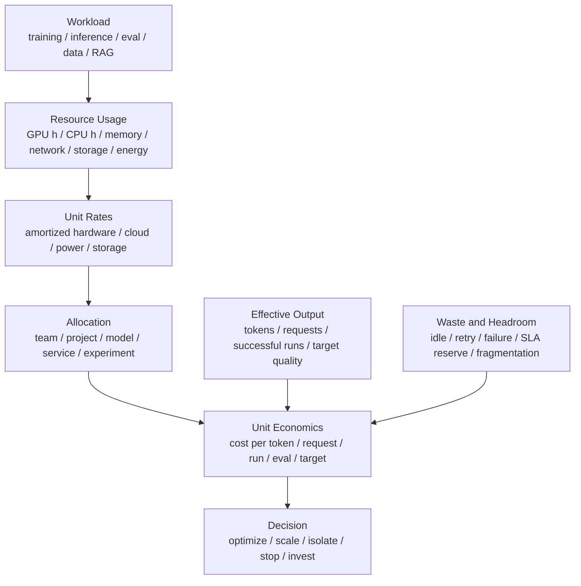

# 成本模型与单位经济性：Cost per Token、GPU Hour 与有效产出

AI 系统里的“更快”不一定等于“更便宜”。

常见误判包括：

- 只看 GPU hour，不看有效 token。
- 只看推理吞吐，不看 SLA 下的 goodput。
- 只看训练主任务，不算失败重跑、评测、checkpoint、数据处理。
- 只看 GPU 成本，不算 CPU、内存、网络、存储、电力、冷却和工程排障。
- 只看平均成本，不看 p99、空闲冗余和峰值容量。
- 只看模型服务，不看 RAG、agent、embedding、rerank、tool call 的全链路成本。
- 只看单次实验成本，不看成功实验成本。
- 只按团队或 namespace 分摊成本，无法归因到模型、服务、实验、数据集和 workload。

成本模型的目标不是简单省钱，而是回答：

> 在满足质量、SLA、可靠性和研发速度的前提下，每单位有效产出到底花了多少资源和多少钱？哪些成本是必要 headroom，哪些是可优化浪费？

本篇不写固定云价格或硬件价格，因为价格会随时间、合同、地区和采购方式变化。这里关注可复用的成本口径和计算方法。

先给出一个判断原则：

```text
成本优化不是降低某一项账单，
而是在质量、SLA、可靠性和研发速度约束下，
降低每单位有效产出的总成本。
```

如果一个配置让 GPU hour 降低，但 p99 变差、失败率升高、人工排障增加，或者训练更难达到目标质量，它不一定更便宜。

## Cost Model Contract

成本分析最容易出错的地方，是先算数字再定义口径。每次分析前应该先写一个 Cost Model Contract。

```yaml
question:
  decision: optimize | scale | buy | reserve | isolate | deprecate | investigate
  time_window: ...
  audience: platform | research | product | finance | leadership

scope:
  boundary: gpu_only | node_level | service_level | workflow_level | cluster_level
  included_costs: ...
  excluded_costs: ...
  amortization_policy: ...

workload:
  model_or_service: ...
  training_or_inference: ...
  request_or_token_distribution: ...
  sla_or_quality_target: ...

resources:
  accelerator: ...
  cpu_memory: ...
  storage: ...
  network: ...
  energy: ...
  shared_platform: ...

allocation:
  direct_tags: ...
  shared_cost_rule: ...
  idle_headroom_policy: ...
  failure_retry_policy: ...

effective_output:
  metric: successful_request | output_token_at_sla | trained_token | target_quality | successful_experiment
  filters: ...
  guardrails: ...

rates:
  source: contract | cloud_bill | amortized_capex | internal_rate_card
  currency: ...
  validity_period: ...

decision_rule:
  compare_against: ...
  minimum_savings_or_value: ...
  caveats: ...
```

这个 contract 的作用是让成本数字可解释：

- 这笔成本到底包含什么。
- 成本归因到谁。
- 分母里的“有效产出”是什么。
- 是否扣除 idle。
- 是否包含失败、重试、评测、checkpoint 和共享平台。
- 这次分析是为了优化配置、做容量规划，还是做采购/保留容量决策。

没有 contract 的成本分析，很容易出现“两个团队都在说 cost/token，但一个只算 GPU，一个算完整服务”的问题。

## 一张总图



核心公式很简单：

```text
unit_cost = allocated_total_cost / effective_output
```

难点在于：

- `allocated_total_cost` 包含哪些资源。
- `effective_output` 怎样定义。
- 共享资源怎样分摊。
- 失败、空闲、重试和 headroom 怎样处理。

## 先定义成本边界

成本模型必须先写清边界。

同一个系统可以同时有多种成本口径：

| 边界 | 适合回答的问题 | 常见误用 |
| --- | --- | --- |
| GPU-only | 某个模型/引擎/kernel 是否更高效 | 直接当作服务总成本 |
| Node-level | 一台服务器交付多少有效产出 | 忽略路由、存储、RAG、监控 |
| Service-level | 一个线上服务的单位请求成本 | 混入不相关共享平台 |
| Workflow-level | RAG/agent/训练流水线端到端成本 | 归因字段不足导致无法拆解 |
| Cluster-level | 资源池、队列、碎片、headroom 成本 | 直接归因到单个模型 |

报告成本时应该写成：

```text
cost_per_1k_output_tokens
  boundary = service-level
  includes = inference replicas + router + tokenizer + monitoring + retry
  excludes = offline eval + model training + corporate overhead
  output = successful output tokens under SLA
```

这样别人才能判断这个数字能不能用于模型对比、服务定价、容量规划或采购决策。

### GPU-only

只算 GPU。

适合：

- 比较 kernel、engine、batch、量化、KV Cache。
- 评估模型 serving 单副本效率。
- 做快速工程优化。

典型公式：

```text
gpu_cost = gpu_hours * cost_per_gpu_hour
```

如果是自建集群，`cost_per_gpu_hour` 可以来自内部 rate card：

```text
cost_per_gpu_hour
  = amortized_hardware_cost
  + maintenance_cost
  + power_and_cooling_cost
  + datacenter_cost
  + platform_overhead
```

如果是云资源，通常来自账单、合同价、预留实例/承诺用量折算或内部成本平台。不要把公开标价、实际合同价和内部 chargeback rate 混在一起。

局限：

- 不包含 CPU、网络、存储、电力、冷却。
- 不包含 idle reserve。
- 不包含数据处理和工程成本。

GPU-only 最适合优化局部效率，但它不能回答“这个服务整体是否更便宜”。一个优化可能让 GPU 成本下降，但增加 CPU preprocessing、网络传输或缓存成本。

### Node-level

算整台服务器。

包括：

- GPU。
- CPU。
- 内存。
- 本地 NVMe。
- NIC。
- 风扇/冷却相关电力。
- 节点折旧或租用成本。

适合：

- 推理服务成本。
- 训练节点池成本。
- 采购和资源池规划。

Node-level 特别适合做硬件评估：

```text
node_cost_per_effective_token
  = node_cost_per_second / effective_tokens_per_second
```

它能避免只看 GPU 峰值算力或 GPU 标价。对 AI 服务器来说，CPU、内存、NIC、NVMe、电源、散热和整机可靠性都会影响真实单位成本。

### Service-level

算一个完整服务。

例如 LLM API 服务可能包括：

- online inference replicas。
- router / gateway。
- tokenizer / preprocessor。
- embedding service。
- reranker。
- vector database。
- object storage。
- logs / traces。
- monitoring。
- autoscaling reserve。
- failed / timeout / retry work。

适合回答：

```text
一个成功用户请求到底花了多少成本？
```

Service-level 成本通常要扣住 SLA 和失败路径：

```text
service_cost_per_successful_request
  = total_service_cost / successful_requests_under_SLA
```

如果 timeout、cancel、reject、retry 或 invalid output 没有进入统计，成本会被低估。

### End-to-end Product / Workflow-level

RAG、agent、训练流水线、评测系统通常需要端到端成本。

例如 agent 任务可能包含：

```text
planning LLM call
  + tool calls
  + retrieval
  + code execution sandbox
  + multiple follow-up LLM calls
  + logs/traces
  + retries
```

只算最后一次 LLM 生成，会严重低估成本。

Workflow-level 常见于：

- RAG 问答。
- agent 任务。
- 代码生成和执行。
- 批量数据标注。
- 模型评测。
- SFT/DPO/RLHF 数据流水线。

这类场景的成本分母最好是业务结果，而不只是 token：

```text
cost_per_answered_question
cost_per_successful_agent_task
cost_per_valid_labeled_sample
cost_per_eval_score_point
cost_per_model_candidate_that_passes_gate
```

如果只看 LLM token 成本，很容易低估 retrieval、rerank、tool、sandbox、日志、人工审核和失败重试。

### Cluster-level

集群级成本关注资源池整体效率。

它回答：

- GPU 池的有效利用率是多少。
- 队列等待和碎片浪费了多少成本。
- 不同 GPU 型号是否被正确匹配 workload。
- 训练、推理、Notebook、benchmark 是否互相干扰。
- 在线 headroom 和离线队列之间是否平衡。

典型指标：

```text
allocated_gpu_hours
used_gpu_hours
productive_gpu_hours
wasted_gpu_hours
queue_wait_cost
fragmentation_cost
cluster_cost_per_effective_output
```

Cluster-level 适合平台治理，不适合直接评价单个模型版本。单个模型要回到 service/workflow 边界。

## 成本组成

AI 系统成本可以拆成几个大类。

### 计算成本

包括：

- GPU/NPU/TPU accelerator time。
- CPU time。
- host memory。
- DPU / SmartNIC。
- inference replicas。
- training jobs。
- eval jobs。
- data preprocessing jobs。

常见单位：

- GPU hour。
- accelerator hour。
- CPU core hour。
- node hour。
- replica second。

计算成本至少有三种口径：

| 口径 | 含义 | 适合场景 |
| --- | --- | --- |
| billable cost | 外部账单或采购摊销后的成本 | 财务与预算 |
| internal rate | 平台内部 chargeback/showback 单价 | 团队治理 |
| marginal cost | 额外跑一个 workload 增加的成本 | 调度和短期决策 |

例如自建集群在低利用率时，短期边际成本可能接近电力和磨损；但长期决策不能忽略硬件折旧、机房、网络、运维和资金占用。

### Rate Card 与摊销

内部成本模型通常需要 rate card。

```text
gpu_type:
  h100_sxm
rate:
  cost_per_gpu_hour
components:
  hardware_amortization
  support_and_spares
  power_and_cooling
  datacenter
  platform_overhead
validity:
  2026-Q2
```

摊销策略要明确：

- 硬件生命周期按几年算。
- 是否按满载小时摊销，还是按实际可用小时摊销。
- 维护、备件、网络、机柜是否分摊到 GPU hour。
- 保修、折旧、残值是否考虑。
- idle 或未分配时间由平台承担，还是分摊给使用方。

不同摊销策略会显著改变 `cost_per_gpu_hour`。报告里不一定要公开具体价格，但要说明口径。

### 存储成本

包括：

- model weights。
- checkpoints。
- dataset shards。
- feature/embedding cache。
- KV/prefix cache 备份或分层。
- logs。
- traces。
- profiler artifacts。
- benchmark raw data。

还要考虑：

- storage capacity。
- request cost。
- metadata cost。
- lifecycle retention。
- replication。
- egress。

Checkpoint 尤其重要：保存频率、保留数量和上传路径都会影响成本。

存储成本还要区分：

```text
capacity_cost:
  存了多少数据，占了多久

request_cost:
  读写请求次数、元数据操作

transfer_cost:
  跨区、跨地域、对象存储出流量

performance_cost:
  为了 IOPS/throughput 购买的高性能存储
```

AI 系统容易低估日志、trace 和 profiler artifact。一次短 benchmark 可能生成很大的 profiler trace；长期保存所有原始数据也会形成可观成本。需要和数据治理章节的 retention policy 联动。

### 网络成本

包括：

- GPU-GPU 通信。
- node-node 通信。
- cross-zone / cross-region traffic。
- object storage egress。
- model weight distribution。
- dataset loading。
- RAG document fetch。
- P/D 分离 KV transfer。

网络成本不只是账单，也包括性能成本：网络拥塞会增加训练 step time 或推理 p99，间接增加计算成本。

可以把网络影响转成计算成本：

```text
extra_compute_cost_from_network
  = extra_step_time_due_to_network * allocated_node_cost_per_second
```

如果一次跨机房数据读取让 GPU 等待，它的真实成本不只是网络账单，还包括 GPU idle 等待的成本。

### 能源与冷却成本

包括：

- power。
- cooling。
- PUE。
- rack power headroom。
- thermal constraints。

能源成本可以和第 8 章的能效 benchmark 结合：

```text
energy_cost = energy_kWh * price_per_kWh
```

如果没有具体电价，也可以先用：

```text
joules/token
tokens/joule
```

作为跨配置对比指标。

能源和冷却可以有两种分析方式：

```text
engineering view:
  joules/token, tokens/joule, power headroom

finance view:
  kWh * electricity_rate * PUE adjustment
```

前者适合优化系统配置，后者适合预算和数据中心容量规划。两者不要混用。

### 失败与重试成本

AI 任务经常失败。

成本包括：

- failed training run。
- failed fine-tune。
- failed eval。
- checkpoint 恢复前丢失的 work。
- 推理 timeout 后仍完成的无效生成。
- client retry 放大的流量。
- unstable node 导致的重跑。

成功实验成本通常高于单次运行成本：

```text
cost_per_successful_run
  = total_attempt_cost / successful_runs
```

如果成功率只有 50%，单次成功成本可能接近单次运行成本的 2 倍。

推理服务也有无效工作：

```text
invalid_inference_cost
  = timed_out_generation
  + cancelled_generation_after_deadline
  + duplicate_retry_generation
  + rejected_after_prefill
  + invalid_or_unusable_output
```

这些通常不会体现在 raw tokens/s 里，但会体现在账单和用户体验里。

### 人工与工程成本

有些成本很难直接量化，但不能完全忽略：

- benchmark 维护。
- kernel debug。
- 模型迁移。
- 线上事故排查。
- 节点故障定位。
- 数据修复。
- 性能回归定位。

工程成本不一定进入每日报表，但在技术决策中必须考虑。

一个优化如果节省 1% GPU 成本，却引入长期复杂运维，可能不值得。

可以把工程成本作为决策 guardrail：

```text
adopt optimization only if:
  recurring savings are meaningful
  operational complexity is acceptable
  debugging and rollback path are clear
  maintainers understand the mechanism
```

对于底层 kernel、编译器、分布式训练和推理调度优化，这一点尤其重要。

## 推理单位经济性

推理服务常见单位成本：

```text
cost_per_request
cost_per_input_token
cost_per_output_token
cost_per_total_token
cost_per_successful_request
cost_per_successful_output_token_at_SLA
```

### 基础公式

如果一个 replica 的成本是：

```text
replica_cost_per_second
```

在满足 SLA 的情况下，它能提供：

```text
goodput_requests_per_second
```

则：

```text
cost_per_successful_request
  = replica_cost_per_second / goodput_requests_per_second
```

如果看 output token：

```text
cost_per_output_token
  = replica_cost_per_second / output_tokens_per_second_at_SLA
```

关键是 `at_SLA`。

极限吞吐下的 cost/token 可能很好看，但如果 p99 超标、timeout 增加，就不是有效产出。

还要区分：

```text
cost_per_allocated_replica_second:
  副本存在就产生的成本

cost_per_active_generation_second:
  真正在生成时的成本

cost_per_successful_request:
  用户成功请求分摊后的成本
```

线上服务为了 SLA 必须保留空闲能力，所以 `allocated` 和 `active` 不会相等。只用 active 时间算成本，会低估真实部署成本。

### Prefill 和 Decode 分开算

LLM 推理里，input token 和 output token 成本不一样。

粗略拆分：

```text
prefill_cost ~ input_tokens
decode_cost ~ output_tokens * active_context
```

更完整还要看：

- attention 实现。
- KV Cache layout。
- batch size。
- prefix cache hit rate。
- speculative decoding。
- quantization。
- P/D 分离。

如果只用“总 tokens”平均，会掩盖：

- 长 prompt 短输出。
- 短 prompt 长输出。
- RAG 长上下文。
- agent 多轮调用。

建议报告：

```text
cost_per_1k_input_tokens
cost_per_1k_output_tokens
cost_per_request_by_length_bucket
```

### 请求分桶成本

平均 cost/request 容易掩盖长尾。

建议按 bucket 报告：

| Bucket | 成本驱动 | 常见指标 |
| --- | --- | --- |
| short chat | 调度、TTFT、decode tail | cost/request、cost/output token |
| long context | prefill、HBM、KV Cache | cost/input token、cost/request |
| long generation | decode、active sequence | cost/output token、TPOT |
| RAG | retrieval、rerank、长上下文 | workflow cost/request |
| agent | 多轮 LLM、tool、retry | cost/successful task |
| multimodal | encoder、preprocessing、显存 | cost/media request |

如果只看总体平均值，少量长上下文或 agent 请求可能隐藏了大部分成本。

### Goodput 比 Throughput 更重要

成本分母应该是有效产出。

例如：

```text
raw_output_tokens/s = 10000
successful_output_tokens/s_at_SLA = 7500
```

如果用 raw tokens/s 计算 cost/token，会低估真实成本。

需要扣除：

- timeout。
- cancelled。
- rejected。
- retry duplicate。
- SLA miss。
- invalid output。

一个实用指标：

```text
cost_per_successful_output_token_at_SLA
```

可以进一步定义：

```text
cost_per_good_request
  = total_service_cost
    / requests(success=true, latency<=SLA, output_valid=true)
```

如果服务存在 retry，要避免重复计算用户价值：

```text
user_visible_successes <= backend_successful_requests
```

用户一次请求背后可能有多次 backend retry。成本分母应该按用户可见成功，而不是 backend 成功次数。

### Cache 对成本的影响

缓存可以降低成本，也可以制造成本。

收益：

- prefix cache 降低 prefill。
- model weight cache 降低冷启动。
- RAG cache 降低检索。
- local cache 降低存储和网络。

成本：

- cache 占用显存/内存/存储。
- cache invalidation。
- cache miss 抖动。
- 多副本 cache 不一致。
- 预热成本。

缓存的成本模型应该看：

```text
cache_cost
cache_hit_rate
cost_saved_per_hit
miss_penalty
eviction_penalty
```

只看命中率不够。一个高命中缓存如果占用昂贵 HBM，让 batch 变小，也可能不划算。

缓存 ROI 可以粗略写成：

```text
cache_roi
  = cost_saved_by_hits
    - cache_memory_cost
    - cache_management_cost
    - miss_or_eviction_penalty
```

如果 `cache_roi` 为负，即使命中率高，也可能不值得。

### RAG / Agent 成本

RAG/Agent 的成本要按 workflow 看。

RAG 请求可能包含：

```text
embedding
vector_search
reranking
document_fetch
prompt_assembly
llm_prefill
llm_decode
logging_and_trace
```

Agent 任务可能包含：

```text
planning_llm_call
tool_call
observation_processing
followup_llm_call
retry_or_branch
sandbox_or_execution
state_storage
```

因此端到端指标应包括：

```text
cost_per_successful_answer
cost_per_grounded_answer
cost_per_successful_agent_task
cost_per_tool_call
cost_per_trace_or_audit_record
```

如果只算 LLM output token，可能低估 retrieval、rerank、工具和失败分支成本。

### 多模型与路由成本

生产服务常见多模型路由：

- 大小模型级联。
- cheap model fallback to expensive model。
- draft model + target model。
- embedding/rerank/generation 多阶段模型。
- 按租户或优先级路由不同模型。

成本模型要记录：

```text
route_probability
model_cost_per_route
fallback_rate
retry_rate
quality_or_sla_by_route
```

便宜模型如果 fallback 率很高，端到端成本可能并不低。反过来，大模型如果一次成功率更高，也可能降低 workflow-level 成本。

## 训练单位经济性

训练常见单位成本：

```text
cost_per_training_token
cost_per_step
cost_per_checkpoint
cost_per_eval
cost_per_successful_run
cost_to_target_loss
cost_to_target_quality
```

### Cost per Training Token

基础公式：

```text
cost_per_training_token
  = training_cost / trained_tokens
```

其中：

```text
training_cost = gpu_hours * cost_per_gpu_hour
```

但这只是最简模型。

更完整：

```text
total_training_cost
  = compute_cost
  + data_pipeline_cost
  + checkpoint_storage_cost
  + checkpoint_io_cost
  + eval_cost
  + queue_reserved_cost
  + failure_retry_cost
  + debugging_cost
```

训练 token 还要区分：

```text
raw_tokens:
  数据里原始 token 数

processed_tokens:
  实际送入模型的 token 数，可能包含 padding

loss_tokens:
  真正参与 loss 的 token 数

useful_tokens:
  通过数据质量过滤、对训练目标有用的 token
```

如果 padding、重复数据、低质量数据很多，`cost_per_training_token` 会过于乐观。更有意义的是：

```text
cost_per_loss_token
cost_per_useful_token
```

这和训练数据混合、采样与有效 Token 章节可以衔接。

### Cost to Target

训练不是为了消耗 token，而是达到目标质量。

更重要的是：

```text
cost_to_target = total_cost_until_target_quality
```

例如：

- 配置 A tokens/s 高，但 loss 更不稳定。
- 配置 B tokens/s 低一点，但收敛更稳。

如果 B 更早达到目标质量，B 的 cost to target 可能更低。

Cost to target 要写清 target：

```text
target:
  validation_loss <= X
  benchmark_score >= Y
  human_eval_pass_rate >= Z
  safety_or_format_guardrail passes
```

不要事后选择最有利的 target。target 应该在训练前定义，否则成本结论会偏。

还要记录：

```text
time_to_target
energy_to_target
gpu_hours_to_target
failed_attempts_before_target
eval_cost_until_target
```

这样才能比较“更快但更贵”和“更慢但更稳”的方案。

### 实验探索成本

研究和工程迭代中，很多训练不会成为最终模型。

要看：

```text
cost_per_successful_experiment
  = total_experiment_cost / successful_experiments
```

成功的定义要写清楚：

- 跑完。
- 达到 loss。
- 通过 eval。
- 可上线。
- 产生可复用结论。

大量失败实验可能是研发必要成本，但也需要度量，才能发现：

- 配置错误。
- 数据 pipeline 不稳定。
- 节点故障。
- checkpoint 不可靠。
- 调度等待过长。

### Queue Wait 与 Reservation Cost

训练成本不只发生在 job 运行时。

还要看：

```text
queue_wait_time
reserved_but_not_running_time
preempted_time
restart_time
idle_allocated_time
```

如果一个团队为了大 job 长期保留资源，但实际排队、调试、数据准备导致 GPU 空闲，这部分也应进入资源治理视角。

对训练任务可以拆成：

```text
run_cost:
  job 实际运行消耗

reservation_cost:
  为 job 保留但未产出 token 的成本

queue_delay_cost:
  任务等待造成的研发周期成本
```

queue delay 不一定直接进财务账单，但会影响研发速度和机会成本。

### Checkpoint、Eval 与失败成本

训练成本报告应把这些项拆开：

```text
checkpoint_cost:
  save_time_cost + storage_cost + upload_cost

eval_cost:
  eval_gpu_cost + eval_data_cost + eval_service_cost

failure_cost:
  lost_progress_cost + restart_cost + debugging_cost
```

有些优化让 steady-state step time 变快，但 checkpoint 更慢、失败更多，最终 cost to target 反而更高。训练成本应以端到端 run record 为准。

### 微调与后训练成本

SFT、DPO、RLHF、GRPO 等后训练的成本结构不同于预训练。

常见成本项：

- 数据清洗和标注。
- rejection sampling。
- 多模型生成候选。
- reward model 训练和推理。
- policy rollout。
- evaluator。
- 人工审核。
- 多轮失败实验。

因此后训练单位成本可以写成：

```text
cost_per_accepted_sample
cost_per_preference_pair
cost_per_policy_update
cost_per_eval_passed_checkpoint
cost_per_model_variant_that_passes_gate
```

只看 fine-tune GPU hour 会低估数据和评测成本。

## GPU Hour 为什么不够

GPU hour 是基础指标，但不能代表价值。

同样 1000 GPU hours：

- 一个任务高效训练 1T tokens。
- 一个任务 GPU 分配了但 DataLoader 供不上。
- 一个任务反复 OOM 重启。
- 一个任务在错误节点上失败重跑。
- 一个推理服务为了 p99 保留大量 idle headroom。

它们的价值完全不同。

需要把 GPU hour 转成：

```text
effective_tokens
successful_requests
successful_runs
target_quality
SLA_goodput
```

再谈成本。

## Headroom 不是简单浪费

线上推理必须有 headroom。

原因：

- 流量突发。
- 节点故障。
- rolling update。
- cache miss。
- 长请求比例上升。
- 上游 retry。
- 冷启动时间。

如果没有 headroom，p99 和 timeout 会变差，重试会放大流量，最终可能更贵。

成本模型里应把 headroom 分成：

| 类型 | 是否合理 |
| --- | --- |
| SLA reserve | 合理成本 |
| failure reserve | 合理成本 |
| rolling update reserve | 合理成本 |
| 长期无人使用的过量副本 | 可优化 |
| 资源碎片导致不可用 | 可优化 |
| 配置错误导致 idle | 可优化 |

目标不是把 idle 降到 0，而是让 headroom 有明确理由。

## 共享成本如何归因

AI 平台有大量共享成本：

- Kubernetes control plane。
- Slurm controller。
- monitoring/logging。
- shared storage。
- container registry。
- model registry。
- artifact store。
- network fabric。
- base image cache。
- notebook platform。
- benchmark platform。

成本归因有几种方式。

### Direct Allocation

能直接归因的直接归因。

例如：

- job 使用的 GPU hours。
- service replica seconds。
- dataset storage bytes。
- object storage requests。
- network egress。

### Proportional Allocation

共享成本按比例分摊。

常见比例：

- GPU hours。
- node hours。
- storage usage。
- request count。
- tokens。
- active users。

### Weighted Allocation

不同资源权重不同。

例如：

```text
cost_weight = gpu_hours * gpu_type_weight
```

H100 hour 和 A10 hour 不能直接相加。

也可以按服务权重分摊共享成本：

```text
shared_platform_cost_share
  = service_weight / sum(all_service_weights)
```

权重可以来自：

- GPU hour。
- 请求数。
- tokens。
- storage bytes。
- active users。
- revenue or business priority。

没有完美的分摊规则。关键是规则稳定、透明、可解释，并且不要诱导错误行为。例如只按请求数分摊，可能惩罚小请求服务；只按 GPU hour 分摊，可能忽略存储和网络大户。

### Tagging

归因依赖标签。

至少需要：

- team。
- project。
- environment。
- workload type。
- model。
- experiment。
- service。
- dataset。
- owner。

建议把标签分成三类：

```text
ownership:
  team, owner, cost_center

workload:
  service, model, experiment, dataset, job_type

environment:
  prod, staging, research, benchmark, notebook
```

标签要在资源生命周期一开始就注入：

- job 提交。
- service deployment。
- model registry。
- dataset registration。
- notebook session。
- benchmark run。

事后靠日志猜标签，准确率通常很差。

### Showback 与 Chargeback

成本治理有两种常见模式：

| 模式 | 含义 | 适合阶段 |
| --- | --- | --- |
| showback | 展示成本，不直接收费 | 建立透明度和习惯 |
| chargeback | 按规则内部结算 | 成熟治理和预算约束 |

AI 平台早期通常先做 showback：

- 谁用了多少资源。
- 哪些 workload 成本最高。
- 哪些失败和 idle 最多。
- 哪些服务 unit cost 高。

等标签、口径和 dashboard 稳定后，再考虑 chargeback。过早 chargeback 容易导致团队规避标签、隐藏实验或牺牲长期研发效率。

### 成本归因的质量指标

成本数据本身也要有质量指标：

```text
tag_coverage_rate
unallocated_cost_ratio
unknown_owner_cost
shared_cost_ratio
late_arriving_usage
cost_data_freshness
```

如果 `unallocated_cost_ratio` 很高，说明成本模型还不能指导具体优化。

没有标签，成本只能按 namespace 或账号粗分，很难指导优化。

## 多租户成本治理

多租户环境里，成本治理不能只靠账单。

还要能回答：

- 哪些 team 用了哪些 GPU 型号。
- 哪些服务消耗了最多推理 token。
- 哪些训练任务失败率高。
- 哪些 workload 占着 GPU 但有效吞吐低。
- 哪些 notebook 长期 idle。
- 哪些模型副本长期低利用。
- 哪些缓存节省了成本，哪些缓存浪费了 HBM。

成本 dashboard 应该同时显示：

- allocation。
- utilization。
- effective output。
- unit cost。
- waste。
- SLA。
- owner。

如果只展示“花了多少钱”，用户不知道怎么优化。

### Waste Taxonomy

浪费要分类，否则无法行动。

| 浪费类型 | 例子 | 常见动作 |
| --- | --- | --- |
| idle allocation | GPU 分配但无有效工作 | 自动回收、idle timeout |
| failed work | 失败训练、OOM、坏节点重跑 | 入池门禁、checkpoint、健康调度 |
| retry amplification | 推理重试放大流量 | retry budget、deadline propagation |
| fragmentation | 小任务占碎片，大任务排队 | bin packing、队列策略 |
| mismatch | 用高端卡跑低需求任务 | 资源池分层、准入规则 |
| stale artifacts | 过期 checkpoint、trace、日志 | retention policy |
| over-replication | 副本长期低利用 | autoscaling、模型合并 |

“浪费”不是道德判断，而是可优化对象。SLA headroom 和 failure reserve 不是同一类浪费，不能一刀切。

### Top Cost Drivers

成本治理报告应该能回答：

```text
top services by total cost
top services by unit cost
top experiments by failed cost
top datasets by storage growth
top models by idle replica cost
top teams by untagged usage
top workloads by retry amplification
```

总成本最高的对象不一定最值得优化。单位成本异常、失败率高、增长最快或 owner 不清的对象，往往更适合优先治理。

## 研发速度也是成本

AI 研发里，成本不只是资源账单。

还有：

- 实验排队时间。
- 失败重跑时间。
- debug 周期。
- 环境不一致导致的复现成本。
- benchmark 不可靠导致的决策成本。
- 模型上线慢导致的机会成本。

例如，买更便宜但生态不成熟的硬件，可能降低单位算力价格，但增加：

- kernel 迁移。
- compiler bug。
- fallback。
- profiler 不成熟。
- 招聘和培训成本。
- 模型适配时间。

所以硬件和系统选型要看：

```text
total cost of useful progress
```

而不是只看设备单价。

可以把研发速度转成几个可观测指标：

```text
time_to_first_successful_run
time_to_reproduce_result
queue_wait_time
failure_recovery_time
debug_time_after_regression
time_from_model_ready_to_production
```

这些指标不一定直接进入每 token 成本，但会影响平台选型和研发 ROI。

## 常见优化方向

### 提高 Goodput

如果 SLA 下 goodput 提升，单位成本通常下降。

方向：

- batching。
- scheduling。
- KV Cache 管理。
- prefix cache。
- quantization。
- speculative decoding。
- P/D 分离。
- 优化 p99，减少重试。

但要确保质量和稳定性不下降。

Goodput 提升要转成成本曲线：

```text
before:
  cost_per_successful_output_token_at_SLA

after:
  cost_per_successful_output_token_at_SLA

savings:
  (before - after) * expected_effective_tokens
```

如果只是 raw throughput 提升，而 SLA 下 goodput 没变，成本不一定下降。

### 降低无效工作

无效工作包括：

- 已超时请求继续生成。
- client retry duplicate。
- 失败训练重复跑。
- 错误节点反复被调度。
- checkpoint 失败。
- 数据 pipeline stall。
- benchmark 噪声导致错误决策。

方向：

- deadline propagation。
- cancellation。
- load shedding。
- retry budget。
- health-based scheduling。
- checkpoint 验证。
- 回归检测。

降低无效工作通常比压榨单个 kernel 更直接，因为它减少的是“没有用户价值的产出”。推理系统尤其要实现 deadline propagation 和 cancellation，否则超时请求仍在后台消耗 GPU。

### 提高资源匹配

不同 workload 适合不同资源。

例如：

- 长上下文推理需要 HBM capacity。
- decode 可能更吃 HBM bandwidth 和 scheduler。
- 大训练需要高速互连。
- embedding 可以偏吞吐和成本优化。
- notebook 需要灵活但不应占高端训练卡。

把任务放到合适资源池，比单纯提高整体利用率更有效。

资源匹配可以用单位经济性判断：

```text
cost_per_effective_output(resource_pool_A)
vs
cost_per_effective_output(resource_pool_B)
```

不要只看 GPU 利用率。一个低端资源池利用率高，但 p99 差、失败多、排队长，可能总成本更高。

### 降低数据移动

数据移动既影响性能也影响成本。

方向：

- local cache。
- dataset shard locality。
- model weight distribution。
- prefix cache。
- KV Cache 分层。
- checkpoint 增量/异步。
- 避免跨区/跨地域流量。

数据移动还会放大 tail latency 和训练等待：

```text
data_movement_cost
  = transfer_bill
  + extra_compute_wait_cost
  + p99_or_step_time_penalty
```

如果只看网络账单，会低估数据布局错误的真实成本。

### 管理保留容量

保留容量不是越少越好。

应该按用途分类：

- 在线 SLA headroom。
- 训练大 job 预留。
- 维护和故障冗余。
- 发布和回滚窗口。
- 实验突发。

然后逐项评估是否合理。

### 降低复杂度成本

有些优化会降低资源成本但增加系统复杂度。

需要问：

- 是否需要新的 kernel 维护。
- 是否增加调试难度。
- 是否让回滚更困难。
- 是否引入更窄的硬件/驱动依赖。
- 是否让 benchmark 更难复现。
- 是否需要额外培训。

复杂度成本不是拒绝优化的理由，但要进入决策。特别是收益很小的优化，如果长期维护成本高，可能不值得。

### 成本优化闭环

成本优化应该形成闭环：

```text
measure:
  发现高成本或高单位成本对象

explain:
  用 benchmark/profiler/trace 找成本驱动

change:
  调参、调度、缓存、量化、容量或架构优化

verify:
  验证 cost per effective output 是否下降

guard:
  用 dashboard 和回归检测防止反弹
```

只做一次性清理，成本很快会反弹。成本治理需要和回归检测、容量规划、调度策略一起持续运行。

## 报告模板

成本分析报告可以按下面写。

```text
Question:
  optimize / scale / buy / reserve / deprecate / investigate

Scope:
  GPU-only / node / service / workflow / cluster
  included and excluded cost items

Workload:
  model / training job / inference service / RAG workflow / eval

Time Window:
  start / end / warmup included? / steady state?

Resource Usage:
  GPU hours
  CPU hours
  memory
  storage
  network
  energy

Unit Rates:
  cost per GPU hour
  cost per node hour
  storage/network/power assumptions
  rate source and validity period

Effective Output:
  successful requests
  input/output tokens
  trained tokens
  successful runs
  target quality reached
  SLA or quality filters

Unit Cost:
  cost/request
  cost/input token
  cost/output token
  cost/training token
  cost/successful run
  cost/to target

Allocation:
  direct tags
  shared cost rules
  unallocated cost ratio

Waste / Headroom:
  idle
  retry
  failed jobs
  SLA reserve
  fragmentation
  cold start

Drivers:
  top cost drivers
  top unit-cost outliers
  growth trend

Decision:
  optimize / scale / isolate / deprecate / investigate
  expected savings
  risks and guardrails
```

### Dashboard 建议

成本 dashboard 不应该只有总账单。

建议至少分成五类视图：

| 视图 | 关键问题 |
| --- | --- |
| 总览 | 钱花在哪些 team/project/service/model |
| 单位经济性 | cost/request、cost/token、cost/to target 是否变好 |
| 浪费 | idle、failed、retry、fragmentation、untagged |
| 容量 | headroom、queue、reserved、peak、forecast |
| 归因质量 | tag coverage、unallocated cost、shared cost ratio |

每个视图都应该能 drill down 到 owner、workload、run manifest 或服务版本。否则 dashboard 只能展示问题，不能驱动行动。

### 数据表设计

一个成本模型通常需要至少三类表：

```text
usage_records:
  who used what resource, when, how much

rate_cards:
  resource unit price and validity period

output_records:
  tokens, requests, successful runs, quality target, SLA result
```

然后通过标签和 run id 关联：

```text
allocated_cost = usage * rate
unit_cost = allocated_cost / effective_output
```

如果 usage 和 output 无法关联，就只能做粗粒度账单，无法做单位经济性。

## 常见误区

### 误区一：成本就是 GPU hour

GPU hour 是资源消耗，不是价值产出。

必须结合：

- tokens。
- requests。
- success。
- SLA。
- quality。
- failure。

### 误区二：最便宜的配置就是最佳配置

不一定。

如果便宜配置导致：

- p99 变差。
- 失败率上升。
- 工程维护复杂。
- 实验排队更久。
- 模型质量下降。

总成本可能更高。

### 误区三：idle 都是浪费

不一定。

在线系统需要 headroom。关键是 idle 是否有明确目的。

### 误区四：成本下降但质量不看

AI 系统不能只看低成本。

推理要看输出质量和用户体验。

训练要看收敛和目标质量。

### 误区五：共享成本可以忽略

不应该。

监控、日志、存储、网络、registry、benchmark 平台和运维成本会随着规模增长而显著增加。

## 检查清单

建立成本模型前：

- 是否写了 Cost Model Contract？
- 是否定义成本边界？
- 是否定义有效产出？
- 是否区分 raw throughput 和 goodput？
- 是否区分 GPU-only、node-level、service-level？
- 是否知道哪些成本是共享成本？
- 是否明确价格来源、摊销策略和有效期？

采集数据时：

- 是否有 GPU/node usage？
- 是否有 token/request/run 输出？
- 是否记录失败、超时、重试、取消？
- 是否有标签归因到 team/project/model/service？
- 是否记录 storage、network、energy？
- 是否记录 run manifest、model version、workload version？
- 是否能把 usage records 与 output records 对齐？

分析时：

- 是否计算 unit cost？
- 是否分开必要 headroom 和浪费？
- 是否看 quality/SLA guardrail？
- 是否看成功实验成本？
- 是否能定位 top cost drivers？
- 是否区分总成本高和单位成本异常？
- 是否计算 unallocated cost ratio 和 tag coverage？

决策时：

- 优化是否真的降低 cost per effective output？
- 是否增加工程复杂度？
- 是否影响研发速度？
- 是否需要回归检测和 dashboard？
- 是否定义 owner、预期收益和复查时间？

## 小结

AI 成本模型的核心不是压低账单，而是提高单位有效产出。

可以用一句话概括：

```text
成本优化 = 在质量、SLA、可靠性和研发速度约束下，
降低 cost per effective output。
```

对推理来说，重点是：

- cost per successful request。
- cost per output token at SLA。
- cache、batch、p99、retry 和 headroom。

对训练来说，重点是：

- cost per training token。
- cost to target quality。
- cost per successful experiment。
- failure、checkpoint、eval 和 data pipeline。

当成本模型能和 benchmark、profiler、容量模型、能效模型、调度系统和标签体系打通时，团队才能真正判断一个优化是“数字更好看”，还是“系统整体更划算”。

## 参考资料

- [FinOps Foundation: Unit Economics](https://www.finops.org/framework/capabilities/unit-economics/)
- [FinOps Foundation: Allocation](https://www.finops.org/framework/capabilities/allocation/)
- [FinOps Open Cost and Usage Specification (FOCUS)](https://focus.finops.org/)
- [AWS Well-Architected Framework: Cost Optimization Pillar](https://docs.aws.amazon.com/wellarchitected/latest/cost-optimization-pillar/welcome.html)
- [OpenCost Documentation](https://www.opencost.io/docs/)
