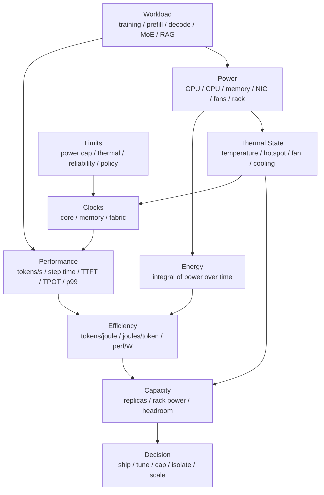

# 能效、功耗与热限制：Power、Energy per Token 与持续吞吐

AI 系统的性能结论如果只写“tokens/s 提升了多少”，是不完整的。

还要问：

- 这个 tokens/s 是短时峰值，还是热稳态后的持续吞吐？
- 功耗是多少？
- 每个 token 消耗多少能量？
- p99 延迟有没有被功耗策略或频率波动影响？
- 降低 power cap 后，性能损失和能效收益分别是多少？
- 训练 step time 变快了，但总能耗是否降低？
- GPU 功耗降低了，整机功耗是否也降低？
- 某个节点更慢，是软件问题，还是热限制、功耗限制、频率策略或硬件健康问题？

第 6 章的 [功耗、散热、频率与可靠性](../06-accelerators-architecture/power-thermal-reliability.md) 从硬件架构和系统设计角度解释了 power、thermal、clock、throttling 和 RAS。本篇站在 benchmark 与容量建模角度，重点回答：

> 如何把功耗、能效、温度、频率、throttle reason 和持续吞吐纳入 AI benchmark，避免只追求短时峰值，而忽略长期运行成本、热稳定性和尾延迟？

## 一张总图



这张图表达一个核心关系：

```text
可交付性能 = 吞吐 / 延迟 / 稳定性 / 能耗 / 热约束共同成立
```

短时间跑得快，不等于长期能交付。AI 训练和推理都是持续负载，最终要看 steady-state 下的有效吞吐、尾延迟、能耗和硬件健康。

## 基本指标

### Power

Power 是瞬时功率，单位通常是 watt。

常见口径：

| 指标 | 含义 |
| --- | --- |
| GPU power | GPU 板卡或芯片相关功耗 |
| CPU power | CPU 侧功耗 |
| node power | 整机功耗，通常包含 GPU、CPU、内存、NIC、SSD、风扇、PSU 损耗 |
| rack power | 机柜级功耗 |
| facility power | 数据中心供电和冷却后的整体功耗 |

做 benchmark 时必须写清楚功耗口径。

同样是 `joules/token`：

- 只算 GPU power，适合分析 GPU kernel 或模型配置。
- 算 node power，适合分析服务器交付效率。
- 算 rack/facility power，适合容量、电力和冷却规划。

这几个数字不能混用。

### Energy

Energy 是一段时间内消耗的能量。

公式是：

```text
energy = integral(power over time)
```

离散采样时可以近似为：

```text
energy_joules = sum(power_watts_i * delta_time_seconds_i)
```

如果采样间隔固定：

```text
energy_joules ~= average_power_watts * duration_seconds
```

功率是“每一刻消耗多快”，能量是“这段运行一共消耗多少”。

### Energy per Token

推理常用：

```text
joules_per_output_token = total_energy / output_tokens
```

有时也会看：

```text
joules_per_total_token = total_energy / (input_tokens + output_tokens)
```

两者含义不同。

LLM 服务中：

- prefill 主要消耗 input tokens。
- decode 主要交付 output tokens。
- 长 prompt、短输出和短 prompt、长输出的能耗结构不同。

因此报告时要说明 token 口径。

### Tokens per Joule

`tokens/joule` 是 `joules/token` 的倒数：

```text
tokens_per_joule = tokens / energy_joules
```

越高越好。

也可以写成：

```text
tokens/s/W
```

因为：

```text
tokens/s/W = tokens/s / watts = tokens / joule
```

### Energy to Target

训练不能只看 `joules/token`。

训练最终目标是达到某个 loss、quality 或 benchmark score。因此更重要的是：

```text
energy_to_target = total_energy_until_target_quality
```

一个配置可能 tokens/s 高、joules/token 低，但如果收敛变差、需要更多 tokens，最终 energy to target 反而更高。

训练能效报告应同时记录：

- tokens/s。
- step time。
- joules/step。
- joules/token。
- validation loss / target metric。
- energy to target。

### Sustained Performance

持续性能是进入热稳态后，系统长时间可维持的性能。

它不同于短时峰值：

```text
peak performance: short window, ideal state
sustained performance: after warmup, thermal steady state, stable clocks
```

很多问题只会在长时间运行后出现：

- 温度升高。
- 风扇转速变化。
- power throttling。
- thermal throttling。
- memory clock 下降。
- 节点热点。
- 机柜功耗逼近上限。
- ECC/Xid/link error 增多。

所以能效 benchmark 必须区分 warmup 窗口和 steady-state 窗口。

## 测量边界

能效数据最容易出错的地方是测量边界不清。

### GPU-only

GPU-only 适合分析：

- 模型配置。
- kernel 优化。
- quantization。
- batching。
- KV Cache。
- power cap sweep。

优点是贴近加速器本身。

缺点是忽略：

- CPU tokenization。
- host memory。
- NIC。
- NVMe。
- 风扇。
- PSU 损耗。
- 节点 idle baseline。

GPU-only 数字不能直接代表整机或数据中心成本。

### Node-level

Node-level 包含整台服务器。

它适合回答：

- 这台服务器每瓦能交付多少 tokens/s？
- CPU preprocessing 是否抵消了 GPU 优化收益？
- 风扇和冷却是否显著增加功耗？
- NIC、NVMe、DPU 是否在某些 workload 下变重要？

如果目标是采购、容量规划或线上服务，node-level 更有意义。

### Rack / Facility-level

Rack-level 和 facility-level 适合回答：

- 一个机柜能放多少台高功耗服务器。
- 机柜功耗峰值是否会超限。
- 冷却是否足够。
- 集群调度是否需要 power-aware placement。
- 数据中心级 energy/token 是多少。

这类指标需要 PDU、机柜电表或数据中心侧计量，不能只靠 GPU telemetry。

### Idle Baseline

是否扣除 idle baseline 取决于问题。

如果要分析“这个 workload 额外消耗多少能量”，可以看：

```text
incremental_energy = active_energy - idle_power * duration
```

如果要分析“线上部署真实消耗多少能量”，通常不能扣除 idle，因为机器保留容量本身就是成本。

报告中必须明确：

- 是否扣除 idle baseline。
- idle baseline 怎样测。
- idle 状态是否加载模型。
- 是否有常驻服务、监控和 background job。

## 采样与时间对齐

功耗采样不是越随便越好。

要注意：

- 采样间隔。
- 时间戳对齐。
- 不同指标采样延迟。
- power smoothing。
- telemetry 缺失值。
- 多 GPU 采样是否同步。
- benchmark 开始/结束时间是否准确。

如果每秒采一次 power，但请求只有几十毫秒，就不能把单个请求能耗精确归因到每个请求。可以做阶段级、窗口级或批次级估算。

推荐做法：

```text
benchmark timeline:
  warmup_start
  steady_state_start
  measurement_start
  measurement_end
  cooldown_end

telemetry timeline:
  power samples
  clocks
  temperatures
  throttle reasons
  utilization
  memory usage
  error counters
```

能效计算只使用 measurement window，避免把冷启动、模型加载和 warmup 混进去，除非目标就是测端到端冷启动成本。

## 需要采集的指标

### 性能指标

推理：

- requests/s。
- output tokens/s。
- total tokens/s。
- TTFT p50/p95/p99。
- TPOT p50/p95/p99。
- E2E latency p50/p95/p99。
- goodput at SLA。
- timeout / cancel / reject。

训练：

- step time。
- tokens/s。
- tokens/s/GPU。
- MFU。
- loss / validation metric。
- checkpoint overhead。
- failure/restart overhead。

能效指标不能脱离这些性能指标。

### 功耗指标

至少采集：

- power draw。
- power limit。
- energy counter，如果硬件支持。
- average/min/max power。
- per-GPU power。
- node/rack power，如果有。

只看平均 power 不够。短时间 power spike 可能触发机柜或电源限制，也可能对应 p99 抖动。

### 频率指标

采集：

- graphics / SM clock。
- memory clock。
- application clock 或 locked clock policy。
- clock throttle reason。
- power limit reason。
- thermal limit reason。
- reliability limit reason。

同样的 workload，如果 clocks 不同，benchmark 结果不可直接比较。

### 温度指标

采集：

- GPU temperature。
- HBM temperature，如果可用。
- hotspot temperature，如果可用。
- inlet / ambient temperature。
- fan speed 或 pump 状态。
- thermal margin。

温度不是只看“是否超过上限”。在接近上限前，频率和风扇功耗可能已经变化。

### 健康与错误指标

采集：

- ECC correctable / uncorrectable。
- Xid。
- retired pages / row remapping。
- PCIe replay / link error。
- NVLink / fabric error。
- GPU reset。
- node reboot。

长时间 benchmark 需要记录错误。一个能效很好的配置，如果导致错误率或不稳定性上升，就不能直接采用。

## 工具链

### nvidia-smi

`nvidia-smi` 适合快速查看和脚本采样：

- power draw。
- power limit。
- clocks。
- temperature。
- utilization。
- memory。
- ECC / Xid 相关信息。

它也支持循环采样和 CSV 输出。

但长期工具最好基于稳定 API 或监控系统。NVIDIA 文档也提醒，NVML 更适合作为维护型工具的底层接口。

### NVML

NVML 是 NVIDIA Management Library，适合程序化采集：

- power。
- clocks。
- temperature。
- utilization。
- ECC。
- process accounting。
- device state。

如果要把能效 benchmark 做成自动化工具，NVML 通常比解析 `nvidia-smi` 文本更稳。

### DCGM / DCGM Exporter

DCGM 适合集群级 GPU telemetry。

常见用途：

- Prometheus 采集 GPU 指标。
- dashboard。
- alert。
- job-level GPU 统计。
- health diagnostics。
- power、temperature、utilization、memory、errors。

DCGM 的价值在于长期、集群级观测，而不是替代 profiler。能效分析通常需要把 DCGM 指标与 benchmark 的请求/step 指标对齐。

### 外部功率计 / PDU

如果目标是 node/rack/facility 能效，需要外部功率测量：

- 智能 PDU。
- 机柜电表。
- 服务器 BMC。
- 实验室功率计。
- 数据中心能耗系统。

外部计量通常采样频率更低，但边界更完整。

## Benchmark 流程

一套可复现流程如下。

### 1. 固定环境

记录：

- GPU 型号和数量。
- CPU、内存、NIC、SSD。
- 散热方式。
- driver、CUDA、NCCL、framework、inference engine。
- 容器镜像 digest。
- power limit。
- clock policy。
- 环境温度。
- 节点位置。
- 是否共享机柜或共享任务。

功耗和热状态对环境很敏感，不记录环境就很难复现。

### 2. 记录 idle baseline

在开始 workload 前记录：

- idle GPU power。
- idle node power。
- idle clocks。
- idle temperatures。
- background process。

如果模型常驻内存，要说明 idle baseline 是：

```text
bare idle
or
model loaded idle
```

线上推理服务通常更关心 model loaded idle，因为热模型常驻是实际成本。

### 3. Warmup 到热稳态

不要刚开始就计入正式窗口。

需要让：

- kernel 编译完成。
- CUDA graph / cache 预热。
- 模型权重和 KV Cache 路径稳定。
- temperature 上升到稳定区间。
- fan/pump 响应稳定。
- clocks 稳定。

可以用以下条件判断：

- 最近 N 分钟平均温度变化很小。
- clocks 没有持续下降。
- tokens/s 或 step time 波动进入稳定范围。
- throttle reason 没有新变化。

### 4. 固定 workload 分布

推理要固定：

- 模型。
- 输入长度分布。
- 输出长度分布。
- QPS / 并发。
- batch 策略。
- cache 状态。
- sampling 参数。
- RAG / agent 请求比例。

训练要固定：

- global batch。
- micro batch。
- sequence length。
- parallel strategy。
- precision。
- checkpoint / eval 频率。
- 数据 pipeline。

能效比较必须在同等 workload 下进行。

### 5. 采集 steady-state 窗口

在测量窗口内采集：

- performance。
- power。
- energy。
- clocks。
- temperatures。
- throttle reason。
- utilization。
- memory。
- error counters。

输出：

```text
average_power
energy
tokens/s
joules/token
tokens/joule
p95/p99 latency
temperature range
clock range
throttle events
```

### 6. 重复与对比

至少重复多次，观察方差。

不同配置之间比较时，必须保持：

- workload 相同。
- steady-state 窗口相同。
- telemetry 口径相同。
- 同一硬件或等价硬件。
- 同一环境温度范围。

否则能效结论很容易被环境噪声污染。

## Power Cap Sweep

Power cap sweep 是能效分析最常用的方法之一。

做法是对同一 workload 测多个 power limit：

```text
power cap: 100%, 90%, 80%, 70%, ...
```

每个点记录：

| Power Cap | tokens/s | p99 latency | avg power | joules/token | temp | throttle |
| --- | --- | --- | --- | --- | --- | --- |
| 100% | ... | ... | ... | ... | ... | ... |
| 90% | ... | ... | ... | ... | ... | ... |
| 80% | ... | ... | ... | ... | ... | ... |

目标不是找到最低功耗，而是找到 sweet spot：

```text
在满足 SLA 和稳定性的前提下，joules/token 最低或 tokens/joule 最高
```

常见结果：

- 轻微降低 power cap，吞吐几乎不变，能效明显提升。
- 继续降低 power cap，吞吐开始快速下降。
- p99 在某个功耗点后明显变差。
- thermal throttling 消失，稳定性改善。

不同 workload 的曲线不同，不能把一个模型的 sweet spot 直接套到另一个模型。

## 训练场景

训练能效分析要同时看速度、稳定性和质量。

### Step Energy

可以先算：

```text
joules_per_step = average_power * step_time
```

再算：

```text
joules_per_training_token
  = energy / trained_tokens
```

但这仍然不够，因为训练还包括：

- eval。
- checkpoint。
- restart。
- data preprocessing。
- failed runs。
- hyperparameter search。

更完整的口径是：

```text
total_energy
  = successful_training_energy
  + eval_energy
  + checkpoint_energy
  + restart_energy
  + failed_experiment_energy
```

### MFU 与能效

高 MFU 通常有助于能效，因为计算单元更有效地产出训练 token。

但高 MFU 不是充分条件。

可能出现：

- MFU 高，但 power 很高，tokens/joule 不一定最优。
- MFU 高，但通信或 checkpoint 导致端到端能耗高。
- MFU 高，但训练不稳定，需要重跑。
- MFU 高，但数据质量或 batch 设置导致收敛变差。

训练能效最终要看 energy to target，而不是某个 step 的能效。

### Power Cap 对训练的影响

对大 GEMM 占主导的训练，降低 power cap 可能会明显增加 step time。

但也可能出现：

- 小幅降 power cap，step time 只略变慢，能效提升。
- 降低热点节点功耗后，长期 thermal throttling 减少，整体更稳定。
- 多节点训练中，最慢 rank 决定 step time，单看平均 power 没意义。

训练 power cap sweep 应记录：

- per-rank step time。
- slowest rank。
- communication time。
- GPU power。
- clocks。
- thermal events。
- loss curve。

## 推理场景

推理能效要同时看 throughput、latency 和请求分布。

### Prefill 与 Decode 分开看

Prefill 和 decode 的功耗形态不同。

Prefill：

- 长 prompt。
- 大 GEMM。
- attention 计算密集。
- 更可能出现高瞬时功耗。

Decode：

- 逐 token。
- KV Cache 读写。
- 小 kernel。
- 对 p99 和频率抖动敏感。

如果只给一个 `joules/token`，可能掩盖：

- 长 prompt 的 prefill 能耗。
- 长输出的 decode 能耗。
- KV Cache 命中和 miss 的差异。
- batching 对不同阶段的影响。

更好的做法是记录：

```text
prefill energy per input token
decode energy per output token
end-to-end energy per request
```

### Batching 与能效

batching 通常能提升 tokens/s/W，因为 GPU 利用率更高。

但 batching 也可能：

- 增加 TTFT。
- 增加 KV Cache 占用。
- 放大 p99。
- 增加单次功耗峰值。

所以推理能效必须和 SLA 一起看：

```text
energy_per_successful_token_at_SLA
```

如果一个配置 energy/token 更低，但 p99 超标或 timeout 增加，它不一定是更好的线上配置。

### Quantization 与能效

量化可能降低：

- weight bytes。
- HBM 读写。
- 计算能耗。
- 显存占用。

但也可能增加：

- dequant 开销。
- scale 读取。
- layout conversion。
- kernel fallback。
- 质量损失带来的重试或更长输出。

因此量化能效要同时看：

- tokens/s。
- joules/token。
- TTFT/TPOT。
- quality。
- dequant/fused kernel 是否生效。
- GPU power 和 HBM bandwidth 是否下降。

## 常见诊断模式

### 高功耗、高吞吐

可能是正常高效运行。

需要继续看：

- tokens/joule 是否好。
- 温度是否稳定。
- clocks 是否稳定。
- p99 是否满足 SLA。
- 是否接近机柜功耗上限。

高功耗不是问题本身，低效率才是问题。

### 高功耗、低吞吐

可能原因：

- kernel 低效。
- 通信等待。
- HBM 访问低效。
- 处理了很多超时或取消请求。
- batch 过大导致 p99 失败。
- CPU / storage / network 导致 GPU 无效等待。

排查：

- 看 profiler。
- 看 goodput 而不是 raw throughput。
- 看 timeout/cancelled。
- 看 HBM、SM、Tensor Core 指标。
- 看 queueing latency。

### 低功耗、低吞吐

可能原因：

- 数据输入供不上。
- CPU tokenization 瓶颈。
- QPS 不足。
- GPU 没被调度到。
- kernel launch-bound。
- power cap 过低。
- clocks 被策略限制。

排查：

- 看 GPU active。
- 看 queue length。
- 看 CPU。
- 看 clocks。
- 看 power limit 和 application clocks。

### 温度升高后性能下降

可能原因：

- thermal throttling。
- fan/pump 不足。
- 机柜热点。
- 风道阻塞。
- 多个高功耗 job 被调度到同一热区。

排查：

- 对齐 temperature、clocks、tokens/s。
- 看 throttle reason。
- 对比同型号不同节点。
- 做长时间稳态测试。

### 平均能效好，但 p99 差

可能原因：

- power cap 降得太低。
- clocks 波动。
- batching 过大。
- decode 阶段受频率或 HBM 抖动影响。
- 热节点拖尾。

排查：

- 分位数而不是均值。
- phase-level TTFT/TPOT。
- slow replica。
- p99 请求所在节点的 power/clock/temperature。

## 容量规划中的功耗

容量规划不能只算 GPU 数。

还要算：

- 机柜功率。
- 冷却能力。
- 电源冗余。
- 节点 power headroom。
- 热点。
- 推理峰值时间段。
- 训练大 job 同时运行概率。
- 故障转移后的功耗集中。

一个简单模型：

```text
rack_power
  = sum(node_power_under_target_workload)
  + network_switch_power
  + storage_power
  + safety_margin
```

如果线上推理需要 N+1 冗余，还要验证：

```text
one replica pool fails
  -> traffic shifts
  -> remaining nodes power rises
  -> p99 and thermal state still acceptable
```

否则故障转移可能从性能问题变成功耗和热问题。

## Power-aware Scheduling

调度系统可以把功耗和热状态作为信号。

可用信号：

- node power headroom。
- rack power headroom。
- GPU temperature。
- HBM temperature。
- recent throttle events。
- recent Xid/ECC/link error。
- workload power profile。
- job priority。

可做策略：

- 避免高功耗训练 job 集中到同一机柜。
- 把 prefill-heavy 推理分散到 thermal margin 更好的节点。
- 避开近期 throttle 严重的节点。
- 对低优先级离线 job 设置 power cap。
- 在电力紧张时降级 batch job，而不是影响在线推理。

注意：power-aware scheduling 的目标不是让所有节点功耗一样，而是让 SLA、吞吐、能效和硬件安全同时成立。

## 常见误区

### 误区一：功耗越低越好

不对。

如果功耗降低 20%，吞吐降低 50%，能效反而变差。

正确看：

```text
tokens/joule
joules/token
goodput at SLA per watt
energy to target quality
```

### 误区二：GPU power 就代表系统能耗

不对。

CPU、内存、NIC、SSD、风扇、PSU 损耗、冷却都可能显著影响 node/facility 能耗。

GPU-only 适合局部优化，node/facility 口径适合部署决策。

### 误区三：短 benchmark 的能效可以代表长期运行

不对。

短 benchmark 可能还没进入热稳态，也可能没有触发风扇、功耗墙、thermal throttling 或机柜热点。

持续服务和训练任务必须看 steady-state。

### 误区四：平均 power 足够

不够。

还要看：

- power spike。
- p95/p99 power。
- clocks。
- throttle reason。
- temperature。
- p99 latency。

平均值会掩盖峰值和尾部问题。

### 误区五：只要 energy/token 降低就一定更好

不一定。

如果 energy/token 降低是靠更大的 batch、更多排队或更激进量化换来的，可能牺牲：

- TTFT。
- TPOT。
- p99。
- 质量。
- 稳定性。

线上推理应看：

```text
energy per successful token under SLA
```

训练应看：

```text
energy to target quality
```

## 报告模板

能效 benchmark 可以按下面模板记录。

```text
Workload:
  model / precision / batch / sequence length / QPS / request mix / training config

Boundary:
  GPU-only / node-level / rack-level / facility-level
  idle baseline included or subtracted

Environment:
  hardware / cooling / driver / runtime / engine / container / ambient temperature

Measurement Window:
  warmup duration
  steady-state start/end
  telemetry sampling interval

Performance:
  tokens/s / step time / TTFT / TPOT / p95/p99 / goodput at SLA

Power and Energy:
  average/min/max power
  total energy
  joules/token
  tokens/joule
  joules/step

Thermal and Clocks:
  temperature range
  core/memory clock range
  throttle reason
  fan/pump state

Health:
  ECC / Xid / link error / reset / node issue

Decision:
  recommended power cap
  target utilization
  capacity headroom
  caveats
```

## 检查清单

开始前：

- 是否明确测量边界？
- 是否记录 idle baseline？
- 是否固定 workload 分布？
- 是否记录 power limit 和 clock policy？
- 是否知道 warmup 多久才进入热稳态？

采集时：

- 是否采集 power、temperature、clocks、throttle reason？
- 是否采集 p95/p99，而不只看平均吞吐？
- 是否对齐 telemetry 和 benchmark 时间戳？
- 是否记录错误计数？
- 是否保存原始数据？

分析时：

- 是否区分 peak 和 sustained？
- 是否计算 joules/token 或 tokens/joule？
- 是否验证 SLA 下的 goodput？
- 是否比较多个 power cap？
- 是否说明 GPU-only 和 node-level 口径差异？
- 是否检查质量、错误率和稳定性？

## 小结

能效分析的核心不是“省电”，而是：

```text
在满足质量、延迟、吞吐和稳定性的前提下，
用更少能量交付更多有效 token 或训练进展。
```

对 AI 系统来说，能效 benchmark 必须把性能指标和硬件状态放在一起看：

- tokens/s 和 p99 说明服务是否好用。
- power 和 energy 说明代价。
- clocks 和 throttle reason 说明是否受功耗/热限制。
- temperature 和 error counters 说明长期风险。
- steady-state 窗口说明能否持续交付。

当团队开始系统性记录这些指标，容量规划就不会只停留在“需要多少 GPU”，而能进一步回答“需要多少电力、多少冷却、多少 headroom，以及什么配置下每个 token 最划算且最稳定”。

## 参考资料

- [NVIDIA DCGM Documentation](https://docs.nvidia.com/datacenter/dcgm/latest/index.html)
- [NVIDIA System Management Interface](https://docs.nvidia.com/deploy/nvidia-smi/index.html)
- [NVIDIA Management Library API Reference](https://docs.nvidia.com/deploy/nvml-api/index.html)
- [MLPerf Power: Benchmarking the Energy Efficiency of Machine Learning Systems](https://arxiv.org/abs/2410.12032)
