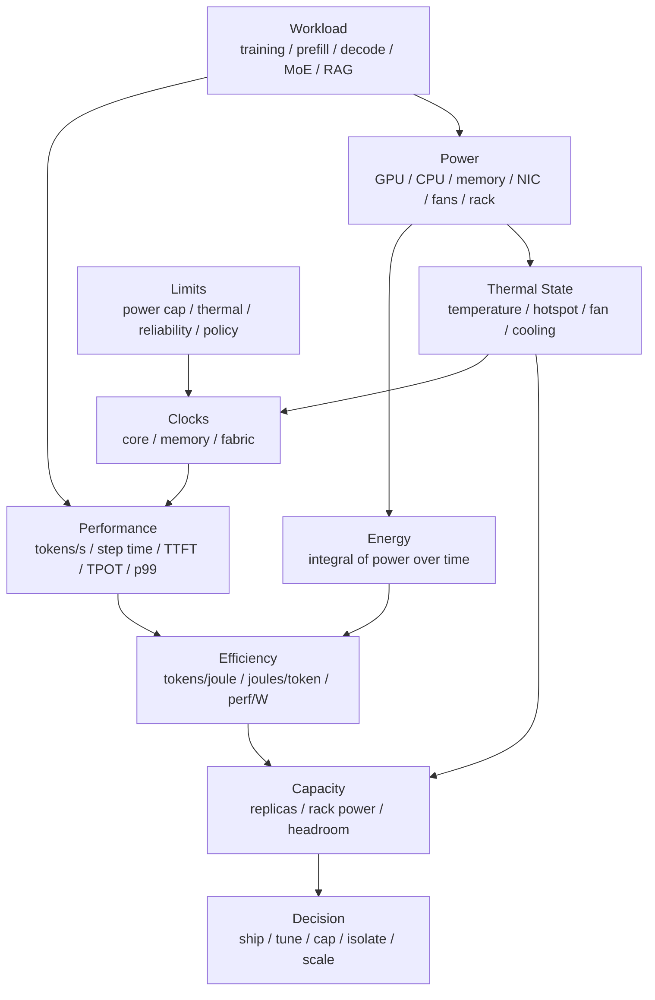

# 能效、功耗与热限制：Power、Energy per Token 与持续吞吐

AI 系统的性能结论如果只写“tokens/s 提升了多少”，是不完整的。

还要问：

- 这个 tokens/s 是短时峰值，还是热稳态后的持续吞吐？
- 功耗是多少？
- 每个 token 消耗多少能量？
- p99 延迟有没有被功耗策略或频率波动影响？
- 降低 power cap 后，性能损失和能效收益分别是多少？
- 训练 step time 变快了，但总能耗是否降低？
- GPU 功耗降低了，整机功耗是否也降低？
- 某个节点更慢，是软件问题，还是热限制、功耗限制、频率策略或硬件健康问题？

第 6 章的 [功耗、散热、频率与可靠性](../06-accelerators-architecture/power-thermal-reliability.md) 从硬件架构和系统设计角度解释了 power、thermal、clock、throttling 和 RAS。本篇站在 benchmark 与容量建模角度，重点回答：

> 如何把功耗、能效、温度、频率、throttle reason 和持续吞吐纳入 AI benchmark，避免只追求短时峰值，而忽略长期运行成本、热稳定性和尾延迟？

先给出一个判断原则：

```text
能效 benchmark 不是单独追求低功耗，
而是在明确 workload、SLA、质量和测量边界后，
比较每单位有效产出需要多少能量。
```

如果一个配置 `power` 更低，但 `tokens/s` 下降更多、p99 延迟超标、训练收敛变差，或者热稳态下频率持续下降，它就不是更好的能效配置。

## Energy Benchmark Contract

能效测试最怕“数字是真的，但问题没定义清楚”。因此每次测试前先写一个 Energy Benchmark Contract。

```yaml
workload:
  type: inference | training
  model: ...
  precision: ...
  input_distribution: ...
  output_distribution: ...
  arrival_process_or_step_config: ...

objective:
  primary_metric: joules/token | tokens/joule | energy_to_target
  guardrail_metrics: [p99_latency, quality, error_rate, thermal_stability]
  sla: ...

measurement_boundary:
  scope: gpu_only | node_level | rack_level | facility_level
  idle_baseline: included | subtracted
  idle_definition: bare_idle | model_loaded_idle | service_idle

telemetry:
  power_source: nvml | dcgm | nvidia_smi | pdu | bmc
  sampling_interval: ...
  clock_metrics: ...
  temperature_metrics: ...
  throttle_metrics: ...

run_window:
  warmup: ...
  steady_state_criteria: ...
  measurement_start: ...
  measurement_end: ...

power_policy:
  power_limit: ...
  clock_policy: default | locked | application_clocks
  power_cap_sweep: ...

decision:
  recommended_config: ...
  caveats: ...
```

这个 contract 的作用不是增加文档负担，而是让后续讨论不再混淆以下问题：

- 测的是 GPU 本身，还是整机、机柜、数据中心。
- 比较的是短时峰值，还是热稳态后的持续交付能力。
- 算的是所有能耗，还是扣除 idle 后的增量能耗。
- 产出是 raw tokens，还是满足 SLA、质量和稳定性后的有效 token。
- 目标是推理单位成本，还是训练到目标质量的总能耗。

## 一张总图



这张图表达一个核心关系：

```text
可交付性能 = 吞吐 / 延迟 / 稳定性 / 能耗 / 热约束共同成立
```

短时间跑得快，不等于长期能交付。AI 训练和推理都是持续负载，最终要看 steady-state 下的有效吞吐、尾延迟、能耗和硬件健康。

## 基本指标

### Power

Power 是瞬时功率，单位通常是 watt。

常见口径：

| 指标 | 含义 |
| --- | --- |
| GPU power | GPU 板卡或芯片相关功耗 |
| CPU power | CPU 侧功耗 |
| node power | 整机功耗，通常包含 GPU、CPU、内存、NIC、SSD、风扇、PSU 损耗 |
| rack power | 机柜级功耗 |
| facility power | 数据中心供电和冷却后的整体功耗 |

做 benchmark 时必须写清楚功耗口径。

同样是 `joules/token`：

- 只算 GPU power，适合分析 GPU kernel 或模型配置。
- 算 node power，适合分析服务器交付效率。
- 算 rack/facility power，适合容量、电力和冷却规划。

这几个数字不能混用。

做横向对比时，建议同时保留两个数字：

```text
power_under_load: workload 运行时的平均功率
incremental_power: power_under_load - idle_power
```

`power_under_load` 更接近部署成本，`incremental_power` 更适合分析 workload 自身带来的额外消耗。两者回答的问题不同。

### Energy

Energy 是一段时间内消耗的能量。

公式是：

```text
energy = integral(power over time)
```

离散采样时可以近似为：

```text
energy_joules = sum(power_watts_i * delta_time_seconds_i)
```

如果采样间隔固定：

```text
energy_joules ~= average_power_watts * duration_seconds
```

功率是“每一刻消耗多快”，能量是“这段运行一共消耗多少”。

如果硬件提供 energy counter，可以直接使用计数器差值：

```text
energy = energy_counter_end - energy_counter_start
```

如果只能用功率采样积分，则要保留原始采样点。否则很难审查测量窗口是否准确，也很难发现 power spike、缺失采样或时间戳漂移。

### Energy per Token

推理常用：

```text
joules_per_output_token = total_energy / output_tokens
```

有时也会看：

```text
joules_per_total_token = total_energy / (input_tokens + output_tokens)
```

两者含义不同。

LLM 服务中：

- prefill 主要消耗 input tokens。
- decode 主要交付 output tokens。
- 长 prompt、短输出和短 prompt、长输出的能耗结构不同。

因此报告时要说明 token 口径。

更完整的推理口径可以写成：

```text
joules_per_successful_output_token_at_SLA
  = total_energy_in_measurement_window
    / output_tokens_from_successful_requests_that_meet_SLA
```

这样可以避免一种常见误判：某个配置通过堆大 batch 降低了平均 `joules/token`，但 timeout、reject 或 p99 超标更多，线上可用的有效 token 反而下降。

### Tokens per Joule

`tokens/joule` 是 `joules/token` 的倒数：

```text
tokens_per_joule = tokens / energy_joules
```

越高越好。

也可以写成：

```text
tokens/s/W
```

因为：

```text
tokens/s/W = tokens/s / watts = tokens / joule
```

但 `tokens/joule` 也必须带上 workload 和 SLA。例如：

```text
tokens/joule at p99 TPOT <= 50 ms
tokens/joule for input_len=2k, output_len=512
tokens/joule under open-loop 80 QPS
```

否则一个长 prompt 测试和一个短 prompt 测试的 `tokens/joule` 不能直接比较。

### Energy to Target

训练不能只看 `joules/token`。

训练最终目标是达到某个 loss、quality 或 benchmark score。因此更重要的是：

```text
energy_to_target = total_energy_until_target_quality
```

一个配置可能 tokens/s 高、joules/token 低，但如果收敛变差、需要更多 tokens，最终 energy to target 反而更高。

训练能效报告应同时记录：

- tokens/s。
- step time。
- joules/step。
- joules/token。
- validation loss / target metric。
- energy to target。

如果训练实验包含多次失败、调参和重启，最终也要区分：

```text
run_energy: 单次训练 run 的能耗
project_energy: 达到目标质量前所有尝试的总能耗
```

前者适合比较训练系统实现，后者更接近真实研发成本。

### Sustained Performance

持续性能是进入热稳态后，系统长时间可维持的性能。

它不同于短时峰值：

```text
peak performance: short window, ideal state
sustained performance: after warmup, thermal steady state, stable clocks
```

很多问题只会在长时间运行后出现：

- 温度升高。
- 风扇转速变化。
- power throttling。
- thermal throttling。
- memory clock 下降。
- 节点热点。
- 机柜功耗逼近上限。
- ECC/Xid/link error 增多。

所以能效 benchmark 必须区分 warmup 窗口和 steady-state 窗口。

## 测量边界

能效数据最容易出错的地方是测量边界不清。

同一个系统至少有四层边界：

| 边界 | 适合回答的问题 | 不适合回答的问题 |
| --- | --- | --- |
| GPU-only | 某个模型、kernel、batch、power cap 在 GPU 上是否更省 | 整机真实能耗 |
| node-level | 一台服务器能以多少电力交付多少有效吞吐 | 机柜供电和冷却是否足够 |
| rack-level | 一个机柜可部署多少节点，峰值功率是否超限 | 单个 kernel 是否优化成功 |
| facility-level | 数据中心整体能效、PUE 后的真实能源成本 | 单机调参细节 |

写报告时不要只写“功耗 5 kW”。要写：

```text
scope = node-level
power_source = rack PDU
idle_baseline = included
measurement_window = thermal steady state, 30 min
```

这样别人才能判断这个数字是否能用于采购、调度、成本或算法对比。

### GPU-only

GPU-only 适合分析：

- 模型配置。
- kernel 优化。
- quantization。
- batching。
- KV Cache。
- power cap sweep。

优点是贴近加速器本身。

缺点是忽略：

- CPU tokenization。
- host memory。
- NIC。
- NVMe。
- 风扇。
- PSU 损耗。
- 节点 idle baseline。

GPU-only 数字不能直接代表整机或数据中心成本。

它尤其适合做局部因果分析。例如：

- 量化前后 GPU 功耗是否下降。
- 某个 kernel fusion 是否减少 HBM 访问和能耗。
- 同一个模型在不同 batch size 下的 tokens/joule。
- power cap 降低后 GPU 频率和吞吐如何变化。

但如果 GPU-only `joules/token` 下降，而 CPU tokenization、network、storage 或风扇功耗上升，node-level 结果可能没有改善。

### Node-level

Node-level 包含整台服务器。

它适合回答：

- 这台服务器每瓦能交付多少 tokens/s？
- CPU preprocessing 是否抵消了 GPU 优化收益？
- 风扇和冷却是否显著增加功耗？
- NIC、NVMe、DPU 是否在某些 workload 下变重要？

如果目标是采购、容量规划或线上服务，node-level 更有意义。

Node-level 还适合发现“GPU 优化被系统开销吃掉”的情况：

```text
GPU energy/token improves by 20%
node energy/token improves by 5%
```

这通常说明瓶颈或能耗已经转移到 CPU、内存、网络、风扇、PSU 损耗或服务框架开销。

### Rack / Facility-level

Rack-level 和 facility-level 适合回答：

- 一个机柜能放多少台高功耗服务器。
- 机柜功耗峰值是否会超限。
- 冷却是否足够。
- 集群调度是否需要 power-aware placement。
- 数据中心级 energy/token 是多少。

这类指标需要 PDU、机柜电表或数据中心侧计量，不能只靠 GPU telemetry。

Facility-level 还会引入冷却和供配电效率。实际数据中心经常用 PUE 描述设施总能耗与 IT 设备能耗的比例：

```text
facility_energy ~= IT_energy * PUE
```

如果只做系统优化实验，不一定需要把 PUE 混进去；如果要估算真实能源成本、碳排或数据中心容量，就需要说明是否包含 PUE。

### Idle Baseline

是否扣除 idle baseline 取决于问题。

如果要分析“这个 workload 额外消耗多少能量”，可以看：

```text
incremental_energy = active_energy - idle_power * duration
```

如果要分析“线上部署真实消耗多少能量”，通常不能扣除 idle，因为机器保留容量本身就是成本。

可以把能耗拆成：

```text
total_energy = idle_baseline_energy + incremental_workload_energy
```

这对解释优化结果很有用。比如某个优化让 GPU workload 省了 20% 能量，但整机 idle baseline 很高，最终 node-level 只省了 8%。这不是测试错误，而是边界不同。

报告中必须明确：

- 是否扣除 idle baseline。
- idle baseline 怎样测。
- idle 状态是否加载模型。
- 是否有常驻服务、监控和 background job。

推理服务还要特别区分：

```text
bare idle: 机器开机但没有加载模型
model loaded idle: 模型常驻显存但没有请求
service idle: 模型、server、router、monitoring 都在运行但没有业务流量
```

线上容量规划通常更关心 `service idle`，因为空闲副本也占用电力和热预算。

## 采样与时间对齐

功耗采样不是越随便越好。

要注意：

- 采样间隔。
- 时间戳对齐。
- 不同指标采样延迟。
- power smoothing。
- telemetry 缺失值。
- 多 GPU 采样是否同步。
- benchmark 开始/结束时间是否准确。

如果每秒采一次 power，但请求只有几十毫秒，就不能把单个请求能耗精确归因到每个请求。可以做阶段级、窗口级或批次级估算。

一个实用规则是：

```text
采样间隔越粗，结论粒度越粗。
```

例如：

- 10 ms 级别采样可以观察短时 power spike，但工具链要求高。
- 100 ms 到 1 s 采样适合大多数服务窗口和训练 step 级分析。
- PDU 或机柜电表如果只有数秒级采样，更适合 node/rack steady-state，而不适合单请求归因。

推荐做法：

```text
benchmark timeline:
  warmup_start
  steady_state_start
  measurement_start
  measurement_end
  cooldown_end

telemetry timeline:
  power samples
  clocks
  temperatures
  throttle reasons
  utilization
  memory usage
  error counters
```

能效计算只使用 measurement window，避免把冷启动、模型加载和 warmup 混进去，除非目标就是测端到端冷启动成本。

时间对齐时建议保留统一的 run id：

```text
run_id
  benchmark log
  request or step metrics
  power samples
  clock samples
  temperature samples
  throttle reason samples
  error counters
  profiler trace, if any
```

之后所有曲线都按同一个 `run_id` 和时间轴合并。不要事后凭文件名或大概时间猜测。

### 能量积分的注意事项

如果使用功率采样积分，最好使用相邻采样点之间的真实时间差：

```text
energy = sum(power_i * (timestamp_{i+1} - timestamp_i))
```

不要假设采样间隔一定固定。真实系统中，采集进程可能因为 CPU 抢占、IO、GC、网络写入或监控系统抖动而产生不均匀间隔。

需要额外检查：

- measurement window 内是否有采样缺口。
- 开始和结束边界是否落在两个采样点之间。
- 多 GPU 的采样是否来自同一时刻。
- power smoothing 是否掩盖了尖峰。
- energy counter 是否在 reset、GPU reset 或 driver reload 后清零。

如果采样质量不足，报告中要降低结论粒度。例如可以说“30 分钟 steady-state node energy/token”，但不要说“某个请求消耗了多少 joule”。

## 需要采集的指标

### 性能指标

推理：

- requests/s。
- output tokens/s。
- total tokens/s。
- TTFT p50/p95/p99。
- TPOT p50/p95/p99。
- E2E latency p50/p95/p99。
- goodput at SLA。
- timeout / cancel / reject。

训练：

- step time。
- tokens/s。
- tokens/s/GPU。
- MFU。
- loss / validation metric。
- checkpoint overhead。
- failure/restart overhead。

能效指标不能脱离这些性能指标。

### 功耗指标

至少采集：

- power draw。
- power limit。
- energy counter，如果硬件支持。
- average/min/max power。
- per-GPU power。
- node/rack power，如果有。

只看平均 power 不够。短时间 power spike 可能触发机柜或电源限制，也可能对应 p99 抖动。

### 频率指标

采集：

- graphics / SM clock。
- memory clock。
- application clock 或 locked clock policy。
- clock throttle reason。
- power limit reason。
- thermal limit reason。
- reliability limit reason。

同样的 workload，如果 clocks 不同，benchmark 结果不可直接比较。

### 温度指标

采集：

- GPU temperature。
- HBM temperature，如果可用。
- hotspot temperature，如果可用。
- inlet / ambient temperature。
- fan speed 或 pump 状态。
- thermal margin。

温度不是只看“是否超过上限”。在接近上限前，频率和风扇功耗可能已经变化。

### 健康与错误指标

采集：

- ECC correctable / uncorrectable。
- Xid。
- retired pages / row remapping。
- PCIe replay / link error。
- NVLink / fabric error。
- GPU reset。
- node reboot。

长时间 benchmark 需要记录错误。一个能效很好的配置，如果导致错误率或不稳定性上升，就不能直接采用。

## 工具链

### nvidia-smi

`nvidia-smi` 适合快速查看和脚本采样：

- power draw。
- power limit。
- clocks。
- temperature。
- utilization。
- memory。
- ECC / Xid 相关信息。

它也支持循环采样和 CSV 输出。

但长期工具最好基于稳定 API 或监控系统。NVIDIA 文档也提醒，NVML 更适合作为维护型工具的底层接口。

适合用 `nvidia-smi` 做：

- 实验前快速确认 power limit、clock、temperature。
- 临时采集少量 CSV 样本。
- 排查某台机器是否明显异常。

不建议把复杂生产 benchmark 建在文本解析上，因为不同驱动版本、字段、单位和错误输出都可能影响解析稳定性。

### NVML

NVML 是 NVIDIA Management Library，适合程序化采集：

- power。
- clocks。
- temperature。
- utilization。
- ECC。
- process accounting。
- device state。

如果要把能效 benchmark 做成自动化工具，NVML 通常比解析 `nvidia-smi` 文本更稳。

NVML 更适合做：

- benchmark runner 内部的同步采样。
- per-GPU 指标采集。
- power cap / clock policy 的实验控制。
- 把硬件状态与请求日志或训练 step 日志写到同一个 run record。

如果要做高质量实验，建议在每个 run 结束时保存原始 NVML 样本，而不只是保存平均值。

### DCGM / DCGM Exporter

DCGM 适合集群级 GPU telemetry。

常见用途：

- Prometheus 采集 GPU 指标。
- dashboard。
- alert。
- job-level GPU 统计。
- health diagnostics。
- power、temperature、utilization、memory、errors。

DCGM 的价值在于长期、集群级观测，而不是替代 profiler。能效分析通常需要把 DCGM 指标与 benchmark 的请求/step 指标对齐。

DCGM/Prometheus 的优势是“持续”和“规模化”：

- 同时观察很多节点和 GPU。
- 对比同型号节点之间的 power/temperature/clock 差异。
- 在长时间训练或线上推理中发现热区、慢节点、错误计数和 throttle。
- 把 benchmark 结果与生产监控对齐。

它的局限是采样粒度和端到端归因。DCGM 告诉你 GPU 发生了什么，但通常还需要请求日志、训练日志、trace 或 profiler 才能解释为什么发生。

### 外部功率计 / PDU

如果目标是 node/rack/facility 能效，需要外部功率测量：

- 智能 PDU。
- 机柜电表。
- 服务器 BMC。
- 实验室功率计。
- 数据中心能耗系统。

外部计量通常采样频率更低，但边界更完整。

外部功率计最常见的坑是时间同步和采样频率：

- PDU 可能只提供秒级甚至更低频率的数据。
- BMC 读数可能经过平滑处理。
- 机柜电表的边界可能包含交换机、存储或其他节点。
- 实验室功率计要确认接的是整机输入，而不是某个 PSU 或某一路电源。

因此外部计量更适合稳态窗口和容量规划，不适合解释单个 kernel 或单个请求的能耗。

## Benchmark 流程

一套可复现流程如下。

### 1. 固定环境

记录：

- GPU 型号和数量。
- CPU、内存、NIC、SSD。
- 散热方式。
- driver、CUDA、NCCL、framework、inference engine。
- 容器镜像 digest。
- power limit。
- clock policy。
- 环境温度。
- 节点位置。
- 是否共享机柜或共享任务。

功耗和热状态对环境很敏感，不记录环境就很难复现。

### 2. 记录 idle baseline

在开始 workload 前记录：

- idle GPU power。
- idle node power。
- idle clocks。
- idle temperatures。
- background process。

如果模型常驻内存，要说明 idle baseline 是：

```text
bare idle
or
model loaded idle
```

线上推理服务通常更关心 model loaded idle，因为热模型常驻是实际成本。

### 3. Warmup 到热稳态

不要刚开始就计入正式窗口。

需要让：

- kernel 编译完成。
- CUDA graph / cache 预热。
- 模型权重和 KV Cache 路径稳定。
- temperature 上升到稳定区间。
- fan/pump 响应稳定。
- clocks 稳定。

可以用以下条件判断：

- 最近 N 分钟平均温度变化很小。
- clocks 没有持续下降。
- tokens/s 或 step time 波动进入稳定范围。
- throttle reason 没有新变化。

### 3.1 热稳态判定

热稳态不是“温度没有超过上限”，而是系统的温度、风扇、频率和性能都进入稳定区间。

一个可执行的判定标准可以写成：

```text
thermal_steady_state is true when:
  temperature slope is small for N minutes
  clock range stays within expected band
  throughput or step time variance is stable
  fan or pump response is stable
  no new throttle reason appears
  no new Xid/ECC/link error appears
```

实践中，训练任务和长上下文推理通常需要更长 warmup；短 prompt、小模型或低 QPS 测试可能较快稳定。报告里不要只写“warmup 5 分钟”，还要说明为什么认为 5 分钟已经进入热稳态。

如果热稳态前后性能不同，应该分开报告：

| 阶段 | 典型表现 | 是否用于最终能效结论 |
| --- | --- | --- |
| cold start | 模型加载、kernel 编译、cache 未热 | 通常不用于稳态能效 |
| warmup | 温度上升、风扇响应、频率变化 | 用于观察趋势，不直接比较 |
| steady state | 温度、频率、吞吐、延迟稳定 | 用于主要结论 |
| degradation | throttle、错误、频率下降、p99 变差 | 单独报告为风险 |

如果测试过程中一直无法进入 steady state，就说明系统配置、散热、power cap、workload 或调度策略本身存在问题。此时不要强行给出单一能效数字，应把“不稳定”作为主要结论。

### 4. 固定 workload 分布

推理要固定：

- 模型。
- 输入长度分布。
- 输出长度分布。
- QPS / 并发。
- batch 策略。
- cache 状态。
- sampling 参数。
- RAG / agent 请求比例。

训练要固定：

- global batch。
- micro batch。
- sequence length。
- parallel strategy。
- precision。
- checkpoint / eval 频率。
- 数据 pipeline。

能效比较必须在同等 workload 下进行。

### 5. 采集 steady-state 窗口

在测量窗口内采集：

- performance。
- power。
- energy。
- clocks。
- temperatures。
- throttle reason。
- utilization。
- memory。
- error counters。

输出：

```text
average_power
power_p95
power_p99
energy
tokens/s
goodput at SLA
joules/token
tokens/joule
p95/p99 latency
temperature range
clock range
throttle events
```

推荐至少保存三类数据：

- 原始 telemetry：每个采样点的 power、clock、temperature、throttle、error。
- 原始 workload metrics：每个请求或每个 step 的时间、状态、token 数、延迟。
- 聚合报告：平均值、分位数、总能耗、能效、异常说明。

只保存聚合值会让结论很难复查。尤其是能效实验，常常需要回看某个时间点是否出现过 throttle、节点抖动或采样缺失。

### 6. 重复与对比

至少重复多次，观察方差。

不同配置之间比较时，必须保持：

- workload 相同。
- steady-state 窗口相同。
- telemetry 口径相同。
- 同一硬件或等价硬件。
- 同一环境温度范围。

否则能效结论很容易被环境噪声污染。

## Power Cap Sweep

Power cap sweep 是能效分析最常用的方法之一。

做法是对同一 workload 测多个 power limit：

```text
power cap: 100%, 90%, 80%, 70%, ...
```

每个点记录：

| Power Cap | tokens/s | p99 latency | avg power | joules/token | temp | throttle |
| --- | --- | --- | --- | --- | --- | --- |
| 100% | ... | ... | ... | ... | ... | ... |
| 90% | ... | ... | ... | ... | ... | ... |
| 80% | ... | ... | ... | ... | ... | ... |

目标不是找到最低功耗，而是找到 sweet spot：

```text
在满足 SLA 和稳定性的前提下，joules/token 最低或 tokens/joule 最高
```

常见结果：

- 轻微降低 power cap，吞吐几乎不变，能效明显提升。
- 继续降低 power cap，吞吐开始快速下降。
- p99 在某个功耗点后明显变差。
- thermal throttling 消失，稳定性改善。

不同 workload 的曲线不同，不能把一个模型的 sweet spot 直接套到另一个模型。

### 曲线怎么看

Power cap sweep 至少要看三条曲线：

```text
throughput vs power cap
joules/token vs power cap
p99 latency or step time variance vs power cap
```

常见形态是：

1. 高 power cap 区间：吞吐接近峰值，但能效不一定最好。
2. 中间区间：吞吐下降很小，功耗下降明显，tokens/joule 提升。
3. 低 power cap 区间：频率受限，吞吐和 p99 明显变差，能效开始下降。

所谓 sweet spot 通常在第 2 段。它不是单纯“功耗最低”的点，而是“有效产出、SLA、稳定性、热余量共同最划算”的区间。

### Pareto Frontier

如果同时比较吞吐、延迟和能耗，可以画 Pareto frontier。

一个配置如果在所有关键指标上都不如另一个配置，就不值得保留：

```text
config A:
  higher goodput
  lower joules/token
  lower or equal p99
  no worse error/throttle

config B:
  lower goodput
  higher joules/token
  higher p99

=> B is dominated by A
```

最终推荐配置往往不是 Pareto frontier 上最极端的点，而是留有 headroom 的点。线上系统需要面对请求波动、环境温度变化、节点老化、故障转移和版本更新。

### 分阶段 Sweep

推理服务最好对不同阶段分别 sweep：

- prefill-heavy workload。
- decode-heavy workload。
- mixed request workload。
- cache hit workload。
- cache miss workload。
- RAG / agent workload。

训练任务也最好区分：

- 纯 forward/backward 稳态。
- eval。
- checkpoint。
- data loading 边界。
- 通信密集阶段。

因为同一个 power cap 对 GEMM、attention、KV Cache 读写、NCCL 通信和 checkpoint IO 的影响不同。只测一个合成 workload，可能选错线上配置。

## 训练场景

训练能效分析要同时看速度、稳定性和质量。

训练和推理最大的区别是：训练的目标不是“处理一个请求”，而是“在一定时间和成本内达到目标质量”。

因此训练能效至少有两层：

```text
system efficiency:
  每秒训练多少 token，每个 token 消耗多少能量

optimization efficiency:
  到达目标 loss / eval score / downstream metric 一共消耗多少能量
```

如果只优化 system efficiency，但导致收敛变差、梯度不稳定、需要更多 token 或更多重跑，最终 energy to target 可能更差。

### Step Energy

可以先算：

```text
joules_per_step = average_power * step_time
```

再算：

```text
joules_per_training_token
  = energy / trained_tokens
```

但这仍然不够，因为训练还包括：

- eval。
- checkpoint。
- restart。
- data preprocessing。
- failed runs。
- hyperparameter search。

更完整的口径是：

```text
total_energy
  = successful_training_energy
  + eval_energy
  + checkpoint_energy
  + restart_energy
  + failed_experiment_energy
```

对于长训练任务，建议报告两种能耗：

```text
steady_state_training_energy:
  只计算稳定训练窗口内的 forward/backward/optimizer

end_to_end_run_energy:
  包含 eval、checkpoint、数据加载、重启和失败恢复
```

前者适合分析系统实现，后者适合做容量和成本决策。

### Energy to Target

训练最终建议报告：

```text
energy_to_target
  = total_energy_until(metric >= target_metric)
```

或者对 loss：

```text
energy_to_target
  = total_energy_until(validation_loss <= target_loss)
```

这里的 target 必须提前定义，不能在看完实验结果后再挑一个有利指标。

一个典型报告可以写成：

| 配置 | tokens/s/GPU | joules/token | time to target | energy to target | 备注 |
| --- | --- | --- | --- | --- | --- |
| baseline | ... | ... | ... | ... | ... |
| larger batch | ... | ... | ... | ... | 收敛是否一致 |
| lower power cap | ... | ... | ... | ... | step time 与稳定性 |
| new optimizer | ... | ... | ... | ... | 质量和重跑次数 |

如果某个配置训练吞吐更高，但 energy to target 更差，要优先相信 energy to target。吞吐是过程指标，目标质量是结果指标。

### MFU 与能效

高 MFU 通常有助于能效，因为计算单元更有效地产出训练 token。

但高 MFU 不是充分条件。

可能出现：

- MFU 高，但 power 很高，tokens/joule 不一定最优。
- MFU 高，但通信或 checkpoint 导致端到端能耗高。
- MFU 高，但训练不稳定，需要重跑。
- MFU 高，但数据质量或 batch 设置导致收敛变差。

训练能效最终要看 energy to target，而不是某个 step 的能效。

可以把 MFU、tokens/joule 和 loss 曲线放在一起看：

```text
high MFU + good tokens/joule + same or better convergence
  => 值得继续

high MFU + worse convergence
  => 需要谨慎

low MFU + good energy_to_target
  => 可能是算法或数据效率更好，不应只因 MFU 低否定
```

### Power Cap 对训练的影响

对大 GEMM 占主导的训练，降低 power cap 可能会明显增加 step time。

但也可能出现：

- 小幅降 power cap，step time 只略变慢，能效提升。
- 降低热点节点功耗后，长期 thermal throttling 减少，整体更稳定。
- 多节点训练中，最慢 rank 决定 step time，单看平均 power 没意义。

训练 power cap sweep 应记录：

- per-rank step time。
- slowest rank。
- communication time。
- GPU power。
- clocks。
- thermal events。
- loss curve。

多机训练还要特别看慢 rank。同步训练中每一步通常要等所有 rank 完成：

```text
step_time ~= max(rank_step_time)
```

如果 power cap 让少数热节点变慢，整个训练 job 都会变慢。此时平均 GPU power 或平均 GPU utilization 可能看起来不错，但实际能效会被 slowest rank 拖垮。

### Checkpoint、Eval 与重启能耗

大型训练任务中，非训练 step 的能耗也不可忽略：

- checkpoint 写盘时 GPU 可能等待，但节点仍然耗电。
- eval 可能占用独立 GPU 或打断训练节奏。
- 数据预处理、shuffle、packing 会消耗 CPU、存储和网络。
- 节点故障后的重启会重复部分训练进度。

因此训练报告要写清楚：

```text
checkpoint_frequency
checkpoint_duration
eval_frequency
restart_count
lost_steps_after_failure
failed_run_energy
```

如果一个系统把 steady-state step time 优化了 5%，但让 checkpoint 或重启成本上升，端到端 energy to target 可能没有改善。

## 推理场景

推理能效要同时看 throughput、latency 和请求分布。

推理能效的核心不是“每个 token 平均多少 joule”这么简单，而是：

```text
在指定请求分布和 SLA 下，
每个成功交付的有效 token 需要多少能量。
```

这要求报告中同时写清楚：

- 输入长度分布。
- 输出长度分布。
- arrival process 或并发方式。
- cache hit/miss 状态。
- sampling 参数。
- timeout、cancel、reject 的处理方式。
- SLA 定义，例如 TTFT、TPOT、E2E latency。

### Prefill 与 Decode 分开看

Prefill 和 decode 的功耗形态不同。

Prefill：

- 长 prompt。
- 大 GEMM。
- attention 计算密集。
- 更可能出现高瞬时功耗。

Decode：

- 逐 token。
- KV Cache 读写。
- 小 kernel。
- 对 p99 和频率抖动敏感。

如果只给一个 `joules/token`，可能掩盖：

- 长 prompt 的 prefill 能耗。
- 长输出的 decode 能耗。
- KV Cache 命中和 miss 的差异。
- batching 对不同阶段的影响。

更好的做法是记录：

```text
prefill energy per input token
decode energy per output token
end-to-end energy per request
```

如果工具链无法把单请求能耗精确分开，也可以在 workload 级别构造阶段测试：

```text
prefill-dominant benchmark:
  long input, short output

decode-dominant benchmark:
  short input, long output

mixed benchmark:
  production-like input/output distribution
```

然后分别报告三个窗口的能效。这样比把所有请求混在一个平均数里更容易解释优化收益。

### Cache Hit 与 Cache Miss

Prefix cache、KV Cache reuse、RAG 上下文复用都会改变能耗结构。

Cache hit 可能减少 prefill 计算：

```text
same request family
  with prefix cache hit
  lower TTFT
  lower prefill energy
```

但缓存也会带来显存占用、调度复杂度和淘汰成本。报告中要区分：

- cache disabled。
- warm cache。
- cold cache。
- mixed hit rate。
- cache eviction pressure。

如果只在 warm cache 下测能效，结果可能高估生产收益；如果生产中确实有高复用率，也应该把 hit rate 写入 workload contract。

### Batching 与能效

batching 通常能提升 tokens/s/W，因为 GPU 利用率更高。

但 batching 也可能：

- 增加 TTFT。
- 增加 KV Cache 占用。
- 放大 p99。
- 增加单次功耗峰值。

所以推理能效必须和 SLA 一起看：

```text
energy_per_successful_token_at_SLA
```

如果一个配置 energy/token 更低，但 p99 超标或 timeout 增加，它不一定是更好的线上配置。

可以进一步写成：

```text
goodput_per_watt
  = successful_tokens_under_SLA_per_second / average_power
```

这比 raw `tokens/s/W` 更适合线上服务。因为 raw tokens 可能包含超时请求、被取消请求、超过 SLA 的慢请求，甚至包含用户体验上已经失败的产出。

### Quantization 与能效

量化可能降低：

- weight bytes。
- HBM 读写。
- 计算能耗。
- 显存占用。

但也可能增加：

- dequant 开销。
- scale 读取。
- layout conversion。
- kernel fallback。
- 质量损失带来的重试或更长输出。

因此量化能效要同时看：

- tokens/s。
- joules/token。
- TTFT/TPOT。
- quality。
- dequant/fused kernel 是否生效。
- GPU power 和 HBM bandwidth 是否下降。

### Speculative Decoding 与能效

Speculative decoding 可能提高输出吞吐，但它不是天然省电。

它会引入 draft model、verification、accepted token rate 等因素：

```text
effective_decode_energy
  depends on accepted_tokens / drafted_tokens
```

如果接受率高，主模型 decode step 减少，能效可能改善；如果接受率低，draft model 的额外计算可能抵消收益。

报告中建议记录：

- draft model。
- accepted token rate。
- target model verification cost。
- output tokens/s。
- TPOT p95/p99。
- energy per successful output token。

只报告加速比，不报告能耗和接受率，无法判断 speculative decoding 是否真的更省。

## 常见诊断模式

### 高功耗、高吞吐

可能是正常高效运行。

需要继续看：

- tokens/joule 是否好。
- 温度是否稳定。
- clocks 是否稳定。
- p99 是否满足 SLA。
- 是否接近机柜功耗上限。

高功耗不是问题本身，低效率才是问题。

### 高功耗、低吞吐

可能原因：

- kernel 低效。
- 通信等待。
- HBM 访问低效。
- 处理了很多超时或取消请求。
- batch 过大导致 p99 失败。
- CPU / storage / network 导致 GPU 无效等待。

排查：

- 看 profiler。
- 看 goodput 而不是 raw throughput。
- 看 timeout/cancelled。
- 看 HBM、SM、Tensor Core 指标。
- 看 queueing latency。

### 低功耗、低吞吐

可能原因：

- 数据输入供不上。
- CPU tokenization 瓶颈。
- QPS 不足。
- GPU 没被调度到。
- kernel launch-bound。
- power cap 过低。
- clocks 被策略限制。

排查：

- 看 GPU active。
- 看 queue length。
- 看 CPU。
- 看 clocks。
- 看 power limit 和 application clocks。

### 温度升高后性能下降

可能原因：

- thermal throttling。
- fan/pump 不足。
- 机柜热点。
- 风道阻塞。
- 多个高功耗 job 被调度到同一热区。

排查：

- 对齐 temperature、clocks、tokens/s。
- 看 throttle reason。
- 对比同型号不同节点。
- 做长时间稳态测试。

### 平均能效好，但 p99 差

可能原因：

- power cap 降得太低。
- clocks 波动。
- batching 过大。
- decode 阶段受频率或 HBM 抖动影响。
- 热节点拖尾。

排查：

- 分位数而不是均值。
- phase-level TTFT/TPOT。
- slow replica。
- p99 请求所在节点的 power/clock/temperature。

## 容量规划中的功耗

容量规划不能只算 GPU 数。

还要算：

- 机柜功率。
- 冷却能力。
- 电源冗余。
- 节点 power headroom。
- 热点。
- 推理峰值时间段。
- 训练大 job 同时运行概率。
- 故障转移后的功耗集中。

一个简单模型：

```text
rack_power
  = sum(node_power_under_target_workload)
  + network_switch_power
  + storage_power
  + safety_margin
```

如果线上推理需要 N+1 冗余，还要验证：

```text
one replica pool fails
  -> traffic shifts
  -> remaining nodes power rises
  -> p99 and thermal state still acceptable
```

否则故障转移可能从性能问题变成功耗和热问题。

### Headroom 不是浪费

电力和散热都需要 headroom。

常见原因：

- 请求高峰会让推理节点功耗上升。
- 长 prompt 或 prefill-heavy 流量会提高瞬时功耗。
- 训练 job 同时进入高功耗阶段。
- 环境温度上升会降低散热余量。
- 节点老化、风扇积尘、冷却液状态会改变热表现。
- 故障转移会把流量集中到剩余节点。
- rolling update 时需要临时并存新旧副本。

因此容量模型不要用“满载平均功率刚好等于机柜上限”。应该使用：

```text
planned_rack_power
  = expected_peak_IT_power * safety_factor
```

其中 safety factor 由数据中心供电、冷却、SLA、故障域和运维策略共同决定。

### 推理容量中的能效指标

推理容量规划可以把单副本 benchmark 曲线转换成：

```text
replica_count = target_goodput / goodput_per_replica_at_SLA
total_power = replica_count * node_power_at_target_load
tokens_per_joule = target_goodput / total_power
```

但这只是起点。还要考虑：

- autoscaling 滞后导致的临时过载。
- 多模型混部造成的功耗叠加。
- RAG、rerank、tool call 带来的 CPU/NIC/storage 功耗。
- cache 命中率变化。
- N+1 或 N+K 冗余。
- 限流和降级策略。

如果服务在高峰时必须保留大量空闲副本，`service idle` 的能耗就会显著影响整体 energy/token。

### 训练容量中的能效指标

训练容量规划更关注：

```text
job_completion_time
energy_to_target
cluster_power_peak
power_limit_under_parallel_jobs
```

一个训练 job 单独跑时能效好，不代表它在集群里最好。多个 job 并发时，机柜 power cap、网络拓扑、冷却分布和调度策略会改变整体效率。

因此训练集群要看：

- 单 job tokens/joule。
- 多 job packing 后的 cluster tokens/joule。
- 是否出现 rack power hotspot。
- 是否有慢 rank 被热状态拖慢。
- checkpoint 和 eval 是否集中造成 IO 与功耗峰值。
- 低优先级 job 是否可以在电力紧张时降 power cap。

## Power-aware Scheduling

调度系统可以把功耗和热状态作为信号。

可用信号：

- node power headroom。
- rack power headroom。
- GPU temperature。
- HBM temperature。
- recent throttle events。
- recent Xid/ECC/link error。
- workload power profile。
- job priority。

可做策略：

- 避免高功耗训练 job 集中到同一机柜。
- 把 prefill-heavy 推理分散到 thermal margin 更好的节点。
- 避开近期 throttle 严重的节点。
- 对低优先级离线 job 设置 power cap。
- 在电力紧张时降级 batch job，而不是影响在线推理。

注意：power-aware scheduling 的目标不是让所有节点功耗一样，而是让 SLA、吞吐、能效和硬件安全同时成立。

一个简单策略可以分三层：

```text
admission:
  当前 rack/node power headroom 是否允许新 job 进入

placement:
  把 job 放到 power/thermal/error 状态合适的节点

runtime control:
  根据 SLA、温度、throttle 和功耗动态调整 power cap、batch 或并发
```

推理服务中，power-aware scheduling 要避免影响在线 SLA。训练和离线任务通常更适合做功耗降级，因为它们对尾延迟没有实时要求。

### Power-aware 不等于只看功耗

调度决策至少要同时看：

| 信号 | 作用 |
| --- | --- |
| goodput at SLA | 防止为了省电牺牲服务有效产出 |
| node power headroom | 防止节点功率超出策略 |
| rack power headroom | 防止机柜功率集中 |
| temperature / thermal margin | 防止热区和长期降频 |
| throttle reason | 判断是否已经被 power/thermal/reliability 限制 |
| error counters | 避免把关键任务放到不稳定节点 |
| workload phase | 区分 prefill-heavy、decode-heavy、通信密集、checkpoint 等阶段 |

如果调度器只看平均 GPU 利用率，很容易把多个高功耗或高热负载集中到同一机柜，造成局部退化。

## 常见误区

### 误区一：功耗越低越好

不对。

如果功耗降低 20%，吞吐降低 50%，能效反而变差。

正确看：

```text
tokens/joule
joules/token
goodput at SLA per watt
energy to target quality
```

### 误区二：GPU power 就代表系统能耗

不对。

CPU、内存、NIC、SSD、风扇、PSU 损耗、冷却都可能显著影响 node/facility 能耗。

GPU-only 适合局部优化，node/facility 口径适合部署决策。

### 误区三：短 benchmark 的能效可以代表长期运行

不对。

短 benchmark 可能还没进入热稳态，也可能没有触发风扇、功耗墙、thermal throttling 或机柜热点。

持续服务和训练任务必须看 steady-state。

### 误区四：平均 power 足够

不够。

还要看：

- power spike。
- p95/p99 power。
- clocks。
- throttle reason。
- temperature。
- p99 latency。

平均值会掩盖峰值和尾部问题。

### 误区五：只要 energy/token 降低就一定更好

不一定。

如果 energy/token 降低是靠更大的 batch、更多排队或更激进量化换来的，可能牺牲：

- TTFT。
- TPOT。
- p99。
- 质量。
- 稳定性。

线上推理应看：

```text
energy per successful token under SLA
```

训练应看：

```text
energy to target quality
```

## 报告模板

能效 benchmark 可以按下面模板记录。

```text
Workload:
  model / precision / batch / sequence length / QPS / request mix / training config

Objective:
  primary metric
  guardrail metrics
  target SLA or target quality

Boundary:
  GPU-only / node-level / rack-level / facility-level
  idle baseline included or subtracted
  idle definition

Environment:
  hardware / cooling / driver / runtime / engine / container / ambient temperature

Measurement Window:
  warmup duration
  thermal steady-state criteria
  steady-state start/end
  telemetry sampling interval

Performance:
  tokens/s / step time / TTFT / TPOT / p95/p99 / goodput at SLA

Power and Energy:
  average/min/max/p95/p99 power
  total energy
  incremental energy, if used
  joules/token
  tokens/joule
  joules/step
  energy to target, if training

Thermal and Clocks:
  temperature range
  core/memory clock range
  throttle reason
  fan/pump state

Health:
  ECC / Xid / link error / reset / node issue

Decision:
  recommended power cap
  target utilization
  capacity headroom
  power-aware scheduling implication
  caveats
```

## 检查清单

开始前：

- 是否写了 Energy Benchmark Contract？
- 是否明确测量边界？
- 是否记录 idle baseline？
- 是否说明 idle baseline 是 bare idle、model loaded idle 还是 service idle？
- 是否固定 workload 分布？
- 是否记录 power limit 和 clock policy？
- 是否知道 warmup 多久才进入热稳态？
- 是否提前定义 SLA 或训练 target quality？

采集时：

- 是否采集 power、temperature、clocks、throttle reason？
- 是否采集 p95/p99，而不只看平均吞吐？
- 是否对齐 telemetry 和 benchmark 时间戳？
- 是否记录错误计数？
- 是否保存原始数据？
- 是否检查采样缺口、时间戳漂移和 power smoothing？
- 是否确认 measurement window 已经热稳态？

分析时：

- 是否区分 peak 和 sustained？
- 是否计算 joules/token 或 tokens/joule？
- 是否验证 SLA 下的 goodput？
- 是否比较多个 power cap？
- 是否说明 GPU-only 和 node-level 口径差异？
- 是否检查质量、错误率和稳定性？
- 是否区分 prefill 和 decode 的能耗？
- 是否区分 cache hit 和 cache miss？
- 是否报告 power cap sweet spot，而不是只报告最低功耗点？
- 训练是否报告 energy to target，而不是只报告 step energy？

发布结论前：

- 是否保留 run manifest、原始 telemetry、workload 日志和聚合报告？
- 是否说明外部功率计、PDU、BMC 或 DCGM/NVML 的数据来源？
- 是否把 caveats 写清楚，例如采样频率、边界、未包含 PUE、未包含失败重跑？
- 是否能从报告复现实验环境、workload、窗口和计算方式？

## 小结

能效分析的核心不是“省电”，而是：

```text
在满足质量、延迟、吞吐和稳定性的前提下，
用更少能量交付更多有效 token 或训练进展。
```

对 AI 系统来说，能效 benchmark 必须把性能指标和硬件状态放在一起看：

- tokens/s 和 p99 说明服务是否好用。
- power 和 energy 说明代价。
- clocks 和 throttle reason 说明是否受功耗/热限制。
- temperature 和 error counters 说明长期风险。
- steady-state 窗口说明能否持续交付。

当团队开始系统性记录这些指标，容量规划就不会只停留在“需要多少 GPU”，而能进一步回答“需要多少电力、多少冷却、多少 headroom，以及什么配置下每个 token 最划算且最稳定”。

## 参考资料

- [NVIDIA DCGM Documentation](https://docs.nvidia.com/datacenter/dcgm/latest/user-guide/index.html)
- [NVIDIA System Management Interface](https://docs.nvidia.com/deploy/nvidia-smi/)
- [NVIDIA Management Library API Reference](https://docs.nvidia.com/deploy/nvml-api/)
- [MLPerf Power Benchmark](https://mlcommons.org/benchmarks/power/)
- [Green500](https://top500.org/lists/green500/)
