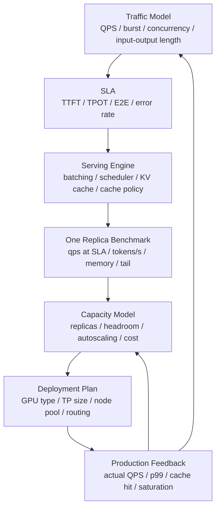

# 推理容量建模：QPS、并发、TTFT、TPOT 与 GPU 副本数

推理系统容量规划最常见的错误，是用“峰值吞吐”推算生产容量。

例如：

```text
单副本 benchmark: 3000 output tokens/s
目标业务: 30000 output tokens/s
结论: 需要 10 个副本
```

这个结论通常不可靠，因为它忽略了：

- 输入长度分布。
- 输出长度分布。
- TTFT 和 TPOT 的 SLA。
- 请求到达方式。
- 并发上限。
- KV Cache 容量。
- prefix cache 命中率。
- batching 策略。
- 冷启动和模型加载。
- tail latency。
- 错误率和重试。
- 保留 headroom。

推理容量建模的核心不是“这张 GPU 最多能吐多少 token”，而是：

> 在指定模型、请求分布、服务策略和 SLA 下，单个副本能稳定承载多少有效请求，然后需要多少副本满足目标流量和冗余要求。

## 一张总图



这张图表达一个闭环：

- 先定义业务流量和 SLA。
- 再测单副本在该约束下的能力。
- 用单副本能力推导副本数、headroom 和成本。
- 部署后用生产反馈修正模型。

容量模型不是一次性表格，而是持续校准的工程模型。

## 先定义服务目标

推理容量建模必须先回答：

```text
我们要服务什么模型？
请求长什么样？
SLA 是什么？
可接受的成本和错误率是多少？
```

一个可用的服务目标例子：

```text
model: 70B dense model
precision: FP8 / W8A8 / FP16
engine: vLLM / TensorRT-LLM / SGLang
input length p50/p95: 1k / 8k tokens
output length p50/p95: 256 / 1024 tokens
target QPS: 120
TTFT p95: < 800 ms
TPOT p95: < 50 ms/token
error rate: < 0.1%
availability: tolerate 1 node failure
```

如果只有“目标 QPS 120”，容量模型无法成立。

## 核心指标

### QPS

QPS 是每秒请求数。

但推理请求不是等价单位。一个 100 token 输入、20 token 输出的请求，和一个 32k 输入、4k 输出的请求，对系统压力完全不同。

所以 QPS 必须绑定请求分布：

```text
QPS at request mix X
QPS at input/output length distribution Y
QPS at SLA Z
```

### Concurrency

Concurrency 是系统中同时存在的请求数，包括：

- 排队中的请求。
- prefill 中的请求。
- decode 中的请求。
- 等待输出或后处理的请求。

排队论里的 Little's Law 可以作为直觉：

```text
concurrency ~= arrival_rate * latency
```

例如：

```text
QPS = 100 req/s
E2E latency = 2 s
concurrency ~= 200 requests
```

这说明如果目标 QPS 高、请求又长，系统必须能容纳足够并发。并发上限往往受 KV Cache 和调度策略约束。

### TTFT

TTFT 是 time to first token，从请求进入服务到第一个 token 返回。

它通常包括：

```text
request queue
  + tokenization / preprocessing
  + routing
  + prefill wait
  + prefill compute
  + first decode step
  + network / streaming overhead
```

TTFT 主要受输入长度、prefill 计算、batching 等待、queueing 和缓存命中影响。

### TPOT

TPOT 是 time per output token，常用于衡量 decode 阶段持续生成速度。

它通常和：

- decode batch size。
- KV Cache 读写。
- memory bandwidth。
- sampling。
- tensor parallel 通信。
- speculative decoding。
- CUDA graph / kernel fusion。

有关。

### E2E Latency

端到端延迟可以粗略拆成：

```text
E2E ~= queue_time + TTFT_compute + output_tokens * TPOT + postprocess_time
```

更细一点：

```text
E2E
  ~= queue
   + tokenize
   + prefill_wait
   + prefill_compute
   + decode_wait
   + decode_steps
   + detokenize
   + network
```

容量规划时要明确 SLA 是看 TTFT、TPOT、E2E，还是三者都看。

### Goodput

Goodput 是满足 SLA 的有效吞吐。

例如：

```text
系统总吞吐: 150 QPS
满足 TTFT/TPOT SLA 的请求: 120 QPS
错误或超时请求: 5 QPS
goodput = 120 QPS
```

容量规划应该使用 goodput，而不是总吞吐。

## 单副本能力不是一个数

单副本能力通常是一条曲线，而不是一个标量。

例如：

| QPS | TTFT p95 | TPOT p95 | Error Rate | 结论 |
| --- | --- | --- | --- | --- |
| 20 | 300 ms | 30 ms | 0% | 宽松 |
| 40 | 500 ms | 38 ms | 0% | 可用 |
| 60 | 900 ms | 55 ms | 0.1% | 可能超 SLA |
| 80 | 2000 ms | 90 ms | 1% | 不可用 |

如果 SLA 是 TTFT p95 < 800 ms、TPOT p95 < 50 ms，那么单副本容量不是 80 QPS，而是 40 QPS 左右，或者介于 40 和 60 之间，需要更细测试。

所以容量公式应该写成：

```text
replicas = ceil(target_qps / per_replica_goodput_at_sla)
```

而不是：

```text
replicas = ceil(target_peak_tokens_per_sec / peak_tokens_per_sec)
```

## 推理容量的三个约束

一个推理副本通常同时受三个约束：

```text
compute capacity
memory capacity
latency capacity
```

### Compute Capacity

计算能力决定 prefill 和 decode 的算力上限。

prefill 通常更像大矩阵计算，输入越长，prefill 成本越高。

decode 每步只生成一个 token，但要访问所有层的 KV Cache，常常更受内存带宽和调度影响。

粗略看：

```text
prefill_cost ~ input_tokens
decode_cost ~ output_tokens * active_sequences
```

真正的成本还取决于模型结构、attention 实现、并行方式和缓存命中。

### Memory Capacity

显存限制包括：

- 模型权重。
- KV Cache。
- runtime workspace。
- activation 临时空间。
- CUDA graph / engine cache。
- fragmentation。

KV Cache 通常是并发的主要限制。

粗略估算：

```text
kv_bytes_per_token
  ~= 2 * num_layers * num_kv_heads * head_dim * bytes_per_element
```

其中 2 代表 K 和 V。如果用了 tensor parallel，单 GPU 的 KV 负载还要考虑切分方式。不同架构、GQA/MQA、engine 实现和 cache block 管理都会改变实际值。

可容纳 token 数可以粗略写成：

```text
max_cached_tokens
  ~= available_kv_memory / kv_bytes_per_token
```

并发上限取决于：

```text
sum(input_tokens + generated_tokens for active_requests)
```

这就是为什么长上下文会迅速压低并发容量。

### Latency Capacity

即使算力和显存还没满，SLA 也可能先被打爆。

例如增加 batch 可以提高吞吐，但会带来：

- 请求排队更久。
- prefill 等待更久。
- decode step 被更大 batch 拖慢。
- p99 latency 上升。

因此服务容量常常不是硬件满载点，而是 SLA 刚好可接受前的点。

## Workload 模型

推理容量模型必须从真实 workload 出发。

### 输入长度分布

不要只记录平均输入长度。

需要至少记录：

- p50。
- p90。
- p95。
- p99。
- 最大值。
- 是否有多模态输入。
- 是否有 RAG 拼接。
- 是否有系统 prompt 和历史对话。

长输入主要影响 TTFT 和 KV Cache。

### 输出长度分布

输出长度决定 decode 时间和持续占用。

需要记录：

- p50/p95/p99 输出 token。
- max tokens 设置。
- stop 条件。
- 用户取消请求比例。
- streaming 是否开启。

如果 benchmark 固定输出 128 token，而生产 p95 是 2048 token，容量会严重高估。

### 到达过程

请求不是均匀到达。

常见模型：

- 固定并发。
- 固定 QPS。
- Poisson arrival。
- trace replay。
- burst traffic。

固定并发容易测吞吐上限；固定 QPS 更接近 SLA 验证；trace replay 最接近真实业务。

### Cache 命中

需要建模：

- prefix cache 命中率。
- system prompt 复用。
- 多轮对话历史。
- RAG context 复用。
- KV cache reuse。

cache 命中会显著改变 TTFT 和显存压力。不能用高 cache 命中 benchmark 去承诺低 cache 命中业务。

## 容量建模步骤

### 1. 定义目标流量

示例：

```text
target_qps_p50 = 80
target_qps_peak = 160
burst_duration = 5 min
request_mix = production_trace_2026_06
```

### 2. 定义 SLA

示例：

```text
TTFT p95 < 800 ms
TPOT p95 < 50 ms/token
E2E p95 < 8 s
error_rate < 0.1%
```

SLA 要和业务体验绑定。内部批处理可以放宽 TTFT；在线聊天通常不能。

### 3. 测单副本曲线

不要只测一个点。至少扫：

- QPS。
- concurrency。
- input/output length。
- cache hit rate。
- batch 参数。
- max context。

得到：

```text
per_replica_goodput_at_sla
max_concurrency_at_sla
kv_cache_saturation_point
decode_saturation_point
```

### 4. 计算基础副本数

```text
base_replicas = ceil(target_peak_qps / per_replica_goodput_at_sla)
```

### 5. 加 headroom

需要考虑：

- 流量突发。
- 单节点故障。
- 滚动升级。
- cache miss。
- 长请求比例上升。
- 模型热切换。
- 监控误差。

示例：

```text
replicas = ceil(base_replicas * (1 + headroom_ratio))
```

如果要求 N+1：

```text
replicas = base_replicas + replicas_lost_in_one_failure_domain
```

### 6. 验证集群级容量

副本数算出来后，还要验证：

- 调度是否能放下这些副本。
- GPU 型号和显存是否满足。
- 节点池是否有足够 headroom。
- 模型权重加载是否会打爆存储。
- 路由层是否能均衡。
- cache 命中率是否符合假设。
- autoscaler 是否足够快。

容量模型只算 GPU 副本数是不够的。

## 一个简化例子

目标：

```text
peak_qps = 120
SLA: TTFT p95 < 1s, TPOT p95 < 60ms
single replica goodput at SLA = 18 QPS
headroom = 30%
one node failure loses 2 replicas
```

计算：

```text
base_replicas = ceil(120 / 18) = 7
headroom_replicas = ceil(7 * 1.3) = 10
failure_aware_replicas = 10 + 2 = 12
```

这说明生产部署至少需要 12 个副本，而不是按峰值 tokens/s 推出的 7 个。

## TTFT 预算

TTFT 可以拆预算：

```text
TTFT_budget = queue + tokenize + prefill_wait + prefill_compute + first_decode + network
```

例如：

| 阶段 | 预算 |
| --- | --- |
| queue | 100 ms |
| tokenize | 50 ms |
| prefill wait | 150 ms |
| prefill compute | 500 ms |
| first decode | 50 ms |
| network/stream | 50 ms |
| total | 900 ms |

如果 TTFT p95 超标，先看哪一段超：

- queue 高：容量不足或 batching 等待过长。
- tokenize 高：CPU 或 tokenizer 服务瓶颈。
- prefill compute 高：输入过长、batch 太大或算力不足。
- first decode 高：调度或 kernel 问题。

## TPOT 预算

TPOT 可以理解为 decode 阶段每 token 的预算。

影响因素：

- active sequences。
- KV Cache 访问。
- memory bandwidth。
- tensor parallel communication。
- sampling。
- batch shape。
- CUDA graph。
- speculative decoding。

TPOT p95 高常常说明 decode 阶段被压得太满。

如果 TPOT 高但 TTFT 正常，可能是：

- decode batch 太大。
- 长输出请求过多。
- KV Cache 内存压力大。
- GPU memory bandwidth 饱和。
- tensor parallel 通信开销高。

## Batching 与容量

Batching 是容量模型里最重要的变量之一。

增大 batch 往往会：

- 提高吞吐。
- 降低单位 token 成本。
- 增加排队时间。
- 增加 tail latency。
- 增加 KV Cache 压力。

所以不能问：

```text
最大 batch 能跑多少？
```

应该问：

```text
在 TTFT/TPOT SLA 下，batching 策略能承载多少 goodput？
```

推理服务的调度策略通常是在吞吐和延迟之间动态折中。

## Prefill/Decode 分离的容量影响

Prefill 和 decode 的资源特征不同。

| 阶段 | 特征 | 容量风险 |
| --- | --- | --- |
| Prefill | 计算密集、输入长度敏感 | 长 prompt 抬高 TTFT |
| Decode | memory/KV 敏感、持续迭代 | 并发和长输出抬高 TPOT |

分离部署后，可以分别扩容：

```text
prefill replicas = ceil(prefill_load / prefill_capacity_at_sla)
decode replicas = ceil(decode_load / decode_capacity_at_sla)
```

但分离也带来：

- KV 转移成本。
- 网络开销。
- 调度复杂度。
- failure handling。
- 更复杂的观测指标。

容量模型要把转移成本计入 TTFT 和 E2E。

## KV Cache 容量模型

KV Cache 是 LLM 推理容量的关键约束。

假设：

```text
available_kv_memory = 40 GiB
kv_bytes_per_token = 1 MiB
max_cached_tokens ~= 40K tokens
```

如果平均 active request 占用：

```text
input_tokens + generated_tokens = 2K
```

理论并发上限约：

```text
max_concurrency ~= 40K / 2K = 20 requests
```

如果 p95 请求占用 16K tokens，并发会大幅下降。

所以容量模型必须看 token occupancy，而不是只看请求数。

## Autoscaling

推理 autoscaling 常用信号：

- QPS。
- in-flight requests。
- queue length。
- TTFT p95。
- TPOT p95。
- GPU memory/KV occupancy。
- GPU utilization。
- tokens/sec。

只用 GPU utilization 做 autoscaling 往往不够，因为：

- GPU utilization 高时可能已经超过 tail SLA。
- GPU utilization 低时也可能因为 queueing 或 cache miss 导致 TTFT 高。
- decode memory-bound 时 SM utilization 不一定高。

更稳妥的是组合信号：

```text
scale out if:
  queue_length high
  OR TTFT p95 above target
  OR KV occupancy near limit
  OR goodput demand exceeds capacity
```

缩容也要小心：

- 不要缩掉热 cache。
- 不要在流量波谷刚开始就缩。
- 不要影响正在生成的请求。
- 要考虑模型加载冷启动时间。

## 冷启动与扩容时间

推理副本从创建到真正可服务，可能经历：

- 调度 Pod。
- 拉镜像。
- 加载模型权重。
- 初始化 engine。
- 构建或加载 TensorRT engine。
- CUDA graph capture。
- warmup。
- 注册到路由。

如果冷启动需要 5 分钟，而流量突发在 30 秒内到来，autoscaling 只能事后补救。

容量模型应包含：

```text
scale_out_time
model_load_time
warmup_time
traffic_ramp_rate
```

高价值在线服务通常需要预留 warm replicas，而不是完全依赖冷启动。

## 路由与负载均衡

容量不是副本数相加那么简单。路由会影响实际利用率。

常见问题：

- 长请求集中到少数副本。
- 某些副本 KV Cache 满，其他副本空闲。
- sticky session 导致倾斜。
- prefix cache 命中和负载均衡冲突。
- 多模型共享 GPU 时互相影响。

路由策略要在两件事之间折中：

```text
load balance
cache locality
```

如果为了 prefix cache 命中把请求都打到同一副本，可能牺牲 tail latency。

## 多模型容量

多模型服务比单模型复杂。

需要考虑：

- 每个模型的权重显存。
- 每个模型的请求分布。
- 热模型和冷模型。
- 模型加载/卸载成本。
- KV Cache 是否隔离。
- 多模型 batch 是否可合并。
- 低流量模型是否独占 GPU。

多模型容量常见策略：

- 热模型独立副本。
- 中等流量模型共享池。
- 冷模型按需加载。
- 批处理模型离线服务。

容量模型要避免一个低频大模型占住大量显存，导致高频模型扩不起来。

## 成本模型

基础公式：

```text
cost_per_request = replica_cost_per_second / goodput_req_per_second
cost_per_output_token = replica_cost_per_second / output_tokens_per_second_at_sla
```

但生产成本还包括：

- headroom。
- 冷备副本。
- 模型加载带宽。
- cache miss。
- 失败重试。
- 日志和 tracing。
- 多可用区冗余。
- 在线/离线混部带来的干扰成本。

成本优化不能只追求最少副本。副本太少导致 p99 变差、重试增加、用户取消请求，反而可能更贵。

## Benchmark 设计

推理容量 benchmark 应该覆盖：

- 固定 QPS。
- 固定并发。
- 真实 trace replay。
- 多输入长度。
- 多输出长度。
- cache hit/miss。
- burst。
- long context。
- cold start。
- rolling update。

建议结果表：

| QPS | TTFT p50 | TTFT p95 | TPOT p50 | TPOT p95 | E2E p95 | Error | Goodput |
| --- | --- | --- | --- | --- | --- | --- | --- |
| 20 | | | | | | | |
| 40 | | | | | | | |
| 60 | | | | | | | |

用这张曲线找到“满足 SLA 的最大 goodput”。

## 生产校准

上线后要持续比较：

```text
predicted_goodput vs actual_goodput
predicted_TTFT vs actual_TTFT
predicted_TPOT vs actual_TPOT
predicted_KV_occupancy vs actual_KV_occupancy
predicted_replicas vs actual_replicas
```

如果偏差很大，常见原因是：

- 生产输入长度分布变了。
- 输出长度变了。
- cache 命中率不同。
- 路由倾斜。
- 长尾请求比例高。
- 某些副本性能异常。
- 节点上有混部干扰。
- benchmark 没有覆盖真实 burst。

容量模型必须随生产数据更新。

## 常见误区

### 误区一：用峰值 tokens/s 算副本数

峰值吞吐通常不满足 tail latency SLA。容量要用 goodput at SLA。

### 误区二：平均输入输出长度足够

长尾长度决定 p95/p99 和 KV Cache 压力。必须看分布。

### 误区三：并发越高越好

并发提高可能增加吞吐，也可能让 TTFT、TPOT 和 KV occupancy 失控。

### 误区四：GPU 利用率低就该少副本

decode memory-bound、tail latency、headroom、cold start 都可能要求保留副本。

### 误区五：cache 命中 benchmark 可以代表全部请求

cache hit 和 cache miss 的容量完全不同，需要分开测。

### 误区六：autoscaling 可以解决所有容量问题

如果模型加载和 warmup 很慢，autoscaling 无法应对快速突发。

## 设计检查清单

- 是否定义目标模型、engine、GPU 类型和并行方式。
- 是否记录输入长度和输出长度分布。
- 是否定义 QPS、burst、并发和 arrival pattern。
- 是否明确 TTFT、TPOT、E2E、error rate SLA。
- 是否用 goodput at SLA 计算容量。
- 是否扫 QPS/并发曲线，而不是只测单点。
- 是否单独建模 prefill 和 decode。
- 是否估算 KV Cache token occupancy。
- 是否考虑 prefix cache 命中率。
- 是否考虑冷启动、模型加载和 warmup。
- 是否加入 headroom 和 failure domain。
- 是否验证路由和负载均衡。
- 是否考虑多模型共享。
- 是否把成本按 request/token 归因。
- 是否上线后用生产数据校准模型。

## 小结

推理容量模型可以简化成：

```text
traffic distribution
  -> SLA
  -> single replica goodput curve
  -> KV/cache/concurrency constraints
  -> headroom and failure domain
  -> replica count
  -> production feedback
```

关键原则是：

```text
不要用峰值吞吐算容量。
用满足 SLA 的持续 goodput 算容量。
```

当模型、输入长度、输出长度、cache 命中率或路由策略变化时，容量模型也要重新校准。

## 延伸阅读

- [vLLM Benchmarking](https://docs.vllm.ai/en/latest/contributing/benchmarks.html)
- [NVIDIA Triton Performance Analyzer](https://docs.nvidia.com/deeplearning/triton-inference-server/user-guide/docs/perf_analyzer/docs/README.html)
- [NVIDIA Triton Model Analyzer](https://docs.nvidia.com/deeplearning/triton-inference-server/user-guide/docs/model_analyzer/docs/README.html)
- [MLPerf Inference Benchmark](https://mlcommons.org/benchmarks/inference-datacenter/)
- [Ray Serve Autoscaling](https://docs.ray.io/en/latest/serve/autoscaling-guide.html)
