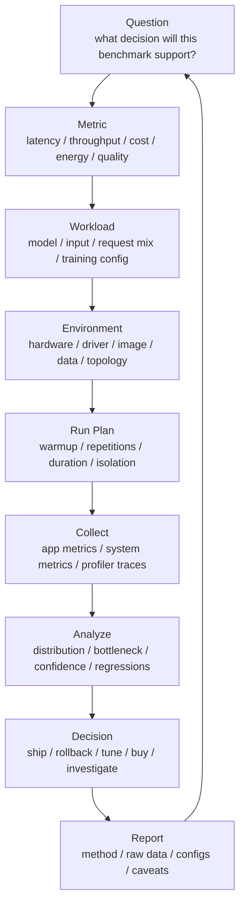

# 性能分析与 Benchmark 方法论：指标、实验设计与瓶颈定位

AI 系统里的性能结论很容易出错。

常见说法包括：

- “这个模型推理更快。”
- “这个 kernel 提升 30%。”
- “这套集群 GPU 利用率更高。”
- “这个调度策略更省钱。”
- “这次升级没有性能回退。”

这些话如果没有指标定义、实验环境、负载说明、统计方法和 profiler 证据，就很难判断真假。性能分析不是跑一个脚本、拿一个数字、画一张图，而是把问题拆成可测量、可复现、可解释的证据链。

本篇是第 8 章的方法论入口，重点回答：

> 做 AI 系统 benchmark 时，应该如何定义问题、选择指标、设计负载、控制变量、采集数据、解释结果和定位瓶颈？

## 一张总图



这张图强调一个原则：benchmark 不是为了得到数字，而是为了支持决策。

如果一开始没有明确问题，后面所有数字都可能变成噪声。

## Benchmark、Profiling、Monitoring 的区别

这三个词经常混在一起，但作用不同。

| 类型 | 问题 | 典型输出 |
| --- | --- | --- |
| Benchmark | 这个系统在规定负载下表现如何？ | latency、throughput、tokens/s、cost/token |
| Profiling | 时间和资源花在哪里？瓶颈是什么？ | trace、operator time、kernel timeline、通信等待 |
| Monitoring | 生产环境现在是否健康？ | dashboards、alerts、SLA、error rate、resource usage |

三者关系是：

```text
monitoring finds symptoms
benchmark reproduces and compares
profiling explains why
```

例如推理 p99 变差：

- Monitoring 告诉你 p99 变差。
- Benchmark 复现某类请求在某版本下变慢。
- Profiling 发现 KV cache 命中下降或某个 kernel fallback。

只做 monitoring，不知道原因；只做 benchmark，不知道生产是否真实发生；只做 profiling，可能优化了一个不影响业务的问题。

## 从问题开始

一个好的 benchmark 问题应该能直接导向决策。

不好的问题：

```text
哪个框架更快？
这个优化有没有用？
这张卡性能怎么样？
```

更好的问题：

```text
在 Qwen/Llama 类 70B 模型、输入 2k、输出 512、p99 < 2s 的约束下，
vLLM 版本 A 和版本 B 哪个能承载更多并发请求？

在 8 x H100 节点上，把 batch size 从 512 提到 1024 后，
训练 step time、MFU、loss 曲线和显存峰值如何变化？

在现有 RDMA 网络下，64 GPU 到 256 GPU 扩展时，
step time 增加主要来自计算、通信、数据还是 checkpoint？
```

好的问题通常包含：

- workload。
- 硬件和环境。
- 目标指标。
- 约束条件。
- 对比对象。
- 决策目的。

## 指标分类

### 延迟指标

推理常用：

- TTFT：time to first token。
- TPOT：time per output token。
- E2E latency：请求总延迟。
- queueing latency：调度/排队等待。
- prefill latency。
- decode latency。
- p50/p90/p95/p99/p999。

训练常用：

- step time。
- data loading time。
- forward time。
- backward time。
- optimizer time。
- communication time。
- checkpoint time。
- time to first step。

延迟指标必须说明统计对象。p99 是按请求、按 token、按 batch，还是按 step 统计，含义完全不同。

### 吞吐指标

推理常用：

- requests/sec。
- input tokens/sec。
- output tokens/sec。
- total tokens/sec。
- successful requests/sec。
- tokens/sec/GPU。

训练常用：

- samples/sec。
- tokens/sec。
- steps/hour。
- effective tokens/sec。
- tokens/sec/GPU。
- global batch/sec。

吞吐必须和质量、延迟、错误率一起看。一个系统可以通过堆 batch 提高吞吐，但把 p99 延迟打爆。

### 效率指标

常见：

- GPU utilization。
- SM utilization。
- HBM bandwidth。
- MFU：model FLOPs utilization。
- scaling efficiency。
- communication ratio。
- cache hit rate。
- memory footprint。
- power efficiency。

效率指标适合解释瓶颈，但不能单独代表业务价值。

例如 GPU utilization 高，可能是有效计算，也可能是低效 kernel 忙等；MFU 高说明训练计算效率好，但不说明数据、checkpoint 和排队成本低。

### 成本指标

常见：

- cost/request。
- cost/token。
- cost/1M tokens。
- cost/training token。
- cost/successful experiment。
- GPU hour per checkpoint。
- wasted GPU hour。

成本指标必须说明成本口径：

- 只算 GPU 还是包含 CPU、内存、网络、存储、电力。
- 用采购摊销还是云上价格。
- 是否计入失败重试。
- 是否计入空闲保留容量。
- 是否计入人工排障成本。

### 能效指标

常见：

- tokens/joule。
- joules/token。
- requests/kWh。
- training tokens/kWh。
- power draw。
- energy per successful request。

能效不是“功耗越低越好”。低功耗低吞吐可能更差，高功耗高吞吐可能更省。

## 指标必须成对解释

单个指标往往会误导。

| 单看指标 | 容易误判 | 应该配套看 |
| --- | --- | --- |
| throughput | 可能牺牲尾延迟 | p95/p99、error rate |
| latency | 可能低并发下很好看 | concurrency、throughput |
| GPU utilization | 可能是无效忙等 | tokens/sec、step time、profiler |
| MFU | 可能忽略数据和 checkpoint | end-to-end time |
| cost/token | 可能牺牲质量 | quality/eval score |
| p99 | 可能样本不足 | sample size、duration |
| average step time | 可能掩盖 checkpoint spike | distribution、timeline |

好的 benchmark 报告通常不是一个数字，而是一组互相约束的指标。

## Workload 设计

Benchmark 的 workload 必须代表你关心的真实场景。

### 推理 Workload

至少说明：

- 模型名称和参数规模。
- 权重格式和量化方式。
- tokenizer 和 chat template。
- 输入长度分布。
- 输出长度分布。
- 并发请求数。
- 请求到达过程：固定并发、固定 QPS、Poisson、trace replay。
- sampling 参数。
- batch 策略。
- prefix cache 是否命中。
- KV cache 容量。
- 是否包含模型加载和 warmup。

只用一个固定 prompt 跑推理 benchmark，通常无法代表真实服务。

### 训练 Workload

至少说明：

- 模型结构和参数规模。
- sequence length。
- global batch size。
- micro batch size。
- gradient accumulation。
- precision。
- optimizer。
- parallelism：DP/TP/PP/EP/FSDP/ZeRO。
- dataset 或 synthetic data。
- checkpoint 策略。
- compile/fusion 是否启用。
- 训练步数和 warmup 步数。

如果使用 synthetic data，要明确说明。synthetic data 可以隔离计算瓶颈，但不能代表真实 data pipeline。

### 系统 Workload

集群和基础设施 benchmark 还要定义：

- job arrival pattern。
- job size distribution。
- node pool。
- queue policy。
- preemption policy。
- storage path。
- checkpoint frequency。
- network topology。
- failure/retry 行为。

系统 benchmark 最容易犯的错误是只测试单任务峰值，而不测试多租户、排队、存储和故障恢复。

## 控制变量

Benchmark 要尽量一次只改变一个因素。

常见变量包括：

- 硬件型号。
- GPU 数量。
- driver。
- CUDA/NCCL/cuDNN。
- framework version。
- serving engine version。
- compiler flags。
- model weights。
- quantization。
- batch size。
- sequence length。
- data path。
- node topology。
- network load。
- power/thermal state。

如果一次改变多个变量，结果就很难解释。

例如：

```text
old: A100 + CUDA 11 + PyTorch 2.1 + NCCL 2.x + old image
new: H100 + CUDA 12 + PyTorch 2.4 + NCCL 2.y + new image
```

即使性能提升 3 倍，也无法知道贡献来自硬件、框架、驱动、kernel、batch size 还是拓扑。

## 环境记录

任何可复现 benchmark 都应该记录环境。

最低要求：

```text
git commit
image digest
model artifact digest
dataset or prompt set digest
hardware model
gpu count
driver version
cuda runtime
framework version
serving/training engine version
nccl version
node list
topology
command and config
environment variables
```

对于 AI Infra，环境记录和第 7 章的“环境可复现”是同一件事的 benchmark 版本。

## Warmup

AI 系统通常有明显 warmup 阶段。

推理 warmup 可能包括：

- 模型加载。
- 权重搬运。
- CUDA context 初始化。
- kernel autotune。
- TorchInductor/Triton JIT。
- TensorRT engine build/load。
- CUDA graph capture。
- KV cache 初始化。
- prefix cache 预热。

训练 warmup 可能包括：

- DataLoader worker 启动。
- page cache 预热。
- first step 编译。
- memory allocator 稳定。
- optimizer state 初始化。
- NCCL communicator 建立。

所以报告要明确：

- 是否包含 cold start。
- 是否剔除 warmup。
- warmup 做了多少 step 或多少秒。
- warmup 后是否达到 steady state。

冷启动和稳态是两个不同问题。推理服务上线可能关心 cold start；长期吞吐则关心 steady state。

## 样本量与统计

Benchmark 结果不能只跑一次。

至少关注：

- 重复次数。
- 持续时间。
- 均值。
- 中位数。
- 标准差。
- p95/p99。
- 置信区间。
- 异常值。
- 是否存在周期性波动。

对于延迟，分布比平均值重要。一个系统平均延迟很好，但 p99 很差，在线服务仍然不可接受。

对于训练，除了平均 step time，还要看：

- step time distribution。
- checkpoint spike。
- eval step。
- data loading stall。
- straggler。

## A/B 对比

A/B benchmark 的核心是公平对比。

需要保证：

- 同一 workload。
- 同一硬件或等价硬件。
- 同一数据/模型。
- 同一输入分布。
- 同一并发和到达过程。
- 同一 warmup 策略。
- 同一测量窗口。
- 同一错误处理。
- 同一统计方法。

报告中要明确：

```text
A changed what?
B changed what?
what remained fixed?
what could not be controlled?
```

如果 B 比 A 快 20%，但 B 的输出长度更短、错误率更高或请求被截断，这不是性能提升。

## Ablation

Ablation 用来回答“哪个因素贡献了提升”。

例如一个推理优化组合包括：

- prefix cache。
- chunked prefill。
- quantization。
- CUDA graphs。
- scheduler 改动。

应该尽量拆成：

```text
baseline
baseline + prefix cache
baseline + chunked prefill
baseline + quantization
baseline + CUDA graphs
all enabled
```

Ablation 的目标不是穷举所有组合，而是避免把多个优化混在一起后无法解释。

## Profiler 证据

Benchmark 告诉你“发生了什么”，profiler 告诉你“为什么”。

### 推理 Profiling

关注：

- prefill 时间。
- decode 时间。
- scheduler queue。
- batch formation。
- KV cache allocation。
- kernel timeline。
- CPU tokenization。
- sampling。
- network transfer。
- model loading。

### 训练 Profiling

关注：

- forward。
- backward。
- optimizer。
- all-reduce/all-gather/reduce-scatter。
- all-to-all。
- pipeline bubble。
- data loading。
- activation checkpoint recompute。
- memory allocation。
- checkpoint save。

### 系统 Profiling

关注：

- CPU flamegraph。
- kernel syscall。
- network retransmit。
- storage latency。
- metadata pressure。
- scheduler latency。
- container startup。
- image pull。

NVIDIA Nsight Systems 适合看 CPU/GPU timeline、CUDA kernel、通信和系统级时间线；PyTorch Profiler 适合从框架和 operator 角度分析训练/推理执行；DCGM 更适合持续监控 GPU telemetry。

## 瓶颈定位路径

一个常用路径：

```text
1. 先看端到端指标
2. 拆分阶段
3. 找最大耗时或最大波动
4. 对照资源指标
5. 用 profiler 验证
6. 做最小实验复现
7. 再优化
```

不要一上来就优化 kernel。很多 AI 系统瓶颈不在 kernel，而在：

- 输入长度分布。
- batching。
- KV cache。
- tokenizer。
- CPU 数据准备。
- 网络通信。
- checkpoint。
- 存储小文件。
- 调度排队。
- 模型加载。

## 常见瓶颈模式

| 现象 | 可能原因 | 需要证据 |
| --- | --- | --- |
| GPU utilization 低 | CPU/DataLoader/调度等待 | profiler、CPU、storage metrics |
| HBM 带宽高，SM 不高 | memory-bound | roofline、kernel metrics |
| 训练 scaling 差 | 通信或同步等待 | NCCL trace、step breakdown |
| p99 很差，平均正常 | 排队、cache miss、straggler | latency distribution、trace |
| TTFT 高 | prefill、模型加载、batching | phase metrics |
| TPOT 高 | decode kernel、KV cache、batch policy | decode timeline |
| checkpoint spike | 存储吞吐、同步写 | checkpoint duration、storage metrics |
| 同节点慢 | 硬件/拓扑/温度/driver | node comparison、DCGM |
| 升级后变慢 | kernel fallback、编译行为变化 | profiler diff、env diff |

## 合成负载与真实负载

合成负载适合隔离变量：

- 固定 shape。
- 固定 batch。
- 固定输入长度。
- synthetic tensor。
- 无真实数据读取。

真实负载适合验证生产表现：

- 真实 prompt 分布。
- 真实输出长度。
- 真实数据 pipeline。
- 真实并发波动。
- 真实存储和网络路径。

两者都需要。只做真实负载，难以定位；只做合成负载，容易高估系统。

## Benchmark 分层

建议分成四层。

### Microbenchmark

目标：测单个组件。

例子：

- matmul。
- attention kernel。
- NCCL all-reduce。
- NVMe read。
- tokenizer throughput。

价值：定位明确。

风险：不能代表端到端。

### Component Benchmark

目标：测子系统。

例子：

- DataLoader。
- KV cache allocator。
- batching scheduler。
- checkpoint writer。
- model loader。

价值：能解释系统瓶颈。

风险：需要设计接口和输入。

### End-to-End Benchmark

目标：测完整训练或推理链路。

例子：

- LLM serving benchmark。
- full training step benchmark。
- RAG query benchmark。
- distributed training benchmark。

价值：接近用户体验。

风险：变量多，解释困难。

### Production Replay

目标：用生产 trace 或近似 trace 复现真实负载。

价值：最接近真实。

风险：数据隐私、可重复性、噪声和成本。

## 报告模板

一份 benchmark 报告至少包含：

```text
1. Question
2. Conclusion
3. Workload
4. Environment
5. Metrics
6. Run Method
7. Results
8. Analysis
9. Profiler Evidence
10. Caveats
11. Raw Data / Config / Commit
```

结论要写在前面，但必须能被后面的证据支撑。

### 结果表不要只放平均值

推理例子：

| Version | QPS | TTFT p50 | TTFT p99 | TPOT p50 | TPOT p99 | Error Rate |
| --- | --- | --- | --- | --- | --- | --- |
| A | 100 | 120ms | 900ms | 20ms | 80ms | 0.1% |
| B | 120 | 140ms | 1800ms | 18ms | 120ms | 0.1% |

B 的吞吐更高，但 p99 变差。是否可接受取决于服务 SLA。

训练例子：

| Version | Step Time | Tokens/s | MFU | Checkpoint Time | Failure Rate |
| --- | --- | --- | --- | --- | --- |
| A | 1.2s | 1.0M | 45% | 120s | 1% |
| B | 1.1s | 1.1M | 50% | 240s | 3% |

B 的 step 更快，但 checkpoint 和失败率变差，端到端未必更好。

## Regression Detection

性能回归要尽早发现。

建议把关键 benchmark 纳入：

- nightly。
- release candidate。
- driver/CUDA/framework 升级。
- serving engine 升级。
- kernel/compiler 改动。
- node image 改动。

回归检测要注意：

- 允许自然波动范围。
- 设置统计阈值。
- 固定环境和 workload。
- 保留历史趋势。
- 记录变更元数据。

不要用过于敏感的阈值制造噪声，也不要用过于宽松的阈值放过真实回退。

## 容量建模入口

Benchmark 结果最终要服务容量模型。

最基础的推理容量关系：

```text
required_replicas = target_qps / per_replica_qps_at_sla
```

但这里的 `per_replica_qps_at_sla` 必须来自有效 benchmark，而不是峰值吞吐。

训练容量关系：

```text
training_time = total_tokens / effective_tokens_per_second
```

但 effective tokens/sec 要考虑：

- data loading。
- checkpoint。
- eval。
- failure/restart。
- scaling efficiency。
- queue wait。

因此 benchmark 的目标不是得到峰值，而是得到容量模型可以信任的参数。

## 常见误区

### 误区一：单次运行结果可以代表性能

AI 系统波动很大。单次结果只能当线索，不能当结论。

### 误区二：平均值能代表用户体验

在线推理更关心尾延迟；训练更关心周期性 spike、失败恢复和长时间稳定性。

### 误区三：合成负载结果可以直接代表生产

合成负载适合定位，不适合直接承诺 SLA。

### 误区四：GPU utilization 高就说明系统好

可能只是低效 kernel 或 busy wait。必须配合吞吐、延迟和 profiler。

### 误区五：只优化最大 kernel 一定有效

最大 kernel 可能不是端到端瓶颈。Amdahl's law 会限制局部优化收益。

### 误区六：Benchmark 只需要工程师能复现

如果报告不能让别人理解 workload、环境和限制，结果就难以积累成知识库。

## 设计检查清单

- Benchmark 是否有明确决策问题。
- 指标是否有清晰定义。
- 是否区分 latency、throughput、efficiency、cost、energy。
- 是否同时报告平均值和尾部指标。
- Workload 是否代表目标场景。
- 是否记录模型、数据、prompt、配置和输入分布。
- 是否记录硬件、driver、CUDA、框架和镜像 digest。
- 是否说明 warmup 策略。
- 是否有足够重复次数和持续时间。
- 是否控制变量。
- 是否有 A/B 的公平性说明。
- 是否有 ablation 分析。
- 是否有 profiler 证据。
- 是否保留 raw data。
- 是否说明 caveats。
- 是否能被别人复现。
- 结果是否能进入容量模型。

## 小结

AI 系统性能分析的核心不是“跑出更好看的数字”，而是建立可信证据链：

```text
question
  -> metric
  -> workload
  -> environment
  -> run method
  -> measurement
  -> profiling evidence
  -> interpretation
  -> decision
```

真正有价值的 benchmark 应该能让后来的人回答：

- 当时测的是什么。
- 为什么这样测。
- 环境是什么。
- 结果是否稳定。
- 瓶颈在哪里。
- 结论适用于什么范围。
- 能否支撑扩容、上线、回滚或继续优化。

这也是第 8 章后续“推理容量建模”“训练扩展效率”“profiler 工具链”“成本与能效模型”的基础。

## 延伸阅读

- [NVIDIA Nsight Systems User Guide](https://docs.nvidia.com/nsight-systems/UserGuide/index.html)
- [PyTorch Profiler](https://docs.pytorch.org/docs/stable/profiler.html)
- [NVIDIA DCGM Exporter](https://docs.nvidia.com/datacenter/dcgm/latest/gpu-telemetry/dcgm-exporter.html)
- [MLPerf Inference Benchmark](https://mlcommons.org/benchmarks/inference-datacenter/)
- [MLPerf Training Benchmark](https://mlcommons.org/benchmarks/training/)
- [OpenTelemetry Metrics](https://opentelemetry.io/docs/concepts/signals/metrics/)
